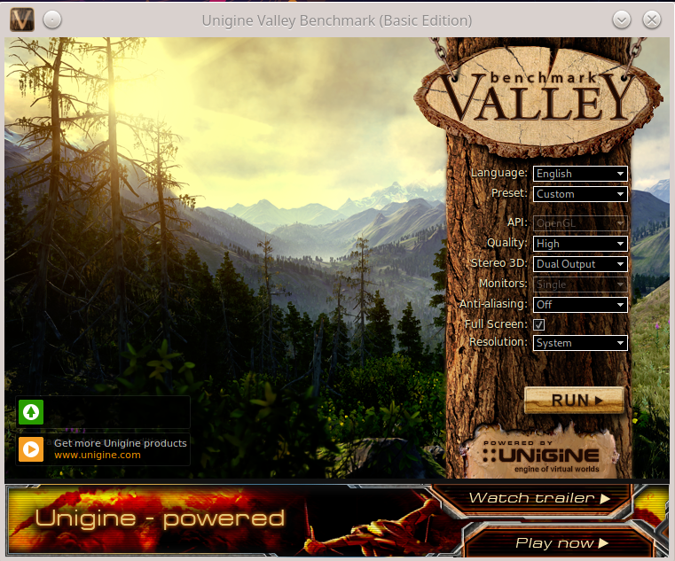

Configurando o Linux para utilizar a placa de vídeo AMD Radeon e não Intel
==========================================================================

Alguns *notebooks* vêm com duas placas de vídeo, tal como uma Intel e outra AMD/Radeon. Todavia, normalmente a placa de vídeo que o sistema utiliza é uma placa sem recursos de GPU e a outra placa de vídeo fica ociosa, mesmo tendo recursos (GPU) que possam ajudar no processamento de imagens. Assim, este *post* apresenta como alterar entre as placas de vídeo, principalmente colocando como placa de vídeo principal a placa que tem mais recursos.

> Atenção: Colocar como principal, a placa de vídeo com mais recursos, pode consumir mais energia/bateria.

# Configuração

Essa configuração foi feita no Manjaro Linux, que é derivante do Arch Linux. No caso do Manjaro os módulos das placas de vídeo já estão carregadas pelo Kernel. Aqui não abordarei como instalar o módulo/*drivers* das placas de vídeo, o foco é ativar/escolher entre as placas já configuradas.

## Identificando as placas de vídeo:

Para identificar as placas de vídeo é possível utilizar o comando ``lspci``:

```console
$ lspci -k | grep -EA3 'VGA|Display|3D'
00:02.0 VGA compatible controller: Intel Corporation HD Graphics 5500 (rev 09)
Subsystem: Dell Device 0643
Kernel driver in use: i915
Kernel modules: i915
--
04:00.0 Display controller: Advanced Micro Devices, Inc. [AMD/ATI] Topaz XT [Radeon R7 M260/M265 / M340/M360 / M440/M445 / 530/535 / 620/625 Mobile]
Subsystem: Dell Radeon R7 M260/M265
Kernel driver in use: amdgpu
Kernel modules: amdgpu
```
Na saída anterior são apresentadas duas placas de vídeo: 
* 1) ``Intel Corporation HD Graphics 5500``;
* 2) ``Advanced Micro Devices, Inc. [AMD/ATI] Topaz XT [Radeon R7 M260/M265 / M340/M360 / M440/M445 / 530/535 / 620/625 Mobile]``.

O comando anterior apresenta o nome da placa de vídeo e o módulo do Kernel que cada uma está utilizando. É possível constatar o carregamento desses módulos com os seguintes comandos - é claro que isso depende de cada caso/placa, no exemplo anterior os módulos são:

* 1) ``Intel``:

```console
$ lsmod | grep -i i915
i915                 2666496  4
i2c_algo_bit           16384  2 amdgpu,i915
drm_kms_helper        266240  2 amdgpu,i915
cec                    73728  2 drm_kms_helper,i915
intel_gtt              24576  1 i915
drm                   585728  16 gpu_sched,drm_kms_helper,amdgpu,i915,ttm
```

* 2) ``AMD Radeon``:

```console
$ lsmod | grep -i amdgpu
amdgpu               6434816  29
gpu_sched              40960  1 amdgpu
ttm                   122880  1 amdgpu
i2c_algo_bit           16384  2 amdgpu,i915
drm_kms_helper        266240  2 amdgpu,i915
drm                   585728  16 gpu_sched,drm_kms_helper,amdgpu,i915,ttm
```
Note que tais módulos também já haviam sido apresentados pelo comando anterior (``lspci -k``).

## Identificando a placa padrão utilizada no sistema:

O comando a seguir mostra qual placa que está sendo utilizada para apresentar/processar os gráficos:

```console
$ glxinfo | grep "OpenGL renderer string"
OpenGL renderer string: Intel Corporation HD Graphics 5500
```

Neste exemplo a placa padrão é a Intel, que não possui grande processamento gráfico, quando comparada à AMD/Radeon. Então, neste exemplo trocaremos a placa padrão para a AMD/Radeon, para que os programas gráficos utilizem a GPU.

## Alterando a placa de vídeo padrão:

Há algumas formas de fazer a alteração da placa de vídeo padrão. A ideia aqui é fazer com que o sistema sempre utilize a placa mais potente, mesmo que isso consuma mais bateria. Tal configuração deve persistir, ou seja, deve valer mesmo que o computador seja reinicializado.

Então para tal configuração, levando em consideração a placa de vídeo que estamos utilizando de exemplo, são necessárias as seguintes configurações:

* 1) Configurar corretamente o módulo do Kernel, editando e/ou criando o arquivo ``/etc/modprobe.d/amdgpu.conf``:

Isso pode ser feito com o seu editor de texto favorito, neste caso foi utilizado o ``vi``:
```console
vi /etc/modprobe.d/amdgpu.conf 
```

Dentro do arquivo ``/etc/modprobe.d/amdgpu.conf`` inclua o seguinte conteúdo:

```console
options amdgpu si_support=1
options amdgpu cik_support=1
```

* 2) Configurar ("setar") qual placa de vídeo que vai ser utilizada. Para isso primeiro temos que ver o número que identifica a ordem de cada placa de vídeo no sistema. Isso pode ser feito com o comando:
 
 ```console
 $ xrandr --listproviders

 Providers: number : 2
 
 Provider 0: id: 0x46 cap: 0xb, Source Output, Sink Output, Sink Offload crtcs: 4 outputs: 3 associated providers: 1 name:Intel
 
 Provider 1: id: 0xa9 cap: 0xd, Source Output, Source Offload, Sink Offload crtcs: 0 outputs: 0 associated providers: 1 name:AMD Radeon R7 M260 @ pci:0000:04:00.0
 ```

Neste caso a placa que queremos é a AMD\Radeon, que é identificada como provedor 1 (``Provider 1``).

Então, identificado isso é necessário editar o arquivo ``/etc/environment``, adicionando/editando a variável ``DRI_PRIME``. Exemplo:

```console
$ vi /etc/environment

DRI_PRIME=1
```

No qual ``1`` é a identificação do provedor (``Provider 1``), identificado pelo comando ``xrandr``.

* 3) Feito isso agora é só reiniciar o computador. 

* 4) Depois que o computador reiniciar, é possível identificar qual é a placa de vídeo que agora está sendo utilizada como padrão. Neste exemplo se tudo funcionou deve aparecer a placa AMD/Radeon. Exemplo:

```console
$ glxinfo | grep "OpenGL renderer string"
OpenGL renderer string: AMD Radeon R7 M260 (ICELAND, DRM 3.39.0, 5.9.16-1-MANJARO, LLVM 11.1.0)
```

A saída do comando anterior indica que agora a placa de vídeo padrão é a AMD/Radeon e não mais a Intel.

## Mudando a placa de vídeo padrão em tempo de execução (sem reiniciar):

É possível mudar a placa de vídeo que está sendo utilizada no sistema com o comando ``xrandr``, sem precisar reiniciar o sistema (sem *reboot*). 

Então, como foi feito anteriormente, utiliza-se o comando ``xrandr --listproviders``, para verificar o número do provedor. Exemplo:

 ```console
$ xrandr --listproviders

Providers: number : 2

Provider 0: id: 0x46 cap: 0xb, Source Output, Sink Output, Sink Offload crtcs: 4 outputs: 3 associated providers: 1 name:Intel

Provider 1: id: 0xa9 cap: 0xd, Source Output, Source Offload, Sink Offload crtcs: 0 outputs: 0 associated providers: 1 name:AMD Radeon R7 M260 @ pci:0000:04:00.0
```

Após identificar tal provedor (qual placa utilizar), também utilizamos o comando ``xrandr``, para configurar ("setar") a placa que vai ser utilizada pelo computador. Exemplo:

```console
$ xrandr --setprovideroffloadsink 1
```

ou 

```console
$ xrandr --setprovideroffloadsink 'AMD Radeon R7 M260 @ pci:0000:04:00.0'
```

**Atenção**: Nos comandos anteriores, a ideia foi utilizar a placa AMD/Radeon, mas seria possível também trocar da placa AMD/Radeon, que estaria como padrão, para a placa Intel. Por exemplo, isso seria feito utilizando o comando ``$ xrandr --setprovideroffloadsink 1`` ou utilizando o nome da placa ``$ xrandr --setprovideroffloadsink Intel``.

> **Observação**, nos meus testes esse último método não funcionou (trocar a placa com ``xrandr``), o ambiente gráfico foi reiniciado e ficava apenas uma tela preta com o ponteiro do mouse, não saia disso. Mas vários sítios da Internet dão essa possibilidade e dizem que funciona.

# Testando a placa de vídeo

Depois de configurar corretamente a placa de vídeo, no caso de escolher uma com GPU, é possível realizar alguns testes para verificar se realmente tal placa está utilizando os recursos disponíveis de forma adequada.

## Benchmarks

Uma forma simples de testar é utilizando o aplicativo ``glxgears``, que abrirá uma janela com algumas engrenagens girando. Tal como na imagem a seguir:


Um teste um pouco mais "complexo" pode ser utilizando um *benckmark* de terceiros, tal como o Valley, que pode ser baixado em <https://benchmark.unigine.com/valley>. Depois de baixar basta dar permissão de execução para o arquivo e executar. Então será extraído um diretório com o executável do *benckmark*, desta forma basta executá-lo. Veja os comandos a seguir:

```console
$ chmod a+x Unigine_Valley-1.0.run 
$ ./Unigine_Valley-1.0.run 
$ cd Unigine_Valley-1.0
$ ./valley
```

Após executar o comando ``./valley`` será aberta uma interface gráfica que permite a execução do *benckmark*/teste - tal interface é bem intuitiva:



No caso da minha placa de vídeo é possível acompanhar o uso das GPUs, memória, dentre outros, com o comando ``radeontop``. Tal como mostra a imagem a seguir:


# Conclusão

Bem, alterar entre as placas de vídeo no Linux dá trabalho mas é possível. No exemplo usado neste *post* o Linux foi configurado para usar a placa de vídeo com mais recursos e não a placa padrão.

# Referência

* <https://wiki.archlinux.org/index.php/AMDGPU>.
* <https://askubuntu.com/questions/1068343/switch-between-intel-amd-gpu-on-18-04>.
* <https://www.unixmen.com/using-hybrid-graphic-card-intel-amd-arch-linux/>.
* <https://wiki.archlinux.org/index.php/PRIME>.
* <https://bbs.archlinux.org/viewtopic.php?id=211646>