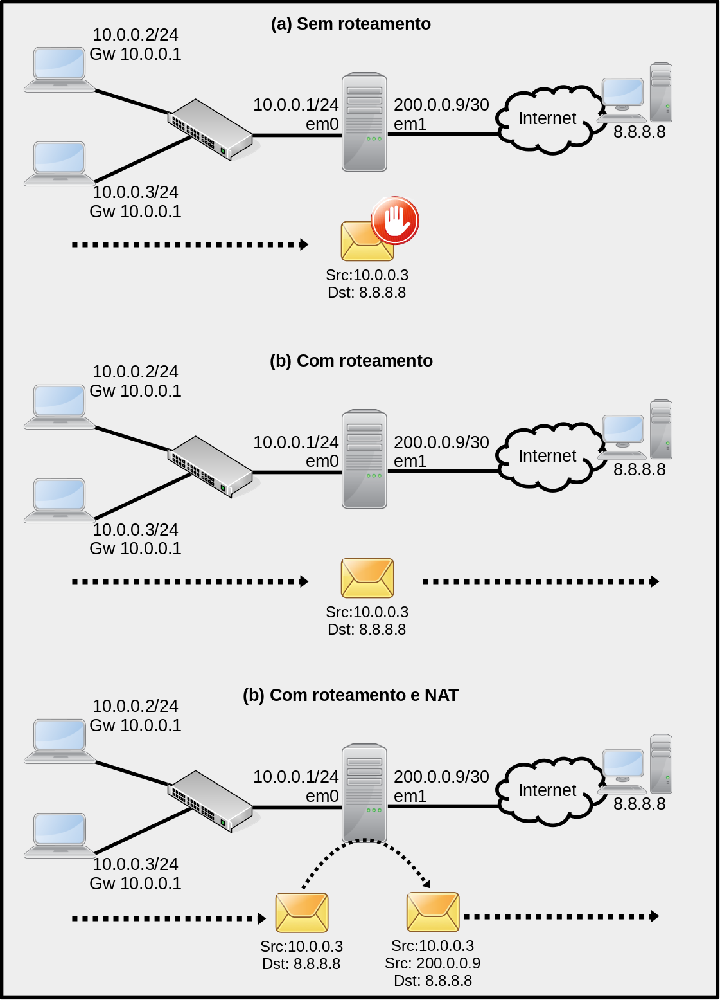

# NAT no OpenBSD

Uma tarefa bem comum para administradores de rede é habilitar [NAT](https://pt.wikipedia.org/wiki/Network_address_translation) em roteadores de borda.
O NAT permite que a Internet funcione até hoje com [IPv4](https://pt.wikipedia.org/wiki/IPv4), ou seja, ele ameniza o [problema da escassez de endereços IP válidos na Internet](https://pt.wikipedia.org/wiki/Exaust%C3%A3o_do_IPv4). Isso é possível através do [mascaramento](https://www.ibm.com/docs/en/i/7.2?topic=translation-masquerade-hide-nat) de endereços IPs privados para endereços IPs válidos na Internet, desta forma várias máquinas podem utiliza um único IP válido para acessar a Internet.

> O NAT tem outras funções, mas o foco neste texto é essa.

Para ilustrar como funciona uma rede com e sem NAT vamos utilizar a Figura 1. Nesta há três cenários, sendo esses:

1. **Sem roteamento**: Nesta o *host* R1, é *multihomed*, ou seja, está conectado em duas redes, mas não faz roteamento entre pacotes desta rede (ver Figura 1a). Pacotes que chegam para ele, tentando cruzar as redes, são descartados. Normalmente todos as *hosts* estão inicialmente neste estado;
2. **Com roteamento habilitado**: Nesta R1, tem o roteamento habilitado, logo os pacotes enviados da rede 10.0.0.0/24 seguindo para outra rede serão encaminhados de R1 para outras redes, se houver rotas. No cenário apresentado na Figura 1b, os pacotes etão indo de uma rede com [IP privado](https://pt.wikipedia.org/wiki/Rede_privada) (10.0.0.0/24) para uma rede pública (Internet), assim, os pacotes não chegariam ao destino (8.8.8.8), pois os roteadores da Internet não fazem roteamento de pacotes originados ou destinados de redes privadas. Isso pode ser contornado com NAT;
3. **Com roteamento habilitado e NAT**: Nesta R1 faz roteamento dos pacotes da rede e ainda, quando um pacote ruma à Internet, este deve ter o seu endereço IP de origem substituído da rede privada (10.0.0.0/24) para o IP válido na Internet do R1 (200.0.0.9). Assim, o pacote vai para a Internet com o IP do roteador e não do *host* da rede privada (ver Figura 1c), e a resposta da Internet é retornada para R1, que deve desfazer a troca de endereços e devolver a resposta para o *host* de origem, dentro da rede 10.0.0.0/24 (isso é feito de forma totalmente transparente aos usuários da rede).

|  |
|:--:|
| Figura 1 - Cenário de rede |

Tomando como exemplo, que iremos utilizar um [OpenBSD](https://www.openbsd.org/) para configurá-lo como roteador/*firewall* de borda. Desta forma, assim que você terminar de instalar o sistema operacional, ele estará como um *host* comum, ou seja, **com o roteamento desabilitado** (que é o padrão).
Então para ele funcionar como roteador é necessário **habilitar o roteamento**, ai ele conseguirá rotear pacotes para rotas presentes no *host* roteador.
Por fim, pode ser necessário **configurar o NAT**, para por exemplo, que *hosts* da LAN acessem a Internet.

Não é objetivo aqui, tratar de toda a teoria envolvida no NAT, nem abordar como redirecionar portas, aqui vamos tratar apenas do mascaramento de pacotes no OpenBSD.


## Habilitando roteamento

Para ativar NAT no OpenBSD, primeiro é necessário ativar o roteamento. Isso é feito utilizando o comando a seguir:

```console
# sysctl  net.inet.ip.forwarding=1
net.inet.ip.forwarding: 0 -> 1
```

Com o comando anterior, o roteamento fica volátil, ou seja, ao reiniciar/desligar o *host*, essa configuração será perdida. Para tal configuração persistir é necessário incluir a opção ``net.inet.ip.forwarding=1``, no arquivo ``/etc/sysctl.conf``. Isso pode ser feito com o seguinte comando:

```console
echo  'net.inet.ip.forwarding=1' >> /etc/sysctl.conf
```

Feito isso o *host* já se tornou um roteador e deve estar enviando pacotes entre as redes.

## Configurando o NAT

O próximo passo é habilitar/configurar o NAT no OpenBSD. Em tal sistema isso é feito através do [PF](https://www.openbsd.org/faq/pf/), que é dentre outras o *firewall* do OpenBSD.

Há várias formas de se configurar o PF para mascarar pacotes. Mas vamos iniciar editando o arquivo '/etc/pg.conf' e incluindo a linha do ``pass out...``, veja saída a seguir:

```console
obsd2023# vi /etc/pf.conf
#	$OpenBSD: pf.conf,v 1.55 2017/12/03 20:40:04 sthen Exp $
#
# See pf.conf(5) and /etc/examples/pf.conf

set skip on lo

pass out on em1 from 10.0.0.0/24 to any nat-to 200.0.0.9
```

Na saída anterior, estamos utilizando um editor de texto (``vi``) para editar o arquivo ``/etc/pf.conf``. Tal arquivo contém comentários (linhas iniciadas com ``#``). Na sequência o firewall é instruído para liberar tudo que for para o *localhost* (``set skip on lo``). Por fim, e mais importante aqui, vem a regra que está fazendo o NAT, que diz que tudo que for sair pela interface ``em1``, vindo da rede 10.0.0.0/24, destinado à qualquer lugar (``any``), deve ter o IP de origem alterado para 200.0.0.9 (isso está na última linha do arquivo).

> Lembrando que essas configurações estão seguindo a rede do cenário da Figura 1.

Após realizar tal configuração (principalmente a última linha da saída anterior) é necessário habilitar o PF e pedir para ele recarregar suas configurações, isso é feito com o comando ``pfctl -e`` e depois com ``pfctl -f /etc/pf.conf``. Ver saída a seguir:

```console
obsd2023# vi /etc/pf.conf

obsd2023# pfctl -e
pfctl: pf already enabled
obsd2023# pfctl -f /etc/pf.conf
```

Com isso, a rede já deve estar mascarando os pacotes que saem da LAN para a Internet.

Todavia, dá para fazer algumas melhorias, por exemplo a rede da LAN pode mudar e principalmente o IP da interface de saída para a Internet, pode ter um IP dinâmico, ou seja, esse IP muda de tempos em tempos, mas anteriormente configuramos esse IP de forma estática (200.0.0.9) - se esse IP mudar a rede como está vai parar. Então, para que isso não aconteça, podemos configurar a regra de NAT do PF da seguintes forma:

```console
obsd2023# vi /etc/pf.conf
#	$OpenBSD: pf.conf,v 1.55 2017/12/03 20:40:04 sthen Exp $
#
# See pf.conf(5) and /etc/examples/pf.conf

set skip on lo

pass out on em1 from em0:network to any nat-to (em1)
```
Após a alteração lembre-se de recarregar o PF:

```console
# pfctl -f /etc/pf.conf
```

Bem, essa seria a configuração básica para o OpenBSD realizar mascaramento de pacotes em redes de computadores.

## Referências

* <https://www.openbsd.org/faq/pf/nat.html>
