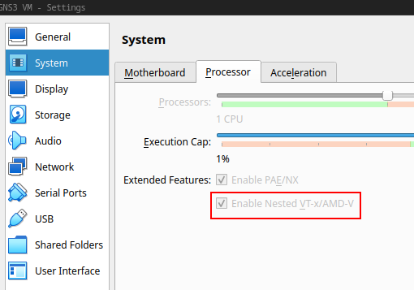

# Virtualização Nested no KVM

[Nested Virtualization](https://pve.proxmox.com/wiki/Nested_Virtualization) permite ativar os benefícios das técnicas de virtualização dentro de um ambiente já virtualizado. Ou seja, é para executar uma VM dentro de outra VM, sem perder muita performance, removendo assim uma possível camada de software (*overhead*) e deixando a VM dentro da VM conversar "diretamente" com o hardware do hospedeiro.

# Habilitando Nested no Linux

Para habilitar a Virtualização Nested no Linux, primeiro é necessário verificar se hardware do hospedeiro possui suporte a este tipo de recurso:

```console
$ cat /sys/module/kvm_intel/parameters/nested
Y
```
Para isso basta verificar o conteúdo do arquivo ``nested``, tal arquivo deve ter o conteúdo ``1`` ou ``Y``, ver saída anterior. Tendo esse resultado, é possível habilitar o Nested Virtualization. Com os seguintes comandos:

```console
$ sudo modprobe -r kvm_intel
$ sudo modprobe kvm_intel nested=1
```

O exemplo anterior foi para processadores Intel, no caso de AMD troque de ``kvm_intel`` para ``kvm_amd``.

# Habilitando Nested no VirtualBox

Bem, depois de habilitar o Nested Virtualization no sistema operacional do hospedeiro, é necessário configurar isso no software de virtualização, neste exemplo será o [VirtualBox](https://www.virtualbox.org/).

Isso pode ser feito no ambiente gráfico, através do menu do VirtualBox de cada VM: ``Settings->System->Processor-> Extended Features``, neste é necessário marcar a opção ``Enable Nested VT-x/AMD-V``. Todavia, pode ser que o gráfico não deixe clicar (esteja cinza - ver Figura 1, só que na figura de exemplo a opção já está marcada, a ideia é que inicialmente ela estará desmarcada). Então, é recomendável realizar tal atividade via comando/console:

## Procurar o nome da VM

Vamos iniciar procurando o nome da Vm:

```console
$ VBoxManage list vms
"Metasploitable3-ub1404" {28853c7f-9aef-4623-8fb0-38057c26b026}
"vitima2023" {9f8abba8-d919-471a-a07a-9e7405507eec}
"kali-linux-2023.1-virtualbox-amd64" {54b27b18-9842-4555-b9ac-4881205f19d1}
"ciberseguranca-utfpr-2022" {9c2c748d-e7af-4a3b-a9ed-ecbfd2284627}
"obsd2023" {f02eb80b-976d-4b9b-b19a-c6ce57f4abe2}
"GNS3 VM" {2c9953c5-150e-49bf-bf9c-e9546acbda87}
```

Neste caso foram apresentados nome e IDs de VM do sistema, o que nos interessa, neste exemplo é o ``GNS3 VM``.

## Habilitando efetivamente o Nested no VirtualBox via comando

Sabendo o nome da VM basta executar o seguinte comando para habilitar o Nested Virtualization:

```console
$ VBoxManage modifyvm "GNS3 VM" --nested-hw-virt on
```

|  |
|:--:|
| Figura 1 - Nested Virtualization habilitado no VirtualBox |

Com esse resultado (opção ``Enable Nested VT-x/AMD-V`` marcada), agora é possível executar outro ambiente de virtualização dentro deste VirtualBox com um desempenho razoável.

> Para realizar o mesmo passo no Windows veja as referências a seguir, mas basicamente são os mesmos passos, na questão do VirtualBox.

# Referências

* <https://pve.proxmox.com/wiki/Nested_Virtualization>

* <https://blog.scottlowe.org/2016/11/10/intro-to-vbox-cli/>

* <https://stackoverflow.com/questions/54251855/virtualbox-enable-nested-vtx-amd-v-greyed-out>

