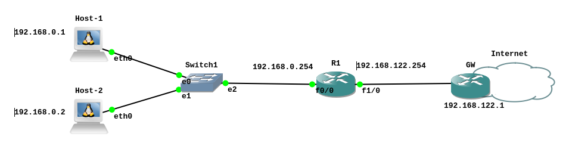

# NAT em roteadores CISCO

Basicamente, qualquer rede hoje em dia utiliza a técnica de [NAT](https://pt.wikipedia.org/wiki/Network_address_translation). O NAT é responsável por permitir que o IPv4 continue funcionando na Internet, pois permite que LANs contendo diversos *hosts* acessem a Internet utilizando apenas um endereço IP válido. Desta forma, o NAT ameniza o maior problema da Internet atual, que é a escassez de endereços IPv4 válidos na Internet.

Assim, é muito importante para administradores de rede saber como funciona e como configurar NAT em redes. Desta forma, vamos utilizar o exemplo da rede da Figura 1, para entender como configurar o mascaramento NAT, em um roteador CISCO.


|  |
|:--:|
| **Figura 1 - Rede com NAT** |


A seguir são apresentados os passos básicos para a configuração de SNAT (**Source NAT**) em um roteador CISCO (o do exempĺo foi um 7200).

Comummente, o processo de configuração de NAT em roteador CISCO, inicia com a atribuição normal de IP e máscara nas interfaces de rede do roteador. Todavia, acrecido do passo de identificar se a interface de rede é interna ou externa (``inside`` ou ``outside``), sendo que:

* Uma interface interna/*inside* vai estar conectada a uma rede, que terá o seu IP de origem substituído, para dar lugar ao IP do roteador, do lado da interface externa/*outside*.

* Já uma interface outside/inside vai estar conectada a uma rede, pelos quais os pacotes das redes internas serão normalmente destinadas, tal como a Internet. Assim, o IP da interface *outside* substituirá os IPs dos datagramas IPs que vêm dos hosts conectados nas interfaces *inside*.

> Se você não conhece o processo de NAT, pesquise por materiais teóricos mais detalhados na Internet. É bem comum não entender como funciona o NAT de inicio, o que pode comprometer a implementação prática do NAT.

As duas subseções a seguir mostram como configurar as interfaces internas e externas.

## Configurando interface externa

No exemplo da Figura 1, iniciou-se a configuração da interface externa ``f1/0``, com o IP 192.168.122.254. Veja todos os comandos utilizados a seguir:


```console
R1#enable
R1#configure terminal
Enter configuration commands, one per line.  End with CNTL/Z.
R1(config)#interface f1/0
R1(config-if)#ip address 192.168.122.254 255.255.255.0
R1(config-if)#ip nat outside
R1(config-if)#no shutdown
R1(config-if)#
```
No contexto do NAT, foi adicionado o comando ``ip nat outside``, que significa que esta interface será responsável por realizar NAT nos pacotes que forem roteados para ``f1/0``. Assim, os IPs dos pacotes das outras redes que tiverem como caminho/rota a interface ``f1/0``, vão ter o IP de origem substituído pelo IP 192.168.122.254, que é o IP desta interface.

## Configurando interface interna

A interface de rede ``f0/0``, foi configurada na rede 192.168.0.0/25, com o IP 192.168.0.254. No contexto do NAT em CISCO, essa interface foi configurada como interna, com o comando ``ip nat inside``.

```console
R1(config-if)#interface f0/0
R1(config-if)#ip address 192.168.0.254 255.255.255.0
R1(config-if)#ip nat inside
R1(config-if)#no shutdown
R1(config-if)#exit
```

Neste exemplo, os pacotes que vierem da rede 192.168.0.0/24 e tiverem como destino a Internet (ou a rede 192.168.122.0/24) vão ter o IP de origem substituído pelo IP da interface ``f1/0`` do roteador (que é o IP 192.168.122.254 - interface ``outside``).


## Criando lista de acesso, NAT e roteamento

O próximo passo é determinar quem (rede/*hosts*) deve sofrer o processo de NAT e qual interface/IP vai ser utilizado como saída do NAT (ver comandos a seguir).

```console
R1(config)#access-list 1 permit 192.168.0.0 0.0.0.255
R1(config)#ip nat inside source list 1 interface f1/0 overload
R1(config)#ip route 0.0.0.0 0.0.0.0 192.168.122.1
R1(config)#exit
```
Nos comandos apresentados, a lista de redes/*hosts* que vão sofrer NAT é feita pelo comando ``access-list``.

Depois é realizado o comando que informa a quem será aplicado o NAT, e qual será a interface/IP de saída. Isso é feito pelo comando ``ip nat``.


Por fim, neste exemplo, o roteador R1 também teve configurado um *gateway* padrão ``ip route``. Essa passo pode ser feito de outras formas (ex. comandos ou roteamento dinâmico).

Com todos esses comandos realizados em R1, agora todos os pacotes que vierem da rede 192.168.0.0/24, com destino a rede 192.168.122.0/24 e principalmente para a Internet, vão ter o IP de origem substituídos pelo IP 192.168.122.254 (IP da interface externa).


## Visualizando fluxos de redes que sofreram NAT

É possível verificar as máquinas que estão sofrendo o processo de NAT em roteadores CISCO, com o comando ``show ip nat translations``, veja a saída de exemplo a seguir:

```console
R1#show ip nat translations
 Pro Inside global      Inside local       Outside local      Outside global
 icmp 192.168.122.254:3 192.168.0.1:3      142.251.128.99:3   142.251.128.99:3
 icmp 192.168.122.254:4 192.168.0.1:4      142.250.218.67:4   142.250.218.67:4
 udp 192.168.122.254:34512 192.168.0.1:34512 8.8.8.8:53       8.8.8.8:53
 udp 192.168.122.254:36514 192.168.0.1:36514 8.8.8.8:53       8.8.8.8:53
 udp 192.168.122.254:48216 192.168.0.1:48216 8.8.8.8:53       8.8.8.8:53
 udp 192.168.122.254:59252 192.168.0.1:59252 8.8.8.8:53       8.8.8.8:53
R1#
```
Na saída anterior, é possível observar que o ``host`` 192.168.0.1 está realizando algum tipo de acesso na Internet, por exemplo, para o ``host`` 8.8.8.8 via DNS (UDP/53).

## Lista completa de comandos utilizados:

Segue a lista completa e contiguá de comandos utilizados neste exemplo:

```console
R1#enable
R1#configure terminal
Enter configuration commands, one per line.  End with CNTL/Z.
R1(config)#interface f1/0
R1(config-if)#ip address 192.168.122.254 255.255.255.0
R1(config-if)#ip nat outside
R1(config-if)#no shutdown
R1(config-if)#interface f0/0
R1(config-if)#ip address 192.168.0.254 255.255.255.0
R1(config-if)#ip nat inside
R1(config-if)#no shutdown
R1(config-if)#exit
R1(config)#access-list 1 permit 192.168.0.0 0.0.0.255
R1(config)#ip nat inside source list 1 interface f1/0 overload
R1(config)#ip route 0.0.0.0 0.0.0.0 192.168.122.1
R1(config)#exit
R1#show ip nat translations
```

## Conclusão

Neste documento foi apresentado os passos para se realizar SNAT (Source NAT) em pacotes que cruzam roteadores CISCO. Esse é um processo/tarefa bem comum em qualquer rede de computadores.
