# **Guia Prático: NIDS com Suricata e Evebox**

<div align="center">
  
</div>

## Introdução ao Suricata

O [Suricata](https://suricata.io/) é um **IDS** (*Intrusion Detection System*), mas também pode atuar como **IPS** (*Intrusion Prevention System*). Ele é um software **Open Source**, mantido pela [OISF](https://suricata.io/our-story/oisf/) (Open Information Security Foundation), projetado para **monitorar tráfego de rede em tempo real, detectar ameaças e até mesmo responder a ataques**, dependendo da configuração.

Então o Suricata é um **motor de detecção de ameaças de rede de alto desempenho** que vem se firmando como uma das ferramentas mais poderosas e flexíveis para a segurança de redes. O Suricata **surgiu da necessidade de superar as limitações de desempenho** das ferramentas de sua época, sendo então projetado desde o início com uma arquitetura **multi-threaded**. Isso significa que ele é capaz de utilizar múltiplos núcleos de processamento (CPUs) simultaneamente para analisar o tráfego de rede, **permitindo a inspeção de grandes volumes de dados em redes de alta velocidade** (*gigabits* por segundo) sem perda de pacotes.

O Suricata pode operar em diferentes modos, sendo os principais:

*   **NIDS (Network Intrusion Detection System)**: Neste modo, o Suricata monitora o tráfego da rede de forma passiva. Ele analisa os pacotes em busca de atividades maliciosas ou suspeitas e, ao encontrar uma correspondência com suas regras, gera um alerta detalhado. Neste modo ele **somente gera alertas**, mas não toma ações para impedir ataques.
*   **IPS (Network Intrusion Prevention System)**: Em modo de prevenção, além de detectar ameaças, ele pode tomar ações para bloqueá-las em tempo real, como descartar pacotes maliciosos ou encerrar conexões suspeitas. Aqui, ele **alerta e toma ações frente a possíveis ameaças**, ou seja, trabalha de forma pró-ativa.

Uma de suas grandes vantagens do Suricata é: 

* **Compatibilidade com os conjuntos de regras do [Snort](https://www.snort.org/)**, o pioneiro dos NIDS, o que facilitou sua adoção e migração. 
* **Detecção automática de protocolos**, que lhe permite identificar serviços como HTTP, DNS ou SMB, independentemente da porta em que estejam operando. 
* **Extrair arquivos** de fluxos de tráfego para análise posterior e gera *logs* no formato **EVE JSON**, um formato estruturado e rico em detalhes, ideal para integração com ferramentas de visualização e análise como o [Evebox](https://evebox.org/) e o [Elastic Stack](https://www.elastic.co/elastic-stack) (ELK).

Devido à sua performance e flexibilidade, o Suricata é **amplamente utilizado em ambientes que vão desde pequenas empresas** e redes domésticas, até **grandes corporações e provedores de serviços de Internet**, sendo uma peça fundamental em qualquer estratégia de monitoramento de segurança de rede (NSM - *Network Security Monitoring*).

## Instalação e Uso

Nesta seção, vamos abordar o processo de instalação e configuração do Suricata em um sistema operacional baseado em Debian/Ubuntu. Em seguida, faremos o mesmo para o Evebox, que é a interface que usaremos para visualizar os alertas gerados.

> Os passos de instalação realizados aqui forma executados em *containers* [Dockers](https://www.docker.com/) dentro do simulador de redes [GNS3](https://www.gns3.com/).

### Instalando o Suricata

O primeiro passo é preparar o sistema e instalar o Suricata. Para garantir que teremos acesso à versão estável mais recente, adicionaremos o repositório PPA (*Package Personal Package Archive*) oficial mantido pelos desenvolvedores do Suricata.

A seguir são apresentados quatro comandos utilizados para a instalação:

```console
root@IDS:/# apt update

root@IDS:/# apt-get install software-properties-common

root@IDS:/# add-apt-repository ppa:oisf/suricata-stable

root@IDS:/# apt install suricata
```

Os comandos a anterior irão, respectivamente: 
* atualizar a lista de pacotes do seu sistema; 
* instalar o `software-properties-common`, que é necessário para gerenciar repositórios; 
* instalar o pacote `software-properties-common`, necessário para gerenciar repositórios; 
* adicionar o repositório `ppa:oisf/suricata-stable`; 
* instalar o pacote do Suricata.
* e, finalmente, instalar o pacote do Suricata.

> Note que há outras formas de se instalar, ou por outro gerenciador de pacote de outras distribuições Linux, ou mesmo, instalando via código fonte, para mais informações veja <https://suricata.io/download/>

### Baixando/atualizando regras do Suricata

Com o Suricata instalado, o **próximo passo é obter e manter atualizado o conjunto de regras que ele utiliza para detectar ameaças**. As regras são a inteligência do NIDS; **elas definem as assinaturas de ataques**, comportamentos maliciosos e anomalias que o Suricata deve procurar no tráfego de rede. Sem regras, o Suricata é como um cão de guarda sem treinamento: ele está lá, mas não sabe o que procurar.

O comando `suricata-update` foi criado para simplificar esse processo. Ao executá-lo, ela se conecta a fontes de regras pré-configuradas (por padrão, o conjunto gratuito *Emerging Threats Open*), baixa as assinaturas mais recentes, processa-as e as instala no local correto para que o Suricata possa utilizá-las. 

É importante saber que **manter as regras atualizadas é fundamental para garantir a eficácia do sistema**, pois novas ameaças e variantes de ataques surgem constantemente. O comando a seguir inicia esse processo de instalação/atualização das regras.

```console
root@IDS:~# suricata-update 

15/9/2025 -- 17:20:11 - <Info> -- Using data-directory /var/lib/suricata.
15/9/2025 -- 17:20:11 - <Info> -- Using Suricata configuration /etc/suricata/suricata.yaml
15/9/2025 -- 17:20:11 - <Info> -- Using /usr/share/suricata/rules for Suricata provided rules.
15/9/2025 -- 17:20:11 - <Info> -- Found Suricata version 8.0.0 at /usr/bin/suricata.
15/9/2025 -- 17:20:11 - <Info> -- Loading /etc/suricata/suricata.yaml
...
15/9/2025 -- 17:20:14 - <Info> -- Loading distribution rule file /usr/share/suricata/rules/files.rules
15/9/2025 -- 17:20:14 - <Info> -- Loading distribution rule file /usr/share/suricata/rules/http2-events.rules
15/9/2025 -- 17:20:14 - <Info> -- Loading distribution rule file /usr/share/suricata/rules/http-events.rules
...
15/9/2025 -- 17:20:14 - <Info> -- Loading distribution rule file /usr/share/suricata/rules/smb-events.rules
15/9/2025 -- 17:20:14 - <Info> -- Loading distribution rule file /usr/share/suricata/rules/smtp-events.rules
15/9/2025 -- 17:20:14 - <Info> -- Loading distribution rule file /usr/share/suricata/rules/ssh-events.rules
...
15/9/2025 -- 17:20:18 - <Info> -- Loaded 61036 rules.
15/9/2025 -- 17:20:18 - <Info> -- Disabled 13 rules.
15/9/2025 -- 17:20:18 - <Info> -- Enabled 0 rules.
15/9/2025 -- 17:20:18 - <Info> -- Modified 0 rules.
15/9/2025 -- 17:20:18 - <Info> -- Dropped 0 rules.
15/9/2025 -- 17:20:18 - <Info> -- Enabled 136 rules for flowbit dependencies.
15/9/2025 -- 17:20:18 - <Info> -- Creating directory /var/lib/suricata/rules.
15/9/2025 -- 17:20:18 - <Info> -- Backing up current rules.
15/9/2025 -- 17:20:18 - <Info> -- Writing rules to /var/lib/suricata/rules/suricata.rules: total: 61036; enabled: 45246; added: 61036; removed 0; modified: 0
15/9/2025 -- 17:20:19 - <Info> -- Writing /var/lib/suricata/rules/classification.config
15/9/2025 -- 17:20:19 - <Info> -- Testing with suricata -T.
15/9/2025 -- 17:20:50 - <Info> -- Done.
```

> É importante notar que o comando anterior é obrigatório com a instalação que fizemos anteriormente, pois o suricata não possuia arquivos de regras/assinaturas, então sem esse comando o suricata irá falhar ao ser iniciado.

### Colocando o Suricata para funcionar

Agora, **vamos iniciar o Suricata em modo NIDS**. Para isso usamos o comando ``suricata``, especificando o arquivo de configuração (``-c``) e a interface de rede que será monitorada (``-i eth0``). O Suricata começará a analisar todo o tráfego que passa por essa interface.

```console
root@IDS:~# suricata -c /etc/suricata/suricata.yaml -i eth0
i: suricata: This is Suricata version 8.0.0 RELEASE running in SYSTEM mode
i: mpm-hs: Rule group caching - loaded: 112 newly cached: 0 total cacheable: 112
i: threads: Threads created -> W: 4 FM: 1 FR: 1   Engine started.
```

> Observe que aqui foi utilizado a placa de rede ``eth0``, mas esse nome deve ser substituído pelo nome da placa de rede do NIDS que está conectada a rede que você pretende monitorar.

Com o Suricata instalado, configurado e em execução agora é possível ver os alertas gerados por esse NIDS. Assim, há várias formas de se fazer isso, tal como olhando diretamente os arquivos de *log* de alertas gerados pelo Suricara ou utilizando alguma interface mais avançada e amigável, tal como o Evebox, que abordaremos a seguir.

## Introdução ao Evebox

O Evebox é uma **interface web de código aberto para visualizar e gerenciar os eventos gerados pelo Suricata**. Enquanto o Suricata trabalha nos bastidores analisando o tráfego, o Evebox fornece uma interface gráfica amigável que transforma os *logs* de brutos (em formato EVE JSON) em uma caixa de entrada de alertas organizada e tornando fácil a busca por alertas específicos. Ele **permite que analistas de segurança filtrem, classifiquem e investiguem incidentes de forma rápida e eficiente**, tornando-se uma ferramenta importante para quem utiliza o Suricata.

## Instalação e Uso do Evebox

Para instalar o Evebox, seguiremos um processo semelhante ao do Suricata, adicionando o repositório oficial do projeto para garantir que estamos instalando uma versão atual e poderemos receber atualizações de forma simples. 

```console
root@IDS:~# mkdir -p /etc/apt/keyrings

root@IDS:~# wget -qO /etc/apt/keyrings/evebox.asc https://evebox.org/files/GPG-KEY-evebox

root@IDS:~# echo "deb [signed-by=/etc/apt/keyrings/evebox.asc] https://evebox.org/files/debian stable main" | tee /etc/apt/sources.list.d/evebox.list

root@IDS:~# apt update
```

Os comandos anteriores preparam o sistema para essa instalação:
1.  `mkdir -p /etc/apt/keyrings`: **Cria o diretório** recomendado para armazenar as chaves de autenticação dos repositórios.
2.  `wget ...`: **Baixa a chave GPG pública do Evebox**. Essa chave é usada pelo gerenciador de pacotes para verificar a autenticidade dos pacotes do Evebox, garantindo que eles não foram adulterados.
3.  `echo ... | tee ...`: **Adiciona o repositório do Evebox à lista de fontes do sistema**, associando-o à chave GPG baixada.
4.  `apt update`: **Atualiza** a lista de pacotes do sistema para incluir os pacotes do recém-adicionado repositório do Evebox.

Com o repositório configurado e a lista de pacotes atualizada, a **instalação do Evebox se resume a um único comando `apt install evebox`**. Este comando baixa e instala o pacote do Evebox e todas as suas dependências, além de realizar tarefas de pós-instalação, como a criação de um usuário de sistema (`evebox`) para rodar o serviço de forma segura.

```console
root@IDS:~# apt install evebox

Reading package lists... Done
Building dependency tree       
Reading state information... Done
The following NEW packages will be installed:
  evebox
0 upgraded, 1 newly installed, 0 to remove and 30 not upgraded.
Need to get 9662 kB of archives.
After this operation, 22.6 MB of additional disk space will be used.
Get:1 https://evebox.org/files/debian stable/main amd64 evebox amd64 1:0.21.0 [9662 kB]
Fetched 9662 kB in 6s (1751 kB/s) 
debconf: delaying package configuration, since apt-utils is not installed
Selecting previously unselected package evebox.
(Reading database ... 12266 files and directories currently installed.)
Preparing to unpack .../evebox_1%3a0.21.0_amd64.deb ...
Unpacking evebox (1:0.21.0) ...
Setting up evebox (1:0.21.0) ...
+ USERNAME=evebox
+ HOMEDIR=/var/lib/evebox
+ /usr/bin/getent passwd evebox
+ useradd --system --home-dir /var/lib/evebox --user-group --shell /usr/sbin/nologin evebox
+ [ ! -d /var/lib/evebox ]
+ mkdir -p /var/lib/evebox
+ chown evebox:evebox /var/lib/evebox
+ chmod 750 /var/lib/evebox

```

> Outra opção de instalação para o Debian e derivados é baixar e instalar o .deb.
> wget https://evebox.org/files/release/latest/evebox-0.21.0-amd64.deb

### Instalando o SQLite

**O Evebox precisa de um banco de dados para armazenar e gerenciar os eventos do Suricata**. Para ambientes de teste ou redes menores, **o [SQLite](https://sqlite.org/) é uma excelente opção** por ser leve, não exigir um serviço de banco de dados separado e armazenar tudo em um único arquivo, simplificando a configuração. Em **ambientes de produção maiores, soluções como o Elasticsearch (parte do ELK Stack) são mais recomendadas**.

O comando a seguir instalam o pacote `sqlite3`, que fornece o cliente de linha de comando para o SQLite. Embora o Evebox já inclua o necessário para interagir com o banco de dados, ter esse cliente instalado é útil para tarefas de manutenção ou para inspecionar o banco de dados manualmente, se necessário.

```console
root@IDS:~# apt install sqlite
```

### 1. Criando Usuário e Senha para Acessar o Evebox

Por padrão, o acesso à interface web do **Evebox é protegido por autenticação para garantir a segurança. Antes de iniciar o servidor, precisamos criar um usuário administrador**.

O utilitário de linha de comando `evebox` permite gerenciar usuários no banco de dados de configuração do Evebox. No exemplo a seguir, o comando, `evebox config users ... add --username admin`, adiciona um novo usuário, chamado `admin`, e na sequencia é solicitará que você digite e confirme uma senha, que será usada para fazer o login na interface web. A opção `-D /var/lib/evebox` especifica o diretório de dados onde o banco de configuração (`config.sqlite`) está localizado.

```console
root@IDS:~# evebox config users -D /var/lib/evebox add --username admin

2025-09-15T17:24:10Z  INFO evebox::cli::config::users: Using data directory /var/lib/evebox
2025-09-15T17:24:10Z  INFO evebox::sqlite::configdb: Opening configuration database /var/lib/evebox/config.sqlite
> Password: ********
User added: username="admin"
```

### Ligando o Evebox

Com o usuário criado, estamos prontos para iniciar o servidor do Evebox. O comando a seguir **ativa a interface web** e a conecta à fonte de dados do Suricata. 

```console
root@IDS:~# evebox server --host 0.0.0.0 --port 5636 --datastore sqlite /var/log/suricata/eve.json

2025-09-15T17:25:54Z  INFO evebox::version: This is EveBox version 0.21.0 (rev: 3162d331); x86_64-unknown-linux-musl
2025-09-15T17:25:54Z  INFO evebox::server::main: Using (discovered) data-directory /var/lib/evebox
2025-09-15T17:25:54Z  INFO evebox::server::main: Configuration database filename: "/var/lib/evebox/config.sqlite"
2025-09-15T17:25:54Z  INFO evebox::sqlite::configdb: Opening configuration database /var/lib/evebox/config.sqlite
...
2025-09-15T17:25:54Z  INFO evebox::cert: Found existing TLS certificate and key: /var/lib/evebox/cert.pem, /var/lib/evebox/key.pem
2025-09-15T17:25:54Z  INFO evebox::eve::watcher: Found EVE input file /var/log/suricata/eve.json
2025-09-15T17:25:54Z  INFO evebox::eve::watcher: Starting EVE processor for /var/log/suricata/eve.json
2025-09-15T17:25:54Z  INFO evebox::eve::processor: Valid bookmark found, jumping to record: 181
[src/sqlite/retention.rs:168:21] size = 0
```

Vamos detalhar as opções e parâmetros do comando anterior:

*   `server`: Inicia o Evebox em modo de **servidor web**.
*   `--host 0.0.0.0`: Faz com que o servidor escute em todas as interfaces de rede da máquina. Isso é crucial para que você possa **acessar** a interface do **Evebox a partir de outro computador na mesma rede**, e não apenas localmente (*localhost*).
*   `--port 5636`: Define a **porta** TCP na qual a interface web estará acessível.
*   `--datastore sqlite`: Especifica que o Evebox **deve usar o SQLite** como seu banco de dados para armazenar informações de configuração e gerenciamento de eventos.
*   `/var/log/suricata/eve.json`: Este é o argumento mais importante. Ele **aponta para o arquivo de *log* do Suricata**. O Evebox irá monitorar ("seguir") este arquivo em tempo real, processando novos eventos assim que forem escritos pelo Suricata.

Após a execução, a saída do console confirma que o servidor foi iniciado, que está usando o banco de dados de configuração e que começou a monitorar o arquivo `eve.json`.


## Testando o Suricata e visualizando os alertas no Evebox

Com o Suricata e o Evebox instalados e em execução, é hora de verificar se nosso sistema de detecção de intrusão está funcionando corretamente. Para isso, **simularemos um cenário de reconhecimento de rede, uma das primeiras fases de um ataque cibernético**.

### Descrição do Cenário de Rede

O ambiente utilizado para os testes práticos com o Suricata e o Evebox foi simulado na plataforma GNS3, criando um laboratório de rede controlado e isolado. A topologia, como ilustrada na **Figura 1, representa uma rede local** sob o endereçamento `192.168.122.0/24`.

| 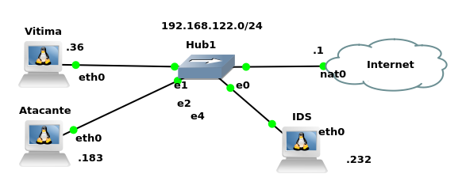 | 
|:--:|
| Figura 1 - Cenário de rede para testes. |

O ponto central da rede é o **Hub1**, um dispositivo de camada 1 que interliga todos os hosts. **A escolha de um hub é estratégica para este cenário: por natureza, um hub replica todo o tráfego recebido em uma porta para todas as outras**. Isso garante que a máquina **IDS**, conectada a ele, consiga "escutar" de forma passiva toda a comunicação que ocorre entre o **Atacante** e a **Vítima**, **sem a necessidade de configurações complexas como *port mirroring* (SPAN), que seriam necessárias em um *switch***.

> Atenção, então é extremamente importante que o cenário tenha um ***hub* e não um *switch***, caso contrário não seria possível analisar todo o tráfego de rede, sem configurações mais avançadas!

Os elemetnos deste cenário são:

* **Atacante**: Uma máquina Linux com o endereço IP `192.168.122.183`. Sua função é **simular um agente malicioso**, iniciando atividades de reconhecimento como **mapeamento de rede e varredura de portas** contra a Vítima.
* **Vítima**: Um servidor Linux com o endereço IP `192.168.122.36`. Ele representa um **alvo potencial na rede**, executando serviços deliberadamente expostos para os testes, como **SSH** (porta 22) e **FTP** (porta 21).
* **IDS (Intrusion Detection System)**: A máquina Linux com IP `192.168.122.232`, que é o foco do nosso estudo. Este host hospeda tanto o **Suricata**, configurado para monitorar a interface de rede `eth0` em modo promíscuo, quanto o **Evebox**, que serve como a interface gráfica para análise e visualização dos alertas gerados pelo Suricata.

A rede também possui uma conexão com o mundo exterior através do endereço `192.168.122.1`. Este IP **representa o *gateway***, que no ambiente GNS3 geralmente corresponde a uma interface NAT conectada à máquina hospedeira real (o "computador real"), permitindo que os hosts simulados acessem a Internet, se necessário.

**Primeiro**, a partir da máquina atacante, **realizamos uma varredura de descoberta de hosts (ping scan) em toda a sub-rede `192.168.122.0/24`** usando o comando `nmap -sP`. Este tipo de varredura é usado para identificar quais máquinas estão ativas na rede e é um precursor comum de ataques mais direcionados. O Suricata, com as regras da Emerging Threats, é capaz de detectar esse tipo de comportamento.

```console
root@Atacante:/# nmap -sP 192.168.122.*
Starting Nmap 7.80 ( https://nmap.org ) at 2025-09-15 17:29 UTC
Nmap scan report for 192.168.122.1
Host is up (0.00039s latency).
MAC Address: 52:54:00:7C:83:37 (QEMU virtual NIC)
Nmap scan report for Vitima (192.168.122.36)
Host is up (0.0033s latency).
MAC Address: 02:42:51:2D:1F:00 (Unknown)
Nmap scan report for 192.168.122.169
Host is up (0.0036s latency).
MAC Address: 02:42:DD:EE:98:00 (Unknown)
Nmap scan report for IDS (192.168.122.232)
Host is up (0.00056s latency).
MAC Address: 02:42:89:C6:92:00 (Unknown)
Nmap scan report for Atacante (192.168.122.183)
Host is up.
Nmap done: 256 IP addresses (5 hosts up) scanned in 1.99 seconds
```

**Neste Scan foram identificados alguns hosts, e vamos supor que o atacante se interessou no host 192.168.122.36**, que representa a vítima de nosso cenário.

> Atenção, observe que o comando `nmap -sP` apresentou também o IP do NIDS (192.168.122.232), com isso o atacante poderia tentar invadir tal host e desativar o NIDS. Assim, uma abordagem seria **não deixar o NIDS com um IP na rede que ele monitora**, isso evitaria possíveis invasões (o NIDS poderia estar em uma rede exlusiva com o host do administrador da rede).

### Análise do Scan Detalhado do Host Vitima

Após a fase inicial de descoberta da rede, o próximo passo lógico para um atacante é **realizar uma varredura aprofundada em um alvo específico**. Neste teste, o **host "Vítima", com o IP `192.168.122.36`**, foi escaneado a partir da máquina "Atacante" utilizando um dos comandos mais informativos e agressivos do Nmap.

O comando executado foi:
`nmap -A 192.168.122.36`

A flag **-A** é um atalho que ativa um conjunto de opções avançadas, incluindo:
* **Detecção de Versão (-sV)**: Tenta determinar a versão exata dos serviços rodando nas portas abertas.
* **Detecção de Sistema Operacional (-O)**: Tenta identificar o sistema operacional do alvo.
* **Scan com Scripts (-sC)**: Roda um conjunto de *scripts* padrão para coletar mais informações.
* **Traceroute**: Traça a rota da rede até o alvo.

Veja o comando e sua saída na integra:

```console
root@Atacante:/# nmap -A 192.168.122.36

Starting Nmap 7.80 ( https://nmap.org ) at 2025-09-15 17:31 UTC
Nmap scan report for Vitima (192.168.122.36)
Host is up (0.00047s latency).
Not shown: 998 closed ports
PORT   STATE SERVICE VERSION
21/tcp open  ftp     vsftpd 3.0.5
80/tcp open  http    Apache httpd 2.4.41 ((Ubuntu))
|_http-server-header: Apache/2.4.41 (Ubuntu)
|_http-title: Apache2 Ubuntu Default Page: It works
MAC Address: 02:42:51:2D:1F:00 (Unknown)
No exact OS matches for host (If you know what OS is running on it, see https://nmap.org/submit/ ).
TCP/IP fingerprint:
OS:SCAN(V=7.80%E=4%D=9/15%OT=21%CT=1%CU=33212%PV=Y%DS=1%DC=D%G=Y%M=024251%T
OS:M=68C84D8C%P=x86_64-pc-linux-gnu)SEQ(SP=100%GCD=1%ISR=10B%TI=Z%CI=Z%II=I
OS:%TS=A)SEQ(SP=100%GCD=1%ISR=10B%TI=Z%CI=Z%TS=A)OPS(O1=M5B4ST11NWA%O2=M5B4
OS:ST11NWA%O3=M5B4NNT11NWA%O4=M5B4ST11NWA%O5=M5B4ST11NWA%O6=M5B4ST11)WIN(W1
OS:=FE88%W2=FE88%W3=FE88%W4=FE88%W5=FE88%W6=FE88)ECN(R=Y%DF=Y%T=40%W=FAF0%O
OS:=M5B4NNSNWA%CC=Y%Q=)T1(R=Y%DF=Y%T=40%S=O%A=S+%F=AS%RD=0%Q=)T2(R=N)T3(R=N
OS:)T4(R=Y%DF=Y%T=40%W=0%S=A%A=Z%F=R%O=%RD=0%Q=)T5(R=Y%DF=Y%T=40%W=0%S=Z%A=
OS:S+%F=AR%O=%RD=0%Q=)T6(R=Y%DF=Y%T=40%W=0%S=A%A=Z%F=R%O=%RD=0%Q=)T7(R=Y%DF
OS:=Y%T=40%W=0%S=Z%A=S+%F=AR%O=%RD=0%Q=)U1(R=Y%DF=N%T=40%IPL=164%UN=0%RIPL=
OS:G%RID=G%RIPCK=G%RUCK=G%RUD=G)IE(R=Y%DFI=N%T=40%CD=S)

Network Distance: 1 hop
Service Info: OS: Unix

TRACEROUTE
HOP RTT     ADDRESS
1   0.47 ms Vitima (192.168.122.36)

OS and Service detection performed. Please report any incorrect results at https://nmap.org/submit/ .
Nmap done: 1 IP address (1 host up) scanned in 21.61 seconds
```

A saída do Nmap fornece um relatório detalhado sobre o host "Vítima":

1.  **Portas e Serviços Identificados**: O Nmap escaneou as 1000 portas mais comuns e encontrou 998 delas fechadas, mas duas estavam abertas e ativas:
    * **Porta 21/tcp (FTP)**: O serviço de transferência de arquivos está rodando a versão **vsftpd 3.0.5**. Para um atacante, a identificação da versão é crucial, pois ele pode pesquisar por vulnerabilidades e exploits conhecidos especificamente para essa versão.
    * **Porta 80/tcp (HTTP)**: Um servidor web **Apache httpd 2.4.41** está em execução, sobre um sistema Ubuntu. O Nmap também conseguiu extrair o cabeçalho do servidor e o título da página ("Apache2 Ubuntu Default Page: It works"), confirmando ser uma instalação padrão.

2.  **Detecção do Sistema Operacional**: Embora o Nmap não tenha conseguido uma correspondência exata para a versão do SO (`No exact OS matches for host`), os serviços identificados e a assinatura TCP/IP (`Service Info: OS: Unix`) sugerem fortemente que o alvo é um sistema da família Linux/Unix, o que está correto para o cenário.

3.  **Distância de Rede**: A seção `TRACEROUTE` confirma que a "Vítima" está a apenas **1 salto** de distância (`1 hop`). Isso indica que ambos os hosts estão no mesmo segmento de rede local, validando a topologia do nosso laboratório.

Em resumo, este teste simulou com sucesso uma fase crítica de um ataque: o reconhecimento detalhado. **O atacante obteve informações valiosas, como os serviços exatos e suas versões, que são o ponto de partida para uma tentativa de exploração**. 

**Essa varredura é considerada "barulhenta"** e é exatamente o tipo de atividade que um sistema de detecção de intrusão (IDS) como o Suricata é projetado para identificar. 

Do ponto de vista da defesa, **essa atividade gerou um volume significativo de tráfego suspeito, que deverá ter acionado múltiplas regras no Suricata**, gerando alertas que podem ser visualizados e analisados no Evebox (vamos verificar isso na próxima seção).


### Acessando o Evebox

Com o servidor do **Evebox em execução, o acesso à interface web** é feito pelo endereço `https://<IP_DO_SERVIDOR_IDS>:5636`. Por padrão, o Evebox **utiliza um certificado TLS autoassinado para criptografar a comunicação, o que faz com que o navegador exiba um alerta de segurança**, como visto na Figura 2. Isso é um comportamento esperado.

> Atenção o **Evebox fica disponível no HTTPS** e não no HTTP. 
> No exemplo da Figura 2, o Evebox está acessível pelo IP `https://192.168.122.232:5636`. 

| 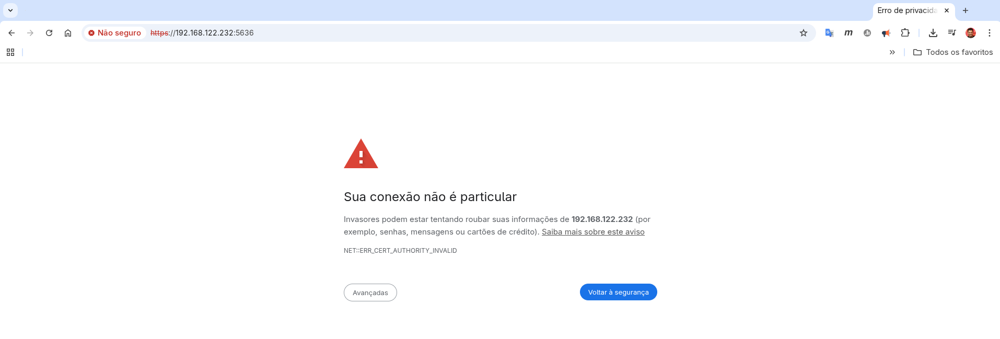 |
| :--: |
| Figura 2 - Alerta de segurança do navegador sobre certificado autoassinado. |

**Para prosseguir, é necessário clicar em "Avançadas" (ou similar) e depois na opção para continuar para o *site***, como demonstrado na Figura 3. Este passo confirma que você confia no endereço, permitindo o acesso à página de login.

| 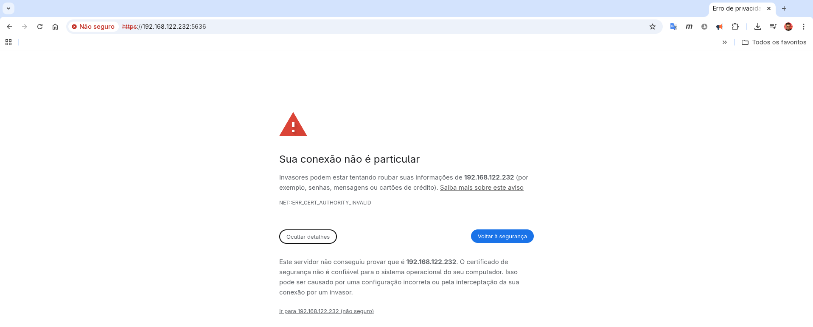 |
| :--: |
| Figura 3 - Procedimento para ignorar o alerta e acessar a página. |

A Figura 4 exibe a **tela de login do Evebox**. Aqui, utilizamos as credenciais previamente configuradas (usuário `admin` e a senha definida) para acessar a plataforma.

| 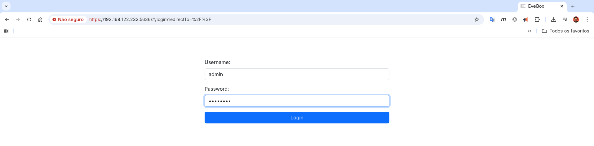 |
| :--: |
| Figura 4 - Tela de login do Evebox. |

> No exemplo utilizamos o usuário ``admin``, mas esse será o que você configurou nos passos anteriores.

Após a autenticação, somos apresentados **tela principal, chamada de "Inbox"**, vista na Figura 5. Note que há apenas alertas informativos, como o `ET INFO GNU/Linux APT User-Agent`, que indica uma atividade normal de atualização de pacotes do próprio servidor IDS. É a calmaria que foi capturada antes dos testes realizados anteriormente (ou seja essa imagem foi capturada antes do ataque).

| 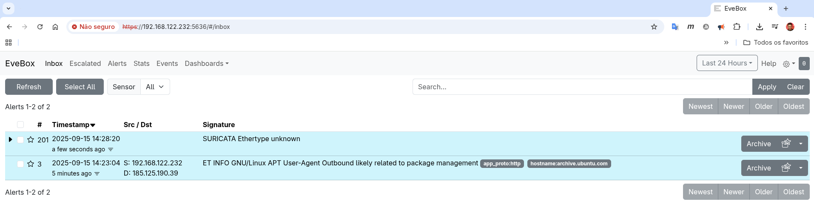 |
| :--: |
| Figura 5 - Tela principal (Inbox) com a lista de alertas antes do ataque. |

A Figura 6 mostra a mesma **tela de "Inbox"**, mas agora **após a execução do scan de rede e do scan de host**. A mudança é drástica, e **esta tela é a prova visual de que o Suricata detectou a atividade maliciosa**. 

**O alerta `ET SCAN Possible Nmap User-Agent Observed` é a evidência direta do comando `nmap -A`**, pois esta assinatura é acionada quando o Nmap se identifica ao sondar o servidor web na porta 80. Da mesma forma, os alertas `SURICATA ICMPv4 unknown code` são consistentes com o scan de descoberta de rede (ping *scan*) e as diversas sondagens realizadas pelo *scan* de host.

| 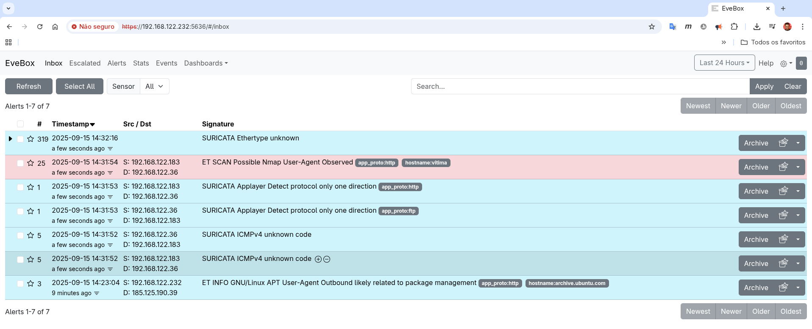 |
| :--: |
| Figura 6 - Inbox após os scans, exibindo os múltiplos alertas gerados. |

Para uma análise mais profunda, a **Figura 7 detalha o alerta gerado** pelo **scan de host (`nmap -A`)**. As informações confirmam que: 

* A atividade partiu do Atacante (`192.168.122.183`) em direção à porta 80 da Vítima (`192.168.122.36`). 
* O campo "25 Occurrences" é particularmente revelador, pois mostra que não foi um único pacote, mas uma série de 25 pacotes relacionados a essa assinatura, comportamento típico de uma varredura automatizada.

| 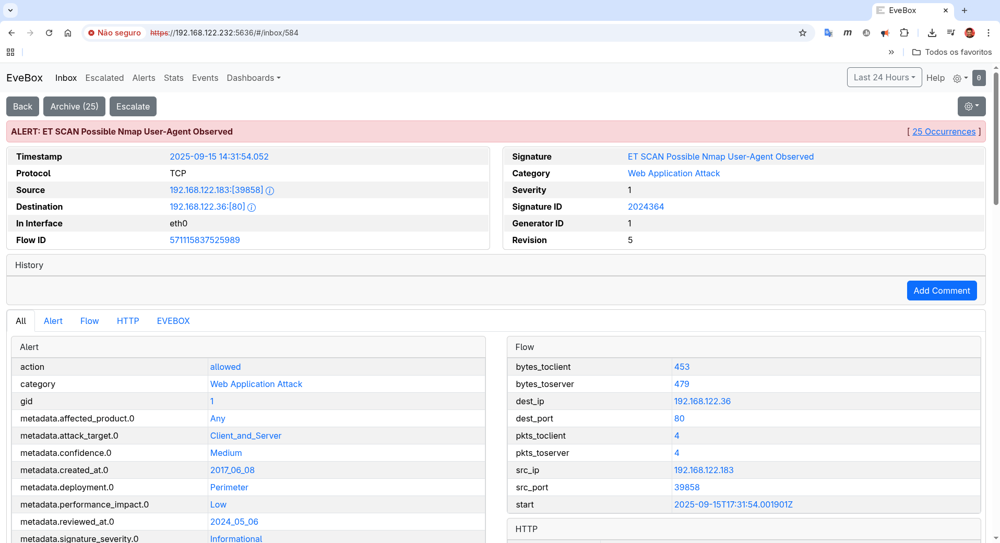 |
| :--: |
| Figura 7 - Detalhes do alerta de scan Nmap (parte 1), com informações essenciais. |

A **continuação dos detalhes do alerta é vista na Figura 8**. Esta seção exibe os mesmos dados do evento causado pelo *scan* em formato bruto, como uma lista de eventos e em JSON. Este formato é útil para entender exatamente quais **metadados** o Suricata coletou durante a varredura do Nmap.

| 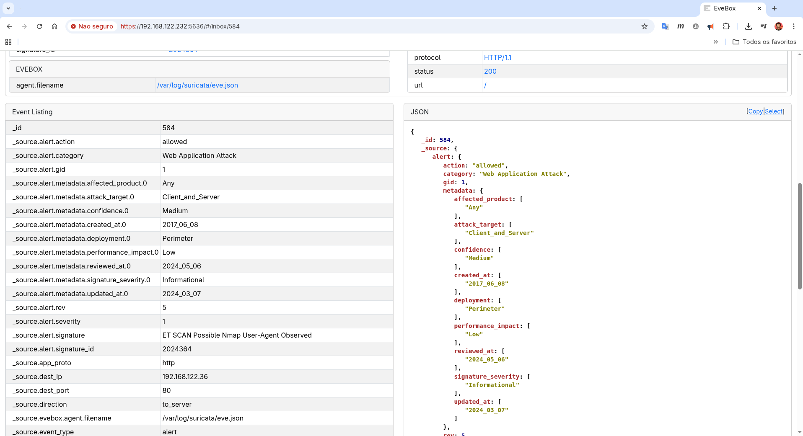 |
| :--: |
| Figura 8 - Detalhes do alerta (parte 2), com os dados brutos do evento em formato JSON. |

**Além dos alertas, o Evebox permite monitorar a saúde do próprio motor de detecção**. A Figura 9 mostra a tela de **"Stats"** do Evebox, que exibe métricas de desempenho do Suricata. O aumento no uso de memória e no processamento de pacotes durante os *scans* seria refletido aqui.

| 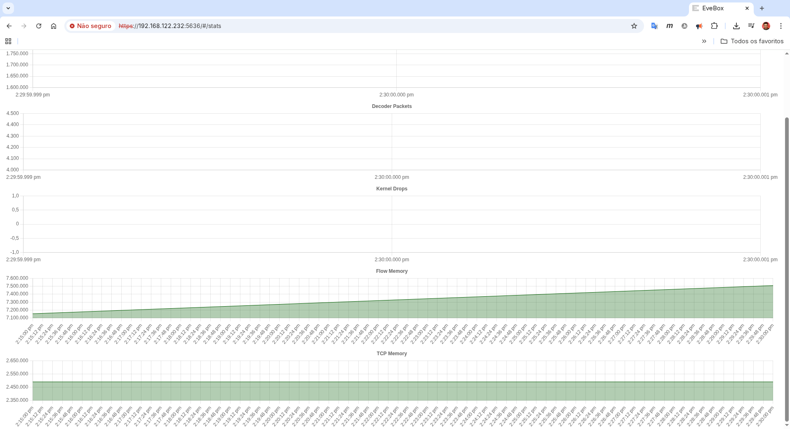 |
| :--: |
| Figura 9 - Tela de status do Suricata, com métricas de desempenho do motor. |

Para uma visão consolidada, os ***dashboards*** são extremamente úteis. A Figura 10 exibe o ***dashboard* "Overview"**, que resume o tráfego gerado pelos **scans de rede e de host**. As tabelas "Top Source IP Addresses" e "Top Destination IP Addresses" são conclusivas, destacando o IP do **Atacante** (a máquina que executou o Nmap) como a principal origem e o da **Vítima** (o alvo do Nmap) como o principal destino da atividade suspeita.

| 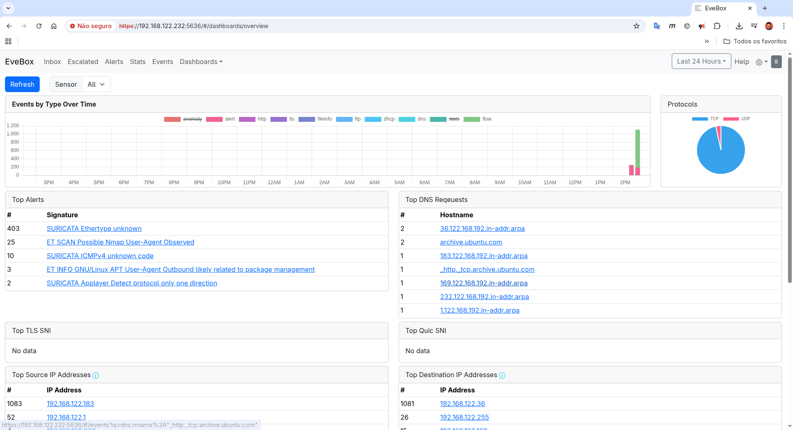 |
| :--: |
| Figura 10 - Dashboard "Overview" com gráficos e estatísticas que resumem o ataque. |

Por fim, a Figura 11 mostra o ***dashboard* de "Alerts"**. **O gráfico "Alerts Over Time" visualiza claramente o momento exato em que o *scan* de host (`nmap -A`) foi executado**, representado pelo pico acentuado no número de alertas. As tabelas abaixo reforçam quais assinaturas foram mais acionadas pelo scan e confirmam os IPs do Atacante e da Vítima como os protagonistas do evento.

| 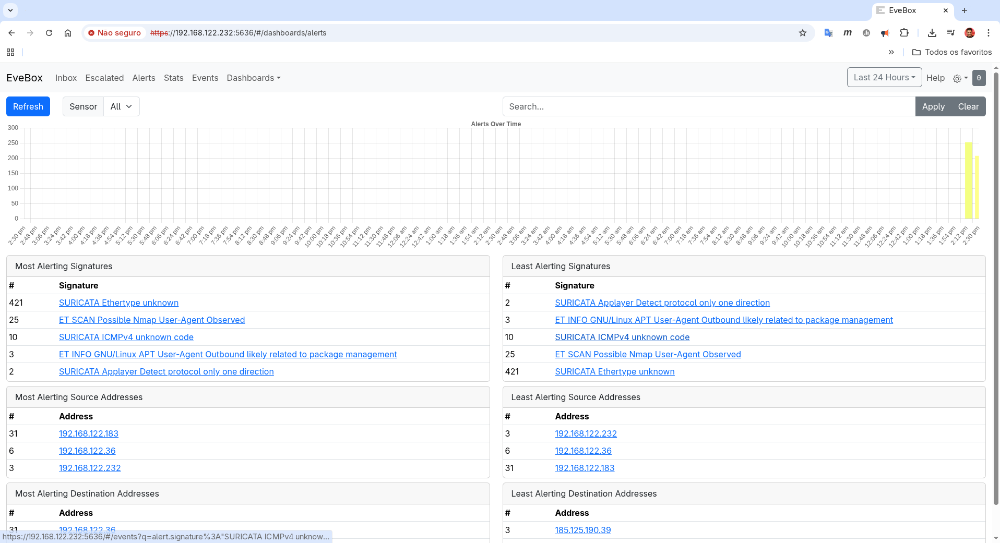 |
| :--: |
| Figura 11 - Dashboard de "Alerts" com a linha do tempo e as assinaturas mais frequentes. |

Assim, com esse simples exemplo é possível ter uma ideia do potencial do Suricata somado ao Evebox para ajudar no monitoramento de cibersegurança em redes de computadores, pois esses conseguem identificar ataques e apresentá-los em uma interface web que permite uma análise detalhada e facilidade dos mesmo, o que pode ajudar muito na tarefa de proteger recursos computacionais e principalmente a informação em trânsito ou armazenada em computadores.


## Material de Apoio

Para facilitar a aplicação prática dos conceitos e comandos demonstrados neste tutorial, foi criada uma imagem Docker. Esta imagem contém todo o ambiente com Suricata e Evebox pré-configurados e foi projetada para ser utilizada como um nó em topologias de rede no GNS3, sendo ideal para laboratórios e aulas de Cibersegurança.

### Imagem Docker para Laboratórios no GNS3

Com essa imagem Docker, você pode rapidamente colocar um "computador" com o IDS/IPS pronto para uso em seus cenários de teste, sem precisar repetir todo o processo de instalação e configuração.

Tal imagem tem as seguintes características:

* **Repositório no Docker Hub:** `luizarthur/cyberinfra`
* **Nome e Tag da Imagem:** `luizarthur/cyberinfra:nids-suricata-evebox`
* **Conteúdo:** Debian 11, Suricata, Evebox, SQLite e *scripts* de inicialização.
* **Credenciais Evebox:** Usuário `admin`, Senha `123mudar`.

Para utilizar basta:

**1. Baixar a Imagem**

Para fazer o download da imagem do Docker Hub para a sua máquina, utilize o seguinte comando em seu terminal:

```console
docker pull luizarthur/cyberinfra:nids-suricata-evebox
```

**2. Configurar no GNS3**

Após o download, a imagem estará disponível localmente em seu Docker. No GNS3, vá em ``Preferences > Docker containers > New`` para criar um novo *template*, selecionando a imagem ``luizarthur/cyberinfra:nids-suricata-evebox`` na lista.

**3. Iniciar os Serviços no Containers**

Dentro do ambiente GNS3, ao iniciar um terminal para o contêiner, você pode usar os seguintes *scripts* de atalho para iniciar os serviços rapidamente:

```console
# Para iniciar o Suricata em modo IDS na interface eth0
/etc/init.d/start-suricata-ids

# Para iniciar o servidor web do Evebox
/etc/init.d/start-evebox
```

Assim, você pode recriar o cenário de testes deste tutorial de forma rápida e consistente.


## Referências

SURICATA. **Open Source IDS/IPS/NSM**. [S. l.]: Open Information Security Foundation, 2025. Disponível em: <https://suricata.io/>. Acesso em: 16 set. 2025.

EVEBOX. **The EveBox user interface for Suricata**. [S. l.]: Jason Ish, [20--]. Disponível em: <https://evebox.org/>. Acesso em: 16 set. 2025.

NMAP. **Nmap: The Network Mapper - Free Security Scanner**. [S. l.]: Gordon Lyon, 2025. Disponível em: <https://nmap.org/>. Acesso em: 16 set. 2025.

OPEN INFORMATION SECURITY FOUNDATION (OISF). **About OISF**. [S. l.]: OISF, [20--]. Disponível em: <https://oisf.net/>. Acesso em: 16 set. 2025.

PROOFPOINT. **ET Open Ruleset**. Santa Clara, CA: Proofpoint, Inc., 2025. Disponível em: <https://www.proofpoint.com/us/threat-intelligence/et-open>. Acesso em: 16 set. 2025.

SNORT. **The World's Most Widely Deployed IPS Technology**. [S. l.]: Cisco, 2025. Disponível em: <https://www.snort.org/>. Acesso em: 16 set. 2025.

SQLITE. **SQLite Home Page**. [S. l.]: Hipp, Wyrick & Company, Inc., 2025. Disponível em: <https://www.sqlite.org/>. Acesso em: 16 set. 2025.

UBUNTU. **The story of Ubuntu**. [S. l.]: Canonical Ltd., 2025. Disponível em: <https://ubuntu.com/>. Acesso em: 16 set. 2025.

DEBIAN. **O Sistema Operacional Universal**. [S. l.]: Software in the Public Interest, Inc., 2025. Disponível em: <https://www.debian.org/>. Acesso em: 16 set. 2025.
