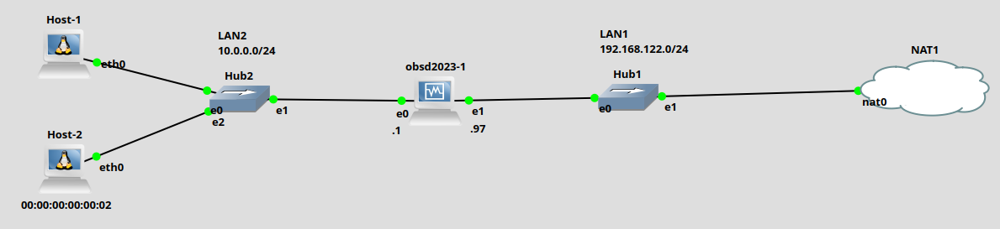

# Servidor DHCP no OpenBSD

Servidores Dynamic Host Configuration Protocol ([DHCP](https://pt.wikipedia.org/wiki/Dynamic_Host_Configuration_Protocol)) estão presentes em qualquer rede atualmente. Os servidores DHCP realizam nos *hosts* clientes, a configuração automática de parâmetros como: IP do *host*, máscara, *gateway*, DNS, etc. Assim, o servidor DHCP é um grande facilitador para se gerenciar e manter redes de computadores. Desta forma, é fundamental para qualquer administrador de rede saber configurar um bom servidor DHCP.

O texto a seguir apresenta brevemente como instalar e configurar um servidor DHCP utilizando o sistema operacional [OpenBSD](https://www.openbsd.org/). Para isso será utilizado como exemplo a rede da Figura 1.

|  |
|:--:|
| Figura 1 - Cenário de rede |

Tal rede é composta de duas LANs:
* LAN1 - é a rede conectada à Internet;
* LAN2 - é a LAN cliente, que receberá as configurações via DHCP;
* openbsd2023-1 - é o servidor DHCP, que fornecerá configurações de redes para a LAN1.

> A maioria dos comandos aqui serão realizados no *host* **``openbsd2023-1``**, que vamos chamar também de ``openbsd2023`` ou ``obsd2023``.

## Instalação

Tudo inicia com a instalação do servidor DHCP. Então, no *host* ``openbsd2023-1``, como administrador (``root``), vamos procurar quais pacotes de servidores DHCP estão disponíveis, isso é feito com o comando ``pkg_info -Q dhcp``. A seguir é apresentado, tal comando e um exemplo e saída.

```console
obsd2023# pkg_info -Q dhcp
dhcpcd-9.4.1p2v0
dhcpdump-1.8p0
dhcping-1.2
isc-dhcp-client-4.4.3pl1p0
isc-dhcp-omapi-4.4.3pl1p0
isc-dhcp-server-4.4.3pl1p0
p5-Net-DHCP-0.696p0
wide-dhcpv6-20080615p9
```
Na saída anterior, são apresentados vários pacotes/programas representando clientes e servidores DHCP. Para este exemplo vamos instalar o [``isc-dhcp-server-4.4.3pl1p0``](https://github.com/isc-projects/dhcp). Isso é feito pelo comando ``pkg_add``, ver saída a seguir:

```console
obsd2023# pkg_add isc-dhcp-server-4.4.3pl1p0

quirks-6.121 signed on 2023-04-26T08:37:06Z
isc-dhcp-server-4.4.3pl1p0: ok
The following new rcscripts were installed: /etc/rc.d/isc_dhcpd /etc/rc.d/isc_dhcrelay
See rcctl(8) for details.
```

## Configuração

A configuração do servidor DHCP inicia com a cópia de um arquivo de exemplo, para gerar o arquivo de configuração principal. Tal passo é opcional, mas é recomendado para servir de base para a construção do arquivo de configuração. Para isso são executados os seguintes comandos no exemplo:

```console
obsd2023# cp /etc/examples/dhcpd.conf /etc/dhcpd.conf
```

Agora é só iniciar a configuração/edição do arquivo ``/etc/dhcpd.conf``. Neste arquivo iremos configurar a LAN2, que possui a faixa de rede 10.0.0.0/24. Ver arquivo de configuração a seguir:

```console
obsd2023# vi /etc/dhcpd.conf

#	$OpenBSD: dhcpd.conf,v 1.1 2014/07/11 21:20:10 deraadt Exp $
#
# DHCP server options.
# See dhcpd.conf(5) and dhcpd(8) for more information.
#
option  domain-name "dacom.utfpr";
option  domain-name-servers 8.8.8.8, 8.8.4.4;

subnet 10.0.0.0 netmask 255.255.255.0 {
 	range 10.0.0.2 10.0.0.10;
	option routers 10.0.0.1;
}
```

Neste exemplo foram utilizadas basicamente as seguintes opções de configuração do servidor DHCP:
* ``option  domain-name`` - nome do domínio da rede, neste ``exemplo dacom.utfpr``;
* ``option  domain-name-servers`` - IPs dos servidor(es) de nome (DNS);
* ``subnet`` - informa a rede que será servida pelo DHCP, para isso também deve ser informado a máscara (``netmask``);
> Atenção, o servidor deve ter um IP nesta faixa de rede, no exemplo o servidor tem a interface ``em0`` (``e0``), com o IP 10.0.0.1/24.
* ``range`` - faixa de IPs que será distribuída dinamicamente. Neste caso serão fornecidos IPs do 10.0.0.2 até o 10.0.0.10 (no total de 9 IPs);
* ``options routers`` - IP do *gateway* (roteador padrão), desta subrede;

Nas opções apresentadas anteriormente as duas primeiras (``domain-name`` e ``domain-name-servers``) estão configuradas como variáveis globais. Valem para qualquer configurações de subrede que não especificam localmente tais opções. Já a opção ``option routers`` é local à subnet 10.0.0.0/24, ou seja, só valem na rede LAN2.

Com tudo configurado, basta iniciar o servidor DHCP com o seguinte comando:
```console
obsd2023# rcctl start isc_dhcpd
```

> Em caso de dúvida a respeito de qual servidor utilizar utilize: ``rcctl ls all | grep dhcp``, e neste caso procure pelo isc.

É possível executar o comando ``netstat`` para verificar se o servidor/serviço está em execução. Veja a saída a seguir:

```console
obsd2023# netstat -a -p udp
Active Internet connections (including servers)
Proto   Recv-Q Send-Q  Local Address          Foreign Address
udp          0      0  redes2.info.bootpc     *.*
udp          0      0  *.*                    *.*
udp          0      0  *.*                    *.*
Active Internet connections (including servers)
Proto   Recv-Q Send-Q  Local Address          Foreign Address
udp6         0      0  *.*                    *.*
udp6         0      0  *.*                    *.*
```
Na saída anterior note que há uma linha com ``bootpc``, esse é o nome do protocolo que identifica o DHCP ou porta UDP/68.

> Se não houver menção ao ``bootp`` ou porta UDP/68 na saída do comando ``netstat``, provavelmente houve algum problema. Caso isso ocorra reveja os passos anteriores a procura de erros.


### Teste no cliente Host-1

Neste exemplo o cliente Host-1, é um Linux. Então, para tentar obter as configurações de rede dadas pelo servidor DHCP recém instalado e configurado, vamos utilizar o comando ``dhcpcd``, mas poderia ser outro, tal como o ``dhclient``:

```console
root@Host-1:/# dhcpcd eth0
DUID 00:04:4c:4c:45:44:00:36:32:10:80:34:b3:c0:4f:35:34:32
eth0: IAID 26:68:5c:7e
eth0: soliciting an IPv6 router
eth0: soliciting a DHCP lease
eth0: offered 10.0.0.2 from 10.0.0.1
eth0: probing address 10.0.0.2/24
eth0: leased 10.0.0.2 for 43200 seconds
eth0: adding route to 10.0.0.0/24
eth0: adding default route via 10.0.0.1
forked to background, child pid 18416
```
Na saída anterior, note que o cliente conseguiu obter a configuração de rede. Para este foi atribuído o IP 10.0.0.2.

> Você pode constatar isso também com os comandos ``ifconfig``, ``route``, ``ip`` e ``cat /etc/resolv.conf``.

Dada as configurações de rede para o *host*, é possível realizar testes de conectividade entre *host* e o servidor ``obsd2023``, por exemplo realizando um ``ping 10.0.0.1``. Se você quiser acessar *hosts* da Internet, a principio será necessário configurar o ``obsd2023`` como roteador e para realizar NAT para o OpenBSD, para isso acesse:
* [NAT no Openbsd](nat.md).


### Configurando IP estático

IPs dinâmicos são muito comuns e utilizados em *hosts* clientes, todavia normalmente não é interessante que um servidor fique mudando de IP. Assim, para estes casos é possível atribuir IPs fixos aos *hosts* atrelando um IP ao endereço MAC do cliente.

Em nosso exemplo de configuração de servidor DHCP no OpenBSD, isso é feito com a opção ``host``, depois passando o endereço físico e o IP do *host*, respectivamente com as opções ``hardware ethernet`` e ``fixed-address``. Veja a saída a seguir:

```console
obsd2023# vi /etc/dhcpd.conf

option  domain-name "dacom.utfpr";
option  domain-name-servers 8.8.8.8, 8.8.4.4;

subnet 10.0.0.0 netmask 255.255.255.0 {
 	range 10.0.0.2 10.0.0.10;
	option routers 10.0.0.1;

	host host2 {
		hardware ethernet 00:00:00:00:00:02;
		fixed-address 10.0.0.254;
	}
}
```
Na saída anterior o *host* chama ´´host2´´, esse tem o o MAC ´´00:00:00:00:00:02´´ e toda vez que ele pedir um IP para esse servidor DHCP, lhe será atribuído o IP ``10.0.0.254``.

Lembrando que após realizar alterações no arquivo de configuração do servidor DHCP é necessário reiniciá-lo:

```console
obsd2023# rcctl restart isc_dhcpd
```

Veja a saída obtida pelo cliente Linux, neste cenário:

```console
root@Host-2:/# dhcpcd eth0
DUID 00:04:4c:4c:45:44:00:36:32:10:80:34:b3:c0:4f:35:34:32
eth0: IAID 00:00:00:02
eth0: adding address fe80::701b:3cf4:327d:9f5f
eth0: soliciting a DHCP lease
eth0: offered 10.0.0.254 from 10.0.0.1
eth0: probing address 10.0.0.254/24
eth0: soliciting an IPv6 router
eth0: leased 10.0.0.254 for 43200 seconds
eth0: adding route to 10.0.0.0/24
eth0: adding default route via 10.0.0.1
forked to background, child pid 134
```

Na saída anterior, note que o cliente realmente obteve o IP 10.0.0.254.

> Atenção, em alguns casos, como placas de rede WiFi, o endereço físico pode ficar mudando a cada *boot* do *host*. Nestes casos é necessário configurar tal sistema para manter um endereço físico fixo.

## DHCP Relay

O servidor DHCP é uma evolução dos protocolos [BOOTP](https://pt.wikipedia.org/wiki/BOOTP#:~:text=O%20protocolo%20BOOTP%20(acr%C3%B4nimo%20para,permanente%2C%20o%20chamado%20direcionamento%20est%C3%A1tico) e [RARP](https://youtu.be/Jw9I2d6gTDI), sendo que duas das principais características dessas evoluções são:
1. **Fornecer IPs dinâmicamente**, através do empréstimo de uma faixa de IPs prédeterminada (isso veio da evolução do DHCP em relação ao BOOTP);
2. Conseguir **rotear pedidos DHCP de uma rede para outra**, assim o cliente DHCP pode estar em uma rede diferente do servidor DHCP (isso veio da evolução do BOOTP em relalção ao RARP).

Bem, então para que o servidor DHCP forneça IPs para enlaces de rede diferentes da que ele está conectado, é necessário o uso do DHCP Relay. Isso basicamente consiste em configurar um *host* em uma dada rede, para encaminhar pedidos DHCP dos clientes para um servidor DHCP que está em outra rede. Assim, um DHCP Relay é um intermidiador/ponte entre o cliente DHCP e o servidor.

Neste material não vamos nos aprofundar em como configurar o DHCP Relay no OpenBSD, mas isso pode ser fácilmente obtido no material da [``kb.isc.org``](https://kb.isc.org/docs/isc-dhcp-44-manual-pages-dhcrelay). Também, é mais comum configurar *switches* para fazer o Relay. Assim, você pode conferir como configurar um *switch* CISCO para ser um DHCP Relay no *link* a seguir: [DHCP em *swiches* CISCO](cisco/dhcp-cisco).

## Conclusão

Servidores DHCP estão presentes em basicamente todas as redes atualmente, principalmente dentro de roteadores e Access Points WiFi. Assim, usuários não precisam configurar manualmente os *hosts* na rede, tudo é feito de forma automática e quase mágica pelo servidor DHCP.

Entender como funciona tais servidores é muito importante para administradores de rede, pois isso pode ajudar a evitar problemas na rede e matê-las sempre em pleno fucionamento.

Aqui apresentamos a instalação e configuração de um servidor DHCP no OpenBSD, que é considerados um dos sistemas mais seguros do mundo.

> Exemplo, não é nada recomendável ter dois ou mais servidores DHCP em um mesmo enlace de rede! Procure a teória do DHCP para entender o motivo disso...  ;-)
