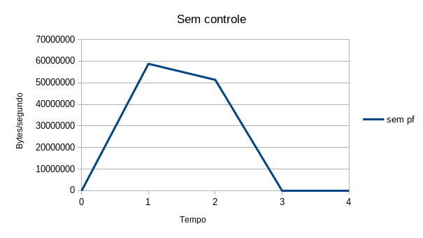
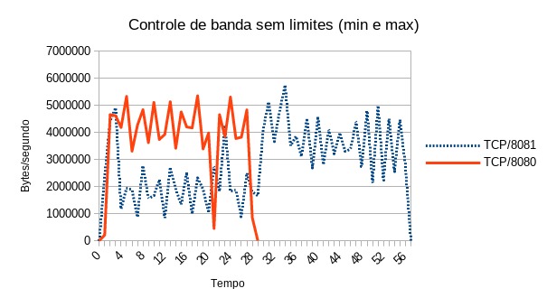
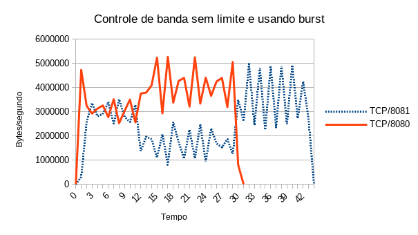

QoS - Quality of Service
========================

>**UTFPR - Universidade Tecnológica Federal do Paraná, campus Campo Mourão**  
>Autor: **Prof. Dr. Luiz Arthur Feitosa dos Santos**  
>E-mail: **<luizsantos@utfpr.edu.br>**  

## Introdução

Qualidade de serviços ou QoS (_Quality of Service_) normalmente significa melhorar os serviços de rede.... (**terminar**)

QoS é um assunto controverso em redes de computadores. Redes como TCP/IP são comutadas por pacotes, o que torna muito complicado implementar QoS de forma eficiente. Já que um equipamento de rede só sabe "o que é" e "de quem é" um pacote, quando esse já for processado pelo mesmo, ou seja, quando já consumiu recursos (largura de banda, memória e processamento) para tratá-lo.

A ideia principal, normalmente, é dar mais prioridade para pacotes de rede relacionados com serviços essenciais para empresas (VoIP, HTTP, SSH, etc) e reduzir o uso da rede por parte de *hosts* ou serviços que atrapalhem o bom andamento da rede (Torrent, Serviços de *streaming*, etc). É claro que determinar o que é bom ou ruim depende de cada caso/empresa/rede e isso também dificulta a implementação de QoS. 

## Modelagem de tráfego no OpenBSD

O [OpenBSD](https://www.openbsd.org/) possui um _firewall_ chamado [PF](https://www.openbsd.org/faq/pf/), que implementa facilmente modelagem de tráfego de rede (**_traffic shaping_**), aqui chamaremos isso também de: **controle de tráfego de rede** ou **controle de banda**. O controle de banda é feito através de **filas (_queue_)**. Assim, administradores de redes podem criar esquemas para **reorganizar pacotes de rede por prioridade e/ou controle de largura de banda**, tentando atender de forma mais eficiente os requisitos da rede.

Para que a modelagem de tráfego seja feita no PF, é necessário criar pelo menos uma fila, mas é possível ter várias filas. Na verdade é possível criar um esquema de árvore, com filas **pais (_parent_)** e filhas (_child_ ou _leaf_), formando um esquema hierárquico. Cada fila terá configurações próprias (ex. largura de banda) que serão compartilhadas com suas filhas (caso existam). 


>**Atenção** - Lembrando que redes de computadores já funcionam normalmente utilizando fila (FIFO - _Fisrt In First Out_), só que é "uma grande fila", por onde os pacote são enfileirados e enviados. O que está sendo feito aqui é dar a possibilidade de criar/configurar filas que atendem melhor os requisitos de pessoas, serviços, hosts e/ou redes de computadores.


Para que os pacotes de rede sejam atribuídos as filas criadas, é necessário **criar regras** de firewall (PF), que utilizando atributos dos pacotes (IP, protocolo, porta de rede, etc) os relacionem com as filas criadas. Também é **obrigatório** ter uma fila padrão (_default_), que será destinada para pacote que não casem com as regras criadas no _firewall_. Ou seja, destinados à pacotes que não tiverem uma fila especificamente designada. Outra exigência, é que **a fila raiz/principal/pai de todas precisa especificar pelo menos uma interface de rede** e as filas filhas devem especificar seu pai (_parent_).

### Criando filas

Para criar as filas no PF, basta criar/editar o arquivo ``/etc/pf.conf``, que é o padrão. Neste exemplo iremos utilizar outro nome de arquivo, que será: (``/etc/pf-qos.conf``). 

Exemplo:

```console
openbsd# vi /etc/pf-qos.conf 
```
```console
queue fila0 on em1  bandwidth 100M  
queue fila5M parent fila0 bandwidth 5M 
queue fila10M parent fila0 bandwidth 10M default
queue fila30M parent fila0 bandwidth 30M 
queue controle parent fila0 bandwidth 55M
```

No arquivo de exemplo anterior:
* A primeira linha do arquivo (``queue fila0 on em1 bandwidth 100M``), cria a fila raiz, que chamamos aqui de ``fila0``, tal fila está relacionada com a interface de rede ``em1`` e define 100Mbps como largura de banda (``bandwidth 100M``) - **é obrigatório criar uma fila nesses moldes**;
* A segunda linha cria a fila chamada ``fila5M``, que é filha da fila ``fila0``. A ``fila5M`` como o nome sugere terá 5Mb dos 100Mb da fila pai;
* A próxima fila criada é a ``fila10M``. Ela também é filha de ``fila0``, mas tem 10Mb de largura de banda.  Principalmente, essa fila  foi atribuída como ``default``, ou seja, se não houver nenhuma regra para atribuir pacotes para uma fila específica, tais pacotes serão submetidos a essa fila - **lembrando que é obrigatório criar pelo menos uma fila filha e ``default``**;
* A ``fila30M``, também é criada como fila filha de ``fila0`` e para essa foi dado 30Mb de largura de banda;
* Por fim, a fila ``controle`` que possui a maior largura de banda entre as filas, que é 55Mb.


### Aplicando o controle de banda no PF

Com o arquivo de exemplo anterior pronto,  o próximo passo é aplicar as filas no PF. Isso é feito executando seguinte comando:

```console
openbsd# pfctl -f /etc/pf-qos.conf
```

Se o arquivo estiver correto nenhuma mensagem será retornada. Caso contrário encontre os erros e corrija o arquivo. Um exemplo de erro seria não ter a interface de rede ``em1`` - sua interface pode ter outro nome. Lembrando que é possível ver as interfaces de rede com o comando ``ifconfig``.

### Testando o controle de banda

Há várias formas de realizar testes com o controle de largura de banda. Aqui iremos utilizar um servidor  [HTTP Apache](https://httpd.apache.org/). Assim, basicamente é necessário instalar um servidor HTTP no OpenBSD (onde acabamos de configurar as filas) e depois usar no cliente (outro *host*) um comando tal como o [Wget](https://www.gnu.org/software/wget/). A seguir são dados mais detalhes das configurações para o teste:

* [Configuração do ambiente de teste](QoSTesteApache.html)

#### Teste 1 - Teste sem controle de banda

O primeiro teste foi realizado sem aplicar o controle de banda. Para isso, é possível desativar o PF com o comando:
```console
openbsd# pfctl -d
```

Neste cenário ao se executar o comando ``wget``, no cliente o resultado deste é:

```console
$ wget http://192.168.56.111:8080/100.txt
--2020-01-03 22:53:41--  http://192.168.56.111:8080/100.txt
Conectando-se a 192.168.56.111:8080... conectado.
A requisição HTTP foi enviada, aguardando resposta... 200 OK
Tamanho: 104857600 (100M) [text/plain]
Salvando em: â100.txtâ

100.txt               100%[========================>] 100,00M  50,3MB/s    em 2,0s    

2020-01-03 22:53:43 (50,3 MB/s) - â100.txtâ salvo [104857600/104857600]
```
Neste teste a taxa transferência de dados foi de aproximadamente 50 Mbps, segundo o ``wget``. No teste não vamos utilizar arquivos muito grandes para não sobrecarregar a máquina durante os testes.

Tal teste produziu o seguinte fluxo de rede capturado pelo Wireshark:



**Observação** - Para obter o gráfico foi usado o ``tcpdump`` para capturar o tráfego de rede e o ``tcpstat`` para extrair as informações. Exemplo:

* ``tcpdump``:
```console
# tcpdump -i vboxnet0 -w /tmp/testeQos.pcap
```

* ``tcpstat``:
```console
# tcpstat -f 'port 8080' -r /tmp/testeQos.pcap -o "%R;%N\n" 1
1;58772185
2;51336842
3;156
```

Posteriormente os dados obtidos com o ``tcpstat`` foram enviados para o LibreOffice e os gráficos foram gerados.

#### Teste 2 - Com o controle e banda ativado

Para este teste, vamos usar o mesmo cenário, mas com as regras do PF de controle de banda ativados. Para isso, vamos ligar o PF novamente e depois recarregar as regras criadas:

```console
openbsd# pfctl -e 
pf enabled
openbsd# pfctl -f /etc/pf-qos.conf                                                        
```

Após isso repetimos o ``wget`` do lado cliente, não esquecendo de monitorar com o ``tcpdump``.

Saída do ``wget``:

```console
$ wget http://192.168.56.111:8080/100.txt
--2020-01-03 23:08:34--  http://192.168.56.111:8080/100.txt
Conectando-se a 192.168.56.111:8080... conectado.
A requisição HTTP foi enviada, aguardando resposta... 200 OK
Tamanho: 104857600 (100M) [text/plain]
Salvando em: â100.txt.1â

100.txt.1             100%[========================>] 100,00M  60,6MB/s    em 1,6s    

2020-01-03 23:08:36 (60,6 MB/s) - â100.txt.1â salvo [104857600/104857600]
```

Gráfico do fluxo de rede capturado:


Bem, neste teste nota-se que não houve alterações nos fluxos de rede com ou sem controle de banda. Isso provavelmente deve-se ao fato de que só há uma única conexão de rede ativa e o PF está emprestando banda de outros fluxos. Então, por motivos de teste, vamos ditar limites para o PF dizer que ele não deve passar desses limites estabelecidos.

#### Teste 3 - Com o controle e banda ativado e usando limites

Bem, para conseguir ver melhor os resultados, vamos especificar melhor os limites de largura de banda para cada fila que criamos no PF. Vamos deixar o arquivo da seguintes forma:

```console
openbsd# vi /etc/pf-qos.conf 
queue fila0 on em1  bandwidth 100M max 100M 
queue fila5M parent fila0 bandwidth 5M min 5M max 5M
queue fila10M parent fila0 bandwidth 10M min 10M max 10M default 
queue fila30M parent fila0 bandwidth 30M min 30M max 30M  
queue controle parent fila0 bandwidth 55M min 55M max 55M
```

Nessa nova configuração:
* Na ``fila0``, informamos que o máximo de largura de banda é 100Mbps (``max 100M``), não importa se houver mais, a banda disponível não deve exceder esse limite.
* Nas filas filhas: ``fila5M``, ``fila10M``, ``fila30M`` e ``controle`` foram configuradas para ter respectivamente no mínimo (``min``) e no máximo (``max``) 5Mb, 10Mb, 30Mb e 55Mb. **Os valores máximo e mínimos podem ser diferentes, mas para testes mais concisos foram utilizados valores iguais**.

Lembre de recarregar as regras, após as alterações nas filas:

```console
openbsd# pfctl -f /etc/pf-qos.conf                                                        
```

E execute os testes novamente:

```console
$ wget http://192.168.56.111:8080/100.txt
--2020-01-03 23:21:45--  http://192.168.56.111:8080/100.txt
Conectando-se a 192.168.56.111:8080... conectado.
A requisição HTTP foi enviada, aguardando resposta... 200 OK
Tamanho: 104857600 (100M) [text/plain]
Salvando em: â100.txt.2â

100.txt.2             100%[========================>] 100,00M  1,14MB/s    em 89s     

2020-01-03 23:23:14 (1,12 MB/s) - â100.txt.2â salvo [104857600/104857600]
```


Bem com a saída do comando e com a figura anterior, é possível notar que a taxa de transferência de banda foi reduzida drasticamente, caindo de ~50Mbps para ~1Mbps. Outra grande mudança foi quanto ao tempo, sem o controle o tempo para o download de um arquivo de 100MB foi de 3 segundos, já com o controle/limites aplicados o tempo para fazer o download do mesmo arquivo foi de 90 segundos. Lembrando que neste teste o fluxo de rede do download foi submetido a ``fila10M``, que é a fila padrão (``default``) que tem 10Mb de largura de banda.


#### Teste 4 - Atribuindo fluxos de rede as filas criadas

No exemplo anterior, não há nenhuma regra de _firewall_ atribuindo os fluxos de rede às filas criadas. Assim, todos os pacotes de rede estão indo para a fila padrão, que é a ``fila10M``. Desta forma, todos os pacotes na rede tem apenas 10Mb de largura de banda. Agora vamos criar regras do PF para atribuir fluxos diferentes para filas com largura de banda diferentes.

Vamos criar as seguintes regras:
1. Uma para pacotes TCP na porta 8080, que devem ser encaminhados para ``fila30M``, recebendo assim 30Mb de largura de banda.
2. Outra para pacotes TCP na porta 8081, que serão destinados a ``fila5M``, recebendo apenas 5Mb de largura de banda.
3. Uma terceira regra, que atribui pacotes SSH fila ``controle``, que tem 55Mb disponível.
3. Qualquer outro pacote será atribuído à ``fila10M``, já que não possuem regras e serão destinados a fila padrão. Vai ser o caso dos testes com pacotes TCP na porta 80 (porta HTTP padrão).

As regras são apresentadas na prática a seguir:

```console
openbsd# cat /etc/pf-qos.conf      
queue fila0 on em1  bandwidth 100M max 100M 
queue fila5M parent fila0 bandwidth 5M min 5M max 5M
queue fila10M parent fila0 bandwidth 10M min 10M max 10M default 
queue fila30M parent fila0 bandwidth 30M min 30M max 30M  
queue controle parent fila0 bandwidth 55M min 55M max 55M

pass in on em1 proto tcp from any to any port 8080 set queue fila30M 
pass in on em1 proto tcp from any to any port 8081 set queue fila5M 
pass in on em1 proto tcp from any to any port 22 set queue control
```
*  Regra ``pass in on em1 proto tcp from any to any port 8080 set queue fila30M``, informa que serão aceitos pacotes tcp entrando pela placa de rede ``em1``, vindos de qualquer host destinados para qualquer host na porta TCP/8080, tais pacotes serão atribuídos a ``fila30M``.
* As demais regras são parecidas só alterando a porta e o nome da fila.

> **Atenção** - normalmente regras de controle de banda só podem ser controladas nas saída (``out``) e não na entrada (``in``). Contudo, nesta versão do PF, os teste não funcionaram com a saída, mas sim com a entrada (``in``).

Recarregue as regras, após a criação das regras no PF:

```console
openbsd# pfctl -f /etc/pf-qos.conf                                                        
```

Para testar vamos executar um script para que sejam criados fluxos de rede simultaneamente para TCP/8080, TCP/8081 e TCP/80. O script terá o seguinte conteúdo:

```console
$ cat testeQoS.sh 
xterm -e "wget http://192.168.56.111:80/100.txt && read" &
xterm -e "wget http://192.168.56.111:8081/100.txt && read" &
xterm -e "wget http://192.168.56.111:8080/100.txt && read" &
```

Após isso é só executar o script e ver o resultado de cada ``wget``:

* Script:
```console
$ sh testeQoS.sh
```

* ``wget http://192.168.56.111:8080/100.txt``:
```console
--2020-01-03 23:51:11--  http://192.168.56.111:8080/100.txt
Conectando-se a 192.168.56.111:8080... conectado.
A requisição HTTP foi enviada, aguardando resposta... 200 OK
Tamanho: 104857600 (100M) [text/plain]
Salvando em: “100.txt.17.1”

100.txt.17.1        100%[===================>] 100,00M  2,80MB/s    em 39s     

2020-01-03 23:51:50 (2,58 MB/s) - “100.txt.17.1” salvo [104857600/104857600
```

* ``wget http://192.168.56.111:80/100.txt``:
```console
20-01-03 23:51:11--  http://192.168.56.111/100.txt
Conectando-se a 192.168.56.111:80... conectado.
A requisição HTTP foi enviada, aguardando resposta... 200 OK
Tamanho: 104857600 (100M) [text/plain]
Salvando em: “100.txt.16”

100.txt.16          100%[===================>] 100,00M  1,14MB/s    em 89s     

2020-01-03 23:52:40 (1,12 MB/s) - “100.txt.16” salvo [104857600/104857600
```

* ``wget http://192.168.56.111:8081/100.txt``

```console
--2020-01-03 23:51:11--  http://192.168.56.111:8081/100.txt
Conectando-se a 192.168.56.111:8081... conectado.
A requisição HTTP foi enviada, aguardando resposta... 200 OK
Tamanho: 104857600 (100M) [text/plain]
Salvando em: “100.txt.17”

100.txt.17          100%[===================>] 100,00M   583KB/s    em 2m 56s  

2020-01-03 23:54:07 (581 KB/s) - “100.txt.17” salvo [104857600/104857600
```

Analisando as saídas, observa-se que o fluxo TCP/8080 terminou primeiro, com 39 segundos e 2,58MB/s. Em segundo lugar o fluxo TCP/80, com 89 segundos e 1,12 MB/s. Por último, o fluxo TCP/8081, com 2 minutos e 56 segundos, e uma taxa de transferência de dados de apenas 581KB/s. O que é coerente já que respectivamente foram atribuídos as filas com 30Mb, 10Mb e 5Mb. O gráfico a seguir ajuda a mostrar como foi ditado o controle de banda para cada um dos fluxos:


Utilizando o esquema anterior, é possível, por exemplo, atribuir uma largura de banda mínima para serviços indesejados na rede, tal como torrent (que neste caso foi representado pelo fluxo TCP/8081). Já fluxos que necessitam de velocidade também seriam identificados, como por exemplo o TCP/8080 e TCP/22 (SSH), do nosso exemplo. Já o restante seguiria utilizando uma largura de banda moderada (no exemplo foi o fluxo HTTP, na porta TCP/80).

#### Teste 5 - Compartilhando a largura de banda - sem usar limite

Nos teste anteriores foi utilizado limite mínimo (``min``) e máximo (``max``). Bem, isso não é obrigatório, caso não se use o limite as filas emprestam largura de banda das filas ociosas e na prática isso normalmente é mais interessante.

Vamos apresentar aqui um exemplo mais simples de filas, veja o arquivo a seguir:

```console
openbsd# cat /etc/pf-qos2.conf
queue fila0 on em1  bandwidth 50M max 50M
queue fila1M parent fila0 bandwidth 1M
queue fila49M parent fila0 bandwidth 49M default

pass in on em1 proto tcp from any to any port 8081 set queue fila1M
```

Neste arquivo novo a ``fila0`` tem uma largura de banda de 50M e há apenas duas filas filhas com 1Mb e 49Mb. Também só há uma regra que atribui fluxo TCP/8081 a fila de 1Mb, os demais fluxos vão para a fila de 49M.

Neste caso em um teste as filas compartilham a largura de banda, caso uma das filas estejam ociosas. Exemplo, ao se executar dois ``wget`` simultâneos, um na porta TCP/8080 e outro na porta TCP/8081, quando o ``wget`` da porta TCP/8080 terminar o da porta TCP/8081 pegará toda a largura de banda para sí. Veja os comandos e gráfico a seguir:

* ``wget`` da port 8080:
```console
--2020-01-04 01:02:09--  http://192.168.56.111:8080/100.txt
Conectando-se a 192.168.56.111:8080... conectado.
A requisição HTTP foi enviada, aguardando resposta... 200 OK
Tamanho: 104857600 (100M) [text/plain]
Salvando em: “100.txt”

100.txt             100%[===================>] 100,00M  3,87MB/s    em 27s     

2020-01-04 01:02:37 (3,68 MB/s) - “100.txt” salvo [104857600/104857600]
```

* ``wget`` da porta 8081:
```console
--2020-01-04 01:02:09--  http://192.168.56.111:8081/100.txt
Conectando-se a 192.168.56.111:8081... conectado.
A requisição HTTP foi enviada, aguardando resposta... 200 OK
Tamanho: 104857600 (100M) [text/plain]
Salvando em: “100.txt.1”

100.txt.1           100%[===================>] 100,00M  3,08MB/s    em 54s     

2020-01-04 01:03:03 (1,86 MB/s) - “100.txt.1” salvo [104857600/104857600]
```

Ao final esses comandos produzem os seguintes fluxos de rede:



Ou seja, de inicio o fluxo TCP/8080 consome a banda destinada/reservada para ele (45Mb), mas tão logo o download termine o fluxo TCP/8081 pode usar toda a largura de banda disponível para ele e terminar o seu download mais rápido se comparado com os testes anteriores, nos quais foram utilizados limites.


#### Teste 6 - Compartilhando a largura de banda de outras filas no inicio

No PF, há como dar mais largura de banda no inicio de uma conexão, mas caso essa não termine logo, o que pode significar um fluxo indesejado (torrent, YouTube, Netflix, etc) o PF atribui uma largura de banda menor. Para isso basta utilizar a opção ``burst`` em um tempo em milissegundos (``200ms``), na frente da regra que cria as filas. Por exemplo:

```console
openbsd# cat /etc/pf-qos2.conf
queue fila0 on em1  bandwidth 50M max 50M
queue fila1M parent fila0 bandwidth 1M burst 49M for 5000ms
queue fila49M parent fila0 bandwidth 49M default

pass in on em1 proto tcp from any to any port 8081 set queue fila5M
```
O arquivo é o mesmo do exemplo anterior, só foi acrescido o ``busrt``. Neste caso a ``fila1M`` terá de inicio 49Mb por 5 segundos, depois a largura de banda irá para apenas 1Mb (``queue fila1M parent fila0 bandwidth 1M burst 49M for 5000ms``).

Vamos testar com apenas dois fluxos TCP/8080 e TCP/8081:

* ``wget`` da port 8080:
```console
--2020-01-04 01:09:53--  http://192.168.56.111:8080/100.txt
Conectando-se a 192.168.56.111:8080... conectado.
A requisição HTTP foi enviada, aguardando resposta... 200 OK
Tamanho: 104857600 (100M) [text/plain]
Salvando em: “100.txt.3”

100.txt.3           100%[===================>] 100,00M  3,92MB/s    em 29s     

2020-01-04 01:10:22 (3,43 MB/s) - “100.txt.3” salvo [104857600/104857600]
```

* ``wget`` da port 8081:
```console
--2020-01-04 01:09:53--  http://192.168.56.111:8081/100.txt
Conectando-se a 192.168.56.111:8081... conectado.
A requisição HTTP foi enviada, aguardando resposta... 200 OK
Tamanho: 104857600 (100M) [text/plain]
Salvando em: “100.txt.2”

100.txt.2           100%[===================>] 100,00M  3,32MB/s    em 43s     

2020-01-04 01:10:35 (2,33 MB/s) - “100.txt.2” salvo [104857600/104857600]
```
Tais comandos produzem os seguintes fluxos de rede:



Na figura nota-se que inicialmente os fluxos 8080 e 8081 brigam pela largura de banda disponível. Todavia, depois de uns 10 segundos, o fluxo 8080 ganha a maior fatia para ele (note que não é exatamente o que determinamos no arquivo, mas funciona). Quando o fluxo 8080 termina de fazer o download do arquivo o fluxo 8081 ganha novamente o direito de usar toda a largura de banda.

## Referências

* <https://www.openbsd.org/faq/pf/>
* <https://man.openbsd.org/pf.conf.5#QUEUEING>

