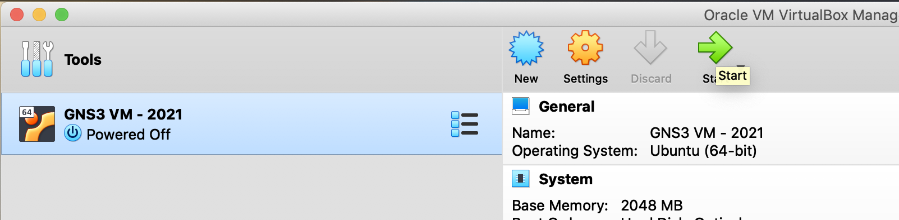
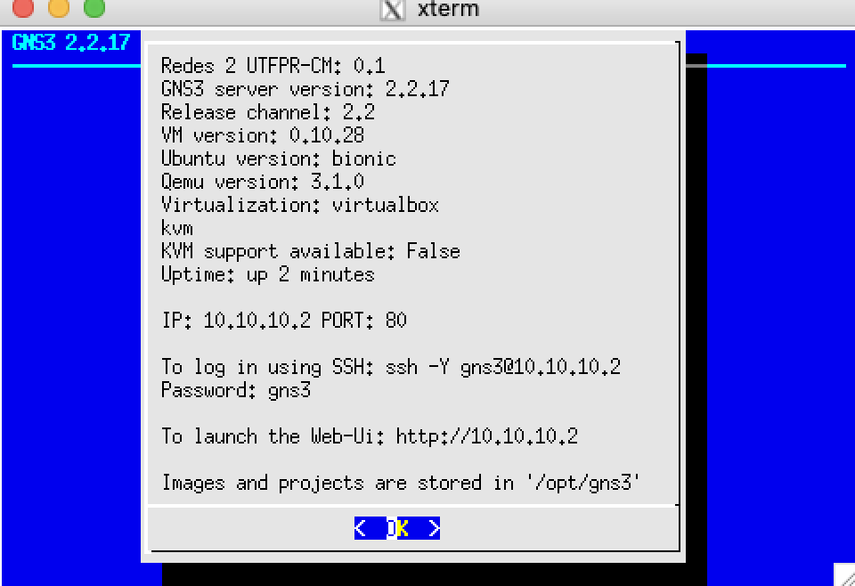
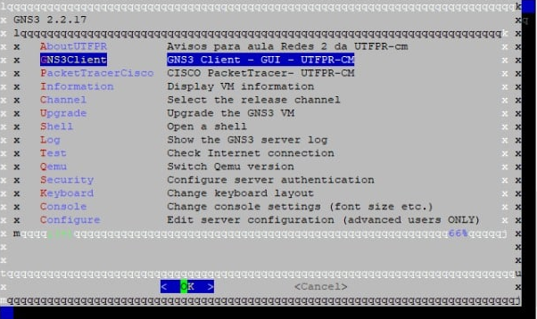

Configuração do MacOS para acessar o ambiente gráfico do Linux via SSH
===============================================

>**UTFPR - Universidade Tecnológica Federal do Paraná, campus Campo Mourão**  
>Autores: **Prof. Dr. Luiz Arthur Feitosa dos Santos, Rafael Rampim Soratto, Lucas Santana Rocha e Isabela De Almeida Gantzel**  
>E-mail: **<luizsantos@utfpr.edu.br>**  
>

-----------------------

Segue como configurar o MacOS para acessar o ambiente gráfico do Linux via SSH. O intuito principal deste texto é mostrar aos alunos do curso de BCC (Bacharelado em Ciência da Computação) da UTFPR de Campo Mourão, como acessar o GNS3 e o PacketTracer a partir de uma VM (Máquina Virtual) disponibilizada para as disciplinas de Redes de Computadores e Segurança. Mas tais passos podem ser adaptados para outras situações, não só para acessar VMs.

>Tal VM tem o GNS3 cliente/servidor e o PacketTracer da CISCO e devem ser acessados via SSH a partir da máquina hospedeira/real.

# Baixando os arquivos

É necessário baixar os seguintes arquivos:

1. [Virtual Box](https://www.virtualbox.org/wiki/Downloads) - que é o gerenciador de VM;
2. VM do GNS3/PacketTracer que está disponível no Moodle das disciplinas de Redes1, Redes 2 ou Segurança;
4. [XQuartz](https://www.xquartz.org/) - que será responsável pela reprodução do ambiente gráfico do Linux (ambiente X) no MacOS.

# Instalação

1. Instale o Virtual Box;
2. Localize o arquivo ``.ova`` da VM, esse já irá configurar e instalar apropriadamente a VM no Virtual Box. 

	

	 * Após isso inicie a VM e assim que ela estiver plenamente ligada verifique qual IP foi atribuído à interface ``eth1`` - essa interface deve estar configurada no Virtual Box como ``hostonly`` ou ``bridge``. A imagem a seguir mostra a VM da disciplina, que apresenta o IP em questão na tela inicial, neste exemplo é o 10.10.10.2;

	

	> Atenção, o IP da VM deve ser "pingável", se não for possível pingar da máquina real/hospedeira o IP da VM, pode ser que o segundo adaptador de rede da VM, no Virtual Box, esteja configurada como ``NAT`` e não ``hostonly`` ou ``bridge``. Neste caso desligue a VM e vá na configuração de rede da VM, no Virtual Box e configure como ``hostonly`` ou ``bridge``. Em caso de duvidas a respeito do IP atribuído à VM, entre no console da VM no próprio Virtual Box, pressione ``Crtl+C``, para ter acesso ao *shell* do Linux e execute o comando ``ifconfig eth1`` e verifique o IP que está nesta interface, novamente tal IP deve ser "pingável" do hospedeiro para a VM, caso isso não ocorra há algo errado.
3. Instale o XQuartz e inicie tal aplicativo. Desta forma aparecerá um ícone na bandeja de ícones de aplicativos, referente ao XQuartz em execução. Agora clique neste ícone a peça para abrir um terminal/*shell*;
4. No terminal aberto pelo XQuartz execute o comando ``ssh -X gns3@10.10.10.2``, então digite a senha do usuário gns3, que no caso da VM da disciplina também é ``gns3``. Na sequência, se a senha estiver correta, será aberto um menu que permite dentre outras coisas, iniciar o GNS3 cliente ou o PacketTracer. Assim, basta escolher um desses e a janela gráfica desses aplicativos aparecerá na máquina hospedeira, como se fosse um aplicativo desta, mas na verdade está vindo do servidor SSH (no caso a VM).

	

> É possível executar qualquer comando gráfico via console. No exemplo da VM da disciplina, seria possível dar um ``Crtl+C``, acessar o *shell* da VM e digital algo como ``wireshark``, ``gedit``, ``firefox`` ou qualquer aplicativo gráfico que esteja instalado, e tal aplicativo será exibido na tela do hospedeiro, no caso deste texto, do MacOS.

Assim, é possível acessar via MacOS programas no Linux através de SSH. Neste contexto utilizamos a ideia de acessar uma VM, mas com basicamente com os mesmos passos, seria possível acessar qualquer *host* Linux devidamente configurado com servidor SSH e ambiente gráfico.

> Não fez parte do escopo deste tutorial explicar a configuração necessária no servidor SSH para que este envie o ambiente gráfico do Linux, mas essa configuração existe e é necessária. Neste caso a VM já estava com toda essa configuração pronta.
 
