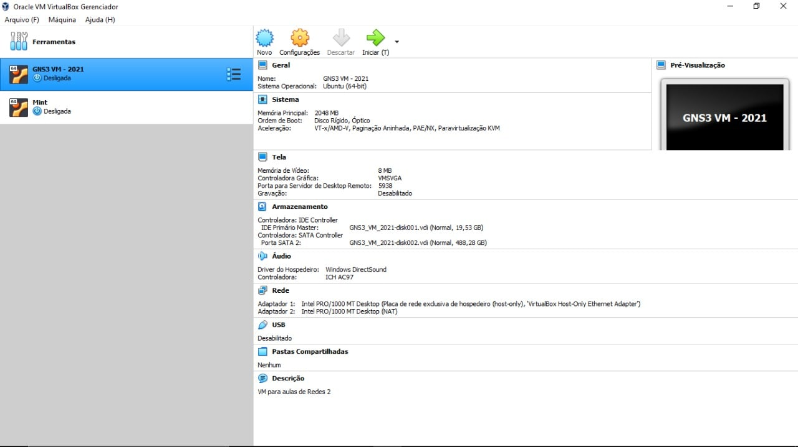
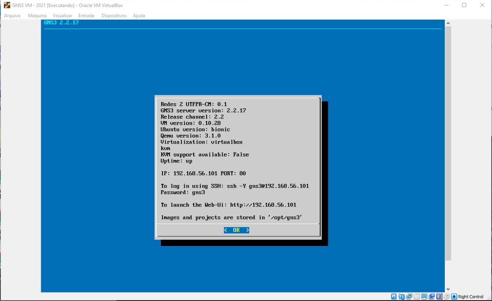
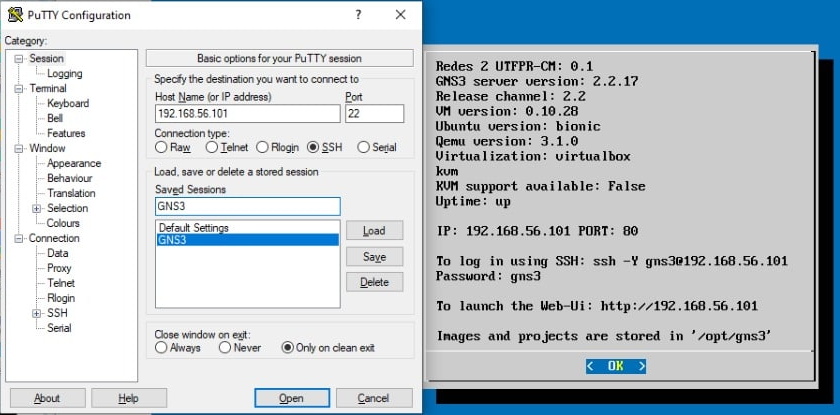
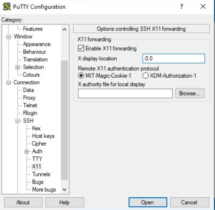
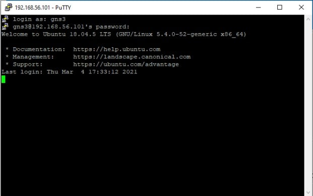
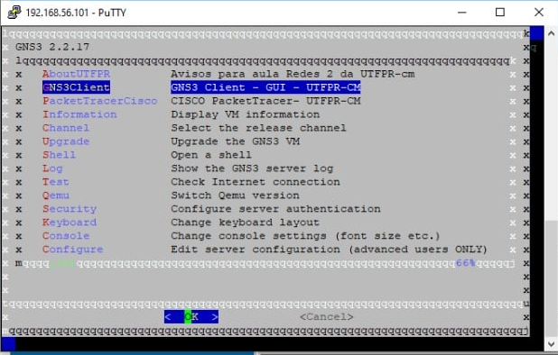

Configuração do Windows para acessar o ambiente gráfico do Linux via SSH
===============================================

>**UTFPR - Universidade Tecnológica Federal do Paraná, campus Campo Mourão**  
>Autor: **Prof. Dr. Luiz Arthur Feitosa dos Santos**  
>E-mail: **<luizsantos@utfpr.edu.br>**  
>
> Autora das imagens: **Isabela De Almeida Gantzel** 

-----------------------

Segue como configurar o Windows para acessar o ambiente gráfico do Linux via SSH. O intuito principal deste texto é mostrar aos alunos do curso de BCC (Bacharelado em Ciência da Computação) da UTFPR de Campo Mourão, como acessar o GNS3 e o PacketTracer a partir de uma VM (Máquina Virtual) disponibilizada para as disciplinas de Redes de Computadores e Segurança. Mas tais passos podem ser adaptados para outras situações, não só para acessar VMs.

>Tal VM tem o GNS3 cliente/servidor e o PacketTracer da CISCO e devem ser acessados via SSH a partir da máquina hospedeira/real.

# Baixando os arquivos

É necessário baixar os seguintes arquivos:

1. [Virtual Box](https://www.virtualbox.org/wiki/Downloads) - que é o gerenciador de VM;
2. VM do GNS3/PacketTracer que está disponível no Moodle das disciplinas de Redes1, Redes 2 ou Segurança;
3. [Putty](https://www.chiark.greenend.org.uk/~sgtatham/putty/latest.html) - que é o cliente SSH para o Windows;
4. [Xming](https://sourceforge.net/projects/xming/files/) - que será responsável pela reprodução do ambiente gráfico do Linux (ambiente X) no Windows.

# Instalação

1. Instale o Virtual Box;
2. Localize o arquivo ``.ova`` da VM, esse já irá configurar e instalar apropriadamente a VM no Virtual Box. 

	

	 * Após isso inicie a VM e assim que ela estiver plenamente ligada verifique qual IP foi atribuído à interface ``eth1`` - essa interface deve estar configurada no Virtual Box como ``hostonly`` ou ``bridge``. A imagem a seguir mostra a VM da disciplina, que apresenta o IP em questão na tela inicial, neste exemplo é o 192.168.56.101;

	

	> Atenção, se o IP iniciar com ``10.``, como por exemplo ``10.0.2.5``, pode ser que a interface (adaptador 2) no Virtual Box, esteja configurada como ``NAT`` e não ``hostonly`` ou ``bridge``. Neste caso desligue a VM e vá na configuração de rede da VM, no Virtual Box. **O IP atribuído à VM deve ser "pingável" da máquina real/hospedeira para a virtual**. 
3. Instale o Xming e tenha certeza que ele ficará em execução durante o SSH;
	> Se o Xming não estiver em execução durante o próximo passo, não será possível iniciar aplicativos gráficos a partir do SSH.
4. Normalmente não é necessário instalar o Putty, basta localizá-lo na pasta onde ele foi baixado e clicar para executá-lo. Depois:
	* Na tela inicial do Putty preencha o ``Host Name (or IP address)``, com o IP da VM. 
	* Também é recomendável dar um nome para essa conexão. Desta forma não é necessário ficar digitando esses valores toda vez que o Putty for executado. Isso é feito dando um nome em ``Saved Sessions`` e clicando no botão ``Save``.
	
	
	
	* Agora é necessário configurar o Putty para encaminhar via SSH o ambiente gráfico do Linux. Isso é feito no menu lateral ``Category`` do Putty, clicando em ``Connection -> SSH -> X11``. Então, é necessário deixar marcado ``Enable X11 Forwarding`` e colocar o valor ``:0.0``, em ``x display location``. Observe também se a opção ``MIT-Magic-Cookie-1`` esta marcada. Para que essas configurações persistam, caso você tenha feito o item anterior, volte no menu principal (``Session``) e clique em ``Save``.
	
	
	
	* Por fim, inicie a conexão com a VM clicando em ``Open``.
5. Com o Putty conectado no servidor SSH da VM, digite o usuário/senha, que no caso da VM da disciplina é gns3/gns3;

	

6. Na VM da disciplina abrirá um menu que permite dentre outras coisas, iniciar o GNS3 cliente ou o PacketTracer. Assim, basta escolher um desses e a janela gráfica desses aplicativos aparecerá na máquina hospedeira, como se fosse um aplicativo desta, mas na verdade está vindo do servidor SSH (no caso a VM).

	

> É possível executar qualquer comando gráfico via console. No exemplo da VM da disciplina, seria possível dar um ``Crtl+C``, acessar o *shell* da VM e digital algo como ``wireshark``, ``gedit``, ``firefox`` ou qualquer aplicativo gráfico que esteja instalado, e tal aplicativo será exibido na tela do hospedeiro, no caso deste texto, do Windows.

Assim, é possível acessar via Windows programas no Linux através de SSH. Neste contexto utilizamos a ideia de acessar uma VM, mas com basicamente com os mesmos passos, seria possível acessar qualquer *host* Linux devidamente configurado com servidor SSH e ambiente gráfico.

> Não fez parte do escopo deste tutorial explicar a configuração necessária no servidor SSH para que este envie o ambiente gráfico do Linux, mas essa configuração existe e é necessária. Neste caso a VM já estava com toda essa configuração pronta.
 
