Algumas configurações de *switches*
====================================================

>**UTFPR - Universidade Tecnológica Federal do Paraná, campus Campo Mourão**  
>Autor: **Prof. Dr. Luiz Arthur Feitosa dos Santos**  
>E-mail: **<luizsantos@utfpr.edu.br>**  

-----------------------

Em alguns casos é necessário realizar algumas configurações mais específicas nos *switches*, tais como configuração de velocidade da porta, ativação/desativação da porta, etc.

Então a seguir são apresentadas algumas dessas configurações em *switches* CISCO.

# Velocidade e duplex

Atualmente é comum que *switches* sejam *full-duplex*, ou seja, possuam portas que permitem enviar e receber dados simultaneamente. Todavia, os *switches* mais antigos eram half-duplex, ou seja, suas portas podiam enviar e receber dados, mas só uma coisa de cada vez. Em outras palavras no *half-duplex* ou a porta estava enviando dados ou estava recebendo, mas não os dois ao mesmo tempo. Assim, alguns *switches* permitem configurar suas portas como *half* ou *full-duplex*.

Na figura a seguir, há um cenário de rede, com os *switches* sem nenhum tipo de configuração. No Switch0 foi executado o comando ``show interface f0/2``, que mostra que a interface rede f0/2, que possui como configuração padrão a transmissão *full-duplex* e velocidade de 100Mbps (ver parte marcada na figura).

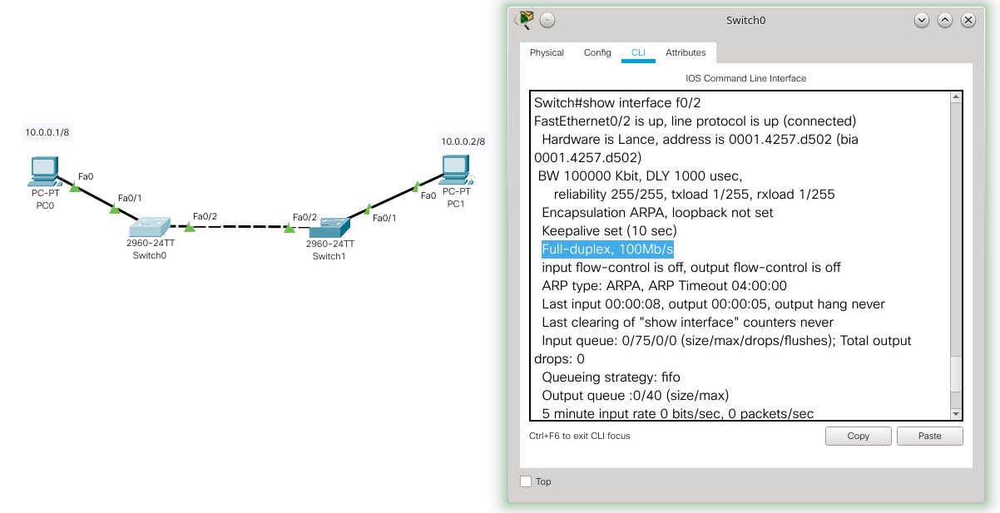

Bem, então dado o cenário anterior os comandos necessários para alterar o tipo de transmissão e a velocidade seriam:

```console
Switch>enable
Switch#configure terminal 
Enter configuration commands, one per line.  End with CNTL/Z.
Switch(config)#interface f0/2
Switch(config-if)#duplex half
%LINK-3-UPDOWN: Interface FastEthernet0/2, changed state to down

%LINEPROTO-5-UPDOWN: Line protocol on Interface FastEthernet0/2, changed state to down

%LINK-5-CHANGED: Interface FastEthernet0/2, changed state to up

%LINEPROTO-5-UPDOWN: Line protocol on Interface FastEthernet0/2, changed state to up

Switch(config-if)#speed 10
Switch(config-if)#end
```
No exemplo anterior o Switch0 foi configurado para *half-duplex* com o comando ``duplex half`` e a velocidade foi alterada para 10Mbps com o comando ``speed 10``. Tal alteração é apresentada na figura a seguir.

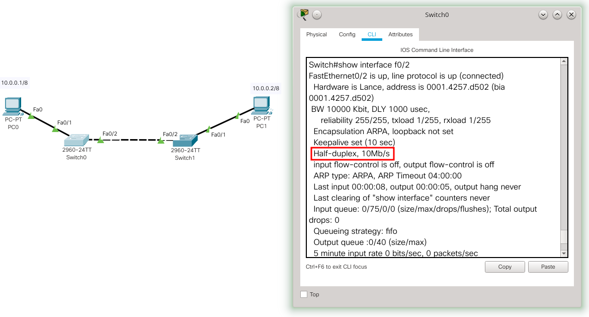

Não foi apresentado aqui, mas o ideal é que em ambos os equipamentos conectados, no caso os dois *switches*, tenham a mesma configuração nas interfaces que os conectam. Assim, pelo menos a interface f0/2 do Switch0 e Switch1 devem ser configurados como *half-duplex* e 10Mbps.

> **Atenção** - aqui foi apresentado a ideia de redução de velocidade e troca de transmissão de *full* para *half* duplex a título de exemplo, é claro que no dia a dia a tendencia é subir a velocidade e que o tipo de transmissão seja *full-duplex*.

A próxima figura ilustra como mudar a velocidade para 100Mbps e o tipo de transmissão para *full-duplex*:

```console
Switch#configure terminal
Enter configuration commands, one per line.  End with CNTL/Z.
Switch(config)#interface f0/2
Switch(config-if)#duplex full
%LINK-3-UPDOWN: Interface FastEthernet0/2, changed state to down

%LINEPROTO-5-UPDOWN: Line protocol on Interface FastEthernet0/2, changed state to down

Switch(config-if)#speed 100
Switch(config-if)#end
```

Como é possível ver na figura anterior basicamente é trocar de ``half`` para ``full`` no comando ``duplex`` e de ``10`` para ``100`` no comando ``speed``.

> **Atenção** - Não adianta tentar colocar uma velocidade que a porta do *switch* não suporta. Por exemplo, trocando de 100Mbps para 1000Mbps (1Gbps) se a porta não é *gigabit*.


### Colocando velocidade, duplex e MDIX automática

Anteriormente foi comentado como configurar a velocidade manualmente, todavia é possível configurar para que a velocidade seja negociada automaticamente pelos *hosts*/*switches*. 

Também é possível configurar o auto-MDIX (*automatic medium-dependent interface crossover*), que faz o cruzamento do cabo de forma automática, caso seja necessário. Ou seja, se for necessário um cabo crossover e o usuário utilizar um cabo comum (*straight-through*) a porta do host irá fazer o ajuste automático (cruzamento dos pares do cabo), para que a conexão seja possível. Em outras palavras é possível utilizar o cabo errado e a rede funciona.

A seguir são apresentados os comandos necessários para que funcione o MDIX, bem como a configuração automática da velocidade e tipo de transmissão:

```console
Switch>enable 
Switch#configure terminal
Enter configuration commands, one per line.  End with CNTL/Z.
Switch(config)#interface f0/2
Switch(config-if)#duplex auto
%LINK-5-CHANGED: Interface FastEthernet0/2, changed state to up

%LINEPROTO-5-UPDOWN: Line protocol on Interface FastEthernet0/2, changed state to up

Switch(config-if)#speed auto
Switch(config-if)#mdix auto
Switch(config-if)#end
```
Assim, para configurar o auto-MDIX é necessário o comando ``mdix auto``. Já para a configuração automática do tipo de transmissão e da velocidade basta utilizar ``auto`` tanto para o comando ``duplex`` quanto para o comando ``speed``.

# Desabilitando/habilitando portas

É comum imaginar que todas as portas dos *switches* devam estar ligadas (prontas para uso). Todavia, por questões de segurança pode ser interessante desabilitar portas de *switches* que não serão utilizadas. Isso é feito com o comando ``shutdown``.  

Usando a rede dos exemplos anteriores,  imagine um cenário no qual ninguém deve utilizar, por motivos de segurança, nenhuma porta que não a f0/1 e f0/2, tanto do Switch0 quanto do Switch1. Ou seja, nesta rede só é permitida a conexão entra switches, PC0 e PC1. Para desabilitar as outras portas é necessário executar em cada porta os seguintes comandos:

```console
Switch#configure terminal
Enter configuration commands, one per line.  End with CNTL/Z.
Switch(config)#interface f0/3
Switch(config-if)#shutdown

%LINK-5-CHANGED: Interface FastEthernet0/3, changed state to administratively down
Switch(config-if)#
```
Dado o comando ``shutdown`` da figura anterior, é possível utilizar o comando ``show interface status``, para verificar se a porta está desabilitada (``disabled``), tal como ilustra a figura a seguir:

```console
Switch#show interface status
Port      Name               Status       Vlan       Duplex  Speed Type
Fa0/1                        connected    1          auto    auto  10/100BaseTX
Fa0/2                        connected    1          auto    auto  10/100BaseTX
Fa0/3                        disabled 1          auto    auto  10/100BaseTX
Fa0/4                        notconnect   1          auto    auto  10/100BaseTX
Fa0/5                        notconnect   1          auto    auto  10/100BaseTX
Fa0/6                        notconnect   1          auto    auto  10/100BaseTX
Fa0/7                        notconnect   1          auto    auto  10/100BaseTX
```

Bem, para atingir o máximo de segurança é interessante desabilitar todas as portas que não foram planejadas para serem utilizadas. Todavia, fazer ``shutdown`` porta por porta irá ocupar muito tempo e pode gerar erros de configuração. Então uma opção interessante é passar uma faixa de portas de uma só vez, isso é possível utilizando o comando a seguir:

```console
Switch#configure terminal
Enter configuration commands, one per line.  End with CNTL/Z.
Switch(config)#interface range fastethernet 0/3 - 7
Switch(config-if-range)#shutdown

%LINK-5-CHANGED: Interface FastEthernet0/4, changed state to administratively down

%LINK-5-CHANGED: Interface FastEthernet0/5, changed state to administratively down

%LINK-5-CHANGED: Interface FastEthernet0/6, changed state to administratively down

%LINK-5-CHANGED: Interface FastEthernet0/7, changed state to administratively down

Switch(config-if-range)#
```

O comando ``interface range fastethernet 0/1 - 7`` habilita a configuração para uma faixa de portas do switch. Desta forma, é só digitar uma vez o comando que ese será replicado para todas as portas. No exemplo foi utilizado o comando ``shutdown``, mas pode ser qualquer outro (não só para habilitar e desabilitar portas). A seguir é apresentado o status de cada porta, também foi colocado um *host* novo, simulando uma pessoa não autorizada tentando acessar a rede, Na figura dá para ver que o *link* para esse novo PC (PC2) está em vermelho, ou seja, esse computador não está na rede, pois ele está em uma porta desabilitada.

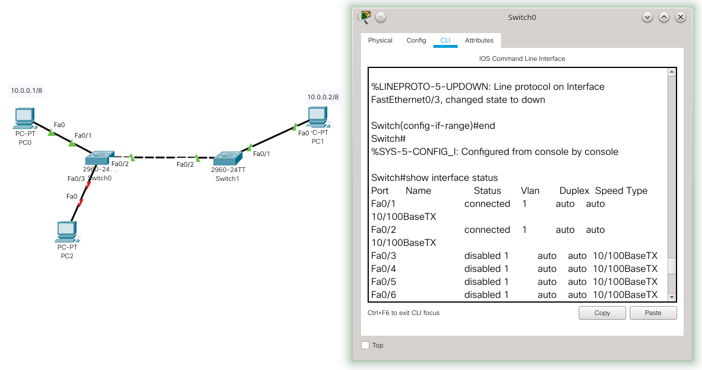

É claro que um invasor poderia remover o cabo de uma porta que funciona e tentar acessar a rede, mas isso pode gerar um alerta na rede já que essa pode parar de funcionar corretamente (algum PC pode parar ou a comunicação entre o *switch*.

A proteção apenas pela porta não funciona em 100% dos casos, pois o invasor pode tentar achar uma porta habilitada ou remover um PC idôneo para conectar o seu. Entretanto, o ato de desabilitar portas já é uma medida de segurança interessante para bloquear pessoas leigas (não *hackers*) que tentam usar a rede sem permissão.


# Limitando fluxos DHCP

O [DHCP](https://pt.wikipedia.org/wiki/Dynamic_Host_Configuration_Protocol) é um serviço de rede que permite configurar automaticamente os endereços de *hosts* na rede, para que esses consigam acessar a rede sem precisar de configuração manual. 

Todavia, o DHCP dá brechas para ataques, como por exemplo: 

1. Quando um atacante se passa por um servidor DHCP legítimo para fazer com que o cliente passe pela máquina do atacante (e assim roube dados) ou acesse um servidor DNS comprometido.
2. Ou o atacante envia dados errados, tais como *gateway* padrão e servidor DNS, de forma que os clientes não consigam mais acessar a rede, o que gera instabilidade ou indisponibilidade na rede.  
3. Além dos ataques propositais, causados por *hacker*, também existe a possibilidade de alguém ligar erroneamente um roteador ou AP com um servidor DHCP ativo e causar da mesma forma indisponibilidades na rede. 

Assim, alguns *switches* permitem determinar em qual porta está o servidor DHCP, desta forma, qualquer tráfego que venha de outra porta será ignorado/bloqueado, ajudando a evitar problemas com servidores DHCP mal configurados ou maliciosos. 

> Lembrando que o cliente obtém as configurações de rede do primeiro servidor DHCP que responder, não importa qual seja esse servidor.

Em *switches* Catalyst  da CISCO essa funcionalidade é chamada de **DHCP Snooping** que permite configurar quais portas do *switch* são confiáveis (*trust*) ou não para enviar pacotes do servidor DHCP. Portas não confiáveis (*untrust*) podem enviar requisições DHCP e as portas confiáveis podem enviar respostas dos servidores DHCP.

A figura a seguir traz um exemplo, no qual há uma rede com um PC0 e um servidor (Server0) simulando um hacker com um servidor DHCP malicioso, tal servidor passa erradamente para o PC0 faixas de IPs de 10.0.0.100 até 10.0.0.110. Na esquerda da figura é apresentado que o PC0 (vítima) obteve o seu IP a partir do servidor DHCP do *hacker*, obtendo o IP 10.0.0.100. 

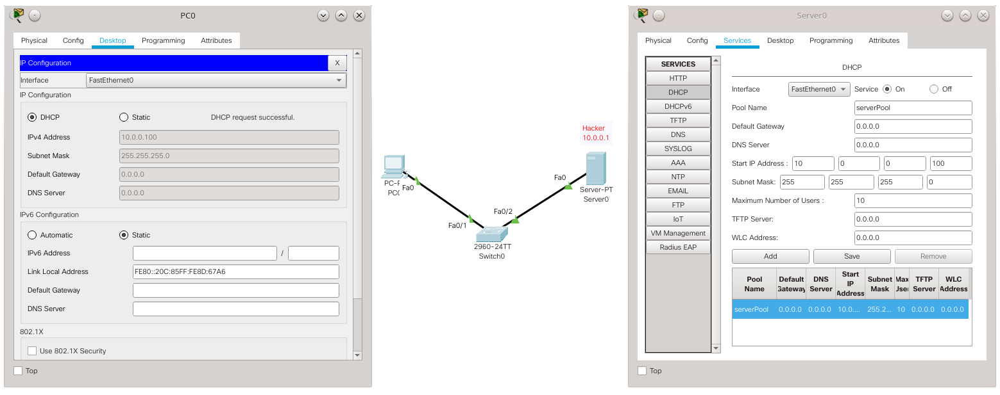

Em um cenário real haveria mais clientes e provavelmente já existiria na rede o servidor DHCP legítimo. Todavia para facilitar o exemplo, esta rede inicialmente só tem um servidor e um cliente. 

A próxima imagem apresenta a rede já com um servidor legítimo além do servidor do hacker. O cliente pediu novamente para obter um IP na rede, mas quem respondeu primeiro foi o servidor do hacker, e dá para ver que o IP do PC0 agora é o 10.0.0.101, o que mostra que ele pegou um novo IP do *hacker*. Então o cliente não conseguiu pegar a faixa de IPs 172.16.0.200-250 que está configurado no servidor legítimo.

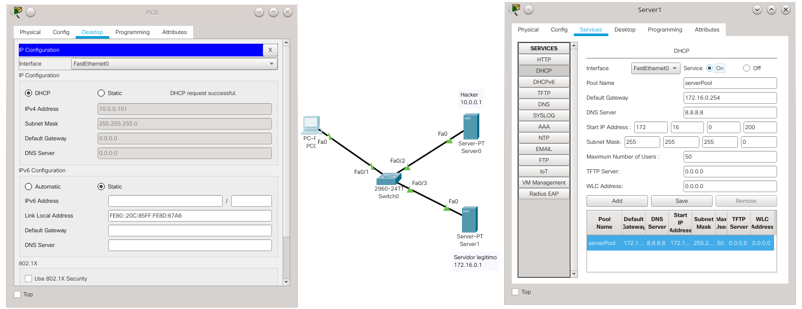

Agora vamos aplicar os comandos para permitir que respostas de DHCP sejam enviadas apenas pela porta do *switch*, na qual está conectada o servidor DHCP legítimo (no caso porta Fa0/3). É possível realizar isso utilizando os comandos a seguir:

```console
Switch>enable
Switch#configure terminal
Enter configuration commands, one per line.  End with CNTL/Z.
Switch(config)#ip dhcp snooping
Switch(config)#int fa0/3
Switch(config-if)#ip dhcp snooping trust
Switch(config-if)#
```

Os comandos anteriores basicamente habilitam o DHCP Snooping (``ip dhcp snooping``) e depois configura a porta Fa0/3 como uma porta confiável (``ip dhcp snooping trust``). Depois disso o único servidor DHCP que pode responder nesta rede é Server 1 (que é o servidor legítimo), qualquer outro servidor DHCP conectado em outra porta não conseguirá agir na rede. 

A figura a seguir mostra o cliente fazendo uma requisição de IP via DHCP e agora quem responde é o servidor legítimo, já que o *hacker* está bloqueado na rede.

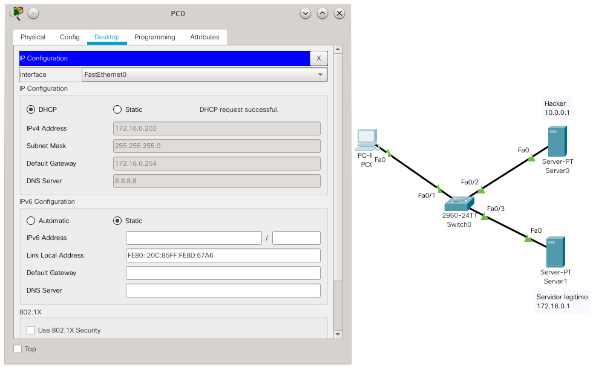

Como pode ser visto agora o PC0 pegou o IP 172.16.0.202, que vem do Server1, ou seja, o IP não vem mais do *hacker* e sim do servidor legítimo. 

## Limitando os pedidos do cliente DHCP

Ainda quanto a configuração do *switch*, também seria possível regular a quantidade de pedidos que um cliente pode fazer para servidores DHCP, o que pode evitar ataques DoS. Para fazer isso é necessário executar em cada porta do *switch* o seguinte comando: ``ip dhcp snooping limit rate 5``, neste caso só são aceitos pacotes DHCP a cada 5 segundos. É claro que é possível alterar esse valor de tempo. 

> Note que esta segurança é válida, mas possui brechas. Por exemplo, se o *hacker* tiver acesso ao *switch* ele pode facilmente inverter as portas do servidor DHCP legítimo com o servidor malicioso. Então, é importante manter a segurança física dos *switches*.

# Limitando o uso das portas dos *switches* por MAC

Alguns *switches* possuem formas de limitar o acesso às portas através de listas de MACs (endereço físico dos *hosts*) e/ou quantidade de clientes por portas. Isso ajuda a evitar *hosts* não autorizados na rede e problemas de indisponibilidade/instabilidades na rede.

No caso de switches CISCO, é possível utilizar a técnica de **Port Security**, que limita o número de MACs válidos por porta dos *switches*, desta forma *hosts* legítimos são permitidos na rede, enquanto *hosts* desconhecidos não são.

Existem as seguintes maneiras/técnicas para configurar/controlar o Port Security:

* **Lista de MACs estáticos**: nesta a lista de acesso (MAC por porta) é feita de forma estática.

* **Lista de MACs dinâmicos**: nesta os endereços MAC são identificados e armazenados dinamicamente pelo *switch*, todavia tais endereços são perdidos/apagados quando o *switch* é reiniciado ou mesmo se apenas a porta for reiniciada (o processo de tirar o cabo e recolocá-lo, já pode reiniciar a porta).

* **Lista de MACs sticky**: a mesma que a anterior, mas os endereços podem ser mantidos pelo *switch* mesmo se a porta for reiniciada ou até se o *switch* for reiniciado. Essa técnica é conhecida como "*sticky secure MAC address*". Nesta também é possível configurar MACs de forma estática, ou seja, é possível combinar estático, dinâmico e permanecer com a lista de MACs, mesmo se o *switch* for desligado.

Dentre essas maneiras: (i) o **estático** é o mais seguro, mas pode ser muito complexo manter essa em uma rede que muda constantemente; (ii) o **dinâmico** é o mais brando, não exigindo muito do administrador da rede, mas é mais para controle de número de *hosts* e desta forma não é tão seguro; (iii) o **MAC sticky** é um método intermediário, pois não é necessário o cadastro manual dos MACs, pois a rede "aprende" quais são os MACs que estão em cada porta, é claro que a segurança deste método depende de algum esforço do administrador da rede.

Em todas as configurações é possível determinar a quantidade de MACs por portas, isso ajuda a delimitar, por exemplo, se uma porta só deve ter um *host*, ou se é possível conectar um *switch* com mais *hosts*. A configuração padrão só permite um MAC por porta.

Outra configuração importante é a ação a ser tomada caso o *switch* perceba que a quantidade de MACs ou que o MAC de um *host* foi alterada/violada. No caso há três ações possíveis:

* **shutdown**: é a ação padrão, nesta quando há violações (ex. limite de *hosts* atingido ou MAC não identificado) a porta é bloqueada e não será mais possível utilizá-la a menos que o administrador execute os comandos ``shutdown`` e ``no shutdown``, para reativar a porta.

* **protect**: nesta quando há violações os pacotes referentes a está violação, são descartados e o administrador não é notificado.

* **restrict**: a mesma que a anterior, mas o administrador é notificado via SNMP, syslog e o contador é incrementado.

Cada ação tem suas vantagens e desvantagens. O **shutdown** é o mais seguro, mas exigirá mais do administrador da rede. O **protect** não incomodará o administrador, todavia pode ser menos seguro. Por fim, o **restrict** também não exige ação imediata do administrador, todavia exige que ele tenha uma rotina de verificação de registros (*logs*), para verificar se há problemas na rede.

> Atenção - Perceba que Port Security, principalmente com listas estáticas e sticky, vai trazer mais segurança para a rede, todavia deixará a rede menos flexível no sentido de aceitar automaticamente novos *hosts*. Desta forma, se a rede for muito dinâmica (sempre há *hosts* novos entrando e saindo da rede) essa técnica pode não ser recomendada, mas se a rede for mais estática (os *hosts* não mudam constantemente - exemplo: uma rede de servidores) essa técnica irá trazer mais segurança para o ambiente de rede.

A seguir vamos configurar *switches* com as com listas estáticas, *sticky* e dinâmica. 

## Lista de MACs Estáticos

Neste método é necessário relacionar manualmente o endereço físico (MAC) com a porta. Para isso vamos utilizar a rede de exemplo a seguir:

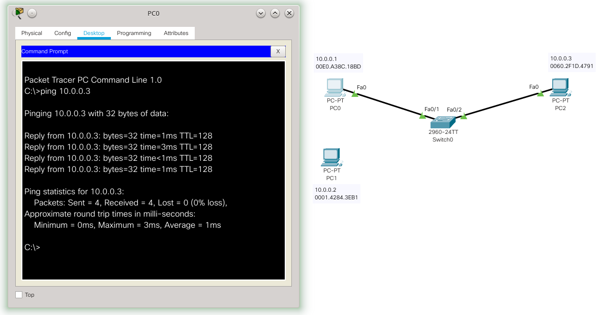

No *switch* foram executados os seguintes comandos:

```console
Switch>enable
Switch#configure terminal
Enter configuration commands, one per line.  End with CNTL/Z.
Switch(config)#interface f0/1
Switch(config-if)#switchport mode access
Switch(config-if)#switchport port-security 
Switch(config-if)#switchport port-security mac-address 00E0.A38C.18BD
Switch(config-if)#
%SYS-5-CONFIG_I: Configured from console by console
```
Depois de entrar no modo administrador para a configuração do *switch*, foi escolhida a interface a ser configurada (no caso a Fa0/1 - ``interface f0/1``), na sequência é necessário informar que essa é uma porta comum para conexão de *hosts* (``switchport mode access``). Então foi ativada a função Port Security (``switchport port-security``). Por fim, o endereço físico do PC0 foi atrelado a porta Fa0/1 (``switchport port-security mac-address 00E0.A38C.18BD``). 

Na figura anterior (com o cenário de teste), dá para ver que o PC0 já consegue pingar o PC2. Agora caso alguém tente mudar o cabo de rede e plugar outro *host* a porta Fa0/1, tal porta será desligada (*shutdown* - que é a ação padrão), tal como mostra a próxima figura (os triângulos vermelhos indicam que a porta está desativada).

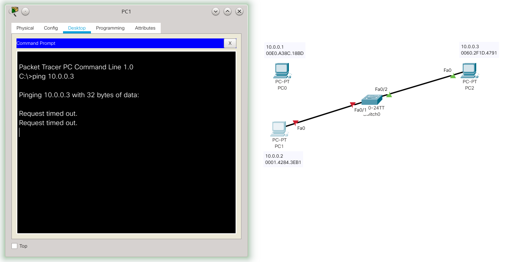

Neste caso, para restabelecer a atividade normal da porta é necessário:

* Voltar o cabo para o PC0;
* Executar em ordem os comandos ``shutdown`` e ``no shutdown``, tal como é apresentado a seguir:

```console
Switch>enable
Switch#configure terminal
Enter configuration commands, one per line.  End with CNTL/Z.
Switch(config)#int f0/1
Switch(config-if)#shutdown

%LINK-5-CHANGED: Interface FastEthernet0/1, changed state to administratively down
Switch(config-if)#no shutdown

%LINK-5-CHANGED: Interface FastEthernet0/1, changed state to up

%LINEPROTO-5-UPDOWN: Line protocol on Interface FastEthernet0/1, changed state to up

Switch(config-if)#
```
Após isso a porta volta a funcionar normalmente. Lembrando que este é o método mais seguro, todavia é o que mais vai exigir do administrador, pois ele terá que cadastrar todos os *hosts*.

# Lista de MACs sticky

Este método é similar ao estático, só que não é necessário cadastrar os endereços físicos (MACs). Pois, assim que a porta do *switch* for configurada com esse método, o primeiro *host* que acessar a porta (ou uma quantidade pré configurada de *hosts*) será relacionado automaticamente com essa porta e essa relação pode ficar até o *switch* ser reiniciado (não a porta). Se o administrador salvar essa lista na configuração de *boot* do *switch*, essa relação fica válida mesmo se o *switch* for reiniciado.

Para ilustrar esse método vamos utilizar a mesma rede do exemplo anterior, só vamos pegar uma porta diferente, no caso a porta Fa0/3. A configuração feita no *switch* agora é:

```console
Switch(config)#interface f0/3
Switch(config-if)#switchport mode access
Switch(config-if)#switchport port-security
Switch(config-if)#switchport port-security mac-address sticky 
```
Os três primeiros comandos são iguais ao exemplo anterior, a diferença é o último comando que configura o Port Security da Fa/03 para usar *mac-address* por *sticky*, ou seja, o primeiro endereço que passar por esta porta vai ficar grudado nela. ;-)

A figura a seguir mostra o cenário e o status do Port Security para a porta Fa0/3, o principal a se notar é que ainda não há endereço MAC atrelado a porta (``Last Source Address:Vlan   : 0000.0000.0000:0``). É possível ver isso utilizando o comando ``show port-security int f0/3``.

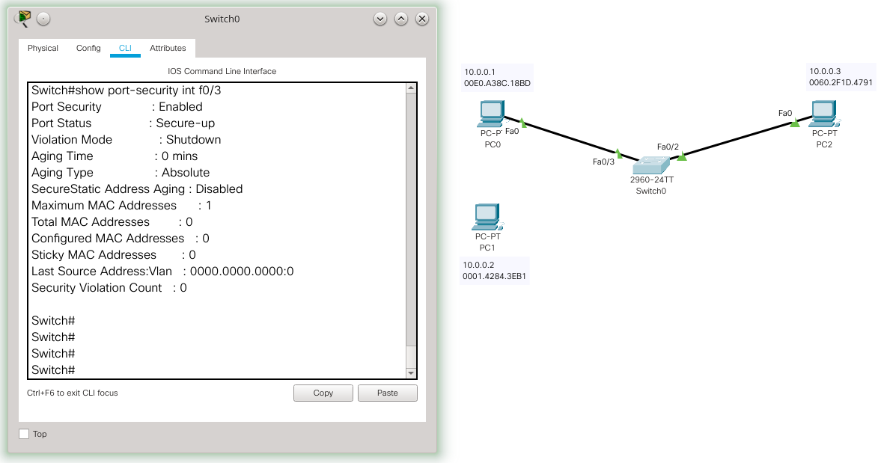

Na sequência foi realizado um *ping* do PC0 para o PC3 (``ping 10.0.0.3``), ou seja, o *switch* vai "aprender" que o *host* conectado a porta Fa0/3 é o PC0. Então, pela regra do *sticky*, o endereço físico do PC0 vai ficar atrelado a esta porta, até o *switch* ser reinicializado. Isso pode ser visto na figura a seguir.

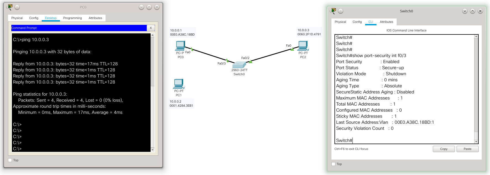

Desta forma, agora a porta Fa0/3 do *switch* está relacionada com o MAC 00E0.A38C.18BD do PC0 (``Last Source Address:Vlan   : 00E0.A38C.18BD:1``). Para testar a eficácia do método vamos trocar o cabo do PC0 para o PC1. Tal resultado é apresentado na figura a seguir.


A figura anterior mostra que o *link* entre o PC1 e PC2 foi bloqueado, pois violou a relação criada pelo *sticky*. Para a porta voltar ao normal é necessário religar o cabo com o PC0 e desligar/ligar a interface Fa0/3. O comando ``show port-security`` mostra o status das portas no método Port Security.

Imaginando que o PC0 não vá ou não deva mudar de porta neste cenário de rede. Agora o administrador pode utilizar o comando ``copy running-config startup-config``, para salvar no *switch* a relação entre *host* e porta descoberta pelo *sticky*. Então, mesmo que o *switch* seja reiniciado esta ligação permanecerá (não é necessário reaprender quem está lá).

> Caso o administrador não queira salvar a lista de MACs, mas queira salvar somente a configuração do *sticky*, ele deve fazer isso antes de colocar o *switch* em produção. Ou seja, faz as configurações *sticky*, então salva com o comando ``copy`` e somente depois deixa os *hosts* utilizarem as portas.

# Lista MAC dinâmica

Neste método, tal como o anterior, a lista de MACs é preenchida automaticamente pelo *switch*, todavia o *switch* não vai lembrar desta lista quando for reiniciado. 

É importante notar que tais endereços serão desvinculados/esquecidos se a própria porta for reiniciada (não só o *switch* inteiro) e isso acontece, por exemplo, quando você remove o cabo da porta e o conecta novamente. Isso significa que o cenário apresentado no exemplo anterior não é possível com esse método, pois o ato de tirar o cabo do PC0 e plugar no PC1 fará com que o *switch* esqueça que o PC0 era o *host* conectado à porta e quando o PC1 for conectado, tal PC1 passará a ser o novo PC atrelado aquela porta, sem nenhum tipo de violação. Então, neste caso, o presente método será mais útil para controlar se em uma porta foi conectada em outro *switch* e a quantidade de *hosts* conectados à este novo *switch*.

Dado o que foi descrito anteriormente vamos mudar o cenário de rede do exemplo da seguintes maneira: (i) utilizando a porta Fa0/4 para a configuração dinâmica; (ii) e principalmente conectando a porta Fa0/4 um outro *switch*, que por sua vez está conectado aos dois *hosts*. A figura a seguir mostra esse novo cenário.

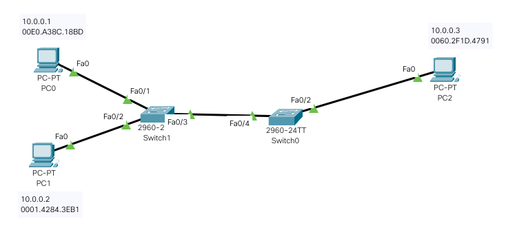

> O novo *switch* (Switch1) não possui configurações extras, ele está representando um *switch* ou AP, que foi plugado na rede de forma não autorizada.

Bem, neste novo cenário vamos configurar a porta Fa0/4 do Switch0 de forma que ela permita que apenas um dos *hosts* conectados à porta acesse a rede. Note que o próprio Switch1 pode ser o primeiro a se comunicar com a porta, então nem o PC0 nem o PC1 conseguirá acessar a rede. Então, para o exemplo funcionar, deixando pelo menos um dos PCs acessar a rede, vamos configurar o *switch* para permitir dois *hosts* na porta - provavelmente será o Switch1 e um dos PCs. Os comandos necessários para isso são:

```console
Switch>enable
Switch#configure terminal
Enter configuration commands, one per line.  End with CNTL/Z.
Switch(config)#interface f0/4
Switch(config-if)#switchport mode access
Switch(config-if)#switchport port-security
Switch(config-if)#switchport port-security maximum 2
Switch(config-if)#switchport port-security violation restrict 
Switch(config-if)#
```
Em ordem os comandos executados fazem:

* ``enable``, ``configure terminal`` e ``interface f0/4``: dão acesso a configuração como administrador à port Fa0/4.

* ``switchport mode access``: informa que é uma porta comum, que espera conectar *hosts*.

* ``switchport port-security``: habilita o Port Security e como nada mais foi informado o padrão é o método dinâmico que estamos usando neste exemplo.

* ``switchport port-security maximum 2``: configura a porta para aceitar até dois *hosts*. Essa configuração é opcional e caso não seja feita o padrão é aceitar apenas um *host* por porta.

* ``switchport port-security violation restrict ``: altera a ação a ser tomada, caso a porta seja violada. Alterar a ação da violação também é uma configuração opcional. Lembrando que o padrão é *shutdown*, mas com esse comando a ação foi alterada para *restrict*, ou seja, bloqueia os pacotes da violação e envia mensagens para o administrador. 

> Atenção - as opções *maximum* e *violation*, também podem ser utilizadas nos métodos estático e por *sticky*.

Agora com a presente configuração da porta Fa0/4, só vai ter acesso à rede os dois primeiros *hosts* que acessarem a rede, o terceiro ficará de fora. 

> No método dinâmico envolve uma questão de "sorte", para quem vai ganhar o acesso à rede. O primeiro *host* que tentar acessar a porta e conseguir será o "sortudo".

Na figura a seguir é apresentada a tentativa do PC0 e PC1 acessar a rede. No caso o PC0 foi mais rápido que o PC1 e conseguiu acessa a rede, então o PC1 foi bloqueado. É muito importante lembrar que o Switch1 também conta como um *host*, e por isso os dois *hosts* que podem acessar a rede são Switch1 e PC0, já o PC1 terá seus pacotes barrados.

> **Atenção** - Em alguns casos pode não ser necessário contar um dos dispositivos a mais, como foi este caso do Switch1. Por exemplo, isso provavelmente não seria necessário caso estivéssemos utilizando um *hub*.


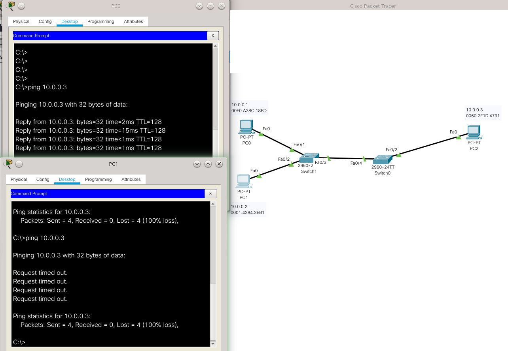


Voltando a questão da alteração da ação de *shutdown* (padrão) para *restrict*. Neste cenário foi realizada essa alteração, pois com o *shutdown* o administrador vai ter que reabilitar a porta toda vez que o *host* "azarado" tentar acessar a rede e isso pode tomar muito o tempo do administrador. Assim, para este caso optou-se por simplesmente descartar os pacotes do computador "azarado", sem incomodar o administrador. Essa é uma boa alternativa para redes dinâmicas, nais quais não se tem muito controle sobre quem vai tentar acessar a rede.

Por fim, a técnica Port Security é uma opção de proteção para as redes que utilizam *switches* CISCO. Todavia, sua implementação deve ser bem pensada e planejada. Caso contrário essa técnica pode trazer bloqueios e comportamentos indesejados para a rede, similares às pragas digitais que estamos tentando evitar. É claro que se for implementada corretamente trará grandes benefícios para a rede à segurança e desempenho da rede.

# Conclusão

Como foi apresentado aqui há várias opções de configurações de *switches*, inclusive não contemplamos todas neste texto. Assim, cada administrador deve avaliar quando e como utilizar tais opções, tentando dosar corretamente todas essas opções, para desta forma tornar as redes mais rápidas, seguras e fáceis de manter.

# Referências:

* CISCO. Routing and Switching Essentials - Companion Guide. Cisco Press. ISBN-13: 978-1-58713-318-3. 2014.
* <https://www.certificationkits.com/cisco-certification/ccna-articles/cisco-ccna-switching/cisco-ccna-port-security-and-configuration/>
* <https://www.cisco.com/c/en/us/td/docs/switches/lan/catalyst6500/ios/15-0SY/configuration/guide/15_0_sy_swcg/port_security.pdf>