Ativar acesso remoto em roteadores e switches CISCO
====================================================

>**UTFPR - Universidade Tecnológica Federal do Paraná, campus Campo Mourão**  
>Autor: **Prof. Dr. Luiz Arthur Feitosa dos Santos**  
>E-mail: **<luizsantos@utfpr.edu.br>**  

-----------------------

O acesso remoto é muito importante em um ambiente de rede, pois isso pode facilitar a vida do administrador de redes e agilizar suas tarefas. Todavia também é importante fazer isso da maneira correta para não trazer vulnerabilidades para a rede.

O acesso remoto neste caso pode ser visto como o "compartilhamento" via rede do ambiente de trabalho (ambiente onde são executados comandos). Existem vários programas que permitem esse tipo de ação, para usuários finais em ambientes *desktop* é comum fazer uso de programas como o [LogMeIn](https://www.logmein.com/pt), [VNC](https://pt.wikipedia.org/wiki/Virtual_Network_Computing), dentre outros similares. 

Contudo em ambientes de infraestrutura de rede é mais comum fazer acesso remoto via [Telnet](https://pt.wikipedia.org/wiki/Telnet) e [SSH](https://pt.wikipedia.org/wiki/Secure_Shell). Sendo que o Telnet é um protocolo dos primórdios da computação que mesmo nos dias atuais é muito utilizado ainda. Entretanto, atualmente não é nada recomendável utilizar o Telnet, pois esse transmite tudo pela rede como texto puro, ou seja, qualquer um com um analisador de tráfego de rede pode capturar usuários/senhas de sistemas que utilizam Telnet. Assim, o seu sucessor natural é o SSH, que faz o mesmo que o Telnet e um pouco mais, e o melhor! Transmite todos os dados de forma criptografada, o que mantem a confidencialidade dos dados enviados pela rede.

> Mesmo que o Telnet não seja recomendável devido a sua falta de segurança, ele ainda é muito utilizado e por isso recomendá-se que administradores de redes saibam como configurar e utilizar tanto cliente como o servidor Telnet.

A seguir são apresentados como habilitar, configurar e utilizar o acesso remoto em roteadores e *switches* CISCO, focando o SSH que é o método mais seguro e recomendado, mas em alguns casos há possibilidade de utilizar o Telnet ou HTTP. 


# Switches

É possível fazer acesso remoto também em *switches*, alguns possuem interface gráfica através de HTTP. Aqui iremos trabalhar com acesso via SSH em *switches* CISCO.

> Lembrando que habilitar esse tipo de acesso trás mas comodidade e agilidade para o administrador, todavia aumenta o riscos de ataques cibernéticos. Então, caso o acesso remoto não seja altamente necessário não o habilite.

## Acessando o terminal de configuração

Para iniciar vamos criar no simulador da CISCO (Packet Tracer) uma rede com um *switch* e dois computadores, tal como na figura a seguir:

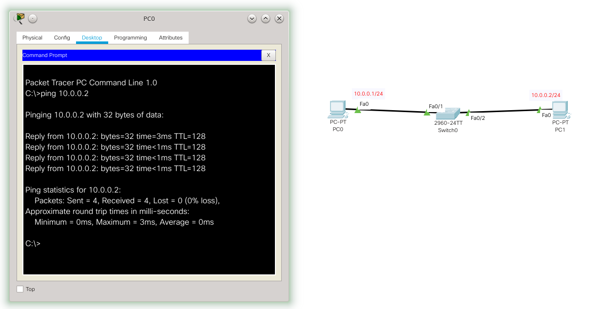

No cenário de rede da figura anterior, a principio, não é necessário nenhuma configuração para o *switch* funcionar. Neste cenário só foi configurado o PC0 com o IP 10.0.0.1/24 e 10.0.0.2/24, para o PC1. O PC0 consegue acessar o PC1, e o contrário também - ou seja, a rede está funcional. Todavia nenhum desses PCs conseguem acessar/gerenciar o *switch* via rede, para que isso aconteça é necessário configurá-lo. No simulador isso é feito clicando em cima do switch e indo na aba CLI, tal como ilustrado na figura a seguir:

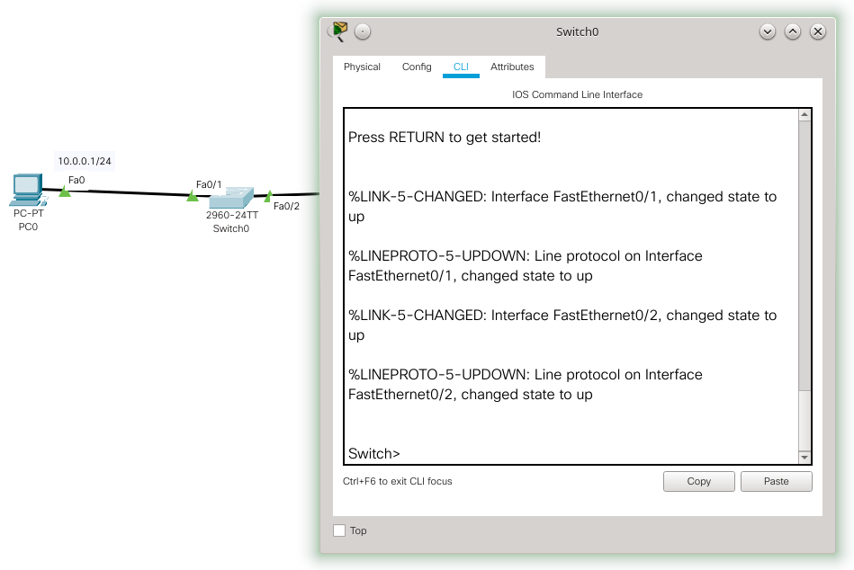

Agora para configurar o *switch* basta entrar com os comandos via terminal, e é possível por exemplo, habilitar o gerenciamento remoto. Todavia na vida real não dá para clicar em cima do *switch*, então provavelmente será necessário acessá-lo inicialmente via terminal serial e só depois de configurá-lo será possível acessar o *switch* via rede, facilitando assim o gerenciamento do mesmo. 

Para fazer acesso via serial no simulador será necessário inserir um cabo console em um PC tal com ilustrado na figura a seguir, para esse exemplo iremos fazer esse acesso pelo PC2 que foi inserido só para essa tarefa, depois de colocar o cabo console na interface console do *switch* e RS323 do PC, clique no PC e na aba Desktop clique em Terminal, tal como na figura a seguir:

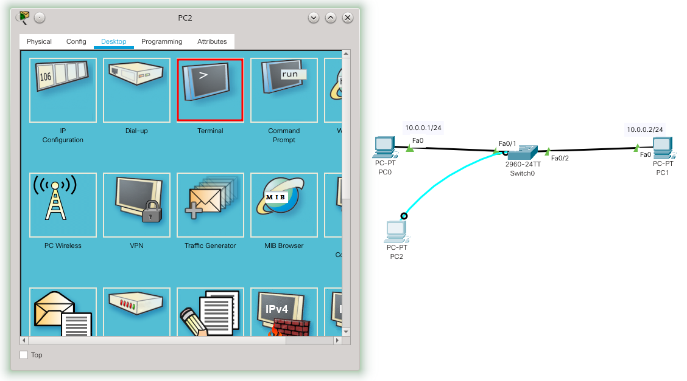

Feito isso será apresentada uma tela para a configuração do console serial, a principio já está tudo configurado corretamente, então é só clicar em OK. Na vida real seria necessário instalar algum programa de acesso a console serial e ai configurar com as opções que estão na figura a seguir. Mas o procedimento é basicamente o mesmo.

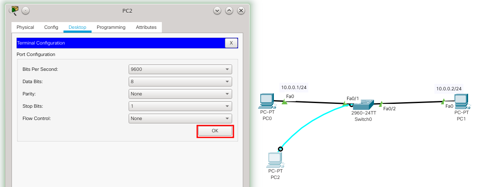

Depois de clicar em OK, será apresentado um terminal, que representa o terminal do *switch*, ou seja, você está acessando o *switch* remotamente via cabo serial.

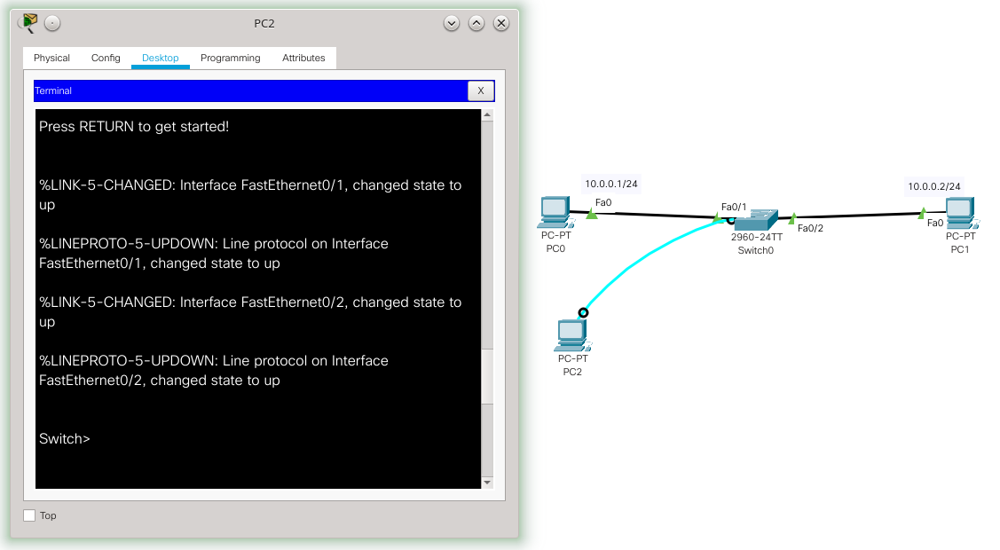

Após acessar o *switch* via cabo serial, o ambiente de configuração é mesmo que obter o terminal clicando no ícone do *switch*, tal como apresentado anteriormente, ou seja, conseguindo o  terminal, a configuração é a mesma para ambas as alternativas no simulador (configurar clicando no *switch* ou via cabo serial).

## Configurando o *switch* para ser acessado remotamente

Com acesso ao console/terminal do *switch* é possível configurá-lo com um IP para realizar o acesso remoto via rede TCP/IP. Para isso é necessário executar os seguintes comandos:

```console
Switch>enable
Switch#configure terminal
Enter configuration commands, one per line.  End with CNTL/Z.
Switch(config)#interface vlan 99
Switch(config-if)#ip address 10.0.0.3 255.255.255.0
Switch(config-if)#no shutdown
Switch(config-if)#ip default-gateway 10.0.0.254
Switch(config)#
```

Bem, os comandos anteriores habilitaram a configuração no *switch* ``enable`` e ``configure terminal``. Depois, configuramos o IP 10.0.0.3/24 na interface de rede chamada ``vlan 99``, que é uma VLAN que deve ser vinculada posteriormente com as portas do *switch*, para ditar quem tem acesso remoto ao *switch*. Opcionalmente também foi configurado um *gateway* padrão, desta forma é possível, a principio, acessar o *switch* de outras redes, é claro que isso deixa o *switch* mais vulnerável à ataques externos, então só coloque um *gateway* padrão se for estritamente necessário, caso contrário deixe apenas o acesso à rede local.

Configurado o IP na VLAN 99, agora basta informar qual porta do *switch* tem acesso a essa VLAN, exemplo:

```console
Switch(config)#
Switch(config)#interface f0/2
Switch(config-if)#switchport access vlan 99
Switch(config-if)#
%LINEPROTO-5-UPDOWN: Line protocol on Interface Vlan99, changed state to up

Switch(config-if)#
```

Neste caso a porta f0/2 do *switch* foi atrelada a VLAN 99, o que dará acesso ao IP do *switch* e consequentemente o PC1 poderá acessar o *switch* remotamente via TCP/IP. Para verificar isso é possível pingar o IP do *switch* a partir do PC1, tal como apresentado na figura a seguir:

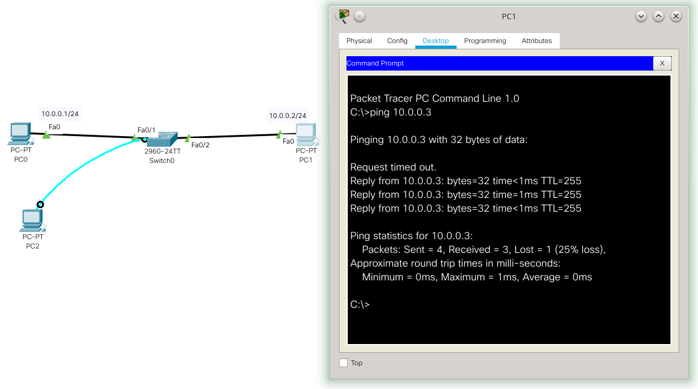

Note que não é possível acessar o *switch* via PC1, pois esse não está vinculado a VLAN 99. Isso é interessante em termos de segurança, pois assim é possível limitar os *hosts* que possuem acesso ao *switch* - é claro que isso não é perfeito, pois a segurança está relacionada á porta do *switch* e não a um *host*/usuário específico. A figura a seguir mostra que não é possível acessar o *switch* a partir do PC0.

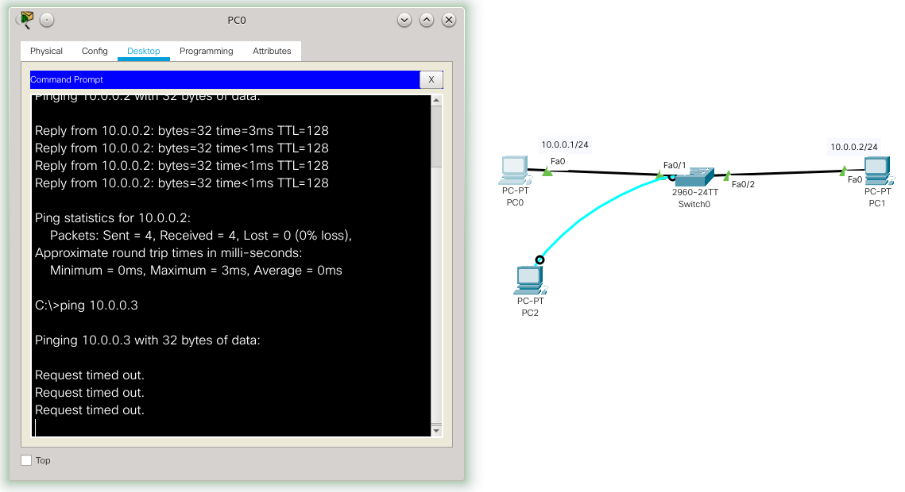

Agora temos que habilitar e configurar o serviço de SSH no *switch*.

## Configurando o SSH

Primeiro é necessário gerar a chave de criptografia utilizada pelo SSH para manter os dados confidenciais. Para isso é recomendável configurar o nome do *host* e do domínio, tal como é ilustrado pelos comandos a seguir:

```console
Switch>enable
Switch#configure terminal
Enter configuration commands, one per line.  End with CNTL/Z.
Switch(config)#hostname sw0
sw0(config)#ip domain name cyberinfra
sw0(config)#crypto key generate rsa
The name for the keys will be: sw0.cyberinfra
Choose the size of the key modulus in the range of 360 to 2048 for your
General Purpose Keys. Choosing a key modulus greater than 512 may take
a few minutes.

How many bits in the modulus [512]: 
% Generating 512 bit RSA keys, keys will be non-exportable...[OK]

sw0(config)#
```

Antes de continuar com o SSH é recomendável habilitar a senha para acessar o terminal de configuração da administração do switch (que é obtida após o comando ``enable``), isso é feito pelo comando:

```console
sw0(config)#enable password 123mudar
*Mar 1 1:58:28.322: RSA key size needs to be at least 768 bits for ssh version 2
*Mar 1 1:58:28.323: %SSH-5-ENABLED: SSH 1.5 has been enabled
sw0(config)#
```
Neste caso colocamos a senha ``123mudar``.

O próximo passo é configurar realmente o usuário e senha do SSH:

```console
sw0(config)#username admin password abc123
sw0(config)#
```

Neste exemplo o nome do usuário é admin e a senha é ``abc123``, para título de exemplo estamos utilizando nomes de usuários e senhas fáceis de lembrar, mas na prática utilize usuários e senhas apropriadas. Note que as senhas para acessar o SSH e ter acesso ao terminal de configuração são diferentes, elas podem ser iguais, mas isso seria menos seguro.

Para finalizar é necessário configurar o SSH para dar acesso ao terminal do *switch*, isso é feito com os comandos a seguir:

```console
sw0(config)#ip ssh version 2
Please create RSA keys (of at least 768 bits size) to enable SSH v2.
sw0(config)#line vty 0 15
sw0(config-line)#transport input ssh
sw0(config-line)#login local
sw0(config-line)#end
sw0#copy running-config startup-config
Destination filename [startup-config]? 
Building configuration...
[OK]
sw0#
```

Com o *switch* disponível via IP na rede, com o SSH habilitado e configurado, é possível acessar o servidor SSH no *switch* através de um cliente SSH, neste exemplo, o cliente SSH está no PC1. A figura a seguir apresenta um acesso via SSH do PC1 para o *switch*.

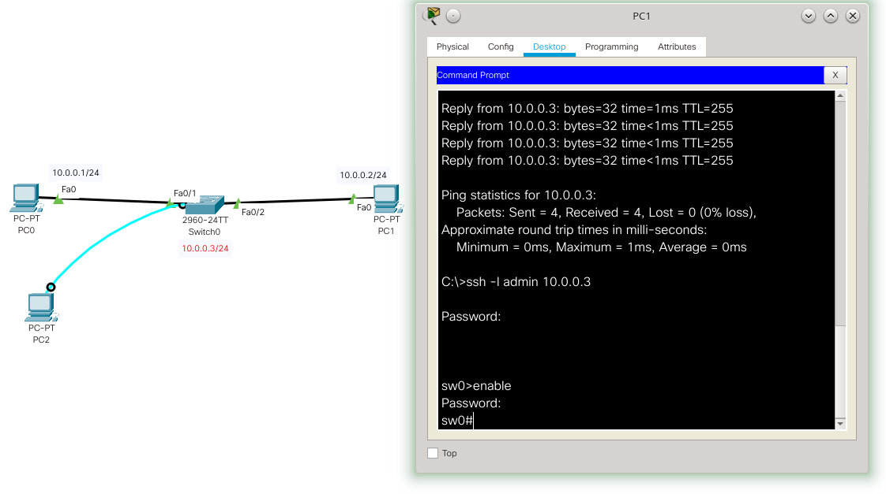

Na imagem anterior depois de testar a conectividade com o *host*, com o comando ``ping``. Foi utilizado o comando ``ssh -l admin 10.0.0.3``, para acessar o *switch* via SSH. Neste caso o *switch* está acessível pelo IP 10.0.0.3 com o usuário ``admin``, para este usuário havíamos configurado a senha ``abc123``. 
Após isso, fica disponível o *prompt* de comando do *switch*. 
Então, é possível executar o comando ``enable`` para ter acesso as configurações do *switch*, neste caso também foi configurado uma senha para o usuário mudar para o administrador do sistema, tal senha neste exemplo é ``123mudar``.

> Em um cenário real, tanto com *switch* quanto com roteador, após configurar o servidor SSH não seria mais necessário utilizar o acesso via cabo serial.

# Roteadores

É muito comum fazer o uso de acesso remoto à roteadores, já que esses são dispositivos acessíveis diretamente via rede, ou seja possuem IPs. Então, normalmente é muito comodo configurar um roteador remotamente. 

> **Atenção** - se você errar ao configurar um roteador remotamente, você pode perder o acesso a rede/roteador e consequentemente você será desconectado e pode chegar ao extremo de não ter mais como configurar o equipamento remotamente. Ou seja, você terá que fazer acesso local/físico à máquina e isso pode significar andar quilômetros para ter esse acesso físico. Então, **é necessário cuidado redobrado ao executar comandos remotamente em equipamentos como roteadores**.


## Acessando o terminal de configuração

No caso de roteadores CISCO, se você estiver utilizando o simulador Packet Tracer da CISCO para estudar/treinar, basta clicar no ícone do roteador no cenário de rede e depois clicar na aba CLI. Tal como ilustrado no cenário de rede da figura a seguir.

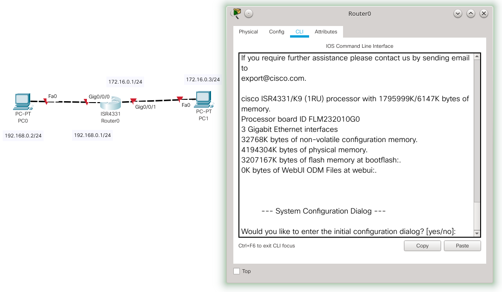

Na prática (não no simulador), pode ser necessário utilizar um cabo serial conectando um computador ao roteador, para iniciar a configuração. Tal como foi feito na configuração do *switch* (o texto anterior detalha melhor a conexão serial) e é apresentado nas figuras a seguir:

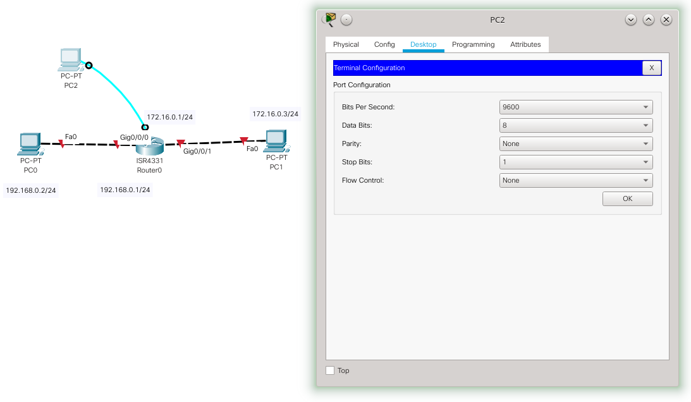

Na figura anterior é adicionado um computador (PC2) ligado a um cabo serial/console ao roteador, depois (no simulador) clicamos no PC2, Desktop e Terminal, onde ai aparece a configuração do terminal, mas não é necessário configurar nada, só pressionar OK. Após isso é apresentado o terminal/console de configuração do roteador, ou seja, é feita a conexão serial entre PC2 e roteador. Tal como ilustra a figura a seguir:

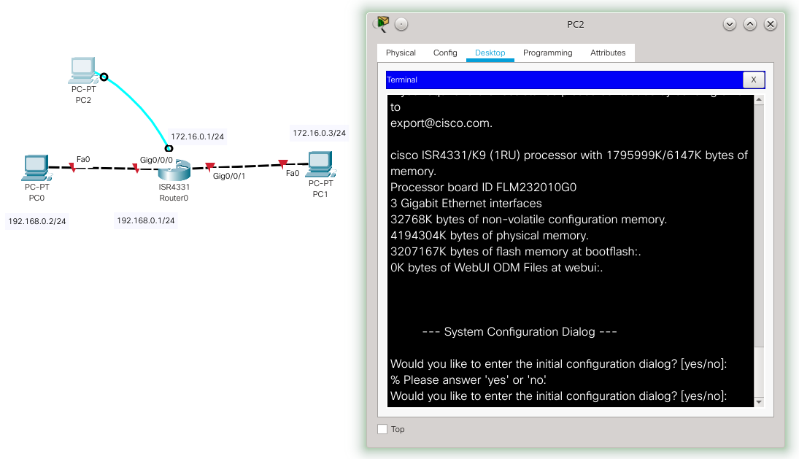

Lembrando que no simulador não é necessário ter um computador ligado no cabo serial, é só clicar no dispositivo e acessar o CLI deste dispositivo (roteador/*switch*). Todavia é bom saber fazer isso, pois na vida real o processo inicial pode ser este.

## Configurando o roteador para ser acessado remotamente

Depois de ter acesso ao terminal do roteador é necessário configurar IPs para poder acessar via rede. Ou seja, é necessário configurar IPs nas interfaces do roteador - que é o básico a se fazer em um roteador.

Um exemplo de configuração de IPs no roteador é apresentado a seguir:

```console
Would you like to enter the initial configuration dialog? [yes/no]: no


Press RETURN to get started!


Router>enable
Router#configure terminal
Enter configuration commands, one per line.  End with CNTL/Z.
Router(config)#interface g0/0/0
Router(config-if)#ip address 192.168.0.1 255.255.255.0
Router(config-if)#no shutdown

Router(config-if)#
%LINK-5-CHANGED: Interface GigabitEthernet0/0/0, changed state to up

%LINEPROTO-5-UPDOWN: Line protocol on Interface GigabitEthernet0/0/0, 
changed state to up

Router(config-if)#interface g0/0/1
Router(config-if)#ip address 172.16.0.1 255.255.255.0
Router(config-if)#no shutdown

Router(config-if)#
%LINK-5-CHANGED: Interface GigabitEthernet0/0/1, changed state to up

%LINEPROTO-5-UPDOWN: Line protocol on Interface GigabitEthernet0/0/1, 
changed state to up

Router(config-if)#
```

Na figura anterior foi configurado o IP 192.168.0.1/24 na interface ``GigabitEthernet0/0/0`` do roteador e o IP 172.16.0.1/24 na interface ``GigabitEthernet0/0/1``. Com essa configuração tanto PC0 quanto PC1 podem "pingar" o roteador. Tal como é ilustrado na figura a seguir:

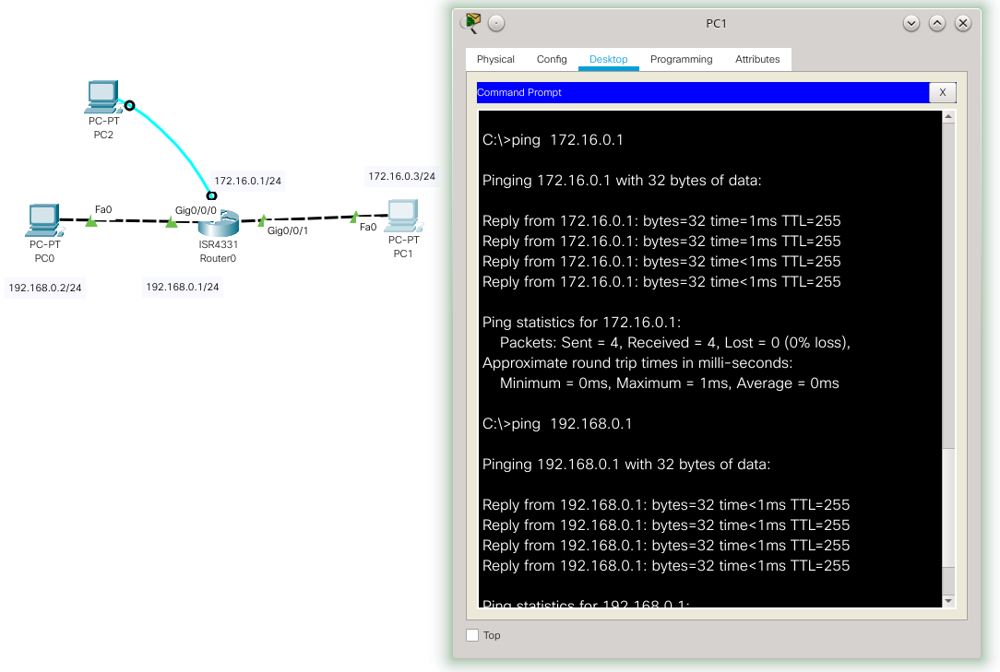


Apesar do roteador já estar funcionando na rede, não é possível acessá-lo via SSH, pois esse normalmente está desabilitado. Portando agora basta ativar o SSH para o gerenciamento remoto.

## Configurando o SSH

O processo de configuração do servidor SSH é o mesmo realizado no *switch*. A figura a seguir apresenta os passos para configurar o SSH no roteador do cenário simulado neste exemplo:

```console
Router>enable
Router#configure terminal
Enter configuration commands, one per line.  End with CNTL/Z.
Router(config)#hostname r0
r0(config)#ip domain name cyberinfra
r0(config)#crypto key generate rsa
The name for the keys will be: r0.cyberinfra
Choose the size of the key modulus in the range of 360 to 2048 for your
General Purpose Keys. Choosing a key modulus greater than 512 may take
a few minutes.

How many bits in the modulus [512]: 
% Generating 512 bit RSA keys, keys will be non-exportable...[OK]

r0(config)#username admin password abc123
*Mar 1 1:11:53.304: RSA key size needs to be at least 768 bits for ssh version 2
*Mar 1 1:11:53.304: %SSH-5-ENABLED: SSH 1.5 has been enabled
r0(config)#enable password 123mudar
r0(config)#ip ssh version 2
Please create RSA keys (of at least 768 bits size) to enable SSH v2.
r0(config)#line vty 0 15
r0(config-line)#transport input ssh
r0(config-line)#login local
r0(config-line)#end
r0#
%SYS-5-CONFIG_I: Configured from console by console

r0#copy running-config startup-config
Destination filename [startup-config]? 
Building configuration...
[OK]
r0#
```

Basicamente os comandos anteriores fazem:

* ``enable`` e ``configure terminal`` -  dão acesso á área de administração e configuração do roteador;

*  ``hostname r0`` e ``ip domain name cyberinfra`` - atribuem um nome e um domínio ao roteador, isso é recomendável para ajudar na criação da chave criptográfica;

*  ``crypto key generate rsa`` - gera a chave criptográfica;

*  ``username admin password abc123`` - cria um usuário chamado admin e com a senha abc123, tal usuário/senha será utilizado para acessar o roteador via SSH - lembre de utilizar usuários e senhas fortes, aqui é só um exemplo.

* ``enable password 123mudar`` - atribui uma senha que será requisitada quando o usuário tentar mudar para o modo configuração/administrador do roteador. Isso não é obrigatório mais é recomendável por motivos de segurança. De preferência utilize senhas diferentes para o usuário do SSH e essa senha;

* ``ip ssh version 2`` - configura a versão utilizada no SSH, neste caso a versão 2;

* ``line vty 0 15`` e ``transport input ssh`` - habilita o console via SSH;

*  ``login local`` - configura o roteador para usar usuários/senhas locais durante o *login*.

Após essa configuração já é possível acessar o roteador via rede utilizando o SSH. Note que esse acesso pode ser feito de qualquer *host* da rede local, ou de outras redes/*hosts* que tenham acesso à esse roteador. Então habilitar o SSH no roteador é muito comodo, todavia é extremamente perigoso, desta forma recomendá-se o uso de ferramentas de segurança, tais como *firewall*, para evitar possíveis ataques.

A figura a seguir mostra o acesso do PC1 ao roteador, via SSH:

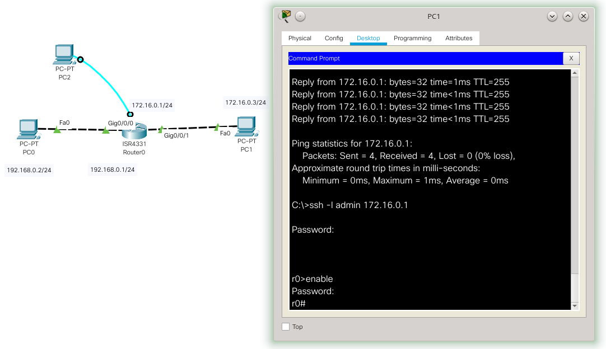

Na figura anterior o comando ``ssh -l admin 172.16.0.1`` é o programa cliente que pede acesso ao servidor SSH, que está disponível no roteador 172.16.0.1, com o usuário ``admin``. Neste caso do exemplo, a senha para acessar o SSH com ``admin`` é ``abc123``. Após isso o usuário pode mudar para o modo configuração do roteador com o comando ``enable``, no qual a senha do exemplo é ``123mudar``.

> Em um cenário real, tanto com *switch* quanto com roteador, após configurar o servidor SSH não seria mais necessário utilizar o acesso via cabo serial.

# Conclusão

O acesso remoto à *switches* e roteadores é muito útil na administração das redes de computadores. Todavia deve ser utilizado com cautela para não gerar problemas de segurança. Atualmente o método mais indicado é o uso do SSH, todavia esse deve ser configurado com porta distintas da padrão e o acesso de preferência deve ser local.


# Referência

* CISCO. Routing and Switching Essentials - Companion Guide. Cisco Press. ISBN-13: 978-1-58713-318-3. 2014.
* <https://www.thegeekstuff.com/2013/08/enable-ssh-cisco/>.