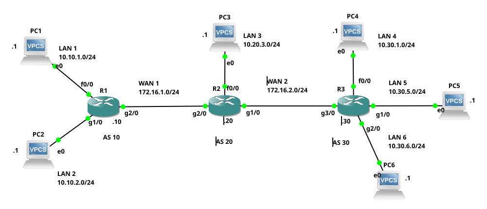
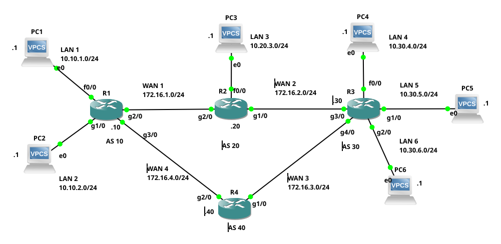

# BGP

O BGP (*Border Gateway Protocol*), é um protocolo EGP (*Exterior Gateway Protocol*), ou seja, é um protocolo de roteamento dinâmico utilizado para interligar Sistemas Autônomos (AS) na Internet. No que se trata de Internet, o BGP4, é atualmente o único protocolo EGP utilizado para interconectar as redes da Internet, o que torna o BGP extremamente importante.

A configuração do BGP basicamente se classifica e distingue, de duas formas: eBGP (*exterior Gateway Protocol*) e iBGP (*interior Gateway Protocol*). Um eBGP, é utilizado para interligar roteadores de ASs distintos. Já o iBGP, é utilizado para interligar roteadores de um mesmo AS.


A seguir serão apresentados alguns exemplos simples de como configurar redes/roteadores utilizando o protocolo BGP em roteadores CISCO.

> Não é intenção deste material cobrir toda a teoria e prática que envolve o BGP. O objetivo aqui é apenas apresentar uma introdução a respeito de como configurar minimamente roteadores com BGP.

# Exemplo 1 - Configuração eBGP

Neste exemplo vamos configurar a rede ilustrada na Figura 1, que é composta de três ASs, senso esses: AS10, AS20, e AS30. Cada AS tem apenas um roteador. Neste exemplo cada *host* conectado ao roteador está representando uma rede inteira, assim cada AS/roteador tem as seguintes redes:
* AS10/roteador 1 (R1):
    * LAN1 - 10.10.1.0/24;
    * LAN2 - 10.10.2.0/24;
* AS20/roteador 2 (R2):
    * LAN3 - 10.20.3.0/24;
* AS30/roteador 3 (R3):
    * LAN4 - 10.30.4.0/24;
    * LAN5 - 10.30.5.0/24;
    * LAN6 - 10.30.6.0/24.

Os roteadores deste cenário estão conectados pelas redes 172.16.1.0/24 e 172.16.2.0/24, que na figura são WAN1 e WAN2 respectivamente. Todas as redes no cenário utilizam máscaras classe C, restando então apenas o último octeto para representar *hosts*, o valor desse último octeto está presentando por um ponto seguido de um número do lado de cada equipemento de rede, por exemplo, o PC1 tem um ".1" ao seu lado o que significa que ele é o IP 10.10.1.1/24. Já o R2 tem um .20, significando que ele tem o IP 172.16.1.20/24 em WAN1 e 172.16.2.20/24 em WAN2, e assim por diante.

A configuração dos IPs na interfaces de rede dos roteadores CISCO podem ser obtidas/vistas [clicando aqui](bgp-ebgp1-interfaces)

|  |
|:--:|
| Figura 1 - Cenário de rede do Exemplo 1 |

## Configuração do BGP no R1

Para iniciar a configuração do BGP em roteadores CISCO, é necessário entrar na configuração do roteador (``configure terminal``) e executar o comando ``router bgp``, seguido do número que representa o AS a que pertence aquele roteador.

Na sequência é possível configurar a relação entre os pares/vizinhos daquele roteador BGP (``neighbor``), bem como as redes que ele vai publicar (``network``), veja a saída a seguir:

```console
R1#configure terminal
Enter configuration commands, one per line.  End with CNTL/Z.
R1(config)#router bgp 10
R1(config-router)#neighbor 172.16.1.20 remote-as 20
R1(config-router)#network 10.10.1.0 mask 255.255.255.0
R1(config-router)#network 10.10.2.0 mask 255.255.255.0
R1(config-router)#exit
R1(config)#end
```
No exemplo dos comandos anteriores, em ordem foram executados os seguintes passos pelos seguintes comandos:
* R1 foi colocado como sendo parte do AS 10 (``router bgp 10``);
* Estabeleceu-se que R1 é vizinho de R2, que faz parte do AS 20 (``neighbor 172.16.1.20 remote-as 20``);
* R1 deve anunciar via BGP as redes 10.10.1.0/24 e 10.10.2.0/24, isso foi feito respectivamente pelos comandos:
    * ``network 10.10.1.0 mask 255.255.255.0``;
    * ``network 10.10.2.0 mask 255.255.255.0``.

Feita a configuração apresentada anteriormente, é possível executar o comando ``show ip bgp summary``, para verificar a conectividade de R1 no AS10 com o seu vizinho R2, no AS20, veja a saída a seguir:

```console
R1#show ip bgp summary
BGP router identifier 172.16.1.10, local AS number 10
BGP table version is 1, main routing table version 1
2 network entries using 264 bytes of memory
2 path entries using 104 bytes of memory
2/0 BGP path/bestpath attribute entries using 336 bytes of memory
0 BGP route-map cache entries using 0 bytes of memory
0 BGP filter-list cache entries using 0 bytes of memory
BGP using 704 total bytes of memory
BGP activity 2/0 prefixes, 2/0 paths, scan interval 60 secs

Neighbor        V          AS MsgRcvd MsgSent   TblVer  InQ OutQ Up/Down  State/PfxRcd
172.16.1.20     4         20       0       0        0    0    0 never    Active
```

A saída anterior do comando, mostra que o BGP foi configurado em R1 e que esse pertence ao AS 10 (``BGP router identifier 172.16.1.10, local AS number 10``).
A última linha da saída mostra a relação de R1 com o vizinho 172.16.1.20, que é R2, a última coluna desta última linha, traz o estado da sessão BGP entre R1 e R2, neste caso está como ``Active``. O estado de Active, significa que R1 está esperando o estabelecimento da seção BGP (TCP/179) com R2, mas isso ainda não aconteceu, pois o R2 ainda não teve o seu BGP configurado.

Note que o estado de *Active* não significa que a relação entre vizinhos está funcional (significa na verdade que está faltando alguma coisa). Quando a conexão estiver realmente ativa e funcional, aparecerá um número no lugar de *Active*, significando que a conexão BGP está no estado de Estabelecida/*Established*.

> O estado de *Established* é um único estado BGP que representa total conectividade com o vizinho, qualquer outro estado significa erro ou que a conexão ainda não foi prontamente estabelecida!

Assim, agora para mudar o estado da conexão BGP, vamos configurar R2.

## Configuração do BGP no R2

A configuração do BGP no R2 é bem similar ao R1, com a diferença que ele está no AS 20, e tem dois vizinhos o R1 e o R2. Também, o R2 só vai anunciar uma única rede, que é a LAN3 do cenário de rede proposto. Desta forma sua configuração BGP é dada na saída a seguir:

```console
R2#configure terminal
Enter configuration commands, one per line.  End with CNTL/Z.
R2(config)#router bgp 20
R2(config-router)#neighbor 172.16.1.10 remote-as 10
R2(config-router)#neighbor 172.16.2.30 remote-as 10
*May  8 14:09:10.807: %BGP-5-ADJCHANGE: neighbor 172.16.1.10 Up
R2(config-router)#neighbor 172.16.2.30 remote-as 30
R2(config-router)#network 10.20.3.0 mask 255.255.255.0
R2(config-router)#end
*May  8 14:09:35.727: %SYS-5-CONFIG_I: Configured from console by console
```
Na saída anterior, note que assim que foi configurado R1 como vizinho de R2 (lembrando que R1 já estava devidamente configurado), aparece uma saída diferente no roteador CISCO em questão (``...%BGP-5-ADJCHANGE: neighbor 172.16.1.10 Up``), dizendo que já foi estabelecida a adjacência entre o vizinho 172.16.1.10, ou seja, R1 e por consequência o AS10. Assim, após a configuração do BGP no R2, é recomendável verificar se as vizinhanças realmente foram estabelecidas, isso pode ser feito com o comando ``show ip bgp summary``, veja a saída:

```console
R2#show ip bgp summary
BGP router identifier 172.16.2.20, local AS number 20
BGP table version is 4, main routing table version 4
3 network entries using 396 bytes of memory
3 path entries using 156 bytes of memory
3/2 BGP path/bestpath attribute entries using 504 bytes of memory
1 BGP AS-PATH entries using 24 bytes of memory
0 BGP route-map cache entries using 0 bytes of memory
0 BGP filter-list cache entries using 0 bytes of memory
Bitfield cache entries: current 1 (at peak 1) using 32 bytes of memory
BGP using 1112 total bytes of memory
BGP activity 3/0 prefixes, 3/0 paths, scan interval 60 secs

Neighbor        V          AS MsgRcvd MsgSent   TblVer  InQ OutQ Up/Down  State/PfxRcd
172.16.1.10     4         10       9       8        4    0    0 00:05:59        2
172.16.2.30     4         30       0       0        0    0    0 never    Active
```
Na saída anterior, note que o vizinho 10.16.1.10 tem números inteiros nas colunas ``Up/Down`` e ``State/PfxRcd``, que significa que a conexão BGP entre R1 e R2 está no estado *Established*, ou seja, estão trocando informações BGP plenamente. Da mesma forma note que para 172.16.2.30 (R3), ainda há o estado de *Active*, que significa que ainda não há conexão entre R2 e R3 (isso é correto levando em conta que o R3 ainda não teve o BGP configurado - vamos fazer isso na sequência).

> Após a configuração de R2 com R1, o estado BGP de R1 também deve ter mudado de Idle ou Active para Established.

Após configurar o BGP e estabelecer adjacência entre os roteadores, é comum verificar se houve troca de rotas entre esses (normalmente esse é o objetivo), isso pode ser feito com o comando ``show ip bgp``, observe a saída do exemplo a seguir:

```console
R2#show ip bgp
BGP table version is 4, local router ID is 172.16.2.20
Status codes: s suppressed, d damped, h history, * valid, > best, i - internal,
              r RIB-failure, S Stale
Origin codes: i - IGP, e - EGP, ? - incomplete

   Network          Next Hop            Metric LocPrf Weight Path
*> 10.10.1.0/24     172.16.1.10              0             0 10 i
*> 10.10.2.0/24     172.16.1.10              0             0 10 i
*> 10.20.3.0/24     0.0.0.0                  0         32768 i
```

No exemplo da saída anterior, há três rotas na tabela BGP, essas são:
* 10.10.1.0/24, que é uma rota válida (``*``), é a melhor rota (``>``), para chegar nela é necessário passar por 172.16.1.10 (que é R1 - ``Next Hop``), outra informação interessante é o caminho, neste caso observe (última coluna), que o caminho para LAN1 é utilizando o AS 10 (``10 i``).
* 10.10.2.0/24, basicamente é o mesmo da rota anterior.
* 10.20.3.0/24, essa é uma rota/rede que está conectada no próprio roteador, por isso o ``Next Hop`` é 0.0.0.0, e não á números de AS no ``Path``.


## Configuração do BGP no R2

Agora vamos à configuração do R3, que o último roteador que falta configurar no cenário proposto. Neste ponto você já deve ter percebido o padrão de configuração básica do BGP em roteadores CISCO, ou seja, declarar os vizinhos (``neighbor``) e as redes que serão publicadas (``network``). Então, para este roteador temos como vizinho o R2 no AS20, e as redes são LAN 4, 5 e 6. Veja a configuração a seguir:


```console
R3#configure terminal
Enter configuration commands, one per line.  End with CNTL/Z.
R3(config)#router bgp 30
R3(config-router)#neighbor 172.16.2.20 remote-as 20
R3(config-router)#network 10.30.4.0 mask 255.255.255.0
R3(config-router)#
*May  8 14:15:33.827: %BGP-5-ADJCHANGE: neighbor 172.16.2.20 Up
R3(config-router)#network 10.30.5.0 mask 255.255.255.0
R3(config-router)#network 10.30.6.0 mask 255.255.255.0
R3(config-router)#end
```
Note que durante os comandos já foi estabelecida a adjacência entre os vizinhos R3 e R2 (``BGP-5-ADJCHANGE: neighbor 172.16.2.20 Up``), o que demostra que estamos indo por um bom caminho.

Vamos utilizar os comandos ``show ip bgp summary`` para verificar se tudo está correto quanto ao vizinho:

```console
R3#show ip bgp summary
BGP router identifier 172.16.2.30, local AS number 30
BGP table version is 7, main routing table version 7
6 network entries using 792 bytes of memory
6 path entries using 312 bytes of memory
4/3 BGP path/bestpath attribute entries using 672 bytes of memory
2 BGP AS-PATH entries using 48 bytes of memory
0 BGP route-map cache entries using 0 bytes of memory
0 BGP filter-list cache entries using 0 bytes of memory
Bitfield cache entries: current 1 (at peak 1) using 32 bytes of memory
BGP using 1856 total bytes of memory
BGP activity 6/0 prefixes, 6/0 paths, scan interval 60 secs

Neighbor        V          AS MsgRcvd MsgSent   TblVer  InQ OutQ Up/Down  State/PfxRcd
172.16.2.20     4         20       6       5        7    0    0 00:00:35        3
```
Com a saída anterior, observa-se que a adjacência com R2 foi estabelecida com sucesso, isso é dado pelo valor inteiro na coluna ``State/PfxRcd``.

Bem, agora vamos verificar se já foram propagadas todas as rotas para as redes do cenário através do BGP.

> Pode demorar alguns segundos para o BGP propagar todas as rotas, então se você executar o comando e não conseguir o resultado esperado imediatamente, espere mais um pouco e tente novamente.

```console
R3#show ip bgp
BGP table version is 7, local router ID is 172.16.2.30
Status codes: s suppressed, d damped, h history, * valid, > best, i - internal,
              r RIB-failure, S Stale
Origin codes: i - IGP, e - EGP, ? - incomplete

   Network          Next Hop            Metric LocPrf Weight Path
*> 10.10.1.0/24     172.16.2.20                            0 20 10 i
*> 10.10.2.0/24     172.16.2.20                            0 20 10 i
*> 10.20.3.0/24     172.16.2.20              0             0 20 i
*> 10.30.4.0/24     0.0.0.0                  0         32768 i
*> 10.30.5.0/24     0.0.0.0                  0         32768 i
*> 10.30.6.0/24     0.0.0.0                  0         32768 i
```

Conforma a saída anterior, é possível notar em R3, que temos as redes 10.10.1.0/24 - LAN1, 10.10.2.0/24 - LAN2 e 10.20.3.0/24 LAN3, acessíveis via R2 (172.16.2.20). Para chegar na LAN1 e LAN2, é necessário passar por dois ASs, o 20 e o 10 (``20 10 i``), para chegar na LAN3 é necessário passar somente apenas pelo AS 20 (``20 i``), já as LANs 4, 5 e 6 estão conectadas diretamente em R3.

## Teste de conectividade

Para testar a conectividade da rede, vamos executar *pings* do PC1 para todos os outros PCs do cenário de rede (sendo que cada PC está em uma LAN distinta). Veja os comandos e saída do teste de conectividade a seguir:

> Este cenário de teste foi feito no [GNS3](https://gns3.com/), e os *hosts* são [VPCS](https://docs.gns3.com/docs/emulators/vpcs/) do GNS3 - não será apresentado aqui a configuração de tais *hosts*.

```console
PC1> ping 10.10.2.1 -c 1
84 bytes from 10.10.2.1 icmp_seq=1 ttl=63 time=13.185 ms

PC1> ping 10.20.3.1 -c 1
84 bytes from 10.20.3.1 icmp_seq=1 ttl=62 time=48.661 ms

PC1> ping 10.30.4.1 -c 1
84 bytes from 10.30.4.1 icmp_seq=1 ttl=61 time=51.831 ms

PC1> ping 10.30.5.1 -c 1
84 bytes from 10.30.5.1 icmp_seq=1 ttl=61 time=63.572 ms

PC1> ping 10.30.6.1 -c 1
84 bytes from 10.30.6.1 icmp_seq=1 ttl=61 time=65.824 ms
```
Os testes com o ``ping`` mostram que houve conectividade com todos os *hosts* de todas as redes do cenário. Por fim, vamos utilizar o comando ``trace`` (similar ao ``traceroute`` ou ``tracecert``) para verificar os roteadores e por onde os pacotes do PC1 da LAN1 passam para chegar no PC5 DA LAN5. Veja a saída:

```console
PC1> trace 10.30.5.1
trace to 10.30.5.1, 8 hops max, press Ctrl+C to stop
 1   10.10.1.10   4.094 ms  9.990 ms  9.353 ms
 2   172.16.1.20   29.773 ms  29.702 ms  29.658 ms
 3   172.16.2.30   49.385 ms  49.931 ms  49.516 ms
 4   *10.30.5.1   59.814 ms (ICMP type:3, code:3, Destination port unreachable)
```
Assim, com a saída anterior, é possível observar que para chegar no PC5, é necessário passar por R1 (10.10.1.10), R2 (172.16.1.20), R3 (172.16.2.30) e ai PC5 (10.30.5.1). Esse teste é interessante já que explora todos os roteadores do cenário e por consequência, a saída de um pacote do AS10, passando pelo AS20 e chegando ao destino que é o AS30, tudo basicamente via BGP.

## Teste de rota para *host*/rede

Outro teste interessante é consultar as rotas para um dado *host* ou rede, a partir de um roteador, veja o exemplo a seguir:

```console
R1#show ip bgp 10.30.4.0
BGP routing table entry for 10.30.4.0/24, version 5
Paths: (1 available, best #1, table Default-IP-Routing-Table)
  Not advertised to any peer
  20 30
    172.16.1.20 from 172.16.1.20 (172.16.2.20)
      Origin IGP, localpref 100, valid, external, best

R1#show ip bgp 10.30.4.1
BGP routing table entry for 10.30.4.0/24, version 5
Paths: (1 available, best #1, table Default-IP-Routing-Table)
  Not advertised to any peer
  20 30
    172.16.1.20 from 172.16.1.20 (172.16.2.20)
      Origin IGP, localpref 100, valid, external, best
```
Primeiramente os comandos apresentados no exemplo são executados em R1, e o primeiro pede para verificar no BGP se há rota para a LAN4 (``show ip bgp 10.30.4.0``), já no segundo comando verifica se há rotas para o PC4 (``show ip bgp 10.30.4.1``). Um resultado que deve ser observado, é que a saída apresenta o melhor caminho para o destino (``best #1``), neste caso do exemplo como só existe um único caminho para o destino, esse por consequência é o melhor, mas se houvessem mais rotas para este destino, esse seria apontado pelo comando.

# Exemplo 2 - Configuração eBGP

Em um segundo exemplo com eBGP, vamos apenas expandir o cenário do Exemplo 1 (apresentado anteriormente), então aqui serão apresentados apenas os comandos necessário para adicionar novos elementos ao cenário anterior, que vai ter redundância de rotas e os testes a respeito desta redundância criada. Assim, o novo cenário é apresentado na Figura 2.

|  |
|:--:|
| Figura 2 - Cenário de rede do Exemplo 2 |

Comparando a Figura 1 com a Figura 2, foi apenas adicionado o roteador R4, tal roteador foi conectado através da WAN3 ao R3, e da WAN4 ao R1, o que cria um anel entre todos os roteadores: R1, R2, R3 e R4. Isso dará redundância para o cenário de rede, já que se algo acontecer, por exemplo com WAN2, os pacotes de R1, poderiam chegar em R3, via R4. Então vamos configurar tal cenário e testar isso.

Tudo deve iniciar com a configuração das interfaces de rede de R1 e R3, para ter IPs em WAN4 e WAN3, respectivamente. Depois é necessário configurar os IPs de R4. Tais configurações podem ser obtidas [clicando-se aqui](bgp-ebgp1-interfaces).

Depois de configurar os IPs corretamente, vamos configurar o BGP no R4, R1 e R3, que foram os roteadores afetados pela mudança no cenário de rede. Iniciaremos pelo novo R4, veja os comandos a seguir:

```console
R4(config)#router bgp 40
R4(config-router)#neighbor 172.16.3.30 remote-as 30
R4(config-router)#neighbor 172.16.4.10 remote-as 10
```

Bem, note que em R4 só há configuração de vizinhos, ou seja, R4 não tem rede para anunciar. Na saída anterior, foi configurado para que R4 seja vizinho do R1 no AS10 e R3 no AS30. Não é necessário configurar conectividade do R2 com R4, a transmissão de rotas de R2 para R4, será feita indiretamente via R1 e R3 através do BGP, mas para isso é necessário configurar também R1 e R3 como vizinhos do R4. A seguir são apresentados os comandos necessário para R1 e R2, respectivamente:

* Configuração do BGP no R1:
```console
R1#configure terminal
Enter configuration commands, one per line.  End with CNTL/Z.
R1(config)#router bgp 10
R1(config-router)#neighbor 172.16.4.40 remote-as 40
R1(config-router)#
*May  8 18:48:39.186: %BGP-5-ADJCHANGE: neighbor 172.16.4.40 Up
```
Note que não é necessário realizar toda a configuração já realizada no Exemplo 1 no R1, ou seja, basta apenas acrescentar a nova configuração de vizinhança BGP entre R1 e R4.

* Configuração BGP no R3:
```console
R3#configure terminal
Enter configuration commands, one per line.  End with CNTL/Z.
R3(config)#router bgp 30
R3(config-router)#neighbor 172.16.3.40 remote-as 40
R3(config-router)#
*May  8 18:48:27.590: %BGP-5-ADJCHANGE: neighbor 172.16.3.40 Up
```
Com essas configurações o cenário deve estar totalmente conexo.

## Verificando o BGP no R4

Com as configurações em R1, R3 e R4 prontas, vamos verificar o status do BGP em R4.

### Verificando vizinhos de R4
Vamos iniciar verificando a conectividade com os vizinhos BGP:

```console
R4#show ip
*May  9 14:00:44.523: %SYS-5-CONFIG_I: Configured from console by console
R4#show ip bgp summary
BGP router identifier 172.16.4.40, local AS number 40
BGP table version is 10, main routing table version 10
6 network entries using 792 bytes of memory
12 path entries using 624 bytes of memory
7/3 BGP path/bestpath attribute entries using 1176 bytes of memory
6 BGP AS-PATH entries using 144 bytes of memory
0 BGP route-map cache entries using 0 bytes of memory
0 BGP filter-list cache entries using 0 bytes of memory
Bitfield cache entries: current 1 (at peak 1) using 32 bytes of memory
BGP using 2768 total bytes of memory
BGP activity 6/0 prefixes, 12/0 paths, scan interval 60 secs

Neighbor        V          AS MsgRcvd MsgSent   TblVer  InQ OutQ Up/Down  State/PfxRcd
172.16.3.30     4         30       8       9       10    0    0 00:02:34        6
172.16.4.10     4         10      11       8       10    0    0 00:05:12        6
```

A saída anterior, mostra que a conexão BGP com R3 e R1 foram realizadas com sucesso, vide as duas últimas linhas.
> Lembrando que o ``State`` deve conter algum número inteiro positivo, para significar que está no estado de Established.

### Verificando redes BGP

Agora vamos verificar as redes obtidas via BGP em R4:

```console
R4#show ip bgp
BGP table version is 10, local router ID is 172.16.4.40
Status codes: s suppressed, d damped, h history, * valid, > best, i - internal,
              r RIB-failure, S Stale
Origin codes: i - IGP, e - EGP, ? - incomplete

   Network          Next Hop            Metric LocPrf Weight Path
*  10.10.1.0/24     172.16.3.30                            0 30 20 10 i
*>                  172.16.4.10              0             0 10 i
*  10.10.2.0/24     172.16.3.30                            0 30 20 10 i
*>                  172.16.4.10              0             0 10 i
*  10.20.3.0/24     172.16.3.30                            0 30 20 i
*>                  172.16.4.10                            0 10 20 i
*> 10.30.4.0/24     172.16.3.30              0             0 30 i
*                   172.16.4.10                            0 10 20 30 i
*> 10.30.5.0/24     172.16.3.30              0             0 30 i
*                   172.16.4.10                            0 10 20 30 i
*> 10.30.6.0/24     172.16.3.30              0             0 30 i
*                   172.16.4.10                            0 10 20 30 i
```

O principal na saída anterior, é perceber que temos informações a respeito de rotas para todas as LANs do cenário (10.10.1.0/24, 10.10.2.0/24, 10.20.3.0/24, 10.30.4.0/24, 10.30.5.0/24 e 10.30.6.0/24). Entretanto, com a adição de um *link* redundante surge algo que não havia no Exemplo 1, vamos olhar melhor a saída da rede 10.10.1.0/24:

```console
*  10.10.1.0/24     172.16.3.30                            0 30 20 10 i
*>                  172.16.4.10              0             0 10 i
```

Neste trecho da saída anterior, temos a rede 10.10.1.0/24, que é a LAN1. O R4, tem duas rotas para essa rede:
* A primeira indo via ASs 30, 20 e 10 (``30 20 10 i``).
* A segunda passando apenas pelo AS 10 (``10 i``).

Logo o BGP dá como melhor rota a segunda, que passa apenas pelo AS10, isso é representado pelo sinal de maior (``>``), na linha da rota considerada melhor.

Lembrando que também é possível verificar a rota para uma rede específica da seguinte forma:

```console
R4#show ip bgp 10.10.1.0
BGP routing table entry for 10.10.1.0/24, version 2
Paths: (2 available, best #2, table Default-IP-Routing-Table)
  Advertised to update-groups:
        2
  30 20 10
    172.16.3.30 from 172.16.3.30 (172.16.2.30)
      Origin IGP, localpref 100, valid, external
  10
    172.16.4.10 from 172.16.4.10 (172.16.1.10)
      Origin IGP, metric 0, localpref 100, valid, external, best
```

Na saída anterior são apresentadas as duas rotas para LAN1, sendo uma passando por ``30 20 10`` e outra apenas por ``10``, assim a saída diz que há dois caminhos disponíveis para esse destino, mas que o melhor é o segundo (``2 available, best #2``).

### Teste de conectividade do PC1 com PC5

Para testar o caminho traçado pelo BPG saindo de PC1 no AS10, para o PC5 no AS 30, vamos executar um ``ping`` e principalmente um ``trace`` no PC1, veja a saída a seguir:

```console
PC1> ping 10.30.5.1 -c 1

84 bytes from 10.30.5.1 icmp_seq=1 ttl=61 time=56.855 ms

PC1> trace 10.30.5.1
trace to 10.30.5.1, 8 hops max, press Ctrl+C to stop
 1   10.10.1.10   8.730 ms  9.138 ms  9.511 ms
 2   172.16.1.20   30.022 ms  29.453 ms  29.328 ms
 3   172.16.2.30   49.385 ms  50.003 ms  49.469 ms
 4   *10.30.5.1   59.948 ms (ICMP type:3, code:3, Destination port unreachable)
```

Então, na saída do ``ping`` é possível verificar que há conectividade entre PC1 e PC5. Já com o ``trace``, nota-se que o caminho seguido para chegar de PC1 para PC5 é passar por: R1, R2 e R3.

### Testando a redundância do cenário

Para este teste vamos desligar a interface g1/0 do R2 (``int g1/0`` e ``shutdown``). Assim é cortada completamente a conexão entre R2 e R3 via interfaces g1/0 e g3/0. Neste ponto, assim que a mudança na rede for identifica, o BGP tem que entrar em ação e mudar o destino dos pacotes de PC1 para o PC5, do AS20 para o AS40.

Para demostrar tal teste, durante todo o processo o PC1 ficou "pingando" PC5, e assim que a interface g1/0 do R2 foi desligada, a ``ping`` "caiu" e **demorou-se aproximadamente 2 minutos para a conectividade voltar**. Só a título de ilustração veja a saída a seguir:

```console
PC1> ping 10.30.5.1

10.30.5.1 icmp_seq=1 timeout
10.30.5.1 icmp_seq=2 timeout
10.30.5.1 icmp_seq=3 timeout
10.30.5.1 icmp_seq=4 timeout
10.30.5.1 icmp_seq=5 timeout
...
PC1> ping 10.30.5.1

84 bytes from 10.30.5.1 icmp_seq=1 ttl=61 time=59.537 ms
84 bytes from 10.30.5.1 icmp_seq=2 ttl=61 time=58.035 ms
84 bytes from 10.30.5.1 icmp_seq=3 ttl=61 time=58.306 ms
84 bytes from 10.30.5.1 icmp_seq=4 ttl=61 time=57.485 ms
84 bytes from 10.30.5.1 icmp_seq=5 ttl=61 time=57.762 ms
```

Após voltar a conectividade, de PC1 com PC5, foi executado o comando ``trace``, veja:
```console
PC1> trace 10.30.5.1
trace to 10.30.5.1, 8 hops max, press Ctrl+C to stop
 1   10.10.1.10   9.203 ms  9.578 ms  9.878 ms
 2   172.16.4.40   29.296 ms  29.359 ms  29.302 ms
 3   172.16.3.30   50.381 ms  49.918 ms  49.329 ms
 4   *10.30.5.1   69.991 ms (ICMP type:3, code:3, Destination port unreachable)
```

Note que agora para PC1 chegar no PC5, é necessário passar por R4 e R3 e não mais por R2, já que esta rota pelo AS20 não está mais disponível.

Para notar melhor a mudança, veja agora a tabela de rotas BGP em R4.

```console
R4#show ip bgp
BGP table version is 10, local router ID is 172.16.4.40
Status codes: s suppressed, d damped, h history, * valid, > best, i - internal,
              r RIB-failure, S Stale
Origin codes: i - IGP, e - EGP, ? - incomplete

   Network          Next Hop            Metric LocPrf Weight Path
*> 10.10.1.0/24     172.16.4.10              0             0 10 i
*> 10.10.2.0/24     172.16.4.10              0             0 10 i
*> 10.20.3.0/24     172.16.4.10                            0 10 20 i
*> 10.30.4.0/24     172.16.3.30              0             0 30 i
*> 10.30.5.0/24     172.16.3.30              0             0 30 i
*> 10.30.6.0/24     172.16.3.30              0             0 30 i
```
Comparando com a mesma tabela de roteamento do R4 apresentada anteriormente (antes de desligar a g1/0 do R2), observe que agora só há uma única rota para todas as rede (antes havia mais uma).

Se a interface g1/0 de R2, tivesse sido interrompida por um erro inesperado, causado por exemplo por um rompimento do cabo, uma forma de tentar identificar esse erro  seria, por exemplo verificar o status de vizinhança de R3, por exemplo:

> Isso também poderia ser feito a partir de R2, o que seria na verdade mais fácil de identificar o erro, pois seria possível verificar com o comando ``show ip interface brief``, que a interface g1/0 está desligada.

```console
R3#show ip bgp summary
BGP router identifier 172.16.2.30, local AS number 30
BGP table version is 12, main routing table version 12
6 network entries using 792 bytes of memory
6 path entries using 312 bytes of memory
4/3 BGP path/bestpath attribute entries using 672 bytes of memory
2 BGP AS-PATH entries using 48 bytes of memory
0 BGP route-map cache entries using 0 bytes of memory
0 BGP filter-list cache entries using 0 bytes of memory
Bitfield cache entries: current 2 (at peak 2) using 60 bytes of memory
BGP using 1884 total bytes of memory
BGP activity 7/1 prefixes, 10/4 paths, scan interval 60 secs

Neighbor        V          AS MsgRcvd MsgSent   TblVer  InQ OutQ Up/Down  State/PfxRcd
172.16.2.20     4         20     301     302        0    0    0 00:10:28 Active
172.16.3.40     4         40      42      42       12    0    0 00:36:38        3
```

Note que o status de R2 (172.16.2.20) atualmente é ``Active``, o que significa que há um problema. Assim, depois de pesquisar um pouco em R2, seria descoberto que a interface está ``down``, ou seja, desligada, portanto basta religar (ou religar o cabo, etc).

Então, esse Exemplo 2, mostra como incluir novos roteadores eBGP em uma rede BGP. Bem como, demostrou que o BGP pode se auto-reconfigurar para manter a rota para um destino, desde que exista essa rota, todavia é preciso perceber que o BGP não converge muito rapidamente para a nova rota - mas converge!
