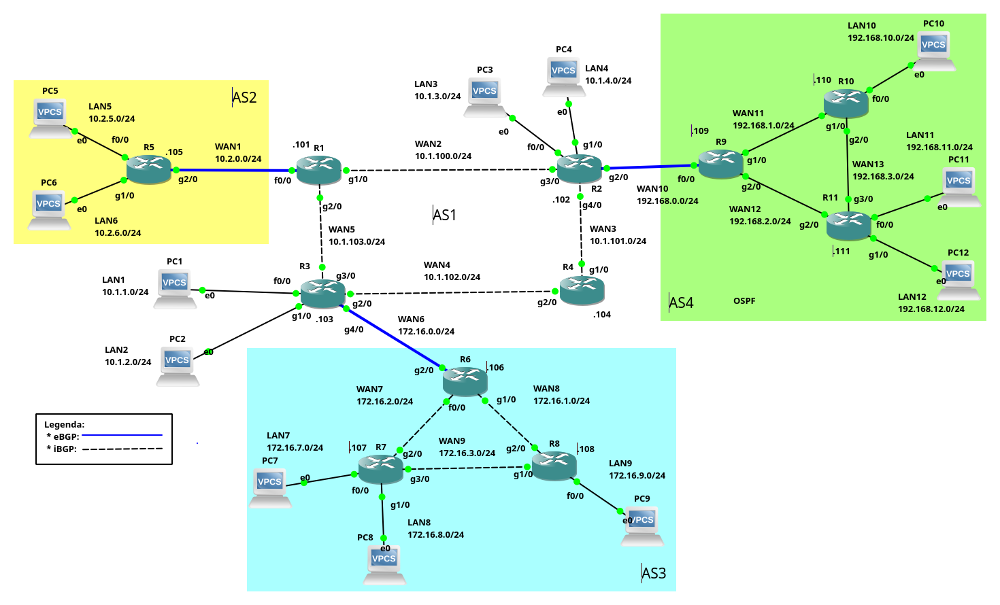

# iBGP

O BGP (Border Gateway Protocol), é um protocolo EGP (Exterior Gateway Protocol), ou seja, é um protocolo de roteamento dinâmico utilizado para interligar Sistemas Autônomos (AS) na Internet. No que se trata de Internet, o BGP4, é atualmente o único protocolo EGP utilizado para interconectar as redes da Internet, o que torna o BGP extremamente importante.

A configuração do BGP basicamente se classifica e distingue, de duas formas: eBGP (exterior Gateway Protocol) e iBGP (interior Gateway Protocol). Um eBGP, é utilizado para interligar roteadores de ASs distintos. Já o iBGP, é utilizado para interligar roteadores de um mesmo AS.

Anteriormente foram apresentados [dois exemplos de configuração utilizando apenas eBGP](bgp-egp1), a seguir será apresentado um exemplo de configuração utilizando iBGP.

# Exemplo 3 - Configuração iBGP e eBGP

O cenário de rede proposto aqui, é para ilustrar principalmente a configuração de uma rede BGP, com iBGP, mas é claro que para isso, também serão configurados roteadores com eBGP. Devido à isso, este cenário é uma mescla de eBGP com iBGP, além de protocolos IGP (OSPF) e EGP (BGP). Por isso esse cenário de exemplo é bem mais complexo que os cenários apresentados no [Exemplo 1 e 2 apenas com eBGP](bgp-egp1).

|  |
|:--:|
| Figura 1 - Cenário de rede do Exemplo iBGP |

De forma geral, na rede do exemplo há quatro ASs, sendo esses:
* **AS1** - é um AS com quatro redes (LAN1, LAN2, LAN3 e LAN4), essas redes são interligadas por quatro roteadores CISCO (R1, R2, R3 e R4). Tal AS é um *transient* AS, ou seja, é uma rede que interliga outras redes, ele vai ser o *backbone* dos demais ASs desse cenário;
* **AS2** - é um pequeno AS com apenas duas redes (LAN5 e LAN6), o roteamento entre essas LAN é estático, e o roteador R5, deste cenário, é ligado via eBGP com o R1 do AS1;
* **AS3** - é uma rede com três roteadores (R6, R7 e R8), interligados via iBGP. O roteador R6 tem uma ligação eBGP com R3 do AS1. No AS3, há três LANs (LAN7, LAN8 e LAN9);
* **AS4** - é uma rede similar ao AS3, todavia o roteamento interno desse AS é feito via IGP, no caso o OSPF. o AS4 tem uma ligação eBGP com R2 no AS1. O AS4 tem as redes LAN 10, 11 e 12.

Resumindo, nesse cenário de rede temos:
* **Três ligações eBGP**: R5->R1; R6->R3; e R9->R2 - todas as ligações eBGP são representadas na Figura 1, por linhas azuis.
* **Duas redes conectadas via iBGP**: AS1 e AS3, as ligações iBGP nesses ASs são representadas por linhas tracejadas.

> As representações e sinalizações de *hosts* e redes do cenário - IPs, etc - são feitas de forma semelhante ao que foi explicado nos [Exemplos 1 e 2](bgp-egp1), então na dúvida veja o texto desses exemplos primeiro.

## Configuração dos IPs nas interfaces de rede

Como já foi descrito anteriormente, esse cenário de rede é relativamente complexo, então é extremamente importante realizar corretamente o endereçamento de *hosts* e roteadores do cenário proposto.

> Este cenário de teste foi feito no [GNS3](https://gns3.com/), e os *hosts* são [VPCS](https://docs.gns3.com/docs/emulators/vpcs/) do GNS3 - não será apresentado aqui a configuração de tais *hosts*.

Também é importante realizar corretamente a configuração do roteamento via OSPF nos roteadores do AS4.
A configuração básica de IPs e OSPF dos roteadores podem ser vistas, [clicando-se aqui](bgp-ibgp1-interfaces)

> Não intenção desse material explicar em detalhes as configurações de endereços IP, nem do OSPF. Há outros materiais neste sítio Web explicando como realizar tais configurações! ;-)

## Configuração dos pares eBGP

A configuração deste cenário pode iniciar de várias formas, para vamos iniciar com a configuração das conexões eBGP entre os ASs do cenário de rede.

### eBGP R5->R1

Vamos iniciar conectando o AS2 ao AS1, isso é feito via eBGP do roteador R5 para o R1, sendo que a configuração do R5, fica da seguinte forma:

```console
R5#configure terminal
Enter configuration commands, one per line.  End with CNTL/Z.
R5(config)#router bgp 2
R5(config-router)#neighbor 10.2.0.101 remote-as 1
R5(config-router)#network 10.2.5.0 mask 255.255.255.0
R5(config-router)#network 10.2.6.0 mask 255.255.255.0
R5(config-router)#
```
Na configuração anterior do R5, informamos que o seu vizinho é o R1 no AS1 (``neighbor 10.2.0.101 remote-as 1``). E informamos que serão publicadas as redes 10.2.5.0/24 e 10.2.6.0/24 com o comando ``network``.

Já a configuração do R1, fica assim:

```console
R1#configure terminal
Enter configuration commands, one per line.  End with CNTL/Z.
R1(config)#router bgp 1
R1(config-router)#neighbor 10.2.0.105 remote-as 2
R1(config-router)#
*May  9 21:47:18.099: %BGP-5-ADJCHANGE: neighbor 10.2.0.105 Up
```
A configuração do R1, só informa que seu vizinho eBGP é o R5, ele não tem redes para publicar. Note que no final da saída o roteador CISCO já mostra que há adjacência formada com o R2 (``BGP-5-ADJCHANGE: neighbor 10.2.0.105 Up``).

É possível ver se se R1 e R5 está conectados via BGP, utilizando os seguintes comandos:

```console
R1#show ip bgp summary
BGP router identifier 10.2.0.101, local AS number 1
BGP table version is 3, main routing table version 3
2 network entries using 264 bytes of memory
2 path entries using 104 bytes of memory
2/1 BGP path/bestpath attribute entries using 336 bytes of memory
1 BGP AS-PATH entries using 24 bytes of memory
0 BGP route-map cache entries using 0 bytes of memory
0 BGP filter-list cache entries using 0 bytes of memory
BGP using 728 total bytes of memory
BGP activity 2/0 prefixes, 2/0 paths, scan interval 60 secs

Neighbor        V          AS MsgRcvd MsgSent   TblVer  InQ OutQ Up/Down  State/PfxRcd
10.2.0.105      4          2       7       6        3    0    0 00:04:35        2
```

No exemplo da saída do comando ``show ip bgp summary`` executado em R1, é possível ver na última linha, que R1 e R2 estão com uma conexão eBGP estabelecida, isso se mostra pela última coluna, que possui um número inteiro positivo (no caso ``2``, na coluna ``State/PfxRcd``).

Também é interessante ver as rotas para as redes de R5 foram enviadas via BGP para R1, isso pode ser feito com o comando:

```console
R1#show ip bgp
BGP table version is 3, local router ID is 10.2.0.101
Status codes: s suppressed, d damped, h history, * valid, > best, i - internal,
              r RIB-failure, S Stale
Origin codes: i - IGP, e - EGP, ? - incomplete

   Network          Next Hop            Metric LocPrf Weight Path
*> 10.2.5.0/24      10.2.0.105               0             0 2 i
*> 10.2.6.0/24      10.2.0.105               0             0 2 i
```
A saída do comando anterior, mostra que R1 sabe chegar na LAN5 (10.2.5.0/24) e LAN6 (10.2.6.0/24), via R5 (10.2.0.105), passando pelo AS2 (``2 i``).

> **Atenção**: É recomendável repetir esses comandos em todas as conexões BGP formadas, para ter certeza que tudo está correndo conforme o esperado. Todavia para o texto não ficar muito repetitivo, só vamos repetir esses comandos em momentos oportunos - que sabemos que vão haver problemas! :-p

### eBGP R9->R2

Agora vamos configurar o eBGP entre AS4 e AS1, isso deve ser feito nos roteadores da seguinte forma:
* Roteador R9:
```console
R9#configure terminal
Enter configuration commands, one per line.  End with CNTL/Z.
R9(config)#router bgp 4
R9(config-router)#neighbor 192.168.0.102 remote-as 1
R9(config-router)#network 192.168.10.0 mask 255.255.255.0
R9(config-router)#network 192.168.11.0 mask 255.255.255.0
R9(config-router)#network 192.168.12.0 mask 255.255.255.0
R9(config-router)#end
```
Na configuração anterior, em R9 criamos a vinhança de R9 e R2 via eBGP (``neighbor 192.168.0.102 remote-as 1``), depois pedimos para que R9 publique as redes LAN10, LAN11 e LAN12

* Roteador R2:
```console
R2#configure terminal
Enter configuration commands, one per line.  End with CNTL/Z.
R2(config)#router bgp 1
R2(config-router)#neighbor 192.168.0.109 remote-as 4
R2(config-router)#network
*May  9 22:01:38.383: %BGP-5-ADJCHANGE: neighbor 192.168.0.109 Up
R2(config-router)#network 10.1.3.0 mask 255.255.255.0
R2(config-router)#network 10.1.4.0 mask 255.255.255.0
```
Na configuração de R2, criamos a vizinhança entre R2 e R9, depois publicamos as redes LAN3 e LAN3. Para ver se tudo funcionou vamos executar o comando ``show ip bgp`` em R2:

```console
R2#show ip bgp
BGP table version is 6, local router ID is 192.168.0.102
Status codes: s suppressed, d damped, h history, * valid, > best, i - internal,
              r RIB-failure, S Stale
Origin codes: i - IGP, e - EGP, ? - incomplete

   Network          Next Hop            Metric LocPrf Weight Path
*> 10.1.3.0/24      0.0.0.0                  0         32768 i
*> 10.1.4.0/24      0.0.0.0                  0         32768 i
*> 192.168.10.0     192.168.0.109            2             0 4 i
*> 192.168.11.0     192.168.0.109            2             0 4 i
*> 192.168.12.0     192.168.0.109            2             0 4 i
```

Perceba que todas as redes declaradas em R9 e R2 estão na tabela de roteamento de R2, o que representa sucesso em nossa configuração! Isso significa que os *hosts* conectados ao R2 podem trocar informações aos hosts conectados ao AS4, então vamos fazer esse teste:

```console
PC4> ping 10.1.3.1 -c 1

84 bytes from 10.1.3.1 icmp_seq=1 ttl=63 time=19.436 ms

PC4> ping 192.168.10.1 -c 1

192.168.10.1 icmp_seq=1 timeout

PC4> ping 192.168.11.1 -c 1

192.168.11.1 icmp_seq=1 timeout

PC4> ping 192.168.12.1 -c 1

192.168.12.1 icmp_seq=1 timeout
```
**Atenção**, pela saída do ``ping`` executado de PC4 para PC3 (``ping 10.1.3.1``), tudo está correto (esses fazem parte do mesmo AS no mesmo roteador). Entretanto ao tentar pingar os *hosts* que estão no AS4 (PC10, PC11 e PC12, veja que não foi possível (por exemplo no PC12 a saída foi: ``192.168.12.1 icmp_seq=1 timeout``).

O problema relatado anteriormente ocorre, pois somente R9 sabe a rota para as rede conectadas ao R2, os demais roteadores deste AS não sabem (R10 e R11), veja as rotas conhecidas pelo R10:

```console
R10#show ip route
Codes: C - connected, S - static, R - RIP, M - mobile, B - BGP
       D - EIGRP, EX - EIGRP external, O - OSPF, IA - OSPF inter area
       N1 - OSPF NSSA external type 1, N2 - OSPF NSSA external type 2
       E1 - OSPF external type 1, E2 - OSPF external type 2
       i - IS-IS, su - IS-IS summary, L1 - IS-IS level-1, L2 - IS-IS level-2
       ia - IS-IS inter area, * - candidate default, U - per-user static route
       o - ODR, P - periodic downloaded static route

Gateway of last resort is not set

O    192.168.12.0/24 [110/2] via 192.168.3.111, 02:59:18, GigabitEthernet2/0
C    192.168.10.0/24 is directly connected, FastEthernet0/0
O    192.168.11.0/24 [110/2] via 192.168.3.111, 02:59:18, GigabitEthernet2/0
O    192.168.0.0/24 [110/2] via 192.168.1.109, 03:00:41, GigabitEthernet1/0
C    192.168.1.0/24 is directly connected, GigabitEthernet1/0
O    192.168.2.0/24 [110/2] via 192.168.3.111, 02:59:18, GigabitEthernet2/0
                    [110/2] via 192.168.1.109, 03:00:41, GigabitEthernet1/0
C    192.168.3.0/24 is directly connected, GigabitEthernet2/0
```
Note na saída anterior, que não há nenhuma rota para as redes LAN3 e LAN3.

Uma possível resolução deste problema é dizer para R9 que seu roteador padrão é R2, e depois publicar via OSPF que o R9 é o roteador padrão do AS4 para os demais roteadores, então neste caso vamos fazer isso em R9:

```console
R9#configure terminal
Enter configuration commands, one per line.  End with CNTL/Z.
R9(config)#ip route 0.0.0.0 0.0.0.0 192.168.0.102
R9(config)#router ospf 1
R9(config-router)#default-information originate
```
> Observação: daria para resolve o problema anterior via (i) roteamento estático ou (ii) iBGP, esse último será utilizando no AS3 e o primeiro foi utilizado no AS2.

Feito isso, vamos conferir se a rota padrão foi parar, por exemplo, no R10:

```console
R10#show ip route
...
Gateway of last resort is 192.168.1.109 to network 0.0.0.0

O    192.168.12.0/24 [110/2] via 192.168.3.111, 03:02:52, GigabitEthernet2/0
C    192.168.10.0/24 is directly connected, FastEthernet0/0
O    192.168.11.0/24 [110/2] via 192.168.3.111, 03:02:52, GigabitEthernet2/0
O    192.168.0.0/24 [110/2] via 192.168.1.109, 03:04:15, GigabitEthernet1/0
C    192.168.1.0/24 is directly connected, GigabitEthernet1/0
O    192.168.2.0/24 [110/2] via 192.168.3.111, 03:02:52, GigabitEthernet2/0
                    [110/2] via 192.168.1.109, 03:04:15, GigabitEthernet1/0
C    192.168.3.0/24 is directly connected, GigabitEthernet2/0
O*E2 0.0.0.0/0 [110/1] via 192.168.1.109, 00:00:21, GigabitEthernet1/0
```
Note a linha ``O*E2 0.0.0.0/0 [110/1] via 192.168.1.109...`` isso indica que agora R10 tem como roteador padrão o R9. Logo vamos voltar ao teste se PC4 acessa os *hosts* do AS4:

```console
PC4> ping 192.168.10.1 -c 1

84 bytes from 192.168.10.1 icmp_seq=1 ttl=61 time=60.435 ms

PC4> ping 192.168.11.1 -c 1

84 bytes from 192.168.11.1 icmp_seq=1 ttl=61 time=70.490 ms

PC4> ping 192.168.12.1 -c 1

84 bytes from 192.168.12.1 icmp_seq=1 ttl=61 time=51.955 ms
```
Agora sim, a saída do teste de PC4 para PC10, 11 e 12, mostra que essa parte da rede está totalmente conexa! ;-)

Todavia, ainda não há conexão plena entre o AS2, AS1 e AS4, vamos resolver isso daqui a pouco...

### eBGP R6->R3

Neste ponto, iremos conectar as redes de R3 do AS1 R6 no AS3 via eBGP, essa será a última conexão eBGP, vamos lá, com as seguintes configurações em cada roteador CISCO:
* Roteador R3:
```console
R3#configure terminal
R3(config)#router bgp 1
R3(config-router)#neighbor 172.16.0.106 remote-as 3
R3(config-router)#network 10.1.1.0 mask 255.255.255.0
R3(config-router)#network 10.1.2.0 mask 255.255.255.0
```
Em R3, configuramos a conexão eBGP entre os vizinhos R3 e R6, e depois publicamos as LANs 1 e 2.

* Roteador R3:
```console
R6(config)#router bgp 3
R6(config-router)#neighbor 172.16.0.103 remote-as 1
R6(config-router)#
*May  9 23:17:59.814: %BGP-5-ADJCHANGE: neighbor 172.16.0.103 Up
```
Em R6, só configuramos a vizinhança eBGP com R3 - a saída já mostra que a adjacência entre os vizinhos foi obtida com sucesso.

Realizadas as configurações vamos ver as redes que temos em R6:

```console
R6#show ip bgp
BGP table version is 3, local router ID is 172.16.2.106
Status codes: s suppressed, d damped, h history, * valid, > best, i - internal,
              r RIB-failure, S Stale
Origin codes: i - IGP, e - EGP, ? - incomplete

   Network          Next Hop            Metric LocPrf Weight Path
*> 10.1.1.0/24      172.16.0.103             0             0 1 i
*> 10.1.2.0/24      172.16.0.103             0             0 1 i
```
A saída do comando ``show ip bgp`` em R6, mostra que R6 possui rotas para as redes publicadas via BGP de R2, ou seja, a configuração feita via eBGP funcionaram.

TODAVIA, note que não há nenhuma rota para as redes de dentro do próprio AS3. Bem, no AS4, quem estava publicando as redes de dentro do próprio AS era o OSPF, que é um protocolo IGP. Já no AS3, vamos utilizar o iBGP para realizar a mesma tarefa.

## Configuração dos pares iBGP

Bem, até aqui só havíamos configurado o BGP via eBGP, mas agora vamos utilizar o iBGP. A primeira coisa a se notar, é que o eBGP é utilizado para conectar roteadores de ASs distintos, diferentes. Já o iBGP é utilizado para conectar roteadores de um mesmo AS.

Assim, o iBGP vai fazer basicamente o mesmo trabalho que fez o OSPF no AS4, mas com uma grande diferença! O OSPF, no AS4, só propagou e informou a respeito de redes que estavam dentro do AS4, mas quando utilizamos o iBGP no AS3, esse vai compartilhar informações a respeito de todas as redes descobertas via BGP. Ou seja, ao configurar o iBGP no AS3, as tabelas de roteamento dos roteadores com iBGP, terão informações a respeito de todas as redes do cenário de rede do exemplo, e é muito importante perceber isso, pois isso trará vantagens e desvantagens, que comentaremos depois.

### Configurando iBGP no AS 3

Vamos iniciar a configuração iBGP, estabelecendo vizinhança entre todos os roteadores do AS3, no caso R6, R7 e R8. Na sequência vamos publicas as rotas das redes do cenário no AS3 (vamos fazer isso apenas nos roteadores conectados diretamente às LANs do AS - como já fizemos até aqui):
* Roteador R6:
```console
R6#configure terminal
R6(config)#router bgp 3
R6(config-router)#neighbor 172.16.2.107 remote-as 3
R6(config-router)#neighbor 172.16.1.108 remote-as 3
```
Note que a única diferença na configuração do iBGP, a principio, é que os vizinhos estão no mesmo AS, no caso R7 e R8 tem o final com ``remote-as 3``.

* Roteador R7:
```console
R7#configure terminal
Enter configuration commands, one per line.  End with CNTL/Z.
R7(config)#router bgp 3
R7(config-router)#neighbor 172.16.2.106 remote-as 3
R7(config-router)#
*May  9 23:59:21.314: %BGP-5-ADJCHANGE: neighbor 172.16.2.106 Up
R7(config-router)#neighbor 172.16.3.108 remote-as 3
R7(config-router)#network 172.16.7.0 mask 255.255.255.0
R7(config-router)#network 172.16.8.0 mask 255.255.255.0
R7(config-router)#end
```
Em R7, foi configurado os vizinhos iBGP como sendo R6 (172.16.2.106) e R8 (172.16.3.108), depois publicada a rede 172.16.9.0/24 (LAN9). Note que já foi apresentada a mensagem que foi criada a vizinhança entre R7 e R6, bem como R7 e R8.

* Roteador R8:
```console
R8#configure terminal
Enter configuration commands, one per line.  End with CNTL/Z.
R8(config)#router bgp 3
R8(config-router)#neighbor 172.16.1.106 remote-as 3
R8(config-router)#neighbor 172.16. remote-as 3
*May  9 23:54:27.522: %BGP-5-ADJCHANGE: neighbor 172.16.1.106 Up
R8(config-router)#neighbor 172.16.3.107 remote-as 3
R8(config-router)#
*May  9 23:54:36.706: %BGP-5-ADJCHANGE: neighbor 172.16.3.107 Up
R8(config-router)#network 172.16.9.0 mask 255.255.255.0
```
Por fim, nesta rede iBGP, foi realizada a configuração do R8, neste são criadas ligações iBGP com R6 e R7, e são publicadas via BGP as redes LAN7 E LAN8. Feito isso vamos ver agora as redes que R8 consegue ver via BGP:

```console
R8#show ip bgp
...
   Network          Next Hop            Metric LocPrf Weight Path
* i10.1.1.0/24      172.16.0.103             0    100      0 1 i
* i10.1.2.0/24      172.16.0.103             0    100      0 1 i
*>i172.16.7.0/24    172.16.3.107             0    100      0 i
*>i172.16.8.0/24    172.16.3.107             0    100      0 i
*> 172.16.9.0/24    0.0.0.0                  0         32768 i
```
Visto que todas as redes do AS3 e conectadas ao R3 estão na tabela de roteamento, vamos testar a conectividade com todos os PCs do AS3 e os conectados ao R3, realizando um ``ping`` a partir do PC8. Veja só:

```console
PC8> ping  172.16.7.1 -c 1
84 bytes from 172.16.7.1 icmp_seq=1 ttl=63 time=57.592 ms

PC8> ping  172.16.9.1 -c 1
172.16.9.1 icmp_seq=1 timeout

PC8> ping  172.16.9.1 -c 1
84 bytes from 172.16.9.1 icmp_seq=1 ttl=62 time=51.373 ms

PC8> ping  10.1.1.1 -c 1
10.1.1.1 icmp_seq=1 timeout

PC8> ping  10.1.2.1 -c 1
10.1.2.1 icmp_seq=1 timeout
```

Hum, perceba que nem tudo saiu como esperado! No teste do ``ping``, é possível perceber que o iBGP funcionou para publicar as redes do próprio AS3, ou seja, o PC8, conseguiu se comunicar com o PC7 e PC9. Todavia, ele não conseguiu se comunicar com nenhuma rede conectada ao R3, mesmo que essas redes estejam na tabela de roteamento dos roteadores do AS3, conseguidas via BGP.

Para elucidar esse problema, note que R8 possui rotas para as redes obtidas via BGP do R3 (veja o trecho da saída  ``R8#show ip bgp``).

```console
...
   Network          Next Hop            Metric LocPrf Weight Path
* i10.1.1.0/24      172.16.0.103             0    100      0 1 i
* i10.1.2.0/24      172.16.0.103             0    100      0 1 i
...
```
No trecho da saída anterior, perceba que há um grande problema: As rotas 10.1.1.0/24 e 10.1.2.0/24 obtidas, têm como próximo salto (``Next Hop``), o roteador R3, que está na rede 172.16.0.0/24, e essa rede 172.16.0.0/24 não está dentre as redes conhecidas por R8 (execute o comando ``show ip route`` e veja isso melhor), ou seja, não tem como o PC8 alcançar os PCs 1 e 2.

Bem, esse já é um problema conhecido do BGP, desta forma há um comando para tal resolução de problema. O comando em questão é o ``next-hop-self``, que deve ser executado de forma semelhante à criação da vizinhança, veja o que deve ser feito em todos os roteadores iBGP do AS3:
* Roteador R6:
```console
R6#configure terminal
R6(config)#router bgp 3
R6(config-router)#neighbor 172.16.2.107 next-hop-self
R6(config-router)#neighbor 172.16.1.108 next-hop-self
```
* Roteador R7:
```console
R7#configure terminal
R7(config)#router bgp 3
R7(config-router)#neighbor 172.16.2.106 next-hop-self
R7(config-router)#neighbor 172.16.3.108 next-hop-self
```
* Roteador R8:
```console
R8#configure terminal
R8(config)#router bgp 3
R8(config-router)#neighbor 172.16.1.106 next-hop-self
R8(config-router)#neighbor 172.16.3.107 next-hop-self
```

> É possível resolver esse problema apresentando anteriormente de outras formas, mas vamos tomar essa como a padrão.

> O problema do exemplo em questão seria resolvido executando tal comando apenas em R6. Todavia, é recomendável fazer isso em todos os roteadores iBGP do cenário, para não gerar rotas inconsistentes, caso o cenário venha à mudar por alguma falha ou alteração nas configurações (adição de redes, por exemplo).

Por exemplo, o comando ``neighbor 172.16.2.107 next-hop-self``, nada mais faz do que dizer para o vizinho 172.16.2.107 (R7), que todas as rotas que ele apreender com o vizinho R6 (onde o comando está sendo digitado), deve ter como roteador de próximo salto o próprio R6. Assim, após executar os devidos comandos, o resultado da tabela de roteamento BGP do R8, será a seguinte:

```console
R8#show ip bgp
...
   Network          Next Hop            Metric LocPrf Weight Path
*>i10.1.1.0/24      172.16.1.106             0    100      0 1 i
*>i10.1.2.0/24      172.16.1.106             0    100      0 1 i
*>i172.16.7.0/24    172.16.3.107             0    100      0 i
*>i172.16.8.0/24    172.16.3.107             0    100      0 i
*> 172.16.9.0/24    0.0.0.0                  0         32768 i
```
A saída anterior mostra que agora o próximo salto para R8 enviar pacotes para a LAN1 e LAN2, é o R6 e não mais o R3, o que corrige o problema! ;-)

> O teste de ``ping`` do PC8 para PC1 e PC2 agora deve funcionar..

O leitor mais crítico, já deve estar a algum tempo se perguntando, quando é que os roteadores do AS1 vão propagar as redes BGP de todos os ASs para todos. Vamos fazer isso na sequência - deixamos para o final, pois o AS1 será o mais complexo do cenário do exemplo.

### Configurando iBGP no AS 1

Vamos configurar agora o AS1, que é um backbone, ou seja, ele conecta todas as redes do cenário. Bem, na verdade até agora o AS1 é uma rede bem desconexa, pois a maioria dos roteadores deste AS já sabem a respeito de outros ASs, mas eles não estão trocando informações entre os roteadores do próprio AS a respeito disso, logo a rede do cenário não se conecta por completo. Para resolver isso é necessário configurar iBGP entre esses roteadores, mas ainda assim haverá um problemas que veremos na sequência.

Iniciamos configurando a vizinhança iBGP entre os roteadores R1, R2, R3 e R4, lembrando que é recomendável criar uma rede *full mesh* (todos conectados à todos) e utilizar o ``next-hop-self`` para evitar o problema já mencionado anteriormente. Assim, a configuração desses roteadores se dá como apresentado a seguir:
* R1:
```console
R1#configure terminal
Enter configuration commands, one per line.  End with CNTL/Z.
R1(config)#router bgp 1
R1(config-router)#neighbor 10.1.100.102 remote-as 1
R1(config-router)#neighbor 10.1.100.102 next-hop-self
R1(config-router)#neighbor 10.1.103.103 remote-as 1
R1(config-router)#neighbor 10.1.103.103 next-hop-self
R1(config-router)#neighbor 10.1.101.104 remote-as 1
R1(config-router)#neighbor 10.1.101.104 next-hop-self
```
* R2:
```console
R2#configure terminal
Enter configuration commands, one per line.  End with CNTL/Z.
R2(config)#router bgp 1
R2(config-router)#neighbor 10.1.100.101 remote-as 1
R2(config-router)#neighbor 10.1.100.101 next-hop-self
R2(config-router)#neighbor 10.1.100.101 next-hop-self
R2(config-router)#neighbor 10.1.103.103 remote-as 1
R2(config-router)#neighbor 10.1.103.103 next-hop-self
R2(config-router)#neighbor 10.1.101.104 remote-as 1
R2(config-router)#neighbor 10.1.101.104 next-hop-self
```
* R3:
```console
R3#configure terminal
Enter configuration commands, one per line.  End with CNTL/Z.
R3(config)#router bgp 1
R3(config-router)#neighbor 10.1.103.101 remote-as 1
R3(config-router)#neighbor 10.1.103.101 next-hop-self
R3(config-router)#neighbor 10.1.102.104 remote-as 1
R3(config-router)#neighbor 10.1.102.104 next-hop-self
R3(config-router)#neighbor 10.1.101.102 remote-as 1
R3(config-router)#neighbor 10.1.101.102 next-hop-self
```
* R4:
```console
R4(config)#router bgp 1
R4(config-router)#neighbor 10.1.101.102 remote-as 1
R4(config-router)#neighbor 10.1.101.102
R4(config-router)#neighbor 10.1.101.102 next-hop-self
R4(config-router)#neighbor 10.1.102.103 remote-as 1
R4(config-router)#neighbor 10.1.102.103 next-hop-self
R4(config-router)#neighbor 10.1.100.101 next
R4(config-router)#neighbor 10.1.100.101 next-hop-self
```
Após executar tais comandos nos respectivos roteadores, vamos ver as tabelas de roteamento de R1, R4 e R8:
* R1:
```console
R1#show ip bgp
BGP table version is 13, local router ID is 10.2.0.101
Status codes: s suppressed, d damped, h history, * valid, > best, i - internal,
              r RIB-failure, S Stale
Origin codes: i - IGP, e - EGP, ? - incomplete

   Network          Next Hop            Metric LocPrf Weight Path
*>i10.1.1.0/24      10.1.103.103             0    100      0 i
*>i10.1.2.0/24      10.1.103.103             0    100      0 i
*>i10.1.3.0/24      10.1.100.102             0    100      0 i
*>i10.1.4.0/24      10.1.100.102             0    100      0 i
*> 10.2.5.0/24      10.2.0.105               0             0 2 i
*> 10.2.6.0/24      10.2.0.105               0             0 2 i
*>i172.16.7.0/24    10.1.103.103             0    100      0 3 i
*>i172.16.8.0/24    10.1.103.103             0    100      0 3 i
*>i172.16.9.0/24    10.1.103.103             0    100      0 3 i
*>i192.168.10.0     10.1.100.102             2    100      0 4 i
*>i192.168.11.0     10.1.100.102             2    100      0 4 i
*>i192.168.12.0     10.1.100.102             2    100      0 4 i
```

* R4
```console
R4#show ip bgp
...
   Network          Next Hop            Metric LocPrf Weight Path
*>i10.1.1.0/24      10.1.102.103             0    100      0 i
*>i10.1.2.0/24      10.1.102.103             0    100      0 i
*>i10.1.3.0/24      10.1.101.102             0    100      0 i
*>i10.1.4.0/24      10.1.101.102             0    100      0 i
*>i172.16.7.0/24    10.1.102.103             0    100      0 3 i
*>i172.16.8.0/24    10.1.102.103             0    100      0 3 i
*>i172.16.9.0/24    10.1.102.103             0    100      0 3 i
*>i192.168.10.0     10.1.101.102             2    100      0 4 i
*>i192.168.11.0     10.1.101.102             2    100      0 4 i
*>i192.168.12.0     10.1.101.102             2    100      0 4 i
```

* R8:
```console
R8#show ip bgp
...
   Network          Next Hop            Metric LocPrf Weight Path
*>i10.1.1.0/24      172.16.1.106             0    100      0 1 i
*>i10.1.2.0/24      172.16.1.106             0    100      0 1 i
*>i10.2.5.0/24      172.16.1.106             0    100      0 1 2 i
*>i10.2.6.0/24      172.16.1.106             0    100      0 1 2 i
*>i172.16.7.0/24    172.16.3.107             0    100      0 i
*>i172.16.8.0/24    172.16.3.107             0    100      0 i
*> 172.16.9.0/24    0.0.0.0                  0         32768 i
```
Observando as rotas conhecidas, é possível notar que as tabelas de roteamento não estão completas, pois analisando as saídas do ``show ip bgp``, temos:
* R1 sabe a rota de todas as LANs;
* R4 não tem informações a respeito das LAN5 e 6;
* R8 não tem rotas para as LANs 3, 4, 10, 11 e 12.
Vamos analisar melhor as rotas de R4, note que ele não tem informações a respeito das redes que são informadas pelo R1 (roteador na diagonal). Então vamos executar o comando ``show ip bgp summary`` para verificar o que está acontecendo de errado:

```console
R4#show ip bgp summary
BGP router identifier 10.1.102.104, local AS number 1
...
Neighbor        V          AS MsgRcvd MsgSent   TblVer  InQ OutQ Up/Down  State/PfxRcd
10.1.100.101    4          1       7       8        0    0    0 00:01:10 Active
10.1.101.102    4          1      39      35       27    0    0 00:32:29        5
10.1.102.103    4          1      37      35       27    0    0 00:32:02        5
```
Com a saída anterior, é possível verificar que o estado da conexão BGP entre R4 e R1 (10.1.100.101) está no estado de ``Active``, ou seja, não está funcionando corretamente! Se o mesmo comando for executado em R8 o mesmo não será constatado, pois esse é um roteador iBGP do AS3, que recebe rotas do R3, então se for executado o ``show ip bgp summary`` será constado que o R3 não tem conexão BGP com R2.

Desta forma, o problema é que os roteadores de AS1 não sabem chegar em todos os roteadores do próprio AS1. Bem, há várias formas de se resolver isso, vamos utilizar aqui um protocolo IGP para resolver tal problema, para esse exemplo utilizaremos o OSPF.

> Aqui foi utilizado o OSPF, mas poderia ser utilizado qualquer outro protocolo de roteamento dinâmico e até mesmo roteamento estático.

Então para resolver esse problema da falta de rotas para os roteadores do próprio AS1, vamos configurar o OSPF nos roteadores R1, R2, R3 e R4:
* OSPF no R1:
```console
R1#configure terminal
R1(config)#router ospf 1
R1(config-router)#network 10.2.0.0 0.0.0.255 area 0
R1(config-router)#network 10.1.100.0 0.0.0.255 area 0
R1(config-router)#network 10.1.103.0 0.0.0.255 area 0
R1(config-router)#passive-interface f0/0
```

* OSPF no R2:
```console
R2#configure terminal
R2(config)#router ospf 1
R2(config-router)#network 192.168.0.0 0.0.0.255 area 0
R2(config-router)#network 10.1.100.0 0.0.0.255 area 0
R2(config-router)#network 10.1.101.0 0.0.0.255 area 0
R2(config-router)#network 10.1.3.0 0.0.0.255 area 0
R2(config-router)#network 10.1.4.0 0.0.0.255 area 0
R2(config-router)#passive-interface g2/0
```

* OSPF no R3:
```console
R3#configure terminal
R3(config)#router ospf 1
R3(config-router)#network 10.1.1.0 0.0.0.255 area 0
R3(config-router)#network 10.1.2.0 0.0.0.255 area 0
R3(config-router)#network 10.1.102.0 0.0.0.255 area 0
R3(config-router)#network 10.1.103.0 0.0.0.255 area 0
R3(config-router)#network 172.16.0.0 0.0.0.255 area 0
R3(config-router)#passive-interface g4/0
```

* OSPF no R4:
```console
R4#configure terminal
R4(config)#router ospf 1
R4(config-router)#network 10.1.102.0 0.0.0.255 area 0
R4(config-router)#network 10.1.101.0 0.0.0.255 area 0
```
Com o OSPF devidamente configurado nos roteadores do AS1, vamos verificar a conectividade dos roteadores, no exemplo a seguir vamos ver se mudou o status de R4 para R1:

```console
R4#show ip bgp summary
...
Neighbor        V          AS MsgRcvd MsgSent   TblVer  InQ OutQ Up/Down  State/PfxRcd
10.1.100.101    4          1      13      13       37    0    0 00:01:30        2
10.1.101.102    4          1      62      58       37    0    0 00:55:19        5
10.1.102.103    4          1      60      58       37    0    0 00:54:52        5
```
Note que pela saída anterior, que agora o R1 (10.1.100.101) está no estado de Established (valor inteiro - ``2``), que indica que tudo deve estar certo, e provavelmente o mesmo ocorre com todas conexões iBGP do cenário.

De qualquer forma vamos ver se a tabela de roteamento BGP do R4 agora está completa ou não:
```console
R4#show ip bgp
...
   Network          Next Hop            Metric LocPrf Weight Path
r>i10.1.1.0/24      10.1.102.103             0    100      0 i
r>i10.1.2.0/24      10.1.102.103             0    100      0 i
r>i10.1.3.0/24      10.1.101.102             0    100      0 i
r>i10.1.4.0/24      10.1.101.102             0    100      0 i
*>i10.2.5.0/24      10.1.100.101             0    100      0 2 i
*>i10.2.6.0/24      10.1.100.101             0    100      0 2 i
*>i172.16.7.0/24    10.1.102.103             0    100      0 3 i
*>i172.16.8.0/24    10.1.102.103             0    100      0 3 i
*>i172.16.9.0/24    10.1.102.103             0    100      0 3 i
*>i192.168.10.0     10.1.101.102             2    100      0 4 i
*>i192.168.11.0     10.1.101.102             2    100      0 4 i
*>i192.168.12.0     10.1.101.102             2    100      0 4 i
```
Na saída anterior, é possível observar o IP de rede, de todas as LANs agora no R4, o que ajuda a comprovar que o cenário deve estar funcional.

## Teste de conectividade do cenário

Para finalizar o teste vamos, executar o ``ping`` do PC9, conectado ao R8 para todos os outros PCs/redes do cenário proposto:

```console
PC9> ping 10.1.1.1 -c 1
84 bytes from 10.1.1.1 icmp_seq=1 ttl=61 time=50.089 ms

PC9> ping 10.1.2.1 -c 1
84 bytes from 10.1.2.1 icmp_seq=1 ttl=61 time=49.221 ms

PC9> ping 10.1.3.1 -c 1
84 bytes from 10.1.3.1 icmp_seq=1 ttl=59 time=66.253 ms

PC9> ping 10.1.4.1 -c 1
84 bytes from 10.1.4.1 icmp_seq=1 ttl=59 time=99.879 ms

PC9> ping 10.2.5.1 -c 1
84 bytes from 10.2.5.1 icmp_seq=1 ttl=59 time=65.651 ms

PC9> ping 10.2.6.1 -c 1
84 bytes from 10.2.6.1 icmp_seq=1 ttl=59 time=81.450 ms

PC9> ping 172.16.7.1 -c 1
84 bytes from 172.16.7.1 icmp_seq=1 ttl=62 time=37.538 ms

PC9> ping 172.16.8.1 -c 1
84 bytes from 172.16.8.1 icmp_seq=1 ttl=62 time=32.068 ms

PC9> ping 192.168.10.1 -c 1
84 bytes from 192.168.10.1 icmp_seq=1 ttl=57 time=86.227 ms

PC9> ping 192.168.11.1 -c 1
84 bytes from 192.168.11.1 icmp_seq=1 ttl=57 time=98.143 ms

PC9> ping 192.168.12.1 -c 1
84 bytes from 192.168.12.1 icmp_seq=1 ttl=57 time=81.300 ms
```

Assim, as saídas dos "*pings*" realizadas, demonstram também que o cenário está totalmente funcional e conectado.
