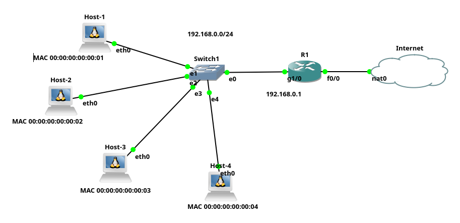
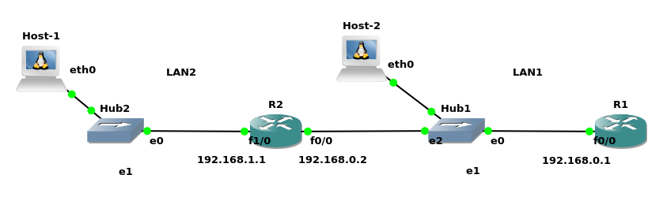

# Servidor DHCP em roteadores CISCO

Um servidor DHCP é um servidor que configura automaticamente IP, máscara de rede, *gateway* padrão, DNS, dentre outras configurações de *hosts* da rede.

Assim, esse documento trata de como configurar servidores DHCP em roteadores ou *switches* da CISCO. 

No contexto de DHCP, há basicamente duas formas de se configurar *hosts*, que são:

* Configuração **dinâmica** de IP, na qual o *host* cliente obtêm dinamicamente IPs disponibilizados dentro de uma faixa de IPs pré-estabelecida;

* Configuração com *IPs fixos*, na qual determinados *hosts*, sempre obtêm o mesmo IP. Tais IPs são atrelados à características como o endereço físico da máquina.

Esses dois tipos de configurações são apresentados a seguir em roteadores/*switches* CISCO, para isso vamos tomar como exemplo a rede ilustrada na Figura 1. Tal rede possui um roteador CISCO, chamado de R1, que serve de roteador e o servidor DHCP. Também há na rede, quatro *hosts* - note que os *hosts* possuem indicações de endereço físico (MAC), por exemplo, o Host-1, tem o endereço Ethernet 00:00:00:00:00:01.

|  |
|:--:|
| **Figura 1- Rede com servidor DHCP** |


Assim, vamos ver as configurações de servidores DHCP roteadores/*switches*, levanto em conta este cenário de rede da Figura 1.

## Configurar faixa de IPs

Nesta configuração será estipulada uma faixa de IPs que não será atribuída dinamicamente via DHCP (``ip dhcp excluded-address``), para a rede chamada de LAN1 (``ip dhcp pool lan1``), depois é indicada a faixa de IP que será gerenciada/atribuída via DHCP (``network``). Também são "setados" *gateway* padrão (``default-router``) e IP do servidor DNS (``dns-server``).

```console
R1#configure terminal
Enter configuration commands, one per line.  End with CNTL/Z.
R1(config)#ip dhcp excluded-address 192.168.0.0 192.168.0.100
R1(config)#ip dhcp excluded-address 192.168.0.200 192.168.0.255
R1(config)#ip dhcp pool lan1
R1(dhcp-config)#network 192.168.0.0 255.255.255.0
R1(dhcp-config)#default-router 192.168.0.1
R1(dhcp-config)#dns-server 8.8.8.8
R1(dhcp-config)#exit
```

### Obter os IPs via DHCP no cliente

Depois de realizar essa configuração no roteador, que será o servidor DHCP, é só tentar obter a configuração de rede via cliente DHCP. Isso pode ser feito em qualquer dispositivos e sistema operacional.

No exemplo dos comandos a seguir é utilizado um *host* Linux e portanto comandos Linux de cliente DHCP (foi utilizado o ``dhcpcd``, mas há outros métodos, tais como o comando ``dhclient``):


```console
# dhcpcd eth0
DUID 00:04:4c:4c:45:44:00:4e:50:10:80:53:b4:c0:4f:52:32:32
eth0: IAID c2:6f:f8:4c
eth0: rebinding lease of 192.168.0.12
eth0: soliciting an IPv6 router
eth0: probing for an IPv4LL address
eth0: DHCP lease expired
eth0: soliciting a DHCP lease
eth0: offered 192.168.0.101 from 192.168.0.1
eth0: probing address 192.168.0.101/24
eth0: using IPv4LL address 169.254.174.27
eth0: adding route to 169.254.0.0/16
eth0: adding default route
forked to background, child pid 18264
```

Neste exemplo, foi dado para esse *host* Linux, o IP 192.168.0.101, veja:


```console
# ifconfig
eth0: flags=4163<UP,BROADCAST,RUNNING,MULTICAST>  mtu 1500
        inet 192.168.0.101  netmask 255.255.255.0  broadcast 192.168.0.255
        inet6 fe80::b0a2:c2ff:fe6f:f84c  prefixlen 64  scopeid 0x20<link>
        ether b2:a2:c2:6f:f8:4c  txqueuelen 1000  (Ethernet)
        RX packets 605  bytes 73445 (73.4 KB)
        RX errors 0  dropped 316  overruns 0  frame 0
        TX packets 35  bytes 3643 (3.6 KB)
        TX errors 0  dropped 0 overruns 0  carrier 0  collisions 0
```

## Configurar IP fixo

Em alguns casos é interessante determinar para o servidor DHCP que sempre dê o mesmo IP para determinadas máquinas, tais como servidores, roteadores, etc. Isso também pode ser interessante por questões de segurança (para por exemplo rastrear clientes).

Assim, para determinar o servidor DHCP sempre atribua o mesmo IP para um dado *host*, é necessário dar um "nome" para esse *host* (não vai ser o nome do *host* na rede, só uma identificação dentro da configuração do servidor DHCP CISCO), isso é feito com o comando ``ip dhcp pool server``, neste caso foi dado o nome "server". Depois, atribuir a identificação do cliente (``client-identifier``), o endereço de hardware (``hardware-address``) e opcionalmente é possível dar um nome para esse cliente (``client-name``). Ver exemplo de comandos a seguir:

```console
configure terminal
ip dhcp pool server
host 192.168.0.254 255.255.255.0
client-identifier ff00.0000.0400.044c.4c45.4400.4e50.1080.53b4.c04f.5232.32
hardware-address 0000.0000.0004 ethernet
client-name server
end
```
> Utilizando como base a Figura 1, está configuração seria para atribuir sempre o IP 192.168.0.254 para o Host-4, já que este tem o MAC 00:00:00:00:00:04.

* Neste caso, o servidor DHCP CISCO será configurado pelo ``client-id``. No Linux, para obter esse número no cliente, é possível executar:

```console
# dhcpcd eth0
main: control_open: Connection refused
DUID 00:04:4c:4c:45:44:00:4e:50:10:80:53:b4:c0:4f:52:32:32
eth0: IAID 00:00:00:04
eth0: soliciting an IPv6 router
eth0: soliciting a DHCP lease
eth0: offered 192.168.0.254 from 192.168.0.1
eth0: probing address 192.168.0.254/24
eth0: leased 192.168.0.254 for 86400 seconds
eth0: adding route to 192.168.0.0/24
forked to background, child pid 18290
```

O número será: FF+IAID+DUID, ou seja:
**``FF:00:00:00:04:00:04:4c:4c:45:44:00:4e:50:10:80:53:b4:c0:4f:52:32:32``**

Outra forma de obter esse número é executando o comando a seguir no roteador CISCO:

``#debug ip dhcp server packet``

Então, no cliente, tente obter um IP via DHCP. E o roteador mostrará esta tentativa como um *log*/saída na tela/console, exemplo:

```console
*May 18 17:45:36.327: DHCPD: DHCPDISCOVER received from client ff00.0000.0400.044c.4c45.4400.4e50.1080.53b4.c04f.5232.32 on interface FastEthernet0/0.
*May 18 17:45:36.331: DHCPD: Sending DHCPOFFER to client ff00.0000.0400.044c.4c45.4400.4e50.1080.53b4.c04f.5232.32 (192.168.0.254).
*May 18 17:45:36.331: DHCPD: ARP entry exists (192.168.0.254, 0000.0000.0004).
*May 18 17:45:36.331: DHCPD: unicasting BOOTREPLY to client 0000.0000.0004 (192.168.0.254).
*May 18 17:45:36.331: DHCPD: removing ARP entry (192.168.0.254 vrf default).
*May 18 17:45:36.331: DHCPD: DHCPREQUEST received from client ff00.0000.0400.044c.4c45.4400.4e50.1080.53b4.c04f.5232.32.
```

Desta forma, é só copiar a identificação do cliente, para a configuração do roteador CISCO.

## DHCP Relay CISCO

Desde o protocolo [BOOTP](https://pt.wikipedia.org/wiki/BOOTP), antecessor do DHCP, é possível que o servidor DHCP fique em uma rede e forneça IPs para outra rede. Todavia, essa outra rede deve ter configurada um DHCP Relay, que fica responsável por obter o pedido DHCP do cliente (que está em outra rede) e repassar tal pedido, para a rede onde está o servidor DHCP.

A Figura 2 ilustra uma rede simples que utiliza servidor DHCP e DHCP Relay.

|  |
|:--:|
| Figura 2 - DHCP Relay |

Tomando como exemplo a rede da Figura 2. Neste cenário temos a LAN1 (192.168.0.0/24) com um servidor DHCP configurado em R1. A princípio, neste cenário, os pedidos de um cliente DHCP, tal como do Host-2 são atendidos prontamente pelo servidor DHCP em R1. Entretanto os pedidos de Host-1 não chegam ao servidor DHCP de R1, já que Host-1 está em outro enlace de rede, que é representado pela LAN2. Assim, neste cenário, para que Host-1 consiga utilizar o servidor DHCP, que está em R1, é necessário configurar um DHCP Relay, que neste exemplo vai ser o roteador R2.

Desta forma, para que o cenário proposto funcione é primeiro necessário configurar o servidor DHCP, só que agora ele deve ter mais que uma faixa de rede. Para este exemplo as faixas são: 192.168.0.0/24 (LAN1) e 192.168.1.1 (LAN2), veja as configurações a seguir, no servidor DHCP (R1):

* Iniciando configurando a interface de rede, com IP e máscara:

```console
R1(config)#interface f0/0
R1(config-if)#ip address 192.168.0.1 255.255.255.0
R1(config-if)#no shutdown
R1(config-if)#exit
```

* Depois é adicionada a configuração DHCP para a LAN1:

```console
R1(config)#ip dhcp excluded-address 192.168.0.1 192.168.0.10
R1(config)#ip dhcp pool lan1
R1(dhcp-config)#network 192.168.0.0 255.255.255.0
R1(dhcp-config)#default-router 192.168.0.1
R1(dhcp-config)#dns-server 8.8.8.8
R1(dhcp-config)#exit
```

* Agora é adicionada a rota para a rede 192.168.1.0/24 (``ip route``) e a configuração DHCP para a LAN2:

```console
R1(config)#ip route 192.168.1.0 255.255.255.0 192.168.0.2
R1(config)#ip dhcp excluded-address 192.168.1.0 192.168.1.10
R1(config)#ip dhcp pool lan2
R1(dhcp-config)#network 192.168.1.0 255.255.255.0
R1(dhcp-config)#default-router 192.168.1.1
R1(dhcp-config)#dns-server 8.8.8.8
R1(dhcp-config)#end
```

> É necessário configurar a rota para 192.168.1.0/24 (LAN2), pois caso contrário, quando chegar o pedido DHCP Relay, o servidor não saberia para quem responder, já que não conhece essa rede. Neste cenário utilizou-se rotas estáticas, mas é possível fazer isso de outras formas.

* Por fim, é necessário configurar o DHCP Relay no roteador R2. Neste caso, primeiro se configurou as interfaces de rede com IPs e para que funcione o DHCP Relay, deve-se incluir o comando ``ip helper-address`` na interface de rede que está conectada a rede que **não** está o servidor DHCP, neste comando deve-se passar o IP do servidor DHCP, que no exemplo é o 192.168.0.1.

```console
R2(config)#interface f0/0
R2(config-if)#ip address 192.168.0.2 255.255.255.0
R2(config-if)#no shutdown
R2(config-if)#interface f1/0
R2(config-if)#ip address 192.168.1.1 255.255.255.0
R2(config-if)#ip helper-address 192.168.0.1
R2(config-if)#no shutdown
```

Tomando o cenário de exemplo, após essas configurações o Host-1 da LAN2 pode obter um IP, via DHCP a partir do servidor DHCP, que está em outra rede, ou seja, R1 na LAN1).

> Neste cenário o DHCP Relay está sendo configurado em um roteador CISCO (no exemplo R2), mas seria possível também configurar o DHCP Relay em um switch CISCO - se este tiver esse recurso.


## Referências

* <https://www.cisco.com/c/en/us/td/docs/ios-xml/ios/ipaddr_dhcp/configuration/15-mt/dhcp-15-mt-book/config-dhcp-server.html>

* <https://www.geeksforgeeks.org/how-to-configure-dhcp-server-on-a-cisco-router/>

* <https://www.computernetworkingnotes.com/ccna-study-guide/how-to-configure-dhcp-server-on-cisco-routers.html>

* <https://networklessons.com/cisco/ccie-routing-switching/dhcp-static-binding-on-cisco-ios>

* <https://mrncciew.com/2013/06/10/ios-dhcp-add-reservation/#:~:text=Hardware%20Address%3A%20It%20is%20the,using%20CHADDR%20(hardware%20address).>
