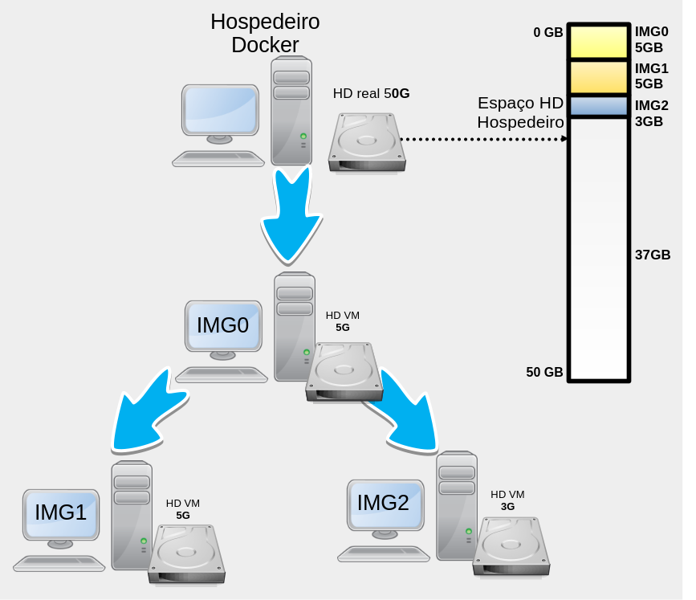

# Introdução


# Containers 

## Verificando se o Docker está instalado

Para iniciar os trabalhos com o Docker, é bom primeiro verificar se o
mesmo está devidamente instalado.

Isso pode ser feito de várias formas, mas vamos fazer verificando a
versão do Docker instalado, com o seguinte comando:

``` console
$ docker --version
Docker version 27.0.3, build 7d4bcd863a
```

Caso o comando não exista, será necessário instalar o Docker em seu
sistema. Nenhuma instalação será abordada aqui neste material,
recomenda-se buscar informações a respeito de como proceder tal
instalação no sítio oficial do
[Docker](https://docs.docker.com/engine/install/), já que a instalação
pode variar de sistema para sistema.

::: note
No caso do Linux veja como instalar em
<https://docs.docker.com/desktop/install/linux-install/>.
:::

Além do comando `docker --version`, é comum executar os comandos:

-   `docker version`, que apresenta mais informações do que o comando
    que foi digitado anteriormente;
-   `docker info`, que traz mais informações ainda, informações a
    respeito do cliente, servidor, etc.

Neste exemplo são retornados dois processos com o termo `dockerd`, sendo
esses:

-   8748, é do `grep`, utilizado para filtrar as saídas no comando `ps`
    (esse não interessa).
-   791, é o processo em execução do Docker (`/usr/bin/dockerd`), ou
    seja, era o que estávamos procurando e se ele não estivesse ai, algo
    estaria errado com a execução do Docker neste sistema.

## Executando containers (`run`)

O comando anterior, bem como sua saída, apresentam várias "coisas"
interessantes do Docker. Assim, vamos dissecar primeiro o comando
executado (docker run -i -t ubuntu /bin/bash), vendo as seguintes opções
e parâmetros:

-   `-i`, mantém a saída padrão (STDIN) do container no console do
    hospedeiro, ou seja, todas as saídas geradas pelo container serão
    apresentadas na tela na qual o comando foi digitado;
-   `-t`, informa para o Docker associar um console virtual
    (*pseudo-tty*) para o container criado. Isso vai permitir interagir
    como container, através da execução de comandos;

Por exemplo, imagine que criamos uma VM completa, utilizando VirtualBox,
nesta VM instalamos o Arch Linux para ser o SO (Sistema Operacional),
vamos chamar essa VM de VM0, e tal VM servirá de base para a criação de
duas outras VMs. Desta forma, clonamos duas vezes a VM0 e criamos agora
a VM1 e VM2 (ver Figura 1). Sendo que, na VM1 instalaremos o MariaDB
para ser nosso banco de dados. Já na VM2, instalaremos o HTTP Apache.

Neste exemplo anterior, utilizando virtualização completa (*full
virtualization*), perceba que agora temos três VMs e cada uma tem um HD
virtual independente, no qual está instalado o sistema de arquivo, que é
a base do Arch Linux. Tais HDs virtuais, na verdade, são arquivos do
computador hospedeiro, esses arquivos normalmente têm alguns *gigabytes*
de tamanho. Continuando o exemplo, vamos supor que o HD da VM0 tem 5GB,
ai clonamos ele para criar a VM1 que por ser um clone da VM0 já tem 5GB,
somado a mais 5GB do MariaDB, o que totaliza um uso de 10GB do HD
virtual. Já para VM2, temos os 5GB iniciais do Arch (que já veio de
"herança") e vamos imaginar que foram instalados e armazenados mais uns
3GB de dados, então teremos o HD virtual da VM2 com 8GB. Assim sendo,
neste exemplo temos três HDs virtuais com 5GB, 10GB e 8GB, o que
totaliza 23GB que são consumidos por esses HDs virtuais do HD real da
máquina hospedeira, tal como ilustrado na Figura 1. Concluindo esse
exemplo, em um sistema de virtualização completa, cada VM tem um HD
completo e isolado, não importa se isso veio de uma cópia/clone de outra
VM, a nova VM será um sistema único ocupando os recursos do hospedeiro
de forma completa e exclusiva.

::: note
Os espaços citados no exemplo para :Arch Linux, MariaDB e Apache HTTP,
são meramente ilustrativos, ou seja, não correspondem ao mundo real.
:::


Todavia, o conceito de imagem utilizada no Docker é ligeiramente
diferente do utilizado normalmente em sistemas de virtualização
completa. Desta forma, podemos até pensar nas imagens Docker como se
fossem HDs virtuais, mas é mais correto chamar de sistema de arquivos
(vamos fazer isso a partir de agora). Assim, é possível criar um sistema
de arquivos base e ir acoplando/sobrepondo outros sistemas de arquivos,
sendo que neste contexto cada sistema de arquivos vai ser uma nova
imagem e então teremos imagens sobrepostas.

Portanto, se pegarmos o mesmo exemplo anterior, só que utilizando
imagens Docker, o cenários ficaria da seguinte forma: teríamos a imagem
Arch Linux, que chamaremos de IMG0, com 5GB, que serviria de base para a
criação da IMG1 e IMG2. Tais imagens são respectivamente equivalentes à
VM0, VM1 e VM2. Então, pegamos de base a IMG0, instalamos o MariaDB e
criamos a IMG1. Da mesma forma, pegamos a IMG0 de base, instalamos o
Apache HTTP e criamos a VM2. Só que fazendo isso com imagens Docker, vai
haver uma grande diferença quando comparado ao exemplo anterior com o
VirtualBox, pois a IMG0 utiliza 5GB. Na IMG1, com a instalação do
MariaDB e dados, tal imagem consumirá apenas 5GB no total e não 10GB (do
exemplo com virtualização completa). Por fim, a IMG2 terá somente 3GB no
total (e não 8GB), tal como ilustra a Figura 2. Ou seja, todas as
imagens (IMG0, IMG1 e IMG2), consumirão da máquina hospedeira apenas
13GB de espaço em disco e não 23G, como foi feito utilizando o
VirtualBox, sendo que isso é possível graças ao conceito de UFS (Union
File System).



# Conclusão

# Bibliografia

TURBULL, James. **The Docker Book: Containerization is the New
Virtualization**. \[s.l.\]: James Turnbull, 2014.
