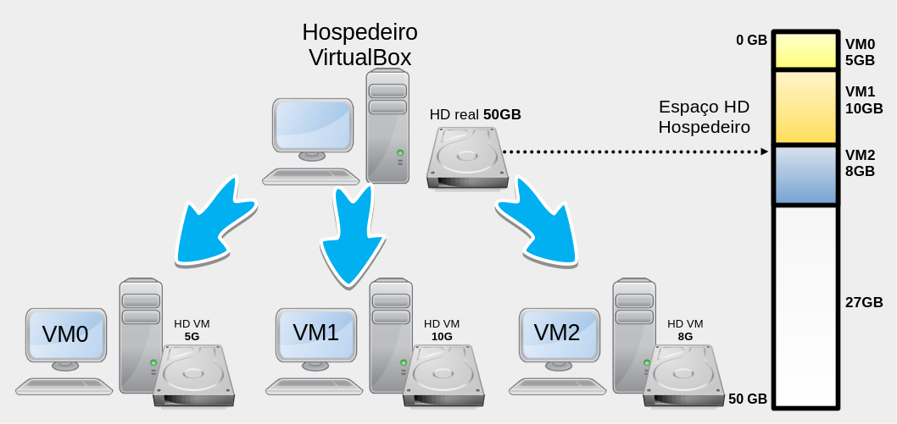
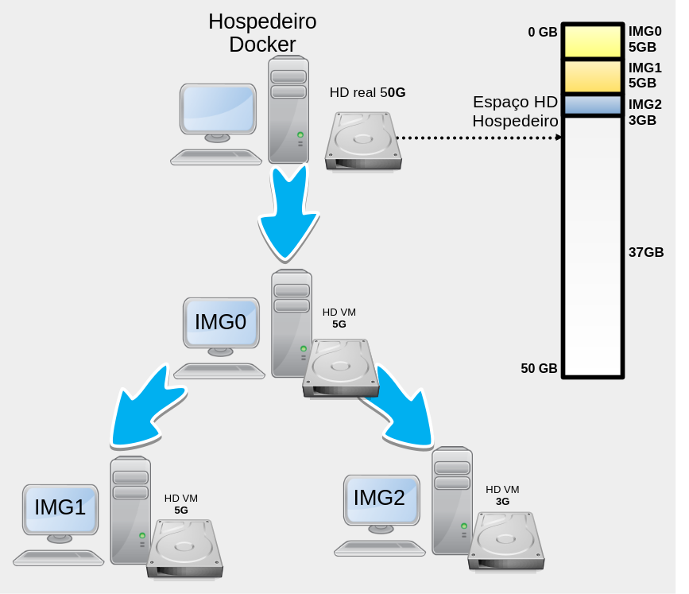
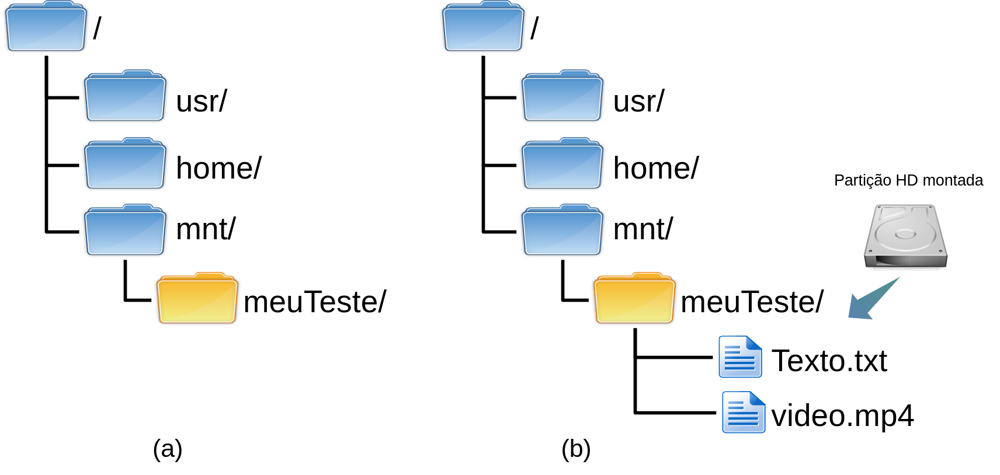
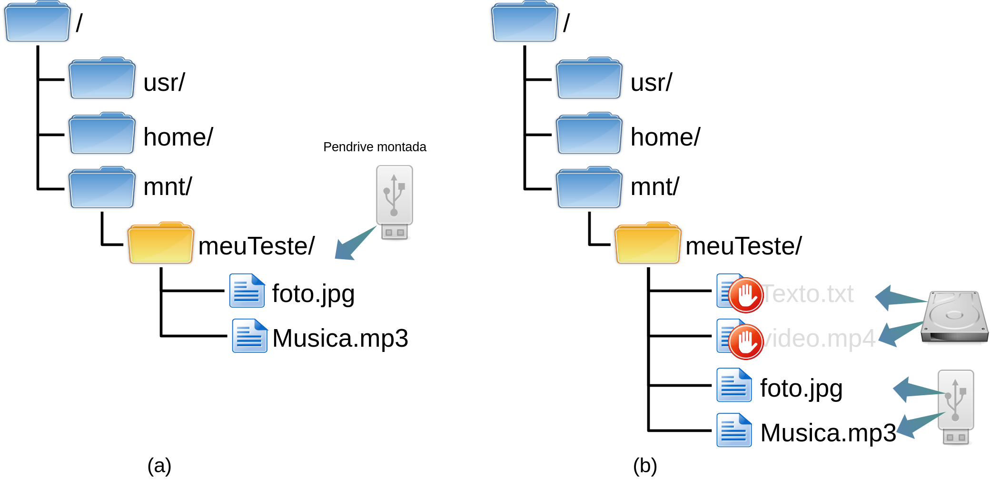
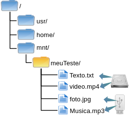

# Imagens

No texto a respeido de [Container](docker-container), foi apresentado o conceito de container, que é
onde os aplicativos/serviços que estão sendo providos via Docker
efetivamente são executados. Todavia, já foi citado que o
container é criado utilizando-se imagens. Por exemplo, no comando:
"`docker run -i -t ubuntu /bin/bash`", o parâmetro "`ubuntu`" representa
a imagem que serve de base para a criação do container Docker. Assim,
neste texto, vamos entender o que é uma imagem, como ela é utilizada
pelo container, quais são as vantagens do uso das imagens Docker, bem
como criar e gerenciar imagens Docker.

Em resumo, uma imagem Docker, nada mais é do que uma camada de sistema
de arquivos, que pode ser empilhada uma sobre a outra. Ou seja,
inicialmente podemos pensar na imagem Docker, como sendo o sistema de
arquivos que utilizaremos dentro do container Docker, tal como uma
imagem ou HD virtual de VM completa (ex. VM do VirtualBox ou VMWare).
Entretanto, é preciso ter em mente que há uma grande diferença entre uma
imagem Docker e uma imagem de VM completa.

Por exemplo, imagine que criamos uma VM completa, utilizando VirtualBox,
nesta VM instalamos o Arch Linux para ser o SO (Sistema Operacional),
vamos chamar essa VM de VM0, e tal VM servirá de base para a criação de
duas outras VMs. Desta forma, clonamos duas vezes a VM0 e criamos agora
a VM1 e VM2 (ver Figura 1). Sendo que, na VM1 instalaremos o MariaDB
para ser nosso banco de dados. Já na VM2, instalaremos o HTTP Apache.

Neste exemplo anterior, utilizando virtualização completa (*full
virtualization*), perceba que agora temos três VMs e cada uma tem um HD
virtual independente, no qual está instalado o sistema de arquivo, que é
a base do Arch Linux. Tais HDs virtuais, na verdade, são arquivos do
computador hospedeiro, esses arquivos normalmente têm alguns *gigabytes*
de tamanho. Continuando o exemplo, vamos supor que o HD da VM0 tem 5GB,
ai clonamos ele para criar a VM1 que por ser um clone da VM0 já tem 5GB,
somado a mais 5GB do MariaDB, o que totaliza um uso de 10GB do HD
virtual. Já para VM2, temos os 5GB iniciais do Arch (que já veio de
"herança") e vamos imaginar que foram instalados e armazenados mais uns
3GB de dados, então teremos o HD virtual da VM2 com 8GB. Assim sendo,
neste exemplo temos três HDs virtuais com 5GB, 10GB e 8GB, o que
totaliza 23GB que são consumidos por esses HDs virtuais do HD real da
máquina hospedeira, tal como ilustrado na Figura 1. Concluindo esse
exemplo, em um sistema de virtualização completa, cada VM tem um HD
completo e isolado, não importa se isso veio de uma cópia/clone de outra
VM, a nova VM será um sistema único ocupando os recursos do hospedeiro
de forma completa e exclusiva.

<div style="display: flex; align-items: center; border: 1px solid black; padding: 10px; border-radius: 5px; background-color: #333333; color: white; gap: 15px;"><div style="flex-shrink: 0;"></div>
 <div class="note">
    <p>Os espaços citados no exemplo para :Arch Linux, MariaDB e Apache
HTTP, são meramente ilustrativos, ou seja, não correspondem ao mundo
real.</p></div></div>



Todavia, o conceito de imagem utilizada no Docker é ligeiramente
diferente do utilizado normalmente em sistemas de virtualização
completa. Desta forma, podemos até pensar nas imagens Docker como se
fossem HDs virtuais, mas é mais correto chamar de sistema de arquivos
(vamos fazer isso a partir de agora). Assim, é possível criar um sistema
de arquivos base e ir acoplando/sobrepondo outros sistemas de arquivos,
sendo que neste contexto cada sistema de arquivos vai ser uma nova
imagem e então teremos imagens sobrepostas.

Portanto, se pegarmos o mesmo exemplo anterior, só que utilizando
imagens Docker, o cenários ficaria da seguinte forma: teríamos a imagem
Arch Linux, que chamaremos de IMG0, com 5GB, que serviria de base para a
criação da IMG1 e IMG2. Tais imagens são respectivamente equivalentes à
VM0, VM1 e VM2. Então, pegamos de base a IMG0, instalamos o MariaDB e
criamos a IMG1. Da mesma forma, pegamos a IMG0 de base, instalamos o
Apache HTTP e criamos a VM2. Só que fazendo isso com imagens Docker, vai
haver uma grande diferença quando comparado ao exemplo anterior com o
VirtualBox, pois a IMG0 utiliza 5GB. Na IMG1, com a instalação do
MariaDB e dados, tal imagem consumirá apenas 5GB no total e não 10GB (do
exemplo com virtualização completa). Por fim, a IMG2 terá somente 3GB no
total (e não 8GB), tal como ilustra a Figura 2. Ou seja, todas as
imagens (IMG0, IMG1 e IMG2), consumirão da máquina hospedeira apenas
13GB de espaço em disco e não 23G, como foi feito utilizando o
VirtualBox, sendo que isso é possível graças ao conceito de UFS (Union
File System).



## Union File System - *union mount*

Para compreender como as imagens Docker funcionam é necessário entender
o conceito de UFS (Union File System), comumente chamado de *union
mount*.

Para falar de *union mount* é necessário primeiro lembrar que montar
(*mount*) em ambientes Like-Unix, significa disponibilizar em um
diretório do sistema, o conteúdo de partições de HDs, SSDs, *pendrives*,
DVDs, etc. Assim, quando se monta uma partição de um HD, por exemplo no
diretório `/mnt/meuTeste`, o conteúdo desta partição (arquivos e
diretórios) aparecerão dentro do diretório `/mnt/meuTeste`. A Figura 3-a
apresenta o diretório `/mnt/meuTeste`, sem nenhum conteúdo (diretório
vazio) antes da montagem. Já a Figura 3-b, mostra o diretório
`/mnt/meuTeste` após a montagem da partição de um HD, neste caso tal
diretório apresenta conteúdo da partição do HD, que são os arquivos
`Texto.txt` e `video.mp4`.

<!--

-->

É muito importante saber, que se já houvesse algum conteúdo dentro de
`/mnt/meuTeste`, antes da montagem, tal conteúdo ficaria oculto,
indisponível e intocável durante todo o tempo que tal diretório
permanecer montado. Desta forma, se enquanto o conteúdo da partição do
HD estiver montada em `/mnt/meuTeste` e posteriormente for montada o
conteúdo de um *pendrive* no mesmo diretório `/mnt/meuTeste`, tudo que
for feito no diretório `/mnt/meuTeste` afetará somente os arquivos do
*pendrive*, pois o conteúdo da partição do HD estará oculta e protegida
pelo processo de montagem. A Figura 3-c mostra como ficará aos olhos do
usuário o conteúdo do diretório `/mnt/meuTeste`, quando montando o
conteúdo de um *pendrive* no mesmo diretório onde já estava montada a
partição do HD. Já a Figura 3-d, apresenta que na verdade o conteúdo do
HD ainda está associado ao diretório, mas o mesmo não fica acessível
enquanto o *pendrive* permanecer montado. Todavia, quando o conteúdo da
partição do HD volta a aparecer no diretório `/mnt/meuTeste`, asim que o
*pendrive* for desmontado, como se nada houvesse acontecido.

<!--

-->

A diferença do *union mount* para o *mount* tradicional, é que o *union
mount* permite montar vários sistemas de arquivos em um ponto de
montagem (diretório), deixando o conteúdo de todos esses sistemas de
arquivos disponíveis simultaneamente. Ou seja, utilizando o *union
mount* é possível montar, o conteúdo de uma partição de HD no diretório
`/mnt/meuTeste`, mas agora se for montado o conteúdo de um *pendrive* no
mesmo diretório (`/mnt/meuTeste`), ficará visível e acessível tanto o
conteúdo da partição do HD, quanto o conteúdo do *pendrive*, desta forma
o usuário deste sistema poderia trabalhar em ambos dispositivos de
armazenamento (*pendrive* e partição do HD) simultaneamente no mesmo
diretório (o que não era possível no *mount* tradicional). A Figura 3-e,
apresenta esse comportamento do *union mount*. É importante entender
aqui, que caso exista arquivos com o mesmo *path*, por exemplo
`/texto.txt` na partição do HD e um arquivo `/texto.txt` no pendrive,
ficará acessível apenas o arquivo do dispositivo que foi montado por
último. 

<!--

-->


<div style="display: flex; align-items: center; border: 1px solid black; padding: 10px; border-radius: 5px; background-color: #333333; color: white; gap: 15px;"><div style="flex-shrink: 0;"></div>
 <div class="note">
    <p>Para realizar um <em>union mount</em> no Linux, é possível utilizar,
por exemplo, o <code>unionfs</code>, tal como:</p>
<pre class="console"><code># unionfs -o cow teste1/=RW:teste2/=RO testeTodos/</code></pre>
<p>Neste exemplo, o conteúdo dos diretórios <code>teste1/</code> e
<code>teste2/</code> são montados dentro de <code>testeTodos/</code>,
tudo que for alterado em <code>testeTodos/</code> será gravado em
<code>teste1/</code>, que foi definido com permissão de leitura e
gravação (<code>RW</code>).</p></div></div>

O Docker suporta várias implementações do *mount union*, tais como:
AUFS, Overlay, devicemapper, BTRFS e ZFS. A implementação utilizada por
cada Docker pode ser vista com o comando `docker info`, na saída procure
por `Storage Driver`, tal como:

``` console
$ docker info | grep -i "storage driver"
 Storage Driver: overlay2
```

Na saída anterior, a máquina na qual o comando foi executado, está
utilizando o Overlay para tecnologia UFS, ou seja, para realizar *union
mount*.

Agora, sabendo como funciona o UFS ou *union mount*, podemos dizer que o
Docker utiliza tal técnica para agregar imagens e assim economizar
espaço em disco, bem como facilitar a distribuições e escalabilidade
dessas imagens, o que torna o Docker muito eficiente em comparação com
sistemas de virtualização completos (ex. VirtualBox, VMWare, etc).

Desta forma, utilizando UFS, os containers Docker normalmente têm várias
camadas de imagens, visando compor o container final de forma mais
prática e eficiente. Veja na Figura 4 como poderia ser composta as
camadas de imagens de um container, bem como a descrição dessas no texto
a seguir:

-   A primeira camada, ou seja imagem, será o sistema de arquivos de
    *boot*, conhecido como *bootfs*. De forma simplista, vamos imaginar
    que nesta imagem está apenas o *kernel* Linux;
-   A próxima camada será, por exemplo, a base de alguma distribuição
    Linux, tal como o Arch, Ubuntu, CentOS, etc;
-   Na sequência poderia ter uma camada com as ferramentas/comandos que
    o administrador acha que deve ter em todos os container, tais como:
    `vim`, `iproute2`, `tcpdump`, `htop`, etc;
-   Depois, pode vir o serviço que se espera daquela imagem, tal como o
    Apache HTTP;
-   Por fim, viria a camada na qual o container pode gravar/alterar
    arquivos/diretórios.


Levando em consideração o exemplo da Figura 4, note que a primeira
camada (Camada 1 da Figura 4) é o *kernel*, que na verdade é
compartilhado com o sistema hospedeiro. Já a Camada 2. Desta forma, o
*kernel* sempre será compartilhado do hospedeiro com todos os
containers, já a distribuição Linux pode ser qualquer uma (a gosto do
administrador). Após o *kernel* e a base da distribuição, normalmente
começam a surgir várias camadas, conforme a necessidade/estratégia do
administrador do sistema, por exemplo, caso ele queira que determinadas
ferramentas estejam em todos os containers derivados, ele pode instalar
tais ferramentas neste momento, tal como foi feito na Camada 3. Ainda
seguindo o exemplo, a próxima camada (Camada 4) contém a instalação do
Apache HTTP, então essa imagem provavelmente é de um servidor HTTP, que
poderia por exemplo, receber mais imagens, para formar servidores PHP,
JSP, JavaScript, etc. Da mesma forma, o administrador, poderia pegar a
partir da Camada 3 e adicionar uma imagem para um servidor de banco de
dados, etc. Já no topo das imagens, quando o container for iniciado, vai
ficar uma imagem com permissão de leitura e gravação, que será o espaço
no qual os arquivos criados ou alterados pelo container serão
armazenados, essa técnica chama-se CoW (*Copy-on-Write*), ver Camada 5
da Figura 4. Lembrando que aqui estamos apresentando só um exemplo de
como poderiam ser organizadas as camadas, ou seja, cada imagem de
container pode seguir uma ordem de sequência de imagem diferente.

### CoW (*Copy-on-Write*)

No conceito de ***Copy-on-Write***, todas as imagens abaixo da última,
estarão com permissão de somente leitura (RO), isso vai proteger a
imagem de alterações e garantir que a imagem é a mesma para todos que a
utilizarem. Já a última camada, tem permissão de leitura e gravação
(RW). Desta forma, arquivos novos são gravados nesta imagem, da mesma
forma, se algum arquivo das imagens a baixo forem alterados, será criado
uma cópia deste arquivo na imagem superior, que então ocultará o arquivo
da imagem original e apresentará para o sistema/usuário apenas o arquivo
alterado que agora está na imagem com permissão de leitura e gravação. O
CoW trabalha em conjunto com a técnica de *union mount*, explicada
anteriormente.

<div style="display: flex; align-items: center; border: 1px solid black; padding: 10px; border-radius: 5px; background-color: #333333; color: white; gap: 15px;"><div style="flex-shrink: 0;"></div>
    <div class="note">
    <p>O <em>union mount</em> permite montar várias imagens de forma que
todas fiquem acessíveis simultaneamente em um mesmo ponto de montagem
(diretório), só que normalmente apenas a última imagem é que terá
permissão de gravação e escrita, já as camadas abaixo dessa terão
permissão apenas de leitura. Quando algum arquivo/diretório de uma
camada abaixo precisar ser alterado/escrito, a técnica de CoW copiará
tal arquivo alterado para a última imagem, que normalmente representa o
container. Isso garante a integridade dos arquivo para containers que
utilizam as mesmas imagens e da mesma forma permite que o container
tenha a capacidade de alterar completamente e livremente a estrutura de
arquivos e diretórios ele está trabalhando.</p></div></div>

Então containers mantém as alterações realizadas no sistema de arquivos
deles, permitindo assim salvar por exemplo configurações referentes
aquele container (ex. IP, rota padrão, usuários, etc), bem como
alterações realizadas por aquele container em arquivos que inicialmente
eram da imagem, mas que agora fazem parte daquele container. Já a imagem
utilizada para criar o container fica intocada, pois uma imagem Docker é
imutável.

Agora sabendo como funcionam as imagens Docker e quais são as técnicas
empregadas nessas imagens, vamos abordar como utilizar e configurar tais
imagens na prática.

## Listando imagens (`images`)

Para listar as imagens disponíveis no próprio *host* hospedeiro, é
possível utilizar o comando `docker images`, tal como:

``` console
$ docker images
REPOSITORY              TAG           IMAGE ID       CREATED        SIZE
ubuntu                  latest        35a88802559d   2 months ago   78MB
luizarthur/cyberinfra   routerDeb11   28b009432f01   4 months ago   391MB
luizarthur/cyberinfra   hostDeb11     da504d85c4c9   4 months ago   278MB
debian                  11            57a92962dbeb   4 months ago   124MB
archlinux               latest        0cda8061254a   5 months ago   436MB
```

A saída da listagem de imagens apresentada no exemplo anterior, mostra
as imagens por linhas, sendo que cada coluna apresenta as seguintes
informações:

-   `REPOSITORY`: é o repositório de onde a imagem foi derivada;
-   `TAG`: é um nome para identificar/nomear o repositório, isso pode
    por exemplo ajudar a controlar versões;
-   `IMAGE ID`: identificador único da imagem, em nível global (é um
    *hash*);
-   `CREATED`: informa a data que a imagem foi criada;
-   `SIZE`: tamanho da imagem - quanto ela ocupa no disco.

As imagens ficam armazenadas normalmente dentro do diretório
`/usr/lib/docker`, sendo que dentro deste diretório as imagens devem
estar dentro dos subdiretórios `overlay2`, `aufs`, `btrfs`, dentre
outros, dependendo o tipo de armazenamento Docker utilizado.

Por exemplo, o conteúdo do diretório `/var/lib/docker/`, do *host* a
seguir é:

``` console
# ls /var/lib/docker/
buildkit  containerd  containers  engine-id  image  network  overlay2  plugins  runtimes  swarm  tmp  trust  volumes
```

Dentro do subdiretório `/var/lib/docker/overlay2/` ficará as camadas das
imagens utilizadas no Docker (neste caso o *host* utiliza o `overlay2`),
então um exemplo de saída deste diretório seria:

``` console
# ls /var/lib/docker/overlay2/
00b33f7e6620ec4c3b874db4dbdac73e4ac79b3ba28414376be5641182c1381e       9b41a116168f228375439a9a3cd637171657966d91a1322df6ec8ec41778663c
032c162f754771188907fdb019c3e48df5965e05dd05100b08f999b644e266fb       9b41a116168f228375439a9a3cd637171657966d91a1322df6ec8ec41778663c-init
046c72f791a385eff6aea070a3acd52a47b9b8b815a82ee71436e1278a6e3d5d       9f9d469612856b3ba95bd9257b971b8bb821457c862c50c4f11353f9e7510452
046c72f791a385eff6aea070a3acd52a47b9b8b815a82ee71436e1278a6e3d5d-init  a4da83df821bbaaa6f2833864b3cf765713a2919039547966283bb5e4e1f5541
...
```

Já o diretório `/var/lib/docker/image/` contém metadados a respeito das
imagens. No exemplo a seguir é possível ver que o *host* têm como
subdiretório de `image` um diretório chamado `overlay2`, que por sua vez
tem diretórios e arquivos com os dados a respeito das imagens:

``` console
# ls /var/lib/docker/image/
overlay2

# ls -l /var/lib/docker/image/overlay2/
total 16
drwx------ 4 root root 4096 Jun 21  2021 distribution
drwx------ 4 root root 4096 Jun 21  2021 imagedb
drwx------ 5 root root 4096 Jun 21  2021 layerdb
-rw------- 1 root root 2214 Aug 13 11:20 repositories.json
```

A princípio, tais arquivos não devem ser editados manualmente, pois são
mantidos de forma automática pelo próprio Docker.

<div style="display: flex; align-items: center; border: 1px solid black; padding: 10px; border-radius: 5px; background-color: #333333; color: white; gap: 15px;"><div style="flex-shrink: 0;"></div>
 <div class="note">
    <p>Os arquivos dos containers ficam normalmente no diretório
<code>/var/lib/docker/containers/</code>.</p></div></div>

## De onde vêm as imagens Docker?

Estamos falando das imagens Docker, mas como fazer ou obter uma imagem
Docker?

A reposta é: "você pode fazer a sua própria imagem, ou baixá-las de
algum repositório".

Então há basicamente duas formas obter e utilizar imagens Docker, que
são:

-   **Obtendo imagens de repositórios**, tais como o [Docker
    Hub](https://hub.docker.com/). Neste exemplo o Docker Hub, é um
    repositório para imagens Dockers, no qual é possível compartilhar,
    armazenar e distribuir imagens Dockers utilizando, repositórios
    públicos ou privados;

-   **Criando sua própria imagem**. Para criar-se uma imagem,
    normalmente é utilizada imagem pré-existente geralmente obtida de um
    repositório. É claro que é possível criar uma imagem Docker do zero,
    sem utilizar outra imagem pré-existente, todavia uma das grandes
    vantagens do Docker é justamente poder reutilizar imagens já
    criadas, o que torna tudo muito mais fácil.

É necessário observar que o conceito de repositórios de imagens Docker
são um grande atrativo para o uso do Docker, pois torna-se muito fácil
criar, gerenciar e distribuir imagens. Dada essa afirmação/constatação,
não faz muito sentido não utilizar os repositórios. Assim, o texto a
seguir mescla a criação de imagens manualmente com o uso de
repositórios, já que isso é o mais natural dentro do mundo Docker.

## Procurando imagens no Docker Hub (`search`)

O [Docker Hub](https://hub.docker.com/) é similar ao
[GitHub](https://github.com/), só que o GitHub é uma plataforma que
mantém códigos-fonte, ou seja, repositórios de projetos de programação.
Já o Docker Hub faz a mesma coisa, só que com imagens Dockers, que podem
ser simplesmente a imagem de um Linux básico (que serve de base para
outras imagens) ou de imagens mais complexas contento por exemplo um
sistema completo de uma empresa.

Ainda comparando o GitHub com o Docker Hub, uma das grandes vantagens de
se disponibilizar um projeto de software via Docker Hub e não GitHub, é
que quem baixar a imagem já tem o ambiente completo e funcional para
executar tal projeto. O que não acontece no GitHub, pois nesse é
necessário geralmente, baixar o projeto, resolver as dependências
(instalar softwares e bibliotecas necessários para o projeto) e só então
tentar executá-lo. É claro que na prática, o objetivo do GitHub e do
Docker Hub são diferentes (eles não competem entre-si), na verdade um
complementa o outro.

<div style="display: flex; align-items: center; border: 1px solid black; padding: 10px; border-radius: 5px; background-color: #333333; color: white; gap: 15px;"><div style="flex-shrink: 0;"></div>
 <div class="note">
    <p>Há outros repositórios similares ao Docker Hub, tais como: <a
href="https://quay.io/">Quay</a>, <a
href="https://cloud.google.com/artifact-registry?hl=pt-br">Google
Container Registry - GCR</a>, <a
href="https://aws.amazon.com/pt/ecr/">Amazon Elastic Container Registry
- ECR</a>, <a
href="https://azure.microsoft.com/en-us/products/container-registry/">Azure
Container Registry - ACR</a>, <a
href="https://docs.gitlab.com/ee/user/packages/container_registry/">GitLab
Container Registry</a> e <a href="https://goharbor.io/">Harbor</a>.
Todavia neste texto vamos nos concentrar no Docker Hub.</p></div></div>

Assim, para obter imagens do Docker Hub é possível pesquisar por essas
no sítio Web do Docker Hub (<https://hub.docker.com/search>). A Figura 5
ilustra a busca por imagens Dockers relacionadas com "Fedora" na
tentativa de encontrar uma imagem do Fedora Linux.


Já a Figura 5 mostra as informações do repositório Docker escolhido após
a busca anterior.


Além de realizar a busca direta no sítio Web, também é possível realizar
tal busca utilizando o comando `docker search` seguido do termo de
busca. No exemplo a seguir buscamos novamente por "fedora", só que agora
via console:

``` console
# docker search fedora
NAME                         DESCRIPTION                                     STARS     OFFICIAL
fedora                       Official Docker builds of Fedora                1213      [OK]
ustclug/fedora               Official Fedora Image with USTC Mirror          0
srcml/fedora                 Build, package, and test srcml on Fedora        0
mdsplus/fedora                                                               0
kasmweb/fedora-39-desktop    Fedora 39 desktop for Kasm Workspaces           0
kasmweb/fedora-40-desktop    Fedora 40 desktop for Kasm Workspaces           1
```

## Obtendo imagens do Docker Hub (`pull`)

Bem, depois de encontrar a imagem via sítio Web ou repositório, é
possível obter essa imagem Docker realizando um `docker pull`. Note que
na Figura 5, via sítio Web, que há uma opção para já copiar (*copy*) o
comando necessário para baixar a imagem do `fedora` encontrada, então
vamos executar tal comando:

``` console
$ docker pull fedora
Using default tag: latest
latest: Pulling from library/fedora
f7bb57d05c2a: Pull complete
Digest: sha256:b7b4b222c2a433e831c006a49a397009640cc30e097824410a35b160be4a176b
Status: Downloaded newer image for fedora:latest
docker.io/library/fedora:latest
```

A saída do comando anterior mostra que a imagem Docker, foi do Docker
Hub com sucesso. Para constatar isso podemos pedir para listar as
imagens, e lá deve aparecer uma linha do repositório do `fedora`, tal
como:

``` console
$ docker images
REPOSITORY              TAG           IMAGE ID       CREATED        SIZE
fedora                  latest        9146ee7fcff0   3 days ago     222MB
ubuntu                  latest        35a88802559d   2 months ago   78MB
luizarthur/cyberinfra   routerDeb11   28b009432f01   4 months ago   391MB
...
```

Depois de obter a imagem é possível utilizá-la, por exemplo iniciando um
container, tal como já fizemos nos textos anteriores:

``` console
$ docker run --name meuFedora -ti fedora /bin/bash
[root@19bad3150dfa /]# yum --version
4.19.0
  Installed: dnf-0:4.19.0-1.fc40.noarch at Sun Apr 14 22:54:24 2024
  Built    : Fedora Project at Thu Feb  8 16:33:42 2024

  Installed: rpm-0:4.19.1.1-1.fc40.x86_64 at Sun Apr 14 22:54:24 2024
  Built    : Fedora Project at Wed Feb  7 15:55:53 2024
[root@19bad3150dfa /]# uname -a
Linux 19bad3150dfa 6.10.6-arch1-1 #1 SMP PREEMPT_DYNAMIC Mon, 19 Aug 2024 17:02:39 +0000 x86_64 GNU/Linux
[root@19bad3150dfa /]#
```

No comando anterior, ligamos um container chamado `meuFedora` com a
imagem do Fedora Linux, que obtivemos anteriormente. Nesta foi executado
o comando `yum` o que mostra que estamos em um ambiente que utiliza
ferramentas de instalação do Fedora, mesmo estando em um *host* que é
Arch Linux (ou seja, não tem `yum`).

## Criando imagens (`commit` e `build`)

Como vimos anteriormente é possível obter uma imagem existente de um
repositório, tal como o Docker Hub, todavia em algum momento será
necessário modificar a imagem para que essa atenda necessidades
específicas de empresas ou pessoas. Neste caso há duas formar de criar
imagens:

-   `docker commit`, sendo que este método cria uma imagem a partir de
    um container existente. Tal método permite que se faça alterações
    manuais dentro do container (interagindo com o `bash`, por exemplo).
    Após todas as alterações necessárias, o administrador salvará o
    estado atual desse container, gerando uma nova imagem;
-   `docker build`, nesta forma a imagem será criada a partir das
    instruções contidas em um arquivo chamado Dockerfile, tal arquivo é
    basicamente um *script* que contém sequências de instruções para
    configurar a imagem Docker.

Note que o `commit` a principio pode ser mais simples que o `build`,
todavia ele não documenta as alterações feitas na imagem, isso
compromete o registro das alterações da imagem e pode atrapalhar o
gerenciamento da imagem. Já o `build`, inicialmente é mais complexo,
pois exige que o administrador do sistema compreenda os comandos do
arquivo Dockerfile, mas a longo prazo o gerenciamento dessas imagens
ficam mais simples. Desta forma, o método mais recomendado para criar
imagem é o `build`.

### Criando imagens com o `commit`

Vamos iniciar criando imagens utilizando o `commit`, pois isso é mais
intuitivo a principio. Desta forma, espera-se que tenhamos um container
em execução e que vamos alterar coisas dentro desse container (na imagem
dele) e depois vamos salvar essa imagem alterada.

Então como exemplo, vamos iniciar um container e depois vamos instalar
alguns pacotes nele, tal como:

``` console
$ docker run --name meuFedoraApache -ti fedora /bin/bash

[root@f768497f72b7 /]# dnf update
...
[root@f768497f72b7 /]# dnf install httpd
...
[root@f768497f72b7 /]# dnf install net-tools
...
[root@f768497f72b7 /]# /usr/sbin/httpd
```

No container anterior, utilizamos a imagem do `fedora` para iniciar um
container chamado `meuFedoraApache`, depois utilizando o comando `dnf`,
realizamos uma atualização do sistema e em seguida instalamos os pacotes
`httpd` e `net-tools`, esses respectivamente são: o servidor Apache HTTP
e alguns comandos de rede (`ifconfig`, `netstat`, etc). Por fim,
iniciamos o `httpd` que acabamos de instalar.

<div style="display: flex; align-items: center; border: 1px solid black; padding: 10px; border-radius: 5px; background-color: #333333; color: white; gap: 15px;"><div style="flex-shrink: 0;"></div>
 <div class="note">
    <p>Não precisaria instalar o <code>net-tools</code> para o Apache
funcionar, isso só foi feito para poder ver o IP do container e se o
Apache está em execução com o <code>netstat</code>.</p>
<p>Com esses passos podemos ver o servidor HTTP em execução no container
em questão (veja o IP do container e digite esse em seu navegador
Web).</p></div></div>

Agora, com o container já configurado da forma que esperávamos, vamos
gerar uma imagem a partir desse container. Para isso precisamos abrir
outro terminal (**não no terminal do container**) e executar:

``` console
$ docker commit meuFedoraApache servidor/fedora_apache
sha256:8bcfdd9d6660954b2645e72185fb086071e1aeca519c93b3bd50aa6b0b363ff7
```

No exemplo que estamos seguindo, utilizamos o container
`meuFedoraApache`, para criar uma imagem chamada
`servidor/fedora_apache`. Tal imagem agora pode ser vista na lista de
imagens que temos localmente, tal como:

``` console
$ docker images
REPOSITORY               TAG           IMAGE ID       CREATED         SIZE
servidor/fedora_apache   latest        8bcfdd9d6660   5 minutes ago   512MB
fedora                   latest        9146ee7fcff0   3 days ago      222MB
ubuntu                   latest        35a88802559d   2 months ago    78MB
luizarthur/cyberinfra    routerDeb11   28b009432f01   4 months ago    391MB
...
```

Agora podemos utilizá-la para por exemplo iniciar um novo container com
um servidor Apache em execução, tal como:

``` console
$ docker run --rm --name servidorFedApache -d servidor/fedora_apache /usr/sbin/httpd -DFOREGROUND
4d76b05803d3757975f58199b97c023240763577884bec435d6fc1eec6bd6784
```

Então o comando anterior, executa um container chamado
`servidorFedApache`, a partir da imagem `servidor/fedora_apache` (que
criamos via `commit`) e executa o servidor HTTP
(`/usr/sbin/httpd -DFOREGROUND`).

<div style="display: flex; align-items: center; border: 1px solid black; padding: 10px; border-radius: 5px; background-color: #333333; color: white; gap: 15px;"><div style="flex-shrink: 0;"></div>
    <div class="note">
    <p>Note que foi necessário utilizar a opção <code>-DFOREGROUND</code>,
para o container não terminar devido ao Apache executar em plano de
fundo.</p></div></div>

Após isso podemos ver tal container em execução:

``` console
$ docker ps
CONTAINER ID   IMAGE                    COMMAND                  CREATED          STATUS          PORTS     NAMES
4d76b05803d3   servidor/fedora_apache   "/usr/sbin/httpd -DF…"   2 seconds ago    Up 1 second               servidorFedApache
f768497f72b7   fedora                   "/bin/bash"              48 minutes ago   Up 20 minutes             meuFedoraApache
```

Também podemos ver o IP desse container e acessá-lo via navegador Web,
tal como:

``` console
$ docker inspect servidorFedApache | grep -i \"IPAddress
            "IPAddress": "172.17.0.3",
```

Depois seria só inserir o IP do container no navegador, tal como
<http://172.17.0.3> e deve ser possível ver uma página Web, tal como
apresentado na Figura 7.


<div style="display: flex; align-items: center; border: 1px solid black; padding: 10px; border-radius: 5px; background-color: #333333; color: white; gap: 15px;"><div style="flex-shrink: 0;"></div>
 <div class="note">
    <p>É importante observar que durante o <code>commit</code> o container
que serve de base estava em execução.</p></div></div>

### Criando imagens com o `build`

Vimos anteriormente que o `commit` pode ser utilizado para criar uma
imagem, todavia atualmente recomenda-se utilizar o `build`, já que esse
é considerado uma prática melhor, pois permite analisar as diferenças
entre as imagens, já que mantém um arquivo com os passos executados para
alterar a imagem. Desta forma é importante entender como funciona o
`build` e o arquivo Dockerfile.

#### Dockerfile

Então a base para se criar uma imagem com o `build` é entender o
Dockerfile e sua estrutura. Desta forma para entender a estrutura básica
deste arquivo vamos replicar o que foi feito na imagem anterior (quando
foi utilizado o `commit`).

Para isso vamos criar um diretório, tal como:

``` console
$ mkdir buildApache
$ cd buildApache/
$ vi Dockerfile
```

Então anteriormente (comandos), foi criado um diretório chamando
`buildApache`, entramos dentro deste diretório (`cd`) e por fim
executamos o editor de texto `vi` (fique a vontade para utilizar outro
editor de texto) para criar/editar o arquivo chamado `Dockerfile`. Para
este exemplo o conteúdo deste arquivo será:

``` console
FROM fedora
MAINTAINER Luiz Arthur "luizsantos@utfpr.edu.br"
RUN dnf update -y
RUN dnf install httpd net-tools -y
RUN echo "Olá com <b> build" > /var/www/html/index.html''
```

As instruções contidas neste arquivo de exemplo foram:

-   `FROM`: indica a imagem base, na qual essa nova imagem será gerada;
-   `MAINTAINER`: informa o autor da imagem e seu e-mail;
-   `RUN`: Executa comandos na imagem atual.

Então o principal neste arquivo de exemplo, é que a imagem é baseada no
`fedora`, e são executados três comandos, sendo esses: atualiza o
`fedora`, instala do `httpd` e `net-tools` (o `-y` é para responder sim
a todas as perguntas do `dnf`, já que não há interação do usuário com
este tipo de procedimento) e por fim, neste exemplo, criamos um
`index.html` para diferenciar essa imagem da anterior (criada com o
`commit`).

<div style="display: flex; align-items: center; border: 1px solid black; padding: 10px; border-radius: 5px; background-color: #333333; color: white; gap: 15px;"><div style="flex-shrink: 0;"></div>
 <div class="note">
    <p>Lembrando que principalmente nesta imagem não precisaria instalar o
<code>net-tools</code>, isso foi feito aqui só para manter
compatibilidade entre os exemplos.</p></div></div>

Feito o Dockerfile, agora é possível executar o `docker build` e criar
efetivamente a imagem, tal como:

``` console
$ docker build -t="servidor/build_fedora_apache" .
DEPRECATED: The legacy builder is deprecated and will be removed in a future release.
            Install the buildx component to build images with BuildKit:
            https://docs.docker.com/go/buildx/

Sending build context to Docker daemon  2.048kB
Step 1/5 : FROM fedora
 ---> 9146ee7fcff0
Step 2/5 : MAINTAINER Luiz Arthur "luizsantos@utfpr.edu.br"
 ---> Running in 8acec3282bb9
 ---> Removed intermediate container 8acec3282bb9
 ---> 6e988b94e803
Step 3/5 : RUN dnf update -y
...
Complete!
 ---> Removed intermediate container 168523b0e76d
 ---> 60e824a461ec
Step 5/5 : RUN echo "Olá com <b> build" > /var/www/html/index.html''
 ---> Running in 23444ad42f62
 ---> Removed intermediate container 23444ad42f62
 ---> a399fcc1c787
Successfully built a399fcc1c787
Successfully tagged servidor/build_fedora_apache:latest
```

É importante acompanhar e verificar as saída do processo `build`, para
identificar possíveis erros, principalmente nos comandos executados pelo
`RUN`. Caso erros aconteçam serão retornados códigos diferentes de zero,
na saída.

<div style="display: flex; align-items: center; border: 1px solid black; padding: 10px; border-radius: 5px; background-color: #333333; color: white; gap: 15px;"><div style="flex-shrink: 0;"></div>
 <div class="note">
    <p>Se houverem erros, uma boa prática é executar o container com o `bash` e
ir digitando os comandos lá dentro e copiando e colando para o
Dockerfile.</p></div></div>


Na saída anterior, que não apresentou erros, veja que o comando
`docker build` é seguida de `-t`, que indica o rótulo que vai
identificar a nova imagem. Após isso é possível acompanhar a execução
das instruções do Dockerfile, ou seja, obtenção da imagem do `fedora`, e
execução dos comandos presentes no `RUN`.

É válido mencionar com ainda é possível criar rótulos para as imagens na
opção `-t`, tal como:
`docker build -t="servidor/build_fedora_apache:v1"`, isso ajuda a
organizar melhor as imagens, mas caso não se utilize esse rótulo o
Docker colocará por padrão o rótulo `latest`.

Também é possível executar o `docker build` em um diretório diferente da
onde está o Dockerfile, inclusive utilizando um arquivo que não se chama
Dockerfile (mas o conteúdo tem que ser no estilo Dockerfile), para isso
basta utilizar a opção `-f` e passar o caminho para o arquivo em
questão.

Após o `build` é possível ver a imagem na listagem de imagens Docker,
tal como:

``` console
$ docker images
REPOSITORY                     TAG           IMAGE ID       CREATED              SIZE
servidor/build_fedora_apache   latest        a399fcc1c787   About a minute ago   518MB
servidor/fedora_apache         latest        8bcfdd9d6660   About an hour ago    512MB
fedora                         latest        9146ee7fcff0   3 days ago           222MB
ubuntu                         latest        35a88802559d   2 months ago         78MB
luizarthur/cyberinfra          routerDeb11   28b009432f01   4 months ago         391MB
```

Então, com a imagem pronta, é possível executar um container utilizando
essa nova imagem:

``` console
$ docker run --rm --name servidorFedApache2 -d servidor/build_fedora_apache /usr/sbin/httpd -DFOREGROUND
81b9354214ca0bae865211ba93b34817c7aef8cab3cc3510954a11da14a9db03
```

Se tudo correu bem, tal imagem estará em execução:

``` console
$ docker ps
CONTAINER ID   IMAGE                          COMMAND                  CREATED             STATUS             PORTS     NAMES
81b9354214ca   servidor/build_fedora_apache   "/usr/sbin/httpd -DF…"   6 seconds ago       Up 5 seconds                 servidorFedApache2
4d76b05803d3   servidor/fedora_apache         "/usr/sbin/httpd -DF…"   About an hour ago   Up About an hour             servidorFedApache
f768497f72b7   fedora                         "/bin/bash"              2 hours ago         Up 2 hours                   meuFedoraApache
```

E podemos fazer o teste, tal como feito no exemplo do `commit`, e
portanto podemos acessar o servidor HTTP em execução no container
criado. A saída a seguir mostra como obter o IP do container e a
Figura 8 mostra o acesso à esse container utilizando um navegador no
*host* hospedeiro.

``` console
$ docker inspect servidorFedApache2 | grep -i \"IPAddress
            "IPAddress": "172.17.0.4",
                    "IPAddress": "172.17.0.4",
```


#### Cache do `build`

Os passos executados durante a criação da imagem utilizando `build` e
Dockerfile ficam armazenados em cache, isso pode economizar tempo, pois
se um passo já foi feito e um novo passo foi adicionado, o Docker só vai
gastar tempo executando o novo passo.

O uso do cache na criação da imagem utilizando o `build` e o Dockerfile,
pode ser vista na saída a seguir, que executa a imagem, que já havia
sido criada na seção anterior - ou seja, é uma imagem que já teve todos
os seus passos criados:

``` console
$ docker build -t="servidor/build_fedora_apache" .
...
Step 1/5 : FROM fedora
 ---> 9146ee7fcff0
Step 2/5 : MAINTAINER Luiz Arthur "luizsantos@utfpr.edu.br"
 ---> Using cache
 ---> ef7690e14222
Step 3/5 : RUN dnf update -y
 ---> Using cache
 ---> 2402ee15a5f0
Step 4/5 : RUN dnf install httpd net-tools -y
 ---> Using cache
 ---> 6a8f5591a1c9
Step 5/5 : RUN echo "Olá com <b> build" > /var/www/html/index.html''
 ---> Using cache
 ---> 9c80a2830029
Successfully built 9c80a2830029
Successfully tagged servidor/build_fedora_apache:latest
```

Na saída anterior onde aparece `---> Using cache`, significa que quando
foi executado o comando `docker build`, que aquele dado passo (`Step`),
não foi executado, mas sim foi utilizado o que estava no cache, ou seja,
foi utilizado o que já se tinha anteriormente.

A ideia do cache será útil na maioria dos casos, entretanto algumas
vezes o cache pode atrapalhar. Por exemplo, suponha que em uma primeira
vez pedimos para o sistema atualizar a base de pacotes (ex.
`apt update`), mas isso já faz um tempo e tal base está desatualizada, e
seria refazer isso para instalar um novo pacote. Se esse passo estiver
no Dockerfile, que já passou por um cache, tal atualização não será
realizada e portanto pode não ser possível instalar o pacote novo. Para
esses casos existe a opção `--no-cache`, que obriga o Docker a ignorar o
cache e refazer todos passos presentes no Dockerfile. Um exemplo do uso
desse comando seria:

``` console
$ docker build --no-cache -t="servidor/build_fedora_apache" .
```

Então, a opção `--no-cache` do comando anterior, fará com que Docker
ignore qualquer cache existe (daquela imagem), obrigando o Docker a
recriar a imagem executando novamente todos os passos presentes no
Dockerfile.

Também é possível ter um comportamento semelhante ao `--no-cache`
utilizando-se a instrução `ENV` com a variável `REFRESHED_AT`, seguida
da uma data. Assim, caso a data presente neste variável mudar (tiver a
data do tempo atual), o Docker vai ignorar o cache e executar todos os
passos novamente.

A saída a seguir mostra como utilizar o `ENV REFRESHED_AT` no
Dockerfile:

``` console
FROM fedora
MAINTAINER Luiz Arthur "luizsantos@utfpr.edu.br"
ENV REFRESHED_AT 2024-08-30
RUN dnf update -y
RUN dnf install httpd net-tools -y
RUN echo "Olá com <b> build" > /var/www/html/index.html''
```

<div style="display: flex; align-items: center; border: 1px solid black; padding: 10px; border-radius: 5px; background-color: #333333; color: white; gap: 15px;"><div style="flex-shrink: 0;"></div>
 <div class="note">
    <p>A princípio se alterar o valor que está na frente do `ENV REFRESHED_AT`,
o Docker já vai executar os passos novamente. Tal como:
`ENV REFRESHED_AT 2024-08-30 2`, fazendo menção a uma versão 2 para o
mesmo dia.</p></div></div>

### Instruções do Dockerfile

Na seção anterior, foram apresentadas algumas instruções que podem ser
utilizadas no Dockerfile, mas a seguir são apresentadas essas e outras
instruções que normalmente são utilizadas para a criação de imagens:

-   **`FROM`**: Especifica a imagem base da qual a imagem será
    construída;
-   **`LABEL`**: Permite adicionar rótulos à imagem;
-   **`RUN`**: Executa comandos durante a construção da imagem;
-   **`CMD`**: Específica o comando padrão que será executado quando o
    container for executado. É similar ao `RUN`, mas o `RUN` executa um
    comando durante a criação da imagem, já o `CMD` é para a execução do
    container.
-   **`ENTRYPOINT`**: Define o comando que sempre será executado quando
    o container é iniciado;
-   **`COPY`**: Copia arquivos ou diretórios do *host* para a imagem;
-   **`ADD`**: Similar ao `COPY`, mas permite ainda extrair arquivos
    compactados e a utilização de URLs. Sugere-se utilizar o `COPY`
    quando a tarefa for apenas copiar arquivos do *host* para o
    container, e o `ADD`, quando for necessário fazer copias de URL ou
    de arquivos compactados.
-   **`WORKDIR`**: Diretório de trabalho à ser utilizado nos pelas
    instruções `RUN`, `CMD`, `ENTRYPOINT`, `COPY` e `ADD`;
-   **`ENV`**: Define variáveis de ambiente para o container;
-   **`EXPOSE`**: Determina quais portas de rede serão expostas do
    container para o *host*;
-   **`ARG`**: Define variáveis que podem ser passadas durante o
    `build`. Note que o ARG cria variáveis de ambiente que estarão
    disponíveis apenas durante a construção da imagem, já o `ENV` é para
    variáveis de ambiente durante a execução do container;
-   **`VOLUME`**: Cria um ponto de montagem, permitindo que dados sejam
    persistidos ou compartilhados entre containers;
-   **`USER`**: Define sob qual usuário o container será executado.
    Assim, ela define um usuário existente no container para executar as
    instruções Docker.
-   **`HELTHCHECK`**: Instrui o Docker a verificar o container em
    intervalos regulares. Tal instrução vai executar um comando ou
    *script* determinado pelo administrador para verificar se tudo está
    certo com o container criado, tal comando pode ser por exemplo, um
    `ping` ou um acesso ao uma URL com o comando `wget` ou `curl`;
-   **`STOPSIGNAL`**: Define o sinal que será enviado ao se parar o
    container;
-   **`SHELL`**: Determina qual *shell* deve ser utilizado para os
    comandos `RUN`, `CMD`, `ENTRYPOINT`, etc.

As instruções apresentadas anteriormente são as mais comuns, a seguir
são apresentados exemplos de uso dessas instruções para a criação de
imagens com o Dockerfile.

O texto a seguir mostra como realizar algumas tarefas utilizando Docker - [Tarefas](docker-tarefas).
