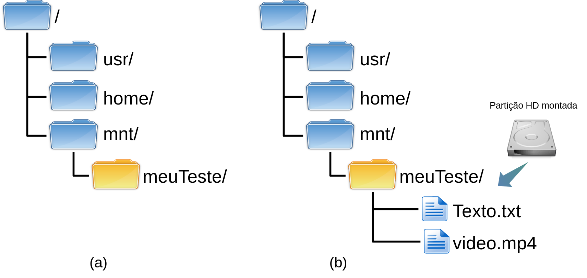

# Introdução

# Containers 

## Verificando se o Docker está instalado

Para iniciar os trabalhos com o Docker, é bom primeiro verificar se o
mesmo está devidamente instalado.

Isso pode ser feito de várias formas, mas vamos fazer verificando a
versão do Docker instalado, com o seguinte comando:

``` console
$ docker --version
Docker version 27.0.3, build 7d4bcd863a
```

Caso o comando não exista, será necessário instalar o Docker em seu
sistema. Nenhuma instalação será abordada aqui neste material,
recomenda-se buscar informações a respeito de como proceder tal
instalação no sítio oficial do
[Docker](https://docs.docker.com/engine/install/), já que a instalação
pode variar de sistema para sistema.

<div style="display: flex; align-items: center; border: 1px solid black; padding: 10px; border-radius: 5px; background-color: #333333; color: white; gap: 15px;"><div style="flex-shrink: 0;"></div>
 <div>
    <p>No caso do Linux veja como instalar em <a
href="https://docs.docker.com/desktop/install/linux-install/"
class="uri">https://docs.docker.com/desktop/install/linux-install/</a>.</p></div></div>

Além do comando `docker --version`, é comum executar os comandos:

-   `docker version`, que apresenta mais informações do que o comando
    que foi digitado anteriormente;
-   `docker info`, que traz mais informações ainda, informações a
    respeito do cliente, servidor, etc.

Para ver se o servidor está em execução em sistemas Linux, é possível
utilizar o comando `ps`, tal como:

``` console
$ ps ax | grep dockerd
    791 ?        Ssl    0:00 /usr/bin/dockerd -H fd:// --containerd=/run/containerd/containerd.sock
   8748 pts/0    S+     0:00 grep dockerd
```

Neste exemplo são retornados dois processos com o termo `dockerd`, sendo
esses:

-   8748, é do `grep`, utilizado para filtrar as saídas no comando `ps`
    (esse não interessa).
-   791, é o processo em execução do Docker (`/usr/bin/dockerd`), ou
    seja, era o que estávamos procurando e se ele não estivesse ai, algo
    estaria errado com a execução do Docker neste sistema.

<div style="display: flex; align-items: center; border: 1px solid black; padding: 10px; border-radius: 5px; background-color: #333333; color: white; gap: 15px;"><div style="flex-shrink: 0;"></div>
 <div>
    <p>Lembrando que os números dos processos provavelmente vão mudar em
cada sistema, já que são aleatórios.</p></div></div>

Bem, mas só executamos esses comandos para ter certeza que o Docker está
instalado - isso não é obrigatório. Agora vamos para o próximo passo,
que é realmente utilizar o Docker para fazer alguma coisa.

## Executando containers (`run`)

Vamos executar um container Docker simples para efetivamente verificar
se tudo está funcionando no Docker.

Para isso, vamos utilizar o comando `docker run`. Nesta primeira
execução será iniciada uma imagem do Ubuntu Linux, com interação de um
*shell*, para este sistema. Para tanto vamos executar o seguinte
comando:

``` console
$ docker run -i -t ubuntu /bin/bash
Unable to find image 'ubuntu:latest' locally
latest: Pulling from library/ubuntu
9c704ecd0c69: Pull complete
Digest: sha256:2e863c44b718727c860746568e1d54afd13b2fa71b160f5cd9058fc436217b30
Status: Downloaded newer image for ubuntu:latest
root@ebfc7d73bf3a:/#
```

<div style="display: flex; align-items: center; border: 1px solid black; padding: 10px; border-radius: 5px; background-color: #333333; color: white; gap: 15px;"><div style="flex-shrink: 0;"></div>
    <div>
    <p>Pode ser necessário utilizar o comando <code>sudo</code> para
executar o <code>docker</code>. Como exemplo, o comando anterior ficaria
<code>sudo docker run -i -t ubuntu /bin/bash</code>.</p></div></div>

O comando anterior, bem como sua saída, apresentam várias "coisas"
interessantes do Docker. Assim, vamos dissecar primeiro o comando
executado (docker run -i -t ubuntu /bin/bash), vendo as seguintes opções
e parâmetros:

-   `-i`, mantém a saída padrão (STDIN) do container no console do
    hospedeiro, ou seja, todas as saídas geradas pelo container serão
    apresentadas na tela na qual o comando foi digitado;
-   `-t`, informa para o Docker associar um console virtual
    (*pseudo-tty*) para o container criado. Isso vai permitir interagir
    como container, através da execução de comandos;
-   `ubuntu`, é o nome da imagem utilizada para criar o container.
    Outras imagens poderiam ser utilizadas, essas podem estar disponível
    localmente ou na Internet, por exemplo no [Docker
    Hub](https://hub.docker.com/). Depois, no Capítulo 3, vamos ver
    melhor como listar e utilizar essas imagens.
-   `/bin/bash`, esse é o comando a ser executado no container que está
    sendo criado. Mais especificamente, neste exemplo, estamos pedindo
    para o container executar o `bash`, que é normalmente o *shell*
    padrão de ambientes Linux. Neste caso, como esperamos interagir com
    o container, via comandos (dadas as opções `-i` e `-t`), vamos fazer
    isso via console. Ou seja, isso vai permitir interagir com o
    container através de um console texto, no qual será possível digitar
    comandos no container.

### Interagindo com o `bash` do container

Bem, com o resultado do comando anterior, estamos dentro de um
container, pronto para interagir com ele através do *prompt* de comando.

<div style="display: flex; align-items: center; border: 1px solid black; padding: 10px; border-radius: 5px; background-color: #333333; color: white; gap: 15px;"><div style="flex-shrink: 0;"></div>
    <div>
    <p>Os comandos apresentados a seguir podem variar de container para
container dependendo da distribuição e da versão da mesma, bem como das
configurações já realizadas em um container pré-configurado. Tais
comandos são do Linux e não do Docker.</p></div></div>

Então vamos por exemplo executar alguns comandos Linux neste container.

#### Verificando o nome do container:

Podemos utilizar o comando `hostname` do Linux, para ver o nome do
*host*/container.

``` console
root@ebfc7d73bf3a:/# hostname
ebfc7d73bf3a
```

A saída anterior, mostra que o nome do *host* é ebfc7d73bf3a.

<div style="display: flex; align-items: center; border: 1px solid black; padding: 10px; border-radius: 5px; background-color: #333333; color: white; gap: 15px;"><div style="flex-shrink: 0;"></div>
    <div>
    <p>Neste exemplo o nome ebfc7d73bf3a é o ID do container, ou seja, é um
valor que identifica o container de forma única dentro do Docker.</p></div></div>

#### Verificando detalhes de redes do container:

Atualmente, para verificar as configurações de rede do Linux é comum
utilizar o comando `ip`. Todavia se tentarmos utilizar o comando `ip`
neste container, o resultado será o seguinte:

``` console
root@ebfc7d73bf3a:/# ip
bash: ip: command not found
```

Ou seja, o comando `ip` não está instalado por padrão neste container,
mas é possível instalar pacotes neste container, conforme é abordado a
seguir.

<div style="display: flex; align-items: center; border: 1px solid black; padding: 10px; border-radius: 5px; background-color: #333333; color: white; gap: 15px;"><div style="flex-shrink: 0;"></div>
 <div>
    <p>Neste caso, seria possível ver o IP do container sem instalar o
comando <code>ip</code>, isso pode ser feito com o comando
<code>hostname -I</code>.</p></div></div>

#### Atualizando o Ubuntu do container:

Para atualizar o Ubuntu do container basta fazer um `atp update`, tal
como seria em um computador normal (sem container):

``` console
root@ebfc7d73bf3a:/# apt update
Get:1 http://archive.ubuntu.com/ubuntu noble InRelease [256 kB]
...
Reading state information... Done
2 packages can be upgraded. Run 'apt list --upgradable' to see them.
```

#### Instalando pacotes do Ubuntu do container:

Agora com o `apt` atualizado, é possível instalar o comando `ip`, no
caso ele é disponibilizado através do pacotes `iproute2`, então vamos
instalar esse:

``` console
root@ebfc7d73bf3a:/# apt install iproute2
Reading package lists... Done
...
Do you want to continue? [Y/n]
Get:1 http://archive.ubuntu.com/ubuntu noble/main amd64 libelf1t64 amd64 0.190-1.1build4 [57.6 kB]
...
Processing triggers for libc-bin (2.39-0ubuntu8.2) ...
```

A saída anterior mostra que o `iproute2` foi instalado com sucesso.

<div style="display: flex; align-items: center; border: 1px solid black; padding: 10px; border-radius: 5px; background-color: #333333; color: white; gap: 15px;"><div style="flex-shrink: 0;"></div>
 <div>
    <p>Se o container não for derivado do Debian, como é o caso do Ubuntu,
pode ser que o comando <code>apt</code> não exista, ai será necessário
utilizar outras formas para instalar pacotes - isso pode variar de
distribuição para distribuição.</p></div></div>

#### Verificando as configurações de rede com o comando `ip`:

Com o pacote `iproute2` instalado, agora é possível utilizar o comando
`ip`, tal como:

``` console
root@ebfc7d73bf3a:/# ip a
1: lo: <LOOPBACK,UP,LOWER_UP> mtu 65536 qdisc noqueue state UNKNOWN group default qlen 1000
    link/loopback 00:00:00:00:00:00 brd 00:00:00:00:00:00
    inet 127.0.0.1/8 scope host lo
       valid_lft forever preferred_lft forever
    inet6 ::1/128 scope host
       valid_lft forever preferred_lft forever
6: eth0@if7: <BROADCAST,MULTICAST,UP,LOWER_UP> mtu 1500 qdisc noqueue state UP group default
    link/ether 02:42:ac:11:00:02 brd ff:ff:ff:ff:ff:ff link-netnsid 0
    inet 172.17.0.2/16 brd 172.17.255.255 scope global eth0
       valid_lft forever preferred_lft forever
```

A saída anterior, mostra que no container existem as seguintes
interfaces de rede:

-   `lo`, com o IP 127.0.0.1/8;
-   `eth0`, com o IP 172.17.0.2/16.

Daria para explorar mais informações, tal como a rota padrão através do
comando `ip route`.

#### Verificando os processos em execução no container:

Para verificar os processos em execução no container, podemos utilizar o
comando `ps`, tal como:

``` console
root@ebfc7d73bf3a:/# ps ax
    PID TTY      STAT   TIME COMMAND
      1 pts/0    Ss     0:00 /bin/bash
    339 pts/0    R+     0:00 ps ax
```

A saída do comando anterior mostra que há dois processos no container em
questão. Sendo esses representados pelos seguintes PIDs:

-   `1`, para o processo `bash`, que é o *shell* que pedimos para
    executar no comando que criou o container;
-   `339`, para o processo `ps`, que é o último comando que foi
    executado.

Daria para ficar interagindo com o container, tal como em um sistema
normal, mas vamos parar por aqui.

### Saindo do console do container (`exit`)

Para sair do console do container, basta digitar `exit`, tal como:

``` console
root@ebfc7d73bf3a:/# exit
exit
$
```

Conforme a saída do comando anterior, veja que saímos do container
`ebfc7d73bf3a`, no qual estávamos com o usuário `root`, e no exemplo,
voltamos para o *host* `fielDell`, com o usuário `luiz`.

Bem, mas o que aconteceu com o container que estava em execução? A
resposta é: ele parou de ser executado! Isso acontece, pois o Docker
iniciou o container para executar o comando `/bin/bash`, e quando
digitamos `exit`, o comando `/bin/bash` para de ser executado e assim o
container inteiro para.

## Listando containers

Uma tarefa extremamente comum é listar os containers que estão em
execução, bem como os que estão parados. Veja como fazer isso a seguir.

### Listar containers parados (`ps -a`)

Para ver os containers parados, execute o comando `docker ps -a`:

``` console
$ docker ps -a
CONTAINER ID   IMAGE                               COMMAND                  CREATED             STATUS                        PORTS     NAMES
ebfc7d73bf3a   ubuntu                              "/bin/bash"              About an hour ago   Exited (0) 47 minutes ago               strange_jang
06d326091537   luizarthur/cyberinfra:hostDeb11     "/gns3/init.sh bash"     6 weeks ago         Exited (137) 6 weeks ago                admiring_burnell
```

<div style="display: flex; align-items: center; border: 1px solid black; padding: 10px; border-radius: 5px; background-color: #333333; color: white; gap: 15px;"><div style="flex-shrink: 0;"></div>
 <div>
    <p>A saída infelizmente pode extrapolar o tamanho da página, e por isso
as colunas ficam em posições ruins de mostrar o resultado - isso também
pode acontecer em um terminal de computador.</p></div></div>

No exemplo da saída anterior temos dois containers parados, sendo esses:

-   `ebfc7d73bf3a`, que tem o nome `strange_jang`, derivado de uma
    imagem chamada `ubuntu`, sendo esse o container deste exemplo.
-   `06d326091537`, com o nome `admiring_burnell`, criado da imagem
    `luizarthur/cyberinfra:hostDeb11`.

Note ainda na saída anterior, que dá para ver os comandos de iniciação
desses containers (`COMMAND`), bem como algumas informações de tempo
(`CREATED`), estado do container (`STATUS`), etc.

A princípio o nome do container é gerado automaticamente, mas é possível
informar um nome para o container utilizando a opção `--name`. Os nomes
devem ser únicos. Assim, na hora de criar o container, informe o nome
deste container, tal como:

``` console
$ docker run --name meuContainer -i -t ubuntu /bin/bash
```

No exemplo anterior seria criado um container chamado `meuContainer`.

### Listar containers em execução (`ps`)

Para listar containers em execução, basta executar o comando
`docker ps`, ou seja, é apenas tirar o `-a` do comando anterior. Veja o
exemplo:

``` console
$ docker ps
CONTAINER ID   IMAGE     COMMAND   CREATED   STATUS    PORTS     NAMES
```

No exemplo da saída anterior, não há nenhum container em execução.

<div style="display: flex; align-items: center; border: 1px solid black; padding: 10px; border-radius: 5px; background-color: #333333; color: white; gap: 15px;"><div style="flex-shrink: 0;"></div>
    <div>
    <p>Note que o comando <code>ps</code> dentro de sistemas Unix-Like,
apresentam os processos em execução. Já o <code>ps</code> passado como
parâmetro para o comando <code>docker</code>, apresenta containers em
execução ou parados. Ou seja, eles não são equivalentes.</p></div></div>

Para listagens, há duas opções úteis:

-   `-n` seguida de um número inteiro, mostrará os últimos *x*
    containers (não importa o estado do container - em execução ou
    parado), sendo que *x* é o número digitado na frente de `-n`;
-   `-l`, mostrará apenas o último container (não importa o estado).

As opções `-n` e `-l` são importantes, pois podem haver vários
containers na lista retornada pelo comando `ps`. Assim tais opções vão
filtrar e mostrar os mais recentes, que normalmente são os que estamos
trabalhando no momento.

## Iniciando containers parados (`start`)

É possível iniciar um container que está parado, isso é feito com o
comando `docker start` seguido do ID do container ou nome.

Então vamos iniciar o container que criamos anteriormente, através de
seu ID (visto na listagem dos containers parados):

``` console
$ docker start ebfc7d73bf3a
ebfc7d73bf3a
```

Feito isso, agora se listarmos os containers em execução, teremos o
seguinte resultado:

``` console
$ docker ps
CONTAINER ID   IMAGE     COMMAND       CREATED       STATUS         PORTS     NAMES
ebfc7d73bf3a   ubuntu    "/bin/bash"   2 hours ago   Up 3 seconds             strange_jang
```

Ou seja, o container ebfc7d73bf3a, saiu de parado para em execução
(`Up`).

## Acessando containers em execução (`attach`)

Bem, mas e agora? Como interagir com o console deste container que
acabamos de ligar novamente, no exemplo anterior? Para isso é possível
utilizar a opção `attach`, tal como:

``` console
$ docker attach ebfc7d73bf3a
root@ebfc7d73bf3a:/#
```

Assim estamos novamente no console do container que voltou à execução
pela opção `start`.

<div style="display: flex; align-items: center; border: 1px solid black; padding: 10px; border-radius: 5px; background-color: #333333; color: white; gap: 15px;"><div style="flex-shrink: 0;"></div>
 <div>
    <p>Atenção, para sair de um console de um container, sem parar o
processo, é possível pressionando as teclas <code>Ctrl+p</code> seguido
de <code>Ctrl+q</code>. Então, pressione a tecla <code>ctrl</code> e a
tecla <code>p</code>. Depois, sem soltar o <code>ctrl</code>, solte o
<code>p</code> e pressione <code>q</code>.</p></div></div>

## Parando containers em execução (`stop`)

Para parar um container que está em execução podemos utilizar a opção
`stop`. Então, normalmente você vai listar os containers em execução com
o comando `docker ps`, vai pegar o ID ou nome deste e executar o comando
`docker`, com a opção `stop`, tal como:

-   Verificando os containers em execução:

``` console
$ docker ps
CONTAINER ID   IMAGE     COMMAND       CREATED       STATUS         PORTS     NAMES
ebfc7d73bf3a   ubuntu    "/bin/bash"   2 hours ago   Up 3 seconds             strange_jang
```

Neste caso vamos utilizar ID ebfc7d73bf3a.

-   Parando o container:

``` console
$ docker stop ebfc7d73bf3a
ebfc7d73bf3a
```

-   Verificando se realmente o container parou:

``` console
$ docker ps
CONTAINER ID   IMAGE     COMMAND   CREATED   STATUS    PORTS     NAMES
```

Como observa-se na última saída, o container `ebfc7d73bf3a` não está
mais em execução. É claro que os passos de verificação apresentados
aqui, não são obrigatórios, mas é comum executá-los no dia a dia, para
ter certeza do que estamos fazendo.

A opção `stop` do Docker, envia um sinal SIGTERM para o container.
Todavia é possível enviar o sinal SIGKILL, com a opção **`kill`**.

Desta forma, com o `stop`, o container é fechado de forma elegante,
encerrando o processo corretamente. Já com o `kill`, o processo do
container é fechado abruptamente, por exemplo, sem salvar conteúdos em
disco - se for o caso. Então, o `kill` só deve ser utilizado em casos
extremos, nos quais o container pode comprometer a integridade do
sistema como um todo, ou por estar travado (não responde de forma
alguma).

<div style="display: flex; align-items: center; border: 1px solid black; padding: 10px; border-radius: 5px; background-color: #333333; color: white; gap: 15px;"><div style="flex-shrink: 0;"></div>
 <div>
    <p>As opções <code>stop</code> e <code>kill</code> do Docker fazem mais
sentido para containers que rodam processos em plano de fundo, no estilo
<em>daemon</em> (veremos esse a seguir). Se o container for executado de
forma interativa, utilizando por exemplo o <code>/bin/bash</code>, é
possível pará-lo com o <code>exit</code>, via console.</p></div></div>

## Criando containers no estilo *daemon* (`-d`)

Da forma que utilizamos container até o momento, eles ficam bastante
parecidos com VMs completas, utilizados no VirtualBox ou VMWare.
Entretanto, na prática, não se espera que os containers funcionem assim,
de forma interativa - mesmo que eles possam ser utilizados desta forma.

Atualmente, esperá-se que os containers executem pequenas partes de um
serviço maior, no estilo microsserviço. Por exemplo, um container pode
executar um servidor de banco de dados, outro executa um serviço Web,
tal como JavaScript, outro PHP e assim por diante. Lembre-se que o
Docker, ao contrário das VMs completas, compartilham recursos do
computador hospedeiro, então os containers não consomem recursos em
demasia se comparados às VMs completas e por isso, são uma boa opção
para segmentar serviços, isolando ambientes diferentes e assim
fornecendo mais segurança, escalabilidade, etc.

Dito isso, é comum executar containers sem interagir diretamente com
eles. Desta forma, o administrador basicamente vai configurar qual
serviço ou serviços o container deve executar quando for iniciado, e
depois, só vai interagir com os serviços providos pelo container - não
vai ficar interagindo com o container via *shell*. Então, normalmente
será necessário "daemonizar" os serviços que o container vai executar,
ou seja, é necessário deixar os processos executados pelo container
rodando em plano de fundo (*backgroud*), já que simplesmente não haverá
uma tela por padrão esperando a interação do usuário. Em outras
palavras, a ideia é colocar serviço/processo, bem como o container como
*daemon*.

<div style="display: flex; align-items: center; border: 1px solid black; padding: 10px; border-radius: 5px; background-color: #333333; color: white; gap: 15px;"><div style="flex-shrink: 0;"></div>
 <div>
    <p>Normalmente serviços de rede são executados em servidores como
<em>daemons</em>, tais como: HTTP, SSH, SMB, NFS, etc.</p></div></div>

Para iniciar processos em *backgroud* no Docker, utiliza-se a opção
**`-d`**. Uma curiosidade é que o `-d` significa *detach* e não
*daemon*, mas ela serve para deixar o processo como se fosse um
*daemon*. Desta forma, com a opção *detach*, espera-se que não exista um
console acoplado para interação, tal como:

``` console
$ docker run --name cont1 -d ubuntu /bin/sh -c "while true; do echo Olá mundo; date; sleep 10; done"
7b4b0a3be0b58fdfa7f8e0e4674bc38a400c564ec969a853ae6ee0add9796010
```

No comando anterior, estamos basicamente informando o seguinte para o
Docker:

-   `run`: inicie o container;
-   `--name cont1`: atribuir o nome cont1 ao container;
-   `-d`: ele vai ser executado em plano de fundo (no estilo *daemon*);
-   `ubuntu`: utiliza a imagem do Ubuntu;
-   `/bin/sh`: vai executar um *script*.

Em resumo, iniciamos um container para executar um *shell script* que
fica apresentando na saída do container o seguinte: texto "Olá mundo",
seguido da data/hora do container, repedindo isso a cada 10 segundos.
Tudo isso foi feito através dos comandos que estão na frente de
`/bin/sh -c`.

<div style="display: flex; align-items: center; border: 1px solid black; padding: 10px; border-radius: 5px; background-color: #333333; color: white; gap: 15px;"><div style="flex-shrink: 0;"></div>
 <div>
    <p>Note que o comando passado para esse container é o
<code>/bin/sh</code>, tudo que vêm após tal comando
(<code>-c "while true; do echo Olá...</code>), são opções e parâmetros
do <code>sh</code> e não do comando <code>docker</code>.</p></div></div>

Se tudo correr bem, após iniciar o container utilizando a opção `-d`,
não haverá nenhuma saída do container na tela do computador hospedeiro.
Desta forma, para ver o status do container é possível utilizar o `ps`,
tal como:

``` console
$ docker ps
CONTAINER ID   IMAGE     COMMAND                  CREATED         STATUS         PORTS     NAMES
7b4b0a3be0b5   ubuntu    "/bin/sh -c 'while t…"   9 seconds ago   Up 9 seconds             cont1
```

O comando anterior, mostra pelo status, que o container está em
execução, à 9 segundos (`Up 9 seconds`). Todavia, o status não mostra o
que está acontecendo dentro do container, para ter mais detalhes vamos
ver o comando `logs` na seção a seguir.

## Verificando as saídas dos containers (`logs`)

Com o container sendo executado tal como um *daemon*, ou seja, em plano
de fundo, o resultado da execução do container não aparecerá por padrão
na tela do hospedeiro.

Todavia, é possível utilizar o comando `docker logs` para ver a saída de
containers Docker que estão sendo executados como *daemons*.

<div style="display: flex; align-items: center; border: 1px solid black; padding: 10px; border-radius: 5px; background-color: #333333; color: white; gap: 15px;"><div style="flex-shrink: 0;"></div>
    <div>
    <p>O <code>docker logs</code> apenas apresenta a saída do container, ele
não permite a interação com o mesmo (ex. digitar comandos no
container).</p></div></div>

Desta forma, para ver o que está acontecendo no terminal do container do
exemplo anterior, que está em *background*, podemos executar o seguinte
comando:

``` console
$ docker logs cont1
Olá mundo
Tue Jul 16 18:56:51 UTC 2024
Olá mundo
Tue Jul 16 18:57:01 UTC 2024
Olá mundo
Tue Jul 16 18:57:11 UTC 2024
Olá mundo
Tue Jul 16 18:57:21 UTC 2024
Olá mundo
Tue Jul 16 18:57:31 UTC 2024
Olá mundo
Tue Jul 16 18:57:41 UTC 2024
```

A saída anterior mostra que o *script* executado no container do exemplo
anterior, está funcionando corretamente, pois está apresentando na tela
o texto "Olá mundo", seguido da data/hora do container, a cada 10
segundos, tal como programado no *script*.

O comando `docker logs`, sem nenhuma opção, vai apresentar uma prévia da
saída do container e parar. Caso seja necessário monitorar as saídas do
container de forma continua, dá para utilizar a opção **`-f`**. Desta
forma, as saídas do container ficam aparecendo na tela do hospedeiro,
até o administrador pressionar `Ctrl+c`, para sair. Então para ter esse
resultado o comando anterior ficaria da seguinte forma:

``` console
$ docker logs -f cont1
Olá mundo
Tue Jul 16 18:56:51 UTC 2024
Olá mundo
Tue Jul 16 18:57:01 UTC 2024
Olá mundo
Tue Jul 16 18:57:11 UTC 2024
...
```

O comando `docker logs -f` é muito utilizado no dia a dia, pois permite
o monitoramento continuo do container que está sendo executado no estilo
*daemon*.

<div style="display: flex; align-items: center; border: 1px solid black; padding: 10px; border-radius: 5px; background-color: #333333; color: white; gap: 15px;"><div style="flex-shrink: 0;"></div>
 <div>
    <p>A opção <code>docker logs -f</code> é similar ao comando
<code>tail -f</code>, utilizada para monitorar arquivos de <em>log</em>
de sistemas Unix-Like. Lembre que é utilizado o <code>Ctrl+c</code> para
sair desses comandos.</p></div></div>

## Reiniciando automaticamente containers (`--restart`)

Os containers podem parar de funcionar por causa de algum erro
inesperado e se ele tiver sendo executado em plano de fundo, você
provavelmente não verá tal problema.

Então é possível iniciar o container informando, por exemplo, que se
algo der errado, ele deve se auto reiniciar e isso é feito com a opção
**`--restart`**. Desta forma, caso o programa executado pelo container
termine normalmente ou termine devido à algum erro, o container vai
reiniciar sozinho.

<div style="display: flex; align-items: center; border: 1px solid black; padding: 10px; border-radius: 5px; background-color: #333333; color: white; gap: 15px;"><div style="flex-shrink: 0;"></div>
    <div>
    <p>É importante perceber que o container sai do status de “em execução”
para “parado”, devido à basicamente duas situações:</p>
<ul>
<li>O programa que ele executa simplesmente terminou normalmente;</li>
<li>Houve algum erro com o programa e por isso ele foi abortado.</li>
</ul></div></div>

Exitem algumas opções para o reinicio automático para containers Docker,
sendo as mais comuns:

-   `always`: com esta opção, o container sempre será reinicializado,
    não importa o motivo (terminou normalmente ou por erro). Mesmo se o
    computador hospedeiro for reinicializado, o Docker vai iniciar
    novamente o container.
-   `unless-stopped`: similar ao `always`, mas neste caso o container
    não é reinicializado se estiver no estado de "parado" (ex. alguém
    parou o container com `docker stop`). Todavia, se o processo do
    Docker for reinicializado (ex. reinicializaram o computador
    hospedeiro), o container será religado.
-   `on-failure`: com esta opção, o container é reinicializado apenas se
    tiver um erro (`exit` diferente de zero). Nesta opção ainda dá para
    determinar o número de vezes que o container vai tentar religar,
    caso essa quantidade seja atingida ele desiste de religar.

Para exemplificar o uso dessas funções do `restart`, vamos alterar um
pouco o *script* utilizado no `cont1` (exemplo anterior). Vamos criar um
novo container chamado `cont2`, que basicamente tem o mesmo *script* do
`cont1`, só que adicionado um `exit 1`, após o "Olá mundo" e o resto
continua como era antes. O objetivo aqui é simular um erro no *script*,
já que quando o código chegar a linha do `exit 1`, ele determina que o
*script* deve ser interrompido, e é retornado um 1 para o sistema (que
representa um erro). Desta forma, o *script* nunca vai mostrar a
data/hora, tal como fazia antes, já que o `exit` é executado antes.

A seguir são apresentados exemplos de opções para o uso do `restart` com
esse novo *script* alterado:

### Opção `always`

No exemplo a seguir é utilizada a opção `always` do `restart`, de forma
que o container seja reinicializada toda vez que ele for encerrado (por
erro ou porque o programa terminou normalmente):

``` console
$ docker run --restart=always --name cont2 -d ubuntu /bin/sh -c "while true; do echo Olá mundo; exit 1; date; sleep 10; done"
6a17852229690344c0931d3fdcdd44775a17a79902d53bb70805b2ba43b7bd69
```

O comando anterior, mostra como utilizar a opção `--restart=always`. No
comando também determinamos que o nome do container é `cont2`, que este
deve ser executado em plano de fundo (`-d`), é criado a partir da imagem
`ubuntu`, e principalmente está com o *script* alterado, que é abortado
ao chegar no `exit`.

Assim, vamos utilizar a opção `log`, para ver a saída deste exemplo:

``` console
$ docker logs -f cont2
Olá mundo
Olá mundo
Olá mundo
Olá mundo
Olá mundo
Olá mundo
Olá mundo
```

Dada a saída anterior, observa-se que o container `cont2` apresenta o
texto "Olá mundo", várias vezes, mas nunca a data/hora do sistema. Isso
significa que o *script* é executado até o `echo Olá mundo` e é
abortado. Desta forma, sem a opção `restart` o container seria
encerrado, mas como estamos utilizando a opção `--restart=always`, o
container é reiniciado toda vez que o *script* é finalizado pelo `exit`,
esse comportamento vai se repetir indefinidamente.

### Opção `on-failure`

O exemplo a seguir mostra como é utilizada a opção `on-failure` do
`restart`. Tal opção só reinicializa o container se o processo for
finalizado com um `exit` maior que zero, ou seja, se o container for
finalizado por causa de erros do programa sendo executado. Desta forma,
se o programa terminar normalmente, o container não será reinicializado.

Para esse exemplo, foi criado um container chamado `cont3`, que fora o
nome do container, a única diferença do exemplo anterior (`cont2`) é que
foi utilizado a opção `--restart=on-failure:3`. Sendo que esse `:3`, na
frente da opção, significa que ele só será reinicializado três vezes. Se
for utilizado apenas o `--restart=on-failure`, sem nada na frente (ex.
`:3`), ele será reinicializado de forma indefinida.

``` console
$ docker run --restart=on-failure:3 --name cont3 -d ubuntu /bin/sh -c "while true; do echo Olá mundo; exit 1; date; sleep 10; done"
857022977d13473202ce0ac1988a124ff76375dfc1326ff7c5eb4f50b24949c4
```

Depois de executar o comando para criar o container chamado `cont3`,
vamos ver sua saída com o `logs`:

``` console
$ docker logs -f cont3
Olá mundo
Olá mundo
Olá mundo
Olá mundo
```

Dada a saída anterior, note que há quatro vezes o texto "Olá mundo",
então o container foi executado pela primeira vez, ai saiu com um
`exit 1`, depois isso aconteceu mais três vezes e o container foi
abortado (ficou no estado de parado).

Vamos executar os comandos para verificar o status dos containers
criados até aqui, primeiro vamos ver os containers ativos:

``` console
$ docker ps
CONTAINER ID   IMAGE     COMMAND                  CREATED              STATUS                          PORTS     NAMES
6a1785222969   ubuntu    "/bin/sh -c 'while t…"   About a minute ago   Restarting (1) 48 seconds ago             cont2
7b4b0a3be0b5   ubuntu    "/bin/sh -c 'while t…"   40 hours ago         Up 27 hours                               cont1
```

Note que estão ativos os containers `cont1` e `cont2`, ou seja, o
`cont2` está em execução, mesmo que o seu processo esteja retornando
erro em toda execução. Perceba que não há o container `cont3` na saída
anterior, então vamos ver se esse se encontra parado com o comando
`docker ps -l`, já que este foi o último container que trabalhamos:

``` console
$ docker ps -l
CONTAINER ID   IMAGE     COMMAND                  CREATED          STATUS                      PORTS     NAMES
857022977d13   ubuntu    "/bin/sh -c 'while t…"   58 seconds ago   Exited (1) 56 seconds ago             cont3
```

A saída anterior, demonstra mais uma vez que a opção
`--restart=on-failure:3` foi executada com sucesso, já que o `cont3` foi
abortado/parado, depois de algumas execuções.

<div style="display: block; align-items: center; margin: 0 auto; border: 1px solid black; padding: 10px; border-radius: 5px; background-color: #333333; color: white; gap: 15px;"><div style="flex-shrink: 0;"></div>
 <div>
    <p>No comando anterior utilizamos <code>docker ps -l</code> para ver
apenas o último container que foi abortado pelo Docker, pois como não há
outros containers sabíamos que provavelmente o <code>cont3</code> era o
último container que foi abortado.</p></div></div>

## Deletando containers (`rm`)

Como descrito até aqui, uma vez que você execute um container, ele vai
estar na lista de containers ativos ou parados, tal como pode ser visto
a seguir, com os container que trabalhamos neste material:

``` console
$ docker ps -a
CONTAINER ID   IMAGE                               COMMAND                  CREATED        STATUS                          PORTS     NAMES
857022977d13   ubuntu                              "/bin/sh -c 'while t…"   6 hours ago    Exited (1) 6 hours ago                    cont3
6a1785222969   ubuntu                              "/bin/sh -c 'while t…"   6 hours ago    Restarting (1) 55 seconds ago             cont2
7b4b0a3be0b5   ubuntu                              "/bin/sh -c 'while t…"   46 hours ago   Up 33 hours                               cont1
ebfc7d73bf3a   ubuntu                              "/bin/bash"              2 days ago     Exited (137) 47 hours ago                 strange_jang
06d326091537   luizarthur/cyberinfra:hostDeb11     "/gns3/init.sh bash"     7 weeks ago    Exited (137) 6 weeks ago                  admiring_burnell
```

Todavia, em alguns momentos vão haver containers que não vamos mais
utilizar, como por exemplo containers de testes ou defasados. Assim, é
possível remover esses containers utilizando o comando `rm` do Docker.

Por exemplo, vamos remover o container chamado `cont3`, para isso
podemos utilizar o seguinte comando:

``` console
$ docker rm cont3
cont3
```

O resultado do comando será apenas uma saída com o nome do container,
neste caso foi `cont3`. Neste exemplo anterior, utilizamos o nome do
container para removê-lo, mas é possível utilizar o ID, vamos remover o
primeiro container que criamos utilizando o ID dele, tal como:

``` console
$ docker rm ebfc7d73bf3a
ebfc7d73bf3a
```

Depois de remover o `cont3`, vamos tentar remover o `cont2`, entretanto
o resultado para essa deleção será o seguinte:

``` console
$ docker rm cont2
Error response from daemon: cannot remove container "/cont2": container is restarting: stop the container before removing or force remove
```

A saída anterior informa que o `cont2` está configurado para reiniciar,
assim é necessário primeiro pará-lo e depois removê-lo, tal como:

``` console
$ docker stop cont2
cont2
$ docker rm cont2
cont2
```

Agora que os containers foram removidos, é possível constatar tal tarefa
utilizando o comando `docker ps -a`:

``` console
$ docker ps -a
CONTAINER ID   IMAGE                               COMMAND                  CREATED        STATUS                     PORTS     NAMES
7b4b0a3be0b5   ubuntu                              "/bin/sh -c 'while t…"   47 hours ago   Up 33 hours                          cont1
06d326091537   luizarthur/cyberinfra:hostDeb11     "/gns3/init.sh bash"     7 weeks ago    Exited (137) 6 weeks ago             admiring_burnell
```

A saída anterior mostra que foram removidos: o primeiro container que
criamos; `cont2` e `cont3`, ou seja, chegamos no resultado que queríamos
para esses exemplos de remoção de containers.

Em alguns casos especiais é necessário **remover todos os containers**,
mas não há um comando específico do Docker para tal tarefa. Assim, é
possível combinar comandos, no estilo *shell script* para conseguir tal
resultado, neste caso um possível comando no Linux seria:

``` console
$ docker rm -f $(docker ps -aq)
```

No comando anterior, foram combinados os comandos `docker ps -aq`, que
gera uma lista de ID (`-q`) de containers do Docker, depois cada item
desta lista é executada pelo comando `docker rm`, é claro que esse
comando deve ser utilizado com cautela, pois apaga todos os containers
do sistema.

Também dá para iniciar um container com a opção **`--rm`**, desta forma
o container é executado uma única vez, e quando o programa que ele está
executando terminar, o container é imediatamente removido do sistema. Um
exemplo de comando utilizando o `--rm` é:

``` console
$ docker run --rm --name cont5 -d ubuntu /bin/sh -c "echo Olá mundo"
060e1626cd5e460ff6a9270da00ab350b9fbaea5d73841d5c50bfc6a5067fc09
```

Utilize o comando `docker ps -l` e você notará que o container `cont5`,
criando anteriormente, não aparecerá na listagem de containers do
sistema.

A opção `--rm` é muito útil durante a criação de containers de teste,
pois assim que o container for encerrado o mesmo será removido e não vai
ficar ocupando recursos dentro do sistema hospedeiro.

## Rótulos nos containers (`-l`)

Como uma das ideias principais de containers é utilizar vários desses,
cada um provendo determinados serviços, é natural que exista algum tipo
de recurso mínimo para ajudar à organizar os containers.

Bem, um desses recursos são os rótulos (*labels*), que servem como
metadados que podem ajudar a identificar os containers, por exemplo,
quais containers são de uma dada organização, ou quais containers estão
relacionados a um dado serviço. Então para utilizar os *labels* no
Docker basta utilizar a opção **`-l`**. Veja o exemplo a seguir:

``` console
$ docker run --rm -l teste -d ubuntu /bin/sh -c "while true; do echo Olá mundo; date; sleep 10; done"
937619dfdf891ef84a98ac94c3d60d1edae2cd0cc596ba8459b2afeaaa815d8b

$ docker run --rm -l teste -d ubuntu /bin/sh -c "while true; do echo Olá mundo; date; sleep 10; done"
```

Anteriormente são criados dois containers, esses basicamente executam o
primeiro *script* que utilizamos de exemplo, não foram passados nomes
para esses, utilizam a opção `--rm` para serem removidos quando forem
desligados e principalmente para estes exemplo, utilizam uma *label*
chamada "teste" (`-l teste`).

Desta forma, agora é possível utilizar tal *label* para localizar os
containers, tal como:

``` container
$ docker ps -a -f label=teste
CONTAINER ID   IMAGE     COMMAND                  CREATED              STATUS              PORTS     NAMES
496d3dc5d3dd   ubuntu    "/bin/sh -c 'while t…"   57 seconds ago       Up 56 seconds                 cranky_hodgkin
937619dfdf89   ubuntu    "/bin/sh -c 'while t…"   About a minute ago   Up About a minute             goofy_agnesi
```

Graças a esse rótulo, também é possível criar comandos mais complexos,
tal como desligar todas os containers que tenham a *label* "teste". O
comando a seguir realiza essa tarefa:

``` console
$ docker stop $(docker ps -q --filter "label=teste")
496d3dc5d3dd
937619dfdf89
```

Como foi utilizada a opção `--rm`, esses container também foram
removidos da lista de containers do sistema.

<div style="display: flex; align-items: center; border: 1px solid black; padding: 10px; border-radius: 5px; background-color: #333333; color: white; gap: 15px;"><div style="flex-shrink: 0;"></div>
 <div>
    <p>É comum utilizar <em>labels</em> com mais de uma palavra separada por
<code>=</code>, tal como <code>desenvolvimento=maria</code>.</p></div></div>

## Criando Containers (`create`)

Para criar um container é possível utilizar o comando `run`, tal como já
fizemos no início deste capítulo, ou utilizar o comando `create`.

A grande diferença é que o `create` só cria o container e não coloca ele
em execução. Então, após criar tal container é bem provável que o
administrador execute o comando `start`. Desta forma, ao executar o
comando `run`, ele internamente está executando um `create` seguido do
`start`.

O comando a seguir é um exemplo do uso do comando `create` para criar um
container chamado `cont6`:

``` console
$ docker create --name cont6 ubuntu /bin/sh -c "while true; do echo Olá mundo; date; sleep 10; done"
```

Após executar o comando anterior, o status do container será de criado
(`Created`), veja:

``` console
$ docker ps -l
CONTAINER ID   IMAGE     COMMAND                  CREATED          STATUS    PORTS     NAMES
931b22bca56f   ubuntu    "/bin/sh -c 'while t…"   10 seconds ago   Created             cont6
```

Todavia, o container do exemplo anterior, foi criado mas não está em
execução, ou seja, está parado. Assim, para mudar o seu estado para em
execução, é necessário executar um `start`, tal como:

``` console
$ docker start cont6
cont6
```

Desta forma o container irá para o estado de "executando" (`Up`), tal
como apresentado na saída a seguir do comando `docker ps -l`, deste
exemplo:

``` console
$ docker ps -l
CONTAINER ID   IMAGE     COMMAND                  CREATED         STATUS         PORTS     NAMES
931b22bca56f   ubuntu    "/bin/sh -c 'while t…"   2 minutes ago   Up 5 seconds             cont6
```

É possível utilizar o `create` e `start` do Docker para criar
containers, entretanto se for para criar o container e imediatamente
colocá-lo em execução, é mais fácil/prático utilizar o comando `run`.

<div style="display: flex; align-items: center; border: 1px solid black; padding: 10px; border-radius: 5px; background-color: #333333; color: white; gap: 15px;"><div style="flex-shrink: 0;"></div>
 <div>
    <p>Após criar um container com o comando <code>create</code> do Docker,
não é possível utilizar o comando <code>run</code>, para executar um
container com o mesmo nome do container criado. Neste caso, será
reportado um erro dizendo que o container já existe.</p></div></div>

## Informações dos containers (`inspect`)

Comando `inspect` do Docker, permite verificar a configuração completa
do container. O `inspect`, mostrará as mais diversas informações do
container, tal como: nome, configurações de rede, armazenamento, estado,
imagem, comando, etc. Isso pode ser muito útil, por exemplo, para a
depuração de erros, identificação ou criação de containers similares.

Para inspecionar um container utilizando o `inspect` é necessário apenas
executar `docker inspect` seguido do nome ou ID do container, tal como:

``` console
$ docker inspect cont6
[
    {
        "Id": "931b22bca56f04add7b383e12a862cd3cd9ef1c582cb8136e5b5afb0a8f4b935",
        "Created": "2024-07-19T14:56:22.519662813Z",
        "Path": "/bin/sh",
        "Args": [
            "-c",
            "while true; do echo Olá mundo; date; sleep 10; done"
        ],
        "State": {
            "Status": "running",
            "Running": true,
            "Paused": false,
            "Restarting": false,
            ...
        },
        "Image": "sha256:35a88802559dd2077e584394471ddaa1a2c5bfd16893b829ea57619301eb3908",
        "ResolvConfPath": "/var/lib/docker/containers/931b22bca56f04add7b383e12a862cd3cd9ef1c582cb8136e5b5afb0a8f4b935/resolv.conf",
        "HostnamePath": "/var/lib/docker/containers/931b22bca56f04add7b383e12a862cd3cd9ef1c582cb8136e5b5afb0a8f4b935/hostname",
        ...
        "Name": "/cont6",
        "RestartCount": 0,
        "Driver": "overlay2",
        "Platform": "linux",
        ...
            "NetworkMode": "bridge",
            "PortBindings": {},
           ...
        "Config": {
            "Hostname": "931b22bca56f",
            "Domainname": "",
            "User": "",
            "AttachStdin": false,
            "AttachStdout": true,
            "AttachStderr": true,
            "Tty": false,
            "OpenStdin": false,
            "StdinOnce": false,
            "Env": [
                "PATH=/usr/local/sbin:/usr/local/bin:/usr/sbin:/usr/bin:/sbin:/bin"
            ],
            "Cmd": [
                "/bin/sh",
                "-c",
                "while true; do echo Olá mundo; date; sleep 10; done"
            ],
            "Image": "ubuntu",
            "Volumes": null,
            "WorkingDir": "",
            "Entrypoint": null,
            "OnBuild": null,
            "Labels": {
                "org.opencontainers.image.ref.name": "ubuntu",
                "org.opencontainers.image.version": "24.04"
            }
        },
        "NetworkSettings": {
            "Bridge": "",
            ...
            "Gateway": "172.17.0.1",
            "GlobalIPv6Address": "",
            "GlobalIPv6PrefixLen": 0,
            "IPAddress": "172.17.0.4",
            "IPPrefixLen": 16,
            "IPv6Gateway": "",
            "MacAddress": "02:42:ac:11:00:04",
            ...
            }
        }
    }
]
```

Como é possível ver na saída anterior, que inclusive teve partes
omitidas, o `inspect` traz muitas informações a respeito do container.
Neste exemplo, verificamos as informações do `cont6`, que foi criando na
seção anterior. Por exemplo, no final da saída, é possível ver muitas
configurações de rede do container, tais como: IP, *gateway* padrão,
endereço MAC, etc.

Todas as informações do `inspect` são apresentadas no formato JSON, o
que facilita a automação de extração dessas informações, inclusive
utilizando-se *scripts*. Na verdade o próprio Docker fornece meios para
filtrar as informações que podem ser obtidas do `inspect` (a quantidade
de informações pode atrapalhar a visão e análise em determinadas
tarefas). Por exemplo, para obter o endereço IP do container, é possível
executar o seguinte comando:

``` console
$ docker inspect --format '{{.NetworkSettings.IPAddress}}' cont6
172.17.0.4
```

Isso mostra que o `cont6` tem o IP 172.17.0.4. Com o comando anterior,
note que foi utilizado `docker inspect`, com a opção `--format`, seguido
da estrutura JSON que armazena a informação que estamos querendo, e no
final o nome ou ID do container. Para encontrar essa estrutura você deve
dar realizar o `inspect` e analisar a hierarquia do JSON, no exemplo
anterior o `IPAddress` está sob `NetworkSettings`, assim ficou
`.NetworkSettings.IPAddress`.

Vamos obter do container `cont6` qual é o comando que ele está
executando, tal informação está em `Path` (ver primeira saída que
geramos do `inspect`). Assim a busca por tal informação seria o seguinte
comando:

``` console
$ docker inspect --format '{{.Path}}' cont6
/bin/sh
```

Repare na saída do `inspect` apresentada no início da seção, que
basicamente a mesma informação a respeito do comando executado, também
está em `Cmd`, que está dentro de `Config`, ai a busca seria com o
seguinte comando:

``` console
$ docker inspect --format '{{.Config.Cmd}}' cont6
[/bin/sh -c while true; do echo Olá mundo; date; sleep 10; done]
```

Também é possível pedir para o `inspect` retornar mais de uma informação
na consulta, bem como fazer isso para mais de um container, tal como:

``` console
$ docker inspect --format '{{.Name}} {{.State.Status}} {{.Config.Image}}' cont1 cont4
/cont1 exited ubuntu
/cont4 exited ubuntu
```

Na saída anterior, o `inspect` foi instruído para buscar nos containers
`cont1` e `cont4`, as seguintes informações:

-   Nome do container (`{{.Name}}`);
-   Estado (`{{.State.Status}}`);
-   Imagem que está sendo utilizada (`{{.Config.Image}}`).

Novamente, este tipo de busca por informações específicas a respeito de
containers, pode ser extremamente útil no dia a dia do administrador de
sistemas, em processos como a criação de telas que mostram o status dos
sistemas para identificação de falhas, etc. Então, entender o `inspect`
e como utilizar seus filtros é muito importante, principalmente em
ambientes com diversos containers.

## Conclusão do Capítulo

Neste capítulo foram apresentados os comandos básicos para a criação e
gerenciamento de containers Docker. Então, este capítulo abordou como
realizar tarefas simples, como: criar containers, listar,
parar/executar, remover, inspecionar, etc. Lembrando que apesar dessas
tarefas serem rotineiras, conhecer bem como realizá-las é fundamental
para o bom funcionamento do sistema.

Todavia ainda não aprendemos como trabalhar com as imagens Dockers, que
são a base para a criação dos containers, isso será feito no Capítulo 3.
Depois disso o Capítulo **¿sec:confAvancadas?**, abordará configurações
e gerenciamento de containers para tarefas mais avançadas.

# Imagens 

No capítulo anterior, foi apresentado o conceito de container, que é
onde os aplicativos/serviços que estão sendo providos via Docker
efetivamente são executados. Todavia, já no Capítulo 2 foi citado que o
container é criado utilizando-se imagens. Por exemplo, no comando:
"`docker run -i -t ubuntu /bin/bash`", o parâmetro "`ubuntu`" representa
a imagem que serve de base para a criação do container Docker. Assim,
neste capítulo, vamos entender o que é uma imagem, como ela é utilizada
pelo container, quais são as vantagens do uso das imagens Docker, bem
como criar e gerenciar imagens Docker.

Em resumo, uma imagem Docker, nada mais é do que uma camada de sistema
de arquivos, que pode ser empilhada uma sobre a outra. Ou seja,
inicialmente podemos pensar na imagem Docker, como sendo o sistema de
arquivos que utilizaremos dentro do container Docker, tal como uma
imagem ou HD virtual de VM completa (ex. VM do VirtualBox ou VMWare).
Entretanto, é preciso ter em mente que há uma grande diferença entre uma
imagem Docker e uma imagem de VM completa.

Por exemplo, imagine que criamos uma VM completa, utilizando VirtualBox,
nesta VM instalamos o Arch Linux para ser o SO (Sistema Operacional),
vamos chamar essa VM de VM0, e tal VM servirá de base para a criação de
duas outras VMs. Desta forma, clonamos duas vezes a VM0 e criamos agora
a VM1 e VM2 (ver Figura 1). Sendo que, na VM1 instalaremos o MariaDB
para ser nosso banco de dados. Já na VM2, instalaremos o HTTP Apache.

Neste exemplo anterior, utilizando virtualização completa (*full
virtualization*), perceba que agora temos três VMs e cada uma tem um HD
virtual independente, no qual está instalado o sistema de arquivo, que é
a base do Arch Linux. Tais HDs virtuais, na verdade, são arquivos do
computador hospedeiro, esses arquivos normalmente têm alguns *gigabytes*
de tamanho. Continuando o exemplo, vamos supor que o HD da VM0 tem 5GB,
ai clonamos ele para criar a VM1 que por ser um clone da VM0 já tem 5GB,
somado a mais 5GB do MariaDB, o que totaliza um uso de 10GB do HD
virtual. Já para VM2, temos os 5GB iniciais do Arch (que já veio de
"herança") e vamos imaginar que foram instalados e armazenados mais uns
3GB de dados, então teremos o HD virtual da VM2 com 8GB. Assim sendo,
neste exemplo temos três HDs virtuais com 5GB, 10GB e 8GB, o que
totaliza 23GB que são consumidos por esses HDs virtuais do HD real da
máquina hospedeira, tal como ilustrado na Figura 1. Concluindo esse
exemplo, em um sistema de virtualização completa, cada VM tem um HD
completo e isolado, não importa se isso veio de uma cópia/clone de outra
VM, a nova VM será um sistema único ocupando os recursos do hospedeiro
de forma completa e exclusiva.

<div style="display: flex; align-items: center; border: 1px solid black; padding: 10px; border-radius: 5px; background-color: #333333; color: white; gap: 15px;"><div style="flex-shrink: 0;"></div>
 <div>
    <p>Os espaços citados no exemplo para :Arch Linux, MariaDB e Apache
HTTP, são meramente ilustrativos, ou seja, não correspondem ao mundo
real.</p></div></div>


Todavia, o conceito de imagem utilizada no Docker é ligeiramente
diferente do utilizado normalmente em sistemas de virtualização
completa. Desta forma, podemos até pensar nas imagens Docker como se
fossem HDs virtuais, mas é mais correto chamar de sistema de arquivos
(vamos fazer isso a partir de agora). Assim, é possível criar um sistema
de arquivos base e ir acoplando/sobrepondo outros sistemas de arquivos,
sendo que neste contexto cada sistema de arquivos vai ser uma nova
imagem e então teremos imagens sobrepostas.

Portanto, se pegarmos o mesmo exemplo anterior, só que utilizando
imagens Docker, o cenários ficaria da seguinte forma: teríamos a imagem
Arch Linux, que chamaremos de IMG0, com 5GB, que serviria de base para a
criação da IMG1 e IMG2. Tais imagens são respectivamente equivalentes à
VM0, VM1 e VM2. Então, pegamos de base a IMG0, instalamos o MariaDB e
criamos a IMG1. Da mesma forma, pegamos a IMG0 de base, instalamos o
Apache HTTP e criamos a VM2. Só que fazendo isso com imagens Docker, vai
haver uma grande diferença quando comparado ao exemplo anterior com o
VirtualBox, pois a IMG0 utiliza 5GB. Na IMG1, com a instalação do
MariaDB e dados, tal imagem consumirá apenas 5GB no total e não 10GB (do
exemplo com virtualização completa). Por fim, a IMG2 terá somente 3GB no
total (e não 8GB), tal como ilustra a Figura 2. Ou seja, todas as
imagens (IMG0, IMG1 e IMG2), consumirão da máquina hospedeira apenas
13GB de espaço em disco e não 23G, como foi feito utilizando o
VirtualBox, sendo que isso é possível graças ao conceito de UFS (Union
File System).


## Union File System - *union mount*

Para compreender como as imagens Docker funcionam é necessário entender
o conceito de UFS (Union File System), comumente chamado de *union
mount*.

Para falar de *union mount* é necessário primeiro lembrar que montar
(*mount*) em ambientes Like-Unix, significa disponibilizar em um
diretório do sistema, o conteúdo de partições de HDs, SSDs, *pendrives*,
DVDs, etc. Assim, quando se monta uma partição de um HD, por exemplo no
diretório `/mnt/meuTeste`, o conteúdo desta partição (arquivos e
diretórios) aparecerão dentro do diretório `/mnt/meuTeste`. A Figura 3-a
apresenta o diretório `/mnt/meuTeste`, sem nenhum conteúdo (diretório
vazio) antes da montagem. Já a Figura 3-b, mostra o diretório
`/mnt/meuTeste` após a montagem da partição de um HD, neste caso tal
diretório apresenta conteúdo da partição do HD, que são os arquivos
`Texto.txt` e `video.mp4`.

```{=html}
<!--

-->
```
É muito importante saber, que se já houvesse algum conteúdo dentro de
`/mnt/meuTeste`, antes da montagem, tal conteúdo ficaria oculto,
indisponível e intocável durante todo o tempo que tal diretório
permanecer montado. Desta forma, se enquanto o conteúdo da partição do
HD estiver montada em `/mnt/meuTeste` e posteriormente for montada o
conteúdo de um *pendrive* no mesmo diretório `/mnt/meuTeste`, tudo que
for feito no diretório `/mnt/meuTeste` afetará somente os arquivos do
*pendrive*, pois o conteúdo da partição do HD estará oculta e protegida
pelo processo de montagem. A Figura 3-c mostra como ficará aos olhos do
usuário o conteúdo do diretório `/mnt/meuTeste`, quando montando o
conteúdo de um *pendrive* no mesmo diretório onde já estava montada a
partição do HD. Já a Figura 3-d, apresenta que na verdade o conteúdo do
HD ainda está associado ao diretório, mas o mesmo não fica acessível
enquanto o *pendrive* permanecer montado. Todavia, quando o conteúdo da
partição do HD volta a aparecer no diretório `/mnt/meuTeste`, asim que o
*pendrive* for desmontado, como se nada houvesse acontecido.

```{=html}
<!--

-->
```
A diferença do *union mount* para o *mount* tradicional, é que o *union
mount* permite montar vários sistemas de arquivos em um ponto de
montagem (diretório), deixando o conteúdo de todos esses sistemas de
arquivos disponíveis simultaneamente. Ou seja, utilizando o *union
mount* é possível montar, o conteúdo de uma partição de HD no diretório
`/mnt/meuTeste`, mas agora se for montado o conteúdo de um *pendrive* no
mesmo diretório (`/mnt/meuTeste`), ficará visível e acessível tanto o
conteúdo da partição do HD, quanto o conteúdo do *pendrive*, desta forma
o usuário deste sistema poderia trabalhar em ambos dispositivos de
armazenamento (*pendrive* e partição do HD) simultaneamente no mesmo
diretório (o que não era possível no *mount* tradicional). A Figura 3-e,
apresenta esse comportamento do *union mount*. É importante entender
aqui, que caso exista arquivos com o mesmo *path*, por exemplo
`/texto.txt` na partição do HD e um arquivo `/texto.txt` no pendrive,
ficará acessível apenas o arquivo do dispositivo que foi montado por
último. `<!--

-->`{=html}


<div style="display: flex; align-items: center; border: 1px solid black; padding: 10px; border-radius: 5px; background-color: #333333; color: white; gap: 15px;"><div style="flex-shrink: 0;"></div>
 <div>
    <p>Para realizar um <em>union mount</em> no Linux, é possível utilizar,
por exemplo, o <code>unionfs</code>, tal como:</p>
<pre class="console"><code># unionfs -o cow teste1/=RW:teste2/=RO testeTodos/</code></pre>
<p>Neste exemplo, o conteúdo dos diretórios <code>teste1/</code> e
<code>teste2/</code> são montados dentro de <code>testeTodos/</code>,
tudo que for alterado em <code>testeTodos/</code> será gravado em
<code>teste1/</code>, que foi definido com permissão de leitura e
gravação (<code>RW</code>).</p></div></div>

O Docker suporta várias implementações do *mount union*, tais como:
AUFS, Overlay, devicemapper, BTRFS e ZFS. A implementação utilizada por
cada Docker pode ser vista com o comando `docker info`, na saída procure
por `Storage Driver`, tal como:

``` console
$ docker info | grep -i "storage driver"
 Storage Driver: overlay2
```

Na saída anterior, a máquina na qual o comando foi executado, está
utilizando o Overlay para tecnologia UFS, ou seja, para realizar *union
mount*.

Agora, sabendo como funciona o UFS ou *union mount*, podemos dizer que o
Docker utiliza tal técnica para agregar imagens e assim economizar
espaço em disco, bem como facilitar a distribuições e escalabilidade
dessas imagens, o que torna o Docker muito eficiente em comparação com
sistemas de virtualização completos (ex. VirtualBox, VMWare, etc).

Desta forma, utilizando UFS, os containers Docker normalmente têm várias
camadas de imagens, visando compor o container final de forma mais
prática e eficiente. Veja na Figura 4 como poderia ser composta as
camadas de imagens de um container, bem como a descrição dessas no texto
a seguir:

-   A primeira camada, ou seja imagem, será o sistema de arquivos de
    *boot*, conhecido como *bootfs*. De forma simplista, vamos imaginar
    que nesta imagem está apenas o *kernel* Linux;
-   A próxima camada será, por exemplo, a base de alguma distribuição
    Linux, tal como o Arch, Ubuntu, CentOS, etc;
-   Na sequência poderia ter uma camada com as ferramentas/comandos que
    o administrador acha que deve ter em todos os container, tais como:
    `vim`, `iproute2`, `tcpdump`, `htop`, etc;
-   Depois, pode vir o serviço que se espera daquela imagem, tal como o
    Apache HTTP;
-   Por fim, viria a camada na qual o container pode gravar/alterar
    arquivos/diretórios.


Levando em consideração o exemplo da Figura 4, note que a primeira
camada (Camada 1 da Figura 4) é o *kernel*, que na verdade é
compartilhado com o sistema hospedeiro. Já a Camada 2. Desta forma, o
*kernel* sempre será compartilhado do hospedeiro com todos os
containers, já a distribuição Linux pode ser qualquer uma (a gosto do
administrador). Após o *kernel* e a base da distribuição, normalmente
começam a surgir várias camadas, conforme a necessidade/estratégia do
administrador do sistema, por exemplo, caso ele queira que determinadas
ferramentas estejam em todos os containers derivados, ele pode instalar
tais ferramentas neste momento, tal como foi feito na Camada 3. Ainda
seguindo o exemplo, a próxima camada (Camada 4) contém a instalação do
Apache HTTP, então essa imagem provavelmente é de um servidor HTTP, que
poderia por exemplo, receber mais imagens, para formar servidores PHP,
JSP, JavaScript, etc. Da mesma forma, o administrador, poderia pegar a
partir da Camada 3 e adicionar uma imagem para um servidor de banco de
dados, etc. Já no topo das imagens, quando o container for iniciado, vai
ficar uma imagem com permissão de leitura e gravação, que será o espaço
no qual os arquivos criados ou alterados pelo container serão
armazenados, essa técnica chama-se CoW (*Copy-on-Write*), ver Camada 5
da Figura 4. Lembrando que aqui estamos apresentando só um exemplo de
como poderiam ser organizadas as camadas, ou seja, cada imagem de
container pode seguir uma ordem de sequência de imagem diferente.

### CoW (*Copy-on-Write*)

No conceito de ***Copy-on-Write***, todas as imagens abaixo da última,
estarão com permissão de somente leitura (RO), isso vai proteger a
imagem de alterações e garantir que a imagem é a mesma para todos que a
utilizarem. Já a última camada, tem permissão de leitura e gravação
(RW). Desta forma, arquivos novos são gravados nesta imagem, da mesma
forma, se algum arquivo das imagens a baixo forem alterados, será criado
uma cópia deste arquivo na imagem superior, que então ocultará o arquivo
da imagem original e apresentará para o sistema/usuário apenas o arquivo
alterado que agora está na imagem com permissão de leitura e gravação. O
CoW trabalha em conjunto com a técnica de *union mount*, explicada
anteriormente.

<div style="display: flex; align-items: center; border: 1px solid black; padding: 10px; border-radius: 5px; background-color: #333333; color: white; gap: 15px;"><div style="flex-shrink: 0;"></div>
    <div>
    <p>O <em>union mount</em> permite montar várias imagens de forma que
todas fiquem acessíveis simultaneamente em um mesmo ponto de montagem
(diretório), só que normalmente apenas a última imagem é que terá
permissão de gravação e escrita, já as camadas abaixo dessa terão
permissão apenas de leitura. Quando algum arquivo/diretório de uma
camada abaixo precisar ser alterado/escrito, a técnica de CoW copiará
tal arquivo alterado para a última imagem, que normalmente representa o
container. Isso garante a integridade dos arquivo para containers que
utilizam as mesmas imagens e da mesma forma permite que o container
tenha a capacidade de alterar completamente e livremente a estrutura de
arquivos e diretórios ele está trabalhando.</p></div></div>

Então containers mantém as alterações realizadas no sistema de arquivos
deles, permitindo assim salvar por exemplo configurações referentes
aquele container (ex. IP, rota padrão, usuários, etc), bem como
alterações realizadas por aquele container em arquivos que inicialmente
eram da imagem, mas que agora fazem parte daquele container. Já a imagem
utilizada para criar o container fica intocada, pois uma imagem Docker é
imutável.

Agora sabendo como funcionam as imagens Docker e quais são as técnicas
empregadas nessas imagens, vamos abordar como utilizar e configurar tais
imagens na prática.

## Listando imagens (`images`)

Para listar as imagens disponíveis no próprio *host* hospedeiro, é
possível utilizar o comando `docker images`, tal como:

``` console
$ docker images
REPOSITORY              TAG           IMAGE ID       CREATED        SIZE
ubuntu                  latest        35a88802559d   2 months ago   78MB
luizarthur/cyberinfra   routerDeb11   28b009432f01   4 months ago   391MB
luizarthur/cyberinfra   hostDeb11     da504d85c4c9   4 months ago   278MB
debian                  11            57a92962dbeb   4 months ago   124MB
archlinux               latest        0cda8061254a   5 months ago   436MB
```

A saída da listagem de imagens apresentada no exemplo anterior, mostra
as imagens por linhas, sendo que cada coluna apresenta as seguintes
informações:

-   `REPOSITORY`: é o repositório de onde a imagem foi derivada;
-   `TAG`: é um nome para identificar/nomear o repositório, isso pode
    por exemplo ajudar a controlar versões;
-   `IMAGE ID`: identificador único da imagem, em nível global (é um
    *hash*);
-   `CREATED`: informa a data que a imagem foi criada;
-   `SIZE`: tamanho da imagem - quanto ela ocupa no disco.

As imagens ficam armazenadas normalmente dentro do diretório
`/usr/lib/docker`, sendo que dentro deste diretório as imagens devem
estar dentro dos subdiretórios `overlay2`, `aufs`, `btrfs`, dentre
outros, dependendo o tipo de armazenamento Docker utilizado.

Por exemplo, o conteúdo do diretório `/var/lib/docker/`, do *host* a
seguir é:

``` console
# ls /var/lib/docker/
buildkit  containerd  containers  engine-id  image  network  overlay2  plugins  runtimes  swarm  tmp  trust  volumes
```

Dentro do subdiretório `/var/lib/docker/overlay2/` ficará as camadas das
imagens utilizadas no Docker (neste caso o *host* utiliza o `overlay2`),
então um exemplo de saída deste diretório seria:

``` console
# ls /var/lib/docker/overlay2/
00b33f7e6620ec4c3b874db4dbdac73e4ac79b3ba28414376be5641182c1381e       9b41a116168f228375439a9a3cd637171657966d91a1322df6ec8ec41778663c
032c162f754771188907fdb019c3e48df5965e05dd05100b08f999b644e266fb       9b41a116168f228375439a9a3cd637171657966d91a1322df6ec8ec41778663c-init
046c72f791a385eff6aea070a3acd52a47b9b8b815a82ee71436e1278a6e3d5d       9f9d469612856b3ba95bd9257b971b8bb821457c862c50c4f11353f9e7510452
046c72f791a385eff6aea070a3acd52a47b9b8b815a82ee71436e1278a6e3d5d-init  a4da83df821bbaaa6f2833864b3cf765713a2919039547966283bb5e4e1f5541
...
```

Já o diretório `/var/lib/docker/image/` contém metadados a respeito das
imagens. No exemplo a seguir é possível ver que o *host* têm como
subdiretório de `image` um diretório chamado `overlay2`, que por sua vez
tem diretórios e arquivos com os dados a respeito das imagens:

``` console
# ls /var/lib/docker/image/
overlay2

# ls -l /var/lib/docker/image/overlay2/
total 16
drwx------ 4 root root 4096 Jun 21  2021 distribution
drwx------ 4 root root 4096 Jun 21  2021 imagedb
drwx------ 5 root root 4096 Jun 21  2021 layerdb
-rw------- 1 root root 2214 Aug 13 11:20 repositories.json
```

A princípio, tais arquivos não devem ser editados manualmente, pois são
mantidos de forma automática pelo próprio Docker.

<div style="display: flex; align-items: center; border: 1px solid black; padding: 10px; border-radius: 5px; background-color: #333333; color: white; gap: 15px;"><div style="flex-shrink: 0;"></div>
 <div>
    <p>Os arquivos dos containers ficam normalmente no diretório
<code>/var/lib/docker/containers/</code>.</p></div></div>

## De onde vêm as imagens Docker?

Estamos falando das imagens Docker, mas como fazer ou obter uma imagem
Docker?

A reposta é: "você pode fazer a sua própria imagem, ou baixá-las de
algum repositório".

Então há basicamente duas formas obter e utilizar imagens Docker, que
são:

-   **Obtendo imagens de repositórios**, tais como o [Docker
    Hub](https://hub.docker.com/). Neste exemplo o Docker Hub, é um
    repositório para imagens Dockers, no qual é possível compartilhar,
    armazenar e distribuir imagens Dockers utilizando, repositórios
    públicos ou privados;

-   **Criando sua própria imagem**. Para criar-se uma imagem,
    normalmente é utilizada imagem pré-existente geralmente obtida de um
    repositório. É claro que é possível criar uma imagem Docker do zero,
    sem utilizar outra imagem pré-existente, todavia uma das grandes
    vantagens do Docker é justamente poder reutilizar imagens já
    criadas, o que torna tudo muito mais fácil.

É necessário observar que o conceito de repositórios de imagens Docker
são um grande atrativo para o uso do Docker, pois torna-se muito fácil
criar, gerenciar e distribuir imagens. Dada essa afirmação/constatação,
não faz muito sentido não utilizar os repositórios. Assim, o texto a
seguir mescla a criação de imagens manualmente com o uso de
repositórios, já que isso é o mais natural dentro do mundo Docker.

## Procurando imagens no Docker Hub (`search`)

O [Docker Hub](https://hub.docker.com/) é similar ao
[GitHub](https://github.com/), só que o GitHub é uma plataforma que
mantém códigos-fonte, ou seja, repositórios de projetos de programação.
Já o Docker Hub faz a mesma coisa, só que com imagens Dockers, que podem
ser simplesmente a imagem de um Linux básico (que serve de base para
outras imagens) ou de imagens mais complexas contento por exemplo um
sistema completo de uma empresa.

Ainda comparando o GitHub com o Docker Hub, uma das grandes vantagens de
se disponibilizar um projeto de software via Docker Hub e não GitHub, é
que quem baixar a imagem já tem o ambiente completo e funcional para
executar tal projeto. O que não acontece no GitHub, pois nesse é
necessário geralmente, baixar o projeto, resolver as dependências
(instalar softwares e bibliotecas necessários para o projeto) e só então
tentar executá-lo. É claro que na prática, o objetivo do GitHub e do
Docker Hub são diferentes (eles não competem entre-si), na verdade um
complementa o outro.

<div style="display: flex; align-items: center; border: 1px solid black; padding: 10px; border-radius: 5px; background-color: #333333; color: white; gap: 15px;"><div style="flex-shrink: 0;"></div>
 <div>
    <p>Há outros repositórios similares ao Docker Hub, tais como: <a
href="https://quay.io/">Quay</a>, <a
href="https://cloud.google.com/artifact-registry?hl=pt-br">Google
Container Registry - GCR</a>, <a
href="https://aws.amazon.com/pt/ecr/">Amazon Elastic Container Registry
- ECR</a>, <a
href="https://azure.microsoft.com/en-us/products/container-registry/">Azure
Container Registry - ACR</a>, <a
href="https://docs.gitlab.com/ee/user/packages/container_registry/">GitLab
Container Registry</a> e <a href="https://goharbor.io/">Harbor</a>.
Todavia neste texto vamos nos concentrar no Docker Hub.</p></div></div>

Assim, para obter imagens do Docker Hub é possível pesquisar por essas
no sítio Web do Docker Hub (<https://hub.docker.com/search>). A Figura 5
ilustra a busca por imagens Dockers relacionadas com "Fedora" na
tentativa de encontrar uma imagem do Fedora Linux.


Já a Figura 5 mostra as informações do repositório Docker escolhido após
a busca anterior.


Além de realizar a busca direta no sítio Web, também é possível realizar
tal busca utilizando o comando `docker search` seguido do termo de
busca. No exemplo a seguir buscamos novamente por "fedora", só que agora
via console:

``` console
# docker search fedora
NAME                         DESCRIPTION                                     STARS     OFFICIAL
fedora                       Official Docker builds of Fedora                1213      [OK]
ustclug/fedora               Official Fedora Image with USTC Mirror          0
srcml/fedora                 Build, package, and test srcml on Fedora        0
mdsplus/fedora                                                               0
kasmweb/fedora-39-desktop    Fedora 39 desktop for Kasm Workspaces           0
kasmweb/fedora-40-desktop    Fedora 40 desktop for Kasm Workspaces           1
```

## Obtendo imagens do Docker Hub (`pull`)

Bem, depois de encontrar a imagem via sítio Web ou repositório, é
possível obter essa imagem Docker realizando um `docker pull`. Note que
na Figura 5, via sítio Web, que há uma opção para já copiar (*copy*) o
comando necessário para baixar a imagem do `fedora` encontrada, então
vamos executar tal comando:

``` console
$ docker pull fedora
Using default tag: latest
latest: Pulling from library/fedora
f7bb57d05c2a: Pull complete
Digest: sha256:b7b4b222c2a433e831c006a49a397009640cc30e097824410a35b160be4a176b
Status: Downloaded newer image for fedora:latest
docker.io/library/fedora:latest
```

A saída do comando anterior mostra que a imagem Docker, foi do Docker
Hub com sucesso. Para constatar isso podemos pedir para listar as
imagens, e lá deve aparecer uma linha do repositório do `fedora`, tal
como:

``` console
$ docker images
REPOSITORY              TAG           IMAGE ID       CREATED        SIZE
fedora                  latest        9146ee7fcff0   3 days ago     222MB
ubuntu                  latest        35a88802559d   2 months ago   78MB
luizarthur/cyberinfra   routerDeb11   28b009432f01   4 months ago   391MB
...
```

Depois de obter a imagem é possível utilizá-la, por exemplo iniciando um
container, tal como já fizemos nos capítulos anteriores:

``` console
$ docker run --name meuFedora -ti fedora /bin/bash
[root@19bad3150dfa /]# yum --version
4.19.0
  Installed: dnf-0:4.19.0-1.fc40.noarch at Sun Apr 14 22:54:24 2024
  Built    : Fedora Project at Thu Feb  8 16:33:42 2024

  Installed: rpm-0:4.19.1.1-1.fc40.x86_64 at Sun Apr 14 22:54:24 2024
  Built    : Fedora Project at Wed Feb  7 15:55:53 2024
[root@19bad3150dfa /]# uname -a
Linux 19bad3150dfa 6.10.6-arch1-1 #1 SMP PREEMPT_DYNAMIC Mon, 19 Aug 2024 17:02:39 +0000 x86_64 GNU/Linux
[root@19bad3150dfa /]#
```

No comando anterior, ligamos um container chamado `meuFedora` com a
imagem do Fedora Linux, que obtivemos anteriormente. Nesta foi executado
o comando `yum` o que mostra que estamos em um ambiente que utiliza
ferramentas de instalação do Fedora, mesmo estando em um *host* que é
Arch Linux (ou seja, não tem `yum`).

## Criando imagens (`commit` e `build`)

Como vimos anteriormente é possível obter uma imagem existente de um
repositório, tal como o Docker Hub, todavia em algum momento será
necessário modificar a imagem para que essa atenda necessidades
específicas de empresas ou pessoas. Neste caso há duas formar de criar
imagens:

-   `docker commit`, sendo que este método cria uma imagem a partir de
    um container existente. Tal método permite que se faça alterações
    manuais dentro do container (interagindo com o `bash`, por exemplo).
    Após todas as alterações necessárias, o administrador salvará o
    estado atual desse container, gerando uma nova imagem;
-   `docker build`, nesta forma a imagem será criada a partir das
    instruções contidas em um arquivo chamado Dockerfile, tal arquivo é
    basicamente um *script* que contém sequências de instruções para
    configurar a imagem Docker.

Note que o `commit` a principio pode ser mais simples que o `build`,
todavia ele não documenta as alterações feitas na imagem, isso
compromete o registro das alterações da imagem e pode atrapalhar o
gerenciamento da imagem. Já o `build`, inicialmente é mais complexo,
pois exige que o administrador do sistema compreenda os comandos do
arquivo Dockerfile, mas a longo prazo o gerenciamento dessas imagens
ficam mais simples. Desta forma, o método mais recomendado para criar
imagem é o `build`.

### Criando imagens com o `commit`

Vamos iniciar criando imagens utilizando o `commit`, pois isso é mais
intuitivo a principio. Desta forma, espera-se que tenhamos um container
em execução e que vamos alterar coisas dentro desse container (na imagem
dele) e depois vamos salvar essa imagem alterada.

Então como exemplo, vamos iniciar um container e depois vamos instalar
alguns pacotes nele, tal como:

``` console
$ docker run --name meuFedoraApache -ti fedora /bin/bash

[root@f768497f72b7 /]# dnf update
...
[root@f768497f72b7 /]# dnf install httpd
...
[root@f768497f72b7 /]# dnf install net-tools
...
[root@f768497f72b7 /]# /usr/sbin/httpd
```

No container anterior, utilizamos a imagem do `fedora` para iniciar um
container chamado `meuFedoraApache`, depois utilizando o comando `dnf`,
realizamos uma atualização do sistema e em seguida instalamos os pacotes
`httpd` e `net-tools`, esses respectivamente são: o servidor Apache HTTP
e alguns comandos de rede (`ifconfig`, `netstat`, etc). Por fim,
iniciamos o `httpd` que acabamos de instalar.

<div style="display: flex; align-items: center; border: 1px solid black; padding: 10px; border-radius: 5px; background-color: #333333; color: white; gap: 15px;"><div style="flex-shrink: 0;"></div>
 <div>
    <p>Não precisaria instalar o <code>net-tools</code> para o Apache
funcionar, isso só foi feito para poder ver o IP do container e se o
Apache está em execução com o <code>netstat</code>.</p>
<p>Com esses passos podemos ver o servidor HTTP em execução no container
em questão (veja o IP do container e digite esse em seu navegador
Web).</p></div></div>

Agora, com o container já configurado da forma que esperávamos, vamos
gerar uma imagem a partir desse container. Para isso precisamos abrir
outro terminal (**não no terminal do container**) e executar:

``` console
$ docker commit meuFedoraApache servidor/fedora_apache
sha256:8bcfdd9d6660954b2645e72185fb086071e1aeca519c93b3bd50aa6b0b363ff7
```

No exemplo que estamos seguindo, utilizamos o container
`meuFedoraApache`, para criar uma imagem chamada
`servidor/fedora_apache`. Tal imagem agora pode ser vista na lista de
imagens que temos localmente, tal como:

``` console
$ docker images
REPOSITORY               TAG           IMAGE ID       CREATED         SIZE
servidor/fedora_apache   latest        8bcfdd9d6660   5 minutes ago   512MB
fedora                   latest        9146ee7fcff0   3 days ago      222MB
ubuntu                   latest        35a88802559d   2 months ago    78MB
luizarthur/cyberinfra    routerDeb11   28b009432f01   4 months ago    391MB
...
```

Agora podemos utilizá-la para por exemplo iniciar um novo container com
um servidor Apache em execução, tal como:

``` console
$ docker run --rm --name servidorFedApache -d servidor/fedora_apache /usr/sbin/httpd -DFOREGROUND
4d76b05803d3757975f58199b97c023240763577884bec435d6fc1eec6bd6784
```

Então o comando anterior, executa um container chamado
`servidorFedApache`, a partir da imagem `servidor/fedora_apache` (que
criamos via `commit`) e executa o servidor HTTP
(`/usr/sbin/httpd -DFOREGROUND`).

<div style="display: flex; align-items: center; border: 1px solid black; padding: 10px; border-radius: 5px; background-color: #333333; color: white; gap: 15px;"><div style="flex-shrink: 0;"></div>
    <div>
    <p>Note que foi necessário utilizar a opção <code>-DFOREGROUND</code>,
para o container não terminar devido ao Apache executar em plano de
fundo.</p></div></div>

Após isso podemos ver tal container em execução:

``` console
$ docker ps
CONTAINER ID   IMAGE                    COMMAND                  CREATED          STATUS          PORTS     NAMES
4d76b05803d3   servidor/fedora_apache   "/usr/sbin/httpd -DF…"   2 seconds ago    Up 1 second               servidorFedApache
f768497f72b7   fedora                   "/bin/bash"              48 minutes ago   Up 20 minutes             meuFedoraApache
```

Também podemos ver o IP desse container e acessá-lo via navegador Web,
tal como:

``` console
$ docker inspect servidorFedApache | grep -i \"IPAddress
            "IPAddress": "172.17.0.3",
```

Depois seria só inserir o IP do container no navegador, tal como
<http://172.17.0.3> e deve ser possível ver uma página Web, tal como
apresentado na Figura 7.


<div style="display: flex; align-items: center; border: 1px solid black; padding: 10px; border-radius: 5px; background-color: #333333; color: white; gap: 15px;"><div style="flex-shrink: 0;"></div>
 <div>
    <p>É importante observar que durante o <code>commit</code> o container
que serve de base estava em execução.</p></div></div>

### Criando imagens com o `build`

Vimos anteriormente que o `commit` pode ser utilizado para criar uma
imagem, todavia atualmente recomenda-se utilizar o `build`, já que esse
é considerado uma prática melhor, pois permite analisar as diferenças
entre as imagens, já que mantém um arquivo com os passos executados para
alterar a imagem. Desta forma é importante entender como funciona o
`build` e o arquivo Dockerfile.

#### Dockerfile

Então a base para se criar uma imagem com o `build` é entender o
Dockerfile e sua estrutura. Desta forma para entender a estrutura básica
deste arquivo vamos replicar o que foi feito na imagem anterior (quando
foi utilizado o `commit`).

Para isso vamos criar um diretório, tal como:

``` console
$ mkdir buildApache
$ cd buildApache/
$ vi Dockerfile
```

Então anteriormente (comandos), foi criado um diretório chamando
`buildApache`, entramos dentro deste diretório (`cd`) e por fim
executamos o editor de texto `vi` (fique a vontade para utilizar outro
editor de texto) para criar/editar o arquivo chamado `Dockerfile`. Para
este exemplo o conteúdo deste arquivo será:

``` console
FROM fedora
MAINTAINER Luiz Arthur "luizsantos@utfpr.edu.br"
RUN dnf update -y
RUN dnf install httpd net-tools -y
RUN echo "Olá com <b> build" > /var/www/html/index.html''
```

As instruções contidas neste arquivo de exemplo foram:

-   `FROM`: indica a imagem base, na qual essa nova imagem será gerada;
-   `MAINTAINER`: informa o autor da imagem e seu e-mail;
-   `RUN`: Executa comandos na imagem atual.

Então o principal neste arquivo de exemplo, é que a imagem é baseada no
`fedora`, e são executados três comandos, sendo esses: atualiza o
`fedora`, instala do `httpd` e `net-tools` (o `-y` é para responder sim
a todas as perguntas do `dnf`, já que não há interação do usuário com
este tipo de procedimento) e por fim, neste exemplo, criamos um
`index.html` para diferenciar essa imagem da anterior (criada com o
`commit`).

<div style="display: flex; align-items: center; border: 1px solid black; padding: 10px; border-radius: 5px; background-color: #333333; color: white; gap: 15px;"><div style="flex-shrink: 0;"></div>
 <div>
    <p>Lembrando que principalmente nesta imagem não precisaria instalar o
<code>net-tools</code>, isso foi feito aqui só para manter
compatibilidade entre os exemplos.</p></div></div>

Feito o Dockerfile, agora é possível executar o `docker build` e criar
efetivamente a imagem, tal como:

``` console
$ docker build -t="servidor/build_fedora_apache" .
DEPRECATED: The legacy builder is deprecated and will be removed in a future release.
            Install the buildx component to build images with BuildKit:
            https://docs.docker.com/go/buildx/

Sending build context to Docker daemon  2.048kB
Step 1/5 : FROM fedora
 ---> 9146ee7fcff0
Step 2/5 : MAINTAINER Luiz Arthur "luizsantos@utfpr.edu.br"
 ---> Running in 8acec3282bb9
 ---> Removed intermediate container 8acec3282bb9
 ---> 6e988b94e803
Step 3/5 : RUN dnf update -y
...
Complete!
 ---> Removed intermediate container 168523b0e76d
 ---> 60e824a461ec
Step 5/5 : RUN echo "Olá com <b> build" > /var/www/html/index.html''
 ---> Running in 23444ad42f62
 ---> Removed intermediate container 23444ad42f62
 ---> a399fcc1c787
Successfully built a399fcc1c787
Successfully tagged servidor/build_fedora_apache:latest
```

É importante acompanhar e verificar as saída do processo `build`, para
identificar possíveis erros, principalmente nos comandos executados pelo
`RUN`. Caso erros aconteçam serão retornados códigos diferentes de zero,
na saída.

::: tip
Se houverem erros, uma boa prática é executar o container com o `bash` e
ir digitando os comandos lá dentro e copiando e colando para o
Dockerfile.
:::

Na saída anterior, que não apresentou erros, veja que o comando
`docker build` é seguida de `-t`, que indica o rótulo que vai
identificar a nova imagem. Após isso é possível acompanhar a execução
das instruções do Dockerfile, ou seja, obtenção da imagem do `fedora`, e
execução dos comandos presentes no `RUN`.

É válido mencionar com ainda é possível criar rótulos para as imagens na
opção `-t`, tal como:
`docker build -t="servidor/build_fedora_apache:v1"`, isso ajuda a
organizar melhor as imagens, mas caso não se utilize esse rótulo o
Docker colocará por padrão o rótulo `latest`.

Também é possível executar o `docker build` em um diretório diferente da
onde está o Dockerfile, inclusive utilizando um arquivo que não se chama
Dockerfile (mas o conteúdo tem que ser no estilo Dockerfile), para isso
basta utilizar a opção `-f` e passar o caminho para o arquivo em
questão.

Após o `build` é possível ver a imagem na listagem de imagens Docker,
tal como:

``` console
$ docker images
REPOSITORY                     TAG           IMAGE ID       CREATED              SIZE
servidor/build_fedora_apache   latest        a399fcc1c787   About a minute ago   518MB
servidor/fedora_apache         latest        8bcfdd9d6660   About an hour ago    512MB
fedora                         latest        9146ee7fcff0   3 days ago           222MB
ubuntu                         latest        35a88802559d   2 months ago         78MB
luizarthur/cyberinfra          routerDeb11   28b009432f01   4 months ago         391MB
```

Então, com a imagem pronta, é possível executar um container utilizando
essa nova imagem:

``` console
$ docker run --rm --name servidorFedApache2 -d servidor/build_fedora_apache /usr/sbin/httpd -DFOREGROUND
81b9354214ca0bae865211ba93b34817c7aef8cab3cc3510954a11da14a9db03
```

Se tudo correu bem, tal imagem estará em execução:

``` console
$ docker ps
CONTAINER ID   IMAGE                          COMMAND                  CREATED             STATUS             PORTS     NAMES
81b9354214ca   servidor/build_fedora_apache   "/usr/sbin/httpd -DF…"   6 seconds ago       Up 5 seconds                 servidorFedApache2
4d76b05803d3   servidor/fedora_apache         "/usr/sbin/httpd -DF…"   About an hour ago   Up About an hour             servidorFedApache
f768497f72b7   fedora                         "/bin/bash"              2 hours ago         Up 2 hours                   meuFedoraApache
```

E podemos fazer o teste, tal como feito no exemplo do `commit`, e
portanto podemos acessar o servidor HTTP em execução no container
criado. A saída a seguir mostra como obter o IP do container e a
Figura 8 mostra o acesso à esse container utilizando um navegador no
*host* hospedeiro.

``` console
$ docker inspect servidorFedApache2 | grep -i \"IPAddress
            "IPAddress": "172.17.0.4",
                    "IPAddress": "172.17.0.4",
```


#### Cache do `build`

Os passos executados durante a criação da imagem utilizando `build` e
Dockerfile ficam armazenados em cache, isso pode economizar tempo, pois
se um passo já foi feito e um novo passo foi adicionado, o Docker só vai
gastar tempo executando o novo passo.

O uso do cache na criação da imagem utilizando o `build` e o Dockerfile,
pode ser vista na saída a seguir, que executa a imagem, que já havia
sido criada na seção anterior - ou seja, é uma imagem que já teve todos
os seus passos criados:

``` console
$ docker build -t="servidor/build_fedora_apache" .
...
Step 1/5 : FROM fedora
 ---> 9146ee7fcff0
Step 2/5 : MAINTAINER Luiz Arthur "luizsantos@utfpr.edu.br"
 ---> Using cache
 ---> ef7690e14222
Step 3/5 : RUN dnf update -y
 ---> Using cache
 ---> 2402ee15a5f0
Step 4/5 : RUN dnf install httpd net-tools -y
 ---> Using cache
 ---> 6a8f5591a1c9
Step 5/5 : RUN echo "Olá com <b> build" > /var/www/html/index.html''
 ---> Using cache
 ---> 9c80a2830029
Successfully built 9c80a2830029
Successfully tagged servidor/build_fedora_apache:latest
```

Na saída anterior onde aparece `---> Using cache`, significa que quando
foi executado o comando `docker build`, que aquele dado passo (`Step`),
não foi executado, mas sim foi utilizado o que estava no cache, ou seja,
foi utilizado o que já se tinha anteriormente.

A ideia do cache será útil na maioria dos casos, entretanto algumas
vezes o cache pode atrapalhar. Por exemplo, suponha que em uma primeira
vez pedimos para o sistema atualizar a base de pacotes (ex.
`apt update`), mas isso já faz um tempo e tal base está desatualizada, e
seria refazer isso para instalar um novo pacote. Se esse passo estiver
no Dockerfile, que já passou por um cache, tal atualização não será
realizada e portanto pode não ser possível instalar o pacote novo. Para
esses casos existe a opção `--no-cache`, que obriga o Docker a ignorar o
cache e refazer todos passos presentes no Dockerfile. Um exemplo do uso
desse comando seria:

``` console
$ docker build --no-cache -t="servidor/build_fedora_apache" .
```

Então, a opção `--no-cache` do comando anterior, fará com que Docker
ignore qualquer cache existe (daquela imagem), obrigando o Docker a
recriar a imagem executando novamente todos os passos presentes no
Dockerfile.

Também é possível ter um comportamento semelhante ao `--no-cache`
utilizando-se a instrução `ENV` com a variável `REFRESHED_AT`, seguida
da uma data. Assim, caso a data presente neste variável mudar (tiver a
data do tempo atual), o Docker vai ignorar o cache e executar todos os
passos novamente.

A saída a seguir mostra como utilizar o `ENV REFRESHED_AT` no
Dockerfile:

``` console
FROM fedora
MAINTAINER Luiz Arthur "luizsantos@utfpr.edu.br"
ENV REFRESHED_AT 2024-08-30
RUN dnf update -y
RUN dnf install httpd net-tools -y
RUN echo "Olá com <b> build" > /var/www/html/index.html''
```

::: tip
A princípio se alterar o valor que está na frente do `ENV REFRESHED_AT`,
o Docker já vai executar os passos novamente. Tal como:
`ENV REFRESHED_AT 2024-08-30 2`, fazendo menção a uma versão 2 para o
mesmo dia.
:::

### Instruções do Dockerfile

Na seção anterior, foram apresentadas algumas instruções que podem ser
utilizadas no Dockerfile, mas a seguir são apresentadas essas e outras
instruções que normalmente são utilizadas para a criação de imagens:

-   **`FROM`**: Especifica a imagem base da qual a imagem será
    construída;
-   **`LABEL`**: Permite adicionar rótulos à imagem;
-   **`RUN`**: Executa comandos durante a construção da imagem;
-   **`CMD`**: Específica o comando padrão que será executado quando o
    container for executado. É similar ao `RUN`, mas o `RUN` executa um
    comando durante a criação da imagem, já o `CMD` é para a execução do
    container.
-   **`ENTRYPOINT`**: Define o comando que sempre será executado quando
    o container é iniciado;
-   **`COPY`**: Copia arquivos ou diretórios do *host* para a imagem;
-   **`ADD`**: Similar ao `COPY`, mas permite ainda extrair arquivos
    compactados e a utilização de URLs. Sugere-se utilizar o `COPY`
    quando a tarefa for apenas copiar arquivos do *host* para o
    container, e o `ADD`, quando for necessário fazer copias de URL ou
    de arquivos compactados.
-   **`WORKDIR`**: Diretório de trabalho à ser utilizado nos pelas
    instruções `RUN`, `CMD`, `ENTRYPOINT`, `COPY` e `ADD`;
-   **`ENV`**: Define variáveis de ambiente para o container;
-   **`EXPOSE`**: Determina quais portas de rede serão expostas do
    container para o *host*;
-   **`ARG`**: Define variáveis que podem ser passadas durante o
    `build`. Note que o ARG cria variáveis de ambiente que estarão
    disponíveis apenas durante a construção da imagem, já o `ENV` é para
    variáveis de ambiente durante a execução do container;
-   **`VOLUME`**: Cria um ponto de montagem, permitindo que dados sejam
    persistidos ou compartilhados entre containers;
-   **`USER`**: Define sob qual usuário o container será executado.
    Assim, ela define um usuário existente no container para executar as
    instruções Docker.
-   **`HELTHCHECK`**: Instrui o Docker a verificar o container em
    intervalos regulares. Tal instrução vai executar um comando ou
    *script* determinado pelo administrador para verificar se tudo está
    certo com o container criado, tal comando pode ser por exemplo, um
    `ping` ou um acesso ao uma URL com o comando `wget` ou `curl`;
-   **`STOPSIGNAL`**: Define o sinal que será enviado ao se parar o
    container;
-   **`SHELL`**: Determina qual *shell* deve ser utilizado para os
    comandos `RUN`, `CMD`, `ENTRYPOINT`, etc.

As instruções apresentadas anteriormente são as mais comuns, a seguir
são apresentados exemplos de uso dessas instruções para a criação de
imagens com o Dockerfile.

# Tarefas comuns em imagens e containers Dockers

A seguir são apresentados alguns exemplos de imagens e criação de
containers. A ideia é apresentar mais em detalhes algumas opções
normalmente utilizadas do mundo Docker, bem como em que tipo de
situações elas podem serem aplicadas.

## Determinando o que será executado por padrão na imagem/container

No Docker, existem duas maneiras de definir o comando principal que será
executado na inicialização do container. Esse comando geralmente
representa a função central do container, ou seja, o propósito para o
qual ele foi criado. Caso esse comando seja interrompido, é provável que
o container também seja finalizado, já que sua função principal não
estará mais em execução.

Na criação de imagens Docker, há duas formas de se determinar qual e
como o comando principal será executado, sendo essas identificadas pelas
instruções: `CMD` e `ENTRYPOINT`. A seguir veremos a diferença entre
essas instruções.

### `CMD`

Utilizando o `CMD` no Dockerfile, é possível determinar o comando que
será executado quando o container for criando, com isso não é necessário
indicar o comando que deve ser executado pelo container quando se
executa o `docker run`. Tal prática facilita a vida de quem for executar
o container, pois a pessoal não precisa digitar tal comando na frente do
`docker run`, o que naturalmente também evita erros.

<div style="display: flex; align-items: center; border: 1px solid black; padding: 10px; border-radius: 5px; background-color: #333333; color: white; gap: 15px;"><div style="flex-shrink: 0;"></div>
    <div>
    <p>Se forem passadas mais de uma linha <code>CMD</code> no Dockerfile,
será executada apenas a última linha.</p></div></div>

A seguir é apresentado um exemplo de um Dockerfile, que cria uma imagem
baseada no Fedora Linux, para executar um servidor Apache HTTTP. Então a
principal função desse container é executar o servidor HTTP, desta forma
o comando `CMD`, do Dockerfile, é utilizado justamente para indicar que
deve-se iniciar o processo `/usr/sbin/httpd`, que é responsável pelo
servidor HTTP.

``` console
# Version 0.1
FROM fedora
MAINTAINER Luiz Arthur "luizsantos@utfpr.edu.br"
RUN dnf update -y
RUN dnf install httpd net-tools -y
RUN echo "Olá com <b> build" > /var/www/html/index.html''
CMD ["/usr/sbin/httpd", "-DFOREGROUND"]
```

Após criar/editar o Dockerfile, é necessário gerar a imagem. Feito isso
é possível criar containers a partir dessa imagem, tal como:

1.  Gerar a imagem:

``` console
$ docker build -t="servidor/build_fedora_apache" .
```

2.  Criar container a partir da imagem gerada:

``` console
$ docker run --rm --name servidorFedApache3 -d servidor/build_fedora_apache
```

3.  Verificar se o container está em execução (opcional):

``` console
$ docker ps
CONTAINER ID   IMAGE                          COMMAND                  CREATED         STATUS         PORTS     NAMES
76b72b9eeb8f   servidor/build_fedora_apache   "/usr/sbin/httpd -DF…"   7 seconds ago   Up 7 seconds             servidorFedApache3
```

É importante saber que o comando a ser executado pela instrução `CMD`
pode ser sobreposto no momento da criação do container, ou seja via
linha de comando, por exemplo:

``` console
$ docker run -it --rm --name servidorFedApache3 -d servidor/build_fedora_apache /bin/bash
```

No comando anterior, o container gerado pela a imagem criada
anteriormente executa o comando inicial `/bin/bash` (note que também foi
incluído o `-it`, para esse exemplo, só para poder acessar o terminal do
container). Ou seja, neste caso não será executado o `/usr/sbin/httpd`,
mas sim o `/bin/bash`, já que isso foi determinado via linha de comando.

<div style="display: flex; align-items: center; border: 1px solid black; padding: 10px; border-radius: 5px; background-color: #333333; color: white; gap: 15px;"><div style="flex-shrink: 0;"></div>
 <div>
    <p>Se você tentar acessar o servidor HTTP no container anterior, você
verá que esse não está em execução, já que foi executado o
<code>bash</code> ao invés do <code>httpd</code>.</p></div></div>

### `ENTRYPOINT`

O comportamento de mudar o comando principal na linha de execução do
Docker, tal como faz o `CMD`, pode ser desejado em alguns casos.
Todavia, quando isso não for desejável é possível utilizar o
`ENTRYPOINT`. Ou seja, o `ENTRYPOINT` não permite que o comando
principal seja alterado facilmente no `docker run`. Para isto basta
trocar o `CMD` por `ENTRYPOINT`, tal como:

``` console
# Version 0.1
FROM fedora
MAINTAINER Luiz Arthur "luizsantos@utfpr.edu.br"
RUN dnf update -y
RUN dnf install httpd net-tools -y
RUN echo "Olá com <b> build" > /var/www/html/index.html''
ENTRYPOINT ["/usr/sbin/httpd", "-DFOREGROUND"]
```

Agora vamos gerar a imagem:

``` console
$ docker build -t="servidor/build_fedora_apache" .
...
Step 6/6 : ENTRYPOINT ["/usr/sbin/httpd", "-DFOREGROUND"]
 ---> Using cache
 ---> 06181e2db3ad
...
```

Com a imagem pronta vamos tentar executar o container passando um
comando via `docker run`:

``` console
$ docker run -it --rm --name servidorFedApache3.1 -d servidor/httpd /bin/bash
7840c93ed7ec50a79764f7ecb0c8ccdf07cf638d340ac4ede1f8368b4382ffbc
```

Agora, com o `ENTRYPOINT`, ao tentar verificar os containers em
execução, não será possível encontrar o container
`servidorFedApache3.1`, pois a instrução `ENTRYPOINT`, não permitiu
executá-lo com o `bash`. Todavia se não for passada nenhum comando no
`docker run` ele será executado com o processo `httpd`.

### Juntando `ENTRYPOINT` e `CMD`

É possível utilizar em conjunto o `ENTRYPOINT` com o `CMD`, neste caso
primeiro deve ser determinado via `ENTRYPOINT` o comando que
obrigatoriamente deve ser utilizado ao se criar o container, e o que for
passado via `CMD`, serão as opções do comando no `ENTRYPOINT`. Desta
forma, se não for passada nenhum comando/opção no `docker run` será
executado o comando do `ENTRYPOINT` com as opções passadas do `CMD`.
Caso for passado algum comando via `CMD`, esse ou esses, serão na
verdade opções para o comando do \``ENTRYPOINT`. Ou seja, o comando não
pode ser alterado, mas as opções/parâmetros sim. Vamos ver o exemplo a
seguir:

``` console
# Version 0.1
FROM fedora
MAINTAINER Luiz Arthur "luizsantos@utfpr.edu.br"
RUN dnf update -y
RUN dnf install httpd net-tools -y
RUN echo "Olá com <b> build" > /var/www/html/index.html''
ENTRYPOINT ["/usr/sbin/httpd"]
CMD ["-DFOREGROUND"]
```

Exemplos de criação de containers utilizando essa imagem:

1.  Sem nenhum comando/parâmetros:

``` console
$ docker run --name servidorFedApache3.3 -d servidor/httpd
```

Vai executar `/usr/sbin/httpd -DFOREGROUND`.

2.  Passando parâmetros:

``` console
$ docker run --name servidorFedApache3.3 -d servidor/httpd -v
```

Vai executar Vai executar `/usr/sbin/httpd -v`. Neste exemplo o servidor
HTTP, vai mostrar a versão do servidor (não vai executar tal servidor),
isso poderá ser visto com o \``log`, tal como:

``` console
$ docker logs  servidorFedApache3.3
Server version: Apache/2.4.62 (Fedora Linux)
Server built:   Aug  1 2024 00:00:00
```

3.  Tentando executar o comando `echo`:

``` console
$ docker run --name servidorFedApache3.3 -d servidor/httpd echo -v
```

Devido ao `ENTRYPOINT` não será executado o `echo`, mas sim o `echo`
será passado como um parâmetro para o `httpd`, como tal parâmetro não
existe no `httpd` será retornado um erro, que pode ser visto no `log`.

Por fim, é possível substituir o `ENTRYPOINT`, no `docker run`, mas para
isso é necessário utilizar a opção `--entrypoint`, ou seja, é necessário
explicitar a intenção de trocar o comando principal. Exemplo:

``` console
$ docker run --name servidorFedApache3.3 --entrypoint /bin/bash -d servidor/httpd
```

## Copiando arquivos do *host* para a a imagem 

Outra tarefa corriqueira no mundo dos containers é copiar arquivos para
dentro da imagem, isso permite personalizar as imagens e pode facilitar
a tarefa de configuração ou customização. No Docker há duas instruções
que permitem copiar arquivos para a imagem, sendo essas: `COPY` e `ADD`.

Assim, para entender melhor como funciona esse processo de cópia para a
imagem e o motivo de seu uso, vamos criar outro Dockerfile/imagem. Neste
Dockerfile, utilizaremos:

-   A imagem `servidor/build_fedora_apache` feita no exemplo anterior;
-   Em seguida será instalado os pacotes `php` e o `procps` (o `procps`
    não é necessário para o servidor, mas pode ser útil para testes,
    caso algo dê errado, pois esse fornece o comando `ps`);
-   Depois de instalar o PHP, vamos criar um *script* para iniciar o PHP
    e o Apache;
-   Por fim, vamos criar uma página PHP para testar o servidor.

Para efetivar na prática os passos citados anteriormente, da seguinte
forma:

1.  Iniciamos criando o arquivo Dockerfile e para esse exemplo **não
    vamos utilizar o nome padrão** (`Dockerfile`):

``` console
vi Dockerfile-php
```

2.  Editamos o conteúdo para atender o que foi determinado
    anteriormente:

``` console
FROM servidor/build_fedora_apache
MAINTAINER Luiz Arthur "luizsantos@utfpr.edu.br"
RUN dnf update -y
RUN dnf install -y php procps
RUN mkdir /run/php-fpm/
RUN mkdir -p /var/www/html/php
RUN echo -e "#!/bin/bash \n/sbin/php-fpm &\n/sbin/httpd -DFOREGROUND \n/bin/read"  > /sbin/startServer.sh
RUN chmod a+x /sbin/startServer.sh
RUN echo "<?php phpinfo(); ?>" > /var/www/html/php/teste.php
CMD ["/sbin/startServer.sh"]
```

Neste caso, tal arquivo tem basicamente seguintes instruções
(resumidas):

-   `FROM ...`: para indicar que vamos utilizar a imagem com o servidor
    HTTP criando anteriormente;
-   `RUN dnf ...`: para realizar uma atualização do sistema e então
    atualizar e instalar os pacotes necessários (PHP e procps);
-   `RUN mkdir ...`: cria diretórios necessários para o PHP;
-   `RUN echo ... startServer.sh`: que está criando um *script* para
    iniciar o PHP e depois o Apache;
-   `RUN chmod ...`: dá permissão de execução ao *script*;
-   `RUN echo ... teste.php`: cria um arquivo com uma página PHP básica,
    só para testar se o PHP está funcionando;
-   `CMD ...`: comando que vai ser executado quando o container for
    criado.

3.  Criamos a imagem, apontando para o arquivo Dockerfile:

``` console
$ docker build -f Dockerfile-php -t="servidor/build_fedora_apache_php" .
```

<div style="display: flex; align-items: center; border: 1px solid black; padding: 10px; border-radius: 5px; background-color: #333333; color: white; gap: 15px;"><div style="flex-shrink: 0;"></div>
    <div>
    <p>Tem que utilizar o <code>-f</code>, já que não foi utilizado o nome
padrão de arquivo Dockerfile.</p></div></div>

4.  Agora é possível criar um container utilizando a imagem nova:

``` console
$ docker run --rm --name servidorFedApache_PHP -d servidor/build_fedora_apache_php
```

5.  Depois desses passos, o container criado deve aparecer na listagem
    do comando `docker ps`. Bem como, será possível acessar a página PHP
    no servidor sendo executado no container, tal como mostra a
    Figura 9.


<div style="display: flex; align-items: center; border: 1px solid black; padding: 10px; border-radius: 5px; background-color: #333333; color: white; gap: 15px;"><div style="flex-shrink: 0;"></div>
 <div>
    <p>Para acessar a página PHP, você deve descobrir o IP do container (tal
como fizemos anteriormente) e acessar o
<code>http://ip_container/php/teste.php</code> - que é o caminho que
configuramos, onde está a página PHP.</p></div></div>

Uma **importante observação** deve ser feitas aqui: Para a criação desta
imagem, **utilizamos o `RUN` para criar o *script***, isso foi feito com
a seguinte instrução:

``` console
RUN echo -e "#!/bin/bash \n/sbin/php-fpm &\n/sbin/httpd -DFOREGROUND \n/bin/read"  > /sbin/startServer.sh
```

Então é possível utilizar o `RUN` para criar o *script*, mas **isso pode
deixar o entendimento confuso** (muito coisa em uma linha só), então há
grandes chances de erro. Outra questão ainda relacionada à isso é: "e se
o administrador precisar criar um *script* ainda maior e mais
complexo?". Bem uma possível solução é apresentada a seguir com o `COPY`
e o `ADD`.

### Copiando arquivos para imagem com o `COPY`

Desta forma, para melhorar o Dockerfile anterior, é possível utilizar a
instrução `COPY`, para copiar um *script* do *host* para a imagem que
está sendo criada. Assim, é possível utilizar um editor de textos para
criar mais facilmente o *script* e depois o `COPY` vai copia-lo para a
imagem.

Então vamos alterar o Dockerfile anterior, para que este utilize o
`COPY`, tal como:

1.  Editamos o arquivo Dockerfile e adicionamos a instrução `COPY`, tal
    como a seguir:

``` console
$ vi Dockerfile-php

FROM servidor/build_fedora_apache
MAINTAINER Luiz Arthur "luizsantos@utfpr.edu.br"
RUN dnf update -y
RUN dnf install -y php procps
RUN mkdir /run/php-fpm/
RUN mkdir -p /var/www/html/php
COPY startServer.sh /sbin/startServer.sh
RUN chmod a+x /sbin/startServer.sh
RUN echo "<?php phpinfo(); ?>" > /var/www/html/php/teste.php
CMD ["/sbin/startServer.sh"]
```

2.  Após isso, criamos o arquivo `startServer.sh` no *host* hospedeiro,
    tal arquivo será copiado para a imagem:

``` console
$ vi startServer.sh

#!/bin/bash
/sbin/php-fpm &
/sbin/httpd -DFOREGROUND
/bin/read
sleep infinity
```

Alguns pontos importantes devem ser destacados aqui:

-   No arquivo Dockerfile foi utilizado o **caminho relativo** do
    arquivo `startServer.sh`. Desta forma, esperá-se que tal arquivo
    esteja no mesmo diretório do arquivo Dockerfile. Todavia, pode ser
    recomendável utilizar o caminho absoluto, principalmente se o
    arquivo não estiver no mesmo local que o Dockerfile.

-   É muito importante que no inicio do Bash *script* tenha o
    ***shebang*** (`#!/bin/bash`), para informar quem vai executar os
    comandos, caso contrário o *script* não será executado no inicio do
    container e tudo vai falhar;

-   No final do *script* criando aqui, foram inseridas duas formas de
    **impedir que o *script* execute e depois termine**, sendo essas
    formas: `/bin/read` e o `sleep infinity`. Contudo isso seria
    desnecessário, já que teoricamente o comando
    `/sbin/httpd -DFOREGROUND`, fica executando indefinidamente.
    Entretanto é preciso ter em mente que é necessário que o *script*
    deve ficar em execução, pois caso contrário o container vai parar -
    dependendo o caso dá a impressão que ele nem foi executado.

-   Em caso de problemas na hora de executar o container lembre-se de
    utilizar o **`log`** ou entrar no container utilizando o `bash`,
    para verificar o que está causando o problema (qual o motivo do
    container não ficar em execução?);

3.  Geramos a imagem:

``` console
$ docker build -f Dockerfile-php -t="servidor/build_fedora_apache_php" .
```

4.  Criamos um container baseada nessa imagem:

``` console
$ docker run --rm --name servidorFedApache_PHP2 -d servidor/build_fedora_apache_php
```

5.  Agora é só verificar se está tudo correto, tal como:

``` console
$ docker ps
CONTAINER ID   IMAGE                              COMMAND                  CREATED          STATUS          PORTS     NAMES
9fde9bf8d3dd   servidor/build_fedora_apache_php   "/sbin/startServer.sh"   10 minutes ago   Up 10 minutes             servidorFedApache_PHP2
aff8a1b1d139   05fe3484d188                       "/sbin/startServer.sh"   44 minutes ago   Up 44 minutes             servidorFedApache_PHP
```

Assim, utilizamos o `COPY` para facilitar o processo de criação de
arquivos dentro da imagem Docker. A seguir é apresentado como fazer o
mesmo, mas utilizando o `ADD` em contextos um pouco diferentes.

### Utilizando o ADD

O ADD é similar ao `COPY`, todavia ele permite copiar arquivos de URL
(ex. Internet) e descompactar arquivos que estão no *host* hospedeiro
para a imagem.

Para ver a diferença, vamos pegar o exemplo anterior e substituir o
`COPY` por `ADD`, tal como:

``` console
$ vi Dockerfile-php

FROM servidor/build_fedora_apache
MAINTAINER Luiz Arthur "luizsantos@utfpr.edu.br"
RUN dnf update -y
RUN dnf install -y php procps
RUN mkdir /run/php-fpm/
RUN mkdir -p /var/www/html/php
ADD https://raw.githubusercontent.com/luizsantos/aulasDocker/main/startServer.sh /sbin/startServer.sh
RUN chmod a+x /sbin/startServer.sh
ADD php.tar.gz /var/www/html/php/
CMD ["/sbin/startServer.sh"]
```

Neste novo Dockerfile, note que agora temos duas instruções `ADD`, sendo
a função dessas em ordem:

-   Copiar o *script* `startServer.sh` do GitHub, pela URL:
    <https://raw.githubusercontent.com/luizsantos/aulasDocker/main/startServer.sh>
    para o `/sbin/startServer.sh` da imagem;
-   Extrair o [arquivo
    `php.tar.gz`](https://github.com/luizsantos/aulasDocker/raw/main/testePHP.tar.gz)
    do *host* hospedeiro para o diretório `/var/www/html/php/` do
    container.

<div style="display: flex; align-items: center; border: 1px solid black; padding: 10px; border-radius: 5px; background-color: #333333; color: white; gap: 15px;"><div style="flex-shrink: 0;"></div>
    <div>
    <p>Não serão apresentados os procedimentos para gerar a imagem e
container utilizando o <code>ADD</code>, mas basicamente é só repetir o
que foi feito anteriormente.</p></div></div>

Bem, o funcionamento é similar ao `COPY`, mas o `ADD` dá mais
possibilidades, já que permite copiar de *links* e extrair arquivos.
Todavia, a literatura em geral, não recomenda utilizar o `ADD` como se
fosse o `COPY`, ou seja, **só utilize o `ADD` se você estiver copiando
de URL ou extraindo arquivos, caso contrário recomenda-se utilizar o
`COPY`**.

<div style="display: flex; align-items: center; border: 1px solid black; padding: 10px; border-radius: 5px; background-color: #333333; color: white; gap: 15px;"><div style="flex-shrink: 0;"></div>
 <div>
    <p>Durante os testes para a confecção deste material, observou-se que o
<code>ADD</code> não descompacta arquivos provindos de URLs, ou seja,
para utilizar sua função de descompactar arquivos, tal arquivo deve
estar localmente no <em>host</em> hospedeiro. Também, alguns sítios Web
e Fóruns relatam problemas em descompactar arquivos <code>.zip</code>,
neste caso sugere-se baixar o arquivo na imagem e depois descompactar
utilizando algum programa a ser executado com o <code>RUN</code>.</p></div></div>

## Compartilhando dados entre *host*/containers

O compartilhamento de arquivos é uma tarefa geralmente necessária entre
computadores e o mesmo ocorre com os containers. Assim, o Docker fornece
formas de se compartilhar dados entre:

-   *Host* hospedeiro e containers;
-   Entre os containers.

Veremos tais técnicas a seguir.

### Opção VOLUME do Dockerfile

A opção `VOLUME` permite criar um ponto de montagem compartilhado entre
o container e o `host`. Isso facilita o compartilhamento de informações
entre ambos, bem como permite que os dados do container seja
**persistidos** (ou seja, não se apaguem quando o container for
removido).

Então, continuando o exemplo do servidor PHP anterior, vamos deixar o
conteúdo PHP compartilhado entre container e *host*. Assim por exemplo,
seria mais fácil criar/alterar o conteúdo dos sítios PHP mantidos nos
containers. Então vamos alterar o arquivo Dockerbuild em questão, tal
como:

``` console
# Version 0.1
FROM servidor/build_fedora_apache
MAINTAINER Luiz Arthur "luizsantos@utfpr.edu.br"
RUN dnf update -y
RUN dnf install -y php procps
RUN mkdir /run/php-fpm/
RUN mkdir -p /var/www/html/php
COPY startServer.sh /sbin/startServer.sh
RUN chmod a+x /sbin/startServer.sh
VOLUME /var/www/html/php/
CMD ["/sbin/startServer.sh"]
```

No exemplo anterior, estamos informando através da instrução `VOLUME`,
que iremos criar dentro do container um ponto de montagem no diretório
`/var/www/html/php/`, que poderá ser acessado a partir do `host`
hospedeiro do container.

Feito isso vamos criar um container a partir dessa imagem:

``` console
$ docker run --rm --name servidorFedApache_PHP2 -d servidor/build_fedora_apache_php
24961fed96566b522ae6a3a9f91c5a4b99768b7eea7d246365dbafbf33b4003a
```

Agora, para acessar o compartilhamento no container Docker, basta
acessar o diretório `/var/www/html/php/`. Já para acessar tal
compartilhamento no `host`, é necessário descobrir em qual diretório o
Docker relacionou esse compartilhamento no `host`, para isso podemos,
por exemplo, utilizar a opção `inspect` e procurar por `Mounts`, tal
como:

``` console
$ docker inspect servidorFedApache_PHP2
...
        "Mounts": [
            {
                "Type": "volume",
                "Name": "51f493146da5b7db6d6f766e476bc1ecd2e6912e29 f51fd3c3534f433318aaf2",
                "Source": "/var/lib/docker/volumes/51f493146da5b7db 6d6f766e476bc1ecd2e6912e29f51fd3c3534f433318aaf2/_data",
                "Destination": "/var/www/html/php",
                "Driver": "local",
                "Mode": "",
                "RW": true,
                "Propagation": ""
            }
        ],
...
```

Dada a saída anterior, é possível verificar que o compartilhamento do
`servidorFedApache_PHP2` pode ser acessado no *host* hospedeiro no
diretório
`/var/lib/docker/volumes/51f493146da5b7db6d6f766e476bc1ecd2e6912e29f51fd3c3534f433318aaf2/_data`.
Ou seja, é o `Source` que determina o ponto de montagem/compartilhamento
no *host*.

Sabendo o diretório compartilhando entre container e *host*, podemos
criar/alterar o seu conteúdo e isso será refletido imediatamente no
container e vice-versa. Por exemplo vamos criar uma página PHP no
diretório
`/var/lib/docker/volumes/51f493146da5b7db6d6f766e476bc1ec d2e6912e29f51fd3c3534f433318aaf2/_data`
do *host* e ver o resultado desta no container `servidorFedApache_PHP2`.
Tal como:

``` console
$ sudo -i
# vi /var/lib/docker/volumes/51f493146da5b7db6d6f766e476bc1ecd2e6912e29f51fd3c3534f433318aaf2/_data/index.php

<!DOCTYPE html>
<html>
    <head>
        <title>Teste PHP</title>
    </head>
    <body>
        <?php echo '<p>Olá PHP no container!</p>'; ?>
    </body>
</html>
```

<div style="display: flex; align-items: center; border: 1px solid black; padding: 10px; border-radius: 5px; background-color: #333333; color: white; gap: 15px;"><div style="flex-shrink: 0;"></div>
 <div>
    <p>Observe que utilizamos o <code>sudo</code>, pois os usuários comuns
não têm acesso aos compartilhamentos no <code>host</code>. Então criando
compartilhamentos/volumes desta forma, pode ser necessário configurar
permissões no <em>host</em> ou no container para que determinados
usuários consigam manipular e criar arquivos e diretórios desses
compartilhamentos.</p></div></div>

Agora podemos acessar a nova página PHP no container, tal como apresenta
a Figura 10.


### Opção `-v` do `run`.

Desta forma, tudo que for feito no diretório do *host* aparecerá no
diretório do container, o que pode facilitar muito a vida do
administrador. Entretanto há outra maneira de trabalhar com volumes, que
não utilizando o Dockerfile. É possível compartilhar volumes via linha
de comando, na hora de criar o container, e na verdade faz mais sentido
criar os volumes desta forma, já que assim é possível informar qual é o
diretório específico que vai aparecer o conteúdo do container dentro do
*host*, com isso, por exemplo podemos utilizar um diretório no *host*
que permita a gravação de um dado usuário e evitamos utilizar, por
exemplo o comando `sudo`, tal como foi feito anteriormente.

Dito isso vamos ver um exemplo de como criar volumes via linha de
comando, para isso vamos:

1.  Criar o diretório que será compartilhado do *host* hospedeiro com o
    container:

``` console
$ mkdir /tmp/site
echo "<?php phpinfo(); ?>" > /tmp/site/teste.php
```

Junto com a criação do diretório também foi criando um conteúdo PHP, no
caso o arquivo `/tmp/site/teste.php`.

2.  Agora vamos criar o container, com a opção `-v`:

``` console
$ docker run --rm --name servidorFedApache_PHP3 -v /tmp/site:/var/www/html/php -d servidor/build_fedora_apache_php
7a7578cda0fb18d2d4addd30362296fea04898689dbebb954e063cf125f729c1
```

No exemplo anterior, estamos criando o container
`servidorFedApache_PHP3`, que compartilha o diretório `/tmp/site` no
*host*, com o diretório `/var/www/html/php` do container. Assim, fica
bem claro quais são os diretórios compartilhados entre ambas máquinas, o
que não acontecia utilizando-se apenas a opção `VOLUME` do Dockerfile.

Outra forma de ver tal compartilhamento seria:

``` console
$ docker inspect -f {{.Mounts}} servidorFedApache_PHP3
[{bind  /tmp/site /var/www/html/php   true rprivate}]
```

O comando anterior mostra primeiro o compartilhamento no *host*
(`/tmp/site`) e do container (`/var/www/html/php`).

<div style="display: flex; align-items: center; border: 1px solid black; padding: 10px; border-radius: 5px; background-color: #333333; color: white; gap: 15px;"><div style="flex-shrink: 0;"></div>
 <div>
    <p>Na verdade faz mais sentido criar o volume compartilhado via linha de
comando e não via Dockerfile.</p></div></div>

### Compartilhando dados entre containers

Também é possível utilizar os volumes para compartilhar dados entre os
container, bem como o *host*. O compartilhamento de volume entre os
containers é feita através da opção `--volumes-from`.

Para uma melhor explicação vamos criar um compartilhamento entre o
*host* hospedeiro e um container, depois vamos compartilhar esse mesmo
volume do container com outro container, tal como:

1.  No *host*, primeiro criamos um diretório, que será compartilhado com
    um container:

``` console
$ mkdir /tmp/share
```

2.  Ainda no *host* criamos um Dockerfile (vamos usar uma mais simples):

``` console
$ vi Dockerfile

# Version 0.1
FROM fedora
MAINTAINER Luiz Arthur "luizsantos@utfpr.edu.br"
RUN dnf update -y
CMD /bin/bash
```

3.  Geramos a imagem nova:

``` console
$ docker build -t="fedora/data"
```

4.  Agora vamos criar um container e relacioná-lo com o diretório
    `/tmp/share` do \*host:

``` console
$ docker run -ti --name container1 -v /tmp/share:/comp -d fedora/data
```

5.  Com o primeiro container criado, vamos criar outro container, que
    será relacionado com o compartilhamento do primeiro container, tal
    como:

``` console
$ docker run -ti --name container2 --volumes-from container1 -d fedora/data
```

Feito isso temos um diretório compartilhado entre o *host*, `container1`
e `container2`, desta forma tudo que for feito no diretório `/comp` dos
containers será refletido para os outros containers e para o diretório
`/tmp/share` do *host*, veja só:

-   Agora podemos conectar ao `container2`, criar um arquivo, tal como
    `echo "ola do container2" > /comp/container2.txt`, tal como:

``` console
$ docker attach container2
[root@648f9a9d64e0 /]# echo "ola do container2" > /comp/container2.txt
```

-   Vamos agora verificar se tal arquivo está no `container1` e também
    vamos criar um arquivo lá:

``` console
$ docker attach container1
[root@22d1729f5c88 /]# cat /comp/container2.txt
ola do container2
[root@22d1729f5c88 /]# vi /comp/teste.txt
[root@22d1729f5c88 /]# cat /etc/hostname > /comp/container1.txt
```

-   Por fim, vamos acessar tais arquivos a partir do *host* hospedeiro:

``` console
$ cat /tmp/share/container1.txt
22d1729f5c88
$ cat /tmp/share/container2.txt
ola do container2
```

É possível verificar os volumes sendo compartilhados com o comando
`docker volume ls`, bem como verificar os detalhes de um volume com o
comando `docker volume inspect` seguido da identificação do volumes
(descoberta com o comando anterior). Há outras opções, que podem ser
vistas na documentação do Docker.

Então, o Docker através do `VOLUME`, `-v` e `--volumes-from`, cria uma
forma bem fácil de compartilhar diretórios entre containers e *host*.

<div style="display: flex; align-items: center; border: 1px solid black; padding: 10px; border-radius: 5px; background-color: #333333; color: white; gap: 15px;"><div style="flex-shrink: 0;"></div>
 <div>
    <p>Outra forma de compartilhar dados entre containers e <em>host</em>
seria via rede, mas isso normalmente é bem mais trabalhoso do que
utilizar essa técnica de VOLUME utilizada pelo Docker.</p></div></div>

## Relacionando portas de container com o *host* hospedeiro 

Normalmente ao criar-se um container, esse é ligado à uma rede privada
relacionada ao Docker. Tal rede normalmente fica trás de um NAT (Network
Address Translation), significando que os serviços de rede executados
pelo container não podem ser acessados por outros computadores externos
à rede Docker.

Por exemplo, na Figura 11, a rede 172.17.0.0/24 é uma rede privada que
somente o *host* hospedeiro e os containers deste *host* podem acessar.
Assim, outros *hosts* tal como o Host A, não conseguem acessar por
padrão tal rede dos containers.


Todavia, existem casos em que é necessário expor para fora da rede
Docker, os serviços de rede de alguns containers Docker. Sendo assim, há
algumas formas de fazer isso, mas talvez a forma mais prática e fácil, é
a fornecida pelo próprio Docker, que permite relacionar a porta do
container com alguma porta do *host* hospedeiro. Desta forma, ao se
tentar acessar tal porta relacionada do hospedeiro, será na verdade
acessado o container.

No Docker, essa tarefa de acessar o container através do IP do *host*
hospedeiro é chamada de "expor" (***expose***) ou publicar (**publish**)
a porta do container. Assim, para expor/publicar a porta de um
container, ou melhor para relacionar a porta do container com alguma
porta do *host* hospedeiro, é possível utilizar no `docker run`, uma das
seguintes opções:

-   **`-P`** ou **`--publish-all`**: expõem todas as portas declaradas
    no Dockerfile pela instrução **`EXPOSE`**;
-   **`-p`** ou **`--publish`**: expõem apenas uma porta de um dado
    protocolo do container.

Então, ao se utilizar o `-P` (menos "P" maiúsculo), é necessário dizer
de forma explicita via Dockerfile, quais serviços de rede estão
disponíveis do container e a relação porta do hospedeiro, com a porta do
container, será feita de forma automática. Já com a opção `-p` (menos
"p" minúsculo), é necessário indicar qual porta do container será
exposta, todavia neste caso, não é necessário que esta esteja declarada
no Dockerfile via `EXPOSE`.

A seguir são apresentadas alguns exemplos de uso dessas opções, bem como
do uso prático da técnica de *expose*/*publish* do Docker.

### Expondo as portas do container via `-P` e `EXPOSE`

Para entender como funciona o `-P`, vamos criar uma imagem via
Dockerfile, sendo que essa imagem terá os servidores HTTP e SSH. Assim,
será possível acessar tal container via HTTP e gerenciá-lo via SSH. Tal
arquivo Dockerfile fica da seguintes forma:

``` console
$ vi Dockerfile

FROM servidor/build_fedora_apache
MAINTAINER Luiz Arthur "luizsantos@utfpr.edu.br"
RUN dnf update -y
RUN dnf install -y openssh-server
RUN mkdir /run/php-fpm/
RUN mkdir -p /var/www/html/php
RUN echo -e "#!/bin/bash \n/sbin/sshd & \n/sbin/httpd -DFOREGROUND \n/bin/read"  > /sbin/startServer.sh
RUN chmod a+x /sbin/startServer.sh
RUN ssh-keygen -A
RUN adduser -ms /bin/bash admin
RUN echo "admin:123mudar" | chpasswd
EXPOSE 22 80
CMD ["/sbin/startServer.sh"]
```

O arquivo Dockerfile anterior, é bem similar ao servidor HTTP que já
havíamos criado anteriormente (utiliza a imagem base
`servidor/build_fedora_apache`), mas neste agora foi:

-   Instalado o SSH (`RUN dnf install -y openssh-server`);
-   O *script* foi alterado para iniciar o servidor SSH
    (`.../sbin/sshd...`);
-   Gerada a chave criptográfica utilizada pelo SSH
    (`RUN ssh-keygen -A`);
-   Criado um usuário chamado `admin` (`adduser -ms /bin/bash admin`);
-   Foi definida a senha do `admin`, como sendo `123mudar`
    (`echo "admin:123mudar" | chpasswd`);
-   Por fim, foi informado ao Docker para expor as portas do SSH
    (TCP/22) e HTTP (TCP/80).

Com o Dockerfile anterior, geramos a imagem do servidor em questão:

``` console
$ docker build -t="servidor/http" .
```

Criamos um container a partir da imagem gerada:

``` console
$ docker run --rm --name container1 -P -d servidor/http
```

Note que no comando anterior, foi utilizada a opção `-P`, que cria uma
relação com as portas do `EXPOSE` do container, com portas do *host*
hospedeiro. Tal relação pode ser vista com o comando `docker ps` (ver a
seguir) ou via comando `iptables`:

``` console
$ docker ps
CONTAINER ID   IMAGE           COMMAND                  CREATED         STATUS         PORTS                                                                              NAMES
fb0673258719   servidor/http   "/sbin/startServer.sh"   7 seconds ago   Up 6 seconds   0.0.0.0:32770->22/tcp, :::32770->22/tcp, 0.0.0.0:32771->80/tcp, :::32771->80/tcp   container1
```

<div style="display: flex; align-items: center; border: 1px solid black; padding: 10px; border-radius: 5px; background-color: #333333; color: white; gap: 15px;"><div style="flex-shrink: 0;"></div>
    <div>
    <p>As portas relacionadas com o <code>-P</code> no <em>host</em>
hospedeiros são normalmente altas e aleatórias, tal como a 32770 do
exemplo anterior. Também aparecem na listagem IPv4 e IPv6.</p></div></div>

Assim, feita a relação entre portas do container chamado `container1` e
o *host*, podemos agora acessar, por exemplo o servidor SSH do
container, através do IP de *localhost* do próprio *host* hospedeiro,
tal como:

``` console
[luiz@fielDell expose]$ ssh admin@127.0.0.1 -p 32770
...
Are you sure you want to continue connecting (yes/no/[fingerprint])? yes
Warning: Permanently added '[127.0.0.1]:32770' (ED25519) to the list of known hosts.
admin@127.0.0.1's password:
[admin@fb0673258719 ~]$ cat /etc/hosts
127.0.0.1   localhost
...
172.17.0.2  fb0673258719
```

O teste anterior foi feito a partir do próprio *host* hospedeiro, mas já
seria possível acessar o container a partir do *host* hospedeiro
utilizando o IP da rede Docker (sem usar a técnica de expor portas, ou
seja acessando por exemplo o IP 172.17.0.2 do container). Todavia o
leitor tem que ter em mente que isso não seria possível de *hosts*
externos, mas agora utilizando a prática de expor portas do Docker, é
possível acessar o container através do IP do *host* hospedeiro.

Por exemplo, imagine que o *host* hospedeiro tem o IP 200.0.0.1
(disponível na Internet). Qualquer *host* da Internet que executar o
comando `ssh admin@200.0.0.1 -p 32770`, estará na verdade acessando o
container `container1` e não o *host* hospedeiro, tal como é ilustrado
na Figura 11.

### Expondo as portas do container via `-p`

Como visto anteriormente, a opção `-P` precisa da instrução `EXPOSE` da
imagem Docker, mas é possível expor uma porta do container, sem utilizar
o `EXPOSE` da imagem. Isso é feito com a opção `-p`, assim basta criar
um container com `docker run` passando como parâmetro o `-p`, seguido da
porta que será exposta (é claro que o container tem que fornecer algum
serviço de rede na porta em questão). Tal como:

``` console
[luiz@fielDell expose]$ docker run --rm --name container2 -p 80 -d servidor/http
d37c43975129a683e32430910140bf8e07b3f30b8864d9988246c2b05d10ca29
```

O comando anterior cria um container chamado `container2`, e expõem a
porta 80/TCP, tal como pode ser visto da saída a seguir:

``` console
[luiz@fielDell expose]$ docker ps
CONTAINER ID   IMAGE           COMMAND                  CREATED          STATUS          PORTS                                                                              NAMES
d37c43975129   servidor/http   "/sbin/startServer.sh"   41 seconds ago   Up 40 seconds   22/tcp, 0.0.0.0:32775->80/tcp, :::32775->80/tcp                                    container2
013b8cb020ca   servidor/http   "/sbin/startServer.sh"   46 seconds ago   Up 45 seconds   0.0.0.0:32773->22/tcp, :::32773->22/tcp, 0.0.0.0:32774->80/tcp, :::32774->80/tcp   container1
```

Conforme a saída anterior, a porta 80/TCP do `container2`, ficou
disponível na porta 32775 do *host* hospedeiro. É importante notar que
devido ao `EXPOSE` do Dockerfile dessa imagem, a porta 22/TCP também
aparece na listagem, mas ela não está acessível via *host* hospedeiro.

Como visto no exemplo anterior com o `-P` e aqui com o `-p`, a porta
relacionada com o *host* hospedeiro é alta e aleatória, todavia com o
`-p` é possível determinar qual é a porta que será utilizada no *host*
hospedeiro, tal como:

``` console
[luiz@fielDell expose]$ docker run --rm --name container3 -p 80:80 -d servidor/http
487bafe91e7567e91c79bf6c69039d468486ed0695e6c3169f559fac85d291ef
```

O comando anterior informa na opção `-p` a
`<porta do host>:<porta do container>`, isso pode ser visto com o
`docker ps`, tal como:

``` console
[luiz@fielDell expose]$ docker ps
CONTAINER ID   IMAGE           COMMAND                  CREATED         STATUS         PORTS                                                                              NAMES
487bafe91e75   servidor/http   "/sbin/startServer.sh"   5 seconds ago   Up 5 seconds   22/tcp, 0.0.0.0:80->80/tcp, :::80->80/tcp                                          container3
d37c43975129   servidor/http   "/sbin/startServer.sh"   7 minutes ago   Up 7 minutes   22/tcp, 0.0.0.0:32775->80/tcp, :::32775->80/tcp                                    container2
```

Desta forma, agora quem tentar acessar a porta 80/TCP do *host*
hospedeiro, na verdade vai acessar o HTTP do `container3`.

<div style="display: flex; align-items: center; border: 1px solid black; padding: 10px; border-radius: 5px; background-color: #333333; color: white; gap: 15px;"><div style="flex-shrink: 0;"></div>
    <div>
    <p>Poder relacionar a porta do container com uma porta específica do
<em>host</em> hospedeiro é muito importante na prática, pois é possível
deixar um serviço em execução em um Docker responder como se fosse o
<em>host</em> hospedeiro, sem muitas complicações.</p></div></div>

Ainda é possível fazer outras combinações de parâmetros para expor
portas no Docker, tais como:

-   `docker run -p 53/udp <imagem>`: expõem a porta 53/UDP - ou seja, é
    possível expor portas TCP (que são o padrão caso não se especifique
    o protocolo e UDP, sendo que essas devem ser declaradas
    explicitamente com o `<porta>/udp`;
-   `docker run -p 22/tcp -p 53/udp <imagem>`: É possível passar mais de
    uma porta para ser exposta via `-p`;
-   `docker run -p 192.168.0.1:722:22/tcp <imagem>`: Caso o *host* tenha
    vários IPs, é possível informar qual desses IPs vai servir a porta
    exposta do container. Note que caso não seja passado o IP, o Docker
    vai assumir que o serviço responde por qualquer IP do *host*
    hospedeiro (0.0.0.0 - IP *this host*). Determinar o IP pode ser útil
    para garantir a segurança de alguns serviços, por exemplo, o SSH
    pode ser acessível por um IP local, mas não para IPs da Internet;
-   `EXPOSE 53/UDP`: Também é possível expor uma porta UDP via
    Dockerfile, e depois publicá-la via `-P`.

## Utilizando variáveis para fazer configurações mais dinâmicas

O Dockerfile permite inserir variáveis dentro da imagem e container
sendo criados, isso é feito com a instrução `ENV`. Desta forma, é
possível criar imagens com configurações mais dinâmicas.

Por exemplo, vamos incrementar o Dockerfile da seção anterior, para que
esse permita alterar a porta do servidor Apache HTTP, isso pode ser
feito da seguinte forma:

``` console
$ vi Dockerfile

FROM servidor/build_fedora_apache
MAINTAINER Luiz Arthur "luizsantos@utfpr.edu.br"
RUN dnf update -y
RUN dnf install -y openssh-server
RUN mkdir -p /var/www/html/php
RUN echo -e "#!/bin/bash \n/sbin/sshd &\n/sbin/httpd -DFOREGROUND \n/bin/read"  > /sbin/startServer.sh
ENV HTTP_PORT 81
COPY httpd.conf /etc/httpd/conf/httpd.conf
RUN chmod a+x /sbin/startServer.sh
RUN ssh-keygen -A
RUN adduser -ms /bin/bash admin
RUN echo "admin:123mudar" | chpasswd
CMD ["/sbin/startServer.sh"]
```

Neste novo Dockerfile foram incluídas as seguintes instruções/linhas:

-   `ENV HTTP_PORT 81`, que será uma variável utilizada para determinar
    a porta do servidor HTTP;
-   `COPY httpd.conf /etc/httpd/conf/httpd.conf`, está copiando o
    arquivo de configuração do servidor HTTP alterado. A alteração
    consistem apenas em trocar `Listen 80` por `Listen ${HTTP_PORT}`,
    sendo que`${HTTP_PORT}` será substituído pelo conteúdo da variável
    `HTTP_PORT` determinado pela instrução `ENV` anterior (para obter o
    arquivo `httpd.conf` foi feito um `scp` para um container desta
    imagem).

Agora ao se criar um container a partir dessa imagem, o servidor HTTP
estará por padrão na porta 81, tal como:

``` console
$ docker run --name server1 -p 81:81 -d servidor/http
eeec6fb36a47ecb80f52d601e82fa3c34837a657f5951276bab4b8a1460b0c5b

$ docker ps
CONTAINER ID   IMAGE           COMMAND                  CREATED         STATUS         PORTS                               NAMES
eeec6fb36a47   servidor/http   "/sbin/startServer.sh"   7 seconds ago   Up 6 seconds   0.0.0.0:81->81/tcp, :::81->81/tcp   server1
```

Também é possível alterar essas variáveis na execução do `docker run`,
com a opção `-e` ou `--env`, veja o exemplo a seguir:

``` console
$ docker run --rm --name server2 -e HTTP_PORT=8080 -p 82:8080 -d servidor/http
bd9e590d78834d35ad85f5eb68dc5c803fa402d527ccc26adaf56c2e1507d861

$ docker ps
CONTAINER ID   IMAGE           COMMAND                  CREATED          STATUS          PORTS                                   NAMES
bd9e590d7883   servidor/http   "/sbin/startServer.sh"   6 seconds ago    Up 5 seconds    0.0.0.0:82->8080/tcp, :::82->8080/tcp   server2
eeec6fb36a47   servidor/http   "/sbin/startServer.sh"   48 seconds ago   Up 47 seconds   0.0.0.0:81->81/tcp, :::81->81/tcp       server1
```

No exemplo anterior o container foi criando com o servidor HTTP sendo
executado na porta 8080 (`-e HTTP_PORT=8080`) e foi exposta no *host*
hospedeiro na porta 82 (`-p 82:8080`).

<div style="display: flex; align-items: center; border: 1px solid black; padding: 10px; border-radius: 5px; background-color: #333333; color: white; gap: 15px;"><div style="flex-shrink: 0;"></div>
    <div>
    <p>É possível alterar variáveis com o <code>-e</code>, sem que a
variável exista no Dockerfile pela instrução <code>ENV</code>.</p></div></div>

Ainda quanto as variáveis, é possível passar as variáveis através de um
arquivo chamado `.env` utilizando a opção `--env-file`. Também é
possível passar mais de uma variável no `docker run` para isso basta
utilizar mais de uma vez o `-e`.

### Verificando as variáveis do container

Para verificar quais variáveis temos em um container, é possível
executar os seguintes comandos:

-   Inspecionando os eventos de um container em execução:

``` console
$ docker inspect server1 --format='{{json .Config.Env}}'
["HTTP_PORT=8080","PATH=/usr/local/sbin:/usr/local/bin:/usr/sbin:/usr/bin:/sbin:/bin","DISTTAG=f40container","FGC=f40","FBR=f40"]
```

-   Executando o comando `printenv` em um container em execução:

``` console
$ docker exec server1 printenv
PATH=/usr/local/sbin:/usr/local/bin:/usr/sbin:/usr/bin:/sbin:/bin
HOSTNAME=dd0de51f4289
HTTP_PORT=8080
DISTTAG=f40container
FGC=f40
FBR=f40
HOME=/root
```

-   Criando um container para executar o `printenv` e deletando ele na
    sequência, lembrando que aqui ele provavelmente só vai executar o
    `printenv`, vai parar e por consequência será deletado pela opção
    `--rm`:

``` console
$ docker run --rm servidor/http printenv
PATH=/usr/local/sbin:/usr/local/bin:/usr/sbin:/usr/bin:/sbin:/bin
HOSTNAME=08929852c21d
DISTTAG=f40container
FGC=f40
FBR=f40
HTTP_PORT=81
HOME=/root
```

As variáveis podem ser muito úteis para criar configurações mais
dinâmicas e personalizadas.

# Rede Docker

O modelo de rede utilizado pelo Docker parece inicialmente mágica, pois
é só ligar um container, que este vai estar conectado à rede e
provavelmente à Internet.

<div style="display: flex; align-items: center; border: 1px solid black; padding: 10px; border-radius: 5px; background-color: #333333; color: white; gap: 15px;"><div style="flex-shrink: 0;"></div>
 <div>
    <p>A rede padrão Docker vai dar acesso à qualquer rede que o
<em>host</em> hospedeiro estiver conectado, inclusive à Internet.
Todavia, é importante perceber que o container não vai acessar, por
exemplo a Internet, se o <em>host</em> hospedeiro não tiver acesso a
mesma.</p></div></div>

No geral, a maioria das pessoas não vão precisar alterar as
configurações padrão das redes Docker, mas para o administrador é bom
saber como funciona a rede Docker, pois existem casos em que será
necessário alterar tal rede para atender os requisitos do cliente.

Normalmente a rede Docker funciona através de uma placa rede virtual no
modo *bridge* (Linux network *bridge*), tal placa virtual é geralmente
identificada no *host* hospedeiro como sendo a placa de rede chamada de
`docker0`. Tal placa de rede normalmente estará provavelmente com uma
faixa de rede como: 172.17.0.0/16, ou alguma rede privada similar. A
Figura 12 mostra mais ou menos como é a arquitetura de uma rede Docker.


Analisando a Figura 12, observe que o *host* hospedeiro possui uma placa
de rede que lhe conecta ao mundo externo, neste caso ela é representada
pelo `eth0` com o IP 200.0.0.1, mas poderiam haver mais placas de redes
no hospedeiro. Interligada à essa placa de rede física, temos a *bridge*
Docker, chamada de `docker0`. Tal *bridge* está conectada às placas de
rede Ethernets virtuais, chamadas de `veth`, que por sua vez estão
ligadas às placas de redes `eth0`, que estão dentro do container. No
cenário da Figura 12, a rede Docker tem o IP de rede 172.17.0.0/16,
dentro dessa faixa, cada placa de rede do container receberá um IP, tal
como: `docker0` - 172.17.0.1, `eth0` do container A 172.17.0.2, `eth0`
do container B 172.17.0.3.

Para entender melhor tal estrutura vamos ver a saída do comando
`ifconfig` do *host* hospedeiro:

``` console
$ ifconfig
...
wlp3s0: flags=4163<UP,BROADCAST,RUNNING,MULTICAST>  mtu 1500
        inet 192.168.1.39  netmask 255.255.255.0  broadcast 192.168.1.255
        inet6 fd1b:e114:982d:0:178e:95e1:9108:a880  prefixlen 64  scopeid 0x0<global>
        inet6 fe80::5b45:9e7d:f26a:f155  prefixlen 64  scopeid 0x20<link>
        inet6 fd1b:e114:982d::bd6  prefixlen 128  scopeid 0x0<global>
        ether 60:57:18:f1:b7:01  txqueuelen 1000  (Ethernet)
        RX packets 1079884  bytes 968144506 (923.2 MiB)
        RX errors 0  dropped 9443  overruns 0  frame 0
        TX packets 649598  bytes 243084853 (231.8 MiB)
        TX errors 0  dropped 0 overruns 0  carrier 0  collisions 0

docker0: flags=4163<UP,BROADCAST,RUNNING,MULTICAST>  mtu 1500
        inet 172.17.0.1  netmask 255.255.0.0  broadcast 172.17.255.255
        inet6 fe80::42:adff:fe35:6161  prefixlen 64  scopeid 0x20<link>
        ether 02:42:ad:35:61:61  txqueuelen 0  (Ethernet)
        RX packets 6195  bytes 490719 (479.2 KiB)
        RX errors 0  dropped 0  overruns 0  frame 0
        TX packets 9009  bytes 11484489 (10.9 MiB)
        TX errors 0  dropped 0 overruns 0  carrier 0  collisions 0

veth2252825: flags=4163<UP,BROADCAST,RUNNING,MULTICAST>  mtu 1500
        inet6 fe80::2cd3:1fff:fe81:c076  prefixlen 64  scopeid 0x20<link>
        ether 2e:d3:1f:81:c0:76  txqueuelen 0  (Ethernet)
        RX packets 314  bytes 67348 (65.7 KiB)
        RX errors 0  dropped 0  overruns 0  frame 0
        TX packets 1297  bytes 276751 (270.2 KiB)
        TX errors 0  dropped 0 overruns 0  carrier 0  collisions 0

vetha7892f9: flags=4163<UP,BROADCAST,RUNNING,MULTICAST>  mtu 1500
        inet6 fe80::78b1:b0ff:fe8d:906e  prefixlen 64  scopeid 0x20<link>
        ether 7a:b1:b0:8d:90:6e  txqueuelen 0  (Ethernet)
        RX packets 947  bytes 108441 (105.8 KiB)
        RX errors 0  dropped 0  overruns 0  frame 0
        TX packets 1752  bytes 3220046 (3.0 MiB)
        TX errors 0  dropped 0 overruns 0  carrier 0  collisions 0
```

Na saída do *host* anterior, no lugar da `eth0` temos a `wlp3s0`, que é
a placa física que dá acesso a outras redes, tai como a Internet. A
placa de rede `docker0` com o IP 172.17.0.1, que simboliza a *bridge*
Docker. Também temos duas placas `veth`, que são: `veth2252825` e
`vetha7892f9`, tais placas não possuem IPs, pois os IPs são atribuídos
às placas de rede que estão dentro do container (neste caso temos dois
containers em execução), similar à Figura 12.

As placas de rede `veth` e sua relação com a `docker0` podem ser melhor
vistas com o comando `brctl`, tal como:

``` console
$ brctl show
bridge name  bridge id          STP enabled  interfaces
docker0      8000.0242ad356161  no           veth2252825
                                             vetha7892f9
```

Assim, quando um container é criando, o Docker cria uma placa `veth` e
relaciona essa com a `docker0`, feito isso é dado ao container um IP
dentro da faixa de rede utilizada pela rede Docker, bem como é inserido
no container o IP do *gateway* padrão e do servidor DNS. Ao fim, o
container terá capacidade de acessar outras redes - é claro se o *host*
hospedeiro tiver acesso a outras redes, tal como a Internet.

É importante saber, que para um container acessar outras redes, o *host*
hospedeiro deve funcionar como um roteador, ou seja o arquivo
`/proc/sys/net/ipv4/ip_forward` deve estar com o conteúdo 1. Também, o
*host* hospedeiro utilizará o `iptables` para realizar um NAT dos
pacotes que forem roteados para fora da rede Docker. Essas duas
configurações normalmente serão feitas automaticamente pelo *host*
Docker.

Por padrão, todo container pode se comunicar com outro container, mas
isso pode ser alterado na inicialização do Docker, configurando a opção
`--icc` em como falso, tal como: `--icc=false`.

Agora que conhecemos um pouco mais a respeito de como funciona a rede
Docker, a seguir serão apresentadas algumas características extras da
configuração de rede no Docker.

## Descobrindo os IPs, rotas e DNS dos containers

Há várias formas de descobrir IPs de containers, algumas dessas são
apresentadas nas subseções a seguir.

### Utilizando o `inspect`

Com o `inspect` do Docker é possível procurar no JSON pelas
configurações de redes e chegar no IP, tal como:

`$ docker inspect --format '{{ .NetworkSettings.IPAddress }}' server1 172.17.0.2`

<div style="display: flex; align-items: center; border: 1px solid black; padding: 10px; border-radius: 5px; background-color: #333333; color: white; gap: 15px;"><div style="flex-shrink: 0;"></div>
 <div>
    <p>Estamos utilizando os containers criados na seção anterior.</p></div></div>

### Utilizando o `exec`

Utilizando o `exec` seguido de algum comando Linux (o comando deve estar
presente no container), tal como:

-   Verificando o arquivo `/etc/hosts`:

``` console
$ docker exec -ti server1 cat /etc/hosts
127.0.0.1   localhost
...
172.17.0.2  dd0de51f4289
```

-   Utilizando comandos do container para ver IP, tal como `ip` e
    `ifconfig`:

``` console
$ docker exec -ti server1 ip addres
```

-   Executando um terminal e executando comandos diretamente no
    container:

``` console
$ docker exec -ti server1 bash
[root@dd0de51f4289 /]#ifconfig
eth0: flags=4163<UP,BROADCAST,RUNNING,MULTICAST>  mtu 1500
        inet 172.17.0.2  netmask 255.255.0.0  broadcast 172.17.255.255
        ether 02:42:ac:11:00:02  txqueuelen 0  (Ethernet)
        RX packets 271  bytes 53964 (52.6 KiB)
        RX errors 0  dropped 0  overruns 0  frame 0
        TX packets 0  bytes 0 (0.0 B)
        TX errors 0  dropped 0 overruns 0  carrier 0  collisions 0

lo: flags=73<UP,LOOPBACK,RUNNING>  mtu 65536
        inet 127.0.0.1  netmask 255.0.0.0
        inet6 ::1  prefixlen 128  scopeid 0x10<host>
        loop  txqueuelen 1000  (Local Loopback)
        RX packets 0  bytes 0 (0.0 B)
        RX errors 0  dropped 0  overruns 0  frame 0
        TX packets 0  bytes 0 (0.0 B)
        TX errors 0  dropped 0 overruns 0  carrier 0  collisions 0
```

Para descobrir as rotas utilizadas pelo container, é possível executar
via `exec` o comando `route` ou `ip route`, tal como:

``` console
$ docker exec server1 route -n
Kernel IP routing table
Destination     Gateway         Genmask         Flags Metric Ref    Use Iface
0.0.0.0         172.17.0.1      0.0.0.0         UG    0      0        0 eth0
172.17.0.0      0.0.0.0         255.255.0.0     U     0      0        0 eth0
```

Já para identificar a configuração de servidor DNS utilizado pelo
container, também é possível realizar um `exec`, só que executando um
`cat /etc/resolv.conf`, tal como:

``` console
$ docker exec server1 cat /etc/resolv.conf
nameserver 192.168.1.1
```

### Utilizando o `nsenter`

Outra ferramenta bem útil para ver IPs dos containers, bem como realizar
interações em containers é o `nsenter`, na verdade á mais recomendável
utilizar ela do que o `exec`. Veja a seguir como utilizar o `nsenter`
para ver as informações de rede do container. Neste caso primeiro é
necessário encontrar o PID do processo, isso pode ser feito da seguinte
forma:

``` console
$ docker inspect -f '{{.State.Pid}}' server1
18522
```

No caso o valor retornado foi `18522`, agora podemos utilizar esse PID
com o `nsenter` e verificar/alterar informações a respeito do
*namespace* utilizado pelo container, tal como ver a configuração de
rede:

``` console
$ sudo nsenter -t 18522 --net ip address
1: lo: <LOOPBACK,UP,LOWER_UP> mtu 65536 qdisc noqueue state UNKNOWN group default qlen 1000
    link/loopback 00:00:00:00:00:00 brd 00:00:00:00:00:00
    inet 127.0.0.1/8 scope host lo
       valid_lft forever preferred_lft forever
    inet6 ::1/128 scope host proto kernel_lo
       valid_lft forever preferred_lft forever
76: eth0@if77: <BROADCAST,MULTICAST,UP,LOWER_UP> mtu 1500 qdisc noqueue state UP group default
    link/ether 02:42:ac:11:00:02 brd ff:ff:ff:ff:ff:ff link-netnsid 0
    inet 172.17.0.2/16 brd 172.17.255.255 scope global eth0
       valid_lft forever preferred_lft forever
```

<div style="display: flex; align-items: center; border: 1px solid black; padding: 10px; border-radius: 5px; background-color: #333333; color: white; gap: 15px;"><div style="flex-shrink: 0;"></div>
 <div>
    </div></div>

<div style="display: flex; align-items: center; border: 1px solid black; padding: 10px; border-radius: 5px; background-color: #333333; color: white; gap: 15px;"><div style="flex-shrink: 0;"></div>
    <div>
    <p>O <code>nsenter</code> permite executar comando que estão no
<em>host</em> hospedeiro e não estão no container. Por exemplo, o
comando <code>ip</code> não está instalado no container, mas está
instalado no <em>host</em> hospedeiro, então esse será executado do
hospedeiro no <em>namespace</em> do container, e por isso o comando
funcionará. Por isso, é bem interessante que o administrador pesquise e
saiba como utilizar o <code>nsenter</code>.</p></div></div>

## Descobrindo portas publicadas ou abertas nos containers

A Seção 4.4 já apresentou como mostrar portas disponíveis em container,
mas aqui são apresentadas mais algumas:

-   `docker ps`:

``` console
$ docker ps
CONTAINER ID   IMAGE           COMMAND                  CREATED        STATUS        PORTS                                   NAMES
dd0de51f4289   servidor/http   "/sbin/startServer.sh"   12 hours ago   Up 12 hours   0.0.0.0:82->8080/tcp, :::82->8080/tcp   server1
```

-   Executando `iptables` no *host* hospedeiro:

``` console
$ sudo iptables -L -n -t nat
...
Chain DOCKER (2 references)
target     prot opt source               destination
RETURN     0    --  0.0.0.0/0            0.0.0.0/0
DNAT       6    --  0.0.0.0/0            0.0.0.0/0            tcp dpt:82 to:172.17.0.2:8080
```

-   Procurando com o comando `ps` no *host* hospedeiro:

``` console
$ ps -ef | grep docker-proxy
root       18474     773  0 Sep17 ?        00:00:00 /usr/bin/docker-proxy -proto tcp -host-ip 0.0.0.0 -host-port 82 -container-ip 172.17.0.2 -container-port 8080
root       18481     773  0 Sep17 ?        00:00:00 /usr/bin/docker-proxy -proto tcp -host-ip :: -host-port 82 -container-ip 172.17.0.2 -container-port 8080
luiz       20905    5325  0 11:25 pts/1    00:00:00 grep docker-proxy
```

-   Inspecionando:

``` console
$ docker inspect --format '{{ .HostConfig.PortBindings }}' server1
map[8080/tcp:[{ 82}]]
```

-   Verificando os serviços de rede disponíveis no container com o
    `netstat` ou `ss`:

``` console
$ docker exec server1 netstat -a --tcp -np
Active Internet connections (servers and established)
Proto Recv-Q Send-Q Local Address           Foreign Address         State       PID/Program name
tcp        0      0 0.0.0.0:8080            0.0.0.0:*               LISTEN      8/httpd
tcp        0      0 0.0.0.0:22              0.0.0.0:*               LISTEN      9/sshd: /sbin/sshd
tcp6       0      0 :::22                   :::*                    LISTEN      9/sshd: /sbin/sshd
```

## Testando a conectividade entre containers

Há várias formas para se testar a conectividade. Po exemplo, dá para
utilizar o `exec` para executar comandos como o `ping`, mas a seguir
vamos executar um `bash`, instalar o `ping` e realizar o teste de dentro
do container:

``` console
[luiz@fielDell env]$ docker exec -ti server2 bash
...
[root@05eaec227a5f /]# dnf install iputils
...
Installed:
  iputils-20240117-4.fc40.x86_64

Complete!
...
[root@05eaec227a5f /]# ping 172.17.0.2
PING 172.17.0.2 (172.17.0.2) 56(84) bytes of data.
64 bytes from 172.17.0.2: icmp_seq=1 ttl=64 time=0.070 ms
64 bytes from 172.17.0.2: icmp_seq=2 ttl=64 time=0.071 ms
64 bytes from 172.17.0.2: icmp_seq=3 ttl=64 time=0.061 ms
64 bytes from 172.17.0.2: icmp_seq=4 ttl=64 time=0.106 ms
64 bytes from 172.17.0.2: icmp_seq=5 ttl=64 time=0.056 ms
```

Também seria possível utilizar o `telnet` para analisar várias portas,
dentre outros softwares.

## Criando container sem interface de rede

Pode haver algum caso, que por motivos de segurança (por exemplo), não
seja recomendável que um container esteja conectado aos outros
containers, nem ao *host* hospedeiro via rede. Se esse for o caso, é
possível iniciar um container sem placa de rede, com a opção
`--net=none`.

``` console
$ docker run --rm --name server3 --net=none -d servidor/http
d94ab3172c6203dd62a50badda25b6332dcb62aee1c19632bd4d6296cbf34d0c
...
$ docker exec -ti server3 bash
...
[root@d94ab3172c62 /]# ifconfig
lo: flags=73<UP,LOOPBACK,RUNNING>  mtu 65536
        inet 127.0.0.1  netmask 255.0.0.0
        inet6 ::1  prefixlen 128  scopeid 0x10<host>
        loop  txqueuelen 1000  (Local Loopback)
        RX packets 0  bytes 0 (0.0 B)
        RX errors 0  dropped 0  overruns 0  frame 0
        TX packets 0  bytes 0 (0.0 B)
        TX errors 0  dropped 0 overruns 0  carrier 0  collisions 0
```

Tal container só tem a interface de rede de *loopback* para comunicação
inter-processos.

## Configurando container para acessar o mesmo espaço de rede do *host*

A opção `--net=host` criará um container que compartilhará as mesmas
placas de rede e configuração de rede do *host* hospedeiro. Veja o
exemplo a seguir:

``` console
[luiz@fielDell env]$ docker run --rm --name server4 --net=host -d servidor/http
d6785b003d38b389fc37ed4da5794c49c46308c8bd4284202bf37a94b42d1e45
[luiz@fielDell env]$ docker exec -ti server4 bash
[root@fielDell /]# ifconfig
docker0: flags=4163<UP,BROADCAST,RUNNING,MULTICAST>  mtu 1500
        inet 172.17.0.1  netmask 255.255.0.0  broadcast 172.17.255.255
        inet6 fe80::42:adff:fe35:6161  prefixlen 64  scopeid 0x20<link>
        ether 02:42:ad:35:61:61  txqueuelen 0  (Ethernet)
        RX packets 6195  bytes 490719 (479.2 KiB)
        RX errors 0  dropped 0  overruns 0  frame 0
        TX packets 9141  bytes 11515305 (10.9 MiB)
        TX errors 0  dropped 0 overruns 0  carrier 0  collisions 0

veth2252825: flags=4163<UP,BROADCAST,RUNNING,MULTICAST>  mtu 1500
        inet6 fe80::2cd3:1fff:fe81:c076  prefixlen 64  scopeid 0x20<link>
        ether 2e:d3:1f:81:c0:76  txqueuelen 0  (Ethernet)
        RX packets 314  bytes 67348 (65.7 KiB)
        RX errors 0  dropped 0  overruns 0  frame 0
        TX packets 1429  bytes 307567 (300.3 KiB)
        TX errors 0  dropped 0 overruns 0  carrier 0  collisions 0

vetha7892f9: flags=4163<UP,BROADCAST,RUNNING,MULTICAST>  mtu 1500
        inet6 fe80::78b1:b0ff:fe8d:906e  prefixlen 64  scopeid 0x20<link>
        ether 7a:b1:b0:8d:90:6e  txqueuelen 0  (Ethernet)
        RX packets 947  bytes 108441 (105.8 KiB)
        RX errors 0  dropped 0  overruns 0  frame 0
        TX packets 1884  bytes 3250862 (3.1 MiB)
        TX errors 0  dropped 0 overruns 0  carrier 0  collisions 0

wlp3s0: flags=4163<UP,BROADCAST,RUNNING,MULTICAST>  mtu 1500
        inet 192.168.1.39  netmask 255.255.255.0  broadcast 192.168.1.255
        inet6 fd1b:e114:982d:0:178e:95e1:9108:a880  prefixlen 64  scopeid 0x0<global>
        inet6 fe80::5b45:9e7d:f26a:f155  prefixlen 64  scopeid 0x20<link>
        inet6 fd1b:e114:982d::bd6  prefixlen 128  scopeid 0x0<global>
        ether 60:57:18:f1:b7:01  txqueuelen 1000  (Ethernet)
        RX packets 1295958  bytes 1217138862 (1.1 GiB)
        RX errors 0  dropped 10030  overruns 0  frame 0
        TX packets 738018  bytes 275237945 (262.4 MiB)
        TX errors 0  dropped 0 overruns 0  carrier 0  collisions 0
```

Essa opção é interessante quando é preciso expor todos os serviços do
container para a rede externa. Todavia utilizar o `--net=host` é
extremamente perigoso, por isso não é aconselhável tal prática.

## Criando redes Docker

Por padrão o Docker tem uma rede e essa vai atender a maioria dos casos.
Entretanto podem existir momentos em que é necessário uma nova rede,
para por exemplo por motivo de segurança isolar um conjunto de
containers de outros, etc.

Para criar uma rede docker, podemos utilizar o `docker network create`
seguido do nome da nova rede, tal como:

``` console
$ docker network create redeDocker
fd6c1bc932edcfc648c1fc23fddc6aa119de345832eeeae7675670ba46051d24
```

Com o comando anterior, foi criada uma rede chamada `redeDocker`. É
possível ver mais detalhes dessa rede com o comando a seguir:

``` console
$ docker network inspect redeDocker
[
    {
        "Name": "redeDocker",
        "Id": "fd6c1bc932edcfc648c1fc23fddc6aa119de345832 eeeae7675670ba46051d24",
        "Created": "2024-09-19T00:33:00.563334541-03:00",
        "Scope": "local",
        "Driver": "bridge",
        "EnableIPv6": false,
        "IPAM": {
            "Driver": "default",
            "Options": {},
            "Config": [
                {
                    "Subnet": "172.18.0.0/16",
                    "Gateway": "172.18.0.1"
                }
            ]
        },
        "Internal": false,
        "Attachable": false,
        "Ingress": false,
        "ConfigFrom": {
            "Network": ""
        },
        "ConfigOnly": false,
        "Containers": {},
        "Options": {},
        "Labels": {}
    }
]
```

Na saída anterior, observe que essa rede tem o IP 172.18.0.0/26 e o
*gateway*, que o *host* hospedeiro, tem o IP 172.18.0.1. Também é
possível ver essa nova rede com o comando `docker network ls`, veja a
seguir:

``` console
$ docker network ls
NETWORK ID     NAME         DRIVER    SCOPE
a972fdc75f55   bridge       bridge    local
00332d429033   host         host      local
d91b8da1f7fd   none         null      local
fd6c1bc932ed   redeDocker   bridge    local
```

Observe que na listagem anterior, temos os seguintes nomes de redes:

-   **`bridge`**: que é a rede padrão do Docker;
-   **`host`**: que quando o docker utiliza essa rede, ele na verdade
    vai utilizar o espaço de rede do *host* hospedeiro, ou seja, é a
    rede utilizada pela opção `--net=host`;
-   **`none`**: Utilizado para configurar um container sem rede, tal
    como já foi feito com a opção `--net=none`;

<div style="display: flex; align-items: center; border: 1px solid black; padding: 10px; border-radius: 5px; background-color: #333333; color: white; gap: 15px;"><div style="flex-shrink: 0;"></div>
 <div>
    <p>Observe também os <em>drivers</em> da listagem anterior, eles
refletem a função de cada rede. Também é possível instalar e utilizar
outros <em>drivers</em> e obter redes diferentes, por exemplo.</p></div></div>

Com a rede `redeDocker`, vamos criar também um container e conectá-lo à
essa nova rede, tal como:

``` console
$ docker run --rm --name server5 --net=redeDocker -d servidor/http
01f5a381460211fd40121dc166b40e873727c538b6b82a214924c2c60a91fc36
```

Com o container criado vamos verificar se ele realmente está na rede
172.18.0.0/16, que foi a faixa de IPs determinada para a rede
`redeDocker`.

``` console
[luiz@fielDell env]$ docker exec -ti server5 bash
[root@01f5a3814602 /]# ifconfig
eth0: flags=4163<UP,BROADCAST,RUNNING,MULTICAST>  mtu 1500
        inet 172.18.0.2  netmask 255.255.0.0  broadcast 172.18.255.255
        ether 02:42:ac:12:00:02  txqueuelen 0  (Ethernet)
        RX packets 27  bytes 2978 (2.9 KiB)
        RX errors 0  dropped 0  overruns 0  frame 0
        TX packets 0  bytes 0 (0.0 B)
        TX errors 0  dropped 0 overruns 0  carrier 0  collisions 0
```

Bem, por padrão uma rede Docker não tem permissão de acessar outra rede
Docker, isso é definido via `iptables`. Vamos verificar esse
comportamento executando um `ping` do `server5` para o `server1`, tal
como:

``` console
[root@01f5a3814602 /]# dnf install iputils
...
[root@01f5a3814602 /]# ping 172.17.0.2
PING 172.17.0.2 (172.17.0.2) 56(84) bytes of data.
^C
--- 172.17.0.2 ping statistics ---
79 packets transmitted, 0 received, 100% packet loss, time 79037ms
```

<div style="display: flex; align-items: center; border: 1px solid black; padding: 10px; border-radius: 5px; background-color: #333333; color: white; gap: 15px;"><div style="flex-shrink: 0;"></div>
 <div>
    <p>Note que foi necessário instalar o <code>iputlis</code> para utilizar
o comando <code>ping</code>, através do pacote <code>iputils</code>.</p></div></div>

A saída anterior, mostra que não há conectividade entre o container da
rede Docker padrão, com o container da nova rede que acabamos de criar,
já que o `ping` entre o `server5` e o `server1` não obteve resposta.

### Verificando os containers conectados a uma rede Docker

Agora que temos, por exemplo, o container `server5` conectado à
`redeDocker`, é possível ver IP e MAC do container relacionado com a sua
*bridge*:

``` console
$ docker network inspect redeDocker
[
    {
        "Name": "redeDocker",
...
        "Containers": {
            "01f5a381460211fd40121dc166b40e873727c538b6b82 a214924c2c60a91fc36": {
                "Name": "server5",
                "EndpointID": "bda77742a8425aee8b0d19a13c325 e692100462f73250eba0125364656285779",
                "MacAddress": "02:42:ac:12:00:02",
                "IPv4Address": "172.18.0.2/16",
                "IPv6Address": ""
            }
        },
        "Options": {},
        "Labels": {}
    }
]
```

Então o comando anterior, pode ser utilizado para descobrir os
containers relacionados com cada rede Docker, bem como os IPs desses
containers.

## Conectando um container em execução à uma rede Docker

Outra tarefa que pode ser útil, é conectar um container já em execução à
outra rede Docker. Por exemplo, vamos conectar o `server2`, que está na
rede padrão Docker à `redeDocker`, que criamos anteriormente. Para isso
basta executar o seguinte comando:

``` console
$ docker network connect redeDocker server2
```

Agora vamos verificar se esse container está na rede `redeDocker`:

``` console
$ docker exec -ti server2 bash

[root@05eaec227a5f /]# ifconfig
eth0: flags=4163<UP,BROADCAST,RUNNING,MULTICAST>  mtu 1500
        inet 172.17.0.3  netmask 255.255.0.0  broadcast 172.17.255.255
        ether 02:42:ac:11:00:03  txqueuelen 0  (Ethernet)
        RX packets 2024  bytes 3281494 (3.1 MiB)
        RX errors 0  dropped 0  overruns 0  frame 0
        TX packets 947  bytes 108441 (105.8 KiB)
        TX errors 0  dropped 0 overruns 0  carrier 0  collisions 0

eth1: flags=4163<UP,BROADCAST,RUNNING,MULTICAST>  mtu 1500
        inet 172.18.0.3  netmask 255.255.0.0  broadcast 172.18.255.255
        ether 02:42:ac:12:00:03  txqueuelen 0  (Ethernet)
        RX packets 19  bytes 2042 (1.9 KiB)
        RX errors 0  dropped 0  overruns 0  frame 0
        TX packets 0  bytes 0 (0.0 B)
        TX errors 0  dropped 0 overruns 0  carrier 0  collisions 0
...
```

A saída anterior, mostra que o `server5` agora está conectado à rede
`redeDocker` pela interface `eth1`, bem como continua conectado à rede
padrão do Docker, pela interface `eth0`. Note que isso abre várias
possibilidades, tal como um container que pode prover serviço para mais
que uma rede Docker.

# Conclusão

# Bibliografia

TURBULL, James. **The Docker Book: Containerization is the New
Virtualization**. \[s.l.\]: James Turnbull, 2014.
