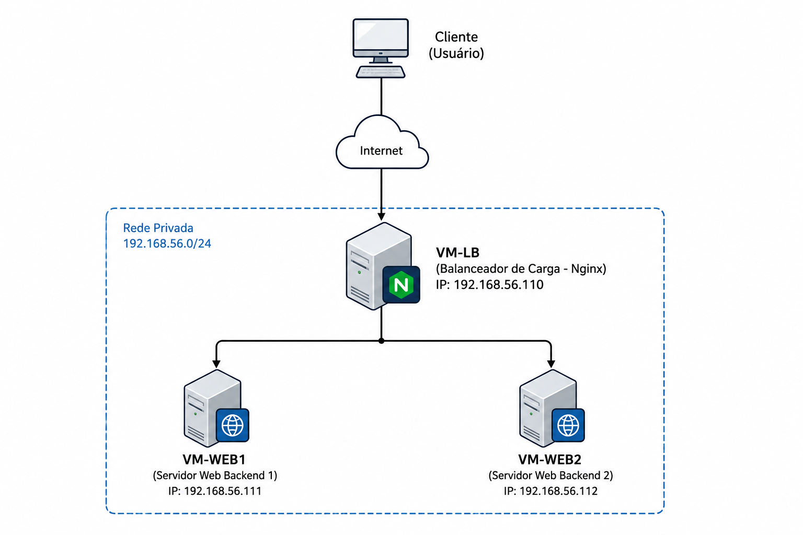
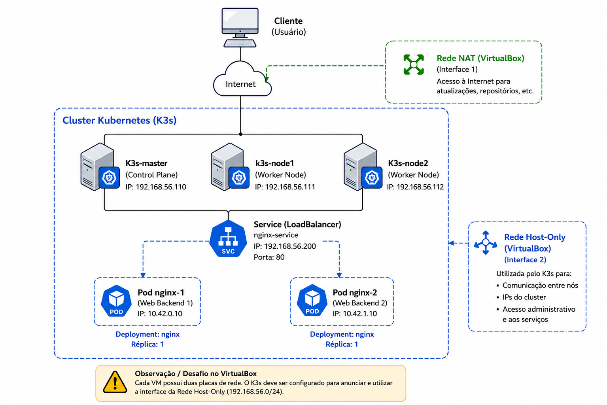

Introdução ao Fedora CoreOS e o K3s
===================================

Este trabalho apresenta uma introdução prática e conceitual a respeito do ecossistema do **Fedora CoreOS (FCOS)** e do **K3s**, servindo como base para a execução de um laboratório de ensino prático focado em **infraestrutura imutável, criação e gerenciamento de contêineres, balanceamento de carga e orquestração em larga escala**.

O objetivo geral deste texto é introduzir práticas de administração de sistemas utilizando um sistema operacional que rompe com o modelo tradicional mutável, capacitando o leitor a dominar as ferramentas de vanguarda, os desafios de rede e os paradigmas declarativos que regem os ambientes de alta disponibilidade e as arquiteturas nativas da nuvem **(*Cloud Native*)**.

> _Cloud Native_ é uma abordagem de desenvolvimento de software especificamente desenhada para criar e executar aplicações aproveitando todas as vantagens do modelo de computação em nuvem (como **flexibilidade, escalabilidade e resiliência**). Não se trata apenas de pegar um sistema tradicional antigo e hospedá-lo em uma máquina virtual na AWS ou no Google Cloud. Ser Cloud Native significa que a aplicação foi pensada, arquitetada e escrita desde o primeiro dia para viver e prosperar dentro da dinâmica da nuvem.


## Fedora CoreOS (FCOS)

O [Fedora CoreOS (FCOS)](https://fedoraproject.org/coreos/) é um **sistema operacional minimalista**, de código aberto e projetado especificamente para computação em nuvem e execução de cargas de trabalho em **contêineres** de forma segura e em larga escala. Ele combina a filosofia de **atualizações automáticas e atômicas** do Container Linux (antigo [CoreOS](https://en.wikipedia.org/wiki/Container_Linux)) com a base técnica moderna de pacotes e o ciclo de desenvolvimento do ecossistema [Fedora](https://fedoraproject.org/). 

O grande diferencial do FCOS reside na sua **imutabilidade**: o diretório do sistema operacional (`/usr`) é protegido como somente leitura, o que impede modificações manuais ou degradações ao longo do tempo. Além disso, ele **não utiliza instaladores tradicionais** (`dnf`, `apt`), sendo provisionado exclusivamente via arquivos de configuração declarativos (Ignition) no seu primeiro _boot_, garantindo que cada nó do _cluster_ nasça idêntico, previsível e altamente seguro.

> Neste contexto, um **_cluster_** é um conjunto de múltiplas máquinas virtuais que são conectadas via rede e passam a operar de forma unificada, agindo como se fossem um único e grande computador/sistema. Ele é estruturado em uma divisão de trabalho onde a máquina principal (_Master Node_) atua como o cérebro que distribui as tarefas, gerencia a segurança e monitora a saúde do sistema, enquanto as demais máquinas (_Worker Nodes_) funcionam como os motores que efetivamente executam os contêineres e respondem pelas requisições de balanceamento de carga de forma coordenada e transparente para o usuário final.


Na prática, o Fedora CoreOS é utilizado como a fundação de infraestruturas nativas da nuvem (*Cloud Native*), atuando como o sistema operacional hospedeiro (*host*) ideal para nós de clusters **Kubernetes** e ambientes de computação de borda (*Edge Computing*). Por ser a base comunitária _upstream_ do sistema comercial **[Red Hat Enterprise Linux CoreOS](https://www.redhat.com/) (RHCOS)**, o CoreOS é o motor que sustenta grandes _clusters_ do **[Red Hat OpenShift](https://www.redhat.com/en/technologies/cloud-computing/openshift)** ao redor do mundo. 

::: note
O Red Hat OpenShift é uma plataforma corporativa de orquestração de contêineres baseada em Kubernetes que unifica o desenvolvimento, a segurança e o gerenciamento de aplicações em ambientes de nuvem híbrida.
:::

Empresas de escala global, instituições financeiras e provedores de telecomunicações - como a [Amadeus](https://amadeus.com/en) (que gerencia sistemas de reservas de viagens globais) e a [Audi](https://www.audi.com.br/) - utilizam essa mesma tecnologia de arquitetura imutável em suas plataformas OpenShift para rodar milhares de microsserviços críticos. Na comunidade de Open source, ele é a base do **[OKD](https://docs.okd.io/)** (a distribuição comunitária do OpenShift), sendo amplamente adotado por administradores de sistemas e engenheiros de DevOps para implantar _datacenters_ automatizados do tipo *Zero Touch*, onde servidores vulneráveis ou desatualizados são simplesmente descartados e substituídos automaticamente por novas instâncias sem qualquer intervenção humana.

::: note
_Zero Touch_ é um método de provisionamento onde dispositivos ou sistemas são configurados e implantados de forma totalmente automatizada, sem a necessidade de intervenção manual.
:::

## Um Pouco da História do Fedora CoreOS

A história do Fedora CoreOS (FCOS) é o resultado da fusão de duas grandes tecnologias:

1. **O CoreOS original (Container Linux):** Criado por uma _startup_ em 2013, o CoreOS revolucionou o mercado ao trazer o conceito de um sistema operacional minimalista, imutável e que se atualizava sozinho, projetado exclusivamente para rodar contêineres em larga escala. Em 2018, a Red Hat adquiriu a CoreOS.

2. **O Project Atomic (Red Hat):** Paralelamente, a Red Hat já desenvolvia o *Fedora Atomic Host*, que tentava aplicar conceitos semelhantes dentro do ecossistema Fedora/Red Hat.

Em vez de manter dois projetos parecidos, a Red Hat decidiu unir o melhor dos dois mundos. O CoreOS Container Linux original foi descontinuado, e sua filosofia, ferramentas de provisionamento (como o *Ignition*) e sistema de atualizações foram integrados à robusta base de software do Fedora. Assim nasceu o Fedora CoreOS, hoje mantido pela comunidade Fedora e servindo de base para o *Red Hat OpenShift Enterprise*.

## Fedora CoreOS versus o Fedora Tradicional

Se você instalar o **Fedora Server ou Workstation tradicional** (bem como outras distribuições tradicionais), terá um sistema onde **pode instalar e remover pacotes livremente**, compilar programas e alterar arquivos de configuração diretamente em `/etc` ou `/usr`. Ou seja, você instala o sistema e **vai alterando conforme a sua necessidade**, o que é a prática tradicional para qualquer _workstation_ e também para a maioria dos servidores utilizando qualquer Sistema Operacional (SO).

Todavia, o FCOS quebra totalmente esse paradigma através de três pilares:

* **Imutabilidade:** O sistema de arquivos raiz (`/`) é montado como **somente leitura**. Você não pode (e não deve) usar comandos como `dnf install` para colocar, por exemplo, um servidor HTTP Apache ou Nginx direto no sistema.
* **Provisionamento Automatizado:** O FCOS não possui o instalador tradicional (Anaconda) onde você clica para instalar, ou os instaladores como: `dnf`, `apt`, etc, que são utilizados para instalação via ambiente texto. Ao invés disso o FCOS é configurado antes do primeiro _boot_ através de um arquivo chamado **Ignition**. Se uma VM der problema, você não a conserta; você simplesmente a destrói e sobe uma nova idêntica em segundos.
* **Atualizações Atômicas (_Automatic Updates_):** O FCOS atualiza-se sozinho em segundo plano usando uma tecnologia chamada `rpm-ostree` (que funciona de forma parecida com o [Git](https://pt.wikipedia.org/wiki/Git)). Se a atualização falhar ou quebrar o sistema, ele faz um *rollback* automático para a versão anterior no próximo _reboot_.

É preciso entender que a adoção da arquitetura baseada em **imutabilidade, provisionamento automatizado e atualizações atômicas no Fedora CoreOS exige uma quebra profunda de paradigma na administração de sistemas**, transformando a forma como gerenciamos a infraestrutura em nuvem. Essa transição traz **desvantagens** claras para quem está acostumado ao modelo tradicional, a começar pela **perda da flexibilidade** de modificar o sistema "_on-the-fly_"; **erros** de configuração não **podem ser corrigidos** com um ajuste rápido via execução de comandos via terminal local ou SSH, **exigindo que a máquina virtual seja completamente destruída e recriada** do zero. Além disso, a **impossibilidade de instalar ferramentas de diagnóstico** diretamente no _host_ com comandos como `dnf install`, o gerenciamento mais complexo para garantir a persistência de dados fora do sistema de arquivos raiz e a **necessidade obrigatória de reinicializações do sistema para aplicar atualizações** criam uma **curva de aprendizado íngreme**, exigindo que o ambiente seja previamente desenhado para suportar alta disponibilidade e automação estrita.

Por outro lado, as **vantagens** dessa abordagem superam amplamente os desafios em ambientes modernos de microsserviços, **elevando drasticamente o nível de segurança e escalabilidade da infraestrutura**. A **imutabilidade** do sistema raiz funciona como uma **blindagem contra invasões e erros humanos**, garantindo que o coração do sistema operacional permaneça inalterado e previsível em centenas ou milhares de instâncias idênticas. O **provisionamento automatizado** materializa o conceito de Infraestrutura como Código (IaC), **permitindo que servidores sejam clonados ou substituídos instantaneamente** sem apego operacional, enquanto as **atualizações atômicas eliminam o risco de corrupção de pacotes** e oferecem um mecanismo seguro de *rollback* imediato caso algo falhe, garantindo que o parque de servidores permaneça sempre atualizado e protegido com o menor esforço de manutenção possível.

A utilização do FCOS consolida o conceito de **"_Pets vs. Cattle_"** (Animais de Estimação vs. Gado), promovendo um total desapego operacional em relação à infraestrutura: o sistema operacional deixa de ser um "pet" que recebe manutenção manual, cuidados contínuos e correções de falhas in loco. Em vez de gastar tempo investigando o mau funcionamento de um servidor mutável, a filosofia imutável do FCOS dita que o nó defeituoso deve ser sumariamente descartado e substituído por uma nova instância idêntica, gerada automaticamente via Ignition já com as devidas correções aplicadas.

::: note
A analogia "_Pets vs. Cattle_" descreve duas filosofias distintas para o gerenciamento de servidores em TI e DevOps: enquanto os **_Pets_** são servidores únicos, cuidados manualmente, com nomes próprios e tratados como indispensáveis, o **_Cattle_** representa servidores uniformes, automatizados e facilmente substituíveis que, identificados apenas por números, são sumariamente descartados e recriados do zero caso apresentem qualquer falha.
:::

Assim, Fedora CoreOS foi desenhado sob uma filosofia minimalista e utilitária: ser uma fundação **ultra-segura, previsível e imutável para rodar contêineres**. Diferente das distribuições Linux tradicionais, sua arquitetura **elimina tudo o que é supérfluo**, mantendo apenas o estritamente necessário para o Kernel se comunicar com o hardware e disparar os motores de contêiner.

A seguir, exploramos como o FCOS é estruturado por dentro, seus componentes essenciais e as ferramentas utilizadas no dia a dia.

## Estrutura Básica e Elementos de Arquitetura

A arquitetura do Fedora CoreOS baseia-se em um modelo de camadas bem definido, onde o sistema operacional funciona como uma "fita de leitura" imutável e os aplicativos rodam isolados no topo. Assim a estrutura do FCOS está fundamentada nos elementos apresentados a seguir.

### Sistema de Arquivos Imutável (`rpm-ostree`)

Em vez de usar um gerenciador de pacotes tradicional que instala arquivos soltos pelo sistema, o FCOS utiliza o **`rpm-ostree`**. O sistema operacional é distribuído como uma imagem de sistema de arquivos completa (semelhante a um _commit_ do Git).

* Os diretórios `/usr` e `/boot` são montados estritamente como **somente leitura**.
* O diretório `/etc` é de leitura e escrita, mas serve apenas para armazenar arquivos de configuração de serviços.
* O diretório `/var` é a única área verdadeiramente mutável, onde ficam os _logs_, dados do usuário e o armazenamento dos contêineres.

### Podman

Como o FCOS não permite a instalação de softwares diretamente no sistema, ele traz nativamente o **Podman** (_Pod Manager_) para gerenciamento de contêineres *rootless* (sem necessidade de privilégios de administrador).

Então o **Podman** é um **motor de contêineres** de código aberto, modular e nativo do Linux, projetado para desenvolver, gerenciar e executar contêineres e Pods seguindo os padrões da OCI (*Open Container Initiative*). 

Seu grande diferencial técnico em relação ao Docker é a sua arquitetura **_daemonless_** (sem a necessidade de um serviço central em segundo plano rodando como `root`) e o suporte nativo a contêineres **_rootless_**, o que aumenta drasticamente a segurança do sistema ao permitir que usuários comuns criem e executem contêineres sem privilégios administrativos. 

No dia a dia de um administrador de sistemas, o Podman é utilizado para isolar e rodar serviços locais de forma rápida — como subir temporariamente um banco de dados para testes através do comando `podman run`, empacotar aplicações customizadas com o `podman build`, ou automatizar a inicialização de servidores web integrados diretamente ao `systemd` do sistema operacional através de arquivos de configuração declarativos, substituindo o Docker com total compatibilidade de comandos.

::: note
**Pod** podem ser vistos como grupos de contêineres compartilhando a mesma rede e recursos - esse é um conceito utilizado em Kubernetes.
:::

### Provisionamento via Ignition

O **Ignition** é o utilitário de provisionamento declarativo de primeiro _boot_ desenvolvido especificamente para sistemas operacionais imutáveis como o Fedora CoreOS. 

Diferente de ferramentas tradicionais de automação como o Cloud-Init, que executam _scripts_ de forma imperativa quando o sistema já iniciou, o Ignition roda exclusivamente dentro do ambiente temporário do disco de _boot_ (*initramfs*) antes do espaço de usuário real ser montado. Sua funcionalidade é formatar e particionar discos, configurar _links_ simbólicos, criar arquivos de rede e gerenciar usuários de forma atômica: se qualquer etapa falhar, o _boot_ é abortado imediatamente, garantindo que a máquina nunca inicie em um estado parcialmente configurado. 

Um exemplo prático de uso no dia a dia ocorre na criação automatizada de _clusters_, onde o administrador escreve um arquivo de configuração estruturado e o anexa ao provisionar uma nova máquina virtual, que pode estar no VirtualBox ou em nuvem; ao ligar pela primeira vez, o Ignition lê esse arquivo, injeta as chaves SSH do administrador, configura o endereço IP estático da rede e cria os arquivos de serviço do `systemd`, fazendo com que o nó nasça pronto e idêntico aos demais, sem que ninguém precise digitar um único comando no terminal.

Administrar um sistema operacional controlado pelo **Ignition** inicialmente provoca um estranho choque cultural para profissionais acostumados com o gerenciamento de servidores tradicionais. Em um primeiro contato, deparar-se com uma máquina virtual que nasce sem uma tela de instalação guiada, sem um _prompt_ para definição de senha de administrador e que rejeita qualquer tentativa de _login_ local direto parece contraintuitivo e até inacessível. No entanto, esse estranhamento inicial se dissipa quando compreendemos os benefícios dessa arquitetura de "infraestrutura como código" (*Infrastructure as Code*): ao forçar a autenticação exclusiva via chaves criptográficas SSH desde o milissegundo zero de existência da máquina, o Ignition elimina vulnerabilidades críticas de força bruta de senhas, eleva o patamar de segurança do ambiente e padroniza a entrega de servidores. 

Assim, o ganho real está na escalabilidade contínua e na previsibilidade absoluta, pois o administrador ganha o poder de destruir e recriar dezenas de servidores idênticos em segundos, com a certeza de que todos nascerão configurados com precisão e imunes às falhas humanas decorrentes de processos manuais de pós-instalação.


### Atualizações Automáticas com o Zincati

O **Zincati** é o serviço em segundo plano (*daemon*) oficial do Fedora CoreOS responsável por gerenciar as atualizações automáticas do sistema de forma coordenada e segura. Operando em perfeita sinergia com a arquitetura imutável do FCOS, sua funcionalidade é monitorar constantemente os repositórios remotos em busca de novas versões do sistema operacional e, ao detectar uma atualização, realizar o download e a aplicação atômica em segundo plano utilizando o `rpm-ostree`. Para evitar que todas as máquinas de um cluster reiniciem simultaneamente e derrubem os serviços, o Zincati comunica-se com um gerenciador de frota (como o FleetLock), aplicando estratégias de travamento e janelas de manutenção agendadas. 

Um exemplo de uso prático ocorre em _datacenters_ de alta disponibilidade, onde o Zincati detecta uma correção de segurança crítica da Red Hat, baixa a nova imagem do sistema sem interferir nos contêineres que estão rodando e aguarda o momento ideal; assim que o _cluster_ autoriza, ele reinicia o nó de forma transparente, o Kubernetes redireciona o tráfego para as outras máquinas e o servidor volta a operar totalmente atualizado e protegido, sem qualquer intervenção ou preocupação por parte da equipe de engenharia de DevOps.

### Gerenciamento do sistema pelo Systemd

O Systemd atua como o administrador central do Linux moderno (não é algo apenas do FCOS), sendo o sistema de inicialização (_init system_) que assume o controle da máquina assim que o Kernel conclui seu carregamento. Por ser o processo primogênito do sistema (`PID 1`), ele permanece ativo até o desligamento completo do hardware. A sua missão fundamental é reger o funcionamento global do sistema operacional: desde o mapeamento inicial de componentes físicos e montagem de discos até o gerenciamento contínuo de serviços em segundo plano (_daemons_). Essa engrenagem é controlada via arquivos declarativos conhecidos como unidades (as famosas _units_, como arquivos `.service`). Assim, o Systemd dita a ordem cronológica do _boot_ e resolve conflitos de dependências — impedindo, por exemplo, que um banco de dados inicie antes que a rede esteja operacional —, além de garantir alta disponibilidade ao vigiar os processos e reiniciá-los instantaneamente caso sofram uma queda inesperada.

### Quadlet

O Quadlet surge como uma ferramenta nativa do Podman criada com um propósito claro: acabar com a complexidade de rodar contêineres dentro do Systemd. Ele funciona como um tradutor inteligente e automatizado. Na prática, ele poupa o administrador de sistemas de ter que redigir manualmente arquivos de serviço longos, confusos e cheios de parâmetros repetitivos (como os comandos intermináveis do tipo `podman run --name ...`). Em vez disso, o administrador escreve apenas um arquivo muito simples e direto, com a extensão `.container`, contendo o que a aplicação precisa. O Quadlet entra em ação nos bastidores para ler esse arquivo e criar, sozinho, a unidade `.service` perfeita para o Systemd. O resultado é um serviço limpo, configurado com todas as boas práticas de segurança, amarração de discos e tratamento de falhas exigidas pelo sistema operacional.

O Systemd e o Quadlet quando combinados eliminam a necessidade de um _daemon_ de contêiner tradicional (como o do Docker). O Quadlet fornece a simplicidade declarativa para descrever o contêiner, e o Systemd assume o controle operacional real: monitorando o contêiner, reiniciando-o se o processo interno travar e garantindo que ele suba perfeitamente durante o _boot_ do servidor.

## Principais Comandos do Fedora CoreOS

No dia a dia com o FCOS, a lista de comandos é consideravelmente menor do que em outros sistemas, concentrando-se na verificação do status do sistema operacional e na gestão dos contêineres.

### Gerenciamento do Sistema Operacional (`rpm-ostree`)

Como o sistema é atômico, as interações com o SO envolvem checar versões e gerenciar atualizações, isso pode ser feito com os comandos:

* **`rpm-ostree status`**: Mostra a versão atual do sistema, se há atualizações pendentes e qual imagem será carregada no próximo _boot_.
* **`rpm-ostree upgrade`**: Verifica e baixa manualmente novas atualizações do sistema operacional (embora o Zincati faça isso sozinho).
* **`rpm-ostree rollback`**: Se uma atualização quebrar seu ambiente, este comando reverte o sistema operacional exatamente para o estado anterior no próximo boot.

### Gerenciamento de Contêineres (`podman`)

Substitui as ferramentas tradicionais de software, sendo o principal ambiente de trabalho dos usuários:

* **`podman run -d --name [nome] -p [porta:porta] -v [host:container:Z] [imagem]`**: Inicia um contêiner. O uso da flag `:Z` ao mapear volumes é obrigatório no FCOS para que o **SELinux** permita o acesso ao diretório.
* **`podman ps -a`**: Lista todos os contêineres (ativos e inativos) criados pelo seu usuário atual.
* **`podman logs [nome]`**: Exibe a saída de erro e _logs_ de uma aplicação específica em execução.

::: note
O `podman`  basicamente executa as mesmas funções do `docker` inclusive utilizando os mesmos comandos.
:::

### Diagnóstico de Infraestrutura e Serviços (`systemd`)

Como os contêineres e o próprio sistema rodam sob a tutela do `systemd`, comandos de auditoria são vitais:

* **`systemctl status zincati`**: Verifica a saúde do serviço de atualizações automáticas.
* **`journalctl -f`**: Exibe os logs do sistema em tempo real (essencial para descobrir por que um contêiner integrado ao systemd falhou ao iniciar).
* **`sudo ss -tulpn`**: Mostra quais portas de rede estão abertas no host e quais IDs de processos (`conmon` ou serviços do sistema) as estão ocupando.


Em suma, a convergência entre o **Fedora CoreOS (FCOS)**, o **Ignition** e o **Podman** redefine os patamares de eficiência, segurança e previsibilidade na administração moderna de contêineres. Ao substituir o modelo tradicional de servidores mutáveis e configurações manuais por uma infraestrutura estritamente declarativa e imutável, esse ecossistema elimina o "desvio de configuração" e blinda o sistema operacional contra falhas humanas e vetores de ataque comuns. O Ignition assegura que cada nó nasça configurado com precisão cirúrgica a partir do primeiro _boot_, enquanto o Podman, integrado ao Systemd via Quadlet, gerencia as cargas de trabalho de forma leve, resiliente e segura, sem a necessidade de _daemons_ privilegiados rodando como `root`. Para o administrador de sistemas e engenheiro de DevOps, essa sinergia transforma a gestão de infraestruturas complexas em uma tarefa altamente escalável e automatizada, onde gerenciar dezenas de servidores passa a ser tão simples, idêntico e previsível quanto gerenciar apenas um.


# Instalação do Fedora CoreOS

Diferente dos sistemas operacionais convencionais, nos quais a instalação é guiada por uma interface gráfica e menus interativos, o Fedora CoreOS introduz um paradigma baseado em **provisionamento automatizado**. Não existe o conceito de "instalar e depois configurar". No FCOS, a máquina já nasce configurada a partir do seu primeiro milissegundo de _boot_.

O ecossistema Fedora CoreOS é distribuído em três canais principais (chamados de *streams*), atualizados continuamente para garantir segurança e estabilidade. A escolha do canal depende criticamente do ambiente alvo:

* **Stable (Estável):** O canal recomendado para ambientes de produção e laboratórios consolidados. Passou por testes intensivos nos canais anteriores e oferece a maior garantia de previsibilidade.
* **Testing (Testes):** Uma prévia do que se tornará o canal estável nas semanas seguintes. Ideal para validar se novas atualizações de pacotes ou do Kernel não quebrarão os contêineres da sua infraestrutura.
* **Next (Próximo):** O canal de vanguarda, contendo as bases da próxima versão maior do Fedora. Focado em testes de compatibilidade de longo prazo.

A obtenção da imagem de codificação é feita a partir da página oficial de downloads: <https://fedoraproject.org/coreos/download/?stream=stable>.

Ao acessar a página, o administrador depara-se com uma matriz de formatos específicos para cada tipo de arquitetura e _hipervisor_. O FCOS não possui uma "ISO única para tudo". É preciso baixar o arquivo de instalação exato para o seu destino computacional/propósito, tal como:

* **Máquina Física (_Bare Metal_):** Imagens do tipo `ISO` (para _boot_ via pendrive/CD) ou `Raw` (para escrita direta no disco rígido).
* **Virtualizadores Locais:** Formatos dedicados como `OVA` (para VMware vSphere/VirtualBox), `QCOW2` (para QEMU/KVM) e `VHDX` (para Hyper-V).
* **Provedores de Nuvem:** Imagens customizadas com os drivers de paravirtualização nativos de cada nuvem (AWS, Google Cloud, Azure).

O guia oficial de introdução (<https://docs.fedoraproject.org/pt_BR/fedora-coreos/getting-started/>) divide a estratégia de inicialização do Fedora CoreOS em três cenários principais de infraestrutura, sendo alguns exemplos:

* **Nuvem Pública (_Cloud Platforms_)**: Em provedores de nuvem como AWS (_Amazon Web Services_) ou GCP (_Google Cloud Platform_), o provisionamento é nativo da API do provedor. O administrador não faz o download da imagem; ele simplesmente seleciona a AMI (_Amazon Machine Image_) pública correspondente ao FCOS na sua região e, no campo de metadados da instância (*User Data*), injeta o arquivo de configuração do Ignition. A nuvem se encarrega de ligar a máquina e aplicar as diretivas automaticamente.

* **Máquina Física (_Bare Metal_)**: Para instalar o FCOS diretamente no hardware de um servidor físico, grava-se a imagem ISO estável em um _pendrive_ bootável. Ao iniciar o servidor pelo _pendrive_, o sistema carrega um ambiente temporário na memória RAM (_Live_ ISO). A partir desse terminal temporário, o administrador executa o utilitário `coreos-installer`, apontando para o disco rígido de destino (`/dev/sda`, por exemplo) e fornecendo uma URL ou caminho local contendo o arquivo do Ignition. O utilitário formata o disco, injeta as configurações e prepara o sistema para o primeiro boot real.

* **VirtualBox**: Para fins de estudo arquitetural, testes de redes privadas e validação multi-nó sem custos de computação em nuvem, o **Oracle VirtualBox** é a plataforma ideal. O fluxo de instalação no VirtualBox utiliza o formato de imagem virtual **OVA (_Open Virtualization Format_)**, que atua como um modelo pré-configurado de máquina virtual.

Como esse texto tem fins educativos, vamos abordar a instalação via VirtualBox, para a criação de um laboratório para testes, para instruções a respeito de outras instalações procure o material em sítios web como: <https://docs.fedoraproject.org/pt_BR/fedora-coreos/getting-started/>

### Instalação do FCOS no VirtualBox

Diferente de uma instalação tradicional no Oracle VirtualBox baseada em arquivos ISO — que exige a execução de assistentes gráficos passo a passo para particionar o disco e criar usuários —, o provisionamento utilizando um arquivo **OVA** (Open Virtualization Format) costuma ser um processo direto de importação e execução. Na gerência de sistemas convencional, o administrador simplesmente importa o arquivo OVA, ajusta os recursos de hardware e inicia a máquina virtual, que prontamente carrega um sistema operacional pré-instalado e pronto para o uso. 

Com o Fedora CoreOS, o fluxo inicial de importação do arquivo OVA ocorre exatamente da mesma maneira; contudo, há uma etapa crítica e obrigatória que rompe com esse modelo tradicional. **Antes de iniciar a máquina virtual pela primeira vez**, é imprescindível injetar o arquivo de configuração do Ignition no hipervisor. Como o FCOS é projetado sob a filosofia de segurança máxima e automação, ele nasce completamente desprovido de senhas de usuário e com os _logins_ locais bloqueados de fábrica. **Sem essa configuração prévia contendo a chave pública SSH do administrador, o sistema operacional inicializará com sucesso, mas ficará eternamente isolada e inacessível, inviabilizando qualquer tipo de acesso ou gerenciamento posterior**.

Sendo assim os passos para instalar o FCOS no VirtualBox via arquivo OVA segue basicamente os seguintes passos:

### Passo 1: Download do Arquivo OVA

Na página de [downloads](https://fedoraproject.org/coreos/download/?stream=stable) do FCOS, localize a seção dedicada ao **VirtualBox** dentro do canal *Stable* e baixe o arquivo com a extensão `.ova`. Este arquivo já contém o disco virtual pré-formatado com o sistema de arquivos imutável do Fedora e os parâmetros de hardware mínimos recomendados (como uso de controladoras SATA e adaptadores de rede compatíveis).

### Passo 2: Importação do Appliance

No painel do VirtualBox, acesse o menu **Arquivo -> Importar Appliance** (ou *Import Virtual Appliance*) e selecione o arquivo `.ova` baixado. Nesta tela, o administrador pode definir o nome da VM e ajustar a alocação de memória RAM (recomenda-se o mínimo de 1024MB a 2048MB para laboratórios). 

::: important
**Não inicie a máquina virtual ainda.**
:::

### Passo 3: Injeção do Arquivo Ignition via Propriedades do Host

Como o FCOS não possui tela de _login_ ou senha padrão, se a máquina virtual for ligada imediatamente após a importação, o Ignition falhará por falta de instruções e o sistema entrará em um _loop_ de _boot_ ou ficará inacessível na tela de _prompt_.

Então o próximo passo é criar o arquivo Ignition, que utiliza uma sintaxe estritamente baseada em **JSON** (com validações de esquema rigorosas e difíceis de escrever manualmente sem cometer erros de pontuação). Assim, o projeto Fedora CoreOS desenvolveu uma ferramenta intermediária mais amigável para o administrador humana chamada de **Butane**.

O fluxo de trabalho padrão consiste em escrever as diretrizes de infraestrutura em um arquivo com sintaxe **YAML** (chamado de especificação Butane, com extensão `.bu`) e, em seguida, utilizar o binário do Butane para traduzir e compilar esse arquivo no formato JSON compreendido pelo Ignition (extensão `.ign`).

Então para nosso primeiro acesso vamos configurar apenas o arquivo Butane para ter a chave para o SSH conectar sem senha, para isso temos que ver a chave no arquivo `~/.ssh/id_rsa.pub` (ou outra chave SSH que você tenha), que deve ter um conteúdo tal como:

#### Criando a chave SSH (caso não exista)

É necessário ter uma chave SSH, se essa não existir é preciso criar uma chave SSH no computador que vai acessar o FOCS. Isso pode ser feito com os comandos a seguir:

```bash
ssh-keygen -t rsa -b 4096
```
::: note
Se você já tiver a chave não precisa criar. Também é possível criar outros tipos de chaves, tal como: `ssh-keygen -t ed25519 -C "seu-email@exemplo.com"`, por exemplo as chaves do algoritmo ED25519 geram tamanho de chaves menores, o que pode ajudar, já que o sistemas que receberá o arquivo Ignition pode ter problemas com o tamanho do mesmo arquivo.
:::

Com a chave criada é preciso copiar o conteúdo da chave, tal como:

```bash
cat ~/.ssh/id_rsa.pub 

ssh-rsa AAAAB3NzaC1yc3EAAAADAQABAAACAQDjWW409BW52fXAwpQknt4u4G63lAbJDAAK17ghBAC3AbGbqIIDVJPnnXQIW3tvAyDcbgPR+TBMM7B7zRqnmGo4fbcdBI0sUXDDvdWqY+hpvkVA7LWhduHv5G9hZSShbK6KI14trZebIFjQwlaq8Vz5HgVcxwskuzs+v8C+JnGG+bFh8Jmw+1StF3Y1b7gKY2MPyVfFH/i61FZCNu2PCIzTPExBUkIUc1OclOccYSKOCzUCH8U3bg7PUrLbv6Y016yLAV0TDbwkmwBEbV0rdR7i5y2xGVpPDh+8R85UwHpE26XFZ/+EUTiScTYG8Qc0UM+Fklom4nv91i2NV05oeidXF0IyyLOjVYYJDAaEXGTOcUd3rYorMw3qsoAF/tTn60dxnZXdLRWPEmsFWBdWcpDaoK5ylcmRV2kcNmqj8789zkXOCXAfzHG5j9w2uSTOpA4LQtdUFDwv7+1fahVOttk3MePMcU08SieFjCMVs6c1vatsnz0atOn0LxBmEd07IZKYi8wH24pidQBnLP3DN8geFAzwcUWIDXTwU7Q/SHW1p6GdBybPhnxJHp5BmfRLDM7iLJizmpWUOQM5Zj8rI15EMWU+4uLkQNm5ZqwFxqcO1W88al8J26FobB+vnBQ1kbQOwA+D7Q7hkoVwNaaWxF++xRfYV2b1o+fMd0mN7H3D4w== luiz@teste
```

Assim, com o conteúdo da chave, copie esse e vamos criar um arquivo chamado, por exemplo de `config.bu` e vamos incluir a chave anterior no arquivo _butane_, junto com as seguintes opções:

```bash
variant: fcos
version: 1.5.0
passwd:
  users:
    - name: core
      ssh_authorized_keys:
        - ssh-rsa AAAAB3NzaC1yc2EAAAADAQABAAACAQDjWW409BW52fXAwpQknt4u4G63lAbJDAAK17ghBAC3AbGbqIIDVJPnnXQIW3tvAyDcbgPR+TBMM7B7zRqnmGo4fbcdBI0sUXDDvdWqY+hpvkVA7LWhduHv5G9hZSShbK6KI14trZebIFjQwlaq8Vz5HgVcxwskuzs+v8C+JnGG+bFh8Jmw+1StF3Y1b7gKY2MPyVfFH/i61FZCNu2PCIzTPExBUkIUc1OclOccYSKOCzUCH8U3bg7PUrLbv6Y016yLAV0TDbwkmwBEbV0rdR7i5y2xGVpPDh+8R85UwHpE26XFZ/+EUTiScTYG8Qc0UM+Fklom4nv91i2NV05oeidXF0IyyLOjVYYJDAaEXGTOcUd4rYorMw3qsoAF/tTn60dxnZXdLRWPEmsFWBdWcpDaoK5ylcmRV2kcNmqj8789zkXOCXAfzHG5j9w2uSTOpA4LQtdUFDwv7+1fahVOttk3MePMcU08SieFjCMVs6c1vatsnz0atOn0LxBmEd07IZKYi8wH24pidQBnLP3DN8geFAzwcUWIDXTwU7Q/SHW1p6GdBybPhnxJHp5BmfRLDM7iLJizmpWUOQM5Zj8rI15EMWU+4uLkQNm5ZqwFxqcO1W88al8J26FobB+vnBQ1kbQOwA+D7Q7hkoVwNaaWxF++xRfYV2b1o+fMd0mN7H3D4w== luiz@fiel-dell
```

Com o arquivo pronto vamos gerar o arquivo Ignition, isso pode ser feito de várias formas, mas vamos realizar tal tarefa utilizando o comando:

```bash
butane --pretty --strict config.bu > config.ign
```
::: note
O comando `butane` pode ser instalado, por exemplo utilizando algum gerenciador de pacotes tal como: `apt install butane`.
:::

O comando anterior vai gerar o arquivo `config.ign`, que deve ter um conteúdo similar ao apresentado a seguir:

```bash
$ cat fcos/config.ign 
{
  "ignition": {
    "version": "3.4.0"
  },
  "passwd": {
    "users": [
      {
        "name": "core",
        "sshAuthorizedKeys": [
          "ssh-rsa AAAAB3NzaC1yc2EAAAADAQABAAACAQDjWW409BW52fXAwpQknt4u4G63lAbJDAAK17ghBAC3AbGbqIIDVJPnnXQIW3tvAyDcbgPR+TBMM7B7zRqnmGo4fbcdBI0sUXDDvdWqY+hpvkVA7LWhduHv5G9hZSShbK6KI14trZebIFjQwlaq8Vz5HgVcxwskuzs+v8C+JnGG+bFh8Jmw+1StF3Y1b7gKY2MPyVfFH/i61FZCNu2PCIzTPExBUkIUc1OclOccYSKOCzUCH8U3bg7PUrLbv6Y016yLAV0TDbwkmwBEbV0rdR7i5y2xGVpPDh+8R85UwHpE26XFZ/+EUTiScTYG8Qc0UM+Fklom4nv91i2NV05oeidXF0IyyLOjVYYJDAaEXGTOcUd4rYorMw3qsoAF/tTn60dxnZXdLRWPEmsFWBdWcpDaoK5ylcmRV2kcNmqj8789zkXOCXAfzHG5j9w2uSTOpA4LQtdUFDwv7+1fahVOttk3MePMcU08SieFjCMVs6c1vatsnz0atOn0LxBmEd07IZKYi8wH24pidQBnLP3DN8geFAzwcUWIDXTwU7Q/SHW1p6GdBybPhnxJHp5BmfRLDM7iLJizmpWUOQM5Zj8rI15EMWU+4uLkQNm5ZqwFxqcO1W88al8J26FobB+vnBQ1kbQOwA+D7Q7hkoVwNaaWxF++xRfYV2b1o+fMd0mN7H3D4w== luiz@fiel-dell"
        ]
      }
    ]
  }
}
```

Agora, com o arquivo Ignition criado vamos:

1. Importar a VM através do arquivo OVA.
2. Injetar a chave do Ignition na VM.
3. Configurar uma segunda placa de rede do tipo Host-Only para acessar a VM via SSH.
4. Ligar a VM.

Esses passos são realizados pelos comandos a seguir:

Iniciamos importando o arquivo OVA via comando do VirtualBox - neste caso já estamos criando uma interface de rede no VirtualBox do tipo Host-Only (`vboxnet0`), que será utilizada para acessar a VM via SSH:

```bash
$ VM_NAME=fedoraCOS
VBoxManage import --vsys 0 --vmname "$VM_NAME" Downloads/fedora-coreos-44.20260419.3.1-virtualbox.x86_64.ova && VBoxManage modifyvm "$VM_NAME" --nic2 hostonly --hostonlyadapter2 vboxnet0
```
A saída será algo como:

```bash
0%...10%...20%...30%...40%...50%...60%...70%...80%...90%...100%
Interpreting /home/luiz/Downloads/fedora-coreos-44.20260419.3.1-virtualbox.x86_64.ova...
OK.
Disks:
  vmdisk1	10737418240	1181180928	http://www.vmware.com/interfaces/specifications/vmdk.html#streamOptimized	disk.vmdk	1181180928	-1	

Virtual system 0:
 0: Suggested OS type: "Fedora_64"
    (change with "--vsys 0 --ostype <type>"; use "list ostypes" to list all possible values)
 1: VM name specified with --vmname: "fedoraCOS"
 ...
    (change with "--vsys 0 --cpus <n>")
 9: Guest memory: 4096 MB
    (change with "--vsys 0 --memory <MB>")
10: USB controller
    (disable with "--vsys 0 --unit 10 --ignore")
11: Network adapter: orig NAT, config 6, extra slot=0;type=NAT
12: SATA controller, type AHCI
    (disable with "--vsys 0 --unit 12 --ignore")
13: Hard disk image: source image=disk.vmdk, target path=disk.vmdk, controller=12;port=0
...
0%...10%...20%...30%...40%...50%...60%...70%...80%...90%...100%
Successfully imported the appliance.
```
Ainda com a máquina virtual desligada e no terminal do hospedeiro abre-se o terminal do sistema operacional hospedeiro (sua máquina real de trabalho) e executa-se o comando utilitário do VirtualBox para injetar a configuração codificada em formato _string_ ou _base64_ diretamente na placa-mãe virtual. Isso pode ser feito da seguinte forma:

```bash
$ IGN_PATH="fcos/config.ign" 
$ VBoxManage guestproperty set "$VM_NAME" /Ignition/Config "$(cat $IGN_PATH)"
```

::: note
Veja os passos em: <https://docs.fedoraproject.org/en-US/fedora-coreos/provisioning-virtualbox/>
:::


### Passo 4: O Primeiro Boot e a Configuração Atômica

Ao clicar em "Iniciar" no VirtualBox, o processo de boot do Fedora CoreOS ocorre na seguinte cronologia:

1. O Kernel Linux inicia e carrega o ambiente inicial do sistema de arquivos na memória (`initramfs`).
2. O utilitário **Ignition** é disparado automaticamente antes de qualquer outro serviço do sistema operacional.
3. O Ignition faz a varredura do hardware, localiza a propriedade criada pelo `VBoxManage` (`/Ignition/Config`), lê o conteúdo do arquivo `.ign` e decodifica as instruções.
4. Em frações de segundo, o Ignition cria as partições adicionais necessárias, escreve as chaves públicas SSH do administrador no diretório `/home/core/.ssh/authorized_keys`, configura as interfaces de rede e ativa as unidades de serviço do Systemd (como os scripts do K3s ou Podman).
5. O Ignition encerra sua execução, passa o controle para o Systemd real do sistema e a tela do console exibe o prompt de login limpo.

A partir deste instante, o nó está pronto. O administrador pode abrir o terminal de sua máquina física e conectar-se via rede privada à VM utilizando o comando criptográfico seguro: `ssh core@<IP_DA_SUA_VM_HOST_ONLY>`, tal como:

```bash
$ ssh core@192.168.56.106
Fedora CoreOS 44.20260510.3.1
Tracker: https://github.com/coreos/fedora-coreos-tracker
Discuss: https://discussion.fedoraproject.org/tag/coreos

Last login: Sun Jun  7 11:24:00 2026 from 192.168.56.1
core@localhost:~$
```
::: note
Normalmente o IP aparece no console do VirtualBox, então é só olhar o console da VM que está em execução no VirtualBox, identificar o IP e no host hospedeiro executar o SSH para o dado IP.
:::

É muito importante notar que **a configuração do Ignition só é aplicada no primeiro _boot_**, ou seja, se você aplicar o Ignition com uma configuração em uma VM X, e quiser alterar a configuração, não dá para reaplicar a configuração via Ignition na VM X (o comando é até executado, mas não tem efeito prático). Portanto neste caso é necessário apagar a VM X, criar uma nova VM e aplicar a nova configuração via Ignition nesta nova VM - lembre que a filosofia do FCOS é não ter apego ao sistema, se está errado apaga e inicia outro com a configuração certa.

::: important
O Ignition foi projetado para ser executado apenas uma vez, durante o primeiro _boot_ de uma máquina recém-provisionada. Se precisar alterar, há algumas opções, mas uma ideia principal é apagar a VM e criar outra!
:::

## Um pouco mais a respeito do Ignition

O Ignition então é um dos principais recursos do FCOS, como vimos anteriormente ele permite a configuração do sistema operacional antes mesmo de iniciar ele pela primeira vez. Todavia o computador/sistema que receberá o Ignition, pode não suportar o tamanho do arquivo de configuração. Ou seja, há um limite, que inclusive pode ser bem pequeno.

Por exemplo no arquivo de configuração inicial, incluímos a chave RSA para acessar o FCOS via SSH, dependendo o caso, é apenas incluirmos a configuração de nome do host/computador, o sistema já não vai suportar o arquivo com o Ignition, por exemplo:

1. No arquivo Butano a seguir, incluímos a configuração do nome do host no final do arquivo, veja:

```bash
variant: fcos
version: 1.5.0
passwd:
  users:
    - name: core
      ssh_authorized_keys:
        - ssh-rsa AAAAB3NzaC1yc2EAAAADAQABAAACAQDjWW409BW52fXAwpQknt4u4G63lAbJDAAK17ghBAC3AbGbqIIDVJPnnXQIW3tvAyDcbgPR+TBMM7B7zRqnmGo4fbcdBI0sUXDDvdWqY+hpvkVA7LWhduHv5G9hZSShbK6KI14trZebIFjQwlaq8Vz5HgVcxwskuzs+v8C+JnGG+bFh8Jmw+1StF3Y1b7gKY2MPyVfFH/i61FZCNu2PCIzTPExBUkIUc1OclOccYSKOCzUCH8U3bg7PUrLbv6Y016yLAV0TDbwkmwBEbV0rdR7i5y2xGVpPDh+8R85UwHpE26XFZ/+EUTiScTYG8Qc0UM+Fklom4nv91i2NV05oeidXF0IyyLOjVYYJDAaEXGTOcUd4rYorMw3qsoAF/tTn60dxnZXdLRWPEmsFWBdWcpDaoK5ylcmRV2kcNmqj8789zkXOCXAfzHG5j9w2uSTOpA4LQtdUFDwv7+1fahVOttk3MePMcU08SieFjCMVs6c1vatsnz0atOn0LxBmEd07IZKYi8wH24pidQBnLP3DN8geFAzwcUWIDXTwU7Q/SHW1p6GdBybPhnxJHp5BmfRLDM7iLJizmpWUOQM5Zj8rI15EMWU+4uLkQNm5ZqwFxqcO1W88al8J26FobB+vnBQ1kbQOwA+D7Q7hkoVwNaaWxF++xRfYV2b1o+fMd0mN7H3D4w== luiz@fiel-dell 

storage:
  files:
    - path: /etc/hostname
      mode: 0644
      contents:
        inline: servidor01
```

2. Em seguida geramos o arquivo Ignition:

```bash
$ butane --pretty --strict config.bu > config.ign
```
3. Agora tentamos dar a ignição do sistema com essa configuração, mas aparecerá um erro, tal como:

```bash
$ VBoxManage guestproperty set "$VM_NAME" /Ignition/Config "$(cat $IGN_PATH)"
VBoxManage: error: VERR_TOO_MUCH_DATA
VBoxManage: error: Details: code NS_ERROR_INVALID_ARG (0x80070057), component SessionMachine, interface IMachine, callee nsISupports
VBoxManage: error: Context: "SetGuestPropertyValue(Bstr(pszName).raw(), Bstr(pszValue).raw())" at line 151 of file VBoxManageGuestProp.cpp
```

Neste caso anterior, o VirtualBox, não conseguiu injetar a configuração, por causa do tamanho do arquivo e para sair disso há algumas formas, mas uma bem elegante e útil é utilizando um segundo arquivo de Ignition, ou seja, vamos criar um arquivo inicial bem pequeno, que aponta para um outro arquivo, que será fornecido via servidor HTTP - ou seja, pode ser uma configuração que está disponível em rede, tal como Internet. Veja os passos a seguir:

1. Arquivo butano com configuração mínima que aponta para outro arquivo via HTTP:

```bash
variant: fcos
version: 1.5.0

ignition:
  config:
    merge:
      - source: http://192.168.56.1:8080/servidor01.ign
```

O principal no arquivo anterior é que ele aponta para outro arquivo, que neste caso é o arquivo `servidor01.ign`, que está no servidor HTTP 192.168.56.1, que está sendo executado na porta TCP/8080.

O conteúdo deste arquivo é a configuração anterior, estendida, com a chave SSH e o nome do host, vamos repetir o conteúdo anterior aqui para não ficar dúvidas:

```bash
variant: fcos
version: 1.5.0
passwd:
  users:
    - name: core
      ssh_authorized_keys:
        - ssh-rsa AAAAB3NzaC1yc2EAAAADAQABAAACAQDjWW409BW52fXAwpQknt4u4G63lAbJDAAK17ghBAC3AbGbqIIDVJPnnXQIW3tvAyDcbgPR+TBMM7B7zRqnmGo4fbcdBI0sUXDDvdWqY+hpvkVA7LWhduHv5G9hZSShbK6KI14trZebIFjQwlaq8Vz5HgVcxwskuzs+v8C+JnGG+bFh8Jmw+1StF3Y1b7gKY2MPyVfFH/i61FZCNu2PCIzTPExBUkIUc1OclOccYSKOCzUCH8U3bg7PUrLbv6Y016yLAV0TDbwkmwBEbV0rdR7i5y2xGVpPDh+8R85UwHpE26XFZ/+EUTiScTYG8Qc0UM+Fklom4nv91i2NV05oeidXF0IyyLOjVYYJDAaEXGTOcUd4rYorMw3qsoAF/tTn60dxnZXdLRWPEmsFWBdWcpDaoK5ylcmRV2kcNmqj8789zkXOCXAfzHG5j9w2uSTOpA4LQtdUFDwv7+1fahVOttk3MePMcU08SieFjCMVs6c1vatsnz0atOn0LxBmEd07IZKYi8wH24pidQBnLP3DN8geFAzwcUWIDXTwU7Q/SHW1p6GdBybPhnxJHp5BmfRLDM7iLJizmpWUOQM5Zj8rI15EMWU+4uLkQNm5ZqwFxqcO1W88al8J26FobB+vnBQ1kbQOwA+D7Q7hkoVwNaaWxF++xRfYV2b1o+fMd0mN7H3D4w== luiz@fiel-dell 

storage:
  files:
    - path: /etc/hostname
      mode: 0644
      contents:
        inline: servidor01
```

2. A partir dos arquivos Butano gere os dois arquivos Ignition, tal como:

* O primeiro arquivo que aponta para o servidor HTTP:

```bash
$ butane --pretty --strict config.bu > config.ign
```

* O segundo arquivo que tem a configuração estendida:


```bash
$ butane --pretty --strict servidor01.bu > servidor01.ign
```

3. Agora temos que colocar o arquivo `servidor01.ign` em um servidor HTTP na porta 8080 em um lugar que o host que receberá o Ignition inicial pode acessar. Há várias formas de fazer isso, mas vamos utilizar o Python (presente em muitos sistemas) para fazer isso. Assim, isso será feito da seguinte forma:

```bash
$ python3 -m http.server 8080
Serving HTTP on 0.0.0.0 port 8080 (http://0.0.0.0:8080/) ...
```
Ou seja, executamos no host hospedeiro o comando `python3 -m http.server 8080`, que cria um servidor HTTP na porta 8080, que será acessado pela VM FCOS para dar a ignição na configuração inicial.

Após, isso é só acessar a VM que por exemplo já deve mostrar que a configuração funcionou, pois o _prompt_ já mostrará o nome do computador (_hostname_), tal como:

```bash
$ ssh core@192.168.56.108
...
Fedora CoreOS 44.20260419.3.1
Tracker: https://github.com/coreos/fedora-coreos-tracker
Discuss: https://discussion.fedoraproject.org/tag/coreos
...
core@servidor01:~$ 
```

### Algumas configurações possível no Ignition

Então, o Ignition consegue realizar praticamente todo o provisionamento inicial de um Fedora CoreOS. Todavia as categorias mais importantes de configuração são: 

* particionamento/discos;
* usuários;
* arquivos; 
* systemd; 
* rede; 
* configuração de containers.

A seguir são apresentadas algumas dessas configurações e como elas seriam no arquivo Butano.

#### Usuários e acesso SSH

É provavelmente a configuração mais comum, inclusive a chave SSH foi o que fizemos anteriormente, mas agora estamos incluindo um usuário:

Exemplo:

```yaml
passwd:
  users:
    - name: luiz
      groups:
        - wheel
      ssh_authorized_keys:
        - ssh-ed25519 AAAAC3...
```

Nesta categoria de configuração ainda é possível configurar também:

* Adicionar usuários
* Configurar chaves SSH
* Definir UID/GID
* Adicionar grupos
* Configurar senha (hash)

#### Criação de arquivos

É possível criar qualquer arquivo em `/etc`, `/opt`, `/var`, etc. Por exemplo:

```yaml
storage:
  files:
    - path: /etc/motd
      mode: 0644
      contents:
        inline: |
          Bem-vindo ao servidor
```

Os casos mais comuns de criação/alteração de arquivos são:

* `/etc/hostname`;
* `/etc/hosts`;
* scripts shell;
* arquivos de configuração;
* Quadlets do Podman;
* arquivos `.env`.

#### Serviços `systemd`

Uma das funcionalidades mais poderosas é interagir com o `systemd`, sendo possível criar:

* services;
* timers;
* sockets;
* unidades de montagem.

Exemplo:

```yaml
systemd:
  units:
    - name: meu-servico.service
      enabled: true
      contents: |
        [Unit]
        Description=Meu serviço

        [Service]
        Type=oneshot
        ExecStart=/usr/bin/echo "Olá"

        [Install]
        WantedBy=multi-user.target
```

#### Containers Podman / Quadlet

Como o FCOS tem como objetivo principal a criação e gerenciamento de containers, uma das principais tarefas injetadas no Ignition é essa, tal como:

Você cria um arquivo:

```text
/etc/containers/systemd/nginx.container
```

via Ignition e o container passa a ser gerenciado pelo systemd.

Exemplo:

```yaml
storage:
  files:
    - path: /etc/containers/systemd/nginx.container
      contents:
        inline: |
          [Container]
          Image=docker.io/library/nginx
```

Depois:

```yaml
systemd:
  units:
    - name: nginx.service
      enabled: true
```

#### Rede

É possível configurar a rede utilizando o Ignition, tal como criar arquivos do NetworkManager. Por exemplo, para configurar IP estático, seria possível a seguinte configuração:

```yaml
storage:
  files:
    - path: /etc/NetworkManager/system-connections/ens3.nmconnection
      mode: 0600
      contents:
        inline: |
          [connection]
          id=ens3
          type=ethernet
          interface-name=ens3

          [ipv4]
          method=manual
          address1=192.168.56.10/24,192.168.56.1
```

#### Partições e discos

O Ignition consegue realizar as seguintes tarefas com discos de armazenamento:

* criar partições
* apagar partições
* formatar discos
* criar sistemas de arquivos
* criar RAID
* configurar LUKS

Exemplo:

```yaml
storage:
  filesystems:
    - path: /dados
      device: /dev/sdb1
      format: ext4
```

#### Montagens

Ligado a tarefa anterior, também há a possibilidade de gerenciar pontos de montagem, tal como:

```yaml
systemd:
  units:
    - name: dados.mount
      enabled: true
      contents: |
        [Mount]
        What=/dev/sdb1
        Where=/dados
        Type=ext4

        [Install]
        WantedBy=multi-user.target
```

#### Download de arquivos remotos

Ao invés de embutir conteúdo no Ignition, é possível realizar downloads de servidores remotos, tal como:

```yaml
contents:
  source: https://meuservidor/script.sh
```

Assim, o arquivo é baixado durante o provisionamento.

#### Mesclar outros arquivos Ignition

Tal como já fizemos no exemplo do inicio da seção é possível mesclar arquivos de configuração Ignition, tal como:

Juntar o arquivo base a seguir:

```yaml
ignition:
  config:
    merge:
      - source: http://192.168.56.1/common.ign
```

Com outro arquivo que pode ser específico de um dado host:

```yaml
storage:
  files:
    - path: /etc/hostname
      contents:
        inline: aluno01
```

Assim é possível mantém uma configuração comum e apenas personaliza cada VM.

#### Argumentos do kernel

É possível adicionar parâmetros de _boot_.

Exemplos:

* Desabilitar IPv6;
* Habilitar console serial;
* Configurações de _debug_.


### O que NÃO é comum fazer via Ignition

Embora tecnicamente possível em alguns casos, normalmente evita-se usar Ignition para:

* Instalar pacotes RPM arbitrários.
* Administrar o sistema continuamente.
* Atualizações frequentes de configuração.
* Alterações do dia a dia.

O Ignition é pensado para o **provisionamento inicial**. Depois disso, o gerenciamento costuma ser feito por:

* Ansible
* Podman + Quadlet
* systemd
* rpm-ostree
* bootc (em ambientes mais recentes)


A seguir vamos conhecer um pouco a mais do Fedora CoreOS experimentando realizando na prática algumas tarefas, sendo essas:

1. Criar containers utilizando o PodMan e colocando ele para ser gerenciado via Systemd.
2. Criar uma estrutura de 3 computadores que que executarão containers Web, que serão acessados através de um balanceador de carga.
3. Expandir o cenário anterior, mas utilizando o conceito de cluster de containers que será orquestrado através do K3s.

Ou seja, os exemplos anteriores têm por objetivo apresentar a construção de containers de forma manual e isolada, depois como gerenciar um cluster ainda de forma manual e por fim, gerenciar o mesmo cluster mas de forma orquestrada.


# Executando Container no FCOS com Podman, Quadlet e Systemd (Modo Root) {#sec:exe1}

Neste exemplo será criado um container Nginx utilizando o Podman e o Quadlet, permitindo que ele seja gerenciado pelo Systemd e iniciado automaticamente durante a inicialização do sistema operacional.

Lembrando que o Systemd é o sistema de inicialização (_init system_) e o gerenciador de serviços padrão da grande maioria das distribuições Linux modernas. Ele é o primeiro processo a ser executado pelo Kernel durante o _boot_ (recebendo o PID 1) e permanece ativo em segundo plano até o desligamento da máquina. Sua principal função é atuar como o "gerente central" do sistema operacional. Ele inicializa os componentes de hardware, monta os sistemas de arquivos e gerencia o ciclo de vida de serviços (_daemons_), caminhos de diretórios e _sockets_ de rede através de arquivos de configuração declarativos chamados de unidades (_units_, como os arquivos `.service`). O Systemd controla a ordem de _boot_, resolve dependências entre serviços (garantindo, por exemplo, que um banco de dados só inicie após a rede estar ativa) e monitora a integridade dos processos, reiniciando-os automaticamente em caso de falha.

Já o Quadlet é uma ferramenta nativa integrada ao Podman desenvolvida para simplificar drasticamente a execução de contêineres sob a gerência do Systemd. Ele atua como um tradutor inteligente de arquivos de configuração. Em vez de o administrador precisar escrever arquivos de serviço do Systemd complexos e extensos (repletos de comandos longos como `podman run --replace --name ...`), ele escreve um arquivo de configuração minimalista e estritamente declarativo com a extensão `.container`. O Quadlet intercepta esse arquivo e, de forma automatizada, gera em tempo de execução a unidade `.service` correspondente do Systemd com todas as boas práticas de segurança, tratamento de erros e dependências de armazenamento configuradas corretamente.

Ou seja, através do Quadlet, o administrador escreve arquivos de configuração declarativos simples (com extensão `.container`) contendo as especificações da aplicação. O Quadlet automaticamente traduz esses arquivos em unidades de serviço nativas do Systemd. Então Quando combinados, o Systemd e o Quadlet eliminam a necessidade de um _daemon_ de contêiner tradicional (como o do Docker). O Quadlet fornece a simplicidade declarativa para descrever o contêiner, e o Systemd assume o controle operacional real: monitorando o contêiner, reiniciando-o se o processo interno travar e garantindo que ele suba perfeitamente durante o boot do servidor.

Note que no Fedora CoreOS, a gerência de contêineres em modo autônomo (fora do Kubernetes) rompe com o modelo tradicional centralizado do Docker, adotando a sinergia entre o Systemd e o Quadlet (uma extensão nativa do Podman). Enquanto o Docker depende de um _daemon_ central (`dockerd`) que roda continuamente como `root` e gerencia o ciclo de vida, a saúde e a inicialização dos contêineres de forma isolada do sistema operacional, o FCOS trata os contêineres como cidadãos de primeira classe do próprio Linux. 

Bem, então vamos iniciar nossa tarefa, que é: iniciar um container com um servidor HTTP, que no caso será o NGNIX sendo executado na porta padrão, e esse deve ser gerenciado via comando `systemctl`, que permitirá que o mesmo container com NGNIX seja, iniciado, desligado e habilitado para ligar junto com o boot da máquina. Neste exemplo faremos tudo no modo root, sendo assim nosso primeiro comando é para virar administrador, tal como:

```bash
sudo -i
root@localhost:~#
```
A partir deste ponto todos os arquivos de configuração serão criados em diretórios do sistema, exigindo privilégios administrativos.

## Criando o diretório de configuração do Quadlet

Os arquivos de configuração do Quadlet devem ser armazenados em:

```text
/etc/containers/systemd
```

Caso o diretório não exista, ele pode ser criado com:

```bash
mkdir -p /etc/containers/systemd
```
Então, esse diretório passa a estar preparado para armazenar os arquivos `.container`, `.volume`, `.network` e outros tipos de unidades reconhecidas pelo Quadlet.

Agora será criado o arquivo responsável por definir o container. Então vamos criar um arquivo com um nome que lembre o que o container faz seguido de `.container`, para o nosso exemplo será:

```bash
vi /etc/containers/systemd/nginx.container
```

O conteúdo desse arquivo será conteúdo:

```ini
[Unit]
Description=Nginx Container

[Container]
Image=docker.io/library/nginx:latest
PublishPort=80:80

[Service]
Restart=always

[Install]
WantedBy=multi-user.target
```
O conteúdo deste arquivos que criamos é:

* Seção `Unit`: o campo `Description` é utilizado apenas para identificação e exibição em ferramentas como `systemctl status`.
* Seção `Container`: Especifica a imagem que será utilizada para criar o container (`Image`) e o `PublishPort=80:80`, indica que a porta de rede publicada no container será a 80 (primeiro 80 da linha) e essa será mapeada para a porta 80 do container (segundo número 80 na linha). Assim, qualquer conexão recebida na porta 80 do servidor será encaminhada para a porta 80 do Nginx em execução dentro do container.
* Seção `Service`, com `Restart=always`, instrui o Systemd a reiniciar automaticamente o container caso ele seja encerrado de forma inesperada.
* Seção `Install`, com `WantedBy=multi-user.target`, que indica que a unidade deve estar associada ao alvo `multi-user.target`, que representa o estado normal de operação de um servidor Linux. Essa configuração permite que o container seja iniciado automaticamente durante o processo de boot.

Assim, o arquivo `.container` descreve completamente o container e as regras de execução necessárias para que o Quadlet gere automaticamente uma unidade do systemd.

## Recarregando as configurações do systemd

Após criar ou modificar arquivos Quadlet é necessário solicitar ao Systemd que releia as configurações. Isso é feito com o comando:

```bash
systemctl daemon-reload
```
Desta forma, o Quadlet processa o arquivo `nginx.container` e gera automaticamente a unidade `nginx.service`.

É possível verificando a geração da unidade para o Systemd, isso pode ser feito com o comando:

```bash
systemctl list-unit-files | grep nginx
```

Sendo o resultado esperado:

```text
nginx.service  generated  -
```
Essa saída mostra o estado `generated`, que indica que a unidade não existe fisicamente como um arquivo `.service`, mas foi criada dinamicamente pelo Quadlet, ou seja, a presença da unidade confirma que o arquivo `.container` foi processado corretamente.

## Iniciando o container

Com a configuração do nosso container NGNIX pronta e dentro do Systemd, podemos utiliza-lo  para iniciar o container, isso é feito com o comando:

```bash
systemctl start nginx.service
```
Com o comando anterior, o Systemd executa o Podman, que cria e inicia o container correspondente.

::: note
Na primeira execução o Podman poderá baixar a imagem do Nginx, o que pode levar alguns instantes dependendo da velocidade da conexão.
:::

## Verificando os containers em execução

Se tudo correu bem, agora é será possível acessar o servidor HTTP que está sendo executado pelo container em execução, além de ser o container em execução com o comando `podman`, tal como:

```bash
# podman ps
CONTAINER ID  IMAGE                           PORTS
9ffe1ef167ae  docker.io/library/nginx:latest  0.0.0.0:80->80/tcp
```
A presença do container na listagem confirma que o Nginx está em execução.


## Reiniciando o sistema

Para garantir que tudo está funcionando como esperado, vamos reiniciar o sistema e o container deve continuar em execução e disponibilizando o serviço de HTTP.  Assim, reiniciando o sistema com o comando a seguir e depois verificamos novamente se está tudo funcionando corretamente.

```bash
reboot
```
Durante o próximo _boot_:

1. O systemd é iniciado.
2. O Quadlet processa o arquivo `nginx.container`.
3. A unidade `nginx.service` é gerada.
4. O systemd inicia automaticamente o serviço.
5. O Podman cria ou restaura o container.

Após a reinicialização, o Nginx continuará disponível sem necessidade de intervenção manual.

Esta integração é uma das principais características do Fedora CoreOS, permitindo gerenciar containers utilizando os mesmos mecanismos empregados para administrar serviços tradicionais do Linux.


# Provisionando um Servidor HTTP no Fedora CoreOS Utilizando Ignition, Butane, Podman e Quadlet

No exemplo anterior foi demonstrado como criar e iniciar manualmente um container Nginx no Fedora CoreOS utilizando Podman, Quadlet e Systemd. Entretanto, uma das principais características do Fedora CoreOS é a possibilidade de automatizar completamente a configuração da máquina através do Ignition.

O Ignition é o mecanismo de provisionamento do Fedora CoreOS. Ele é executado apenas durante o primeiro _boot_ da máquina e tem como objetivo preparar o sistema operacional de acordo com uma configuração previamente definida. Entre as tarefas que podem ser realizadas pelo Ignition estão:

* criação de arquivos;
* configuração de usuários;
* configuração de chaves SSH;
* criação de diretórios;
* criação de serviços do Systemd;
* instalação de arquivos de configuração de containers.

Normalmente o administrador não escreve arquivos Ignition diretamente. Em vez disso, utiliza o Butane, uma ferramenta que converte arquivos YAML mais simples e legíveis em arquivos Ignition no formato JSON.

Neste exemplo será criada uma máquina Fedora CoreOS que já nascerá configurada para executar um servidor HTTP baseado em Nginx dentro de um container gerenciado pelo Quadlet.


## Criando o arquivo Ignition de bootstrap

Inicialmente será criado um pequeno arquivo Butane responsável por informar ao Ignition onde buscar a configuração principal da máquina. 

Para isso criamos o arquivo:

```bash
vi configHTTP.bu
```

Conteúdo:

```yaml
variant: fcos
version: 1.5.0

ignition:
  config:
    merge:
      - source: http://192.168.56.1:8080/servidor01.ign
```

Observe que este arquivo não contém a configuração completa da máquina. Ele apenas instrui o Ignition a realizar o download de outro arquivo Ignition localizado em:

```text
http://192.168.56.1:8080/servidor01.ign
```

Durante o primeiro boot, o Fedora CoreOS utilizará essa URL para obter a configuração definitiva do servidor.

Essa abordagem é bastante útil em ambientes com múltiplas máquinas, pois permite manter os arquivos de configuração em um servidor HTTP centralizado. Todavia também estamos fazendo isso, pois o VirtualBox não está aceitando arquivos Ignition muito grandes.

## Criando a configuração principal do servidor

Agora será criado o arquivo Butane contendo toda a configuração que desejamos aplicar ao servidor. Para criar o arquivo utilizamos um editor de textos, tal como:

```bash
vi servidor.bu
```

O conteúdo do arquivo do exemplo será:

```yaml
variant: fcos
version: 1.5.0

passwd:
  users:
    - name: core
      ssh_authorized_keys:
        - CHAVE_PUBLICA

storage:
  files:
    - path: /etc/hostname
      mode: 0644
      contents:
        inline: servidor01

    - path: /etc/containers/systemd/nginx.container
      mode: 0644
      contents:
        inline: |
          [Unit]
          Description=Nginx Container

          [Container]
          Image=docker.io/library/nginx:latest
          PublishPort=80:80

          [Service]
          Restart=always

          [Install]
          WantedBy=multi-user.target
```

Esta configuração realiza duas tarefas principais: Primeiramente configura a autenticação SSH do usuário `core`, permitindo o acesso remoto utilizando a chave pública especificada. Em seguida cria automaticamente dois arquivos durante o primeiro _boot_:

* O primeiro arquivo (`/etc/hostname`) define o nome da máquina como: `servidor01`.

* Já o segundo arquivo (`/etc/containers/systemd/nginx.container`) corresponde exatamente ao arquivo Quadlet utilizado no exemplo anterior. Dessa forma, assim que o sistema inicializar, o Quadlet identificará o arquivo `.container`, gerará automaticamente a unidade `nginx.service` e iniciará o container.

## Gerando o arquivo Ignition

Após criar o arquivo Butane, é necessário convertê-lo para o formato Ignition.

Isso é feito com o comando:

```bash
butane servidor.bu -o servidor01.ign
```

Onde:

* `servidor.bu` é o arquivo de entrada;
* `-o servidor01.ign` define o arquivo de saída.

Ao final do processo será gerado o arquivo `servidor01.ign`, que será disponibilizado pelo servidor HTTP utilizado anteriormente.

## Definindo o nome da máquina virtual

Para facilitar os comandos seguintes, vamos armazenar o nome da VM em uma variável:

```bash
VM_NAME=fedoraCOS
```
Isso permite reutilizar o nome da máquina em diversos comandos sem necessidade de digitá-lo repetidamente.

## Importando a imagem do Fedora CoreOS

Agora será realizada a importação da imagem OVA do Fedora CoreOS para o VirtualBox.

Comando:

```bash
VBoxManage import \
  --vsys 0 \
  --vmname "$VM_NAME" \
  ~/Downloads/fedora-coreos-44.20260419.3.1-virtualbox.x86_64.ova \
  && \
  VBoxManage modifyvm "$VM_NAME" \
  --nic2 hostonly \
  --hostonlyadapter2 vboxnet0
```

Nos comandos anteriores, a primeira parte importa a imagem OVA. Já a segunda adiciona uma segunda interface de rede conectada à rede Host-Only do VirtualBox - essa interface será utilizada para acesso SSH ao servidor.

## Definindo o arquivo Ignition da VM

Agora definimos qual arquivo Ignition será utilizado pela máquina virtual. Para isso, podemos primeiramente armazenamos o nome do arquivo em uma variável:

```bash
IGN_PATH="configHTTP.ign"
```

Em seguida configuramos a propriedade especial do VirtualBox:

```bash
VBoxManage guestproperty set "$VM_NAME"  /Ignition/Config "$(cat $IGN_PATH)"
```

::: important
Lembre de ligar o servidor HTTP, com o arquivo Ignition, tal como: `python3 -m http.server 8080`. Caso contrário a VM vai iniciar e ficar procurando esse arquivo e falhará.
:::

O Fedora CoreOS lê automaticamente essa propriedade durante o primeiro _boot_. O conteúdo armazenado nela corresponde exatamente ao arquivo Ignition de _bootstrap_ criado anteriormente.

## Iniciando a máquina virtual

Com tudo configurado, podemos iniciar a VM.

```bash
VBoxManage startvm "$VM_NAME"
```

::: note
Na primeira execução ou para testes podemos executar o comando anterior, que mostra a tela da VM, o que é bom para depuração de erros, mas em produção talvez seja interessante utilizar o comando `VBoxManage startvm "FCOS" --type headless` (neste exemplo o nome da VM é `FCOS`), que inicia a VM em segundo plano - ou seja, sem mostrar o terminal da VM. É possível ver essas VMs sem terminal utilizando o comando `VBoxManage list runningvms`, ou gerenciar utilizando o comando `VBoxManage controlvm "FCOS" poweroff`, sendo possível trocar a opção `poweroff`, por `reset`, `pause`, `resume`, `acpipowerbutton`, para respectivamente: desligar forçado, reiniciar, pausar, voltar do pause, e enviar o sinal de desligar para o SO. Também é possível ver informações de uma VM específica com o comando: `VBoxManage showvminfo "FCOS"`.
:::

Durante o primeiro _boot_ ocorrerão as seguintes etapas:

1. O Ignition é iniciado.
2. O arquivo `configHTTP.ign` é carregado.
3. O arquivo `servidor01.ign` é baixado via HTTP.
4. O hostname é configurado.
5. A chave SSH é instalada.
6. O arquivo `nginx.container` é criado.
7. O Quadlet gera a unidade `nginx.service`.
8. O Podman realiza o download da imagem Nginx.
9. O container é iniciado automaticamente.

::: important
Para que o segunda passo ocorra corretamente é importante disponibilizar o arquivo `servidor01.ign`, via servidor HTTP, na porta 8080. Para isso o comando pode ser: `python3 -m http.server 8080`, esse tem que ser executado dentro do diretório onde está o arquivo.
:::

## Acessando o servidor

Após alguns instantes, o servidor estará disponível. O acesso pode ser realizado através do SSH:

```bash
ssh core@192.168.56.111
```

Na primeira conexão será exibido o aviso referente à chave do host. Basta responder: `yes`
Após a autenticação, o prompt deverá indicar que estamos conectados ao servidor:

```text
core@servidor01:~$
```

Observe que o nome do host já foi configurado automaticamente pelo Ignition.

## Verificando o container em execução

Por fim, podemos verificar se o container foi criado corretamente:

```bash
sudo podman ps
```

Resultado esperado:

```text
CONTAINER ID  IMAGE                           COMMAND               PORTS
63a63346b1e8  docker.io/library/nginx:latest  nginx -g daemon ...  0.0.0.0:80->80/tcp
```

A presença do container confirma que todo o processo ocorreu com sucesso.

Observe que em nenhum momento foi necessário acessar a máquina para criar arquivos de configuração, instalar chaves SSH ou iniciar serviços manualmente. Todo o ambiente foi provisionado automaticamente durante o primeiro _boot_ através do Ignition.

Esse modelo é justamente o objetivo do Fedora CoreOS: permitir que servidores sejam tratados como infraestrutura declarativa e reproduzível, onde o estado desejado da máquina é descrito previamente em arquivos de configuração e aplicado automaticamente durante sua criação.


# Balanceamento de carga

Neste exemplo, vamos expandir os conceitos apresentados nos capítulos anteriores por meio da construção de um ambiente de balanceamento de carga. Para isso, serão utilizados pelo menos três computadores executando Fedora CoreOS: dois servidores responsáveis por hospedar a aplicação e um terceiro servidor atuando como balanceador de carga.

Esse cenário permitirá compreender como múltiplos servidores podem trabalhar em conjunto para distribuir requisições entre diferentes instâncias de um serviço, aumentando a disponibilidade e a capacidade de atendimento da infraestrutura. Além disso, o exemplo demonstrará como o Fedora CoreOS pode ser utilizado para automatizar a implantação e o gerenciamento dos serviços necessários em cada máquina.

Embora o ambiente proposto seja relativamente simples, ele reproduz conceitos fundamentais encontrados em _clusters_ e ambientes de nuvem modernos, como distribuição de carga, provisionamento automatizado, gerenciamento declarativo de configurações e execução de aplicações em containers.

Assim, para este exemplo, utilizaremos **3 VMs** na mesma rede privada (ver [@fig:bc1]):

1. **VM-LB**: O Balanceador de Carga (Nginx)
2. **VM-WEB1**: Servidor Web backend 1 (Nginx ou Apache)
3. **VM-WEB2**: Servidor Web backend 2 (Nginx ou Apache)

Imagine a seguinte topologia de rede para as VMs:

* **VM-LB**: IP `192.168.56.110`
* **VM-WEB1**: IP `192.168.56.111`
* **VM-WEB2**: IP `192.168.56.112`

Observe na [@fig:bc1], que o serviço disponibilizado pelo _cluster_ é acessível pelos clientes, acessando o VM-LB, que por sua vez deve encaminhar o pedido ou para VM-WEB1 ou VM-WEB2, balanceando a carga de acesso entre esses.

{#fig:bc1 width=80%}

A configuração deste cenário se dá pela execução dos seguintes passos apresentados a seguir.

## Passo 1: Configurar as VMs de Backend (VM-WEB1 e VM-WEB2)

Para simplificar o entendimento dos conceitos envolvidos, continuaremos utilizando o mesmo serviço apresentado no exemplo anterior: um servidor HTTP baseado no Nginx executado em um container gerenciado pelo Podman, Quadlet e Systemd. Dessa forma, poderemos reaproveitar todo o conhecimento já adquirido sobre a criação, configuração e execução de containers no Fedora CoreOS, concentrando nossa atenção nos novos aspectos relacionados à distribuição dos serviços entre múltiplas máquinas.

Neste cenário, a aplicação será replicada em dois servidores distintos, que representarão o _backend_ da infraestrutura. Esses servidores serão denominados **VM-WEB1** e **VM-WEB2**, possuindo os endereços IP **192.168.56.111** e **192.168.56.112**, respectivamente.

Cada um desses sistemas será configurado para executar um servidor HTTP Nginx dentro de um container, disponibilizando conteúdo para os clientes da rede. Embora ambos forneçam o mesmo tipo de serviço, eles funcionarão de forma independente, permitindo que as requisições sejam distribuídas entre eles posteriormente por um balanceador de carga.

Ao final dessa etapa, teremos dois servidores web totalmente funcionais e prontos para receber conexões. Nos próximos passos, será adicionado um terceiro servidor responsável por distribuir as requisições recebidas entre os servidores VM-WEB1 e VM-WEB2, formando assim uma infraestrutura básica de balanceamento de carga.

### Na VM-WEB1

Para a criação do VM-WEB1 vamos utilizar a configuração que já havíamos realizado no primeiro exemplo [Capítulo @sec:exe1], somada a ideia de que o conteúdo vai estar em um volume (técnica que não utilizamos ainda).

1. Crie um diretório para a página web:

```bash
mkdir -p ~/web_content
```

2. Crie um arquivo `index.html` identificando o servidor:

```bash
echo "<h1>Respondendo a partir do Servidor WEB 1</h1>" > ~/web_content/index.html
```

3. Inicie o contêiner do Nginx expondo a porta 80. O parâmetro `:Z` é crucial no FCOS para ajustar o contexto do **SELinux**:

```bash
podman run -d --name web-server -p 80:80 -v ~/web_content:/usr/share/nginx/html:ro,Z docker.io/library/nginx:alpine
```
No comando apresentado, a opção `:Z` está relacionada ao **SELinux**, mecanismo de segurança amplamente utilizado no Fedora CoreOS e em outras distribuições da família Red Hat. Quando um diretório do sistema hospedeiro é montado dentro de um container utilizando a opção `-v`, o SELinux pode impedir que o processo executado no container acesse os arquivos desse diretório, mesmo que as permissões tradicionais do Linux permitam o acesso. Ao adicionar `:Z` ao final da definição do volume, o Podman ajusta automaticamente os rótulos (*labels*) de segurança SELinux do diretório para que ele possa ser acessado exclusivamente por aquele container. 

Assim, no exemplo anterior `-v ~/web_content:/usr/share/nginx/html:ro,Z`, o diretório `~/web_content` é montado no caminho `/usr/share/nginx/html` do container em modo somente leitura (`ro`), e o parâmetro `Z` garante que o conteúdo receba os contextos de segurança adequados para evitar erros de acesso, como mensagens de "Permission denied" ou respostas HTTP "403 Forbidden" geradas pelo Nginx devido às restrições impostas pelo SELinux.

Assim, que os comandos forem aplicados, você pode verificar se o serviço está em execução com um `podman ps`, ou acessando o IP da VM via navegador do hospedeiro.

#### Possíveis prolemas ao tentar executar um container no podman do FCOS

Ao executar um container com portas baixas (abaixo de 1024), é necessário ter permissão de administrador `root/sudo`, todavia não é recomendável executar containers com essa permissão (permissão de `root`, é melhor executar _rootless_), por questões de segurança. Assim, o passo mais recomendável é permitir que usuários comuns utilizem portas baixa, para isto podemos executar:

```bash
sudo sysctl -w net.ipv4.ip_unprivileged_port_start=80
```
Outro possível problema é a porta já estar em execução por outro serviço/container. Então, caso já exista algum container utilizando a porta 80, o container `web-server` não entrará em execução, este caso você pode executar:

```bash
sudo systemctl list-units --type=service | grep -E "nginx|apache|http|container"
```
Para listar possíveis serviços em execução no próprio host hospedeiro, lembrando que o Fedora CoreOS, executa containers via `systemctl`.

Também veja se não há containers sendo executado no espaço do `root`, com o comando `podman ps -a`. Neste caso caso pode ser necessário pará-los e removê-los .

### Na VM-WEB2

Para esse servidor, vamos automatizar a instalação e configuração dos serviços através do Ignition, para isso vamos realizar os seguintes passos:

Vamos deixar todos os arquivos de configuração em um novo diretório, só para organização, então vamos criar esse diretório:

```bash
$ mkdir bc1
$ cd bc1
```

Criar um arquivo butane para permitir iniciar o Ignition e buscar uma segunda configuração em um segundo arquivo (tal como fizemos no exemplo anterior), vamos chamar esse arquivo de `configHTTP.bu` o seu conteúdo será:

```text
variant: fcos
version: 1.5.0

ignition:
  config:
    merge:
      - source: http://192.168.56.1:8080/servidor01.ign
```
Agora vamos criar o arquivo `servidor01.bu`, que conterá a segunda parte do arquivo:

```text
variant: fcos
version: 1.5.0

passwd:
  users:
    - name: core
      ssh_authorized_keys:
        - ssh-rsa AAAAB3...fMd0mN7H3D4w== luiz@fiel-dell 

storage:
  files:
    - path: /etc/hostname
      mode: 0644
      contents:
        inline: servidor01
    - path: /var/web_content/index.html
      mode: 0644
      contents:
        source: http://192.168.56.1:8080/index.html
    - path: /etc/containers/systemd/nginx.container
      mode: 0644
      contents:
        inline: |
          [Unit]
          Description=Nginx Container

          [Container]
          Image=docker.io/library/nginx:latest
          PublishPort=80:80
          Volume=/var/web_content:/usr/share/nginx/html:ro,Z

          [Service]
          Restart=always

          [Install]
          WantedBy=multi-user.target
```
Em relação ao exemplo anterior, neste novo arquivo, acrescentamos as seguintes seções:

* Seção que importa o arquivo `index.html` de um servidor web sendo executado na porta 8080:

```text
   - path: /var/web_content/index.html
      mode: 0644
      contents:
        source: http://192.168.56.1:8080/index.html
```
Então, o `index.html` é baixado de 192.168.56.1 na porta 8080, tal conteúdo é copiado no diretório `/var/web_content/` e suas permissões são ajustadas (0644).

* Seção que relaciona o container com o arquivo `index.html`, anterior:

```text
         [Container]
          Image=docker.io/library/nginx:latest
          PublishPort=80:80
          Volume=/var/web_content:/usr/share/nginx/html:ro,Z
```
A principal parte desse é `Volume=/var/web_content:/usr/share/nginx/html:ro,Z`, que então está relacionando o conteúdo do diretório do hospedeiro/VM (`/var/web_content`), com o diretório do container criado, onde devem ficar as páginas web (`/usr/share/nginx/html`). Assim, tudo que for feito no diretório do hospedeiro, será enviado para o container e o contrário também, isso ajuda por exemplo a persistir o conteúdo e em nosso caso injetar o conteúdo de `index.html` no container.

Como apresentado anteriormente, vamos precisar de um arquivo `index.html`, vamos criar ele com o seguinte conteúdo:

```html
<h1>Cluster Web</h1>

<p id="host"></p>

<script>
document.getElementById("host").innerHTML =
	"<h1>Respondendo a partir do Servidor: " + window.location.hostname; + " </h1>"
</script>
```

Esse arquivo HTML, é similar a da VM-WEB1, mas ele foi criado utilizando uma variável para mostrar o IP/hostname do servidor que estiver executando tal HTML. A ideia é que utilizarmos isso para criar vários servidores, saberemos qual servidor está respondendo no cenário de balanceamento de carga.

Com os arquivos base criados, vamos criar os arquivos do Ignition, com os seguintes comandos:

```bash
$ butane configHTTP.bu -o configHTTP.ign
$ butane --files-dir . servidor01.bu -o servidor01.ign
```

Como o arquivo `servidor01.ign` e `index.html` são enviados para a VM, via servidor HTTP, na porta 8080, vamos iniciá-lo. Isso pode ser feito da seguinte forma:

```bash
python3 -m http.server 8080 &
```

Vamos agora criar a VM e injetar o Ignition nela, isso é feito com os seguintes comandos:

```bash
$ VM_NAME=vm-web2

$ VBoxManage import --vsys 0 --vmname "$VM_NAME" ~/Downloads/fedora-coreos-44.20260419.3.1-virtualbox.x86_64.ova && VBoxManage modifyvm "$VM_NAME" --nic2 hostonly --hostonlyadapter2 vboxnet0

$ VBoxManage guestproperty set "$VM_NAME" /Ignition/Config "$(cat configHTTP.ign)"

$ $ VBoxManage startvm "$VM_NAME"
```

Em ordem os quatro comandos anteriores realizam as seguintes ações:

1. Define uma variável com o nome da VM a ser criada no VirtualBox;
2. Cria a VM, com o nome vm-web2 e adiciona um extra do tipo `host-only`, que será utilizado para acessar o FCOS;
3. Injeta o arquivo `configHTTP.ign` na VM criada
4. Inicia a VM.

Assim, ao iniciar a VM essa executará as seguintes ações:

1. Inicia o FCOS;
2. Executa os primeiros passos enviados pelo Ignition `configHTTP.ign`, que basicamente diz para baixar o outro arquivo de Ignition (`servidor01.ign`), que está em <http://192.168.56.1:8080>;
3. Com segundo Ignition, configura o FCOS, principalmente baixando o arquivo `index.html`, que será compartilhado com a container Ngnix que será criado também no _boot_ da VM.

Por fim, podemos testar se tudo está funcionando acessando o IP da VM em um navegador Web.

::: note
Observe que com esse processo seria possível criar facilmente vários servidores web, similares. E principalmente ao invés de criar a VM-WEB1 utilizando o método manual, seria melhor utilizar esse Ignition e criar todos os nós iguais, mas aqui fizemos isso por motivos didáticos, ou seja, perceber como é a criação manual e como fica mais simples e fácil replicar as configurações utilizando o Ignition.
:::

Com os servidores **WEB1** e **WEB2** devidamente configurados e executando seus respectivos containers Nginx, o próximo passo consiste em configurar o terceiro elemento da nossa infraestrutura, que é o nó responsável pelo balanceamento de carga.

## Passo 2: Configurar a VM do Balanceador de Carga (VM-LB)

Diferentemente dos servidores WEB1 e WEB2, cuja função é hospedar a aplicação e responder às requisições HTTP, agora vamos configurar um novo nó, responsável por receber pedidos de conexão HTTP e distribuir de forma balanceada aos servidores WEB1 e WEB2. A principal função desse nó será atuar como intermediário entre os usuários e os servidores web, recebendo todas as conexões destinadas ao serviço e distribuindo-as entre os servidores de _backend_. Neste exemplo, o nó responsável pelo balanceamento de carga será chamado de **VM-LB** (*Load Balancer*), e terá o IP **192.168.56.110**. 

Em um ambiente real, um balanceador de carga é utilizado para aumentar a disponibilidade e a escalabilidade dos serviços. Em vez de concentrar todas as requisições em um único servidor, o balanceador as distribui entre múltiplos servidores que executam a mesma aplicação. Dessa forma, a carga de trabalho é compartilhada, reduzindo a possibilidade de sobrecarga de um único equipamento e permitindo que a infraestrutura continue operando mesmo diante da indisponibilidade de um dos nós de _backend_.

No cenário deste exemplo, os clientes acessarão apenas o endereço IP do balanceador (**192.168.56.110**). Ao receber uma requisição HTTP, o VM-LB encaminhará a conexão para um dos servidores WEB1 (**192.168.56.111**) ou WEB2 (**192.168.56.112**), de acordo com a política de balanceamento configurada. Assim, para os clientes, o serviço aparentará estar sendo executado em uma única máquina, enquanto internamente as requisições serão distribuídas entre múltiplos servidores web. Para realizar essa tarefa utilizaremos a ideia de _proxy reverso_.

Um **_proxy_ reverso (_reverse proxy_)** é um servidor intermediário que recebe requisições dos clientes e as encaminha para um ou mais servidores de _backend_. Para o cliente, o _proxy_ reverso aparenta ser o próprio servidor que fornece o serviço, ocultando a existência dos servidores reais que processam as requisições. Essa abordagem é amplamente utilizada para implementar **balanceamento de carga**, aumentar a segurança, centralizar certificados TLS/HTTPS, realizar _cache_ de conteúdo e facilitar a publicação de múltiplos serviços através de um único ponto de acesso.

::: Important
É importante não confundir um _proxy_ reverso com um **_proxy_ tradicional (_forward proxy_)**. Um _proxy_ tradicional atua em nome dos clientes, sendo utilizado para controlar, filtrar ou registrar o acesso dos usuários à Internet. Já o _proxy_ reverso atua em nome dos servidores, recebendo conexões externas e distribuindo-as para os serviços internos apropriados. Em outras palavras, no _proxy_ tradicional os clientes conhecem o _proxy_ e os servidores externos não; no _proxy_ reverso os clientes conhecem apenas o _proxy_, enquanto os servidores de _backend_ permanecem ocultos.
:::

No Nginx, a configuração de um proxy reverso normalmente envolve a diretiva `proxy_pass`, responsável por encaminhar as requisições para o servidor de destino. Em cenários com múltiplos servidores, utiliza-se a diretiva `upstream`, que define um grupo de servidores _backend_ para balanceamento de carga. Também são comuns configurações relacionadas à preservação de informações da conexão original, como os cabeçalhos `Host`, `X-Real-IP` e `X-Forwarded-For`, permitindo que os servidores de _backend_ identifiquem corretamente o cliente que realizou a requisição. Dessa forma, o Nginx pode atuar simultaneamente como servidor web, balanceador de carga e _proxy_ reverso, tornando-se uma das soluções mais utilizadas em infraestruturas modernas.

Assim, para iniciar a configuração no nó balanceador de carga acesse a **VM-LB** (`192.168.56.110`). Aqui, configuraremos o Nginx para atuar como um *Reverse Proxy* distribuindo o tráfego em formato _Round Robin_. Para isso vamos criar o arquivo de configuração do Ngnix em um diretório novo, e subir o container com essa configuração da seguinte forma:

1. Crie a estrutura de diretórios para a configuração:

```bash
mkdir -p ~/nginx_lb
```

2. Crie o arquivo de configuração do Nginx (`~/nginx_lb/nginx.conf`):

```bash
vi ~/nginx_lb/nginx.conf
events { worker_connections 1024; }

http {
    upstream meus_backends {
        # IP e porta dos servidores Web dos alunos
        server 192.168.56.111:80;
        server 192.168.56.112:80;
    }

    server {
        listen 80;

        location / {
            proxy_pass http://meus_backends;
            proxy_set_header Host $host;
            proxy_set_header X-Real-IP $remote_addr;
        }
    }
}
```

O arquivo `nginx.conf` apresentado anteriormente configura o Nginx para atuar como um **proxy reverso com balanceamento de carga**. A primeira seção do arquivo é `events`, que contém parâmetros relacionados ao processamento de conexões pelo Nginx. No exemplo só temos o parâmetro `worker_connections 1024`, definindo que cada processo de trabalho (*worker*) poderá manter até 1024 conexões simultâneas abertas. Esse valor pode ser ajustado de acordo com a quantidade esperada de usuários e os recursos disponíveis no servidor.

Em seguida temos a seção principal de configuração HTTP, que é a `http`. Dentro dela são definidos os servidores de _backend_ e o comportamento do _proxy_ reverso. A diretiva `upstream` cria um grupo lógico de servidores denominado `meus_backends`, com uma opção `server` determinando cada nó da rede. Nesse grupo foram adicionados dois servidores web  (`192.168.56.111:80` e `192.168.56.112:80`). Esses endereços correspondem aos servidores WEB1 e WEB2 configurados anteriormente. O Nginx utilizará essa lista para encaminhar as requisições recebidas. Por padrão, o algoritmo utilizado é o **_Round Robin_**, no qual as conexões são distribuídas sequencialmente entre os servidores disponíveis. Assim, uma requisição pode ser enviada para WEB1, a próxima para WEB2, a seguinte novamente para WEB1 e assim sucessivamente.

A próxima seção (`server`) define um servidor virtual (*virtual host*) do Nginx. A diretiva `listen 80` indica que o Nginx deverá aguardar conexões HTTP na porta TCP 80, que é a porta padrão utilizada por servidores web.

Dentro desse servidor virtual encontramos a configuração `location /`.  O caractere `/` representa a raiz do _site_, ou seja, essa regra será aplicada para qualquer URL solicitada pelos clientes. O comando principal da configuração é: `proxy_pass http://meus_backends`. Essa diretiva instrui o Nginx a encaminhar as requisições recebidas para o grupo de servidores definido anteriormente em `upstream meus_backends`. Dessa forma, quando um cliente acessar o endereço IP do balanceador de carga, o Nginx escolherá um dos servidores WEB disponíveis e repassará a requisição para ele.

Ainda na opção `location`, as duas diretivas seguintes configuram cabeçalhos HTTP adicionais:

```nginx
proxy_set_header Host $host;
```

A variável `$host` contém o nome do _host_ solicitado pelo cliente. Ao encaminhar esse cabeçalho para o servidor de _backend_, o Nginx preserva a informação originalmente enviada pelo navegador. Isso é importante para aplicações que utilizam múltiplos domínios ou dependem do valor do cabeçalho `Host` para seu funcionamento.

Já a diretiva:

```nginx
proxy_set_header X-Real-IP $remote_addr;
```

adiciona ao cabeçalho HTTP o endereço IP real do cliente. Sem essa configuração, os servidores WEB1 e WEB2 enxergariam apenas o endereço IP do próprio balanceador de carga como origem das conexões. Com o cabeçalho `X-Real-IP`, a aplicação de _backend_ pode identificar corretamente qual cliente realizou a requisição. 

Assim, quando um cliente acessa o endereço IP do balanceador, a conexão é recebida pelo Nginx. O Nginx então seleciona um dos servidores definidos no bloco `upstream`, encaminha a requisição para ele e devolve a resposta ao cliente. Todo esse processo é transparente para o usuário, que percebe a infraestrutura como se estivesse acessando um único servidor web, mesmo que internamente as requisições estejam sendo distribuídas entre múltiplos servidores. Essa é justamente a principal função de um _proxy_ reverso com balanceamento de carga: fornecer um ponto único de acesso enquanto distribui o processamento entre vários servidores de _backend_.

3. Suba o contêiner do balanceador na porta 80, mapeando o arquivo de configuração criado (atente-se ao `:Z` devido ao SELinux):

```bash
podman run -d --name load-balancer -p 80:80 -v ~/nginx_lb/nginx.conf:/etc/nginx/nginx.conf:ro,Z docker.io/library/nginx:alpine
```
Com isso feito vamos para o último passo, que é testar se tudo está funcionando.

## Passo 3: Testando o Balanceamento de Carga

Agora vem a parte divertida, que é testar se o balanceamento está realmente acontecendo. Assim, a partir de uma máquina externa (como estamos utilizando exemplos com VirtualBox, é recomendável utilizar a máquina hospedeira para esses testes, pois essa tem acesso à rede das VMs), execute um laço de repetição no terminal, fazendo requisições para a **VM-LB**, tal como:

```bash
for i in {1..6}; do curl -s http://192.168.56.110; done
```
Ao executar esse comando no nó externo, o Nginx alternará as respostas entre os dois servidores web de forma sequencial (_Round Robin_), tal como:

* 1° acesso: `<h1>Respondendo a partir do Servidor WEB 1</h1>`
* 2° acesso: `<h1>Respondendo a partir do Servidor: 192.168.56.112</h1>`
* 3° acesso: `<h1>Respondendo a partir do Servidor WEB 1</h1>`
* 4° acesso: `<h1>Respondendo a partir do Servidor: 192.168.56.112</h1>`

Desta forma, observa-se que as respostas são alternadas entre os servidores WEB1 e WEB2, demonstrando que o nó balanceador está distribuindo as requisições entre os servidores de _backend_ conforme esperado. Esse comportamento confirma que o _proxy_ reverso e o mecanismo de balanceamento de carga foram configurados corretamente, permitindo que múltiplos servidores atendam às requisições dos clientes de forma transparente e compartilhada.

::: note
Outro teste interessante é simular uma falha de infraestrutura, ou seja, podemos indisponibilizar um dos servidores WEB1 (parando o servidor, desligando a VM, etc). A ideia é que o nó balanceador vai perceber automaticamente um dos _backends_ parou de responder e passará a direcionar 100% do tráfego para o outro, demonstrando na prática o conceito de tolerância a falhas.
:::

# Introdução Orquestração de Contêineres com Kubernetes

Nos exemplos anteriores, construímos uma infraestrutura de balanceamento de carga utilizando múltiplos servidores Fedora CoreOS. Nesse cenário, os servidores WEB1 e WEB2 foram responsáveis por executar a aplicação web em containers Nginx, enquanto um terceiro servidor atuou como balanceador de carga, recebendo as conexões dos clientes e distribuindo as requisições entre os nós de backend. Embora essa abordagem seja bastante utilizada e perfeitamente funcional, ela exige que diversos aspectos da infraestrutura sejam configurados e gerenciados manualmente, incluindo a criação dos containers, a configuração do balanceador e o controle da disponibilidade dos serviços.

À medida que o número de aplicações e servidores cresce, esse modelo de administração manual torna-se cada vez mais complexo. Surge então a necessidade de uma plataforma capaz de automatizar tarefas como implantação de aplicações, balanceamento de carga, monitoramento da saúde dos serviços, recuperação automática de falhas e escalabilidade. É justamente nesse contexto que entra os orquestradores, tal como o Kubernetes.

O Kubernetes é uma plataforma de orquestração de containers projetada para automatizar o gerenciamento de aplicações distribuídas. Em vez de o administrador criar e controlar individualmente cada container e cada mecanismo de balanceamento, ele descreve o estado desejado da aplicação por meio de arquivos declarativos. A partir dessas definições, o Kubernetes é responsável por criar os containers necessários, distribuí-los entre os nós do _cluster_, monitorar sua execução, reiniciá-los em caso de falha e disponibilizar mecanismos nativos de balanceamento de carga e descoberta de serviços.

Assim, neste próximo exemplo, utilizaremos o Kubernetes para reproduzir uma arquitetura semelhante à construída anteriormente. Entretanto, ao invés de configurar manualmente servidores web e balanceadores de carga, essas funcionalidades passarão a ser gerenciadas automaticamente pela plataforma de orquestração. Com isso, será possível compreender como o Kubernetes simplifica a administração de aplicações distribuídas e como o Fedora CoreOS pode servir como uma base robusta e otimizada para a execução de _clusters_ modernos de containers.

Assim, o Kubernetes altera radicalmente a forma como gerenciamos recursos de rede, computação e armazenamento em comparação com a virtualização tradicional ou com a execução de contêineres isolados via Engine de Containers (como Docker ou Podman), mas para entender melhor como isso ocorre vamos detalhar um pouco mais esses conceitos de orquestração e as tecnologias que os implementam.

## Orquestração de containers

Em ambientes de desenvolvimento, executar contêineres de forma isolada (`podman run` ou `docker run`) atende às necessidades básicas. No entanto, em cenários de produção ou de alta disponibilidade, surgem desafios complexos:

* Como garantir que um servidor web reinicie automaticamente se o processo falhar?
* Como distribuir o tráfego de rede uniformemente entre várias instâncias de uma aplicação?
* Como atualizar a versão de um serviço sem gerar indisponibilidade (*downtime*)?

Desta forma surge a **orquestração de contêineres** que é a automação do ciclo de vida dos contêineres e neste contexto o Kubernetes atua como um "maestro", monitorando constantemente o estado do cluster e garantindo que o **estado atual** da infraestrutura corresponda exatamente ao **estado desejado** declarado pelo administrador em arquivos de configuração.


### Gestão Manual versus Automação com Kubernetes

Um orquestrador tem como objetivo central transformar um conjunto de máquinas virtuais ou físicas isoladas em um **cluster unificado**, distribuindo e gerenciando com inteligência tudo o que deve ser executado nessa infraestrutura.

Para compreender o valor de um orquestrador, imagine o desafio de implantar um novo serviço — como um banco de dados de cache ou uma API de autenticação em um contêiner — em um parque composto por **centenas de servidores**.

Na administração tradicional ou utilizando motores de contêineres puros (como Docker ou Podman isolados), o fluxo de trabalho seria uma sequência de tarefas manuais e repetitivas:

1. O administrador precisaria se conectar via SSH computador por computador.
2. Em cada máquina, deveria criar os diretórios necessários e transferir os arquivos de configuração corretos.
3. Executar o comando para baixar a imagem e iniciar o contêiner.
4. Validar se o serviço subiu corretamente e mapear manualmente as portas de rede.

Multiplicar esse processo por 100, 500 ou 1.000 computadores torna a tarefa inviável. O tempo gasto seria medido em dias, o risco de erro humano seria altíssimo (basta um caractere incorreto em uma das máquinas para quebrar o ecossistema) e a auditoria de conformidade se tornaria impossível. Se um desses contêineres falhasse no meio da noite, o serviço continuaria fora do ar até que uma intervenção humana manual o reiniciasse.

Neste contexto, o Kubernetes resolve esse dilema eliminando a necessidade de interagir com máquinas individuais. O administrador deixa de dizer *como* fazer a tarefa (imperativo) e passa a declarar apenas o *estado desejado* da infraestrutura (declarativo).

Em vez de acessar centenas de computadores, o profissional escreve um único arquivo de especificação (manifesto YAML). Nesse arquivo, ele dita: *"Eu desejo que o contêiner X seja executado em todo o cluster, mantendo sempre 50 instâncias ativas e balanceadas"*. Esse manifesto é enviado para a API central do Kubernetes, e a partir desse instante, o orquestrador assume o controle total, realizando tarefas como:

* **Distribuição Inteligente (_Scheduling_):** O Kubernetes analisa as centenas de máquinas do cluster, verifica quais delas possuem memória RAM e CPU livres e distribui os contêineres de forma equilibrada e automática.
* **Abstração de Rede:** Ele cria regras de roteamento dinâmicas, unificando o acesso a esses contêineres sob um único ponto de entrada estável (_Service_), realizando o balanceamento de carga sem que o administrador precise configurar IPs manualmente nos servidores.
* **Resiliência Automatizada (_Self-Healing_):** Se uma das 100 máquinas sofrer uma falha de hardware e desligar, o Kubernetes detecta a perda instantaneamente. Ele lê o manifesto original, percebe que o número de contêineres ativos caiu e recria automaticamente as instâncias perdidas nos nós que permaneceram saudáveis.

A orquestração, portanto, eleva o papel da gerência de TI. O foco muda da manutenção repetitiva de sistemas operacionais para o design de arquiteturas globais, garantindo que mesmo os ambientes com milhares de nós operem de forma previsível, segura, padronizada e com alta disponibilidade.


#### Elementos Práticos e Abstrações do Kubernetes

Para o uso de Kubernetes é importante saber alguns de seus conceitos, tecnologias e terminologias, essas são apresentadas a seguir:

##### Nó (_Node_)

Um **nó (*Node*)** é uma máquina física ou virtual que faz parte de um _cluster_ Kubernetes. Cada nó fornece recursos computacionais, como processamento, memória, armazenamento e conectividade de rede, necessários para a execução das aplicações. O Kubernetes organiza esses nós em uma infraestrutura distribuída e atribui funções específicas a eles para garantir o funcionamento adequado do cluster.

De forma geral, existem dois papéis principais em uma arquitetura Kubernetes:

* ***Control Plane* (antigo *Master Node*):** É o componente responsável pelo gerenciamento e coordenação do _cluster_. Ele hospeda os serviços que compõem o plano de controle do Kubernetes, incluindo a API do sistema, os mecanismos de agendamento (*scheduler*), os controladores responsáveis por manter o estado desejado da infraestrutura e o banco de dados distribuído que armazena as configurações e o estado do _cluster_. Em outras palavras, o *Control Plane* toma as decisões administrativas e coordena o funcionamento de todos os demais nós.

* ***Worker Node*:** São os nós responsáveis pela execução efetiva das cargas de trabalho. Neles são executados os Pods que contêm as aplicações do usuário. Cada *Worker Node* executa componentes responsáveis por receber instruções do *Control Plane*, criar e monitorar contêineres, disponibilizar recursos de rede e garantir que as aplicações permaneçam em funcionamento conforme definido pelo estado desejado do cluster.

Em um ambiente Kubernetes típico, o *Control Plane* atua como o cérebro da infraestrutura, enquanto os *Worker Nodes* fornecem a capacidade computacional necessária para executar as aplicações. Essa separação de responsabilidades permite que o cluster seja escalável, resiliente e capaz de redistribuir automaticamente as cargas de trabalho em caso de falhas ou alterações na infraestrutura.

##### Pod

O **Pod** é a menor unidade de implantação e execução do Kubernetes. Embora os contêineres continuem sendo os componentes responsáveis por executar as aplicações, eles não são gerenciados individualmente pelo _cluster_. Em vez disso, o Kubernetes organiza e administra os contêineres por meio de Pods. Assim, quando uma aplicação é implantada em um cluster Kubernetes, o que efetivamente é criado e controlado é um Pod, e não um contêiner isolado.

As principais características de um Pod são:

* Um Pod representa uma instância de uma aplicação ou processo em execução dentro do _cluster_.
* Um Pod pode conter um ou mais contêineres que trabalham em conjunto e compartilham recursos, como o mesmo espaço de nomes de rede (*Network Namespace*), endereço IP e volumes de armazenamento.
* Todos os contêineres pertencentes ao mesmo Pod podem se comunicar entre si utilizando `localhost`, pois compartilham a mesma pilha de rede.
* Normalmente um Pod contém apenas um contêiner principal, mas contêineres auxiliares (*sidecars*) podem ser utilizados para funções complementares, como coleta de _logs_, monitoramento ou _proxy_ de rede.
* Pods são recursos efêmeros e descartáveis. Caso um Pod falhe ou o nó onde ele está executando fique indisponível, o Kubernetes cria automaticamente uma nova instância em outro nó saudável, mantendo o estado desejado da aplicação. Como consequência, o novo Pod geralmente receberá um endereço IP interno diferente do anterior.

Dessa forma, o Pod pode ser entendido como o invólucro lógico utilizado pelo Kubernetes para executar e gerenciar contêineres. Ele abstrai detalhes de infraestrutura e fornece um ambiente compartilhado para os processos que compõem uma aplicação, permitindo que o _cluster_ monitore, substitua e redistribua automaticamente as cargas de trabalho conforme necessário.


##### *Deployment*

O **Deployment** é um recurso declarativo do Kubernetes responsável por gerenciar o ciclo de vida de aplicações executadas em Pods. Em vez de criar e administrar Pods individualmente, o administrador define o estado desejado da aplicação, especificando informações como a imagem do contêiner, a quantidade de instâncias necessárias e as políticas de atualização. A partir dessa definição, o Deployment cria e mantém automaticamente os Pods necessários para atender à configuração desejada.

Uma das principais funcionalidades do Deployment é garantir a **alta disponibilidade** da aplicação. Por exemplo, ao definir que uma aplicação deve possuir três réplicas, o Kubernetes monitora continuamente o estado do cluster para assegurar que sempre existam três Pods em execução. Caso um Pod seja encerrado inesperadamente ou um nó do _cluster_ falhe, o Deployment detectará a discrepância e criará automaticamente uma nova instância em um nó saudável, restaurando o estado desejado. Esse comportamento, conhecido como ***self-healing***, contribui para aumentar a resiliência e a disponibilidade dos serviços.

Além disso, o Deployment simplifica operações de atualização de aplicações, permitindo realizar implantações graduais (*rolling updates*) e reversões (*rollbacks*) de forma controlada e transparente para os usuários.

##### *Service*

Os Pods são recursos dinâmicos e efêmeros. Eles podem ser criados, destruídos ou recriados a qualquer momento pelo Kubernetes, seja em decorrência de atualizações, falhas ou ações de escalabilidade. Como consequência, os endereços IP atribuídos aos Pods também são temporários e podem mudar constantemente. Essa característica torna inviável que aplicações clientes ou outros serviços dependam diretamente dos IPs dos Pods para realizar conexões.

Para resolver esse problema, o Kubernetes fornece o recurso **Service**, que atua como uma camada de abstração entre os consumidores e os Pods que executam a aplicação. Um Service disponibiliza um endereço IP virtual e um conjunto de portas estáveis, criando um ponto de acesso permanente para um grupo de Pods, independentemente de quantas vezes eles sejam recriados.

O Service utiliza **seletores baseados em etiquetas (*labels*)** para identificar dinamicamente quais Pods pertencem a determinada aplicação. Sempre que um novo Pod compatível é criado, ele passa automaticamente a fazer parte do conjunto atendido pelo Service. Da mesma forma, quando um Pod é removido, ele deixa de receber tráfego sem necessidade de reconfiguração manual.

Além de fornecer um ponto de acesso estável, o Service também realiza **balanceamento de carga interno**, distribuindo as requisições entre os Pods disponíveis. Dessa forma, os clientes enxergam a aplicação como um único serviço lógico, enquanto o Kubernetes se encarrega de localizar os Pods ativos e distribuir o tráfego de forma transparente. Isso simplifica significativamente a comunicação entre aplicações e contribui para a construção de sistemas distribuídos escaláveis e resilientes.

#### Implementações do Kubernetes

O Kubernetes original (conhecido como *Vanilla K8s* ou *Upstream*) foi projetado para grandes infraestruturas de nuvem de hiperescala (Google, AWS, Azure). Ele é composto por múltiplos binários separados, consome grande quantidade de memória RAM e CPU apenas para manter a gerência ativa, e possui um processo de instalação complexo.

Para contornar essa complexidade em cenários de desenvolvimento, borda (*Edge Computing*) ou laboratórios locais, a comunidade desenvolveu distribuições alternativas. A seguir, comparamos as principais opções do mercado:

| Distribuição | Desenvolvedor / Mantenedor | Foco Principal | Características Técnicas |
| --- | --- | --- | --- |
| **K3s** | Rancher Labs (CNCF) | Produção em IoT, Edge, Laboratórios e CI/CD | Binário único leve (< 100MB), baixo consumo de RAM, substitui o banco de dados pesado etcd pelo SQLite por padrão. |
| **Minikube** | Comunidade Kubernetes | Desenvolvimento local estrito | Cria um cluster de um único nó encapsulado dentro de uma única VM. Excelente para testes rápidos, mas inadequado para estudar clusters distribuídos multi-nó reais. |
| **Kind** (Kubernetes in Docker) | CNCF | Testes locais e ambientes de CI/CD | Executa nós do Kubernetes como se fossem contêineres Docker/Podman dentro da sua máquina. Consome poucos recursos, mas mascara a complexidade de redes de VMs reais. |
| **MicroK8s** | Canonical | Edge, IoT e estações de trabalho | Distribuição compacta empacotada via pacotes Snap. Muito integrada ao ecossistema Ubuntu, mas complexa de rodar em distribuições minimalistas como o Fedora CoreOS. |

Ou seja, o **Kubernetes** é uma plataforma de orquestração de containers que fornece um conjunto padronizado de recursos e APIs para implantar, escalar e gerenciar aplicações distribuídas. Embora seja um projeto específico mantido pela _Cloud Native Computing Foundation_, ele também **serve como base para diversas distribuições que implementam os mesmos conceitos e funcionalidades, adaptando-os para diferentes cenários de uso**.

Assim como existem várias distribuições Linux baseadas no mesmo _kernel_, **existem diversas distribuições Kubernetes, como K3s, OpenShift e MicroK8s. Todas elas utilizam os conceitos fundamentais do Kubernetes**, mas diferem em aspectos como facilidade de instalação, consumo de recursos, ferramentas adicionais e foco de utilização. Dessa forma, a orquestração de containers pode ser vista como o conceito geral, enquanto o Kubernetes é a tecnologia mais difundida para implementá-lo, possuindo diferentes distribuições voltadas para necessidades específicas.

### K3s

Neste exemplo será utilizado o **K3s**, uma distribuição leve e simplificada do Kubernetes desenvolvida pela [Rancher](https://www.rancher.com/products/k3s).  A escolha do K3s se deve principalmente ao seu baixo consumo de recursos, facilidade de instalação e menor complexidade operacional quando comparado a uma instalação completa do Kubernetes. Essas características o tornam especialmente adequado para ambientes de laboratório, aprendizado, desenvolvimento e até mesmo pequenas e médias implantações em produção. 

Além disso, o K3s mantém compatibilidade com as principais APIs e conceitos do Kubernetes tradicional, permitindo que o conhecimento adquirido seja facilmente transferido para _clusters_ maiores. Sua combinação com o Fedora CoreOS é particularmente interessante, pois ambos compartilham a filosofia de sistemas mínimos, imutáveis e orientados à automação. Enquanto o Fedora CoreOS fornece uma base enxuta, segura e otimizada para execução de containers, o K3s adiciona os recursos de orquestração necessários para gerenciar aplicações distribuídas de forma automatizada. 

Assim, embora o FCOS utilize nativamente o Podman para execução de containers autônomos, o K3s abstrai o gerenciamento dos containers por meio do Kubernetes, permitindo que o administrador concentre seus esforços na definição declarativa dos serviços e aplicações, em vez de gerenciar manualmente cada container individualmente.

Desta forma, a escolha do K3s para este exemplo prático fundamenta-se em critérios de eficiência arquitetural e fidelidade a ambientes de produção reais:

1. **Leveza e Restrição de Recursos:** O K3s removeu milhões de linhas de código de _drivers_ de provedores de nuvem legados presentes no Kubernetes tradicional. O resultado é um binário único que consome menos de 512MB de RAM no _Control Plane_. Ou seja, isso permite a execução de um ambiente de _cluster_ com Kubernetes em nosso ambiente de testes que está sendo executado dentro do VirtualBox, que por sua vez está em um computador/hardware convencional.
2. **Cluster Multi-Nó Real:** Diferente do Minikube, que simula tudo em uma única máquina virtualizadora, o K3s permite configurar uma arquitetura distribuída real (um _Master_ e dois _Workers_). Isso possibilita compreender problemas reais de redes físicas, roteamento entre sistemas operacionais distintos, tráfego inter-VMs e resolução de _hostnames_.
3. **Compatibilidade com Sistemas Operacionais Imutáveis:** O FCOS possui um sistema de arquivos com o diretório `/usr` protegido contra escrita. Distribuições de Kubernetes que exigem a instalação de pacotes RPM/DEB espalhados pelo sistema falham no FCOS. Como o K3s opera como um binário único e auto-contido instalado inteiramente dentro do diretório mutável `/var`, ele integra-se nativamente e sem atritos à filosofia de infraestrutura imutável do FCOS.
4. **Pronto para Produção:** Embora seja leve, o K3s é uma distribuição certificada pela CNCF (_Cloud Native Computing Foundation_). Isso significa que os mesmos manifestos declarativos YAML desenvolvidos nestes exemplos rodarão sem modificações em _clusters_ corporativos de larga escala.


## Orquestração e Balanceamento de Carga com K3s no FCOS

Após compreender os conceitos fundamentais do Kubernetes e as motivações para a utilização do K3s, podemos partir para a implementação prática do ambiente. Nesta seção será construído um _cluster_ capaz de hospedar uma aplicação web baseada no Nginx e disponibilizá-la aos clientes por meio dos mecanismos nativos de balanceamento de carga oferecidos pela plataforma de orquestração.

Diferentemente do exemplo anterior, onde a distribuição das requisições era realizada por um servidor dedicado configurado manualmente como balanceador de carga, **neste novo cenário o próprio Kubernetes (K3s) será responsável por abstrair grande parte dessa complexidade. O administrador não precisará mais configurar individualmente os servidores web nem criar regras específicas de encaminhamento entre _frontend_ e _backend_. Em vez disso, será necessário apenas descrever o estado desejado da aplicação utilizando os recursos declarativos da plataforma**.

Ao longo dos próximos passos serão apresentados os comandos e arquivos de configuração necessários para criar o _cluster_ K3s, adicionar os nós participantes, implantar a aplicação Nginx, criar os recursos responsáveis pela publicação do serviço e validar o funcionamento do balanceamento de carga. Ao final do processo, teremos uma infraestrutura funcional capaz de distribuir automaticamente as requisições entre múltiplas instâncias da aplicação, demonstrando na prática como o Kubernetes simplifica a implantação e o gerenciamento de aplicações distribuídas.

### Cenário de rede utilizado no exemplo e seus desafios

Como no exemplo do capítulo anterior, o cenário que vamos utilizar aqui é composto por três máquinas virtuais (VMs) estruturadas em um _cluster_ de uma linha de controle (*Master Node*) e duas linhas de processamento (*Worker Nodes*):

* **k3s-master:** `192.168.56.110` (Plano de Controle)
* **k3s-node1:** `192.168.56.111` (Trabalhador 1)
* **k3s-node2:** `192.168.56.112` (Trabalhador 2)

<!--
* **k3s-master:** `192.168.56.104` (Plano de Controle)
* **k3s-node1:** `192.168.56.103` (Trabalhador 1)
* **k3s-node2:** `192.168.56.105` (Trabalhador 2)
-->

Tal como feito até agora em todos os exemplos, vamos continuar utilizando o VirtualBox, com três máquinas virtuais. Normalmente essas VMs estão configuradas com uma placa de rede (a primeira) no modo NAT, para que a VM tenha acesso a Internet, por exemplo. Já a segunda placa de rede de cada é colocada no modo _host-only_ e é utilizada para o hospedeiro acessar as VMs, ou para intercomunicação entre VMs.

A [@fig:k3s] ilustra o cenário descrito anteriormente.

{#fig:k3s width=80%}

Bem, infelizmente tal configuração das VMs (duas placas de rede sendo a NAT a primeira), pode trazer alguns problemas para a configuração do K3s. Já que, por padrão, o instalador do K3s varre as interfaces do sistema operacional e se vincula à primeira placa de rede ativa que localiza (normalmente a interface NAT `eth0 / enp0s3`, sob o IP `10.0.2.15`). Como a rede NAT do VirtualBox é isolada e não roteável a partir do computador hospedeiro, os serviços expostos ficariam inacessíveis para o administrador fora das VMs.

É obrigatório instruir explicitamente o binário do K3s, tanto no Master quanto nos Agentes, sobre qual interface e IP devem ser utilizados para a malha de rede interna (*overlay network*) e para a exposição de serviços. Ou seja, os nós que compõe o cluster de nosso exemplo deve utilizar explicitamente a placa _host-only_, que normalmente utiliza o IP de rede 192.168.56.0/24.

::: note
Remover a placa NAT ou inverter para a placa _host-only_ ser a primeira já pode contornar ou evitar os problemas descritos a seguir. Todavia como esse é um material de ensino, é interessante ver problemas que poderia ocorrer também em um ambientes real e quais seriam suas possíveis soluções.
:::

Outro possível problema, mas que ai já não tem relação com o VirtualBox, e assim poderia acontecer no ambiente real com mais facilidade é que o Kubernetes utiliza o nome de host (*hostname*) do sistema operacional como a chave primária de identificação do nó no _cluster_. Assim, se as imagens padrão do FCOS forem inicializadas com um nome, padrão, tal como normalmente ocorre do nome ser `localhost.localdomain`, isso vai dar problema - os nós do cluster não vão aparecer nas listagem do cluster, por exemplo.

Assim, se múltiplas máquinas tentarem se conectar ao Master utilizando o mesmo nome, a API rejeitará as conexões dos agentes devido ao conflito de nomes e à incompatibilidade dos certificados TLS de criptografia, gerando conexões truncadas em estado de loop (`TIME_WAIT`).

Para resolver esse problemas, antes de iniciar o ecossistema do Kubernetes, execute em cada respectivo terminal o comando de atribuição de identidade única, tal como: ` sudo hostnamectl set-hostname k3s-master`, `sudo hostnamectl set-hostname k3s-node1`, etc.

<!--
```bash
# Executar no Servidor Master
sudo hostnamectl set-hostname k3s-master

# Executar no Agente 1
sudo hostnamectl set-hostname k3s-node1

# Executar no Agente 2
sudo hostnamectl set-hostname k3s-node2
```
-->
::: note
Seria mais interessante já ter essas configurações no Ignition, mas a solução anterior também funcionará em pequena escala.
:::


### Instalação e Configuração do K3s

Devido à imutabilidade do diretório `/usr` no Fedora CoreOS, distribuições tradicionais de Kubernetes falham. O K3s resolve esse gargalo operando inteiramente de forma isolada dentro do diretório mutável `/var`.

Assim, acesse o **k3s-master** e execute o _script_ de instalação automatizada:

```bash
curl -sfL https://get.k3s.io | sh -
```
Imediatamente após a instalação, abra o arquivo de unidade do Systemd para injetar as diretrizes de rede do VirtualBox e desativar o **Traefik**. O Traefik é o _Ingress Controller_ padrão que acompanha o K3s; ele assume a porta física 80 de todas as VMs para roteamento de subdomínios. Como nosso objetivo é realizar o balanceamento puro na porta 80 diretamente do _host_, precisamos desativá-lo para evitar colisões de portas (*port binding collisions*) que resultam em erros `404 page not found`.

Assim execute os seguintes comandos:

1. Edite a configuração do serviço do Master:

```bash
sudo nano /etc/systemd/system/k3s.service
```


2. Modifique a linha `ExecStart` adicionando as flags `--node-ip` (especificando o IP da rede Host-Only), `--flannel-iface` (informando o nome da interface Host-Only, mapeada como `enp0s8` no FCOS) e `--disable traefik`:

```text
ExecStart=/usr/local/bin/k3s server --node-ip=192.168.56.110 --flannel-iface=enp0s8 --disable traefik
```

::: note
O `--node-ip=192.168.56.110 --flannel-iface=enp0s8` é o que diz para o K3s qual interface ele deve utilizar e resolve o nosso problema na VM do Virtualbox, ou seja, se não fosse esse prolema não precisamos indicar o IP do host e não iriamos precisar dessa opção neste comando.
:::

3. Recarregue o _daemon_ do sistema e reinicie o serviço:
```bash
sudo systemctl daemon-reload
sudo systemctl restart k3s
sudo k3s kubectl delete deployment traefik -n kube-system
```

Extraia o _token_ de segurança gerado pelo Master, necessário para autorizar a entrada dos trabalhadores:

```bash
sudo cat /var/lib/rancher/k3s/server/node-token
```

Você tem que que copiar o valor que aparecerá aqui e colar no comandos seguintes, para a criação dos agentes/nodes escravos.

### Passo 3.2: Instalação e Ajuste dos Nós Trabalhadores (Agentes)

Nos terminais do **k3s-node1** e **k3s-node2**, execute a instalação em modo agente apontando para o IP correto do Master e inserindo o token obtido.

```bash
# Comando para o Agente 1 (Modificar o IP para .112 no Agente 2)
curl -sfL https://get.k3s.io | K3S_URL=https://192.168.56.110:6443 K3S_TOKEN=<TOKEN_DO_MASTER> sh -
```

Assim como no Master, os agentes precisam ser forçados a utilizar a interface de rede correta em seus respectivos arquivos de serviço.

1. Abra o arquivo de serviço do agente:
```bash
sudo nano /etc/systemd/system/k3s-agent.service
```


2. Adicione as diretrizes de rede ao final da linha `ExecStart`:
```text
# Configuração para o Agente 1 (No Agente 2, utilize o IP 192.168.56.112)
ExecStart=/usr/local/bin/k3s agent --node-ip=192.168.56.111 --flannel-iface=enp0s8
```
::: Important
Altere o para 192.168.56.112, no agente 2.
:::

3. Aplique as alterações no sistema:
```bash
sudo systemctl daemon-reload
sudo systemctl restart k3s-agent
```

### Passo 3.3: Validação do Cluster

A partir do nó **Master**, verifique se todos os nós foram devidamente catalogados e estão em estado operacional estável:

```bash
sudo k3s kubectl get nodes
```

## O Manifesto Declarativo para o Balanceamento

Com o _cluster_ estabilizado sob a rede correta e a porta 80 física das VMs liberada devido à remoção do Traefik, criamos o arquivo de especificação da nossa infraestrutura.

No terminal do **Master**, crie o arquivo `balanceamento.yaml`, com o seguinte conteúdo:

```yaml
apiVersion: apps/v1
kind: Deployment
metadata:
  name: web-backend
spec:
  replicas: 3 # Define a criação de 3 instâncias distribuídas do Nginx
  selector:
    matchLabels:
      app: web-nginx
  template:
    metadata:
      labels:
        app: web-nginx
    spec:
      containers:
      - name: nginx
        image: docker.io/library/nginx:alpine
        ports:
        - containerPort: 80
        # Executa um gancho pós-inicialização para injetar o hostname do pod no HTML
        lifecycle:
          postStart:
            exec:
              command: ["/bin/sh", "-c", "echo \"<h1>Respondendo a partir do Pod K8s: $HOSTNAME</h1>\" > /usr/share/nginx/html/index.html"]

---
apiVersion: v1
kind: Service
metadata:
  name: web-balanceador
spec:
  selector:
    app: web-nginx
  ports:
    - protocol: TCP
      port: 80         # Porta física externa que será aberta nas VMs hospedeiras
      targetPort: 80   # Porta interna do Nginx dentro do contêiner
  type: LoadBalancer   # Invoca o Klipper LoadBalancer nativo do K3s

```

Aplique o manifesto no nó Master do cluster:

```bash
sudo k3s kubectl apply -f balanceamento.yaml
```

## Testes e Validação

Para verificar o funcionamento do balanceamento de carga a partir da máquina hospedeira, é preciso atentar-se ao comportamento do protocolo HTTP. Requisições sequenciais disparadas muito rapidamente tendem a reaproveitar a mesma conexão TCP aberta (*HTTP Keep-Alive*), mascarando a alternância de contêineres.

Então, para forçar o balanceador do Kubernetes a realizar o sorteio estatístico a cada requisição, envie o cabeçalho `Connection: close` e adicione uma quebra de linha (`\n`) para organizar o _output_ do terminal:

```bash
for i in {1..10}; do curl -s -H "Connection: close" http://192.168.56.110 -w "\n"; done
```

Ao executar a linha anterior, o terminal imprimirá 10 linhas de resposta válidas. O sufixo alfanumérico ao final de cada linha mudará, provando que o tráfego que chega na porta 80 da VM física do Fedora CoreOS está sendo interceptado pelo orquestrador e distribuído de forma dinâmica e transparente entre os contêineres do cluster, tal como:

```html
<h1>Respondendo a partir do Pod K8s: web-backend-7df44ccfd8-abc12</h1>
<h1>Respondendo a partir do Pod K8s: web-backend-7df44ccfd8-xyz34</h1>
<h1>Respondendo a partir do Pod K8s: web-backend-7df44ccfd8-abc12</h1>
<h1>Respondendo a partir do Pod K8s: web-backend-7df44ccfd8-def56</h1>

```

Neste exemplo foi possível observar uma das principais vantagens da orquestração de contêineres: a capacidade de abstrair a complexidade da infraestrutura e permitir que o administrador descreva apenas o estado desejado da aplicação. Enquanto no exemplo anterior foi necessário configurar manualmente um servidor Nginx atuando como proxy reverso e balanceador de carga, no K3s essa responsabilidade foi assumida pelo próprio ecossistema Kubernetes por meio dos recursos **Deployment** e **Service**.

Durante a implementação foram criados três nós Fedora CoreOS formando um cluster Kubernetes composto por um nó de controle (*Control Plane*) e dois nós trabalhadores (*Worker Nodes*). Também foram discutidos problemas comuns encontrados em ambientes virtualizados com VirtualBox, especialmente aqueles relacionados à presença de múltiplas interfaces de rede, exigindo a configuração explícita do endereço IP e da interface utilizada pelo K3s para comunicação entre os nós.

A aplicação Nginx foi implantada utilizando um manifesto declarativo, permitindo que o Kubernetes criasse automaticamente múltiplas réplicas da aplicação e mantivesse o estado desejado do ambiente. Dessa forma, caso um Pod falhe ou um nó fique indisponível, o orquestrador é capaz de criar novas instâncias automaticamente para restaurar a capacidade operacional do serviço, demonstrando na prática os mecanismos de **alta disponibilidade**, **auto-recuperação (*self-healing*)** e **gerenciamento automático de cargas de trabalho** oferecidos pela plataforma.

Os testes realizados comprovaram que as requisições enviadas pelos clientes foram distribuídas entre diferentes Pods da aplicação, evidenciando o funcionamento correto do balanceamento de carga nativo do Kubernetes. Diferentemente do balanceamento realizado por um servidor intermediário dedicado, o cluster passa a tratar a aplicação como um serviço lógico único, abstraindo completamente a localização física dos contêineres e permitindo que novas instâncias sejam adicionadas ou removidas de forma transparente.

Com isso, este exemplo demonstrou a transição de uma arquitetura baseada em contêineres gerenciados individualmente para um ambiente de orquestração moderno, no qual a infraestrutura passa a ser definida por arquivos declarativos e administrada automaticamente pelo Kubernetes. Esse modelo representa a base das plataformas de computação em nuvem e dos ambientes de microsserviços utilizados atualmente em organizações de todos os portes.

# Automatizando o cluster K3s com Ignition

No exemplo anterior, a instalação e configuração do _cluster_ K3s foi realizada manualmente após a criação das máquinas virtuais. Embora essa abordagem seja bastante útil para compreender o funcionamento dos componentes envolvidos e os passos necessários para a construção do ambiente, ela se torna pouco prática quando o objetivo é implantar múltiplos servidores de forma rápida, consistente e reproduzível.

Assim, vamos utilizar o Ignition do FCOS para automatizar completamente o processo de provisionamento dos sistemas que compõem o _cluster_. Assim, em vez de instalar o sistema operacional e executar diversos comandos manualmente após o primeiro acesso, todas as configurações necessárias podem ser descritas previamente em arquivos Butane (`.bu`), convertidas para arquivos Ignition (`.ign`) e aplicadas automaticamente durante o primeiro _boot_ da máquina. Dessa forma, cada servidor já nasce com as configurações desejadas, reduzindo a intervenção manual e minimizando erros de configuração.

Neste exemplo, será construída a mesma infraestrutura apresentada anteriormente, composta por um _cluster_ K3s com três nós:

* **k3s-master** – Nó de controle (*Control Plane*) responsável pelo gerenciamento do cluster.
* **k3s-node1** – Primeiro nó trabalhador (*Worker Node*).
* **k3s-node2** – Segundo nó trabalhador (*Worker Node*).

Entretanto, diferentemente do cenário anterior, toda a configuração será realizada automaticamente através do Ignition. Isso inclui a definição do _hostname_, configuração de acesso remoto via SSH, instalação do K3s e associação automática dos nós trabalhadores ao _cluster_.

Para simplificar o ambiente e focar nos conceitos de automação, será desconsiderado o problema de múltiplas interfaces de rede discutido anteriormente. Assim, as máquinas virtuais serão criadas utilizando apenas uma interface de rede do tipo **_Host-Only_**, permitindo que todos os nós se comuniquem diretamente através da mesma rede privada do VirtualBox. Dessa forma, não será necessário especificar interfaces de rede adicionais nem configurar endereços IP para comunicação entre as máquinas.

Após a criação das máquinas virtuais, cada nó será inicializado já contendo todas as configurações necessárias para sua função dentro do _cluster_. O nó mestre será responsável por iniciar o plano de controle do Kubernetes, enquanto os nós trabalhadores ingressarão automaticamente no _cluster_ durante o processo de _boot_. Ao final do procedimento, o ambiente estará pronto para receber aplicações containerizadas sem a necessidade de executar comandos adicionais de instalação ou configuração.

Esse modelo de implantação ilustra um dos principais objetivos do Fedora CoreOS: tratar a infraestrutura como código (*Infrastructure as Code*), permitindo que servidores completos sejam descritos por arquivos de configuração versionáveis, reproduzíveis e facilmente reutilizáveis em laboratórios, ambientes de testes e sistemas de produção.

Também, outro problema que temos que resolver é já ter um valor de _token_ já na criação dos arquivos Ignition, na verdade isso é simples de resolver, a ideia é definir um _token_ compartilhado, por exemplo:

```text
TOKEN_K3S=lab-k3s-2026
```

O nó mestre utilizará esse _token_ para criar o _cluster_ e os nós trabalhadores utilizarão exatamente o mesmo valor para ingressar automaticamente no cluster.

Sendo assim, vamos ver como ficam os arquivos Ignition dos nós desde cenário.

## Arquivo master.bu

A seguir é apresentado o arquivo Ignition do nó Master.

Vamos chamar tal arquivo de `master.bu` e ele terá o seguinte conteúdo:

```yaml
variant: fcos
version: 1.5.0

passwd:
  users:
    - name: core
      ssh_authorized_keys:
        - SUA_CHAVE_PUBLICA

storage:
  files:
    - path: /etc/hostname
      mode: 0644
      contents:
        inline: k3s-master

systemd:
  units:
    - name: install-k3s.service
      enabled: true
      contents: |
        [Unit]
        Description=Install K3s Server
        Wants=network-online.target
        After=network-online.target

        [Service]
        Type=oneshot
        RemainAfterExit=yes
        ExecStart=/usr/bin/bash -c '\
          curl -sfL https://get.k3s.io | \
          INSTALL_K3S_EXEC="server --token lab-k3s-2026 --write-kubeconfig-mode 644" sh -'

        [Install]
        WantedBy=multi-user.target
```

Com o arquivo `master.bu` pronto podemos gerar o ignition com o seguinte comando:

```bash
butane master.bu -o master.ign
```

Agora podemos iniciar a VM e injetar tal arquivo, tal como:

```bash
$ VM_NAME="k3s-master"

$ VBoxManage import --vsys 0 --vmname "$VM_NAME"  fedora-coreos.ova

$ VBoxManage modifyvm "$VM_NAME" --nic1 hostonly --hostonlyadapter1 vboxnet0 --nic2 none  --nic3 none --nic4 none

$ VBoxManage guestproperty set "$VM_NAME" /Ignition/Config "$(cat master.ign)"
```
O comando  `VBoxManage modifyvm`  altera o VM recém criada para que ela tenha apenas a interface de rede _Host-Only_.
Já o último comando injeta o arquivo Ignition na VM.

## Arquivo node1.bu

Vamos agora ao arquivo Ignition do primeiro nó escravo do _cluster_, vamos chamar esse arquivo de `node1.bu`, e esse terá o seguinte conteúdo:

```yaml
variant: fcos
version: 1.5.0

passwd:
  users:
    - name: core
      ssh_authorized_keys:
        - SUA_CHAVE_PUBLICA

storage:
  files:
    - path: /etc/hostname
      mode: 0644
      contents:
        inline: k3s-node1

systemd:
  units:
    - name: install-k3s-agent.service
      enabled: true
      contents: |
        [Unit]
        Description=Install K3s Agent
        Wants=network-online.target
        After=network-online.target

        [Service]
        Type=oneshot
        RemainAfterExit=yes
        ExecStart=/usr/bin/bash -c '\
          curl -sfL https://get.k3s.io | \
          K3S_URL=https://192.168.56.110:6443 \
          K3S_TOKEN=lab-k3s-2026 \
          sh -'

        [Install]
        WantedBy=multi-user.target
```

Com o arquivo pronto geramos o arquivo Ignition:

```bash
butane node1.bu -o node1.ign
```
Em seguida criamos a VM:

```bash
$ VM_NAME="k3s-master"

$ VBoxManage import --vsys 0 --vmname "$VM_NAME"  fedora-coreos.ova

$ VBoxManage modifyvm "$VM_NAME" --nic1 hostonly --hostonlyadapter1 vboxnet0 --nic2 none  --nic3 none --nic4 none

$ VBoxManage guestproperty set "$VM_NAME" /Ignition/Config "$(cat node1.ign)"
```


## Arquivo node2.bu

O mesmo processo executado anteriormente deve ser repetido com o segundo nó, ou em outros nós - caso queiramos adicionar mais nós ao cluster, só trocando as partes que identificam o nó, tal como:

Criar aquivo butano com o nome do nó:

```yaml
variant: fcos
version: 1.5.0

passwd:
  users:
    - name: core
      ssh_authorized_keys:
        - SUA_CHAVE_PUBLICA

storage:
  files:
    - path: /etc/hostname
      mode: 0644
      contents:
        inline: k3s-node2

systemd:
  units:
    - name: install-k3s-agent.service
      enabled: true
      contents: |
        [Unit]
        Description=Install K3s Agent
        Wants=network-online.target
        After=network-online.target

        [Service]
        Type=oneshot
        RemainAfterExit=yes
        ExecStart=/usr/bin/bash -c '\
          curl -sfL https://get.k3s.io | \
          K3S_URL=https://192.168.56.110:6443 \
          K3S_TOKEN=lab-k3s-2026 \
          sh -'

        [Install]
        WantedBy=multi-user.target
```

Geração o arquivo de Ignição:

```bash
butane node2.bu -o node2.ign
```

Criar a VM, modificar e injetar o arquivo Ignition:

```bash
$ VM_NAME="k3s-node2"

$ VBoxManage import --vsys 0 --vmname "$VM_NAME"  fedora-coreos.ova

$ VBoxManage modifyvm "$VM_NAME" --nic1 hostonly --hostonlyadapter1 vboxnet0 --nic2 none  --nic3 none --nic4 none

$ VBoxManage guestproperty set "$VM_NAME" /Ignition/Config "$(cat node2.ign)"
```

É importante perceber que este método de criar arquivo por arquivo para cada nó, não é muito eficiente para o caso de centenas de nós. Neste caso seria mais interessante outras abordagens (uso de variáveis, uso de DHCP/DNS, etc), mas não vamos nos aprofundar nestas abordagens aqui neste texto.


## Testes e conclusão

Com essa estratégia abordada anteriormente, o fluxo de provisionamento torna-se muito mais simples:

1. Gerar os três arquivos Ignition:

```bash
butane master.bu -o master.ign
butane node1.bu -o node1.ign
butane node2.bu -o node2.ign
```

2. Criar a VM **k3s-master** utilizando `master.ign`.

3. Criar a VM **k3s-node1** utilizando `node1.ign`.

4. Criar a VM **k3s-node2** utilizando `node2.ign`.

5. Durante o primeiro _boot_:

   * o `k3s-master` instala o servidor K3s e cria o _cluster_;
   * o `k3s-node1` instala o agente K3s e ingressa automaticamente no _cluster_;
   * o `k3s-node2` faz o mesmo.

6. Após alguns minutos, o _cluster_ estará operacional.

A validação pode ser realizada acessando o nó mestre e executando:

```bash
sudo kubectl get nodes -o wide
```

O resultado esperado será semelhante a:

```text
NAME         STATUS   ROLES                  AGE   VERSION
k3s-master   Ready    control-plane,master   3m    v1.xx.x
k3s-node1    Ready    <none>                 2m    v1.xx.x
k3s-node2    Ready    <none>                 2m    v1.xx.x
```

Essa abordagem se aproxima muito do conceito de **Infraestrutura como Código (Infrastructure as Code)**, pois toda a configuração necessária para construir o cluster encontra-se descrita em arquivos versionáveis e reproduzíveis, permitindo recriar o ambiente completo de forma automatizada sempre que necessário.

Claro. O seu texto já possui excelente conteúdo técnico, mas ele está escrito em um tom mais ensaístico e enfático do que em um tom de encerramento de livro técnico. Para um capítulo final, normalmente busca-se uma linguagem mais madura, reflexiva, objetiva e conclusiva, conectando os conceitos apresentados ao longo da obra e reforçando a visão sistêmica adquirida pelo leitor.

Abaixo está uma versão reescrita com esse objetivo:

# Conclusão


Ao longo deste texto, foram apresentados os principais conceitos, ferramentas e práticas que compõem a base da infraestrutura moderna orientada a contêineres e à computação nativa da nuvem. A integração entre sistemas operacionais imutáveis, mecanismos de execução de contêineres e plataformas de orquestração representa uma mudança estrutural na forma como ambientes computacionais são concebidos, implantados e mantidos.

Mais do que a adoção de novas tecnologias, essa transformação exige uma mudança de mentalidade. O modelo tradicional de administração de servidores, baseado em alterações manuais e manutenção contínua de máquinas individuais, dá lugar a uma abordagem declarativa, automatizada e reproduzível. Nesse contexto, o Fedora CoreOS destaca-se como um exemplo consistente dessa filosofia.

A utilização do Fedora CoreOS demanda um período inicial de adaptação, especialmente para profissionais acostumados com distribuições Linux convencionais. Entretanto, a combinação entre provisionamento declarativo por meio do Ignition, sistema operacional imutável e atualizações atômicas proporciona ganhos significativos em previsibilidade, segurança e padronização. A redução do desvio de configuração (*configuration drift*) e a facilidade de substituição de instâncias reforçam o modelo conhecido como _Pets vs. Cattle_, amplamente adotado em ambientes de nuvem.

No nível das aplicações, os contêineres consolidaram-se como a unidade fundamental de empacotamento e execução de software. Ferramentas como Podman, integradas ao Systemd e ao Quadlet, demonstram que é possível construir ambientes leves, seguros e resilientes sem a necessidade de componentes privilegiados executando continuamente no sistema.

À medida que a quantidade de serviços e nós aumenta, torna-se evidente a necessidade de uma camada de orquestração capaz de automatizar o ciclo de vida das aplicações. O Kubernetes surge como a solução predominante para esse cenário, oferecendo mecanismos de escalonamento, balanceamento de carga, descoberta de serviços e recuperação automática de falhas. A distribuição K3s, utilizada ao longo deste material, evidencia como esses recursos podem ser disponibilizados de forma simplificada, mantendo os princípios fundamentais da plataforma.

É importante ressaltar que os tópicos abordados representam uma introdução estruturada ao ecossistema *Cloud Native*. Diversos temas essenciais permanecem como caminhos naturais para aprofundamento, incluindo armazenamento persistente distribuído, redes sobrepostas, políticas avançadas de segurança com SELinux, monitoramento e observabilidade, além de pipelines de Integração e Entrega Contínua (CI/CD).

Em síntese, a combinação entre Fedora CoreOS, Podman e K3s materializa, de forma prática, os princípios de Infraestrutura como Código. O domínio dessas tecnologias não se limita ao aprendizado de comandos ou ferramentas específicas; ele representa a compreensão de um novo modelo operacional baseado em automação, reprodutibilidade e escalabilidade.

O conhecimento adquirido neste percurso constitui uma base sólida para a construção de ambientes computacionais modernos, robustos e preparados para atender às demandas de disponibilidade, segurança e crescimento contínuo que caracterizam a infraestrutura contemporânea. A partir deste ponto, o aprofundamento técnico, a experimentação prática e a busca permanente por automação tornam-se os próximos passos naturais na evolução profissional.

