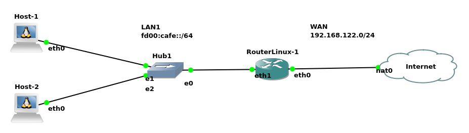

# Conectando uma Rede IPv6 à Internet IPv4 (NAT64/DNS64)

Este documento descreve como configurar um roteador Linux para atuar como um *gateway* de tradução, permitindo que hosts em redes exclusivamente IPv6 acessem a Internet via IPv4.

## 1. Visão Geral do Cenário

Nossa rede de exemplo, é apresentada na figura a seguir:



* **Hosts (Host-1, Host-2):** Clientes Linux que operam *apenas* com IPv6.
* **LAN1 (Rede Interna):** Rede privada IPv6 `fd00:cafe::/64` (ULA - *Unique Local Address*).
* **RouterLinux-1:** O nosso *gateway*, que tem duas interfaces:
    * `eth1` (LAN): Conectada à rede interna.
    * `eth0` (WAN): Conectada à Internet, com um endereço IPv4 (no exemplo, `192.168.122.0/24`, que por sua vez sairá para a Internet via `nat0`).
* **Objetivo:** Permitir que `Host-1` (ex: `fd00:cafe::2`) acesse um *site*, como `google.com`.

> Esse cenário foi implementado no simulador de redes [GNS3](https://gns3.com/). Todos os hosts do cenário são Dockers Linux.

O `cafe` dentro do endereço IPv6 é apenas um endereço fácil de lembrar e divertido, tais como: `dead`, `beef`, `face`, `babe`, `c0de`, etc. Esses são conhecidos como **_hexspeak_**.

## 2. Utilizando IPv6 para acessar Internet via IPv4

Esse cenário **ilustra uma rede que resolveu utilizar IPv6 internamente, mas não possui uma conexão IPv6 nativa com a Internet**. Assim, a ideia é configurar a rede local com endereços IPv6 e, quando for necessário acessar a Internet, **converter esses endereços de IPv6 para IPv4**.

É claro que essa solução não é a ideal, pois **o correto seria ter a rede nativamente IPv6 fim-a-fim**, ou seja, da sua rede até a Internet tudo com IPv6. Entretanto, há casos em que essa solução pode ser necessária, tal como para testes com IPv6 em aulas de Redes de Computadores ou para testes de serviços em um ambiente controlado.

Então, o problema para a implementação deste cenário é duplo:

1.  **Tradução de Pacotes (NAT64):** Em algum momento na rede, **é necessário converter os pacotes IPv6 para IPv4**. Nossos hosts internos só falam IPv6, mas a Internet (majoritariamente) ainda só entende IPv4. Precisamos de um tradutor no meio do caminho, pois a Internet não sabe como rotear um pacote IPv6 para um servidor IPv4 e **isso será feito via NAT64** (*Network Address Translation* do IPv6 para IPv4).

2.  **Resolução de Nomes (DNS64):** Este é o desafio mais sutil e complexo. **Um host IPv6-only precisa de um servidor DNS que "minta" de forma inteligente para ele**. O problema se manifesta de duas formas:
    * **Cenário A: O _site_ só tem IPv4.** Se o `Host-1` pede o IP de `site-antigo.com` (que só tem registro `A`), o servidor DNS normal responderia apenas com um IP IPv4. **O host IPv6 não entende essa resposta e a conexão falha**.
    * **Cenário B: O _site_ tem IPv4 e IPv6 (Dual-Stack).** Se o `Host-1` pede o IP de `google.com.br` (que tem `A` e `AAAA`), o servidor DNS responde com o endereço `AAAA` *real* (ex: `2800:3f0:...`). **O host recebe esse IP, tenta se conectar, mas nosso roteador usando NAT64 não tem uma rota para a Internet IPv6. Então a conexão vai falhar** com `Destination unreachable: No route`.

Portanto, a **nossa solução de DNS64 precisa ser configurada para sempre forçar o tráfego a passar pelo tradutor NAT64**. Ela deve:

1.  Quando um *site* só tiver IPv4, é necessário **criar um endereço IPv6 "falso"** (ex: `64:ff9b::...`) embutindo o IP IPv4 que queremos acessar dentro de um IPv6 que nossa rede e principalmente o roteador NAT64 vai entender;
2.  Quando um *site* tiver *ambos* (IPv4 e IPv6), **ignorar/suprimir o endereço IPv6 real** e, em vez disso, também criar um IPv6 "falso" a partir do IPv4.

Assim, dito o motivo de criar esse tipo de rede e os desafios, vamos à implementação.

> A sugestão aqui é só utilizar esse tipo de rede para testes e não para um ambiente em produção.

## 3. Solução proposta: DNS64 e NAT64

Para resolver o problemas proposto aqui, usamos o roteador Linux para realizar duas funções:

1.  **DNS64 (O "Tradutor de Catálogo"):** Nosso roteador atuará como servidor DNS. Quando um host pedir um IP IPv6 (`AAAA`) e ele não existir, o DNS64 irá "sintetizar" ou "falsificar" um endereço IPv6 especial, embutindo o endereço IPv4 real dentro dele. Na prática essa função será feito com a ferramenta [`bind9`](https://www.isc.org/bind/).

2.  **NAT64 (O "Tradutor de Pacotes"):** Quando o roteador receber um pacote IPv6 destinado a esse endereço "falso", ele irá interceptá-lo, extrair o IP IPv4 de dentro, e criar um pacote IPv4 totalmente novo para enviar à Internet. Ele faz o NAT (Masquerade) do IPv4 e reverte o processo para a resposta. Em nosso cenário isso será feito com a ferramenta [`tayga`](http://www.litech.org/tayga/).

## 4. Passo a Passo: Configurando o Roteador (RouterLinux-1)

Vamos iniciar a configuração prática do cenário de rede e solução/ferramentas propostas.

### Passo 4.1: Configurar as Interfaces de Rede

Vamos configurar a interface `eth0` (WAN) utilizando DHCP, tal como: 

```bash
root@RouterLinux-1:/# dhcpcd eth0

DUID 00:04:4c:4c:45:44:00:36:32:10:80:34:b3:c0:4f:35:34:32
eth0: IAID 49:03:a9:00
eth0: soliciting a DHCP lease
eth0: soliciting an IPv6 router
eth0: offered 192.168.122.187 from 192.168.122.1
eth0: probing address 192.168.122.187/24
eth0: leased 192.168.122.187 for 3600 seconds
eth0: adding route to 192.168.122.0/24
eth0: adding default route via 192.168.122.1
forked to background, child pid 499
```

> No caso do GNS3 utilizando o recurso NAT (nuvem do cenário proposto), o computador real tem um servidor DHCP. Caso no seu cenário não exista tal servidor, você pode configurar manualmente.

Agora vamos configurar a `eth1` (LAN) com um IP estático:

```bash
root@RouterLinux-1:/# ip address add fd00:cafe::1/64 dev eth1
```

Então, neste cenário o RouterLinux-1, tem o IP `192.168.122.187` na `eth0` que é da WAN e o IP `fd00:cafe::1` na `eth1`, que é da LAN.

### Passo 4.2: Habilitar Roteamento

Precisamos dizer ao *kernel* do Linux para encaminhar/rotear pacotes entre suas interfaces, vamos fazer isso diretamente nos arquivos do Linux:

```bash
echo 1 > /proc/sys/net/ipv4/ip_forward
echo 1 > /proc/sys/net/ipv6/conf/all/forwarding 
```

As linhas anteriores habilitam roteamento respectivamente para o IPv4 e IPv6.

> Uma forma mais atual seria utilizando `systemctl` - não vamos fazer o uso desse comando aqui, pois estamos utilizando *containers* Docker e eles têm restrições com esse comando.

### Passo 4.3: Instalar as Ferramentas

Vamos instalar o:
* `tayga` (NAT64) - será o responsável por converter IPv6 para IPv4 utilizando NAT;
* `bind9` (DNS64) - vai converter nomes em endereços IPv4 para os hosts, ou seja, ele não vai fornecer endereços IPv6 para os nomes requisitados. Entretanto ele vai pegar o IPv4 obtido a partir do nome e vai converter em um endereço IPv6 especial; 
* `radvd` - auxilia na configuração automática dos clientes IPv6.

Para instalar esses executamos:

```bash
apt update
apt install bind9 tayga radvd
```

Com os pacotes instalados vamos à configuração.

### Passo 4.4: Configurar o DNS64 (BIND9)

O `bind9` será nosso servidor DNS local. Ele ouvirá as consultas, encaminhará para um DNS público (como o do Google) e ativará a "mágica" do DNS64, incluindo a supressão de respostas `AAAA` reais.

Edite o arquivo de opções do BIND9:

```bash
vi /etc/bind/named.conf.options
```

Substitua todo o conteúdo desse arquivo por esta configuração mínima, focada em testes:

```bash
options {
    directory "/var/cache/bind";

    // Ouvir em "qualquer" endereço IPv6 e IPv4 que a máquina tenha
    listen-on-v6 { any; };
    listen-on { any; };

    // Permitir consultas recursivas de qualquer cliente
    recursion yes;
    allow-query { any; };
    allow-recursion { any; };

    // Usar os DNS públicos
    forwarders {
        8.8.8.8;
        8.8.4.4;
    };
    forward only; // Não tentar resolver sozinho, apenas encaminhar

    // DNS64 - Esta é a parte essencial do nosso cenário.
    dns64 64:ff9b::/96 {
        // qualquer cliente que consultar - este servidor receberá respostas DNS64.
        clients { any; };

        //  Isso diz ao BIND para "ignorar" AAAA reais (IPv6) e forçar a síntese a partir do A (IPv4).
        exclude { ::/0; };
    };
};
```

### Passo 4.5: Configurar o NAT64 (Tayga)

O `tayga` criará uma interface de túnel virtual (NAT64) que fará a tradução.

Edite o arquivo `/etc/tayga.conf`:

```bash
# Prefixo que o DNS64 está usando
prefix 64:ff9b::/96

# O IP IPv6 da interface INTERNA (LAN) do roteador.
# (Esta linha é obrigatória quando usamos IPs privados no pool IPv4)
ipv6-addr fd00:cafe::1

# Pool de endereços IPv4 "falsos" (RFC 1918) que o Tayga usará
# internamente para mapear os clientes IPv6.
dynamic-pool 192.168.255.0/24

# Endereço IPv4 "falso" do próprio Tayga (o "gateway" do pool)
ipv4-addr 192.168.255.1
```

> No arquivo de configuração, pode estar habilitada a rede `2001:db8:1:ffff::/96` e desabilitada a `64:ff9b::/96`. Então é só inverter.

### Passo 4.6: Ativar o Tayga e as Rotas

Precisamos iniciar o `tayga` e, em seguida, configurar as rotas do *kernel* para que o Linux saiba para onde enviar os pacotes.

*  Iniciar o Tayga
```bash
tayga -c /etc/tayga.conf
```
> Verifique se o `tayga` está em execução com o comando `ps ax`. Em caso de erro execute o comando `tayga`, com a opção `-d`, para verificar possíveis erros.

Após iniciar o `tayga`, exetute:

1. "Subir" a interface de túnel virtual:

```bash
ip link set nat64 up
```

2. Atribuir o IP IPv4 "falso" à interface:

```bash
ip addr add 192.168.255.1 dev nat64
```

3. Rota para o pool "falso"

```bash
ip route add 192.168.255.0/24 dev nat64
```

4. ROTA CRUCIAL (IPv6): Dizer ao Linux para enviar todo o tráfego destinado ao prefixo NAT64 para a interface do Tayga

```bash
ip route add 64:ff9b::/96 dev nat64
```

> Neste cenário utilizamos o IP `192.168.255.0/24` para o mapeamento do `tayga`, é claro que este não pode ser uma faixa de IPs que já é utilizado na sua rede, caso contrário vai dar "conflito".

### Passo 4.7: Habilitar o NAT IPv4 (Masquerade)

Neste ponto, o `tayga` traduz `[fd00:cafe::2]` (Cliente) para `[192.168.255.2]` (IP falso). Precisamos de uma segunda tradução para que esse IP falso saia para a Internet com o IP real da eth0. Isso será feito com o uso do `iptables`, tal como:

```bash
# Adiciona uma regra de NAT (Masquerade) para todo o tráfego
# que sair do nosso pool "falso" e for para a internet (eth0)
iptables -t nat -A POSTROUTING -s 192.168.255.0/24 -o eth0 -j MASQUERADE
```

> Caso você esteja em outro cenário, troque a placa de rede e/ou o IP de rede, pela interface de rede que dá acesso à Internet, e o IP que você utilizou no `tayga`.


### Passo 4.8: Configurar o Anúncio de Rede (radvd)

Este é o passo final no roteador. Vamos usar o `radvd` para anunciar automaticamente a rede (`fd00:cafe::/64`) e o nosso servidor DNS (`fd00:cafe::1`) para todos os clientes (Host-1, Host-2). Isso é o SLAAC.

Crie o arquivo `/etc/radvd.conf`:

```bash
interface eth1 {
    # Habilita o envio de Anúncios de Roteador
    AdvSendAdvert on;

    # Define o prefixo que os clientes usarão para autoconfiguração (SLAAC)
    prefix fd00:cafe::/64 {
        AdvOnLink on;
        AdvAutonomous on;
        AdvRouterAddr on;
    };

    # A LINHA MÁGICA (RDNSS): Anuncia o nosso servidor DNS (BIND9)
    # RFC 8106
    RDNSS fd00:cafe::1 {
    };
};
```

Assim, com o `radvd` configurado será possível que os clientes se autoconfigurem para IP, prefixo, *gateway* padrão e DNS, exigindo o mínimo de esforço de configuração por parte dos clientes.

### Passo 4.9: Iniciar os Serviços

Agora, reinicie os *daemons* para carregar as novas configurações.

```bash
/etc/init.d/named start
/etc/init.d/radvd start
```
> O `tayga` também poderia ser iniciado da mesma forma, ou seja, utilizando `script`. Lembrando novamente que provavelmente a maioria dos Linux modernos vão preferir iniciar esses serviços utilizando o `systemctl`.

### 5. Configurando os Clientes (Host-1, Host-2)

Graças ao `radvd` (SLAAC + RDNSS), a configuração do cliente é trivial. A maioria dos sistemas Linux modernos (com `NetworkManager` ou `systemd-networkd`) está configurada para auto por padrão.

Se o seu cliente não se configurar sozinho, verifique sua ferramenta de rede (ex: `NetworkManager`) e garanta que o método IPv6 esteja definido como "Automático" (auto).

Ao ser ativado, o cliente irá:

* Enviar um RS para a rede/roteadores;

* Ouvir o RA do `radvd`;

* Gerar automaticamente um IP (ex: `fd00:cafe::abc:123/64`);

* Adicionar automaticamente o gateway padrão (via `fe80::...` do roteador);

* Configurar automaticamente o servidor DNS (`fd00:cafe::1`) a partir da opção RDNSS.

Também é possível configurar manualmente, tal como:

```bash
root@Host-1:/# ip address add fd00:cafe::2/64 dev eth0
root@Host-1:/# echo "nameserver fd00:cafe::1" > /etc/resolv.conf
root@Host-1:/# ip route add default via fe80::1 dev eth0
```

O mesmo deve ser feito com os outros hosts da rede, tal como o Host-2.

### 6. Verificação Final

Com tudo configurado e em execução, **vamos testar o NAT64, sem o DNS64**. Para isso vamos "pingar" o famoso `8.8.8.8`, só que para isso temos que convertê-lo para o IPv6 metiroso da nossa rede, então esse será o IPv6: `64:ff9b::8.8.8.8`.

```bash
root@Host-1:/# ping -6 64:ff9b::8.8.8.8
PING 64:ff9b::8.8.8.8(64:ff9b::808:808) 56 data bytes
64 bytes from 64:ff9b::808:808: icmp_seq=1 ttl=114 time=13.2 ms
64 bytes from 64:ff9b::808:808: icmp_seq=2 ttl=114 time=13.5 ms
64 bytes from 64:ff9b::808:808: icmp_seq=3 ttl=114 time=13.5 ms
```

O comando e saída anterior mostra que o NAT64 está funcionando corretamente.

Por fim, **vamos testar o DNS64**. Vamos fazer isso pingando o `www.google.com`:

```bash
root@Host-1:/# ping www.google.com   
PING www.google.com(pngrub-ck-in-f4.1e100.net (64:ff9b::8efb:86a4)) 56 data bytes
64 bytes from pngrub-ck-in-f4.1e100.net (64:ff9b::8efb:86a4): icmp_seq=1 ttl=114 time=13.8 ms
64 bytes from pngrub-ck-in-f4.1e100.net (64:ff9b::8efb:86a4): icmp_seq=2 ttl=114 time=14.1 ms
64 bytes from pngrub-ck-in-f4.1e100.net (64:ff9b::8efb:86a4): icmp_seq=3 ttl=114 time=13.6 ms
64 bytes from pngrub-ck-in-f4.1e100.net (64:ff9b::8efb:86a4): icmp_seq=4 ttl=114 time=14.1 ms
```
Se tudo funcionou, você verá as respostas! O host está enviando pacotes IPv6 para o prefixo `64:ff9b::/96`, e o roteador está traduzindo tudo para IPv4 e vice-versa.

## 7. Conclusão

Neste tutorial, demonstramos um método prático e completo para conectar uma rede interna *exclusivamente IPv6* (usando endereços privados ULA, `fd00::/8`) à Internet legada, que ainda opera majoritariamente em IPv4.

Utilizando um roteador Linux como *gateway*, combinamos um conjunto de ferramentas-chave para criar uma "ponte" transparente entre os dois protocolos:

1.  **DNS64 (com `bind9`):** Atuou como o "tradutor de catálogo". Ao interceptar consultas DNS, ele "sintetizou" (criou) registros `AAAA` (IPv6) a partir de registros `A` (IPv4), usando o prefixo especial `64:ff9b::/96`. Crucialmente, o configuramos com `exclude { ::/0; }` para **ignorar** respostas `AAAA` reais, forçando todo o tráfego (mesmo de sites dual-stack) a passar pelo nosso tradutor.
2.  **NAT64 (com `tayga`):** Atuou como o "tradutor de pacotes". Ele interceptou os pacotes IPv6 destinados ao prefixo especial e os traduziu, estado a estado, em pacotes IPv4.
3.  **NAT (com `iptables`):** Realizou a tradução final (`Masquerade`), permitindo que os pacotes IPv4 "falsos" (vindos do *pool* `192.168.255.0/24`) saíssem para a Internet usando o IP público da interface `eth0`.
4.  **SLAAC (com `radvd`):** Facilitou a ponta do cliente, anunciando automaticamente o prefixo da rede (SLAAC) e, crucialmente, o endereço do nosso servidor DNS64 (via `RDNSS`), tornando a configuração do cliente trivial.

O NAT64, combinado com o DNS64, é uma técnica de transição essencial. Ele permite que administradores de rede e organizações comecem a implementar o IPv6 em suas redes internas — aproveitando seu vasto espaço de endereçamento e simplicidade de gerência — sem perder a conectividade vital aos serviços e conteúdos que ainda residem no mundo IPv4.

> Entretanto, lembre que essa solução só é indicada para redes de testes e não para redes em produção - redes em produção devem tentar utilizar IPv6 fim-a-fim.

---

## 8. Referências Bibliográficas

BAGNULO, M.; VAN BEIJNUM, I. (Eds.). **RFC 6147: DNS64: DNS Extensions for Network Address Translation from IPv6 Clients to IPv4 Servers**. Internet Engineering Task Force (IETF), Abr. 2011. Disponível em: https://www.rfc-editor.org/rfc/rfc6147.html. Acesso em: 13 nov. 2025.

BAKER, F.; LI, X.; LIAO, K. (Eds.). **RFC 6146: Stateful NAT64: Network Address and Protocol Translation from IPv6 Clients to IPv4 Servers**. Internet Engineering Task Force (IETF), Abr. 2011. Disponível em: https://www.rfc-editor.org/rfc/rfc6146.html. Acesso em: 13 nov. 2025.

INTERNET SYSTEMS CONSORTIUM (ISC). BIND 9. [S.l.]: ISC, [s.d.]. Disponível em: https://www.isc.org/bind/. Acesso em: 14 nov. 2025.

HINDEN, R.; HABERMAN, B. (Eds.). **RFC 4193: Unique Local IPv6 Unicast Addresses**. Internet Engineering Task Force (IETF), Out. 2005. Disponível em: https://www.rfc-editor.org/rfc/rfc4193.html. Acesso em: 13 nov. 2025.

JEONG, J.; PARK, S.; BELNAVIS, L. (Eds.). **RFC 8106: IPv6 Router Advertisement Options for DNS Configuration**. Internet Engineering Task Force (IETF), Mar. 2017. Disponível em: https://www.rfc-editor.org/rfc/rfc8106.html. Acesso em: 13 nov. 2025.

LITECH. **radvd: the Router Advertisement Daemon**. Site oficial do software radvd. Disponível em: https://radvd.litech.org/. Acesso em: 13 nov. 2025.

LITECH. **Tayga: a user-space NAT64**. Site oficial do software Tayga. Disponível em: https://www.litech.org/tayga/. Acesso em: 13 nov. 2025.

THOMSON, S.; NARTEN, T.; JINMEI, T. (Eds.). **RFC 4862: IPv6 Stateless Address Autoconfiguration**. Internet Engineering Task Force (IETF), Set. 2007. Disponível em: https://www.rfc-editor.org/rfc/rfc4862.html. Acesso em: 13 nov. 2025.