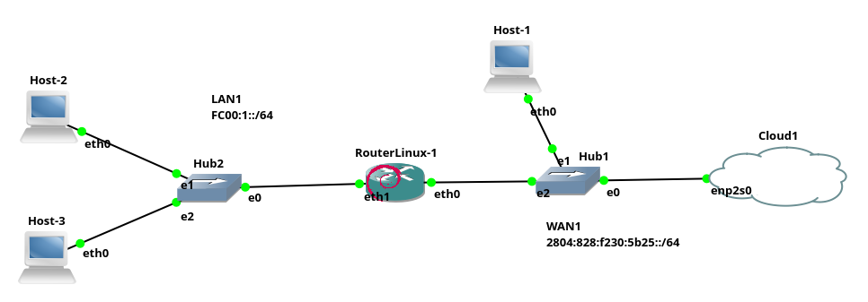

# Configuração básica do IPv6 no Linux

A tecnologia que serve como base para o funcionamento da Internet vem do final da década de 1970 início de 1980. Sendo que, nessa época imaginava-se que o IPv4 (*Internet Protocol version* 4), com seus 2^32 bits para endereços daria conta de todos os *hosts* que seriam conectados à Internet.

Entretanto, com a popularização dos computadores e com o surgimento de conceitos como IoT (Internet of Things), no qual espera-se que cada pessoa/empresa conecte inúmeras "coisas" à Internet, tais como: televisão, geladeira, lâmpada, sensores, video-game, relógio, *smartphone*, etc. Esses 4 bilhões endereços do IPv4 basicamente já se esgotaram.

Para resolver tal problema, surge na década de 1990 o IPv6, que dá a possibilidade de endereçar 1.500 *hosts* por metro quadrado do planeta terra, com os seus 2^128 bits de endereço - que é um valor quase impronunciável e certamente resolve o problema da falta de endereços IPs válidos na Internet. No entanto, mesmo com esse contexto, o IPv6 ainda hoje não substituiu completamente o IPv4, isso por vários motivos, tais como: medo do IPv6 apresentar problemas desconhecidos.

Todavia, a maioria dos sistemas dão suporte ao IPv6 à décadas e principalmente nesses últimos anos nota-se que o IPv6 tem ganhado mais força na Internet e já é possível utilizá-lo, acessando vários recursos da Internet. Assim, para abordar práticas no IPv6.


# IPv6 no Linux - Configuração de Clientes, NAT e endereço *stateless* 

Parece que o IPv6 está cada vez mais próximo de tomar o seu lugar na Internet, ou seja, o IPv6 está ganhando forças para substituir o IPv4 e assim resolver o grande problema da falta de endereços IPv4 válidos na Internet. Neste contexto, fica cada vez mais importante dominar o mínimo a respeito da teoria e prática do IPv6. Desta forma, este material, explica como:

1. Configurar endereços, rotas e DNS em *hosts* Linux, de forma manual e automática;
2. Configurar um roteador Linux com NAT para IPv6;
3. Instalar e configurar um servidor que fornece configuração IPv6 de forma automática e sem controle de estado aos clientes da rede (Stateless address auto-configuration - [SLAAC](https://www.networkacademy.io/ccna/ipv6/stateless-dhcpv6)).

Para tanto, utilizaremos o cenário de rede apresentado a seguir (ver Figura), como exemplo:



A rede da figura anterior é composta basicamente por duas redes, um roteador e *hosts* clientes, sendo esses:

* **LAN1**: que simboliza uma rede local privada, tal como uma casa ou pequena empresa;
* **WAN1**: que representa uma rede pública que interconecta a LAN à Internet.
* **RouterLinux-1**: este é um roteador Linux utilizado para Interconectar a LAN1 à WAN1 e consequentemente à Internet. Neste será configurado o NAT, e o servidor de configuração automática de rede dos clientes IPv6.
* **Hosts[1-3]**: Todos os *hosts* da rede são Linux (Debian 10). O Host-1 está na WAN1 e tem como roteador um computador que está dentro da nuvem (*cloud1*). Os demais *hosts*, estão na LAN1 que por sua vez está atrás do NAT que será configurado no RoteadorLinux-1.

> Todo esse cenário de rede foi implementado no simulador de redes [GNS3](https://gns3.com/).

As configurações dos *hosts* e serviços do cenários IPv6 proposto são apresentadas a seguir.

## Configuração do Host-1

Vamos iniciar a configuração com o Host-1, que é um *host* conectado à WAN1. Tal rede tem como roteador um *host* que está dentro da nuvem (*cloud*) do cenário. O Host-1 pode ser configurado utilizando-se um servidor DHCP que também está oculto na rede. A configuração do Host-1 será feita de forma automática, via DHCP, tal como pode ser visto a seguir, com o comando ``dhcpcd``:

 ```console
root@Host-1:/# dhcpcd -6 -i eth0 
DUID 00:04:4c:4c:45:44:00:36:32:10:80:34:b3:c0:4f:35:34:32
eth0: IAID f6:e8:46:c9
eth0: soliciting an IPv6 router
eth0: Router Advertisement from fe80::c6e9:84ff:fe66:510e
eth0: adding address fd1b:e114:982d:0:bf3:3344:47af:8cbe/64
eth0: adding route to fd1b:e114:982d::/64
eth0: soliciting a DHCPv6 lease
eth0: Router Advertisement from fe80::1
eth0: adding address 2804:828:f230:5b25:96ae:4ff3:e9fd:cf62/64
eth0: adding route to 2804:828:f230:5b25::/64
eth0: adding default route via fe80::1
eth0: ADV fd1b:e114:982d::5f8/128 from fe80::c6e9:84ff:fe66:510e
eth0: accepted reconfigure key
eth0: REPLY6 received from fe80::c6e9:84ff:fe66:510e
eth0: adding address fd1b:e114:982d::5f8/128
eth0: renew in 21600, rebind in 34560, expire in 4294967295 seconds
forked to background, child pid 111
```

O comando ``dhcpcd -6 -i eth0`` foi utilizado para obter apenas configurações de rede IPv6, sendo as opções deste comando do exemplo:

* ``-6``, diz para utilizar apenas IPv6 (não IPv4);

* ``-i eth0``, informa para fazer o pedido DHCP, apenas na interface ``eth0``, que é a única no *hosts* clientes do cenário.

Já a saída do comando anterior, mostra que o pedido ao servidor DHCP, foi atendido com sucesso, já que por exemplo, foram fornecidos alguns endereços IPs, tais como:
``eth0: adding address 2804:828:f230:5b25:96ae:4ff3:e9fd:cf62/64``.

> Atenção, neste exemplo estamos utilizando o comando ``dhcpcd``, mas talvez o comando mais comum no Linux atualmente é o ``dhclient``. Já no ambiente gráfico do Linux, será utilizado provavelmente o [Network Manager](https://pt.wikipedia.org/wiki/NetworkManager). Então a escolha do programa DHCP cliente, fica à sua escolha ou da distribuição Linux que você está utilizando.

Vamos verificar quais foram as configurações de rede obtidas via IPv6:

```console
root@Host-1:/# ip -6 address
1: lo: <LOOPBACK,UP,LOWER_UP> mtu 65536 state UNKNOWN qlen 1000
    inet6 ::1/128 scope host 
       valid_lft forever preferred_lft forever
8: eth0: <BROADCAST,MULTICAST,UP,LOWER_UP> mtu 1500 state UNKNOWN qlen 1000
    inet6 fd1b:e114:982d::5f8/128 scope global noprefixroute 
       valid_lft forever preferred_lft forever
    inet6 2804:828:f230:5b25:96ae:4ff3:e9fd:cf62/64 scope global dynamic mngtmpaddr noprefixroute 
       valid_lft 86094sec preferred_lft 3294sec
    inet6 fd1b:e114:982d:0:bf3:3344:47af:8cbe/64 scope global mngtmpaddr noprefixroute 
       valid_lft forever preferred_lft forever
    inet6 fd1b:e114:982d:0:ac81:f6ff:fee8:46c9/64 scope global dynamic mngtmpaddr 
       valid_lft forever preferred_lft forever
    inet6 2804:828:f230:5b25:ac81:f6ff:fee8:46c9/64 scope global deprecated dynamic mngtmpaddr 
       valid_lft 72508sec preferred_lft 0sec
    inet6 fe80::ac81:f6ff:fee8:46c9/64 scope link 
       valid_lft forever preferred_lft forever
```

Na saída do comando ``ip -6 address`` anterior, são apresentadas duas interfaces de rede: ``lo`` e ``eth0``. A primeira é a interface de *loopback* que tem o endereço IPv6 ``::1``. Já a outra é a primeira interface Ethernet, no caso a ``eth0``, tal interface possui os seguintes IPs:

* ``fd1b:e114:982d::5f8``, ``fd1b:e114:982d:0:bf3:3344:47af:8cbe``, ``fd1b:e114:982d:0:ac81:f6ff:fee8:46c9``: Esses são endereços locais únicos (*Unique Local Address* - [ULA](https://www.ipv6.br/post/enderecamento/)). Tais endereços iniciam com *fd* se forem atribuídos localmente (ex. pelo próprio *host*). Já se iniciasse com *fc*, seriam atribuídos por uma organização (ex. o administrador de rede da empresa). Tanto *fd* quando *fc* representam os antigos endereços IPs privados, ou seja, não roteáveis na Internet (10.0.0.0/8, 172.16.0.0/12 e 192.168.0.0/16);
* ``fe80::ac81:f6ff:fee8:46c9``: Tal endereço é um *link local*, ou seja, esse endereço não é roteável entre redes. Tal endereço é atribuído automaticamente pelo próprio computador e se um roteador receber pacotes IPv6 com esse endereço, ele não deve roteá-lo.
* ``2804:828:f230:5b25:96ae:4ff3:e9fd:cf62``: Esse é um endereço *unicast* global (*Global Unicast Address*), ou seja, é um endereço IP público, válido na Internet;

Bem, como é possível ver, há vários endereços IPv6 atribuídos à uma única interface de rede, no exemplo a ``eth0``. Tentando resumir, no geral quando liga-se um computador Linux na rede IPv6 pode ocorrer o seguinte:

1. Mesmo se ele não tiver conectado à rede, ele receberá um endereço IPv6 iniciado com ``fe80``, tal endereço servirá apenas para conectar aos computadores da rede local. No exemplo foi o IP ``fe80::ac81:f6ff:fee8:46c9``. É muito importante notar que o endereço ``fe80``, foi concatenado com parte do endereço MAC do *host*, que no caso é: ``ae:81:f6:e8:46:c9`` (utilize o comando ``ip link``, para ver o endereço MAC das interfaces). Tal concatenação, do endereço IPv6 com o endereço MAC da interface de rede é chamada de [EUI-64](https://www.catchpoint.com/benefits-of-ipv6/eui-64) (*Extended Unique Indetifier*);

> A técnica EUI-64 é utilizada constantemente em endereços IPv6, então é muito importante entender e observar isso.

2. Ao conectar o computador à uma rede com roteador IPv6, é bem provável que este receberá automaticamente (sem precisar executar nenhum comando) IPs iniciados com: 
   * ``fd1b`` - que é para conectar em outras redes locais - ULA, antigo IP privado. Que na saída foi o IP ``fd1b:e114:982d:0:ac81:f6ff:fee8:46c9``;
   * ``2804`` - que é um IP válido na Internet, mas para isso é necessário que o roteador esteja conectado à Internet e forneça tais IPs. Que no exemplo foi o IP ``2804:828:f230:5b25:ac81:f6ff:fee8:46c9``. Neste ponto o computador provavelmente também terá configurada a rota padrão e já poderá acessar a Internet via endereço IP, mas talvez não navegará por nomes, o que geralmente inviabiliza o acesso "convencional" à Internet, pois essa normalmente se dá através de nomes e não de endereços IPs.
3. Ao pedir diretamente a configuração de rede, por exemplo via comando ``dhcpcd``, será realizada então toda a configuração necessária para acessar a rede: IP, rota padrão e servidor de nomes. Isso é claro, caso exista servidores DHCP ou similares. Neste ponto, um servidor DHCP, pode fornecer: 
   * Outro endereço IPv6 público, só que agora que não utiliza o final do endereço MAC (EUI-64), ou seja, é um IP que ele está controlando via DHCP (não *stateless*). No exemplo, foi fornecido o IP ``2804:828:f230:5b25:96ae:4ff3:e9fd:cf62`` e o mesmo pode acontecer para um endereço ULA (privado), que no caso foi dado o IP ``fd1b:e114:982d:0:bf3:3344:47af:8cbe``.

Vamos conferir a rota padrão e o servidor de nomes conseguidos via DHCP:

* Rota padrão:

```console
root@Host-1:/# ip -6 route  
2804:828:f230:5b25::/64 dev eth0 proto ra metric 208 pref medium
fd1b:e114:982d::/64 dev eth0 proto ra metric 208 mtu 1500 pref medium
fe80::/64 dev eth0 proto kernel metric 256 pref medium
default via fe80::1 dev eth0 proto ra metric 208 pref medium
```
Na saída anterior do comando ``ip -6 route``, são apresentadas rotas para as redes ``2804:828:f230:5b25::/64``, ``fd1b:e114:982d::/64`` e ``fe80::/64``, que são redes referentes aos IPs que obtivemos de forma automática. Talvez a rota mais importante a ser notada é à ``default``, que permite que este computador se conecte à outras redes. Assim, o endereço fe80::1 deve ser um IP atribuído ao roteador que está dentro do *cloud*.

* Servidor de nomes (DNS):

```console
root@Host-1:/# cat /etc/resolv.conf
# Generated by resolvconf
nameserver fd1b:e114:982d::1
nameserver fe80::1%eth0
```

Na saída obtida anteriormente, observa-se que o Host-1 foi configurado para utilizar dois servidores de nomes (``nameservers``), sendo esses: ``fd1b:e114:982d::1`` e ``fe80::1``, ambos devem se referir ao roteador que está escondido dentro da nuvem (*cloud*).

### Teste de conectividade do Host-1

Agora vamos ver se o Host-1 consegue se conectar à Internet, vamos fazer isso através do comando ``ping``, "pingando" um nome na Internet, tal como:

```console
root@Host-1:/# ping www.google.com.br
PING www.google.com.br(2800:3f0:4001:82f::2003 (2800:3f0:4001:82f::2003)) 56 data bytes
64 bytes from 2800:3f0:4001:82f::2003 (2800:3f0:4001:82f::2003): icmp_seq=1 ttl=118 time=15.2 ms
64 bytes from 2800:3f0:4001:82f::2003 (2800:3f0:4001:82f::2003): icmp_seq=2 ttl=118 time=16.3 ms
64 bytes from 2800:3f0:4001:82f::2003 (2800:3f0:4001:82f::2003): icmp_seq=3 ttl=118 time=14.9 ms
```

Dada esta resposta positiva (o comando ``ping`` apresentando tempo de ida e volta dos pacotes), confirmamos que a conexão IPv6 com a Internet foi bem sucedida.

> Neste cenário com apenas interface texto seria possível testar o acesso à Internet, utilizando por exemplo um navegador texto, tal como o ``lynx``, por exemplo ``lynx www.google.com.br``.

A seguir vamos configurar o roteador Linux, para que este dê acesso à Internet para a LAN1.

## Configuração do RouterLinux-1

O RouterLinux, é um computador com quatro placas Ethernet, sendo a primeira (``eth0``) conectada à WAN1/Internet e a segunda (``eth1``) conectada à LAN1. Esse Linux é um Debian 10, assim como todos os outros *hosts* do cenário.

Então, para a configuração do RouterLinux, vamos iniciar configurando as placas de rede. Primeiro vamos obter, via DHCP, os IPs fornecidos pela WAN1. Isso é feito da seguinte forma:

```console
root@RouterLinux-1:/# dhcpcd -6 -i eth0
DUID 00:04:4c:4c:45:44:00:36:32:10:80:34:b3:c0:4f:35:34:32
eth0: IAID 7b:ec:eb:b3
eth1: IAID e7:a8:c1:69
eth2: IAID f2:de:73:dd
eth3: IAID 22:6b:69:ad
eth1: soliciting an IPv6 router
eth3: soliciting an IPv6 router
eth0: soliciting an IPv6 router
eth0: Router Advertisement from fe80::c6e9:84ff:fe66:510e
eth0: adding address fd1b:e114:982d:0:39ab:6d36:ad0b:4ad8/64
eth0: adding route to fd1b:e114:982d::/64
eth0: soliciting a DHCPv6 lease
eth0: Router Advertisement from fe80::1
eth0: adding address 2804:828:f230:5b25:2b38:7c34:671f:4c1e/64
eth0: adding route to 2804:828:f230:5b25::/64
eth0: adding default route via fe80::1
eth2: soliciting an IPv6 router
eth0: ADV fd1b:e114:982d::b7b/128 from fe80::c6e9:84ff:fe66:510e
eth0: accepted reconfigure key
eth0: REPLY6 received from fe80::c6e9:84ff:fe66:510e
eth0: adding address fd1b:e114:982d::b7b/128
eth0: renew in 21600, rebind in 34560, expire in 4294967295 seconds
forked to background, child pid 121
```

O que foi feito anteriormente, é o mesmo procedimento realizado no Host-1, explicado anteriormente. Lembrando que isso já vai configurar o endereço IP da ``eth0``, a rota padrão e o servidor de nomes - tudo de forma automática, via DHCP.

### Configurando IP manualmente, roteamento IPv6 e NAT IPv6

Anteriormente, na ``eth0``, obtivemos as configurações via DHCP, mas já na ``eth1``, não dá para obter essa configuração da mesma forma, já que a princípio os pacotes DHCP não passam de uma rede para outra (da LAN1 para a WAN1). Então vamos configurar a seguir:

1. Endereço IPv6 da ``eth1``;
2. Habilitar o roteamento IPv6;
3. Configurar o NAT.

```console
root@RouterLinux-1:/# ip -6 address add fc00:1::1/64 dev eth1
root@RouterLinux-1:/# echo 1 > /proc/sys/net/ipv6/conf/all/forwarding
root@RouterLinux-1:/# ip6tables -t nat -A POSTROUTING -o eth0 -j MASQUERADE
```

Nos comandos anteriores, temos:

1. Configuramos a ``eth1`` com o IP ``fc00:1::1/64``. Esse será o IP desse roteador na LAN1.
2. Para um *host* Linux trabalhar como roteador é necessário ativar tal função, isso é feito no arquivo ``/proc/sys/net/ipv6/conf/all/forwarding``, colocando o conteúdo desse em 1 - caso seja 0, o roteamento está desabilitado;
3. Para a LAN1, foi dado uma faixa de IP ULA/privada, que não é roteável na Internet (no caso ``fc00:1::/64``). Assim, tal rede não poderia acessa a Internet, desta forma, para que a LAN1 possa acessar a Internet vamos utilizar um NAT, dizendo via ``iptables``, que tudo que for sair para a Internet/WAN1 (``-o eth0``), deve receber o IP válido na Internet que estiver na ``eth0``, neste caso é o IP ``2804:828:f230:5b25:96ae:4ff3:e9fd:cf62``.

> Com IPv6 não seria necessário utilizar o NAT para acessar a Internet, mas de qualquer forma o NAT existe no IPv6 e vamos utilizá-lo aqui neste exemplo, já que não estamos subdividindo a rede IPv6 que obtivemos do provedor. Mesmo com o *overhead* do NAT, ele ainda é interessante no IPv6 por tornar a rede oculta, dentre outros benefícios.

Os comandos a seguir mostram como ficaram as configurações realizadas até agora no Router-Linux:

*  Verificando os IPs das interfaces de Rede:

```console
root@RouterLinux-1:/# ip a
1: lo: <LOOPBACK,UP,LOWER_UP> mtu 65536 qdisc noqueue state UNKNOWN group default qlen 1000
    link/loopback 00:00:00:00:00:00 brd 00:00:00:00:00:00
    inet 127.0.0.1/8 scope host lo
       valid_lft forever preferred_lft forever
    inet6 ::1/128 scope host 
       valid_lft forever preferred_lft forever
6: eth0: <BROADCAST,MULTICAST,UP,LOWER_UP> mtu 1500 qdisc fq_codel state UNKNOWN group default qlen 1000
    link/ether 82:de:7b:ec:eb:b3 brd ff:ff:ff:ff:ff:ff
    inet6 fd1b:e114:982d::b7b/128 scope global noprefixroute 
       valid_lft forever preferred_lft forever
    inet6 2804:828:f230:5b25:2b38:7c34:671f:4c1e/64 scope global dynamic mngtmpaddr noprefixroute 
       valid_lft 86336sec preferred_lft 3536sec
    inet6 fd1b:e114:982d:0:39ab:6d36:ad0b:4ad8/64 scope global mngtmpaddr noprefixroute 
       valid_lft forever preferred_lft forever
    inet6 fd1b:e114:982d:0:80de:7bff:feec:ebb3/64 scope global dynamic mngtmpaddr 
       valid_lft forever preferred_lft forever
    inet6 2804:828:f230:5b25:80de:7bff:feec:ebb3/64 scope global dynamic mngtmpaddr 
       valid_lft 85770sec preferred_lft 2970sec
    inet6 fe80::80de:7bff:feec:ebb3/64 scope link 
       valid_lft forever preferred_lft forever
9: eth1: <BROADCAST,MULTICAST,UP,LOWER_UP> mtu 1500 qdisc fq_codel state UNKNOWN group default qlen 1000
    link/ether b2:95:e7:a8:c1:69 brd ff:ff:ff:ff:ff:ff
    inet6 fc00:1::1/64 scope global 
       valid_lft forever preferred_lft forever
    inet6 fe80::b095:e7ff:fea8:c169/64 scope link 
       valid_lft forever preferred_lft forever
...
```

* Verificando as rotas IPv6:

```console
root@RouterLinux-1:/# ip -6 route
2804:828:f230:5b25::/64 dev eth0 proto ra metric 206 pref medium
fc00:1::/64 dev eth1 proto kernel metric 256 pref medium
fd1b:e114:982d::/64 dev eth0 proto ra metric 206 mtu 1500 pref medium
fe80::/64 dev eth0 proto kernel metric 256 pref medium
fe80::/64 dev eth1 proto kernel metric 256 pref medium
fe80::/64 dev eth2 proto kernel metric 256 pref medium
fe80::/64 dev eth3 proto kernel metric 256 pref medium
default via fe80::1 dev eth0 proto ra metric 206 pref medium
```

* Verificando o DNS:

```console
root@RouterLinux-1:/# cat /etc/resolv.conf
# Generated by resolvconf
nameserver fd1b:e114:982d::1
nameserver fe80::1%eth0
```

* Verificando conectividade com a Internet:

```console
root@RouterLinux-1:/# ping www.google.com.br
PING www.google.com.br(2800:3f0:4001:82f::2003 (2800:3f0:4001:82f::2003)) 56 data bytes
64 bytes from 2800:3f0:4001:82f::2003 (2800:3f0:4001:82f::2003): icmp_seq=1 ttl=117 time=15.0 ms
64 bytes from 2800:3f0:4001:82f::2003 (2800:3f0:4001:82f::2003): icmp_seq=2 ttl=117 time=14.8 ms
64 bytes from 2800:3f0:4001:82f::2003 (2800:3f0:4001:82f::2003): icmp_seq=3 ttl=117 time=17.7 ms
```

Os comandos e as saídas apresentadas anteriormente são bem similares ao que foi feito em Host-1. A única grande diferença é que temos um IP em ``eth1``, que não existia no Host-1.

Assim, dadas as configurações no RouterLinux-1, vamos ver se esse realmente está funcionando como roteador para LAN1.

## Configurando o Host-2

O Host-2, é um computador Linux na LAN1, vamos configurá-lo manualmente para que este utilize o RouterLinux-1 para acessa à Internet. Isso é feito basicamente os três comandos a seguir:

```console
root@Host-2:/# ip -6 address add fc00:1::2/64 dev eth0
root@Host-2:/# ip -6 route add default via fc00:1::1
root@Host-2:/# echo nameserver 2606:4700:4700::1111 > /etc/resolv.conf
```

Nos comandos anteriores, em ordem fizemos o seguinte:

1. Atribui o IP ``fc00:1::2/64`` ao *host*;
2. Informa que a rota padrão é o RouterLinux-1 (``fc00:1::1``);
3. Configura como servidor de nomes o ``2606:4700:4700::1111``.

Vamos ver como ficaram essas configurações:

* IP do *host*:

```console
root@Host-2:/# ip -6 address show dev eth0
7: eth0: <BROADCAST,MULTICAST,UP,LOWER_UP> mtu 1500 qdisc fq_codel state UNKNOWN group default qlen 1000
    inet6 fc00:1::2/64 scope global 
       valid_lft forever preferred_lft forever
    inet6 fe80::54ae:67ff:fec4:a032/64 scope link 
       valid_lft forever preferred_lft forever
```

* Rotas:

```console
root@Host-2:/# ip -6 route
fc00:1::/64 dev eth0 proto kernel metric 256 pref medium
fe80::/64 dev eth0 proto kernel metric 256 pref medium
default via fc00:1::1 dev eth0 metric 1024 pref medium
```

* Servidor DNS:

```console
root@Host-2:/# cat /etc/resolv.conf 
nameserver 2606:4700:4700::1111
```

Por fim, no Host-2, vamos realizar o teste de conectividade:

```console
root@Host-2:/# ping www.google.com   
PING www.google.com(2800:3f0:4001:82d::2004 (2800:3f0:4001:82d::2004)) 56 data bytes
64 bytes from 2800:3f0:4001:82d::2004 (2800:3f0:4001:82d::2004): icmp_seq=1 ttl=117 time=14.9 ms
64 bytes from 2800:3f0:4001:82d::2004 (2800:3f0:4001:82d::2004): icmp_seq=2 ttl=117 time=17.6 ms
```

Com o resultado obtido, significa que o Host-2 foi configurado com sucesso e principalmente que o RouterLinux-1 está funcionando como roteador e fazendo NAT dos pacotes que saem da LAN1 em direção da WAN1 ou da Internet.

## Auto-configuração do IPv6

Fizemos a configuração manual no Host-2 na LAN1, isso é legal, mas atualmente se espera que a configuração de rede seja automática - não manual. Bem isso no IPv4 era conseguido basicamente com o DHCP, que tinha que manter uma lista de clientes e quais IPs ele havia emprestado, mas no IPv6 utilizando o EUI-64, é possível fazer a configuração automática da rede, sem ter que controlar a atribuição de IPs (*stateless*). Vamos fazer isso aqui utilizando um serviço chamado [RADVD](https://linux.die.net/man/8/radvd).

Bem, para contextualizar, antes de configurar o RADVD, no RouterLinux-1, se tentarmos obter as configurações de rede no Host-3, o resultado é esse:

* Tentando obter um IP no Host-3

```console
root@Host-3:/# dhcpcd -6 -i eth0
DUID 00:04:4c:4c:45:44:00:36:32:10:80:34:b3:c0:4f:35:34:32
eth0: IAID d7:ad:1d:6f
eth0: soliciting an IPv6 router
eth0: no IPv6 Routers available
timed out
forked to background, child pid 55
```

Ou seja, não foi possível obter as configurações de forma automática. Então, vamos configurar um serviço no RouterLinux que forneça, sem muito controle (*stateless*), as configurações de rede para os *hosts* da LAN1.

### Configurando o RADVD

Para instalar o *Route Advertisement Daemon* (RADVD) para IPv6 e assim configurar endereços IPv6 de forma [SLAAC](https://www.networkacademy.io/ccna/ipv6/stateless-dhcpv6) (*Stateless address auto-configuration*), vamos fazer o seguinte no RouterLinux-1, com o seu Debian:

* Atualizar a base de pacotes:

```console
root@RouterLinux-1:/# apt update
Hit:1 http://deb.debian.org/debian bullseye InRelease
Get:2 http://deb.debian.org/debian-security bullseye-security InRelease [48.4 kB]
Get:3 http://deb.debian.org/debian bullseye-updates InRelease [44.1 kB]
Get:4 http://deb.debian.org/debian-security bullseye-security/main amd64 Packages [273 kB]
Fetched 366 kB in 1s (727 kB/s)   
Reading package lists... Done
Building dependency tree... Done
Reading state information... Done
2 packages can be upgraded. Run 'apt list --upgradable' to see them.
```

* Instalar o ``radvd`` com o ``apt install``:

```console
root@RouterLinux-1:/# apt install radvd
Reading package lists... Done
Building dependency tree... Done
Reading state information... Done
The following NEW packages will be installed:
  radvd
0 upgraded, 1 newly installed, 0 to remove and 2 not upgraded.
Need to get 75.1 kB of archives.
After this operation, 170 kB of additional disk space will be used.
Get:1 http://deb.debian.org/debian bullseye/main amd64 radvd amd64 1:2.18-3 [75.1 kB]
Fetched 75.1 kB in 0s (439 kB/s)
debconf: delaying package configuration, since apt-utils is not installed
Selecting previously unselected package radvd.
(Reading database ... 13134 files and directories currently installed.)
Preparing to unpack .../radvd_1%3a2.18-3_amd64.deb ...
Unpacking radvd (1:2.18-3) ...
Setting up radvd (1:2.18-3) ...
invoke-rc.d: could not determine current runlevel
invoke-rc.d: policy-rc.d denied execution of start.
```

* Criar o arquivo de configuração do ``radvd``:

```console
root@RouterLinux-1:/# cat /etc/radvd.conf 
interface eth1 {
	AdvSendAdvert on;
	MinRtrAdvInterval 3;
	MaxRtrAdvInterval 10;
	prefix fc00:1::/64
	{
		AdvOnLink on;
		AdvAutonomous on;
	};
	RDNSS 2606:4700:4700::1111 {
		AdvRDNSSLifetime 3600;		
	};
};
```

O arquivo anterior basicamente faz o seguinte:

1. Diz que o anuncio de rota via IPv6 deve ser feito pela ``eth1``, utilizando a rede ``fc00:1::/64``. 
2. Também configuramos para que seja passado nos anúncios, o endereço do servidor de nomes à ser utilizado pelos *hosts*, que no caso é o ``RDNSS 2606:4700:4700::1111``.

> Não é intenção deste material esgotar as possibilidades de configurações do [RADVD](https://linux.die.net/man/8/radvd), para isso procure por materiais na Internet.


Feita a configuração vamos iniciar o serviço:

```console
root@RouterLinux-1:/# /etc/init.d/radvd start
Starting radvd: radvd.
```

> O serviço pode ser iniciado de outras formas, como por exemplo via ``systemctl``.

Agora, com o RADVD instalado, configurado e devidamente em execução, vamos tentar novamente obter um IP para o Host-3:

```console
root@Host-3:/# dhcpcd -i eth0 -6   
DUID 00:04:4c:4c:45:44:00:36:32:10:80:34:b3:c0:4f:35:34:32
eth0: IAID d7:ad:1d:6f
eth0: soliciting an IPv6 router
eth0: Router Advertisement from fe80::b095:e7ff:fea8:c169
eth0: adding address fc00:1::c083:d7ff:fead:1d6f/64
eth0: adding route to fc00:1::/64
eth0: adding default route via fe80::b095:e7ff:fea8:c169
forked to background, child pid 432
```
A saída do comando anterior mostra que conseguimos obter as configurações do RouterLinux-1.

> Note que apesar que utilizar um comando chamado ``dhcpcd``, não significa que estamos necessariamente pegando dados de um servidor DHCP, neste caso por exemplo é do RADVD.


Só para conferir se tudo realmente funcionou, vamos executar os comandos que já fizemos anteriormente nos outros *hosts*:

```console
root@Host-3:/# ip address show dev eth0
12: eth0: <BROADCAST,MULTICAST,UP,LOWER_UP> mtu 1500 qdisc fq_codel state UNKNOWN group default qlen 1000
    link/ether c2:83:d7:ad:1d:6f brd ff:ff:ff:ff:ff:ff
    inet6 fc00:1::c083:d7ff:fead:1d6f/64 scope global dynamic mngtmpaddr noprefixroute 
       valid_lft 86399sec preferred_lft 14399sec
    inet6 fe80::c083:d7ff:fead:1d6f/64 scope link 
       valid_lft forever preferred_lft forever

root@Host-3:/# ip -6  route
fc00:1::/64 dev eth0 proto ra metric 212 pref medium
fe80::/64 dev eth0 proto kernel metric 256 pref medium
default via fe80::b095:e7ff:fea8:c169 dev eth0 proto ra metric 212 pref medium

root@Host-3:/# cat /etc/resolv.conf
# Generated by resolvconf
nameserver 2606:4700:4700::1111

root@Host-3:/# ping www.archlinux.org
PING www.archlinux.org(archlinux.org (2a01:4f9:c010:6b1f::1)) 56 data bytes
64 bytes from archlinux.org (2a01:4f9:c010:6b1f::1): icmp_seq=1 ttl=40 time=241 ms
64 bytes from archlinux.org (2a01:4f9:c010:6b1f::1): icmp_seq=2 ttl=40 time=238 ms
```

Anteriormente temos as seguintes saídas em blocos:

1. IPs obtidos;
2. Rotas obtidas;
3. DNS obtido;
4. Teste de ``ping`` mostrando sucesso em chegar na Internet em ``archlinux.org``.

Feita tais configurações, a partir de agora é possível conectar qualquer *host* na LAN1, que todas as configurações serão realizadas automaticamente, sem a necessidade de configuração manual.

## Conclusão

A configuração deste cenário de rede IPv6 básica, mostrou alguns conceitos do IPv6, mas principalmente práticas Linux no IPv6. Também demostra que já é possível utilizar em boa parte a Internet através do  IPv6, pois por exemplo, a atualização de pacotes (``apt``) e os testes de ``ping`` foram realizados com sucesso apenas com IPv6, ou seja, sem nada de IPv4. Assim, recomenda-se conhecer mais do IPv6 e treiná-lo, para que quando esse novo protocolo dominar a Internet, são sejamos pegos de surpresa.


# Bibliografia

ARCHLINUX. **IPv6**. Disponível em: <https://wiki.archlinux.org/title/IPv6>. Acessado em: 28 jun. 2024.

BIERINGER, Peter. **Linux IPv6 HOWTO (pt_BR)**. Disponível em: <https://mirrors.deepspace6.net/howtos/Linux+IPv6-HOWTO.pt_BR.pdf>. Acessado em: 28 jun. 2024.

CATCHPOINT. **EUI-64**. Disponível em: <https://www.catchpoint.com/benefits-of-ipv6/eui-64>. Acessado em: 28 jun. 2024.

CISCO. **IPv6 Addressing and Basic Connectivity Configuration Guide, Cisco IOS Release 15M&T**. Disponível em: <https://www.cisco.com/c/en/us/td/docs/ios-xml/ios/ipv6_basic/configuration/15-mt/ip6b-15-mt-book/ip6-uni-routing.html>. Acessado em: 28 jun. 2024.

CISCO. **Use OSPFv3 Configuration Example**. Disponível em: <https://www.cisco.com/c/en/us/support/docs/ip/ip-version-6-ipv6/112100-ospfv3-config-guide.html>. Acessado em: 28 jun. 2024.

CISCO. **Use OSPFv3 Configuration Example**. Disponível em: <https://www.cisco.com/c/en/us/support/docs/ip/ip-version-6-ipv6/112100-ospfv3-config-guide.html>. Acessado em: 28 jun. 2024.

CISCO. **Exemplo de Configuração de BGP Multiprotocolo para IPv6**. Disponível em: <https://www.cisco.com/c/pt_br/support/docs/ip/ip-version-6-ipv6/112135-ipv6-bgp-00.html>. Acessado em: 28 jun. 2024.

CISCO. **Exemplo de configuração de IPv6 para BGP com dois provedores de serviços diferentes (multihoming)**. Disponível em: <https://www.cisco.com/c/pt_br/support/docs/ip/ip-routed-protocols/112228-bgp2isp-00.htmll>. Acessado em: 28 jun. 2024.

CISCO. **IPv6 Routing: RIP for IPv6**. Disponível em: <https://www.cisco.com/c/en/us/td/docs/ios-xml/ios/iproute_rip/configuration/xe-3s/asr1000/ip6-rip-xe.html>. Acessado em: 28 jun. 2024.

DIE.NET. **radvd(8) - Linux man page**. Disponível em: <https://linux.die.net/man/8/radvd>. Acessado em: 28 jun. 2024.

GEEKSFORGEEKS. **Configuring RIP for IPv6 – RIPng in Cisco**. Disponível em: <https://www.geeksforgeeks.org/configuring-rip-for-ipv6-ripng-in-cisco/>. Acessado em: 28 jun. 2024.

IPV6.BR. **Endereçamento**. Disponível em: <https://www.ipv6.br/post/enderecamento/>. Acessado em: 28 jun. 2024.

IONOS. **IPv6: Basics**. Disponível em: <https://www.ionos.com/help/server-cloud-infrastructure/ip-addresses/ipv6-basics/#:~:text=While%20IPv6%20addresses%20with%20the,to%20connect%20to%20the%20Internet.>. Acessado em: 28 jun. 2024.

LINUX.COM. **IPv6 Auto-Configuration in Linux**. Disponível em: <https://www.linux.com/topic/networking/ipv6-auto-configuration-linux/>. Acessado em: 28 jun. 2024.

MONKEY, Cloistered. **The Linux IPv6 Router Advertisement Daemon (radvd)**. Disponível em: <https://necromuralist.github.io/posts/the-linux-ipv6-router-advertisement-daemon-radvd/>. Acessado em: 28 jun. 2024.

NETWORKACADEMY. **Stateless DHCPv6**. Disponível em: <https://www.networkacademy.io/ccna/ipv6/stateless-dhcpv6>. Acessado em: 28 jun. 2024.

TANENBAUM, Andrew S.; WETHERALL, David J. **Redes de Computadores**. 5. ed. São Paulo: Pearson, 2011.

REDHAT. **Configuring the radvd daemon for IPv6 routers**. Disponível em: <https://access.redhat.com/documentation/pt-br/red_hat_enterprise_linux/7/html/networking_guide/sec-configuring_the_radvd_daemon_for_ipv6_routers>. Acessado em: 28 jun. 2024.


 
