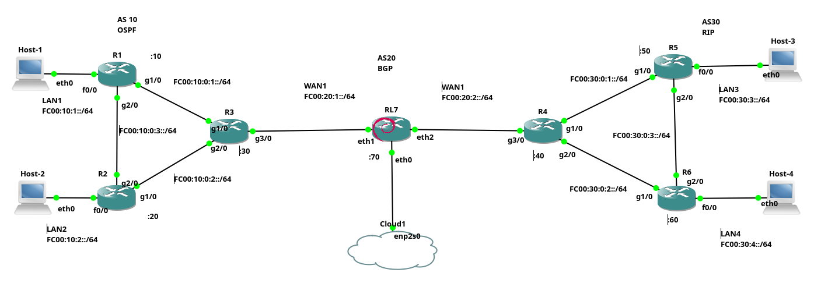

Dado o exemplo básico de configuração de rede IPv6 do [Exemplo 1](ipv6_redeBasica) (apresentada anteriormente). Vamos configurar agora um cenário de rede um pouco mais complexo, que é o ilustrado na Figura 1. Tal cenário terá roteamento: OSPF, RIP e BGP utilizando IPv6.

> O objetivo aqui é apenas mostrar como configurar minimamente utiliza rede IPv6 com roteadores CISCO e Linux, bem como *hosts* Linux, ou seja, aqui não serão apresentadas em detalhes todas as possibilidades de configuração desses, nem as melhores práticas de configuração.

|  |
|:--:|
| Figura 1 - Cenário de rede IPv6 com roteadores |

De forma mais detalhada o cenário de rede da Figura 1, que será apresentado aqui é composto de:
* Três redes maiores, que chamaremos de AS10, AS20 e AS30, devido ao protocolo BGP, cada AS terá as seguintes configurações:
     * **AS10**: é uma rede com três roteadores (R1, R2, e R3), que são roteadores CISCO, que utilizarão OSPF para sua conexão IGP;
     * **AS30**: rede também com três roteadores (R4, R5 e R6), só que utilizam roteamento RIP como IGP, e também são roteadores CISCO;
     * **AS20**: representa um *backbone* para interconectar AS10 e AS30. Possui apenas um único roteador, que é um Debian Linux, com o serviço de [FRR](https://github.com/FRRouting/frr) para permitir que o Linux converse com R3 e R4 utilizando BGP.
* Todos os *hosts* clientes (Host-1, 2, 3 e 4) são Linux e representam redes locais.

> Todo o cenário de rede é implementado no [GNS3](https://gns3.com/).

Assim, para conectar todo esse cenário utilizando IPv6 são necessárias as seguintes configurações:

## *Hosts* clientes

Vamos iniciar a configuração com os *hosts* clientes, que são Linux Debian 10, nesses vamos configurar em ordem: IP do *host*, rota padrão e servidor DNS à ser utilizado pelo cliente.

A seguir são apresentadas as configurações realizadas em cada *host*:

* Host-1

```console
root@Host-1:/# ip address add fc00:10:1::1/64 dev eth0
root@Host-1:/# ip route add default via fc00:10:1::10
root@Host-1:/# echo "nameserver 2606:4700:4700::1111" > /etc/resolv.conf
```

* Host-2

```console
root@Host-2:/# ip address add fc00:10:2::1/64 dev eth0
root@Host-2:/# ip -6 route add default via fc00:10:2::20
root@Host-2:/# echo "nameserver 2606:4700:4700::1111" > /etc/resolv.conf
```

* Host-3

```console
root@Host-3:/# ip address add fc00:30:3::1/64 dev eth0
root@Host-3:/# ip route add default via fc00:30:3::50
root@Host-3:/# echo "nameserver 2606:4700:4700::1111" > /etc/resolv.conf
```

* Host-4

```console
root@Host-4:/# ip address add fc00:30:4::1/64 dev eth0
root@Host-4:/# ip route add default via fc00:30:4::60
root@Host-4:/# echo "nameserver 2606:4700:4700::1111" > /etc/resolv.conf
```

Resumindo o comando ``ip address add`` atribui o endereço IPv6 à cada interface de rede dos *hosts*, no caso todos os *hosts* clientes só possuem a primeira placa de rede Ethernet, ou seja, a ``eth0``. Na sequência é utilizado o comando ``ip route add default via``, seguido do IP de cada roteador conectado ao respectivo *host*, ou seja, é passado o roteador como rota padrão do *host*. Por fim, é realizada a configuração do servidor DNS que deve ser utilizado pelos *hosts* cliente, no exemplo todos utilizam o mesmo servidor de nomes que é o ``nameserver 2606:4700:4700::1111``, isso é armazenado no arquivo ``/etc/resolv.conf``.

Desta forma os clientes estão configurado e aptos à utilizar a rede, entretanto isso ainda não é possível, já que é necessário primeiro configurar os roteadores.

## Configuração dos Roteadores do AS10 - OSPF e BGP

A rede do AS10, será interconectada pelo protocolo OSPF. Assim, todos os *hosts* deste cenário conseguirão se comunicar dentro do AS3 via IGP. Para isso também deve ser realizada a atribuição dos IPs das placas de rede de cada roteador, e por fim será realizada a configuração do BGP no R3, que dará acesso aos outros ASs, bem como à Internet.

A configuração do endereço IP e do OSPF nos roteadores da CISCO é um pouco diferente da feita no IPv4. Assim, vamos ver tal configuração em detalhes do R1.

### Configuração do R1 - OSPF:

A configuração do R1, inicia-se entrando no modo configuração (``enable`` e ``configure terminal``). Logo na sequência é habilitado o roteamento IPv6 no roteador CISCO, já que isso vem por padrão desabilitado. Em seguida inicia-se o processo do OSPF (``ipv6 router ospf 1``) e é atribuído uma identificação OSPF para o R1 (``router-id 10.10.10.10``). Veja os comandos a seguir:

```console 
R1>enable
R1#configure terminal
R1(config)#ipv6 unicast-routing
R1(config)#ipv6 router ospf 1
R1(config-rtr)#
*May 23 13:43:03.819: %OSPFv3-4-NORTRID: OSPFv3 process 1 could not pick a router-id,
please configure manually
R1(config-rtr)#router-id 10.10.10.10
```

> Note que na saída anterior, o OSPFv3 mostra uma saída pedindo para configurar manualmente o ``router-id``, sem essa configuração manual, a conexão com os outros roteadores pode apresentar problemas!

> Também é importante perceber que o router-id apesar de parecer um endereço IPv4, não influência na configuração IPv6 - não dá para colocar um endereço IPv6 para o ``router-id``, pois esse é um número que lembra o IPv4, mas não é um IPv4!

Os comandos dados anteriormente são muito similares ao que é feito na configuração OSPF no IPv4, mas as semelhanças ficam por ai, pois a configuração das redes é bem diferente. Por exemplo, no OSPFv3 com IPv6 não é necessário informar as redes que serão anunciadas e a configuração do OSPF é dada junto com a configuração da interface de rede. Veja a seguir:

```console
R1(config-rtr)#interface f0/0
R1(config-if)#ipv6 address fc00:10:1::10/64
R1(config-if)#ipv6 ospf 1 area 0
R1(config-if)#no shutdown

R1(config-if)#interface g1/0
R1(config-if)#ipv6 address fc00:10:0:1::10/64
R1(config-if)#ipv6 ospf 1 area 0
R1(config-if)#no shutdown

R1(config-if)#interface g2/0
R1(config-if)#ipv6 address fc00:10:0:3::10/64
R1(config-if)#ipv6 ospf 1 area 0
R1(config-if)#no shutdown
```

A configuração do R1 apresentada anteriormente foi separada em blocos, sendo um bloco para cada placa de rede, de forma geral para o OSPF e IPv6 é necessário em cada placa de rede:
1. Escolher a placa de rede a ser configurada (ex. ``interface f0/0``);
2. Atribuir um endereço IPv6 (ex. ``ipv6 address``);
3. Dizer que tal interface faz parte do OSPF e sua área. No exemplo, foi realizado em todas interfaces o comando: ``ipv6 ospf 1 area 0``, que diz que tal placa de rede, está no OSPF sendo executado pelo processo número ``1`` (PID) e tal placa, faz parte da área 0 do OSPF.
4. O último comando é para ligar a placa de rede, que vem desligada por padrão (``no shutdown``).

**Note que não é preciso especificar a rede (``network``), nem a máscara coringa, o OSPFv3 com IPv6 fará essa relação com o IP dado na placa de rede em questão.**

Vamos continuar com a configuração dos outros roteadores.

### Configuração do R2 - OSPF

A configuração do R2 é muito similar à configuração do R1:

```console
R2#enable
R2#configure terminal
R2(config)#ipv6 unicast-routing
R2(config)#ipv6 router ospf 1
R2(config-rtr)#router-id 20.20.20.20

R2(config-rtr)#interface f0/0
R2(config-if)#ipv6 address fc00:10:2::20/64
R2(config-if)#ipv6 ospf 1 area 0
R2(config-if)#no shutdown

R2(config-if)#interface g1/0               
R2(config-if)#ipv6 address fc00:10:0:2::20/64
R2(config-if)#ipv6 ospf 1 area 0             
R2(config-if)#no shutdown                    

R2(config-if)#interface g2/0
R2(config-if)#ipv6 address fc00:10:0:3::20/64
R2(config-if)#ipv6 ospf 1 area 0             
R2(config-if)#no shutdown                    
*May 22 17:54:43.763: %OSPFv3-5-ADJCHG: Process 1, Nbr 10.10.10.10 on GigabitEthernet2/0 from LOADING to FULL, Loading Done
```

A explicação do R2 é a mesma feita em R1, mudando é claro os IPs de cada interface de rede utilizado.

> Note que a última linha da saída apresentada anteriormente já mostra a adjacência OSPF criada entre R2 e R1.


### Configuração do R3 - OSPF e BGP

A configuração do R3, inicia de forma similar à realizada em R1 e R2, veja:

```console
R3#enable
R3#configure terminal
R3(config)#ipv6 unicast-routing
R3(config)#ipv6 router ospf 1
R3(config-rtr)#router-id 30.30.30.30
R3(config-rtr)#passive-interface g3/0
R3(config-rtr)#default-information originate

R3(config-rtr)#interface g1/0
R3(config-if)#ipv6 address fc00:10:0:1::30/64
R3(config-if)#ipv6 ospf 1 area 0
R3(config-if)#no shutdown
*May 22 17:56:09.867: %OSPFv3-5-ADJCHG: Process 1, Nbr 10.10.10.10 on GigabitEthernet1/0 from LOADING to FULL, Loading Done

R3(config-if)#interface g2/0                 
R3(config-if)#ipv6 address fc00:10:0:2::30/64
R3(config-if)#ipv6 ospf 1 area 0             
R3(config-if)#no shutdown                    
*May 22 17:56:35.243: %OSPFv3-5-ADJCHG: Process 1, Nbr 20.20.20.20 on GigabitEthernet2/0 from LOADING to FULL, Loading Done

R3(config-if)#interface g3/0                 
R3(config-if)#ipv6 address fc00:20:1::30/64
R3(config-if)#ipv6 ospf 1 area 0
R3(config-if)#no shutdown                  
```
Nos comandos realizados anteriormente, em R3, há apenas duas grandes diferenças quanto as configurações feitas em R1 e R2, sendo essas:
* No primeiro bloco de configuração, dentro da configuração do OSPF, foi dito que a interface g3/0 não deve enviar mensagens OSPF para fora do AS10, isso é feito com o comando ``passive-interface g3/0``;
* O primeiro bloco de comandos termina com ``default-information originate``, isso diz ao OSPF para propagar a rota padrão para os demais roteadores da rede do AS3, que no caso são R1 e R2 - a rota não será propagada ainda, pois falta configurar a rota padrão e isso será feito apenas na configuração do AS20.

O R3 também terá o protocolo BGP em execução, tal protocolo será configurado para estabelecer uma conexão eBGP com o roteador Linux RL7, para desta forma ter informações de rotas do AS20, AS30 e obter a rota padrão. Assim, a configuração BGP realizada em R3 é:

```console
R3(config)#router bgp 10
*May 22 18:07:58.835: %BGP-4-NORTRID: BGP could not pick a router-id. Please configure manually.
R3(config-router)#bgp router-id 30.30.30.30
R3(config-router)#no bgp default ipv4-unicast
R3(config-router)#neighbor fc00:20:1::70 remote-as 20

R3(config-router)#address-family ipv6
R3(config-router-af)#neighbor fc00:20:1::70 activate
R3(config-router-af)#network fc00:10:1::/64
R3(config-router-af)#network fc00:10:2::/64
R3(config-router-af)#exit-address-family
```

Em, resumo os comandos a seguir tem as seguintes funções:
1. Identifica o R3 como sendo o roteador BGP do AS10 (``router bgp 10``);
2. Informa que será utilizado IPv6 não IPv4 (``no bgp default ipv4-unicast``);
3. Determina o vizinho, no caso RL7 no AS20 (``no bgp default ipv4-unicast``);
4. Depois disso vem um bloco IPv6 que:
     * Ativa a conexão com o vizinho (``neighbor fc00:20:1::70 activate``);
     * Declara as redes a serem publicadas (``network``).

Feita toda a configuração do AS10, vamos configurar agora o AS30, por ultimo configuramos o AS20.

### Configuração do R4 - RIP e BGP

Vamos iniciar a configuração do AS30, ou seja, dos roteadores R4, R5, R6 e R7. A diferença desses para o AS10, é que o AS30 utiliza o RIP ao invés do OSPF.

Dito isso, iniciamos a configuração pelo R4, que terá RIP e BGP:

```console
R4>enable
R4#configure terminal
R4(config)#ipv6 unicast-routing

R4(config-if)#interface g1/0                 
R4(config-if)#ipv6 address fc00:30:0:1::40/64
R4(config-if)#ipv6 rip ola enable
R4(config-if)#ipv6 rip ola default-information originate
R4(config-if)#no shutdown

R4(config-if)#interface g2/0                 
R4(config-if)#ipv6 address fc00:30:0:2::40/64
R4(config-if)#ipv6 rip ola enable
R4(config-if)#ipv6 rip ola default-information originate
R4(config-if)#no shutdown                    

R4(config-if)#interface g3/0                 
R4(config-if)#ipv6 address fc00:20:2::40/64  
R4(config-if)#ipv6 rip ola enable
R4(config-if)#no shutdown
R4(config-if)#
```

A configuração do RIP é similar à realizada com o OSPF anteriormente. Sendo assim os comandos são:
1. Habilitar o roteamento IPv6;
2. Entrar na configuração da placa de rede desejada;
3. Configurar o endereço IPv6 na interface;
4. Para o IP executar o comando: ``ipv6 rip ola enable``, no qual ``ola`` é apenas um nome que identifica o processo. Tal como no OSPF, não é necessário declarar a rede, o próprio RIP identifica o endereço de rede da interface em que ele está sendo configurado e anuncia tal rede;
5. Nas interfaces ``g1/0`` e ``g2/0``, foi realizada uma configuração extra, para publicar a rota padrão para para toda a rede RIP. A rota padrão será fornecida futuramente via BGP.

Após o RIP estar em execução, vamos realizar a configuração BGP, para que o R4 se comunique com o RL7 no AS20 e obtenha rotas para todas as redes do cenário. Para isso foram executados os seguintes comandos:

```console
R4(config)#router bgp 30
R4(config-router)#bgp router-id 40.40.40.40
R4(config-router)#no bgp default ipv4-unicast
R4(config-router)#neighbor fc00:20:2::70 remote-as 20

R4(config-router)#address-family ipv6
R4(config-router-af)#neighbor fc00:20:2::70 activate
R4(config-router-af)#network fc00:30:3::/64
R4(config-router-af)#network fc00:30:4::/64
R4(config-router-af)#exit-address-family
R4(config-router)#end
```

A configuração do BGP no R4, é extremamente similar ao que foi feito anteriormente no R3 do AS10. Então resumidamente cria-se a vizinhança entre R4 no AS30 com RL7 no AS20, e publica-se as redes ``fc00:30:3::/64`` e ``network fc00:30:4::/64``.

### Configuração do R5 - RIP

A configuração do R5 é similar a primeira parte da configuração do R4, ou seja, é habilitado o roteamento IPv6, e em cada interface de rede do cenário, é configurado endereço IPv6 e o RIP. Veja a seguir:

```console
R5(config)#ipv6 unicast-routing
R5(config)#interface f0/0
R5(config-if)#ipv6 address FC00:30:3::50/64
R5(config-if)#ipv6 rip routing enable
R5(config-if)#no shutdown

R5(config-if)#interface g1/0
R5(config-if)#ipv6 address FC00:30:0:1::50/64
R5(config-if)#ipv6 rip routing enable
R5(config-if)#no shutdown

R5(config-if)#interface g2/0
R5(config-if)#ipv6 address FC00:30:0:3::50/64
R5(config-if)#ipv6 rip routing enable
R5(config-if)#no shutdown
R5(config-if)#end
```

### Configuração do R6 - RIP

A configuração do R6 é praticamente a mesma de R5, só mudando os endereços IPv6 de cada placa de rede:

```console
R6(config)#ipv6 unicast-routing
R6(config)#interface f0/0
R6(config-if)#ipv6 address FC00:30:4::60/64
R6(config-if)#ipv6 rip routing enable
R6(config-if)#no shutdown

R6(config-if)#interface g1/0
R6(config-if)#ipv6 address FC00:30:0:2::60/64
R6(config-if)#ipv6 rip routing enable
R6(config-if)#no shutdown

R6(config-if)#interface g2/0
R6(config-if)#ipv6 address FC00:30:0:3::60/64
R6(config-if)#ipv6 rip routing enable
R6(config-if)#no shutdown
R6(config-if)#exit
```

## Configurações do AS20 e do RL7 - BGP

A última fase deste cenário, é configurar o BGP no roteador Linux Debian chamado RL7, que está no AS20.

Para executar o BGP, foi instalado o FRR, que fornece implementação dos principais protocolos de roteamento. Assim, iniciamos a configuração do RL7 configurando os endereços IPs das placas de rede:

```console
root@RL7:/# dhcpcd -6 -i eth0
 DUID 00:04:4c:4c:45:44:00:36:32:10:80:34:b3:c0:4f:35:34:32
 eth0: IAID 26:68:5c:7e
 eth0: adding address 2804:828:f230:5b25:71cb:30e1:aad3:9bc6/64
 eth0: adding route to 2804:828:f230:5b25::/64

root@RL7:/# ip address add fc00:20:1::70/64 dev eth1
root@RL7:/# ip address add fc00:20:2::70/64 dev eth2

```
Na configuração anterior a placa de rede:
* ``eth0``: é configurada via DHCP, ou seja, essa utilizará a configuração de rede que será fornecida via DHCP pelo roteador que está escondido dentro do *Cloud* (ver figura). Isso fornece configuração DNS e rota padrão para a Internet;
* ``eth1``: essa interface tem configurada manualmente o IPv6 ``fc00:20:1::70/64``;
* ``eth2``: idem à anterior com o IPv6 ``fc00:20:2::70/64``.

Na sequência foi habilitado o roteamento IPv6 (``forwarding``) e depois foi configurado o NAT (``ip6tables``), para permitir que os IPv6 ULA/privados possam navegar na Internet.
```console
root@RL7:/# echo 1 > /proc/sys/net/ipv6/conf/all/forwarding 
root@RL7:/# ip6tables -t nat -A POSTROUTING -o eth0 -j MASQUERADE
```

Agora vamos iniciar os serviços do FRR, no caso ligamos:
* ``bgpd``: processo responsável pelo BGP;
* ``zebra``: processo que permite realizar e ver as configurações, similar ao console CISCO;
* ``staticd``: permite a configuração de rotas estáticas.

```console
root@RL7:/# /usr/lib/frr/bgpd &
[1] 957
root@RL7:/# /usr/lib/frr/zebra &
[2] 972
root@RL7:/# /usr/lib/frr/staticd &
[3] 975
```

> Todos os processos foram iniciados em *background* (``&``).

> O processo ``staticd``, não é necessário a menos que você vá inserir rotas manualmente, tal como a rota padrão. Então no exemplo a seguir ele não será utilizado.

> O *script* do FRR apresentou problemas de alocação de memória do Docker dentro do GNS3, pois isso os serviços foram iniciamos manualmente, arquivo por arquivo.

Com os processos do FRR em execução é possível acessar uma interface de configuração similar ao CISCO dentro do Linux com o comando ``vtysh``, tal como:

```console
root@RL7:/# vtysh 

Hello, this is FRRouting (version 7.5.1).
Copyright 1996-2005 Kunihiro Ishiguro, et al.

RL7# configure terminal
RL7(config)# router bgp 20
RL7(config-router)# bgp router-id 70.70.70.70
RL7(config-router)# no bgp default ipv4-unicast
RL7(config-router)# neighbor fc00:20:1::30 remote-as 10
RL7(config-router)# neighbor fc00:20:2::40 remote-as 30
RL7(config-router)# route-map ALLOW-ALL permit 100

RL7(config-route-map)# router bgp 20
RL7(config-router)# address-family ipv6
RL7(config-router-af)# neighbor fc00:20:1::30 activate
RL7(config-router-af)# neighbor fc00:20:1::30 default-originate
RL7(config-router-af)# neighbor fc00:20:2::40 activate
RL7(config-router-af)# neighbor fc00:20:2::40 default-originate
RL7(config-router-af)# exit-address-family

RL7(config-router)# address-family ipv6 unicast
RL7(config-router-af)# neighbor fc00:20:1::30 route-map ALLOW-ALL in
RL7(config-router-af)# neighbor fc00:20:1::30 route-map ALLOW-ALL out
RL7(config-router-af)# neighbor fc00:20:1::30 soft-reconfiguration inbound
RL7(config-router-af)# neighbor fc00:20:2::40 route-map ALLOW-ALL in
RL7(config-router-af)# neighbor fc00:20:2::40 route-map ALLOW-ALL out
RL7(config-router-af)# neighbor fc00:20:2::40 soft-reconfiguration inbound
RL7(config-router)# end
```

A configuração do BGP no RL7 inicia de forma similar à configuração BGP feita em R3 e R4. Todavia no final há uma configuração extra. Vejamos a seguir os comandos apresentados em blocos anteriormente:
* Bloco 1:
     1. Informamos o AS do RL7 (``router bgp 20``);
     2. Atribuiu-se a identificação ao roteador no BGP (``bgp router-id 70.70.70.70``);
     3. Foi determinado para utilizar-se o IPv6 ao invés de IPv4 (``no bgp default ipv4-unicast``);
     4. Criou-se a relação de vizinhos BGP entre R3 e R4 (``neighbor``).
     4. O comando ``route-map ALLOW-ALL permit 100``, permite a comunicação BGP utilizada no bloco 3 (ver a seguir).
* Bloco 2:
     1. Foi ativada a conexão TCP/IPv6 do BGP entre os vizinhos R3 e R4 (``activate``);
     2. A ideia neste cenário, é que a rota padrão fosse repassada via BGP para o AS10 e AS30, então informamos ao BGP para passar o RL7 como rota padrão para cada vizinho através das linhas terminadas com (``default-originate``).
* Bloco 3:
     O FRR no Linux, tem alguma política BGP padrão que impede a troca de rotas BGP com outros roteadores. Assim, se forem executados os passos apenas dos blocos 1 e 2, a conexão BGP entre os vizinhos CISCO não serão propriamente estabelecidas (aparecerá no estado da conexão a palavra ``POLICY``). Para resolver esse "problema", é necessária a execução desse terceiro bloco, que basicamente libera a entrada (``in``) e envio (``out``) de rotas BGP para o R3 e R4.

O problema citado no Bloco 3 (texto anterior) é apresentado na saída a seguir:

```console
RL7(config-router)# do show bgp summary

IPv6 Unicast Summary:
BGP router identifier 70.70.70.70, local AS number 20 vrf-id 0
BGP table version 0
RIB entries 0, using 0 bytes of memory
Peers 2, using 43 KiB of memory

Neighbor        V         AS   MsgRcvd   MsgSent   TblVer  InQ OutQ  Up/Down State/PfxRcd   PfxSnt
fc00:20:1::30   4         10         4         3        0    0    0 00:00:33     (Policy) (Policy)
fc00:20:2::40   4         30         4         3        0    0    0 00:00:23     (Policy) (Policy)
```

> **Atenção, caso você faça os passos do Bloco 3, você NÃO vera o problema da saída anterior!** (Só estou colocando essa saída aqui, pois não encontrei muito material a respeito disso na Internet - e provavelmente quem estiver procurando como resolver isso, vai procurar por essa saída.

Após executar os comandos do Bloco 3 (texto anterior), a saída de conexão de vizinhos BGP deve ser algo como:

```console
RL7# show bgp summary

IPv6 Unicast Summary:
BGP router identifier 70.70.70.70, local AS number 20 vrf-id 0
BGP table version 2
RIB entries 3, using 576 bytes of memory
Peers 2, using 43 KiB of memory

Neighbor        V         AS   MsgRcvd   MsgSent   TblVer  InQ OutQ  Up/Down State/PfxRcd   PfxSnt
fc00:20:1::30   4         10         7         9        0    0    0 00:02:44            1        2
fc00:20:2::40   4         30         6         9        0    0    0 00:02:34            1        2
```

Os números inteiros positivos nas duas últimas colunas mostram que a conexão BGP foi estabelecida com sucesso entre roteador Linux e os CISCO.


Realizadas todas as configurações em todos os elementos de rede do cenário proposto na Figura 1, vamos passar para a parte de testes.

> Na verdade na prática os testes devem ser realizados a cada configuração de segmento de rede, isso facilita a identificação de erros - já que no final o cenário fica muito mais complexo para se testar e identificar com mais precisão/rapidez a onde é que está o erro.

### Arquivos de configuração dos roteadores

Os *links* a seguir levam aos arquivos de configuração final de cada roteador, no momento em que toda a rede estava configurada e funcionando.

> É importante observar esses arquivos, pois durante a construção de todo o texto anterior, pode ter sido esquecido algum comando, já que são muito e tais arquivos tem as configurações na integra.

* [R1](confs/R1.cfg.txt), [R2](confs/R2.cfg.txt), [R3](confs/R3.cfg.txt), [R4](confs/R4.cfg.txt), [R5](confs/R5.cfg.txt), [R6](confs/R6.cfg.txt), [RL7](confs/RL7.cfg.txt)

## Testes de conectividade do cenário

### Verificando os vizinhos BGP:

Vamos utilizar o comando ``show bgp ipv6 summary``, para verificar a conectividade dos vizinhos BGP:

```console
RL7# show bgp ipv6 summary

IPv6 Unicast Summary:
BGP router identifier 70.70.70.70, local AS number 20 vrf-id 0
BGP table version 19
RIB entries 7, using 1344 bytes of memory
Peers 2, using 43 KiB of memory

Neighbor        V         AS   MsgRcvd   MsgSent   TblVer  InQ OutQ  Up/Down State/PfxRcd   PfxSnt
fc00:20:1::30   4         10       388       393        0    0    0 06:11:31            2        4
fc00:20:2::40   4         30       367       382        0    0    0 06:04:23            2        4

Total number of neighbors 2
```

A saída anterior mostra que há conectividade de RL7, com R3 e R4. Ou seja, todos os vizinhos BGP do cenário estão conectados. Visto isso vamos ver as todas presentes em R3:

```console
R3#show bgp ipv6
BGP table version is 125, local router ID is 30.30.30.30
Status codes: s suppressed, d damped, h history, * valid, > best, i - internal,
              r RIB-failure, S Stale
Origin codes: i - IGP, e - EGP, ? - incomplete

   Network          Next Hop            Metric LocPrf Weight Path
*> ::/0             FC00:20:1::70                          0 20 i
*> FC00:10:1::/64   ::                       2         32768 i
*> FC00:10:2::/64   ::                       2         32768 i
*> FC00:30:3::/64   FC00:20:1::70                          0 20 30 i
*> FC00:30:4::/64   FC00:20:1::70                          0 20 30 i
% NOTE: This command is deprecated. Please use 'show bgp ipv6 unicast'
```

A saída do comando ``show bgp ipv6`` em R3, demostra que todas as redes estão presentes declaradas via BGP neste roteador, ou seja:
* FC00:10:1::/64;
* FC00:10:2::/64;
* FC00:30:3::/64;
* FC00:30:4::/64.

Vamos verificar todas as rotas de R3 (não só as BGP):

```console
R3#show ipv6 route
IPv6 Routing Table - Default - 13 entries
Codes: C - Connected, L - Local, S - Static, U - Per-user Static route
       B - BGP, M - MIPv6, R - RIP, I1 - ISIS L1
       I2 - ISIS L2, IA - ISIS interarea, IS - ISIS summary, D - EIGRP
       EX - EIGRP external
       O - OSPF Intra, OI - OSPF Inter, OE1 - OSPF ext 1, OE2 - OSPF ext 2
       ON1 - OSPF NSSA ext 1, ON2 - OSPF NSSA ext 2
B   ::/0 [20/0]
     via FE80::4086:94FF:FE54:1F2B, GigabitEthernet3/0
C   FC00:10:0:1::/64 [0/0]
     via GigabitEthernet1/0, directly connected
L   FC00:10:0:1::30/128 [0/0]
     via GigabitEthernet1/0, receive
C   FC00:10:0:2::/64 [0/0]
     via GigabitEthernet2/0, directly connected
L   FC00:10:0:2::30/128 [0/0]
     via GigabitEthernet2/0, receive
O   FC00:10:0:3::/64 [110/2]
     via FE80::C802:80FF:FE8D:1C, GigabitEthernet2/0
     via FE80::C801:25FF:FE99:1C, GigabitEthernet1/0
O   FC00:10:1::/64 [110/2]
     via FE80::C801:25FF:FE99:1C, GigabitEthernet1/0
O   FC00:10:2::/64 [110/2]
     via FE80::C802:80FF:FE8D:1C, GigabitEthernet2/0
C   FC00:20:1::/64 [0/0]
     via GigabitEthernet3/0, directly connected
L   FC00:20:1::30/128 [0/0]
     via GigabitEthernet3/0, receive
B   FC00:30:3::/64 [20/0]
     via FE80::4086:94FF:FE54:1F2B, GigabitEthernet3/0
B   FC00:30:4::/64 [20/0]
     via FE80::4086:94FF:FE54:1F2B, GigabitEthernet3/0
L   FF00::/8 [0/0]
     via Null0, receive
```

Note que já rotas para todas as redes declaradas via BGP (``B`` - como visto anteriormente), mas agora também temos as rotas das redes locais (``L``) e obtidas via OSPF (``O``). Observe também que a rota padrão foi fornecida via BGP (``B   ::/0 [20/0]``), também há rotas com IPs que não cadastramos manualmente, tais como as iniciadas com ``FE80:``, tais rotas são criadas a partir a atribuição automática de endereços IPv6, feitas pelo próprio roteador - o que é uma característica do IPv6 (o IPv4 não fazia isso por padrão).

Vamos verificar também as rotas de R4, para ver se o RIP está fazendo o trabalho dele:

```console
R4#show ipv6 route
...
B   ::/0 [20/0]
     via FE80::453:3EFF:FEC2:DF48, GigabitEthernet3/0
B   FC00:10:1::/64 [20/0]
     via FE80::453:3EFF:FEC2:DF48, GigabitEthernet3/0
B   FC00:10:2::/64 [20/0]
     via FE80::453:3EFF:FEC2:DF48, GigabitEthernet3/0
C   FC00:20:2::/64 [0/0]
     via GigabitEthernet3/0, directly connected
L   FC00:20:2::40/128 [0/0]
     via GigabitEthernet3/0, receive
C   FC00:30:0:1::/64 [0/0]
     via GigabitEthernet1/0, directly connected
L   FC00:30:0:1::40/128 [0/0]
     via GigabitEthernet1/0, receive
C   FC00:30:0:2::/64 [0/0]
     via GigabitEthernet2/0, directly connected
L   FC00:30:0:2::40/128 [0/0]
     via GigabitEthernet2/0, receive
R   FC00:30:0:3::/64 [120/2]
     via FE80::C805:70FF:FE8D:1C, GigabitEthernet1/0
     via FE80::C806:70FF:FED9:1C, GigabitEthernet2/0
R   FC00:30:3::/64 [120/2]
     via FE80::C805:70FF:FE8D:1C, GigabitEthernet1/0
R   FC00:30:4::/64 [120/2]
     via FE80::C806:70FF:FED9:1C, GigabitEthernet2/0
L   FF00::/8 [0/0]
     via Null0, receive
```

Com a saída do comando anterior em R4, vemos que há rotas BGP (``B``) e principalmente as rotas obtidas via RIP (``R``). Também nota-se que a rota padrão foi fornecida via BGP, tal como aconteceu em R3.

Por fim, vamos verificar as rotas de R5 e R1, para ver se esses possuem as respectivas rotas obtidas via RIP e OSPF dentro de seus ASs:
* R5 - RIP:

```console
R5#show ipv6 route
...
R   ::/0 [120/2]
     via FE80::C804:70FF:FE48:1C, GigabitEthernet1/0
R   FC00:20:2::/64 [120/2]
     via FE80::C804:70FF:FE48:1C, GigabitEthernet1/0
C   FC00:30:0:1::/64 [0/0]
     via GigabitEthernet1/0, directly connected
L   FC00:30:0:1::50/128 [0/0]
     via GigabitEthernet1/0, receive
R   FC00:30:0:2::/64 [120/2]
     via FE80::C806:70FF:FED9:38, GigabitEthernet2/0
     via FE80::C804:70FF:FE48:1C, GigabitEthernet1/0
C   FC00:30:0:3::/64 [0/0]
     via GigabitEthernet2/0, directly connected
L   FC00:30:0:3::50/128 [0/0]
     via GigabitEthernet2/0, receive
C   FC00:30:3::/64 [0/0]
     via FastEthernet0/0, directly connected
L   FC00:30:3::50/128 [0/0]
     via FastEthernet0/0, receive
R   FC00:30:4::/64 [120/2]
     via FE80::C806:70FF:FED9:38, GigabitEthernet2/0
L   FF00::/8 [0/0]
     via Null0, receive
```

* R1 - OSPF:

```console
R1#show ipv6 route
....
OE2 ::/0 [110/1], tag 1
     via FE80::C803:80FF:FEA9:1C, GigabitEthernet1/0
C   FC00:10:0:1::/64 [0/0]
     via GigabitEthernet1/0, directly connected
L   FC00:10:0:1::10/128 [0/0]
     via GigabitEthernet1/0, receive
O   FC00:10:0:2::/64 [110/2]
     via FE80::C803:80FF:FEA9:1C, GigabitEthernet1/0
     via FE80::C802:80FF:FE8D:38, GigabitEthernet2/0
C   FC00:10:0:3::/64 [0/0]
     via GigabitEthernet2/0, directly connected
L   FC00:10:0:3::10/128 [0/0]
     via GigabitEthernet2/0, receive
C   FC00:10:1::/64 [0/0]
     via FastEthernet0/0, directly connected
L   FC00:10:1::10/128 [0/0]
     via FastEthernet0/0, receive
O   FC00:10:2::/64 [110/2]
     via FE80::C802:80FF:FE8D:38, GigabitEthernet2/0
O   FC00:20:1::/64 [110/2]
     via FE80::C803:80FF:FEA9:1C, GigabitEthernet1/0
L   FF00::/8 [0/0]
     via Null0, receive
```

Nas saída de R5 observa-se as rotas ``R``, ou seja obtidas via RIP. Já em R1, temos as rotas ``O``, pois foram obtidas via OSPF, que são os respectivos protocolos IGP de cada cenário. É importante perceber que esses roteadores que não estão executando BGP dentro de cada AS, não possuem rotas para os outros ASs, a conexão desses com os outros ASs é feita via rota padrão, que neste caso está sendo distribuída via protocolo IGP, ou seja:
* Em R1 temos a rota padrão ``R   ::/0 [120/2]``, obtida via RIP.
* Já em R5, tem-se a rota padrão ``OE2 ::/0 [110/1]``, obtida via OSPF.

Dado os status dos roteadores do cenário, vamos realizar testes de ``ping`` a partir do Host-1, para os outros *hosts* do cenário, bem como um teste de acesso à Internet:

* Ping do Host-1 para o Host-2:

```console
root@Host-1:/# ping fc00:10:2::1 -c 2
PING fc00:10:2::1(fc00:10:2::1) 56 data bytes
64 bytes from fc00:10:2::1: icmp_seq=1 ttl=62 time=22.6 ms
64 bytes from fc00:10:2::1: icmp_seq=2 ttl=62 time=29.7 ms

--- fc00:10:2::1 ping statistics ---
2 packets transmitted, 2 received, 0% packet loss, time 1001ms
rtt min/avg/max/mdev = 22.589/26.149/29.710/3.560 ms
```

* Ping do Host-1 para o Host-3:

```console
root@Host-1:/# ping fc00:30:3::1 -c 2
PING fc00:30:3::1(fc00:30:3::1) 56 data bytes
64 bytes from fc00:30:3::1: icmp_seq=1 ttl=59 time=50.1 ms
64 bytes from fc00:30:3::1: icmp_seq=2 ttl=59 time=52.4 ms

--- fc00:30:3::1 ping statistics ---
2 packets transmitted, 2 received, 0% packet loss, time 1000ms
rtt min/avg/max/mdev = 50.069/51.210/52.351/1.141 ms
```

* Ping do Host-1 para o Host-4:

```console
root@Host-1:/# ping fc00:30:4::1 -c 2
PING fc00:30:4::1(fc00:30:4::1) 56 data bytes
64 bytes from fc00:30:4::1: icmp_seq=1 ttl=59 time=77.0 ms
64 bytes from fc00:30:4::1: icmp_seq=2 ttl=59 time=41.7 ms

--- fc00:30:4::1 ping statistics ---
2 packets transmitted, 2 received, 0% packet loss, time 1001ms
rtt min/avg/max/mdev = 41.711/59.373/77.036/17.662 ms
```

* Ping do Host-1 para o www.google.com.br:

```console
root@Host-1:/# ping www.google.com.br
PING www.google.com.br(2800:3f0:4001:81f::2003 (2800:3f0:4001:81f::2003)) 56 data bytes
64 bytes from 2800:3f0:4001:81f::2003 (2800:3f0:4001:81f::2003): icmp_seq=1 ttl=115 time=40.3 ms
64 bytes from 2800:3f0:4001:81f::2003 (2800:3f0:4001:81f::2003): icmp_seq=2 ttl=115 time=31.0 ms
^C
--- www.google.com.br ping statistics ---
3 packets transmitted, 3 received, 0% packet loss, time 2001ms
rtt min/avg/max/mdev = 30.954/36.944/40.258/4.243 ms
```

Os testes de ``ping`` realizados anteriormente, mostram que o cenário está funcional, pois conseguiu-se comunicação com todos os *hosts* do cenário, e principalmente foi possível pingar um endereço da Internet (o Google).

## Conclusão

Aqui foi apresentado como configurar roteadores CISCO e Linux para utilizarem IPv6. Para tanto foram configurados apenas com IPv6 redes com OSPF, RIP e BGP e todas funcionaram perfeitamente, mostrando que os equipamentos de rede estão preparados para a troca do IPv4 pelo IPv6. Também foram configurados *hosts* Linux, simbolizando clientes dessas redes e todos os testes realizados com esses, incluindo acesso à Internet, foram feitos com sucesso, o que mostra que o IPv6 já está pronto para ser utilizado na infraestrutura das redes e nos clientes.

## Referências

* <https://www.cisco.com/c/en/us/td/docs/ios-xml/ios/ipv6_basic/configuration/15-mt/ip6b-15-mt-book/ip6-uni-routing.html>

* <https://networklessons.com/cisco/ccna-routing-switching-icnd2-200-105/ipv6-ospfv3-default-route>

* <https://www.cisco.com/c/en/us/support/docs/ip/ip-version-6-ipv6/112100-ospfv3-config-guide.html>

* <https://www.cisco.com/c/pt_br/support/docs/ip/ip-version-6-ipv6/112135-ipv6-bgp-00.html>

* <https://www.cisco.com/c/en/us/td/docs/ios-xml/ios/iproute_bgp/configuration/xe-16/irg-xe-16-book/ipv-routing-multiprotocol-bgp-link-local-address-peering.html>

* <https://www.cisco.com/c/pt_br/support/docs/ip/ip-routed-protocols/112228-bgp2isp-00.html>

* <https://www.reddit.com/r/networking/comments/hfmnun/frr_bgp_not_advertising_routes/>

* <https://learningnetwork.cisco.com/s/question/0D53i00000Kt6hpCAB/ripng-defaultinfo-originate>

* <https://www.cisco.com/c/en/us/td/docs/ios-xml/ios/iproute_rip/configuration/xe-3s/asr1000/ip6-rip-xe.html>

* <https://www.geeksforgeeks.org/configuring-rip-for-ipv6-ripng-in-cisco/>

* <https://www.cisco.com/c/pt_br/support/docs/ip/ip-version-6-ipv6/113598-redis-ipv6-default-route-00.pdf>

* <https://docencia.ac.upc.edu/FIB/PIAM/IPv6HowTo.pdf>

* <https://mirrors.deepspace6.net/howtos/Linux+IPv6-HOWTO.pt_BR.pdf>

* <https://ftp.unpad.ac.id/orari/library/library-sw-hw/linux-howto/ipv6/sa_ripv6.pdf>
