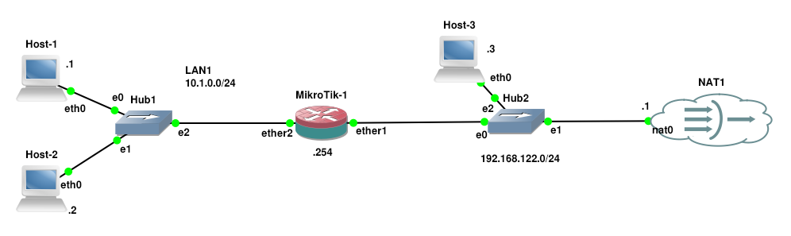
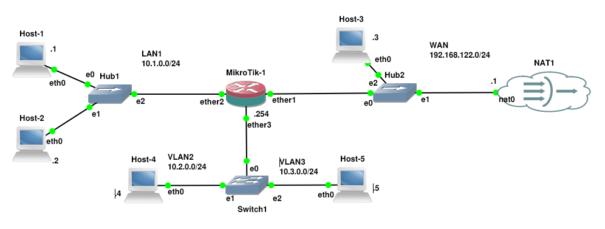

# Introdução a Roteadores MikroTik

No âmbito da infraestrutura de redes de computadores, a seleção de equipamentos desempenha um papel determinante na estabilidade e na segurança do tráfego de dados. Dentre os componentes essenciais de uma arquitetura de comunicação, sobressaem-se os roteadores, dispositivos cuja principal função é o roteamento de pacotes entre diferentes redes. Em ambientes corporativos, a confiabilidade desses dispositivos é um requisito fundamental para evitar interrupções de serviço. O mercado global conta com diversos fabricantes consolidados nesse segmento — como Cisco Systems, Huawei, Juniper Networks, TP-Link, etc - cada qual com soluções voltadas a diferentes portes de rede e necessidades. Nesse cenário, os equipamentos desenvolvidos pela MikroTik vêm conquistando espaço expressivo em redes de pequeno, médio e grande porte, bem como em provedores de serviços de internet (ISPs).

Fundada em 1996 na Letônia, a MikroTik iniciou suas atividades com o desenvolvimento de sistemas de software para conectividade sem fio e roteamento, expandindo posteriormente sua atuação para a fabricação de hardware próprio. Uma das principais vantagens da marca reside na relação custo-benefício de seus produtos, somada à ausência de custos de licenciamento por recursos de software avançados - modelo frequentemente adotado por concorrentes como Cisco e Juniper. Por outro lado, como limitações em comparação às marcas tradicionais de grande porte, destacam-se o suporte técnico direto menos abrangente, a dependência acentuada de suporte comunitário e uma curva de aprendizado inicial mais íngreme na configuração via linha de comando para administradores não familiarizados com a plataforma.

A arquitetura das soluções da fabricante divide-se entre a linha de hardware, denominada RouterBOARD, e o sistema operacional, o RouterOS. **O RouterOS é um sistema proprietário baseado em _kernel_ Linux** que provê um conjunto amplo de recursos de rede, incluindo protocolos de roteamento dinâmico (como OSPF e BGP), gerenciamento de _firewall_, suporte a redes virtuais privadas (VPNs), controle de banda (QoS) e serviços de infraestrutura como DHCP e DNS. A integração entre o hardware dedicado e o RouterOS permite a implantação de roteadores com alto grau de flexibilidade operacional, podendo o software também ser executado em arquiteturas x86 como máquina virtual (Cloud Hosted Router — CHR).

Diante do aumento da visibilidade e da adoção dos roteadores MikroTik no mercado — impulsionados, principalmente pela sua competitividade financeira e robustez de recursos, torna-se estratégico que o administrador de redes expanda suas competências para além dos fabricantes historicamente consolidados, como a Cisco. O domínio da configuração em plataformas emergentes e de ampla difusão permite ao profissional compreender com maior clareza as variações de sintaxe, arquitetura e implementação existentes entre os diferentes fornecedores. Sobretudo, essa abordagem comparativa evidencia que, independentemente da interface ou do sistema operacional empregado, os fundamentos operacionais permanecem inalterados, visto que todos os equipamentos devem atender rigorosamente às especificações dos protocolos da pilha TCP/IP, aos padrões de roteamento e aos serviços essenciais que regem as redes de computadores.

## Configuração de uma rede básica

A fim de ilustrar a aplicação prática dos conceitos discutidos anteriormente, este seção apresenta a configuração básica de um roteador MikroTik executando o sistema operacional RouterOS na versão 7.22.1. A abordagem será desenvolvida em um cenário de rede bem simples, concentrando-se fundamentalmente no uso da interface de linha de comando (CLI) nativa do equipamento, sem o recurso a ferramentas gráficas de gerenciamento. O objetivo central é instruir o leitor quanto à sintaxe e à execução dos comandos essenciais para a atribuição de endereços IP e máscaras de rede, o estabelecimento da rota padrão e de rotas estáticas, o processo de exportação e importação de arquivos de configuração, bem como a verificação do estado operacional das interfaces de rede e dos serviços de infraestrutura ativados.

A topologia de rede proposta é apresentada na Figura 1, sendo esta é composta por duas redes distintas interconectadas por um roteador central, identificado como **MikroTik-1**:

1. **Rede Local (LAN1 - `10.1.0.0/24`):** Onde estão conectados dois dispositivos finais, **Host-1** e **Host-2**, que se interligam por meio de um concentrador (**Hub1**). A interface do roteador MikroTik associada a este segmento é a **`ether2`**. O roteador utiliza o último endereço host disponível na subnet para suas interfaces (`.254`), atuando como o *gateway* padrão dos hosts desta LAN.
2. **Rede Externa / WAN (`192.168.122.0/24`):** Está é a rede de saída para a Internet, interligado via concentrador (**Hub2**) a partir da interface **`ether1`** do roteador MikroTik. Nesta mesma rede encontra-se o **Host-3**, além da nuvem **NAT1**, que abriga o *gateway* de saída para a Internet no endereço `.1`. Este *gateway* oculto na nuvem também desempenha os papéis de servidor DHCP e DNS para a interface WAN do MikroTik.

> O cenário de rede descrito foi implementado no simulador GNS3. Nesse ambiente, o elemento NAT1, representado graficamente sob a forma de nuvem, simboliza a interconexão com a rede externa e a Internet. Tecnicamente, essa nuvem mapeia a comunicação para o sistema hospedeiro (host físico ou hipervisor) através da interface virtual no endereço 192.168.122.1. Essa estrutura permite o roteamento e a tradução do tráfego vindo da topologia simulada para a interface de rede real do computador, provendo conectividade externa aos dispositivos do laboratório.

|  |
|:--:|
| Figura 1 - Cenário de rede simples para configuração com Mikrotik

O objetivo principal deste texto é realizar a configuração do roteador **MikroTik-1** via linha de comando para que este estabeleça o roteamento e a tradução de endereços (NAT), provendo acesso à Internet para os dispositivos da **LAN1**. Ressalta-se que o escopo deste documento restringe-se exclusivamente às definições necessárias no roteador MikroTik, não sendo objeto deste texto a apresentação da configuração individual dos demais *hosts* da rede.

A tabela a seguir descreve de forma textual e acessível todos os componentes da topologia, detalhando seus papéis, sub-redes, interfaces ativas no roteador e endereços IP completos atribuídos a cada dispositivo.

| Dispositivo / Elemento | Sub-rede de Origem | Interface no MikroTik | Endereço IP Completo | Máscara de Rede / CIDR | Função / Observação |
| --- | --- | --- | --- | --- | --- |
| **Host-1** | `10.1.0.0/24` | — | `10.1.0.1` | `255.255.255.0` (`/24`) | Estação de trabalho na LAN1. |
| **Host-2** | `10.1.0.0/24` | — | `10.1.0.2` | `255.255.255.0` (`/24`) | Estação de trabalho na LAN1. |
| **MikroTik-1 (LAN1)** | `10.1.0.0/24` | `ether2` | `10.1.0.254` | `255.255.255.0` (`/24`) | Interface interna (*Gateway* da LAN1). |
| **MikroTik-1 (WAN)** | `192.168.122.0/24` | `ether1` | `192.168.122.254` | `255.255.255.0` (`/24`) | Interface externa (Conectada ao Hub2/WAN). |
| **NAT1 (Nuvem)** | `192.168.122.0/24` | — | `192.168.122.1` | `255.255.255.0` (`/24`) | *Gateway* Padrão, Servidor DHCP e DNS da WAN. |
| **Host-3** | `192.168.122.0/24` | — | `192.168.122.3` | `255.255.255.0` (`/24`) | Dispositivo pertencente ao segmento WAN. |

Dessa forma, os **Host-1** e **Host-2** atuam como estações de trabalho da rede local (**LAN1**), permanecendo isolados e sem conectividade externa até a conclusão da configuração do roteador MikroTik. O **Host-3**, por sua vez, representa um nó externo ao segmento da LAN1, para o qual o roteador deverá prover acessibilidade após ser configurado; este host pode ser utilizado para testes de conectividade ou para tarefas de monitoramento de tráfego (como a captura de pacotes via `tcpdump`). Por fim, o **NAT1** viabilizará o acesso de todo o cenário de rede à Internet e a outras redes externas, uma vez estabelecidos o roteamento e a tradução de endereços adequados.


## Primeiros Passos e Primeiro Acesso ao MikroTik

Ao inicializar um roteador MikroTik pela primeira vez (ou após uma restauração das configurações de fábrica), o primeiro contato com a interface de linha de comando (CLI) é realizado por meio de credenciais padrão do sistema. O usuário administrativo pré-configurado é o **`admin`**, e, por padrão, o campo de senha permanece **em branco** (sem senha definida). Para efetuar o acesso inicial via console ou terminal, basta preencher o nome de usuário, no caso `admin` e pressionar a tecla `Enter` na solicitação da senha.

```bash
MikroTik 7.22.1 (stable)
   Login: admin                                                                                                                   
   Password:
```

> Atenção, se você digitar alguma senha neste ponto, o acesso será negado.

### Aceite dos Termos de Licenciamento

Após a validação do _login_ inicial, o sistema operacional exibe o _banner_ oficial do RouterOS acompanhado da versão do sistema e solicita a leitura dos termos de licença de software. A confirmação é opcional para prosseguir; ao pressionar a tecla **`n`** (para *No*) ou simplesmente a tecla `Enter`, o processo de autenticação é mantido e a exibição do texto completo da licença é ignorada.

```bash
  MMM                   MMM       KKK                                                            TTTTTTTTTTT        KKK
  MMMM            MMMM       KKK                                                            TTTTTTTTTTT        KKK
  MMM  MMMM   MMM  III  KKK     KKK     RRRRRR          OOOOOO      TTT             III  KKK  KKK
  MMM     MM       MMM  III  KKKKK            RRR      RRR    OOO  OOO     TTT             III  KKKKK
  MMM                   MMM  III  KKK    KKK     RRRRRR          OOO  OOO     TTT             III  KKK   KKK
  MMM                   MMM  III  KKK       KKK  RRR      RRR     OOOOOO      TTT             III  KKK      KKK

  MikroTik RouterOS 7.22.1 (c) 1999-2026       https://www.mikrotik.com/

Do you want to see the software license? [Y/n]: n
```

### Definição Obrigatória da Senha de Administrador

Por questões de segurança, o RouterOS exige a alteração da senha do usuário `admin` logo após o aceite dos termos. O sistema solicita a digitação da nova senha e a sua confirmação. Durante a digitação, os caracteres não são exibidos na tela por medidas de proteção. Uma vez efetuada a confirmação, a mensagem `Password changed` ratifica a alteração, e o *prompt* de comando do sistema é devidamente liberado.

```bash
Press F1 for help


Change your password (Ctrl-C to skip)
new password> ********
repeat new password> ********

Password changed
[admin@MikroTik] >
```

### Entendendo a Interface de Linha de Comando (CLI) e Recursos de Navegação

Então após um _login_ realizado com sucesso, será apresentado o *prompt* de comando, sendo esse algo como: 

```bash
[admin@MikroTik] >
```

A estrutura de exibição do exemplo anterior indica o contexto operacional do usuário, sendo esse:

* **`admin`**: O nome da conta autenticada no momento.
* **`MikroTik`**: O nome de identificação do equipamento (*Identity*).
* **`>`**: O nível do menu em que o administrador se encontra (neste caso, a raiz do sistema).

### Ajuda e Recurso de Autocompletar

A CLI do RouterOS foi projetada para facilitar a administração e a descoberta de comandos, dispondo de recursos nativos para navegação e suporte. Assim, é possível obter ajuda das seguintes formas:

1. **Teclas de Ajuda (`F1` ou `?`):** A qualquer momento, pressionar a tecla **`F1`** ou digitar o caractere de interrogação **`?`** exibe um resumo da documentação dos comandos disponíveis para o menu ou contexto atual.
2. **Uso da Tecla `Tab` (Autocompletar e Listagem):** A tecla **`Tab`** desempenha papel fundamental na navegação do RouterOS:
* **Completar Comandos:** Digitar as primeiras letras de um comando e pressionar `Tab` completa automaticamente o parâmetro caso não haja ambiguidade. Caso exista ambiguidade serão apresentadas as possibilidade de comandos com o conjunto de caracteres digitados pelo usuário até então.
* **Listar Opções Disponíveis:** Pressionar a tecla `Tab` com o _prompt_ em branco (ou após qualquer subseção) exibe a lista completa de todos os submenus, comandos e argumentos aceitos naquele nível específico da hierarquia.

Em suma, o domínio da navegação pela interface de linha de comando constitui o alicerce para a administração eficiente do RouterOS. Saber identificar a posição hierárquica atual por meio do _prompt_ e utilizar os recursos nativos de ajuda e autocompletar garante agilidade e precisão operacional. Embora consultas a motores de busca na Internet e o auxílio de assistentes de inteligência artificial sejam ferramentas valiosas no cotidiano, a verificação direta dos comandos disponíveis no próprio equipamento permanece como o método mais confiável, visto que a sintaxe e as funcionalidades podem sofrer alterações significativas entre diferentes versões do sistema operacional. Acima de tudo, o administrador deve ter a plena consciência de que o controle de acesso ao roteador — viabilizado pela gestão rigorosa de usuários e pela definição de senhas robustas — representa a primeira e mais fundamental camada de proteção para a integridade do dispositivo e a segurança de toda a infraestrutura de rede.

## Verificação do Status das Interfaces de Rede

Antes de iniciar a definição dos parâmetros de rede — como a atribuição manual de endereços IP, máscaras de sub-rede e rotas —, é indispensável realizar um diagnóstico preliminar do dispositivo. O administrador deve identificar com clareza quais interfaces físicas e lógicas estão disponíveis no equipamento, suas nomenclaturas operacionais, os endereços MAC associados, o estado físico do enlace (*link*) e a eventual existência de configurações prévias mantidas pelo sistema.

Então, normalmente o primeiro passo consiste em listar as tabelas de endereçamento IP já associadas às interfaces do equipamento por meio do comando `/ip address print`. Tal como é apresentado no exemplo a seguir:

```bash
[admin@MikroTik] > ip address print
Flags: D - DYNAMIC
Columns: ADDRESS, NETWORK, INTERFACE, VRF
#   ADDRESS             NETWORK        INTERFACE  VRF 
0 D 192.168.122.118/24  192.168.122.0  ether1     main
```

Ao analisar o resultado exibido anteriormente, observa-se que a interface **`ether1`** já possui o endereço IP `192.168.122.118/24` atribuído. A presença da _flag_ **`D`** (*Dynamic*) indica que esse endereço não foi configurado manualmente, mas sim obtido dinamicamente por meio de um cliente DHCP ativado por padrão na instalação do RouterOS para a primeira interface de rede. As demais interfaces do equipamento não figuram nessa listagem por não possuírem nenhum endereço IP associado no momento.

> Atenção, o roteador tenta por padrão sempre tenta obter endereços automaticamente via DHCP.

O comando anterior apresentou apenas as interfaces ligadas e que obtiveram IPs, mas pode ser que existam outras placas de rede disponíveis no roteador. Assim, para obter uma visão abrangente de todas as portas físicas e lógicas do dispositivo — independentemente de possuírem IP atribuído ou de estarem fisicamente conectadas —, utiliza-se o comando `/interface print detail`, tal como:

```bash
[admin@MikroTik] > interface print detail   
Flags: D - DYNAMIC; X - DISABLED; I - INACTIVE, R - RUNNING; S - SLAVE; P - PASSTHROUGH 
 0   R   name="ether1" default-name="ether1" type="ether" mtu=1500 actual-mtu=1500 vrf=main mac-address=0C:56:A5:03:00:00 
         last-link-up-time=2026-07-22 17:43:58 link-downs=0 

 1   R   name="ether2" default-name="ether2" type="ether" mtu=1500 actual-mtu=1500 vrf=main mac-address=0C:56:A5:03:00:01 
         last-link-up-time=2026-07-22 17:43:58 link-downs=0 

 2       name="ether3" default-name="ether3" type="ether" mtu=1500 actual-mtu=1500 vrf=main mac-address=0C:56:A5:03:00:02 link-downs=>

 3       name="ether4" default-name="ether4" type="ether" mtu=1500 actual-mtu=1500 vrf=main mac-address=0C:56:A5:03:00:03 link-downs=>

 4       name="ether5" default-name="ether5" type="ether" mtu=1500 actual-mtu=1500 vrf=main mac-address=0C:56:A5:03:00:04 link-downs=>

 5       name="ether6" default-name="ether6" type="ether" mtu=1500 actual-mtu=1500 vrf=main mac-address=0C:56:A5:03:00:05 link-downs=>

 6       name="ether7" default-name="ether7" type="ether" mtu=1500 actual-mtu=1500 vrf=main mac-address=0C:56:A5:03:00:06 link-downs=>

 7       name="ether8" default-name="ether8" type="ether" mtu=1500 actual-mtu=1500 vrf=main mac-address=0C:56:A5:03:00:07 link-downs=0

 8   R   name="lo" type="loopback" mtu=65536 actual-mtu=65536 vrf=main mac-address=00:00:00:00:00:00 
         last-link-up-time=2026-07-22 17:43:58 link-downs=0 
```

O `/interface print detail` lista **todas** as portas de rede físicas (que no exemplo foi da `ether1` a `ether8`) e a interface virtual de *loopback* (`lo`), detalhando propriedades operacionais como Unidade Máxima de Transmissão (MTU), endereço MAC e horário do último estabelecimento de link (*last-link-up-time*).

Em uma análise mais profunda da saída anterior, destaca-se a letra **`R`** (*Running*), que significa:

* As interfaces **`ether1`** e **`ether2`** apresentam a flag **`R`**, confirmando que há um cabo/meio físico conectado a elas e que o enlace (*link*) está ativo no nível da camada física e de enlace.
* A interface **`lo`** (*loopback*) permanece constantemente no estado **`R`** por se tratar de uma interface lógica interna do sistema.
* As interfaces de **`ether3`** a **`ether8`** não apresentam a flag **`R`**, indicando que estão desconectadas (sem enlace ativo), embora permaneçam ativadas administrativamente.
* Nenhuma das interfaces apresenta a flag **`X`** (*Disabled*), o que confirma que todas as portas estão habilitadas para uso no sistema operacional.

O comando anterior, apresenta muitos detalhes, o que pode causar confusão devida a quantidade de dados, então muitas vezes é interessante executar o comando `interface ethernet print`, que apresenta uma saída mais resumida (focada exclusivamente nas portas físicas), tal como:

```bash
[admin@MikroTik] > interface ethernet print 
Flags: R - RUNNING
Columns: NAME, MTU, MAC-ADDRESS, ARP
#   NAME     MTU  MAC-ADDRESS        ARP    
0 R ether1  1500  0C:56:A5:03:00:00  enabled
1 R ether2  1500  0C:56:A5:03:00:01  enabled
2   ether3  1500  0C:56:A5:03:00:02  enabled
3   ether4  1500  0C:56:A5:03:00:03  enabled
4   ether5  1500  0C:56:A5:03:00:04  enabled
5   ether6  1500  0C:56:A5:03:00:05  enabled
6   ether7  1500  0C:56:A5:03:00:06  enabled
7   ether8  1500  0C:56:A5:03:00:07  enabled
```
A saída anterior apresenta de maneira direta apenas as colunas essenciais para o dia a dia da administração de rede: a nomenclatura das interfaces (`NAME`), a Unidade Máxima de Transmissão (`MTU`), o endereço físico gravado na placa (`MAC-ADDRESS`) e o status do protocolo de resolução de endereços (`ARP`). A flag **`R`** (*Running*) destaca rapidamente quais portas físicas possuem enlace estabelecido com o switch, hub ou dispositivo adjacente (neste caso, `ether1` e `ether2`).

Embora a execução dos comandos de verificação de status possa parecer uma tarefa trivial ou redundante em um primeiro momento, esse procedimento é vital para a manutenção da estabilidade da rede e para o diagnóstico de falhas. Durante a configuração de redes, não são raros os episódios em que administradores, por distração, atribuam endereços IP incorretos, definem máscaras inadequadas ou invertem as configurações entre as placas de rede. Nessas situações de inconsistência, os comandos de inspeção e monitoramento de status constituem a principal ferramenta de depuração, permitindo isolar o problema e validar se o comportamento físico e lógico do roteador corresponde exatamente ao planejamento da infraestrutura.

## Atribuição de Endereço IP Estático

Em nosso exemplo, após a verificação do estado das interfaces de rede, o próximo passo na construção da infraestrutura é a atribuição manual de um endereço IP estático para a interface interna do roteador (**`ether2`**). Esse endereço atuará como o *gateway* padrão para os dispositivos pertencentes à rede local **LAN1** (`10.1.0.0/24`).

Para realizar a atribuição estática, acessa-se o menu de endereçamento IP do RouterOS e executa-se o subcomando `add`:

```bash
[admin@MikroTik] > ip address add interface=ether2 address=10.1.0.254/24
```

A sintaxe utilizada no comando anterior é dividida em parâmetros específicos que definem a configuração do endereço no RouterOS:

* **`/ip address add`**: Caminho na árvore de comandos do sistema operacional que instrui o RouterOS a adicionar uma nova entrada à tabela de endereçamento do protocolo IPv4.
* **`interface=ether2`**: Especifica a interface física ou lógica à qual o endereço IP será vinculado. Neste caso, associa a configuração à porta física `ether2`.
* **`address=10.1.0.254/24`**: Define o endereço IP do host e a respectiva máscara de sub-rede utilizando a notação CIDR (`/24`, equivalente à máscara decimal pontuada `255.255.255.0`). A partir do momento em que a máscara em notação CIDR é informada, o RouterOS calcula automaticamente a rede (*Network*) correspondente (`10.1.0.0`).

Na administração de redes, a execução de um comando sem mensagens de erro no terminal não garante, por si só, o funcionamento correto da regra. É essencial validar a efetividade do parâmetro recém-adicionado consultando novamente a tabela de endereçamento do dispositivo através do comando `/ip address print`.

```bash
[admin@MikroTik] > ip address print 
Flags: D - DYNAMIC
Columns: ADDRESS, NETWORK, INTERFACE, VRF
#   ADDRESS             NETWORK        INTERFACE  VRF 
0 D 192.168.122.118/24  192.168.122.0  ether1     main
1   10.1.0.254/24       10.1.0.0       ether2     main
```

Analisando o resultado da listagem, é possível confirmar que a configuração foi gravada com sucesso, já que:

1. **Entrada de Índice `1`:** O sistema cadastrou o novo endereço `10.1.0.254/24` na interface `ether2`, calculando automaticamente o campo `NETWORK` como `10.1.0.0`.
2. **Ausência da Flag `D`:** Ao contrário da entrada `0` (atribuída dinamicamente via DHCP na interface `ether1`), a nova entrada não possui a sinalização **`D`** (*Dynamic*), o que confirma que se trata de uma configuração **estática/estável**, mantida de forma permanente na memória do equipamento.


Com essa configuração dos IPs e máscaras nas interfaces de rede do roteador, a LAN1 já consegue enviar dados para fora da rede, mas a comunicação bilateral não vai acontecer, já que as outras redes não conhecem a LAN1, para resolver esse problemas vamos utilizar NAT e deixar o nosso cenário de exemplo 100% funcional.

## Configuração do NAT

Com o endereçamento IP devidamente atribuído às interfaces do roteador, o próximo passo essencial para prover conectividade à rede **LAN1** é a definição de uma regra de NAT (*Network Address Translation* ).

No cenário estudado, os dispositivos **Host-1** e **Host-2** utilizam a sub-rede privada `10.1.0.0/24`. O roteador responsável pela saída da rede virtual para a Internet é o sistema hospedeiro (no endereço `192.168.122.1`). Em um ambiente de produção ou de simulação onde não se possui acesso administrativo ao roteador principal/hospedeiro para incluir uma rota estática de retorno apontando para a sub-rede `10.1.0.0/24`, os pacotes originados na LAN1 até conseguiriam sair, mas as respostas enviadas pelo hospedeiro ou pela Internet seriam descartadas por falta de rota de retorno.

A aplicação do NAT resolve esse problema ao reescrever o endereço IP de origem dos pacotes que saem da rede local. Dessa forma, quando o tráfego da **LAN1** atravessa o MikroTik em direção à WAN, o roteador substitui o IP privado do cliente pelo seu próprio IP na interface externa (`192.168.122.118`). Para o hospedeiro e para a rede externa, todo o tráfego parecerá ter sido gerado pelo próprio MikroTik, permitindo que os pacotes de resposta retornem corretamente.

> **Nota:** No ambiente de simulação no GNS3, seria tecnicamente viável adicionar uma rota estática diretamente no sistema operacional hospedeiro apontando a rede `10.1.0.0/24` para o IP do MikroTik, o que eliminaria a necessidade do NAT (mascaramento) no laboratório. No entanto, optou-se por utilizar o NAT por se tratar do cenário padrão encontrado na interconexão com provedores e redes externas.

### Regra de NAT (Masquerade)

Para implementar essa tradução, utiliza-se a ação de mascaramento (*masquerade*) no subsistema de _firewall_ do RouterOS:

```bash
[admin@MikroTik] > ip firewall nat add action=masquerade chain=srcnat out-interface=ether1
```

Para administradores familiarizados com sistemas GNU/Linux, a estrutura de _firewall_ do RouterOS possui forte equivalência conceitual e sintática com o utilitário `iptables` (e seu sucessor `nftables`), visto que o RouterOS utiliza o próprio subsistema *netfilter* do kernel Linux em sua base, sendo assim o comando fica:

* **`/ip firewall nat add`**: Acessa a tabela de NAT do _firewall_ e insere uma nova regra de manipulação de pacotes (equivalente à tabela `-t nat` no `iptables`).
* **`chain=srcnat`**: Define a cadeia de processamento de NAT de origem (*Source NAT*). Corresponde exatamente à cadeia `POSTROUTING` do `iptables`, na qual os pacotes são inspecionados e alterados logo antes de deixarem o roteador.
* **`out-interface=ether1`**: Condição de correspondência que especifica que a regra só será aplicada ao tráfego que estiver saindo ativamente pela interface WAN (`ether1`).
* **`action=masquerade`**: Ação a ser executada no pacote. Diferente de um *Source NAT* estático (que exige um IP fixo configurado manualmente), a ação `masquerade` obtém e aplica automaticamente o endereço IP atribuído à interface de saída (`ether1`). No `iptables`, isso equivale ao argumento `-j MASQUERADE`.

Após a inserção do comando, é possível inspecionar a tabela de NAT para certificar que a regra foi aceita pelo sistema operacional por meio do comando `/ip firewall nat print`, tal como:

```bash
[admin@MikroTik] > ip firewall nat print
Flags: X - DISABLED, I - INVALID; D - DYNAMIC 
 0    chain=srcnat action=masquerade out-interface=ether1 
```

A saída do comando anterior exibe a regra cadastrada na posição de índice `0`. A ausência das sinalizações **`X`** (*Disabled*) e **`I`** (*Invalid*) confirma que a regra está ativa e operante no sistema. A partir deste momento, todo pacote originado na **LAN1** com destino à rede WAN ou à Internet terá seu endereço de origem traduzido para o IP da interface `ether1`, viabilizando a trafegabilidade bidirecional na rede.

Após a aplicação do endereçamento IP na interface local e o estabelecimento da regra de mascaramento (NAT) na interface WAN, a infraestrutura fica totalmente conexa. Para validar a conectividade de ponta a ponta, o administrador de rede deve realizar testes de verificação a partir das estações de trabalho da **LAN1** (**Host-1** e **Host-2**). Um primeiro teste consiste no envio de requisições ICMP para o nó local adjacente via comando `ping 192.168.122.3` (Host-3), assegurando que o roteamento entre as sub-redes internas está funcional. Em seguida, para homologar a tradução de endereços e a saída efetiva para a rede externa, executa-se o teste de alcance a um servidor público da Internet, como o comando `ping 8.8.8.8`. O sucesso em ambos os testes confirma que os pacotes estão sendo corretamente roteados e mascarados pelo MikroTik.

Em conclusão, a atribuição estática de endereços IP às interfaces físicas aliada à configuração do NAT (*masquerade*) estabelece o conjunto mínimo e fundamental de rotinas para a integração de uma rede local privada à Internet. Embora o RouterOS ofereça uma vasta gama de recursos avançados de filtragem, controle de tráfego e serviços de infraestrutura, a correta execução e validação dessas etapas básicas de camada de rede garantem a base sólida sobre a qual todas as demais políticas de segurança e gerenciamento corporativo serão construídas.

## Importando e exportando configurações do roteador (Backup)

Diferente de outros sistemas operacionais de rede nos quais as alterações ficam armazenadas temporariamente na memória RAM até a execução de um comando explícito de gravação, o MikroTik RouterOS grava todas as alterações **instantaneamente** na sua memória não volátil (_flash_). Isso significa que não há o risco de perder as configurações realizadas em caso de um reinício inesperado do sistema.

Ainda assim, a criação de cópias de segurança é uma prática indispensável na administração de infraestruturas. O gerenciamento de _backups_ permite ao administrador registrar o histórico das alterações, criar documentação auditável e garantir planos de recuperação de desastres (*disaster recovery*), assegurando que o roteador possa retornar rapidamente a um estado operacional consistente após falhas de hardware, erros humanos ou modificações indevidas durante testes.

No RouterOS, existem dois métodos complementares para salvar o estado do equipamento: a **exportação em texto simples (`.rsc`)** e a criação do **backup binário do sistema (`.backup`)**.

### 1. Exportação em Texto Simples (`/export`)

O comando `/export` gera um _script_ em texto simples contendo a lista completa de comandos executados no dispositivo que diferem das configurações de fábrica. Esse método é ideal para fins de documentação, auditoria, migração parcial de regras ou aplicação das mesmas configurações em equipamentos de modelos distintos.

```bash
[admin@MikroTik] > /export 
# 2026-07-24 13:21:24 by RouterOS 7.22.1
# system id = 0dUx1SdluUA
#
/interface ethernet
set [ find default-name=ether1 ] disable-running-check=no
set [ find default-name=ether2 ] disable-running-check=no
set [ find default-name=ether3 ] disable-running-check=no
set [ find default-name=ether4 ] disable-running-check=no
set [ find default-name=ether5 ] disable-running-check=no
set [ find default-name=ether6 ] disable-running-check=no
set [ find default-name=ether7 ] disable-running-check=no
set [ find default-name=ether8 ] disable-running-check=no
/ip address
add address=10.1.0.254/24 interface=ether2 network=10.1.0.0
/ip dhcp-client
add interface=ether1 name=client1
/ip firewall nat
add action=masquerade chain=srcnat out-interface=ether1
```

O resultado exibe de forma legível e estruturada todos os parâmetros configurados nas seções do sistema:

* O cabeçalho detalha a data, a hora, a versão exata do RouterOS e o identificador do sistema (`system id`).
* Em seguida, os blocos de comando refletem exatamente os parâmetros atribuídos anteriormente, tais como a definição do endereço IP na interface `ether2`, o cliente DHCP ativado na `ether1` e a regra de mascaramento (NAT).
* Para salvar essa saída diretamente em um arquivo no roteador, basta utilizar o argumento `file`, como em `/export file=backup_export1`.

### 2. Criação de Backup Binário (`.backup`)

Enquanto a exportação gera um _script_ de comandos, o _backup_ binário cria uma **imagem completa do estado do sistema**. Ele armazena não apenas as configurações de rede, mas também arquivos do sistema, usuários, senhas encriptadas, chaves SSH e identificadores de sistema. Por conter informações sensíveis, é altamente recomendável definir uma senha para a criptografia do arquivo gerado.

Para criar o arquivo de backup binário, executa-se o comando `/system/backup/save`, tal como:

```bash
[admin@MikroTik] > /system/backup/save name=backup1 password="123mudar"
Saving system configuration
Configuration backup saved
```

Sendo que no comandando anterior:

* **`name=backup1`**: Define o nome base do arquivo (o sistema adiciona automaticamente a extensão `.backup`).
* **`password="123mudar"`**: Criptografa o arquivo de _backup_ com a senha especificada, impedindo a leitura indevida por terceiros caso o arquivo seja transferido para fora do equipamento.

### 3. Verificação dos Arquivos Salvos no Sistema

Todos os _backups_ e arquivos exportados ficam armazenados no repositório de arquivos local do MikroTik. Para listar o conteúdo do repositório e confirmar que o arquivo foi gravado corretamente, utiliza-se o comando `/file/print`:

```bash
[admin@MikroTik] > /file/print   
Columns: NAME, TYPE, SIZE, LAST-MODIFIED
# NAME                      TYPE       SIZE     LAST-MODIFIED      
0 backup1.backup            backup     21.7KiB  2026-07-24 13:47:09
1 skins                     directory           2026-07-22 17:43:57
2 auto-before-reset.backup  backup     14.0KiB  2026-07-24 13:42:53
```

A listagem anterior exibe o arquivo `backup1.backup` com seu respectivo tamanho e data de modificação. O arquivo identificado como `auto-before-reset.backup` representa uma imagem gerada automaticamente pelo próprio RouterOS antes de procedimentos de reinicialização ou restauração de fábrica.

### 4. Restauração do Backup Binário

Caso seja necessário reverter o roteador a um estado salvo anteriormente, utiliza-se o comando `/system/backup/load`:

```bash
[admin@MikroTik] > /system/backup/load name=backup1.backup 
password: ********
Restore and reboot? [y/N]:
```
Então o procedimento de restauração é composto dos seguintes passos:

1. O comando deve indicar o nome exato do arquivo cadastrado no repositório (`name=backup1.backup`).
2. Caso o arquivo tenha sido criado com criptografia, o sistema solicitará a senha definida no momento do salvamento.
3. Para garantir que todas as definições de hardware e licenças sejam aplicadas corretamente, a restauração exige a confirmação do usuário (`Restore and reboot? [y/N]`) e força o **reinício automático do roteador**. Após a reinicialização, o equipamento retornará operando estritamente com as configurações armazenadas naquele arquivo de _backup_.

A prática rigorosa de geração e armazenamento de cópias de segurança constitui uma das rotinas mais estratégicas da gestão de infraestrutura de TI. A disponibilidade de um _backup_ atualizado e devidamente testado preserva o trabalho do administrador de rede e minimiza significativamente o tempo de inatividade (*downtime*) em situações críticas. Sobretudo em cenários de desastre ou falha catastrófica — tais como descargas elétricas, curtos-circuitos ou incêndios que comprometam fisicamente o dispositivo —, ter o arquivo de configuração resguardado em um repositório externo permite a substituição do hardware danificado e o restabelecimento integral dos serviços em poucos minutos, garantindo a continuidade do negócio com o mínimo de impacto operacional.

## Serviços de Infraestrutura e Gerenciamento no RouterOS

Além de desempenhar as funções roteamento, um roteador MikroTik com o sistema operacional RouterOS possui a capacidade de executar nativamente diversos servidores e serviços essenciais de rede. Essa integração centraliza a gestão da infraestrutura, otimiza o uso de recursos de hardware e simplifica o fluxo de administração sem a necessidade de implantar servidores dedicados adicionais para tarefas básicas.

Dentre as principais aplicações disponibilizadas diretamente pelo dispositivo, destacam-se:

* **Acesso Remoto Seguro (SSH e SFTP):** O protocolo SSH possibilita o acesso criptografado via linha de comando para a gestão do equipamento. Além disso, o subsistema SSH viabiliza conexões via SFTP/SCP, permitindo que o administrador realize a transferência automatizada e segura dos arquivos de *backup* ou *export* gerados no roteador para um servidor ou computador remoto de armazenamento.
* **Interface de Gerenciamento Web (WebFig / HTTP):** O serviço HTTP (porta 80) disponibiliza o WebFig, uma interface gráfica completa acessível diretamente pelo navegador web para administração e monitoramento do sistema.
* **Servidor DNS Local:** O RouterOS permite ativar um servidor DNS integrando recursos de armazenamento em *cache* e mapeamento estático. Essa funcionalidade proporciona maior agilidade na resolução de nomes para os hosts da LAN, reduz o tráfego externo para a Internet e permite o cadastro de registros DNS locais para equipamentos da rede interna.
* **Servidor DHCP:** A distribuição automática de parâmetros de rede para as estações de trabalho é uma das atribuições mais críticas em uma topologia. Ao atuar como servidor DHCP, o MikroTik atribui dinamicamente aos clientes o endereço IP, a máscara de sub-rede, o *gateway* padrão e os servidores DNS, eliminando a necessidade de configuração manual em cada dispositivo final.

É claro que um roteador, tal como o MikroTik pode ter ainda outras funções, tais como servidor de horas (NTP), SNMP, Firewall, QoS, etc.

### Inspecionando os Serviços de Acesso e Gerenciamento Ativos

Para listar as portas, protocolos e o status operacional dos serviços de rede destinados ao gerenciamento do próprio RouterOS, é possível utilizar o comando `/ip/service/print`, tal como:

```bash
[admin@MikroTik] > ip/service/print 
Flags: D - DYNAMIC; X - DISABLED, I - INVALID
Columns: NAME, PORT, PROTO, CERTIFICATE, VRF, MAX-SESSIONS
 #      NAME           PORT  PROTO  CERTIFICATE  VRF   MAX-SESSIONS
 0      ftp                       21  tcp                 main            20
 1      ssh                     22  tcp                 main            20
 2      telnet                  23  tcp                 main            20
 3 D  dhcpclient          68  udp                                   
 4      www                   80  tcp                 main            20
 5  X www-ssl             443  tcp    none         main            20
 6      reverse-proxy   443  tcp    none         main            20
 7 D  btest                   2000  tcp                                   
 8 D  discover              5678  udp                                   
 9      winbox                8291  tcp                 main            20
10    api                       8728  tcp                 main            20
11    api-ssl                  8729  tcp    none         main            20
```

A listagem anterior fornece um detalhamento completo sobre os pontos de escuta do sistema operacional:

1. **Protocolos de Acesso Padronizados:** O sistema mantém habilitados por padrão serviços como **`ftp`** (porta 21), **`ssh`** (porta 22) e **`www`** (porta 80), permitindo o gerenciamento por múltiplos canais.
2. **Serviços Proprietários e de API:** O serviço **`winbox`** (porta 8291) atende às conexões da ferramenta gráfica proprietária da MikroTik, enquanto as portas de **`api`** (8728) e **`api-ssl`** (8729) permitem a integração e automação com sistemas externos de terceiros.
3. **Sinalização de Estado (*Flags*):**
* A flag **`X`** (*Disabled*) na entrada `5` (**`www-ssl`**) indica que a interface web criptografada via HTTPS está desativada administrativamente no momento (geralmente por falta da importação prévia de um certificado digital válido).
* A flag **`D`** (*Dynamic*) em serviços como **`dhcpclient`** (porta 68) e **`discover`** (porta 5678) indica que estas portas de escuta foram criadas e gerenciadas automaticamente pelo próprio RouterOS para responder a funções dinâmicas do sistema.

Em suma, os serviços listados encontram-se disponíveis no roteador para o gerenciamento e a operação do sistema. A partir dessa estrutura, é possível estabelecer conexões remotas seguras via SSH utilizando o comando `ssh admin@192.168.122.118`, fornecendo a senha configurada no ambiente para administrar o equipamento por linha de comando, além de empregar utilitários como `scp` e `sftp` para a transferência de arquivos. De forma análoga, a interface web pode ser acessada por meio do endereço `[http://192.168.122.118](http://192.168.122.118)`, permitindo a navegação e a alteração dos parâmetros do roteador por navegador, entre outras funcionalidades integradas.

Devido à arquitetura modular do RouterOS, a verificação completa dos serviços e servidores em execução no equipamento exige a inspeção de submenus específicos na árvore de comandos. A Tabela 1 sintetiza as principais instruções para a verificação do estado dos serviços de infraestrutura, gerenciamento e conectividade disponibilizados pelo sistema.

**Tabela 1:** Comandos de inspeção de serviços e servidores no RouterOS.

| Comando | Função / Utilidade |
| --- | --- |
| `/ip/service/print` | Lista os serviços de acesso ao roteador (SSH, Telnet, WinBox, HTTP, HTTPS, API e API-SSL), indicando quais estão habilitados, suas portas e sub-redes permitidas. |
| `/ip/dns/print` | Exibe a configuração do serviço DNS, incluindo os servidores externos consultados e a ativação de respostas a requisições locais (`allow-remote-requests`). |
| `/ip/dhcp-server/print` | Lista os servidores DHCP ativos, indicando a interface de vinculação, o pool de endereços e o status de operação. |
| `/ip/hotspot/print` | Exibe os servidores Hotspot configurados para autenticação e controle de acesso de usuários na rede. |
| `/snmp/print` | Mostra os parâmetros do serviço SNMP, empregado no monitoramento e na coleta de métricas de desempenho do roteador. |
| `/system/ntp/server/print` | Exibe a configuração do servidor NTP, responsável pelo fornecimento de sincronização de horário para os dispositivos da rede. |
| `/interface/pppoe-server/server/print` | Lista os servidores PPPoE ativos para a autenticação e o provimento de acesso a clientes via camada de enlace. |
| `/interface/l2tp-server/server/print` | Exibe o estado e os parâmetros do servidor de VPN baseada no protocolo L2TP (*Layer 2 Tunneling Protocol*). |
| `/interface/sstp-server/server/print` | Apresenta as configurações do servidor de VPN SSTP (*Secure Socket Tunneling Protocol*), operando sobre conexões TLS/HTTPS. |
| `/interface/ovpn-server/server/print` | Exibe a configuração do servidor OpenVPN, detalhando portas, certificados digitais e algoritmos de criptografia aceitos. |
| `/interface/wireguard/print` | Lista as interfaces de túnel VPN baseadas no protocolo WireGuard, indicando as portas de escuta e as chaves públicas associadas. |
| `/ip/smb/print` | Exibe a configuração do serviço SMB, utilizado para o compartilhamento de arquivos armazenados nos dispositivos de memória do roteador. |

Ressalta-se que o aprofundamento em cada um desses serviços excede o escopo deste texto. No entanto, é dever do administrador de redes mapear de forma contínua os processos ativos no equipamento. A manutenção de serviços desnecessários ou indevidamente configurados amplia a superfície de ataque do dispositivo, de modo que a desativação de protocolos não utilizados constitui uma prática fundamental para manter a segurança do roteador e da rede.

## Rede com VLANs

Nas arquiteturas de rede modernas, a segmentação lógica de domínios de difusão (*broadcast*) por meio do uso de **VLANs** (*Virtual Local Area Networks*, padronizadas pelo IEEE 802.1Q) tornou-se uma prática padrão de projeto. Em vez de depender unicamente de infraestruturas físicas separadas para isolar diferentes setores, serviços ou perfis de usuários, as VLANs permitem dividir uma única topologia física em múltiplas redes lógicas independentes.

A adotação massiva de VLANs nas redes corporativas justifica-se por três fatores fundamentais:

* **Segurança e Isolamento de Tráfego:** Ao criar domínios de *broadcast* isolados, o tráfego de um determinado grupo de trabalho (como a rede administrativa) fica impedido de atingir outros segmentos (como a rede de visitantes ou de servidores) sem autorização prévia.
* **Desempenho e Otimização do Meio:** A delimitação do alcance dos pacotes de *broadcast* reduz o impacto do tráfego de inundação no processamento dos equipamentos e na largura de banda dos links de comunicação.
* **Flexibilidade e Escalabilidade:** Permite alterar a estrutura organizacional e as políticas de acesso dos usuários de forma puramente lógica via software, sem a necessidade de reestruturação do cabeamento estruturado físico.

Por definição, interfaces que pertencem a VLANs distintas operam em sub-redes totalmente isoladas na Camada 2 (Enlace) e não conseguem se comunicar diretamente através de equipamentos de comutação (*switches*) puramente L2. É justamente nesse ponto que a presença do roteador torna-se indispensável.

Em suma, como a segmentação virtual é o modelo predominante no projeto de infraestruturas de TI modernas, é absolutamente comum e esperado que o administrador de redes depare-se com a necessidade de configurar interfaces de VLAN, entroncamentos 802.1Q e políticas de roteamento inter-VLAN em roteadores corporativos, incluindo os equipamentos que executam o RouterOS.

Para exemplificar a aplicação prática de redes locais virtuais e o roteamento inter-VLAN em uma infraestrutura corporativa, o cenário anterior será expandido com a inclusão de um **Switch gerenciável (Switch1)** conectado diretamente à interface **`ether3`** do roteador MikroTik.

Nesta nova topologia, o enlace entre o MikroTik e o Switch1 atuará como um tronco IEEE 802.1Q (*Trunk*), transportando o tráfego marcado de duas novas sub-redes isoladas. O objetivo é configurar o roteador MikroTik para atuar como o *gateway* padrão de ambas as VLANs, realizando o roteamento do tráfego entre elas (roteamento inter-VLAN), bem como provendo a comunicação destas com a **LAN1**, com o **Host-3** e com a Internet via **NAT1**. Tal rede é ilustrada na Figura 2.

|  |
|:--:|
| Figura 2 - Cenário de rede com VLAN para configuração com Mikrotik

Com a expansão da topologia, apresentada na Figura 2, a infraestrutura passa a ser dividida nos segmentos de rede e com os endereçamentos detalhados na Tabela 2.

**Tabela 2:** Mapeamento dos segmentos de rede e subinterfaces do MikroTik.

| Segmento / Nome | Interface no MikroTik | Identificador (VLAN ID) | Sub-rede / Máscara | IP do Gateway (MikroTik) |
| --- | --- | --- | --- | --- |
| **WAN / Externa** | `ether1` | N/A (Física) | `192.168.122.0/24` | `192.168.122.118` |
| **LAN1** | `ether2` | N/A (Física) | `10.1.0.0/24` | `10.1.0.254` |
| **VLAN2** | `ether3` (Subinterface `VLAN2`) | `VLAN ID 2` | `10.2.0.0/24` | `10.2.0.254` |
| **VLAN3** | `ether3` (Subinterface `VLAN3`) | `VLAN ID 3` | `10.3.0.0/24` | `10.3.0.254` |

A Tabela 3 apresenta a distribuição dos novos hosts na infraestrutura, indicando seus respectivos endereços IP, gateways e o elemento de conexão física/lógica no cenário.

**Tabela 3:** Configuração de endereçamento dos novos hosts do laboratório.

| Dispositivo | Endereço IP | Gateway Padrão | Elemento de Conexão | Porta no Switch/Hub |
| --- | --- | --- | --- | --- |
| **Host-4** | `10.2.0.4/24` | `10.2.0.254` | Switch1 (VLAN2) | `e1` (Modo Access) |
| **Host-5** | `10.3.0.5/24` | `10.3.0.254` | Switch1 (VLAN3) | `e2` (Modo Access) |

O Switch1 possui sua porta **`e0`** configurada em modo *Trunk* (802.1Q) e conectada diretamente à porta **`ether3`** do MikroTik. Consequentemente, a porta `ether3` do roteador receberá todos os quadros vindo do Switch1 devidamente etiquetados (*tagged*) com as IDs das VLANs 2 e 3.

A partir dessa estrutura, o MikroTik inspecionará as marcações 802.1Q na porta `ether3`, desempacotará o cabeçalho e encaminhará os pacotes entre as sub-redes **VLAN2**, **VLAN3**, **LAN1** e a rede **WAN**, garantindo a conectividade total entre todos os hosts do laboratório e mantendo o isolamento de camada de enlace entre os domínios de *broadcast*.

### Configuração das Interfaces de VLAN e Endereçamento no MikroTik

Com o planejamento das sub-redes definido, procede-se com a criação das subinterfaces virtuais de VLAN no RouterOS atreladas à porta tronco **`ether3`**, seguidas da atribuição dos seus respectivos endereços IP de *gateway*, isso é feito nos passos a seguir.

#### 1. Configuração da VLAN2 (`VLAN ID 2`)

O primeiro passo consiste na criação da subinterface virtual para a **VLAN2** e no cadastramento do seu endereço IP de *gateway* (`10.2.0.254/24`), o que se dá pelos seguintes comandos:

```bash
[admin@MikroTik] > interface/vlan/add name=vlan2 vlan-id=2 interface=ether3
[admin@MikroTik] > ip address add address=10.2.0.254/24 interface=vlan2
```
Os comandos anteriores realizam em ordem as seguintes tarefas:

* **`/interface/vlan/add`**: Acessa o submenu de gerenciamento de VLANs do RouterOS para adicionar uma nova subinterface lógica de Camada 2 (uma placa de rede virtual).
* **`name=vlan2`**: Define a nomenclatura de identificação da subinterface no sistema.
* **`vlan-id=2`**: Especifica o identificador numérico da VLAN segundo o padrão IEEE 802.1Q. O roteador utilizará esse valor para filtrar e etiquetar (*tag*) os quadros que trafegarem por essa interface virtual - esse valor deve ser o mesmo utilizado para identificar o VLAN no switch.
* **`interface=ether3`**: Associa a subinterface lógica à porta física **`ether3`**, indicando por qual interface física o tráfego marcado (*tagged*) deve ser transmitido.
* **`/ip address add address=10.2.0.254/24 interface=vlan2`**: Atribui o endereço IP `10.2.0.254/24` diretamente à subinterface virtual `vlan2`, estabelecendo o *gateway* de Camada 3 para os dispositivos pertencentes a essa VLAN.

### 2. Configuração da VLAN3 (`VLAN ID 3`)

De forma análoga, realiza-se a criação da subinterface para a **VLAN3** atrelada à mesma interface tronco `ether3`, atribuindo-lhe o endereço de *gateway* `10.3.0.254/24`:

```bash
[admin@MikroTik] > interface/vlan/add name=vlan3 vlan-id=3 interface=ether3  
[admin@MikroTik] > ip address add address=10.3.0.254/24 interface=vlan3

```

Após a criação das subinterfaces e atribuição dos IPs, é possível executar o comando `/ip address print` para validar a tabela de endereçamento do roteador, tal como:

```bash
[admin@MikroTik] > ip address print  
Flags: D - DYNAMIC
Columns: ADDRESS, NETWORK, INTERFACE, VRF
#   ADDRESS            NETWORK        INTERFACE  VRF 
0   10.1.0.254/24       10.1.0.0       ether2     main
1 D 192.168.122.118/24  192.168.122.0  ether1     main
2   10.2.0.254/24       10.2.0.0       vlan2      main
3   10.3.0.254/24       10.3.0.0       vlan3      main

```

A saída confirma a coexistência das quatro redes no equipamento. As entradas estáticas de índice `2` (`vlan2`) e `3` (`vlan3`) apresentam suas respectivas redes calculadas (`10.2.0.0` e `10.3.0.0`), confirmando que o roteador está pronto para realizar o roteamento de Camada 3 entre essas subinterfaces.

Para verificar especificamente o status operacional das subinterfaces de VLAN e a porta física à qual estão vinculadas, utiliza-se o comando `/interface/vlan/print`. Veja o exemplo:

```bash
[admin@MikroTik] > interface/ vlan/ print 
Flags: R - RUNNING
Columns: NAME, MTU, ARP, VLAN-ID, INTERFACE
#   NAME    MTU  ARP      VLAN-ID  INTERFACE
0 R vlan2  1500  enabled        2  ether3   
1 R vlan3  1500  enabled        3  ether3

```

A listagem exibe as interfaces `vlan2` e `vlan3` atreladas à porta `ether3`. A presença da flag **`R`** (*Running*) confirma que a interface física `ether3` possui enlace ativo (*link up*), permitindo que ambas as subinterfaces lógicas entrem imediatamente em estado operacional.

A criação das subinterfaces virtuais aliada ao correto endereçamento IP conclui a etapa de configuração do roteamento inter-VLAN no MikroTik. A partir deste ponto, o roteador possui todas as rotas diretamente conectadas em sua tabela de roteamento, estando apto a encaminhar pacotes entre domínios de *broadcast* distintos.

Para verificar a solução e validar o funcionamento integral da rede, o administrador pode realizar testes práticos de conectividade a partir dos clientes da topologia:

1. **Teste de Conectividade Local (Gateway):** A partir do **Host-4** (`10.2.0.4`), executar `ping 10.2.0.254` para validar a comunicação de camada 2/3 com a subinterface `vlan2`.
2. **Teste de Roteamento Inter-VLAN:** A partir do **Host-4** (`10.2.0.4`), disparar requisições ICMP para o **Host-5** (`ping 10.3.0.5`), confirmando que o MikroTik está recebendo o tráfego com a tag 2 pela `ether3`, realizando o roteamento interno e devolvendo os pacotes com a tag 3 pela mesma interface.
3. **Teste de Roteamento Inter-LAN e Acesso Externo:** Executar testes a partir de qualquer host das VLANs em direção ao **Host-1** (`ping 10.1.0.1`), ao **Host-3** (`ping 192.168.122.3`) e a um destino na Internet (`ping 8.8.8.8`). O sucesso nesses testes valida que as regras de roteamento e a regra de NAT (*masquerade*) previamente aplicada na `ether1` estão cobrindo adequadamente as novas sub-redes `10.2.0.0/24` e `10.3.0.0/24`.

Em síntese, a implementação de subinterfaces virtuais de VLAN diretamente atreladas a uma porta tronco do RouterOS consolida uma solução elegante, eficiente e amplamente adotada para o roteamento inter-VLANs. Essa abordagem permite isolar domínios de *broadcast* em nível de camada de enlace nos switches e, simultaneamente, centralizar as políticas de roteamento e segurança no MikroTik. Vale ressaltar que o RouterOS também oferece alternativas mais avançadas para a manipulação de VLANs, como o uso de *Bridges* com a funcionalidade de *VLAN Filtering* ativada — método que viabiliza a comutação de camada 2 diretamente entre as portas do próprio dispositivo. Contudo, essa arquitetura baseada em *bridge* foge ao escopo do presente estudo, visto que o objetivo central desta abordagem consistiu em explorar estritamente a função primária de roteamento de camada 3 entre sub-redes distintas.
