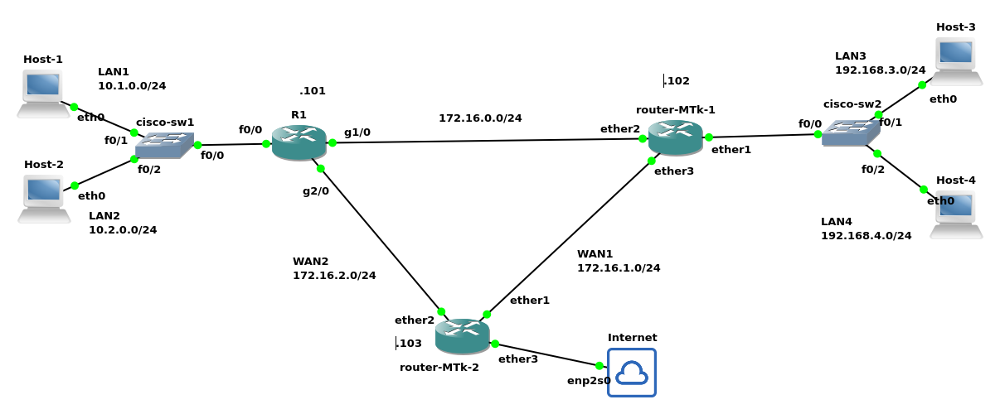

Este material mostrará a configuração básica de uma rede com dois roteadores Mikrotik. Sendo esses os ``router-MTk-1`` e ``router-MTk-2``, tais roteadores terão suas interfaces de rede configuradas, utilizarão o OSPF para compartilhamento de rotas e também será feito o uso de NAT em um dos roteadores. A Figura 1, a seguir apresenta o cenário de rede proposto para tal prática.

|  |
|:--:|
| Figura 1 - Cenário de rede do Exemplo de configuração com Mikrotik

O cenário de Rede apresentado na Figura 1, foi implementado no **GNS3** e representa uma rede com segmentação por VLANs e roteamento inter-redes utilizando roteadores **Cisco** e **MikroTik (v17.1)**. Os **hosts finais** são computadores com **Debian Linux**, e todos os switches são **Cisco**.

## Topologia Geral da Rede

* As LANs  são compostas por quatro redes:

  * **LAN1 (VLAN 10)**: `10.1.0.0/24`;
  * **LAN2 (VLAN 20)**: `10.2.0.0/24`;
  * **LAN3 (VLAN 30)**: `192.168.3.0/24`;
  * **LAN4 (VLAN 40)**: `192.168.4.0/24`.

* Os roteadores utilizam, como último octeto, o número precedido do ponto ao seu lado na Figura 1. Por exemplo: `R1` utiliza `10.1.0.101` e `10.2.0.101`, pois ao lado dele há o ``.101``.

* A rede é composta por 3 roteadores:

  * `R1` (Cisco);
  * `router-MTk-1` (MikroTik);
  * `router-MTk-2` (MikroTik).

* As comunicações entre os roteadores são feitas por redes intermediárias:

  * `R1` ↔ `router-MTk-1`: `172.16.0.0/24` (WAN0)
  * `router-MTk-1` ↔ `router-MTk-2`: `172.16.1.0/24` (WAN1)
  * `R1` ↔ `router-MTk-2`: `172.16.2.0/24` (WAN2)
  
* O roteador `router-MTk-2` possui acesso à **Internet** através da interface `ether3`.

##  Tabela de Configuração dos Hosts

Segue a tabela de configuração de rede dos hosts finais do cenário de rede da Figura 1:

| Host   | Rede | IP          | Máscara       | Gateway       | VLAN |
| ------ | ---- | ----------- | ------------- | ------------- | ---- |
| Host-1 | LAN1 | 10.1.0.1    | 255.255.255.0 | 10.1.0.101    | 10   |
| Host-2 | LAN2 | 10.2.0.1    | 255.255.255.0 | 10.2.0.101    | 20   |
| Host-3 | LAN3 | 192.168.3.1 | 255.255.255.0 | 192.168.3.102 | 30   |
| Host-4 | LAN4 | 192.168.4.1 | 255.255.255.0 | 192.168.4.102 | 40   |


##  Tabela de Interfaces dos Roteadores

A seguir são apresentadas as configurações de rede dos roteadores com compõem o cenário de rede da Figura 1:

### Roteador **R1** (Cisco)

| Interface       | IP Address     | Rede/Sub-rede | Descrição                          |
| --------------- | -------------- | ------------- | ---------------------------------- |
| f0/0 (VLAN10)   | 10.1.0.101     | 10.1.0.0/24   | Conectado ao switch LAN1 (VLAN 10) |
| f0/0 (VLAN20)   | 10.2.0.101     | 10.2.0.0/24   | Conectado ao switch LAN2 (VLAN 20) |
| g1/0            | 172.16.0.101   | 172.16.0.0/24 | Conectado ao router-MTk-1          |
| g2/0            | 172.16.2.101   | 172.16.2.0/24 | Conectado ao router-MTk-2          |

### Roteador **router-MTk-1** (MikroTik 17.1)

| Interface         | IP Address      | Rede/Sub-rede    | Descrição                                                   |
| ----------------- | --------------- | ---------------- | ----------------------------------------------------------- |
| ether1 (VLAN30)   | 192.168.3.102   | 192.168.3.0/24   | Conectado ao switch LAN3 (VLAN 30)                          |
| ether1 (VLAN40)   | 192.168.4.102   | 192.168.4.0/24   | Conectado ao switch LAN4 (VLAN 40)                          |
| ether2            | 172.16.0.102    | 172.16.0.0/24    | Conectado ao R1                                             |
| ether3            | 172.16.1.102    | 172.16.1.0/24    | Conectado ao router-MTk-2                                   |

> configurar `ether1` com subinterfaces para tratar múltiplas VLANs (ex: VLAN 30 e VLAN 40 com trunk/tag).

### Roteador **router-MTk-2** (MikroTik 17.1)

| Interface | IP Address   | Rede/Sub-rede       | Descrição                         |
| --------- | ------------ | ------------------- | --------------------------------- |
| ether1    | 172.16.1.103 | 172.16.1.0/24       | Conectado ao router-MTk-1         |
| ether2    | 172.16.2.103 | 172.16.2.0/24       | Conectado ao R1                   |
| ether3    | DHCP         | Internet (dinâmico) | Conectado ao provedor de Internet |


## Observações Adicionais

* **Switches Cisco** (cisco-sw1 e cisco-sw2) são utilizados para fornecer conectividade e segmentação por VLAN entre os *hosts* e os roteadores.
* O roteador **router-MTk-2** fornece acesso à internet via interface `ether3`, permitindo que a rede seja testada com saída externa.
* As VLANs são configuradas nos *switches* para garantir o isolamento de camada 2 entre as sub-redes.
* Os roteadores realizam o roteamento entre VLANs e interligam as diferentes LANs e redes WAN.


# Configuração do ``router-MTk-1``

Dado que esse roteador não possuía configuração prévia (por exemplo, recém-saído da caixa), o MikroTik inicia questionando um usuário e senha padrão. Neste caso, o usuário é ``admin`` com a senha em branco (sem senha), conforme o exemplo:

```console
MikroTik 7.17.1 (stable)
   MikroTik Login: admin                                                                                                                                                                         Password:
```

Após isso, ele questiona se o administrador quer ver a licença. Vamos responder que não (``N``):


```console
  MMM      MMM       KKK                          TTTTTTTTTTT      KKK
  MMMM    MMMM       KKK                          TTTTTTTTTTT      KKK
  MMM MMMM MMM  III  KKK  KKK  RRRRRR     OOOOOO      TTT     III  KKK  KKK
  MMM  MM  MMM  III  KKKKK     RRR  RRR  OOO  OOO     TTT     III  KKKKK
  MMM      MMM  III  KKK KKK   RRRRRR    OOO  OOO     TTT     III  KKK KKK
  MMM      MMM  III  KKK  KKK  RRR  RRR   OOOOOO      TTT     III  KKK  KKK

  MikroTik RouterOS 7.17.1 (c) 1999-2025       https://www.mikrotik.com/


Do you want to see the software license? [Y/n]:
```

Então o roteador questiona a respeito da nova senha. Após inserir a nova senha duas vezes (para confirmação), um *prompt* de comando será apresentado, tal como:

```console
Press F1 for help

2025-07-21 17:18:42 system,error,critical login failure for user admin via local

Change your password
new password> ********
repeat new password> ********

Password changed
[admin@MikroTik] > 
```

Os passos apresentados anteriormente são realizados apenas na primeira configuração do MikroTik ou caso as configurações sejam reinicializadas.

> Neste modelo de roteador é possível reiniciar a configuração com os comandos: ``/system reset-configuration``, ou ``/system reset-configuration no-defaults=no skip-backup=yes``, sendo que o segundo apaga os arquivos de backup também (todos arquivos).


## Configuração das placas de rede ``ether2`` e ``ether3``

A configuração das placas de rede ``ether2`` e ``ether3`` é a configuração tradicional, atribuindo IP e máscara, sendo:

```console
[admin@MikroTik] > ip address add address=172.16.0.102/24 interface=ether2
[admin@MikroTik] > ip address add address=172.16.1.102/24 interface=ether3
```

Os comandos anteriores atribuíram os IPs 172.16.0.102 para a interface ``ether2`` e 172.16.1.102 para a interface de rede ``ether3``, conforme indicado na Figura 1.

## Configuração de placa de rede em VLAN

A interface de rede ``ether1`` do ``router-MTk-1`` está conectada a duas VLANs, sendo uma a VLAN 30 e a outra a VLAN40, que são, respectivamente, as LAN3 e LAN4.

Essas VLANs estão devidamente configuradas no ``cisco-sw2``, sendo que:

* Porta f0/1 - está na VLAN 30;
* Porta f0/2 - está na VLAN 40;
* Porta f0/0 - é uma porta *trunk* que envia quadros de rede das VLANS 30 e 40 para o roteador ``router-MTk-1``.

Então no ``router-MTk-1``, dada que a configuração do *switch* já está pronta, agora basta configurar o roteador MikroTik da seguinte forma:

1. Primeiro iniciamos criando essa relação das VLANs com a placa de rede ``ether1``:

```console
[admin@MikroTik] > interface/ vlan add interface=ether1 name=vlan30 vlan-id=30
[admin@MikroTik] > interface/ vlan add interface=ether1 name=vlan40 vlan-id=40
```

2. Depois é só atribuir os IPs as interfaces de rede da VLAN correta:

```console
[admin@MikroTik] > ip address add address=192.168.3.102/24 interface=vlan30
[admin@MikroTik] > ip address add address=192.168.4.102/24 interface=vlan40
```

A configuração de rede (IP e máscara) deste roteador está pronta, é possível ver tal configuração da seguinte forma:

* No caso dos IPs e máscaras, isso pode ser feito com o comando ``ip address print``:
```console
[admin@MikroTik] > /ip address/ print 
Columns: ADDRESS, NETWORK, INTERFACE
# ADDRESS           NETWORK      INTERFACE
0 172.16.0.102/24   172.16.0.0   ether2   
1 172.16.1.102/24   172.16.1.0   ether3   
2 192.168.3.102/24  192.168.3.0  vlan30   
3 192.168.4.102/24  192.168.4.0  vlan40   
```

* Já para ver as configurações das VLANs:
```console
[admin@MikroTik] > /interface/ vlan/ print 
Flags: R - RUNNING
Columns: NAME, MTU, ARP, VLAN-ID, INTERFACE
#   NAME     MTU  ARP      VLAN-ID  INTERFACE
0 R vlan30  1500  enabled       30  ether1   
1 R vlan40  1500  enabled       40  ether1
```

Também é possível "pingar" o Host-3 e Host-4, se eles já estiverem configurados e ativos na rede, tal como:

```console
[admin@MikroTik] > ping 192.168.3.1
  SEQ HOST                                     SIZE TTL TIME       STATUS                                                                                                                   
    0 192.168.3.1                                56  64 818us     
    1 192.168.3.1                                56  64 1ms14us   
    2 192.168.3.1                                56  64 1ms244us  
    sent=3 received=3 packet-loss=0% min-rtt=818us avg-rtt=1ms25us max-rtt=1ms244us 

[admin@MikroTik] > ping 192.168.4.1 
  SEQ HOST                                     SIZE TTL TIME       STATUS                                                                                                                   
    0 192.168.4.1                                56  64 745us     
    1 192.168.4.1                                56  64 501us     
    2 192.168.4.1                                56  64 1ms259us  
    sent=3 received=3 packet-loss=0% min-rtt=501us avg-rtt=835us max-rtt=1ms259us
```

> Para cancelar o ``ping`` pressione ``Ctrl+C``.

## Configuração do OSPF

Nesta rede de exemplo (ver Figura 1), está sendo utilizado o protocolo OSPF para compartilhar/propagar as rotas dentre os roteadores do cenário. Assim, para realizar tal configuração no MikroTik, basta executar os seguintes comandos:

```console
[admin@MikroTik] > routing ospf instance add name=ospf1 router-id=102.0.0.2                                     
[admin@MikroTik] > routing ospf area add instance=ospf1 name=backbone            
[admin@MikroTik] > routing ospf interface-template add area=backbone networks=192.168.3.0/24            
[admin@MikroTik] > routing ospf interface-template add area=backbone networks=192.168.4.0/24 
[admin@MikroTik] > routing ospf interface-template add area=backbone networks=172.16.0.0/24 
[admin@MikroTik] > routing ospf interface-template add area=backbone networks=172.16.1.0/24 
```

No exemplo anterior, iniciá-se criando uma instância de um processo OSPF chamado ``ospf1``. O roteador também foi identificado na rede OSPF como ``102.0.0.2`` - um endereço semelhante a um IPv4 (mas não é um IP) utilizado para identificar unicamente o roteador OSPF na rede. O segundo comando cria uma área para a instância ``ospf1``, sendo essa a área 0 (ou 0.0.0.0), que neste caso é identificada pelo MikroTik com o nome ``backbone``. Por fim, são adicionadas às redes: 192.168.3.0/24, 192.168.4.0/24, 172.16.0.0/24 e 172.16.1.0/24, para serem publicadas pelo rotador aos outros roteadores da rede através da área 0/``backbone``.


Feito isso e com os outros roteadores já em funcionamento é possível verificar as rotas obtidas via comando:

```
[admin@MikroTik] > ip route print 
Flags: D - DYNAMIC; A - ACTIVE; c - CONNECT, o - OSPF; + - ECMP
Columns: DST-ADDRESS, GATEWAY, DISTANCE
     DST-ADDRESS     GATEWAY              DISTANCE
DAo  0.0.0.0/0       172.16.1.103%ether3       110
DAo  10.1.0.0/24     172.16.0.101%ether2       110
DAo  10.2.0.0/24     172.16.0.101%ether2       110
DAc  172.16.0.0/24   ether2                      0
DAc  172.16.1.0/24   ether3                      0
DAo+ 172.16.2.0/24   172.16.1.103%ether3       110
DAo+ 172.16.2.0/24   172.16.0.101%ether2       110
DAc  192.168.3.0/24  vlan30                      0
DAc  192.168.4.0/24  vlan40                      0
```

Note que, pela legenda do comando, que as rotas OSPF são identificadas pelo ``o`` na primeira coluna. 
Por exemplo: ``DAo  10.1.0.0/24     172.16.0.101%ether2       110``. O ``DAo``, indica em ordem, que é uma rota dinâmica, ativa e obtida via OSPF (ver legenda da saída anterior).

> Neste comando já temos todos os roteadores ativos, mas pela sequência desse texto, não haveria talvez as rotas do ``router-MTk-2``, que ainda não foi configurado no papel.


Também é possível verificar a configuração OSPF e o status da conexão entre os roteadores vizinhos com os seguintes comandos:

* Ver as instâncias OSPF no MikroTik:

```console
[admin@MikroTik] > /routing/ ospf/ instance/ print           
Flags: X - disabled, I - inactive 
 0   name="ospf1" version=2 vrf=main router-id=102.0.0.2
```

* Ver as áreas OSPF:

```console
[admin@MikroTik] > /routing/ ospf/ area print                
Flags: X - disabled, I - inactive, D - dynamic; T - transit-capable 
 0    name="backbone" instance=ospf1 area-id=0.0.0.0 type=default
```

* Ver redes que devem ser propagadas via OSPF pelo roteador:

```console
[admin@MikroTik] > /routing/ ospf/ interface-template/ print 
Flags: X - disabled, I - inactive 
 0   area=backbone instance-id=0 networks=192.168.3.0/24 type=broadcast 
     retransmit-interval=5s transmit-delay=1s hello-interval=10s dead-interval=40s 
     priority=128 cost=1 

 1   area=backbone instance-id=0 networks=192.168.4.0/24 type=broadcast 
     retransmit-interval=5s transmit-delay=1s hello-interval=10s dead-interval=40s 
     priority=128 cost=1 

 2   area=backbone instance-id=0 networks=172.16.0.0/24 type=broadcast 
     retransmit-interval=5s transmit-delay=1s hello-interval=10s dead-interval=40s 
     priority=128 cost=1 

 3   area=backbone instance-id=0 networks=172.16.1.0/24 type=broadcast 
     retransmit-interval=5s transmit-delay=1s hello-interval=10s dead-interval=40s 
     priority=128 cost=1 
```

* Verificar os roteadores OSPF vizinhos:

```console
[admin@MikroTik] > /routing/ ospf/ neighbor/ print           
Flags: V - virtual; D - dynamic 
 0  D instance=ospf1 area=backbone address=172.16.0.101 priority=1 router-id=101.0.0.0 
      dr=172.16.0.102 bdr=172.16.0.101 state="Full" state-changes=7 adjacency=34s 
      timeout=36s 

 1  D instance=ospf1 area=backbone address=172.16.1.103 priority=128 router-id=103.0.0.0 
      dr=172.16.1.103 bdr=172.16.1.102 state="Full" state-changes=6 adjacency=16m34s 
      timeout=32s 
```

## Configuração completa to ``router-MTk-1``

A configuração completa do ``router-MTk-1`` é apresentada através do comando ``/export`` e apresentada a seguir:

```console
# 2025-07-21 17:14:33 by RouterOS 7.17.1
# system id = SgoERsT1erM
#
/interface ethernet
set [ find default-name=ether1 ] disable-running-check=no
set [ find default-name=ether2 ] disable-running-check=no
set [ find default-name=ether3 ] disable-running-check=no
set [ find default-name=ether4 ] disable-running-check=no
set [ find default-name=ether5 ] disable-running-check=no
set [ find default-name=ether6 ] disable-running-check=no
set [ find default-name=ether7 ] disable-running-check=no
set [ find default-name=ether8 ] disable-running-check=no
/interface vlan
add interface=ether1 name=vlan30 vlan-id=30
add interface=ether1 name=vlan40 vlan-id=40
/port
set 0 name=serial0
/routing ospf instance
add disabled=no name=ospf1 originate-default=always router-id=102.0.0.2
/routing ospf area
add disabled=no instance=ospf1 name=backbone
/ip address
add address=172.16.0.102/24 interface=ether2 network=172.16.0.0
add address=172.16.1.102/24 interface=ether3 network=172.16.1.0
add address=192.168.3.102/24 interface=vlan30 network=192.168.3.0
add address=192.168.4.102/24 interface=vlan40 network=192.168.4.0
/ip dhcp-client
add interface=ether1
/routing ospf interface-template
add area=backbone disabled=no networks=192.168.3.0/24
add area=backbone disabled=no networks=192.168.4.0/24
add area=backbone disabled=no networks=172.16.0.0/24
add area=backbone disabled=no networks=172.16.1.0/24
/system note
set show-at-login=no
```

# Configuração do ``router-MTk-2``

Esse roteador é idêntico ao configurado anteriormente, com a diferença de não estar conectado a nenhuma VLAN.

## Configuração das interfaces de rede

A configuração das placas de rede do ``router-MTk-2`` é semelhante á do roteadores anterior. Os comandos necessários são apresentados a seguir:

```console
ip address add address=172.16.1.103/24 interface=ether1
ip address add address=172.16.2.103/24 interface=ether2
ip dhcp-client add interface=ether3
```

A única diferença da configuração do ``router-MTk-2`` em relação ao ``router-MTk-1``, além das VLANs, é que foi ativada a obtenção de configuração de rede via DHCP na interface de rede ``ether3``. Isso permite a configuração automática de IP, máscara de rede, rota padrão e DNS.

> Na verdade, neste caso, o comando ``ip dhcp-client add..`` nem é necessário, pois já fica habilitado por padrão no MikroTik. Então em alguns casos, o que seria necessário é desativar e não ativar a obtenção de IPs via DHCP.


## Habilitando NAT (máscaramento)

No cenário de rede da Figura 1, o ``router-MTk-2`` é o roteador que dá acesso à Internet, pois temos a Internet conectada à interface de rede ``ether3``. 
Desta forma, para que os outros *hosts* da rede tenham acesso à Internet, será necessário, neste caso, configurar um NAT. Assim, ao sair dessa rede que estamos configurando, os outros *hosts* desta rede receberão como IP de origem, o IP que está na interface de rede ``ether3``. 

> Note que isso é necessário pois o cenário de rede que estamos utilizando utiliza IPs privados e também que a estrutura de rede que está dentro da rede que simboliza a Internet não tem conhecimento das redes/rotas que estamos criando.

Para realizar um SNAT no MikroTik é necessário o seguinte comando:

```console
ip firewall nat add action=masquerade chain=srcnat out-interface=ether3
```

O comando anterior basicamente adiciona uma regra de NAT dizendo que tudo que sair pela interface de rede ``ether3`` deve ser mascarado (ter o endereço IP de origem alterado).

## Configuração do OSPF

A configuração do OSPF no ``router-MTk-2`` segue a mesma lógica da configuração OSPF do ``router-MTk-1``. Todavia, com a diferença de também publicar a rota padrão (0.0.0.0/0), já que este é o roteador padrão de toda a rede OSPF em questão. 

```console
routing ospf instance add name=ospf1 originate-default=always router-id=103.0.0.0
routing ospf area add instance=ospf1 name=backbone
routing ospf interface-template add area=backbone networks=172.16.1.0/24
routing ospf interface-template add area=backbone networks=172.16.2.0/24
```

Assim, os comandos anteriores realizam, em ordem, as seguintes ações:

* Cria uma instância e essa diz que deve compartilhar a rota padrão (``originate-default=always``);
* Cria a área ``backbone``;
* Adiciona as redes à serem publicadas: 172.16.1.0/24, 172.16.2.0/24.

Feito isso toda a rede deve estar conectada e já com acesso a Internet.

É possível ver a relação entre os vizinhos OSPF, tal como:

```console
[admin@MikroTik] > /routing/ ospf/ neighbor/ print 
Flags: V - virtual; D - dynamic 
 0  D instance=ospf1 area=backbone address=172.16.2.101 priority=1 router-id=101.0.0.0 
      dr=172.16.2.101 bdr=172.16.2.103 state="Full" state-changes=6 adjacency=12m25s 
      timeout=36s 

 1  D instance=ospf1 area=backbone address=172.16.1.102 priority=128 router-id=102.0.0.2 
      dr=172.16.1.103 bdr=172.16.1.102 state="Full" state-changes=5 adjacency=11m40s 
      timeout=36s 
```

Bem como a tabela de roteamento com as rotas OSPF obtidas:

```console
[admin@MikroTik] > /ip/ route/ print
Flags: D - DYNAMIC; A - ACTIVE; c - CONNECT, o - OSPF, d - DHCP; + - ECMP
Columns: DST-ADDRESS, GATEWAY, DISTANCE
     DST-ADDRESS     GATEWAY              DISTANCE
DAd  0.0.0.0/0       192.168.1.1                 1
DAo  10.1.0.0/24     172.16.2.101%ether2       110
DAo  10.2.0.0/24     172.16.2.101%ether2       110
DAo+ 172.16.0.0/24   172.16.1.102%ether1       110
DAo+ 172.16.0.0/24   172.16.2.101%ether2       110
DAc  172.16.1.0/24   ether1                      0
DAc  172.16.2.0/24   ether2                      0
DAc  192.168.1.0/24  ether3                      0
DAo  192.168.3.0/24  172.16.1.102%ether1       110
DAo  192.168.4.0/24  172.16.1.102%ether1       110
```

## Configuração completa do ``router-MTk-2``

A configuração completa do ``router-MTk-2`` é apresentada através a seguir:

```console
[admin@MikroTik] > /export 
# 2025-07-22 14:04:05 by RouterOS 7.17.1
# system id = SXGpSZcujKJ
#
/interface ethernet
set [ find default-name=ether1 ] disable-running-check=no
set [ find default-name=ether2 ] disable-running-check=no
set [ find default-name=ether3 ] disable-running-check=no
set [ find default-name=ether4 ] disable-running-check=no
set [ find default-name=ether5 ] disable-running-check=no
set [ find default-name=ether6 ] disable-running-check=no
set [ find default-name=ether7 ] disable-running-check=no
set [ find default-name=ether8 ] disable-running-check=no
/port
set 0 name=serial0
/routing ospf instance
add disabled=no name=ospf1 originate-default=always router-id=103.0.0.0
/routing ospf area
add disabled=no instance=ospf1 name=backbone
/ip address
add address=172.16.2.103/24 interface=ether2 network=172.16.2.0
add address=172.16.1.103/24 interface=ether1 network=172.16.1.0
/ip dhcp-client
add interface=ether3
/ip firewall nat
add action=masquerade chain=srcnat out-interface=ether3
/routing ospf interface-template
add area=backbone disabled=no networks=172.16.2.0/24
add area=backbone disabled=no networks=172.16.1.0/24
/system note
set show-at-login=no
```

## Arquivos de configuração dos outros hosts

Os outros *hosts* do cenário da Figura 1 não são MikroTik, então não é intenção deste material detalhar tal configuração.

* Hosts Linux:
  * [Host-1](Host-1.txt);
  * [Host-2](Host-2.txt);
  * [Host-3](Host-3.txt);
  * [Host-4](Host-4.txt);
* Switches CISCO:
  * [cisco-sw1](cisco-sw1.txt);
  * [cisco-sw2](cisco-sw2.txt);
* Router CISCO:
  * [R1](R1.txt);
