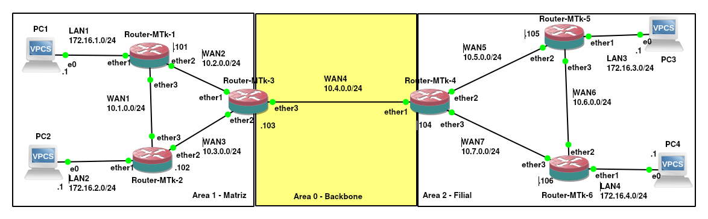

# Mikrotik - OSPF com áreas e alteração no custo do link

No desenvolvimento de redes de computadores, os protocolos de roteamento dinâmico desempenham um papel fundamental ao garantir que os pacotes de dados encontrem o melhor caminho até o seu destino. Historicamente, protocolos como o RIP (_Routing Information Protocol_) marcaram o início dessa automação utilizando como métrica principal a contagem de saltos. Para o RIP, o caminho ideal era simplesmente aquele que cruzava o menor número de roteadores, ignorando por completo a capacidade física das conexões. Essa abordagem criava limitações evidentes, pois o protocolo preferia uma linha lenta de 56 Kbps com apenas um salto a uma rota de dois saltos operando sobre fibra óptica a 1 Gbps.

Assim, o OSPF (_Open Shortest Path First_) surge como uma evolução direta para corrigir essa ineficiência. Baseado no algoritmo de Dijkstra, o OSPF calcula o menor caminho levando em consideração a largura de banda das interfaces, onde cada enlace recebe um custo inversamente proporcional à sua velocidade. Essa métrica calculada permite um uso muito mais inteligente da infraestrutura física, direcionando o tráfego para os links de maior capacidade e evitando gargalos em conexões lentas. Além disso, por ser um protocolo do tipo estado de enlace (*link-state*), cada roteador constrói um mapa topológico completo e idêntico da rede, garantindo uma convergência rápida e totalmente livre de laços de roteamento.

Embora a arquitetura de estado de enlace traga alta precisão, ela apresenta um desafio proporcional à medida que a rede cresce. **Em um domínio OSPF de área única, todos os roteadores precisam manter um banco de dados topológico idêntico**. Isso significa que, sempre que um link oscila ou uma interface altera seu estado, o roteador afetado envia atualizações chamadas LSAs (*Link State Advertisements*) para absolutamente todos os outros roteadores da rede. **Ao receber uma nova atualização, cada dispositivo é obrigado a reprocessar o algoritmo SPF para recalcular toda a sua tabela de roteamento**.

**Em redes de grande porte - especialmente aquelas que cobrem grandes distâncias geográficas através de enlaces WAN, rádio ou satélite, esse comportamento gera transtornos**. O envio constante de pacotes de controle em conexões lentas consome a largura de banda útil destinada ao tráfego dos usuários. Ao mesmo tempo, o reprocessamento frequente do algoritmo SPF sobrecarrega o processador e a memória dos roteadores. Uma simples instabilidade física em uma filial remota pode desencadear um efeito dominó, fazendo com que equipamentos localizados a centenas de quilômetros gastem recursos processando alterações irrelevantes para o seu contexto local.

**Para solucionar esse problema e conter o *overhead*, o OSPF permite a divisão da topologia em áreas**. Toda a rede é estruturada ao redor de uma área central obrigatória, conhecida como Área **_Backbone_ (Área 0.0.0.0)**, à qual todas as demais áreas secundárias devem se conectar. Essa divisão isola as oscilações topológicas dentro de suas respectivas regiões, impedindo que falhas locais afetem o processamento de toda a infraestrutura. Além disso, **os roteadores localizados nas bordas entre as áreas, chamados ABRs (*Area Border Routers*), conseguem sumarizar blocos inteiros de redes antes de anunciá-los para o restante da topologia, reduzindo drasticamente o tamanho das tabelas de roteamento e otimizando o uso das conexões de longa distância**.

Assim, **neste texto abordaremos na prática como criar e estruturar áreas hierárquicas no OSPF utilizando o MikroTik RouterOS v7. Além disso, faremos um teste simples para ver como manipular os custos das interfaces e como o OSPF trabalha quando esses custos são alterados.

## Cenário de rede de exemplo

Para demonstrar na prática os conceitos de manipulação de custo de link e, fundamentalmente, a estruturação de múltiplas áreas no MikroTik RouterOS v7, utilizaremos como referência a topologia de rede apresentada na Figura 1. Esta infraestrutura simula um ambiente corporativo completo composto por uma matriz (Área 1) e uma filial (Área 2) interconectadas por uma área central de trânsito (Área 0 - Backbone), permitindo analisar em detalhes a atribuição de endereços, a criação de modelos de interface (*interface-templates*) e o comportamento das rotas entre diferentes domínios OSPF.

|  |
|:--:|
| Figura 1 - Cenário de rede do exemplo

A seguir, descreve-se detalhadamente a infraestrutura de computadores, roteadores, redes LAN, conexões WAN, endereçamento IP, interfaces e a divisão de áreas OSPF do exemplo.

### Visão Geral das Áreas OSPF

A distribuição dos roteadores e a associação de cada uma de suas interfaces às respectivas áreas OSPF no ambiente proposto ocorrem da seguinte forma:

* **Router-MTk-1:** Está integralmente na Área 1 (Matriz), operando com as interfaces `ether1` (conectada à LAN1), `ether2` (enlace WAN2) e `ether3` (enlace WAN1) totalmente associadas a esta área.

* **Router-MTk-2:** Assim como o primeiro equipamento, é um roteador interno da Área 1 (Matriz), mantendo suas interfaces `ether1` (conectada à LAN2), `ether2` (enlace WAN3) e `ether3` (enlace WAN1) pertencentes à mesma região.

* **Router-MTk-3:** Atua como Roteador de Borda de Área (ABR), dividindo suas conexões entre dois domínios; suas interfaces `ether1` (enlace WAN2) e `ether2` (enlace WAN3) pertencem à Área 1 (Matriz), enquanto a interface `ether3` (enlace WAN4) está associada à Área 0 (Backbone).

* **Router-MTk-4:** Opera como o segundo ABR da infraestrutura, conectando a Área 0 (Backbone) por meio de sua interface `ether1` (enlace WAN4) e estendendo a rede para a Área 2 (Filial) através das interfaces `ether2` (enlace WAN5) e `ether3` (enlace WAN7).

* **Router-MTk-5:** Trata-se de um roteador interno da Área 2 (Filial), no qual as interfaces `ether1` (conectada à LAN3), `ether2` (enlace WAN5) e `ether3` (enlace WAN6) fazem parte integralmente dessa área secundária.

* **Router-MTk-6:** Também localizado internamente na Área 2 (Filial), possui todas as suas interfaces integradas a esse domínio, sendo a `ether1` (conectada à LAN4), a `ether2` (enlace WAN6) e a `ether3` (enlace WAN7).


### Endereços IPs por interfaces dos dispositivos de rede

A tabela a seguir apresenta o mapeamento completo dos hosts, suas respectivas placas de rede com seus endereços IP e a área OSPF à qual cada interface pertence:

| Nome do Host | Placa de Rede | Endereço IP | Área OSPF |
| --- | --- | --- | --- |
| **PC1** | `e0` | `172.16.1.1/24` | N/A (Host)

 |
| **Router-MTk-1** | `ether1`<br>

<br>`ether2`<br>

<br>`ether3` | `172.16.1.101/24`<br>

<br>`10.2.0.101/24`<br>

<br>`10.1.0.101/24` | Area 1 - Matriz<br>

<br>Area 1 - Matriz<br>

<br>Area 1 - Matriz

 |
| **PC2** | `e0` | `172.16.2.1/24` | N/A (Host)

 |
| **Router-MTk-2** | `ether1`<br>

<br>`ether2`<br>

<br>`ether3` | `172.16.2.102/24`<br>

<br>`10.3.0.102/24`<br>

<br>`10.1.0.102/24` | Area 1 - Matriz<br>

<br>Area 1 - Matriz<br>

<br>Area 1 - Matriz

 |
| **Router-MTk-3 (ABR)** | `ether1`<br>

<br>`ether2`<br>

<br>`ether3` | `10.2.0.103/24`<br>

<br>`10.3.0.103/24`<br>

<br>`10.4.0.103/24` | Area 1 - Matriz<br>

<br>Area 1 - Matriz<br>

<br>**Area 0 - Backbone**<br> |
| **Router-MTk-4 (ABR)** | `ether1`<br>

<br>`ether2`<br>

<br>`ether3` | `10.4.0.104/24`<br>

<br>`10.5.0.104/24`<br>

<br>`10.7.0.104/24` | **Area 0 - Backbone**<br>

<br>Area 2 - Filial<br>

<br>Area 2 - Filial

 |
| **Router-MTk-5** | `ether1`<br>

<br>`ether2`<br>

<br>`ether3` | `172.16.3.105/24`<br>

<br>`10.5.0.105/24`<br>

<br>`10.6.0.105/24` | Area 2 - Filial<br>

<br>Area 2 - Filial<br>

<br>Area 2 - Filial

 |
| **Router-MTk-6** | `ether1`<br>

<br>`ether2`<br>

<br>`ether3` | `172.16.4.106/24`<br>

<br>`10.6.0.106/24`<br>

<br>`10.7.0.106/24` | Area 2 - Filial<br>

<br>Area 2 - Filial<br>

<br>Area 2 - Filial

 |
| **PC3** | `e0` | `172.16.3.1/24` | N/A (Host)

 |
| **PC4** | `e0` | `172.16.4.1/24` | N/A (Host)

 |

 Todos os passos demonstrados neste exemplo: configuração das interfaces de rede, configuração do OSPF e testes - estão registrados no vídeo a seguir, bem como neste texto.

<div style="position: relative; padding-bottom: 56.25%; height: 0; overflow: hidden; max-width: 100%; margin-bottom: 1rem;">
  <iframe src="https://www.youtube.com/embed/e08CEkcHmtQ" style="position: absolute; top: 0; left: 0; width: 100%; height: 100%; border:0;" allowfullscreen title="Demonstração Prática no YouTube"></iframe>
</div>
 
 **Observação:** Vale destacar que toda a topologia deste laboratório foi simulada no software **GNS3**, e que os computadores representados no cenário são **VPCS** (Virtual PC Simulator). A título de exemplo, a configuração de IP, máscara de rede e gateway do PC1 foi realizada utilizando a seguinte sintaxe:
```text
set pcname PC1
ip 172.16.1.1 255.255.255.0 172.16.1.101
```
 
Os demais computadores da rede (PC2, PC3 e PC4) foram configurados utilizando essa mesma estrutura de comandos, diferenciando-se apenas pelos seus respectivos endereços IP e gateways. Como o foco deste material é o protocolo de roteamento OSPF e a sua manipulação no MikroTik RouterOS, a etapa detalhada de configuração dos VPCS não será abordada.
 
 
### Configuração do Router-MTk-1

Iniciaremos a implementação prática configurando o roteador **Router-MTk-1** (identificado como `mtk1`). Os conceitos fundamentais e detalhes básicos de configuração do OSPF no RouterOS v7 podem ser consultados no guia complementar disponível em [OSPF em roteadores Mikrotik](https://luizsantos.github.io/cyberinfra/docs/mikrotik/ospf/mtk-ospf), de modo que neste texto nosso foco principal estará concentrado na estruturação das áreas e no direcionamento de custos.

Para preparar o equipamento para o roteamento dinâmico, o primeiro passo consiste em definir o seu nome no sistema e atribuir os endereços IP correspondentes a cada uma de suas três placas de rede conforme o planejamento da topologia. Isso é feito da seguinte forma:

```routeros
/system/identity/set name=mtk1
/ip/address/add address=172.16.1.101/24 interface=ether1
/ip/address/add address=10.2.0.101/24 interface=ether2
/ip/address/add address=10.1.0.101/24 interface=ether3
```
Com os endereços IP devidamente atribuídos às interfaces `ether1`, `ether2` e `ether3`, a conectividade de camada 3 nos enlaces locais está estabelecida, permitindo dar início às configurações do protocolo de roteamento.

Com a camada de rede pronta, o próximo passo é habilitar o processo do OSPF, declarar a área correspondente à Matriz e associar as interfaces físicas ao modelo de interface do protocolo. Tal tarefa é feita com os seguintes comandos:

```routeros
/routing/ospf/instance/add name=ospf1 router-id=1.1.1.1 redistribute=connected,static
/routing/ospf/area/add instance=ospf1 name=matriz area-id=0.0.0.1
/routing/ospf/interface-template/add area=matriz interfaces=ether2,ether3
```

Neste bloco de comandos, a configuração do OSPF no `mtk1` reflete diretamente a posição do equipamento na topologia. Primeiramente, a instância `ospf1` é criada com o `router-id=1.1.1.1` e configurada para redistribuir rotas conectadas e estáticas. Em seguida, cria-se a área personalizada chamada `matriz`, associada ao identificador numérico `area-id=0.0.0.1` (Área 1). Por fim, o modelo de interface (`interface-template`) adiciona as portas `ether2` (link WAN2) e `ether3` (link WAN1) dentro da área `matriz`, garantindo que esses enlaces estabeleçam adjacência OSPF estritamente nesse domínio e que as tabelas de estado de enlace dessa região permaneçam isoladas em relação a outras áreas da rede.

<!--
Password changed
[admin@MikroTik] > /system/identity/set name=mtk1
[admin@mtk1] > /ip/address/add address=172.16.1.101/24 interface=ether1
[admin@mtk1] > /ip/address/add address=10.2.0.101/24 interface=ether2        
[admin@mtk1] > /ip/address/add address=10.1.0.101/24 interface=ether3 
[admin@mtk1] > /routing/ospf/instance/add name=ospf1 router-id=1.1.1.1 redistribute=connected,static 
[admin@mtk1] > /routing/ospf/area/add instance=ospf1 name=matriz area-id=0.0.0.1
[admin@mtk1] > /routing/ospf/interface-template/add area=matriz interfaces=ether2,ether3
[admin@mtk1] >  
-->

### Configuração do Router-MTk-2

Seguindo para o segundo nó da topologia, realizaremos a configuração do **Router-MTk-2** (`mtk2`), roteador que também faz parte da estrutura interna da Área 1 (Matriz). Além das etapas de endereçamento e inicialização do protocolo, analisaremos os comandos de verificação para validar a formação de vizinhança e a convergência das rotas OSPF.

Assim como no primeiro equipamento, iniciamos alterando a identidade do sistema e aplicando os endereços IP correspondentes às interfaces físicas que conectam o `mtk2` à rede local (LAN2) e aos enlaces WAN1 e WAN3.

```routeros
/system/identity/set name=mtk2
/ip/address/add address=172.16.2.102/24 interface=ether1
/ip/address/add address=10.3.0.102/24 interface=ether2
/ip/address/add address=10.1.0.102/24 interface=ether3
```
A atribuição correta dos IPs nas portas `ether1`, `ether2` e `ether3` garante que o roteador esteja devidamente comunicado na camada de rede com seus vizinhos diretos e com os dispositivos da LAN local.

Na sequência, instanciamos o OSPF, declaramos a área `matriz` (`0.0.0.1`) e associamos as interfaces que farão a troca de pacotes do protocolo.

```routeros
/routing/ospf/instance/add name=ospf1 router-id=2.2.2.2 redistribute=connected,static
/routing/ospf/area/add instance=ospf1 name=matriz area-id=0.0.0.1
/routing/ospf/interface-template/add area=matriz interfaces=ether3,ether2
```

Neste bloco, criamos a instância `ospf1` definindo o identificador único `router-id=2.2.2.2`. Ao adicionar o modelo de interface (`interface-template`), vinculamos as portas `ether3` (link WAN1 direto com o `mtk1`) e `ether2` (link WAN3 em direção ao `mtk3`) à área `matriz`. Dessa forma, o `mtk2` passa a enviar e receber mensagens Hello para estabelecer Adjacências OSPF exclusivamente com os roteadores dessa mesma área.

Após aplicar as configurações, é essencial validar a operação do protocolo verificando se os roteadores vizinhos estabeleceram a comunicação corretamente e se a tabela de roteamento foi povoada com as novas rotas. O comando e a saída deve ser algo parecido com:

```routeros
[admin@mtk2] > /routing/ospf/neighbor/print 
Flags: V - VIRTUAL; D - DYNAMIC 
 0  D instance=ospf1 area=matriz interface=ether3 address=10.1.0.101 priority=128 router-id=1.1.1.1 dr=10.1.0.101 bdr=0.0.0.0 
      state="Full" state-changes=6 adjacency=3s timeout=37s 

[admin@mtk2] > /ip/route/print 
Flags: D - DYNAMIC; A - ACTIVE; c - CONNECT, o - OSPF
Columns: DST-ADDRESS, GATEWAY, ROUTING-TABLE, DISTANCE
    DST-ADDRESS    GATEWAY            ROUTING-TABLE  DISTANCE
DAc 10.1.0.0/24    ether3             main           0
DAo 10.2.0.0/24    10.1.0.101%ether3  main           110
DAc 10.3.0.0/24    ether2             main           0
DAo 172.16.1.0/24  10.1.0.101%ether3  main           110
DAc 172.16.2.0/24  ether1             main           0
```
A verificação dos vizinhos pelo comando `/routing/ospf/neighbor/print` é um passo crítico para confirmar a saúde do protocolo. Na saída obtida, observa-se que a adjacência com o roteador `1.1.1.1` (`mtk1`) através da interface `ether3` atingiu com sucesso o estado **`state="Full"`**. Isso indica que a troca de LSAs entre os equipamentos foi concluída e que ambos possuem o mesmo banco de dados topológico (LSDB) para esse enlace.

Já na análise da tabela de roteamento enviada pelo comando `/ip/route/print`, confirmamos que a troca de informações entre os roteadores está ocorrendo conforme o esperado. A presença das flags **`DAo`** (*Dynamic, Active, OSPF*) indica rotas aprendidas dinamicamente pelo protocolo com distância administrativa **110**. O ponto principal que comprova o sucesso da configuração é a presença da rota para a rede **`172.16.1.0/24` (LAN1)** via gateway `10.1.0.101%ether3`. Isso significa que o `mtk2` já reconhece o caminho até a rede local do `mtk1`, bem como a rede de trânsito `10.2.0.0/24` (WAN2), validando o perfeito funcionamento do OSPF dentro da Área 1 (Matriz).

<!--
[admin@MikroTik] > /system/identity/set name=mtk2
[admin@mtk2] > /ip/address/add address=172.16.2.102/24 interface=ether1
[admin@mtk2] > /ip/address/add address=10.3.0.102/24 interface=ether2        
[admin@mtk2] > /ip/address/add address=10.1.0.102/24 interface=ether3 
[admin@mtk2] > /routing/ospf/instance/add name=ospf1 router-id=2.2.2.2 redistribute=connected,static 
[admin@mtk2] > /routing/ospf/area/add instance=ospf1 name=matriz area-id=0.0.0.1
[admin@mtk2] > /routing/ospf/interface-template/add area=matriz interfaces=ether3,ether2
[admin@mtk2] > /routing/ospf/neighbor/print 
Flags: V - VIRTUAL; D - DYNAMIC 
 0  D instance=ospf1 area=matriz interface=ether3 address=10.1.0.101 priority=128 router-id=1.1.1.1 dr=10.1.0.101 bdr=0.0.0.0 
      state="Full" state-changes=6 adjacency=3s timeout=37s 
[admin@mtk2] > /ip/route/print 
Flags: D - DYNAMIC; A - ACTIVE; c - CONNECT, o - OSPF
Columns: DST-ADDRESS, GATEWAY, ROUTING-TABLE, DISTANCE
    DST-ADDRESS    GATEWAY            ROUTING-TABLE  DISTANCE
DAc 10.1.0.0/24    ether3             main                  0
DAo 10.2.0.0/24    10.1.0.101%ether3  main                110
DAc 10.3.0.0/24    ether2             main                  0
DAo 172.16.1.0/24  10.1.0.101%ether3  main                110
DAc 172.16.2.0/24  ether1             main                  0
-->

### Configuração do Router-MTk-3

Avançando na topologia, realizaremos a configuração do **Router-MTk-3** (`mtk3`), um nó central na arquitetura da rede. Este roteador desempenha a função estratégica de **ABR (_Area Border Router_)**, conectando o domínio da Matriz ao tronco principal da infraestrutura.

Então, iniciamos definindo o nome do sistema e aplicando os endereços IP nas três interfaces físicas do equipamento, cobrindo os enlaces WAN2, WAN3 e WAN4, com os seguintes comandos:

```routeros
/system/identity/set name=mtk3
/ip/address/add address=10.2.0.103/24 interface=ether1
/ip/address/add address=10.3.0.103/24 interface=ether2
/ip/address/add address=10.4.0.103/24 interface=ether3
```

Com o endereçamento configurado nas portas `ether1`, `ether2` e `ether3`, o `mtk3` estabelece presença física nos segmentos de rede que o vinculam tanto aos roteadores internos da Matriz quanto ao enlace de trânsito em direção à Filial.

A configuração do OSPF no `mtk3` diferencia-se dos equipamentos anteriores por envolver a declaração de **duas áreas OSPF distintas** na mesma instância de roteamento.

```routeros
/routing/ospf/instance/add name=ospf1 router-id=3.3.3.3 redistribute=static,connected
/routing/ospf/area/add instance=ospf1 name=matriz area-id=0.0.0.1
/routing/ospf/interface-template/add area=matriz interfaces=ether1,ether2
/routing/ospf/area/add instance=ospf1 name=backbone area-id=0.0.0.0
/routing/ospf/interface-template/add area=backbone interfaces=ether3
```

Neste bloco de comandos, após criar a instância `ospf1` (`router-id=3.3.3.3`), associamos as portas `ether1` (link WAN2) e `ether2` (link WAN3) à área `matriz` (`area-id=0.0.0.1`). Em seguida, declaramos a área `backbone` (`area-id=0.0.0.0`) e vinculamos a ela a interface `ether3` (link WAN4).

A razão fundamental para o `mtk3` possuir interfaces em duas áreas distintas é a sua atuação como ABR. No OSPF, a **Área Backbone (Área 0)** é estritamente obrigatória em redes multi-área, pois funciona como o núcleo central de trânsito por onde todo o tráfego entre áreas secundárias deve obrigatoriamente passar. A Área 0 previne *loops* de roteamento inter-área e consolida o banco de dados topológico central. Como ABR, o `mtk3` mantém um banco de dados de estado de enlace (LSDB) separado para cada área (`matriz` e `backbone`), isolando o *flooding* de LSAs locais da Área 1 enquanto converte e anuncia as informações de roteamento para o resto da rede corporativa.

Finalizada a configuração, verificamos a formação de vizinhanças e o comportamento da tabela de rotas do roteador de borda.

```routeros
[admin@mtk3] > /routing/ospf/neighbor/print 
Flags: V - VIRTUAL; D - DYNAMIC 
 0  D instance=ospf1 area=matriz interface=ether2 address=10.3.0.102 priority=128 router-id=2.2.2.2 dr=10.3.0.102 bdr=10.3.0.103 
      state="Full" state-changes=6 adjacency=56s timeout=34s 

 1  D instance=ospf1 area=matriz interface=ether1 address=10.2.0.101 priority=128 router-id=1.1.1.1 dr=10.2.0.101 bdr=10.2.0.103 
      state="Full" state-changes=6 adjacency=53s timeout=37s 

[admin@mtk3] > /ip/route/print 
Flags: D - DYNAMIC; A - ACTIVE; c - CONNECT, o - OSPF; + - ECMP
Columns: DST-ADDRESS, GATEWAY, ROUTING-TABLE, DISTANCE
     DST-ADDRESS    GATEWAY            ROUTING-TABLE  DISTANCE
DAo+ 10.1.0.0/24    10.3.0.102%ether2  main           110
DAo+ 10.1.0.0/24    10.2.0.101%ether1  main           110
DAc  10.2.0.0/24    ether1             main           0
DAc  10.3.0.0/24    ether2             main           0
DAc  10.4.0.0/24    ether3             main           0
DAo  172.16.1.0/24  10.2.0.101%ether1  main           110
DAo  172.16.2.0/24  10.3.0.102%ether2  main           110
```

Ao executar o comando `/routing/ospf/neighbor/print`, confirmamos duas adjacências ativas em estado **`Full`** dentro da área `matriz`: uma com o `mtk2` (`2.2.2.2`) via `ether2` e outra com o `mtk1` (`1.1.1.1`) via `ether1`. *(Note que a interface `ether3` ainda não apresenta vizinho ativo pois o roteador `mtk4` da outra ponta do Backbone ainda será configurado).*

Na tabela de roteamento exibida por `/ip/route/print`, observamos a perfeita convergência interna da Área 1 (Matriz). As redes **`172.16.1.0/24` (LAN1)** e **`172.16.2.0/24` (LAN2)** são aprendidas via OSPF (`DAo`). Um destaque importante é a rota para a rede **`10.1.0.0/24` (WAN1)**, identificada com a flag **`DAo+`**: o sinal de mais (`+`) indica **ECMP (_Equal-Cost Multi-Path_)**, mostrando que o `mtk3` identificou dois caminhos de custo idêntico para alcançar essa rede (seja via `10.3.0.102%ether2` ou via `10.2.0.101%ether1`), realizando o balanceamento de carga automaticamente.

<!--
[admin@MikroTik] > /system/identity/set name=mtk3
[admin@mtk3] > /ip/address/add address=10.2.0.103/24 interface=ether1
[admin@mtk3] > /ip/address/add address=10.3.0.103/24 interface=ether2 
[admin@mtk3] > /ip/address/add address=10.4.0.103/24 interface=ether3 
[admin@mtk3] > /routing/ospf/instance/add name=ospf1 router-id=3.3.3.3 redistribute=static,connected 
[admin@mtk3] > /routing/ospf/area/add instance=ospf1 name=matriz area-id=0.0.0.1
[admin@mtk3] > /routing/ospf/interface-template/add area=matriz interfaces=ether1,ether2
[admin@mtk3] > /routing/ospf/area/add instance=ospf1 name=backbone area-id=0.0.0.0
[admin@mtk3] > /routing/ospf/interface-template/add area=backbone interfaces=ether3
[admin@mtk3] > /routing/ospf/neighbor/print 
Flags: V - VIRTUAL; D - DYNAMIC 
 0  D instance=ospf1 area=matriz interface=ether2 address=10.3.0.102 priority=128 router-id=2.2.2.2 dr=10.3.0.102 bdr=10.3.0.103 
      state="Full" state-changes=6 adjacency=56s timeout=34s 

 1  D instance=ospf1 area=matriz interface=ether1 address=10.2.0.101 priority=128 router-id=1.1.1.1 dr=10.2.0.101 bdr=10.2.0.103 
      state="Full" state-changes=6 adjacency=53s timeout=37s 
[admin@mtk3] > /ip/route/print 
Flags: D - DYNAMIC; A - ACTIVE; c - CONNECT, o - OSPF; + - ECMP
Columns: DST-ADDRESS, GATEWAY, ROUTING-TABLE, DISTANCE
     DST-ADDRESS    GATEWAY            ROUTING-TABLE  DISTANCE
DAo+ 10.1.0.0/24    10.3.0.102%ether2  main                110
DAo+ 10.1.0.0/24    10.2.0.101%ether1  main                110
DAc  10.2.0.0/24    ether1             main                  0
DAc  10.3.0.0/24    ether2             main                  0
DAc  10.4.0.0/24    ether3             main                  0
DAo  172.16.1.0/24  10.2.0.101%ether1  main                110
DAo  172.16.2.0/24  10.3.0.102%ether2  main                110
-->

### Configuração do Router-MTk-4

Continuando a expansão da topologia, passamos para a configuração do **Router-MTk-4** (`mtk4`), equipamento que desempenha a função estratégica de segundo **ABR (Area Border Router)** da infraestrutura. Este roteador faz a ponte de comunicação entre a Área Backbone e a região correspondente à Filial.

Iniciamos novamente ajustando o nome do sistema e aplicando os endereços IP nas três portas físicas do roteador, habilitando a conectividade nos enlaces WAN4, WAN5 e WAN7. Isso é feito com os seguintes comandos:

```routeros
/system/identity/set name=mtk4
/ip/address/add address=10.4.0.104/24 interface=ether1
/ip/address/add address=10.5.0.104/24 interface=ether2
/ip/address/add address=10.7.0.104/24 interface=ether3
```

Com o endereçamento IP configurado nas interfaces `ether1`, `ether2` e `ether3`, o `mtk4` estabelece a conectividade física necessária para fechar o enlace de trânsito com a Matriz e estender o roteamento até os equipamentos da Filial.

Da mesma forma que o `mtk3`, o `mtk4` opera como um **ABR (Area Border Router)** e, portanto, exige a definição de duas áreas OSPF em sua instância de roteamento.

```routeros
/routing/ospf/instance/add name=ospf1 router-id=4.4.4.4 redistribute=connected,static
/routing/ospf/area/add instance=ospf1 area-id=0.0.0.0 name=backbone
/routing/ospf/area/add instance=ospf1 area-id=0.0.0.2 name=filial
/routing/ospf/interface-template/add area=backbone interfaces=ether1
/routing/ospf/interface-template/add area=filial interfaces=ether2,ether3
```

Neste bloco de comandos anterior, após criar a instância `ospf1` (`router-id=4.4.4.4`), declaramos a área `backbone` (`area-id=0.0.0.0`) e associamos a ela a interface `ether1` (enlace WAN4). Na sequência, criamos a área `filial` (`area-id=0.0.0.2` / Área 2) e vinculamos as portas `ether2` (enlace WAN5) e `ether3` (enlace WAN7).

A importância dessa configuração no `mtk4` reside no papel essencial do ABR em manter o isolamento do banco de dados de estado de enlace (LSDB) da Área 2 (`filial`) em relação às demais regiões. Ao interconectar a Área 2 diretamente à **Área 0 (Backbone)**, o `mtk4` garante que o tráfego vindo da Filial possa alcançar a Matriz de forma estruturada, respeitando a regra hierárquica do OSPF em que todo o tráfego inter-área deve transitar obrigatoriamente pelo Backbone.

Após a conclusão das configurações, validamos o estabelecimento do enlace com o Backbone e a recepção das rotas originadas no lado da Matriz, da seguinte forma:

```routeros
[admin@mtk4] > /routing/ospf/neighbor/print 
Flags: V - VIRTUAL; D - DYNAMIC 
 0  D instance=ospf1 area=backbone interface=ether1 address=10.4.0.103 priority=128 router-id=3.3.3.3 dr=10.4.0.103 bdr=10.4.0.104 
      state="Full" state-changes=6 adjacency=26s timeout=34s 

[admin@mtk4] > /ip/route/print 
Flags: D - DYNAMIC; A - ACTIVE; c - CONNECT, o - OSPF
Columns: DST-ADDRESS, GATEWAY, ROUTING-TABLE, DISTANCE
    DST-ADDRESS    GATEWAY            ROUTING-TABLE  DISTANCE
DAo 10.1.0.0/24    10.4.0.103%ether1  main           110
DAo 10.2.0.0/24    10.4.0.103%ether1  main           110
DAo 10.3.0.0/24    10.4.0.103%ether1  main           110
DAc 10.4.0.0/24    ether1             main           0
DAc 10.5.0.0/24    ether2             main           0
DAc 10.7.0.0/24    ether3             main           0
DAo 172.16.1.0/24  10.4.0.103%ether1  main           110
DAo 172.16.2.0/24  10.4.0.103%ether1  main           110
```

Ao executar o comando `/routing/ospf/neighbor/print`, verificamos que a adjacência com o ABR da Matriz (`3.3.3.3` - `mtk3`) através da interface `ether1` atingiu com sucesso o estado **`state="Full"`** dentro da área `backbone`. Isso confirma que o tronco principal da rede está plenamente operacional.

Na tabela de roteamento exibida por `/ip/route/print`, confirmamos a chegada de todas as redes pertencentes à Área 1 (Matriz) via OSPF (`DAo`), utilizando como gateway o IP `10.4.0.103%ether1`. Destacam-se o aprendizado dos enlaces de trânsito WAN1 (`10.1.0.0/24`), WAN2 (`10.2.0.0/24`) e WAN3 (`10.3.0.0/24`), bem como o alcance completo até as redes locais dos clientes **`172.16.1.0/24` (LAN1)** e **`172.16.2.0/24` (LAN2)**. *(Assim como ocorrido no mtk3, as vizinhanças nas portas ether2 e ether3 ainda serão estabelecidas à medida que os roteadores internos da Filial, mtk5 e mtk6, forem configurados).*

<!--
[admin@MikroTik] > /system/identity/set name=mtk4
[admin@mtk4] > /ip/address/add address=10.4.0.104/24 interface=ether1
[admin@mtk4] > /ip/address/add address=10.5.0.104/24 interface=ether2 
[admin@mtk4] > /ip/address/add address=10.7.0.104/24 interface=ether3 
[admin@mtk4] > /routing/ospf/instance/add name=ospf1 router-id=4.4.4.4 redistribute=connected,static 
[admin@mtk4] > /routing/ospf/area/add instance=ospf1 area-id=0.0.0.0 name=backbone
[admin@mtk4] > /routing/ospf/area/add instance=ospf1 area-id=0.0.0.2 name=filial   
[admin@mtk4] > /routing/ospf/interface-template/add area=backbone interfaces=ether1
[admin@mtk4] > /routing/ospf/interface-template/add area=filial interfaces=ether2,ether3        
[admin@mtk4] > /routing/ospf/neighbor/print 
Flags: V - VIRTUAL; D - DYNAMIC 
 0  D instance=ospf1 area=backbone interface=ether1 address=10.4.0.103 priority=128 router-id=3.3.3.3 dr=10.4.0.103 bdr=10.4.0.104 
      state="Full" state-changes=6 adjacency=26s timeout=34s 
[admin@mtk4] > /ip/route/print 
Flags: D - DYNAMIC; A - ACTIVE; c - CONNECT, o - OSPF
Columns: DST-ADDRESS, GATEWAY, ROUTING-TABLE, DISTANCE
    DST-ADDRESS    GATEWAY            ROUTING-TABLE  DISTANCE
DAo 10.1.0.0/24    10.4.0.103%ether1  main                110
DAo 10.2.0.0/24    10.4.0.103%ether1  main                110
DAo 10.3.0.0/24    10.4.0.103%ether1  main                110
DAc 10.4.0.0/24    ether1             main                  0
DAc 10.5.0.0/24    ether2             main                  0
DAc 10.7.0.0/24    ether3             main                  0
DAo 172.16.1.0/24  10.4.0.103%ether1  main                110
DAo 172.16.2.0/24  10.4.0.103%ether1  main                110
-->

### Configuração do Router-MTk-5

Continuando com a estruturação da rede, passamos para a configuração do **Router-MTk-5** (`mtk5`), um roteador interno localizado na Área 2 (Filial). Este nó é responsável por prover a conectividade para a rede local LAN3 e interconectar-se ao ABR da filial (`mtk4`) e ao roteador redundante (`mtk6`).

Tal como nos anteriores, iniciamos definindo a identidade do equipamento no sistema e atribuindo os endereços IP para as suas três interfaces de rede. Assim, executamos os seguintes comandos:

```routeros
/system/identity/set name=mtk5
/ip/address/add address=172.16.3.105/24 interface=ether1
/ip/address/add address=10.5.0.105/24 interface=ether2
/ip/address/add address=10.6.0.105/24 interface=ether3
```

Com os endereços IP atribuídos nas portas `ether1` (conectada ao PC3 na LAN3), `ether2` (enlace WAN5) e `ether3` (enlace WAN6), a camada de rede local e de enlace com a Filial fica devidamente estabelecida.

Na sequência, instanciamos o OSPF, criamos a área correspondente à Filial e associamos as interfaces que participarão da troca de informações do protocolo. tal como:

```routeros
/routing/ospf/instance/add name=ospf1 router-id=5.5.5.5 redistribute=connected,static
/routing/ospf/area/add instance=ospf1 name=filial area-id=0.0.0.2
/routing/ospf/interface-template/add area=filial interfaces=ether2,ether3
```

Neste bloco anterior, criamos a instância `ospf1` com o identificador `router-id=5.5.5.5`. Como o `mtk5` é um roteador interno da Filial, declaramos apenas a área `filial` (`area-id=0.0.0.2`). No modelo de interface (`interface-template`), adicionamos as portas `ether2` (link WAN5 direto para o `mtk4`) e `ether3` (link WAN6 para o `mtk6`), garantindo que a comunicação OSPF deste nó permaneça restrita e organizada dentro da Área 2.

Com a configuração aplicada, verificamos o estabelecimento da vizinhança OSPF e a convergência das rotas para todas as redes da topologia. A seguir são apresentados os comandos para isso e suas respectivas saídas:

```routeros
[admin@mtk5] > /routing/ospf/neighbor/print 
Flags: V - VIRTUAL; D - DYNAMIC 
 0  D instance=ospf1 area=filial interface=ether2 address=10.5.0.104 priority=128 router-id=4.4.4.4 dr=10.5.0.104 bdr=10.5.0.105 
      state="Full" state-changes=6 adjacency=36s timeout=34s 

[admin@mtk5] > /ip/route/print 
Flags: D - DYNAMIC; A - ACTIVE; c - CONNECT, o - OSPF
Columns: DST-ADDRESS, GATEWAY, ROUTING-TABLE, DISTANCE
    DST-ADDRESS    GATEWAY            ROUTING-TABLE  DISTANCE
DAo 10.1.0.0/24    10.5.0.104%ether2  main           110
DAo 10.2.0.0/24    10.5.0.104%ether2  main           110
DAo 10.3.0.0/24    10.5.0.104%ether2  main           110
DAo 10.4.0.0/24    10.5.0.104%ether2  main           110
DAc 10.5.0.0/24    ether2             main           0
DAc 10.6.0.0/24    ether3             main           0
DAo 10.7.0.0/24    10.5.0.104%ether2  main           110
DAo 172.16.1.0/24  10.5.0.104%ether2  main           110
DAo 172.16.2.0/24  10.5.0.104%ether2  main           110
DAc 172.16.3.0/24  ether1             main           0
```

Assim, verificar os vizinhos (comando `neighbor`), confirmamos que o `mtk5` estabeleceu adjacência no estado **`state="Full"`** com o ABR `4.4.4.4` (`mtk4`) através da interface `ether2`.

Na tabela de roteamento exibida por `/ip/route/print`, constatamos o pleno sucesso da integração entre as áreas. O `mtk5` aprendeu via OSPF (`DAo`) não apenas o enlace interno da Filial `10.7.0.0/24` (WAN7), mas também o enlace de trânsito da Área 0 (`10.4.0.0/24` - WAN4), os enlaces internos da Matriz (`10.1.0.0/24`, `10.2.0.0/24`, `10.3.0.0/24`) e, principalmente, os destinos finais nas LANs da Matriz: **`172.16.1.0/24` (LAN1)** e **`172.16.2.0/24` (LAN2)**, todos apontando como próximo salto o gateway `10.5.0.104%ether2`.

<!--
[admin@MikroTik] > /system/identity/set name=mtk5
[admin@mtk5] > /ip/address/add address=172.16.3.105/24 interface=ether1
[admin@mtk5] > /ip/address/add address=10.5.0.105/24 interface=ether2        
[admin@mtk5] > /ip/address/add address=10.6.0.105/24 interface=ether3 
[admin@mtk5] > /routing/ospf/instance/add name=ospf1 router-id=5.5.5.5 redistribute=connected,static 
[admin@mtk5] > /routing/ospf/area/add instance=ospf1 name=filial area-id=0.0.0.2
[admin@mtk5] > /routing/ospf/interface-template/add area=filial interfaces=ether2,ether3
[admin@mtk5] > /routing/ospf/neighbor/print 
Flags: V - VIRTUAL; D - DYNAMIC 
 0  D instance=ospf1 area=filial interface=ether2 address=10.5.0.104 priority=128 router-id=4.4.4.4 dr=10.5.0.104 bdr=10.5.0.105 
      state="Full" state-changes=6 adjacency=36s timeout=34s 
[admin@mtk5] > /ip/route/print 
Flags: D - DYNAMIC; A - ACTIVE; c - CONNECT, o - OSPF
Columns: DST-ADDRESS, GATEWAY, ROUTING-TABLE, DISTANCE
    DST-ADDRESS    GATEWAY            ROUTING-TABLE  DISTANCE
DAo 10.1.0.0/24    10.5.0.104%ether2  main                110
DAo 10.2.0.0/24    10.5.0.104%ether2  main                110
DAo 10.3.0.0/24    10.5.0.104%ether2  main                110
DAo 10.4.0.0/24    10.5.0.104%ether2  main                110
DAc 10.5.0.0/24    ether2             main                  0
DAc 10.6.0.0/24    ether3             main                  0
DAo 10.7.0.0/24    10.5.0.104%ether2  main                110
DAo 172.16.1.0/24  10.5.0.104%ether2  main                110
DAo 172.16.2.0/24  10.5.0.104%ether2  main                110
DAc 172.16.3.0/24  ether1             main                  0
-->

### Configuração do Router-MTk-6

Para finalizar a implantação da topologia, realizaremos a configuração do último equipamento da infraestrutura, o **Router-MTk-6** (`mtk6`). Localizado na Área 2 (Filial), este roteador é responsável por estender a conectividade até a rede local LAN4 (servindo o PC4) e fechar o anel de redundância interno da filial com o `mtk5` e o ABR `mtk4`.

Vamos iniciar novamente definindo o nome do sistema no RouterOS e atribuindo os respectivos endereços IP às três portas de rede do equipamento. Tal com mostra o bloco de comandos a seguir:

```routeros
/system/identity/set name=mtk6
/ip/address/add address=172.16.4.106/24 interface=ether1
/ip/address/add address=10.6.0.106/24 interface=ether2
/ip/address/add address=10.7.0.106/24 interface=ether3
```

Com os endereços IP devidamente associados às portas `ether1` (LAN4), `ether2` (enlace WAN6 com o `mtk5`) e `ether3` (enlace WAN7 com o `mtk4`), a comunicação direta de camada 3 na Filial está estabelecida.

Na sequência, criamos a instância do OSPF, declaramos a área local da Filial e associamos as portas físicas que farão a troca de pacotes de roteamento utilizando os comandos:

```routeros
/routing/ospf/instance/add name=ospf1 router-id=6.6.6.6 redistribute=connected,static
/routing/ospf/area/add instance=ospf1 name=filial area-id=0.0.0.2
/routing/ospf/interface-template/add area=filial interfaces=ether2,ether3
```

Neste bloco de comandos, instanciamos o protocolo sob o identificador `router-id=6.6.6.6` e declaramos a área `filial` (`area-id=0.0.0.2`). Ao adicionar o modelo de interface (`interface-template`), incluímos as portas `ether2` (link WAN6) e `ether3` (link WAN7) dentro do domínio da Área 2. Como o `mtk6` é um roteador interno, todas as suas conexões OSPF permanecem contidas e organizadas dentro desta área secundária.

Com a configuração do último nó concluída, a rede atinge sua total convergência. Verificamos as vizinhanças ativas e o estado da tabela de roteamento final:

```routeros
[admin@mtk6] > /routing/ospf/neighbor/print 
Flags: V - VIRTUAL; D - DYNAMIC 
 0  D instance=ospf1 area=filial interface=ether2 address=10.6.0.105 priority=128 router-id=5.5.5.5 dr=10.6.0.105 bdr=0.0.0.0 
      state="Full" state-changes=6 ls-retransmits=1 adjacency=8s timeout=32s 

 1  D instance=ospf1 area=filial interface=ether3 address=10.7.0.104 priority=128 router-id=4.4.4.4 dr=10.7.0.104 bdr=0.0.0.0 
      state="Full" state-changes=6 ls-retransmits=1 adjacency=8s timeout=32s 

[admin@mtk6] > /ip/route/print 
Flags: D - DYNAMIC; A - ACTIVE; c - CONNECT, o - OSPF; + - ECMP
Columns: DST-ADDRESS, GATEWAY, ROUTING-TABLE, DISTANCE
     DST-ADDRESS    GATEWAY            ROUTING-TABLE  DISTANCE
DAo  10.1.0.0/24    10.7.0.104%ether3  main           110
DAo  10.2.0.0/24    10.7.0.104%ether3  main           110
DAo  10.3.0.0/24    10.7.0.104%ether3  main           110
DAo  10.4.0.0/24    10.7.0.104%ether3  main           110
DAo+ 10.5.0.0/24    10.6.0.105%ether2  main           110
DAo+ 10.5.0.0/24    10.7.0.104%ether3  main           110
DAc  10.6.0.0/24    ether2             main           0
DAc  10.7.0.0/24    ether3             main           0
DAo  172.16.1.0/24  10.7.0.104%ether3  main           110
DAo  172.16.2.0/24  10.7.0.104%ether3  main           110
DAo  172.16.3.0/24  10.6.0.105%ether2  main           110
DAc  172.16.4.0/24  ether1             main           0

```

Executando o comando `print` em `/routing/ospf/neighbor/`, observamos que o `mtk6` estabeleceu com êxito duas adjacências ativas em estado **`state="Full"`**: uma na porta `ether2` com o `mtk5` (`5.5.5.5`) e outra na porta `ether3` com o ABR `mtk4` (`4.4.4.4`).

Ao analisar a tabela de roteamento fornecida por `/ip/route/print`, confirmamos que a infraestrutura multi-área está $100\%$ funcional. O `mtk6` aprendeu com precisão as rotas para todas as redes da empresa:

* **LANs da Matriz (`172.16.1.0/24` e `172.16.2.0/24`):** Alcançáveis via OSPF (`DAo`) atravessando o ABR pela interface `ether3` (`10.7.0.104`).

* **LAN3 da Filial (`172.16.3.0/24`):** Direcionada corretamente via `ether2` através do vizinho local `mtk5` (`10.6.0.105`).

* **Enlace WAN5 (`10.5.0.0/24`):** Marcado com **`DAo+` (ECMP)**, indicando que o OSPF encontrou dois caminhos de custo idêntico para alcançar a rede que une o `mtk4` ao `mtk5` (seja por `ether2` via `mtk5` ou por `ether3` via `mtk4`).

Com todas as áreas OSPF operacionais e os seis roteadores devidamente integrados, a comunicação ponta a ponta entre qualquer PC de qualquer área da corporação está totalmente estabelecida e otimizada.

<!--
[admin@MikroTik] > /system/identity/set name=mtk6
[admin@mtk6] > /ip/address/add address=172.16.4.106/24 interface=ether1
[admin@mtk6] > /ip/address/add address=10.6.0.106/24 interface=ether2        
[admin@mtk6] > /ip/address/add address=10.7.0.106/24 interface=ether3 
[admin@mtk6] > /routing/ospf/instance/add name=ospf1 router-id=6.6.6.6 redistribute=connected,static 
[admin@mtk6] > /routing/ospf/area/add instance=ospf1 name=filial area-id=0.0.0.2
[admin@mtk6] > /routing/ospf/interface-template/add area=filial interfaces=ether2,ether3
[admin@mtk6] > /routing/ospf/neighbor/print 
Flags: V - VIRTUAL; D - DYNAMIC 
 0  D instance=ospf1 area=filial interface=ether2 address=10.6.0.105 priority=128 router-id=5.5.5.5 dr=10.6.0.105 bdr=0.0.0.0 
      state="Full" state-changes=6 ls-retransmits=1 adjacency=8s timeout=32s 

 1  D instance=ospf1 area=filial interface=ether3 address=10.7.0.104 priority=128 router-id=4.4.4.4 dr=10.7.0.104 bdr=0.0.0.0 
      state="Full" state-changes=6 ls-retransmits=1 adjacency=8s timeout=32s 
[admin@mtk6] > /ip/route/print 
Flags: D - DYNAMIC; A - ACTIVE; c - CONNECT, o - OSPF; + - ECMP
Columns: DST-ADDRESS, GATEWAY, ROUTING-TABLE, DISTANCE
     DST-ADDRESS    GATEWAY            ROUTING-TABLE  DISTANCE
DAo  10.1.0.0/24    10.7.0.104%ether3  main                110
DAo  10.2.0.0/24    10.7.0.104%ether3  main                110
DAo  10.3.0.0/24    10.7.0.104%ether3  main                110
DAo  10.4.0.0/24    10.7.0.104%ether3  main                110
DAo+ 10.5.0.0/24    10.6.0.105%ether2  main                110
DAo+ 10.5.0.0/24    10.7.0.104%ether3  main                110
DAc  10.6.0.0/24    ether2             main                  0
DAc  10.7.0.0/24    ether3             main                  0
DAo  172.16.1.0/24  10.7.0.104%ether3  main                110
DAo  172.16.2.0/24  10.7.0.104%ether3  main                110
DAo  172.16.3.0/24  10.6.0.105%ether2  main                110
DAc  172.16.4.0/24  ether1             main                  0
-->

## Teste de conectividade da rede de exemplo

Com a topologia inteiramente configurada e o protocolo OSPF tendo atingido a convergência em todas as três áreas, avançamos para a fase de testes práticos de conectividade. Para validar que as tabelas de roteamento de todos os roteadores estão propagando corretamente o alcance entre as diferentes sub-redes, realizaremos os testes a partir da estação **PC1** (`172.16.1.1`), localizada na LAN1 da Matriz. O objetivo é disparar requisições de *ping* ICMP para cada um dos outros computadores espalhados pela topologia: **PC2** (`172.16.2.1`), **PC3** (`172.16.3.1`) e **PC4** (`172.16.4.1`). A seguir são apresentados os comandos e suas respectivas saídas:

```text
PC1> ping 172.16.2.1

84 bytes from 172.16.2.1 icmp_seq=1 ttl=62 time=1.202 ms
84 bytes from 172.16.2.1 icmp_seq=2 ttl=62 time=0.938 ms
84 bytes from 172.16.2.1 icmp_seq=3 ttl=62 time=1.178 ms
84 bytes from 172.16.2.1 icmp_seq=4 ttl=62 time=1.783 ms
84 bytes from 172.16.2.1 icmp_seq=5 ttl=62 time=0.987 ms

PC1> ping 172.16.3.1

84 bytes from 172.16.3.1 icmp_seq=1 ttl=60 time=4.431 ms
84 bytes from 172.16.3.1 icmp_seq=2 ttl=60 time=2.044 ms
84 bytes from 172.16.3.1 icmp_seq=3 ttl=60 time=2.169 ms
84 bytes from 172.16.3.1 icmp_seq=4 ttl=60 time=1.567 ms
84 bytes from 172.16.3.1 icmp_seq=5 ttl=60 time=1.761 ms

PC1> ping 172.16.4.1

84 bytes from 172.16.4.1 icmp_seq=1 ttl=60 time=1.970 ms
84 bytes from 172.16.4.1 icmp_seq=2 ttl=60 time=1.829 ms
84 bytes from 172.16.4.1 icmp_seq=3 ttl=60 time=1.506 ms
84 bytes from 172.16.4.1 icmp_seq=4 ttl=60 time=1.527 ms
84 bytes from 172.16.4.1 icmp_seq=5 ttl=60 time=2.573 ms
```

Analisando as respostas obtidas nos três testes, confirmamos o sucesso integral da comunicação na rede corporativa. O envio de pacotes do PC1 para o PC2 apresenta um valor de TTL (*Time to Live*) igual a **62**, indicando que o tráfego cruzou exatamente dois saltos de roteadores dentro da mesma área (`mtk1` e `mtk2`). Já ao alcançar os computadores da Filial (PC3 na LAN3 e PC4 na LAN4), observamos um TTL de **60**, o que reflete a passagem por quatro saltos de roteadores no caminho (`mtk1` na Área 1, os dois ABRs `mtk3` e `mtk4` transitando pela Área 0 e o roteador de destino final `mtk5` ou `mtk6` na Área 2). A taxa de $0\%$ de perda de pacotes e a estabilidade do tempo de resposta comprovam que o roteamento inter-área via Backbone OSPF está plenamente funcional e roteando o tráfego de ponta a ponta com máxima eficiência.


## Alterando e testando o estado do link em roteador da área Matriz

Com a topologia inteiramente operacional e os testes de conectividade concluídos, passaremos para a análise da **manipulação de custos de link** no OSPF. Como vimos na introdução, o OSPF utiliza o conceito de métrica baseada em custo para selecionar o melhor caminho de uma origem até um destino. Embora essa métrica seja originalmente calculada em função da largura de banda da interface, o administrador de rede tem a liberdade de alterar manualmente o valor do custo para influenciar e direcionar o tráfego conforme as necessidades de engenharia de tráfego da organização. No OSPF, **quanto menor o valor do custo, mais preferível é a rota**, enquanto valores de custo mais elevados tornam o caminho menos atraente para o algoritmo SPF.

Para entender o impacto direto do custo na seleção de rotas, iniciaremos analisando o cenário padrão atual, no qual todos os enlaces possuem custos idênticos. Essa condição pode ser confirmada observando o modelo de interface configurado no `mtk1`:

```routeros
[admin@mtk1] > /routing/ospf/interface-template/print 
Flags: X - DISABLED, I - INACTIVE 
 0   area=matriz interfaces=ether2,ether3 instance-id=0 type=broadcast retransmit-interval=5s transmit-delay=1s hello-interval=10s 
     dead-interval=40s priority=128 cost=1 
```

Como se observa na saída do comando `/routing/ospf/interface-template/print`, as interfaces `ether2` e `ether3` foram adicionadas dentro do mesmo *template*, herdando o valor padrão **`cost=1`**.

Para verificar qual caminho o tráfego está utilizando a partir do **PC1** em direção ao **PC2** (`172.16.2.1`), podemos utilizar o utilitário `trace` (ou `traceroute`). O comando `trace` envia pacotes com valores de TTL crescentes para mapear cada salto (*hop*) de roteador pelo qual a informação passa até atingir o destino final. Executando o teste no cenário de custo padrão, obtemos o seguinte resultado:

```text
PC1> trace 172.16.2.1
trace to 172.16.2.1, 8 hops max, press Ctrl+C to stop
 1   172.16.1.101   0.287 ms  0.261 ms  0.238 ms
 2   10.1.0.102   0.591 ms  0.593 ms  0.983 ms
 3   *172.16.2.1   1.211 ms (ICMP type:3, code:3, Destination port unreachable)
```

Na saída anterior, nota-se que o pacote sai do PC1 e atinge primeiramente o `mtk1` (`172.16.1.101`). Como ambas as interfaces WAN possuem custo 1, o OSPF escolheu o enlace direto através da interface `ether3` em direção ao IP `10.1.0.102` (`mtk2`), alcançando o PC2 em apenas 2 saltos de roteadores.

### Alterando o Custo do Link no MikroTik RouterOS v7

Para forçar o OSPF a utilizar um caminho alternativo, alteraremos o custo da interface `ether3` para que ela se torne uma rota menos preferível. No RouterOS v7, como as interfaces pertencem a modelos (*templates*), precisamos primeiro remover o modelo unificado que agrupa `ether2` e `ether3`. Em seguida, recriamos um modelo específico para a `ether2` mantendo o custo padrão (`cost=1`) e criamos um modelo individual para a `ether3` atribuindo um valor de custo intencionalmente elevado (`cost=99`). Isso pode ser feito da seguinte forma:

```routeros
[admin@mtk1] > /routing/ospf/interface-template/remove 0
[admin@mtk1] > /routing/ospf/interface-template/print   
Flags: X - DISABLED, I - INACTIVE 
[admin@mtk1] > /routing/ospf/interface-template/add area=matriz interfaces=ether2
[admin@mtk1] > /routing/ospf/interface-template/add area=matriz interfaces=ether3 cost=99
[admin@mtk1] > /routing/ospf/interface-template/print                                   
Flags: X - DISABLED, I - INACTIVE 
 0   area=matriz interfaces=ether2 instance-id=0 type=broadcast retransmit-interval=5s transmit-delay=1s hello-interval=10s 
     dead-interval=40s priority=128 cost=1 

 1   area=matriz interfaces=ether3 instance-id=0 type=broadcast retransmit-interval=5s transmit-delay=1s hello-interval=10s 
     dead-interval=40s priority=128 cost=99 
```

Ao redefinir as regras com comandos individuais de *template*, o `mtk1` passa a considerar que o caminho direto via `ether3` possui métrica total de custo $99$, enquanto a rota saindo pela `ether2` possui custo $1$. Ao recalcular o algoritmo SPF, o OSPF identifica que alcançar a rede do PC2 através da `ether2` (passando pelo roteador `mtk3` e depois por `mtk2`) possui um custo somado inferior ($1 + 1 = 2$) em relação ao link direto ($99$).

Executando novamente o teste de rastreamento a partir do PC1, confirmamos a mudança imediata no comportamento do roteamento:

```text
PC1> trace 172.16.2.1
trace to 172.16.2.1, 8 hops max, press Ctrl+C to stop
 1   172.16.1.101   0.461 ms  0.343 ms  0.337 ms
 2   10.2.0.103   0.984 ms  0.642 ms  0.832 ms
 3   10.1.0.102   1.422 ms  0.761 ms  0.756 ms
 4   *172.16.2.1   1.545 ms (ICMP type:3, code:3, Destination port unreachable)
```

Como demonstrado no resultado do `trace`, executado anteriormente, o fluxo de dados agora sai do `mtk1` (`172.16.1.101`), passa primeiro pelo ABR `mtk3` (`10.2.0.103`) e só então chega ao `mtk2` (`10.1.0.102`) antes de entregar o pacote ao PC2. Isso comprova que o OSPF priorizou um caminho com maior número de saltos físicos porque o custo era menor.

Caso o enlace primário na interface `ether2` venha a sofrer uma falha física ou seja desativado, o OSPF identificará a perda do caminho de menor custo e assumirá automaticamente a rota reserva através da interface `ether3` (com custo $99$), garantindo a redundância e a disponibilidade do serviço. Assim que a conectividade na `ether2` for restabelecida, o protocolo detectará o retorno do link de menor custo e fará a transição automática do tráfego de volta para a rota principal.

É fundamental destacar que todo esse recálculo de métricas e alteração de menor caminho ocorreu estritamente dentro da **Área 1 (Matriz)**. Por definição do protocolo, os detalhes das métricas internas e alterações topológicas de uma área não são propagados via *flooding* de LSAs para as outras áreas da rede (`Area 0` e `Area 2`). Essa é exatamente uma das maiores vantagens da divisão hierárquica por áreas: conter as oscilações e recálculos do SPF localmente, fazendo com que para o restante da corporação sejam anunciados apenas os prefixos das redes acessíveis, poupando processamento e banda nos enlaces remotos.


<!--
[admin@mtk1] > /routing/ospf/interface-template/print 
Flags: X - DISABLED, I - INACTIVE 
 0   area=matriz interfaces=ether2,ether3 instance-id=0 type=broadcast retransmit-interval=5s transmit-delay=1s hello-interval=10s 
     dead-interval=40s priority=128 cost=1 
[admin@mtk1] > /routing/ospf/interface-template/remove 0
[admin@mtk1] > /routing/ospf/interface-template/print   
Flags: X - DISABLED, I - INACTIVE 
[admin@mtk1] > /routing/ospf/interface-template/add area=matriz interfaces=ether2
[admin@mtk1] > /routing/ospf/interface-template/add area=matriz interfaces=ether3 cost=99
[admin@mtk1] > /routing/ospf/interface-template/print                                    
Flags: X - DISABLED, I - INACTIVE 
 0   area=matriz interfaces=ether2 instance-id=0 type=broadcast retransmit-interval=5s transmit-delay=1s hello-interval=10s 
     dead-interval=40s priority=128 cost=1 

 1   area=matriz interfaces=ether3 instance-id=0 type=broadcast retransmit-interval=5s transmit-delay=1s hello-interval=10s 
     dead-interval=40s priority=128 cost=99 
[admin@mtk1] > /routing/ospf/interface-template/print 
Flags: X - DISABLED, I - INACTIVE 
 0   area=matriz interfaces=ether2 instance-id=0 type=broadcast retransmit-interval=5s transmit-delay=1s hello-interval=10s 
     dead-interval=40s priority=128 cost=1 

 1   area=matriz interfaces=ether3 instance-id=0 type=broadcast retransmit-interval=5s transmit-delay=1s hello-interval=10s 
     dead-interval=40s priority=128 cost=99 
[admin@mtk1] > 
-->


## pc1

<!--
PC1> ping 172.16.2.1

84 bytes from 172.16.2.1 icmp_seq=1 ttl=62 time=1.202 ms
84 bytes from 172.16.2.1 icmp_seq=2 ttl=62 time=0.938 ms
84 bytes from 172.16.2.1 icmp_seq=3 ttl=62 time=1.178 ms
84 bytes from 172.16.2.1 icmp_seq=4 ttl=62 time=1.783 ms
84 bytes from 172.16.2.1 icmp_seq=5 ttl=62 time=0.987 ms

PC1> ping 172.16.3.1

84 bytes from 172.16.3.1 icmp_seq=1 ttl=60 time=4.431 ms
84 bytes from 172.16.3.1 icmp_seq=2 ttl=60 time=2.044 ms
84 bytes from 172.16.3.1 icmp_seq=3 ttl=60 time=2.169 ms
84 bytes from 172.16.3.1 icmp_seq=4 ttl=60 time=1.567 ms
84 bytes from 172.16.3.1 icmp_seq=5 ttl=60 time=1.761 ms

PC1> ping 172.16.4.1

84 bytes from 172.16.4.1 icmp_seq=1 ttl=60 time=1.970 ms
84 bytes from 172.16.4.1 icmp_seq=2 ttl=60 time=1.829 ms
84 bytes from 172.16.4.1 icmp_seq=3 ttl=60 time=1.506 ms
84 bytes from 172.16.4.1 icmp_seq=4 ttl=60 time=1.527 ms
84 bytes from 172.16.4.1 icmp_seq=5 ttl=60 time=2.573 ms
-->

<!--
PC1> trace 172.16.2.1
trace to 172.16.2.1, 8 hops max, press Ctrl+C to stop
 1   172.16.1.101   0.287 ms  0.261 ms  0.238 ms
 2   10.1.0.102   0.591 ms  0.593 ms  0.983 ms
 3   *172.16.2.1   1.211 ms (ICMP type:3, code:3, Destination port unreachable)

PC1> trace 172.16.2.1
trace to 172.16.2.1, 8 hops max, press Ctrl+C to stop
 1   172.16.1.101   0.461 ms  0.343 ms  0.337 ms
 2   10.2.0.103   0.984 ms  0.642 ms  0.832 ms
 3   10.1.0.102   1.422 ms  0.761 ms  0.756 ms
 4   *172.16.2.1   1.545 ms (ICMP type:3, code:3, Destination port unreachable)

PC1> trace 172.16.2.1
trace to 172.16.2.1, 8 hops max, press Ctrl+C to stop
 1   172.16.1.101   0.306 ms  0.188 ms  0.174 ms
 2   10.1.0.102   0.573 ms  0.511 ms  0.768 ms
 3   *172.16.2.1   1.330 ms (ICMP type:3, code:3, Destination port unreachable)

PC1> trace 172.16.2.1
trace to 172.16.2.1, 8 hops max, press Ctrl+C to stop
 1   172.16.1.101   0.418 ms  0.387 ms  0.361 ms
 2   10.1.0.102   2.341 ms  1.479 ms  1.263 ms
 3   *172.16.2.1   4.676 ms (ICMP type:3, code:3, Destination port unreachable)

PC1> trace 172.16.2.1
trace to 172.16.2.1, 8 hops max, press Ctrl+C to stop
 1   172.16.1.101   0.484 ms  0.699 ms  0.480 ms
 2   10.1.0.102   0.970 ms  0.777 ms  0.943 ms
 3   *172.16.2.1   1.339 ms (ICMP type:3, code:3, Destination port unreachable)

PC1> trace 172.16.2.1
trace to 172.16.2.1, 8 hops max, press Ctrl+C to stop
 1   172.16.1.101   0.408 ms  0.386 ms  0.360 ms
 2   10.1.0.102   1.524 ms  2.327 ms  0.945 ms
 3   *172.16.2.1   1.415 ms (ICMP type:3, code:3, Destination port unreachable)

PC1> trace 172.16.2.1
trace to 172.16.2.1, 8 hops max, press Ctrl+C to stop
 1   172.16.1.101   0.338 ms  0.233 ms  0.234 ms
 2   10.1.0.102   0.595 ms  0.571 ms  0.937 ms
 3   *172.16.2.1   1.781 ms (ICMP type:3, code:3, Destination port unreachable)

PC1> trace 172.16.2.1
trace to 172.16.2.1, 8 hops max, press Ctrl+C to stop
 1   172.16.1.101   1.893 ms  1.263 ms  0.411 ms
 2   10.1.0.102   3.248 ms  2.232 ms  1.748 ms
 3   *172.16.2.1   1.465 ms (ICMP type:3, code:3, Destination port unreachable)

PC1> trace 172.16.2.1
trace to 172.16.2.1, 8 hops max, press Ctrl+C to stop
 1   172.16.1.101   0.431 ms  0.311 ms  0.290 ms
 2   10.1.0.102   0.768 ms  0.758 ms  0.698 ms
 3   *172.16.2.1   1.067 ms (ICMP type:3, code:3, Destination port unreachable)

PC1> trace 172.16.2.1
trace to 172.16.2.1, 8 hops max, press Ctrl+C to stop
 1   172.16.1.101   1.995 ms  0.282 ms  0.377 ms
 2   10.1.0.102   0.850 ms  0.630 ms  0.665 ms
 3   *172.16.2.1   1.111 ms (ICMP type:3, code:3, Destination port unreachable)

PC1> trace 172.16.2.1
trace to 172.16.2.1, 8 hops max, press Ctrl+C to stop
 1   172.16.1.101   0.361 ms  0.284 ms  0.256 ms
 2   10.1.0.102   1.161 ms  1.110 ms  2.192 ms
 3   *172.16.2.1   5.005 ms (ICMP type:3, code:3, Destination port unreachable)

PC1> trace 172.16.2.1
trace to 172.16.2.1, 8 hops max, press Ctrl+C to stop
 1   172.16.1.101   0.354 ms  0.253 ms  0.279 ms
 2   10.1.0.102   0.556 ms  1.420 ms  1.686 ms
 3   *172.16.2.1   2.496 ms (ICMP type:3, code:3, Destination port unreachable)

PC1> trace 172.16.2.1
trace to 172.16.2.1, 8 hops max, press Ctrl+C to stop
 1   172.16.1.101   1.524 ms  0.374 ms  0.369 ms
 2   10.1.0.102   1.432 ms  1.877 ms  0.796 ms
 3   *172.16.2.1   0.703 ms (ICMP type:3, code:3, Destination port unreachable)

PC1> trace 172.16.2.1
trace to 172.16.2.1, 8 hops max, press Ctrl+C to stop
 1   172.16.1.101   0.329 ms  0.344 ms  1.123 ms
 2   10.1.0.102   1.057 ms  1.448 ms  2.338 ms
 3   *172.16.2.1   2.835 ms (ICMP type:3, code:3, Destination port unreachable)

PC1> trace 172.16.2.1
trace to 172.16.2.1, 8 hops max, press Ctrl+C to stop
 1   172.16.1.101   0.394 ms  0.217 ms  0.237 ms
 2   10.1.0.102   1.456 ms  0.606 ms  1.030 ms
 3   *172.16.2.1   4.261 ms (ICMP type:3, code:3, Destination port unreachable)

PC1> trace 172.16.2.1
trace to 172.16.2.1, 8 hops max, press Ctrl+C to stop
 1   172.16.1.101   0.358 ms  0.210 ms  0.218 ms
 2   10.1.0.102   2.606 ms  0.854 ms  1.631 ms
 3   *172.16.2.1   6.654 ms (ICMP type:3, code:3, Destination port unreachable)

PC1> trace 172.16.2.1
trace to 172.16.2.1, 8 hops max, press Ctrl+C to stop
 1   172.16.1.101   0.373 ms  0.797 ms  0.525 ms
 2   10.1.0.102   3.019 ms  2.374 ms  3.669 ms
 3   *172.16.2.1   4.301 ms (ICMP type:3, code:3, Destination port unreachable)

PC1> trace 172.16.2.1
trace to 172.16.2.1, 8 hops max, press Ctrl+C to stop
 1   172.16.1.101   0.446 ms  0.478 ms  0.292 ms
 2   10.1.0.102   1.621 ms  3.586 ms  1.094 ms
 3   *172.16.2.1   2.109 ms (ICMP type:3, code:3, Destination port unreachable)

PC1> trace 172.16.2.1
trace to 172.16.2.1, 8 hops max, press Ctrl+C to stop
 1   172.16.1.101   0.349 ms  0.261 ms  0.310 ms
 2   10.1.0.102   1.979 ms  0.873 ms  0.588 ms
 3   *172.16.2.1   1.717 ms (ICMP type:3, code:3, Destination port unreachable)

PC1> trace 172.16.2.1
trace to 172.16.2.1, 8 hops max, press Ctrl+C to stop
 1   172.16.1.101   0.334 ms  0.235 ms  0.277 ms
 2   10.1.0.102   0.560 ms  0.544 ms  0.947 ms
 3   *172.16.2.1   1.301 ms (ICMP type:3, code:3, Destination port unreachable)

PC1> trace 172.16.2.1
trace to 172.16.2.1, 8 hops max, press Ctrl+C to stop
 1   172.16.1.101   0.628 ms  0.349 ms  0.372 ms
 2   10.1.0.102   1.231 ms  0.850 ms  0.738 ms
 3   *172.16.2.1   1.278 ms (ICMP type:3, code:3, Destination port unreachable)

PC1> trace 172.16.2.1
trace to 172.16.2.1, 8 hops max, press Ctrl+C to stop
 1   172.16.1.101   0.387 ms  0.239 ms  0.208 ms
 2   10.1.0.102   0.923 ms  0.730 ms  0.644 ms
 3   *172.16.2.1   1.175 ms (ICMP type:3, code:3, Destination port unreachable)

PC1> trace 172.16.2.1
trace to 172.16.2.1, 8 hops max, press Ctrl+C to stop
 1   172.16.1.101   0.319 ms  0.278 ms  0.307 ms
 2   10.1.0.102   1.004 ms  0.749 ms  1.397 ms
 3   *172.16.2.1   1.826 ms (ICMP type:3, code:3, Destination port unreachable)

PC1> trace 172.16.2.1
trace to 172.16.2.1, 8 hops max, press Ctrl+C to stop
 1   172.16.1.101   0.427 ms  0.375 ms  0.851 ms
 2   10.1.0.102   1.788 ms  0.768 ms  4.921 ms
 3   *172.16.2.1   1.941 ms (ICMP type:3, code:3, Destination port unreachable)

PC1> trace 172.16.2.1
trace to 172.16.2.1, 8 hops max, press Ctrl+C to stop
 1   172.16.1.101   0.518 ms  0.225 ms  0.263 ms
 2   10.1.0.102   2.003 ms  1.481 ms  0.674 ms
 3   *172.16.2.1   2.612 ms (ICMP type:3, code:3, Destination port unreachable)

PC1> trace 172.16.2.1
trace to 172.16.2.1, 8 hops max, press Ctrl+C to stop
 1   172.16.1.101   0.319 ms  0.245 ms  0.257 ms
 2   10.1.0.102   0.549 ms  0.456 ms  0.614 ms
 3   *172.16.2.1   2.031 ms (ICMP type:3, code:3, Destination port unreachable)

PC1> trace 172.16.2.1
trace to 172.16.2.1, 8 hops max, press Ctrl+C to stop
 1   172.16.1.101   0.363 ms  0.307 ms  0.305 ms
 2   10.2.0.103   0.732 ms  0.634 ms  0.900 ms
 3   10.1.0.102   1.619 ms  1.426 ms  1.547 ms
 4   *172.16.2.1   1.957 ms (ICMP type:3, code:3, Destination port unreachable)
-->

## Conclusão

A implementação do protocolo OSPF nesta topologia demonstrou a eficiência e a robustez do roteamento dinâmico no gerenciamento de redes corporativas escaláveis. Ao dividir a infraestrutura em áreas hierárquicas - combinando o backbone (`Area 0`) com áreas periféricas de Matriz (`Area 1`) e Filial (`Area 2`), foi possível estruturar um domínio de roteamento organizado e altamente eficiente.

O uso da plataforma MikroTik RouterOS v7 provou ser uma solução flexível para a criação de redes OSPF. Por meio de comandos diretos para definição de instâncias, áreas e modelos de interface (*interface templates*), o sistema permitiu estabelecer adjacências estáveis e manipular parâmetros de forma rápida e eficaz. A visibilidade proporcionada pelas ferramentas do RouterOS (como o monitoramento de vizinhos com `/routing/ospf/neighbor/print` e a inspeção da tabela de rotas com `/ip/route/print`) facilitou a validação de cada etapa do processo.

Os testes práticos demonstram o sucesso da configuração ao demonstrar que a execução dos *pings* a partir do **PC1** demostra a conectividade com os demais hosts (**PC2**, **PC3** e **PC4**), confirmando a correta troca de LSAs entre as áreas; além disso, a alteração da métrica na interface `ether3` do `mtk1` (de custo 1 para 99) evidenciou a eficácia do algoritmo SPF ao redirecionar dinamicamente o tráfego do PC1 para o PC2 por um caminho com mais saltos (`mtk1` $\rightarrow$ `mtk3` $\rightarrow$ `mtk2`), porém com menor custo total, enquanto manteve as áreas remotas (`Area 0` e `Area 2`) isoladas desses recálculos locais, preservando a estabilidade da topologia e a eficiência da rede.

## Referências Bibliográficas

**AHA-SENA, Valter.** *Redes de Computadores: Teoria e Prática com MikroTik RouterOS*. São Paulo: Editora Érica, 2019.

**ALCÂNTARA, Leonardo.** *MikroTik RouterOS v7 na Prática: Roteamento Avançado, OSPF e BGP*. Rio de Janeiro: Ciênc. Moderna, 2022.

**COMER, Douglas E.** *Interligação de Redes com TCP/IP: Princípios, Protocolos e Arquitetura*. 6. ed. Rio de Janeiro: Elsevier, 2015. v. 1.

**MIKROTIK.** *MikroTik Documentation: OSPF*. Disponível em: [https://help.mikrotik.com/docs/display/ROS/OSPF](https://help.mikrotik.com/docs/display/ROS/OSPF). Acesso em: 2026.

**MOY, John T.** *OSPF: Anatomy of an Internet Routing Protocol*. Reading: Addison-Wesley, 1998.

**NETWORK WORLD.** *OSPF Fundamentals and Multi-Area Network Design*. Disponível em: [https://www.networkworld.com](https://www.networkworld.com). Acesso em: 2026.

**NETWORKLESSONS.** *OSPF Configuration and Multi-Area Architecture*. Disponível em: [https://networklessons.com/cisco/ccna-routing-switching-icnd2-200-105/introduction-to-ospf](https://www.google.com/search?q=https://networklessons.com/cisco/ccna-routing-switching-icnd2-200-105/introduction-to-ospf). Acesso em: 2026.

**SANTOS, Luiz.** *Configuração Básica do OSPF no MikroTik RouterOS*. Disponível em: [https://luizsantos.github.io/cyberinfra/docs/mikrotik/ospf/mtk-ospf](https://luizsantos.github.io/cyberinfra/docs/mikrotik/ospf/mtk-ospf). Acesso em: 2026.

**TANENBAUM, Andrew S.; WETHERALL, David.** *Redes de Computadores*. 5. ed. São Paulo: Pearson Clinical Brasil, 2011.
