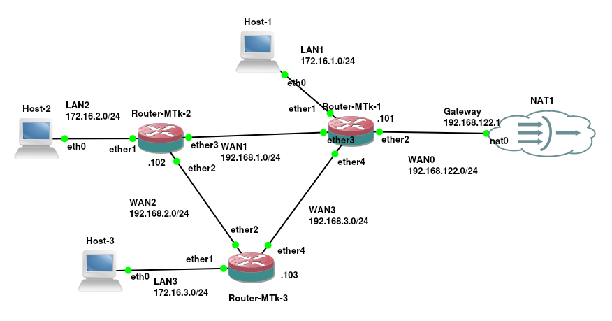
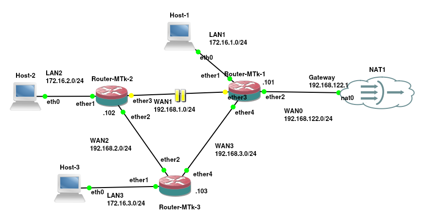

# RIP em roteadores Mikrotik

O **RIP (_Routing Information Protocol_)** é um dos protocolos de roteamento dinâmico mais antigos e fundamentais da história das redes de computadores. Desenvolvido originalmente nos anos 1970 para a ARPANET e popularizado pela distribuição BSD Unix nos anos 1980, ele foi formalizado no [RFC 1058](https://datatracker.ietf.org/doc/html/rfc1058?utm_source=gemini) (RIPv1) e posteriormente atualizado no [RFC 2453](https://datatracker.ietf.org/doc/html/rfc2453?utm_source=gemini) (RIPv2).

O RIP opera sob o conceito de vetor de distância (*distance vector*), cuja ideia central é bastante simples e direta. Para escolher o melhor caminho até um destino, **o protocolo utiliza exclusivamente a contagem de saltos (*hop count*) como métrica**. O funcionamento baseia-se em **anúncios periódicos**, nos quais cada roteador envia sua tabela de roteamento completa **para os seus vizinhos** diretos em intervalos regulares, geralmente a cada 30 segundos. Ao receber essas informações, o roteador avalia quais redes os seus vizinhos conseguem alcançar e adiciona um salto ao total para determinar a menor distância e definir a melhor rota.

**Apesar dessa simplicidade conceitual, a arquitetura do vetor de distância traz desvantagens significativas que tornam o RIP um protocolo inadequado para a maioria das topologias modernas**. O primeiro grande obstáculo é o **limite máximo de 15 saltos**, em que qualquer destino a 16 saltos de distância é considerado inalcançável, inviabilizando o uso do protocolo em redes de grande porte. Além disso, a **convergência do RIP é bastante lenta** por depender apenas de informações indiretas repassadas por vizinhos, o que pode gerar _loops_ de roteamento e o clássico problema da contagem até o infinito (**_count to infinity_**), mitigado apenas parcialmente por técnicas como **_split horizon_** e **_poison reverse_**. Outro ponto crítico é que a **sua métrica é completamente cega para o desempenho real do enlace, ignorando fatores como largura de banda, latência ou taxa de ocupação**. Na prática, o RIP sempre preferirá um _link_ de apenas 10 Mbps com um único salto em relação a uma conexão de 10 Gbps que passe por dois saltos. Para completar, o envio periódico e integral da tabela de roteamento gera um consumo desnecessário e constante de tráfego de _broadcast_ ou _multicast_, ocupando banda e recursos de processamento da rede.

Por todas essas razões, **o RIP é classificado como um protocolo legado**, tendo sido amplamente substituído por soluções modernas baseadas em estado de enlace (*link-state*), como o OSPF e o IS-IS, ou por vetores de caminho, como o BGP. **No entanto, dominar a sua configuração continua sendo importante para um administrador de redes por razões estratégicas e práticas**. Em ambientes corporativos **é comum encontrar cenários de migração ou equipamentos antigos** que ainda utilizam o RIP e precisam coexistir temporariamente com a nova infraestrutura. O protocolo também **mantém sua utilidade em redes extremamente pequenas ou isoladas**, onde a prioridade é uma configuração rápida e sem a complexidade de algoritmos mais pesados. Por fim, existe um **forte valor didático em compreender o RIP**, pois entender na prática como funcionam a métrica e a convergência do vetor de distância fornece a base necessária para compreender a evolução histórica e o funcionamento dos protocolos de roteamento avançados.

Quanto ao RIP na MikroTik, a empresa renovou completamente sua pilha de roteamento a partir do **RouterOS v7**, trazendo uma arquitetura de roteamento atualizada, suporte a múltiplos processos e melhorias no gerenciamento de tabelas. Mesmo sendo um protocolo antigo, **o RouterOS v7 mantêm suporte nativo ao RIP** (tanto RIPv2 quanto RIPng para IPv6).

Nos tópicos a seguir, veremos o passo a passo prático de como estruturar as instâncias, _templates_ e interfaces do RIP dentro do RouterOS v7 para colocar esse protocolo em funcionamento em seus roteadores MikroTik.

### Estrutura da rede utilizada neste exemplo

Para exemplificar e testar a configuração do protocolo **RIP** em roteadores MikroTik, utilizaremos a topologia triangular ilustrada na Figura 1, que é composta por três roteadores (Router-MTk-1, Router-MTk-2 e Router-MTk-3), suas respectivas redes locais (LANs), enlaces de ponto a ponto (WANs) e uma saída para a Internet.

|  |
|:--:|
| Figura 1 - Cenário de rede do exemplo

Cada roteador atende a uma sub-rede de rede local diferente, responsável por conectar um *host* individual:

* **Router-MTk-1:**
    * **LAN1:** Sub-rede `172.16.1.0/24` conectada à interface `ether1`.
    * **Host:** `Host-1` conectado via interface `eth0`.

* **Router-MTk-2:**
    * **LAN2:** Sub-rede `172.16.2.0/24` conectada à interface `ether1`.
    * **Host:** `Host-2` conectado via interface `eth0`.


* **Router-MTk-3:**
    * **LAN3:** Sub-rede `172.16.3.0/24` conectada à interface `ether1`.
    * **Host:** `Host-3` conectado via interface `eth0`.

Os três roteadores estão interconectados em uma topologia redundante em anel/triângulo, permitindo testar caminhos alternativos e a alternância de rotas do RIP, isso e a conexão com a Internet é feito através das seguintes WANs:

* **WAN1 (`192.168.1.0/24`):** Interconecta o **Router-MTk-1** (interface `ether3`) ao **Router-MTk-2** (interface `ether3`).
* **WAN2 (`192.168.2.0/24`):** Interconecta o **Router-MTk-2** (interface `ether2`) ao **Router-MTk-3** (interface `ether2`).
* **WAN3 (`192.168.3.0/24`):** Interconecta o **Router-MTk-1** (interface `ether4`) ao **Router-MTk-3** (interface `ether4`).
* **WAN0 (`192.168.122.0/24`):** O **Router-MTk-1** atua como roteador de borda da topologia, conectando sua interface `ether2` (endereço IP final `.101`) ao *Gateway* (`192.168.122.1`) da nuvem **NAT1**. Essa conexão proverá o acesso à internet para toda a topologia, permitindo também testar a redistribuição de rota padrão no RIP.

A tabela a seguir apresenta os IPs e máscaras utilizadas em cada roteador do cenário de exemplo:

| Equipamento | Interface | Endereço IP / Sub-rede | Descrição / Conexão |
| --- | --- | --- | --- |
| **Router-MTk-1** | `ether1` | `172.16.1.1/24` | Rede Local (LAN1) |
|  | `ether2` | `192.168.122.101/24` | Saída WAN0 / NAT1 (Gateway `.1`) |
|  | `ether3` | `192.168.1.101/24` | Link WAN1 para Router-MTk-2 |
|  | `ether4` | `192.168.3.101/24` | Link WAN3 para Router-MTk-3 |
| **Router-MTk-2** | `ether1` | `172.16.2.1/24` | Rede Local (LAN2) |
|  | `ether2` | `192.168.2.102/24` | Link WAN2 para Router-MTk-3 |
|  | `ether3` | `192.168.1.102/24` | Link WAN1 para Router-MTk-1 |
| **Router-MTk-3** | `ether1` | `172.16.3.1/24` | Rede Local (LAN3) |
|  | `ether2` | `192.168.2.103/24` | Link WAN2 para Router-MTk-2 |
|  | `ether4` | `192.168.3.103/24` | Link WAN3 para Router-MTk-1 |

Com esse cenário montado, o objetivo nos passos seguintes será:

1. Configurar o **RIPv2** nos três roteadores para que anunciem suas redes `LAN` e `WANs`.
2. Verificar a convergência das tabelas de roteamento dinâmicas e o alcance entre os hosts (`Host-1`, `Host-2` e `Host-3`).
3. Redistribuir a rota padrão no **Router-MTk-1** para que os outros dois roteadores e hosts aprendam o caminho para a Internet via RIP.
4. Testar a tolerância a falhas derrubando um dos links (por exemplo, a WAN1) para observar o RIP recalculando a rota através da WAN3 e WAN2.

Todos os passos demonstrados neste exemplo: configuração das interfaces de rede, configuração do RIP e testes - estão registrados no vídeo a seguir, bem como neste texto.

<div style="position: relative; padding-bottom: 56.25%; height: 0; overflow: hidden; max-width: 100%; margin-bottom: 1rem;">
  <iframe src="https://www.youtube.com/embed/1VYEhZJ1ElI" style="position: absolute; top: 0; left: 0; width: 100%; height: 100%; border:0;" allowfullscreen title="Demonstração Prática no YouTube"></iframe>
</div>

## Configuração dos Hosts das Redes Locais

Para executar corretamente o exemplo é necessário além de configurar os roteadores (que é o foco deste texto), configurar os _hosts_ clientes para poder validar o roteamento e a comunicação na rede proposta. Assim, cada rede local conta com um _host_ de teste (`Host-1`, `Host-2` e `Host-3`). A atribuição de rede nos _hosts_ é simples e direta, composta por dois comandos básicos do Linux:

* **`ifconfig eth0 <IP>/24`:** Define o endereço IP e a máscara de sub-rede na interface de rede principal (`eth0`) do dispositivo local.
* **`route add default gw <IP-Router>`:** Adiciona uma rota padrão de saída apontando para o endereço IP do seu respectivo roteador MikroTik (gateway da LAN).

Desta forma seguem as configurações/comandos que devem ser executados em cada um desses _hosts_ clientes:

* Host 1 (LAN1)

```bash
root@Host-1:/# ifconfig eth0 172.16.1.1/24
root@Host-1:/# route add default gw 172.16.1.101
```

* Host 2 (LAN2)

```bash
root@Host-2:/# ifconfig eth0 172.16.2.1/24
root@Host-2:/# route add default gw 172.16.2.102
```

* Host 3 (LAN3)

```bash
root@Host-3:/# ifconfig eth0 172.16.3.1/24
root@Host-3:/# route add default gw 172.16.3.103
```
Com as configurações básicas de IP e _gateway_ devidamente aplicadas em todos os _hosts_ clientes, garantimos que os dispositivos finais estejam prontos para se comunicar com as suas respectivas redes locais. A partir deste ponto, avançamos para a implementação e o ajuste do protocolo RIP nos roteadores MikroTik, onde o roteamento dinâmico e a redundância da infraestrutura serão de fato estabelecidos.

## Configuração do Roteador Mtk3

Para iniciar a preparação do terceiro nó da nossa topologia, o **Router-MTk-3** (ou simplesmente **mtk3**), o primeiro passo de boas práticas em administração de redes é definir a identificação do dispositivo para facilitar o gerenciamento via CLI e evitar comandos acidentais no equipamento errado. Em seguida, realizamos a atribuição dos endereços IP nas três interfaces ativas do roteador: a `ether1` para a rede local LAN3 (`172.16.3.0/24`), a `ether2` para o enlace WAN2 com o roteador `mtk2` (`192.168.2.0/24`) e a `ether3` para o enlace WAN3 diretamente com o roteador `mtk1` (`192.168.3.0/24`).

Todos os comandos de identificação e endereçamento IP no `mtk3` podem ser executados em um único bloco:

```routeros
/system/identity/set name=mtk3
/ip/address/add address=172.16.3.103/24 interface=ether1
/ip/address/add address=192.168.2.103/24 interface=ether2
/ip/address/add address=192.168.3.103/24 interface=ether3
```
 > **Observação Importante:** Se você prestou atenção na topologia do laboratório e nos comandos executados até aqui, deve ter percebido uma divergência proposital na configuração do **mtk3**.
> No primeiro bloco de comandos, atribuímos o endereço IP da rede WAN3 (`192.168.3.103/24`) à interface `ether3`. No entanto, ao associar as portas à instância do RIP no `interface-template`, inserimos a interface `ether4` em seu lugar. De acordo com o nosso diagrama, o link com o roteador `mtk1` está fisicamente conectado à porta **`ether4`** do `mtk3`.
> Vamos manter essa inconsistência intencionalmente por enquanto. Quando chegarmos à etapa de testes de conectividade e validação da tabela de roteamento, veremos na prática como essa falha impede o fechamento da vizinhança do RIP e o aprendizado das rotas, oportunidade em que faremos o diagnóstico e a devida correção do parâmetro via CLI.

Após a execução, você pode validar o endereçamento configurado utilizando o comando `/ip/address/print` para garantir que todas as interfaces estejam ativas e com as sub-redes corretas antes de avançar para a configuração do protocolo RIP.

### Configuração do RIP no MikroTik

No MikroTik RouterOS v7, a arquitetura dos protocolos de roteamento foi completamente reformulada. Em versões anteriores (RouterOS v6), as configurações ficavam espalhadas de forma mais simples e direta. No v7, o RIP adota uma estrutura modular baseada em **Instâncias** (*Instances*) e **Modelos de Interface** (*Interface Templates*), oferecendo um controle granular sobre o comportamento do protocolo no roteador.

Para entender a lógica por trás dos comandos, é fundamental compreender a separação entre esses dois conceitos principais:

#### 1. A Instância (`/routing/rip/instance`)

A **instância** funciona como o "cérebro" do processo do RIP dentro do roteador. É nela que definimos os parâmetros globais de funcionamento do protocolo, ou seja, as regras gerais de como este processo interage com o sistema e com a tabela de roteamento.

Na instância, controlamos aspectos cruciais como:

* **Tabela de Roteamento e VRF:** Em qual tabela de roteamento as rotas aprendidas serão inseridas e em qual contexto de VRF (*Virtual Routing and Forwarding*) o RIP irá operar.
* **Redistribuição de Rotas (`redistribute`):** Define quais tipos de rotas de outras origens (rotas conectadas, estáticas, OSPF, BGP, etc.) serão convertidas e anunciadas pelo RIP para os roteadores vizinhos.
* **Origem de Rota Padrão (`originate-default`):** Se a instância deve injetar uma rota *default* (`0.0.0.0/0`) na rede RIP.
* **Filtros (`in-filter-chain` / `out-filter-chain`):** Aplicação de regras de filtragem para aceitar, modificar ou bloquear rotas que entram ou saem do processo.
* **Temporizadores Globais:** Ajustes dos tempos de atualização (*update-interval*), tempo de expiração de rotas (*route-timeout*) e coleta de lixo (*route-gc-timeout*).

#### 2. O Modelo de Interface (`/routing/rip/interface-template`)

Enquanto a instância cuida das regras globais, o **modelo de interface** (*interface-template*) define em quais portas físicas ou lógicas o RIP vai efetivamente "falar". Assim, é no modelo de interface que vinculamos a instância às interfaces de rede e ajustamos comportamentos do tráfego local, tais como:

* **Modo de Operação:** Se a interface vai apenas escutar anúncios (passiva) ou enviar e receber pacotes RIP.
* **Versão do Protocolo e Autenticação:** Definição da versão utilizada (RIPv2 para IPv4, RIPng para IPv6) e chaves de segurança/criptografia para os vizinhos.
* **Ajustes de Métrica:** Adição de custos (*metrics*) específicos para rotas aprendidas através de uma determinada porta.

Ao interagir com o terminal do RouterOS v7 e utilizar o recurso de auto-completar (tecla **Tab**), o sistema exibe os atributos configuráveis da instância. Então, ao pressionar **Tab** após o comando de adição de instância, surgem os seguintes parâmetros:

* **`afi`** (*Address Family Indicator*): Define a família de endereços utilizada, como `ip` (IPv4 / RIPv2) ou `ipv6` (RIPng).
* **`disabled`**: Chave binária (`yes`/`no`) para ativar ou desativar a instância sem apagar a configuração.
* **`originate-default`**: Configura o envio automático de uma rota padrão para os vizinhos RIP (`never`, `always`, `if-installed`).
* **`in-filter-select` / `out-filter-select` / `in-filter-chain` / `out-filter-chain**`: Parâmetros de vinculação com o motor de filtros do RouterOS (*Routing Filters*), permitindo selecionar regras para filtrar prefixos recebidos ou anunciados.
* **`route-timeout`**: O tempo que uma rota aprendida permanece válida na tabela sem receber uma atualização (padrão de 180s).
* **`route-gc-timeout`** (*Garbage Collection Timeout*): O tempo adicional que uma rota expirada (métrica 16) aguarda antes de ser totalmente removida da tabela.
* **`routing-table`**: Nome da tabela de roteamento onde as rotas aprendidas pelo RIP serão gravadas (por padrão, a tabela `main`).
* **`vrf`**: Permite associar a instância do RIP a um domínio VRF específico para segregação de redes.
* **`copy-from`**: Auxiliar da CLI para copiar configurações de uma instância pré-existente.
* **`update-interval`**: O tempo decorrido entre os anúncios periódicos enviados para os vizinhos (padrão de 30s).
* **`redistribute`**: Define a importação de rotas de outras origens para dentro do RIP. Ao dar um **Tab** neste atributo, o RouterOS v7 exibe os tipos de protocolos e fontes suportadas:
* **`connected`**: Sub-redes das interfaces diretamente conectadas e ativas no roteador.
* **`static`**: Rotas estáticas criadas manualmente em `/ip/route`.
* **`rip`**: Rotas aprendidas por outras instâncias RIP locais.
* **`ospf` / `bgp` / `isis**`: Rotas aprendidas por outros protocolos de roteamento dinâmico.
* **`dhcp` / `modem` / `slaac` / `vpn` / `bgp-mpls-vpn` / `fantasy**`: Rotas originadas por serviços de atribuição dinâmica de endereços e conexões de acesso.

Dado que o texto anterior apresentou a ideia básica de opções de configuração do RIP no RouterOS v7, vamos a configuração do Mtk3 utilizando RIP.

O **primeiro passo é criar a instância** com redistribuição de rotas, isso é feito da seguinte forma:

```routeros
[admin@mtk3] > /routing/rip/instance/add name=rip1 redistribute=connected,static,rip

```
No comando anterior temos:

* **`/routing/rip/instance/add`**: Entra no menu de instâncias RIP e cria um novo processo do protocolo.
* **`name=rip1`**: Nomeia a instância como `rip1` para identificação interna - aqui poderia ser qualquer nome (um nome a sua escolha).
* **`redistribute=connected,static,rip`**: Define que esta instância irá anunciar automaticamente aos vizinhos as suas **redes diretamente conectadas** (`connected`), quaisquer **rotas estáticas** configuradas (`static`) e **rotas aprendidas por outras instâncias RIP** (`rip`).

O **segundo passo é associando a instância às interfaces de rede**, fazemos isso utilizando o comando:

```routeros
[admin@mtk3] > /routing/rip/interface-template/add instance=rip1 interfaces=ether2,ether4
```

O comando anterior apresenta as seguintes opções:

* **`/routing/rip/interface-template/add`**: Entra no menu de modelos de interface para definir em quais portas o RIP funcionará.
* **`instance=rip1`**: Associa este modelo à instância `rip1` que acabamos de criar (tem que ter o nome que criamos na instancia).
* **`interfaces=ether2,ether4`**: Especifica as interfaces físicas onde os pacotes de anúncio do RIP serão transmitidos e escutados. No cenário do `mtk3`, essas portas correspondem aos enlaces ponto a ponto da **WAN2** (com o `mtk2`) e da **WAN3** (com o `mtk1`). 

> Atenção: É importante observar que essas portas/interfaces de rede incluídas em `interfaces=`, são as que estão conectadas a roteadores RIP. Ou seja, não precisa transmitir RIP para uma rede que não tem um roteador que conversa RIP. Neste exemplo, na interface `ether1` não tem nenhum roteador, então essa interface não precisa estar em `interfaces=`.

Com essa estrutura finalizada, a instância `rip1` passa a enviar anúncios periódicos através das interfaces `ether2` e `ether4`, divulgando para o restante da topologia as redes locais e os enlaces que ele conhece.

Após aplicar as configurações de IP e de RIP no roteador **mtk3**, podemos consultar a tabela de roteamento do dispositivo para verificar quais caminhos estão disponíveis no momento. Executando o comando `/ip/route/print`, obtemos o seguinte resultado:

```routeros
[admin@mtk3] > /ip/route/print 
Flags: D - DYNAMIC; I - INACTIVE, A - ACTIVE; c - CONNECT
Columns: DST-ADDRESS, GATEWAY, ROUTING-TABLE, DISTANCE
    DST-ADDRESS     GATEWAY  ROUTING-TABLE  DISTANCE
DAc 172.16.3.0/24   ether1   main                   0
DAc 192.168.2.0/24  ether2   main                   0
DIc 192.168.3.0/24  ether3   main
```

Ao analisar a saída, observamos que **existem apenas rotas para as redes diretamente conectadas** ao próprio dispositivo (`172.16.3.0/24`, `192.168.2.0/24` e `192.168.3.0/24`), identificadas pelas _flags_ de rotas dinâmicas conectadas (`DAc` / `DIc`). Como os demais roteadores do cenário ainda não possuem o protocolo RIP configurado e ativo, não há vizinhos estabelecidos trocando anúncios na rede. Consequentemente, o `mtk3` não possui qualquer informação sobre as redes dos outros dispositivos (como as LANs `172.16.1.0/24` e `172.16.2.0/24` ou o link `192.168.1.0/24`).

> É importante notar que a rota da rede `192.168.3.0/24` aparece marcada com a _flag_ **`I` (Inactive)**. Isso acontece exatamente por conta do erro de configuração que cometemos anteriormente, onde atribuímos o IP dessa rede na interface `ether3`, mas não há enlace físico ativo ou configurado corretamente nessa porta para levantar o link.

Para começar a formar a vizinhança do protocolo RIP, propagar as rotas e resolver o isolamento da rede, o próximo passo é realizar a configuração no roteador **mtk2**.

## Configuração do Roteador Mtk3

Com o roteador `mtk3` devidamente configurado, passamos para a configuração do segundo nó da topologia, o **mtk2**. A lógica de aplicação dos comandos é idêntica à que vimos anteriormente, dividindo-se entre a identificação do equipamento, o endereçamento das interfaces e a ativação do serviço RIP, que seguem então os seguintes passos:

Primeiro, definimos o nome do dispositivo como `mtk2` e configuramos os endereços IP em suas três interfaces físicas: a `ether1` (conectada à LAN2), a `ether2` (enlace WAN2 com o `mtk3`) e a `ether3` (enlace WAN1 com o `mtk1`), para isso usamos os seguintes comandos:

```routeros
/system/identity/set name=mtk2
/ip/address/add address=172.16.2.102/24 interface=ether1
/ip/address/add address=192.168.2.102/24 interface=ether2
/ip/address/add address=192.168.1.102/24 interface=ether3
```
Em seguida, criamos a instância `rip1` com a redistribuição de rotas ativada e associamos as interfaces que farão a troca de anúncios com os seus vizinhos (`ether2` e `ether3`), tal como:

```routeros
/routing/rip/instance/add name=rip1 redistribute=static,rip,connected
/routing/rip/interface-template/add instance=rip1 interfaces=ether2,ether3
```

Logo após a ativação do RIP no `mtk2`, a comunicação através do enlace WAN2 (`192.168.2.0/24`) deve ser estabelecida com o `mtk3`. Ao consultar a tabela de roteamento no `mtk2` com o comando `/ip/route/print`, observamos o aprendizado dinâmico do primeiro prefixo remoto:

```routeros
[admin@mtk2] > /ip/route/print 
Flags: D - DYNAMIC; A - ACTIVE; c - CONNECT, r - RIP
Columns: DST-ADDRESS, GATEWAY, ROUTING-TABLE, DISTANCE
    DST-ADDRESS     GATEWAY               ROUTING-TABLE  DISTANCE
DAc 172.16.2.0/24   ether1                main                   0
DAr 172.16.3.0/24   192.168.2.103%ether2  main                 120
DAc 192.168.1.0/24  ether3                main                   0
DAc 192.168.2.0/24  ether2                main                   0
```

A saída anterior apresenta os seguintes resultados:

* **Rotas Conectadas (`DAc`):** As redes `172.16.2.0/24` (`ether1`), `192.168.1.0/24` (`ether3`) e `192.168.2.0/24` (`ether2`) aparecem como rotas diretamente conectadas ativas, com distância administrativa **`0`**.
* **Rota Aprendida via RIP (`DAr`):** O `mtk2` aprendeu com sucesso a rede **`172.16.3.0/24`** (LAN3 do `mtk3`). A flag **`r`** identifica que a rota foi inserida via RIP, o *gateway* aponta para o IP do `mtk3` (`192.168.2.103%ether2`) e a **Distância Administrativa** atribuída ao RIP é **`120`**.

Com o `mtk2` devidamente configurado e comunicando-se com o `mtk3`, o próximo passo é realizar a configuração do roteador de borda da nossa topologia, o **mtk1**.


## Configuração do Roteador Mtk1

Chegamos agora à configuração do roteador de borda da topologia, o **mkt1**. Ele desempenha um papel central no cenário, pois é o único dispositivo conectado diretamente ao _gateway_ da Internet (`NAT1`).

Por conta dessa posição estratégica, o `mkt1` apresenta duas configurações exclusivas em relação aos demais roteadores: a criação de uma **rota estática padrão** e o mascaramento de IP via **NAT (_Masquerade_)**. Além disso, é importante destacar que é o `mkt1` o responsável por originar e propagar a rota padrão (`0.0.0.0/0`) via RIP para que o `mtk2` e o `mtk3` aprendam o caminho de saída para a Internet. No RouterOS v7, essa injeção é controlada pelo parâmetro `originate-default` na instância do RIP (que assume por padrão a opção de propagar rotas padrão estáticas/conectadas quando a redistribuição está ativa). Assim vamos para os comandos que configuram tal roteador.

Inicialmente, definimos a identidade como `mkt1` e configuramos os endereços IP em suas quatro interfaces: a `ether1` (LAN1), a `ether2` (link de borda WAN0), a `ether3` (enlace WAN1 para o `mtk2`) e a `ether4` (enlace WAN3 para o `mtk3`). Na sequência, adicionamos a rota estática padrão apontando para o IP do _gateway_ (`192.168.122.1`). Essas configurações são apresentadas nos comandos a seguir:

```routeros
/system/identity/set name=mkt1
/ip/address/add address=172.16.1.101/24 interface=ether1
/ip/address/add address=192.168.1.101/24 interface=ether3
/ip/address/add address=192.168.3.101/24 interface=ether4
/ip/address/add address=192.168.122.101/24 interface=ether2
/ip/route/add gateway=192.168.122.1
```

> Neste ponto, por exemplo é possível pingar um IP da Internet deste roteador, tal como o 8.8.8.8, do Google, mas ainda não é possível pingar IPs de LANs que não estejam conectadas neste roteador.

Para que todos os equipamentos das redes internas (`LAN1`, `LAN2` e `LAN3`) consigam navegar na Internet através do roteador de borda, é necessário aplicar o mascaramento de endereços. A regra de **NAT** reescreve o endereço IP de origem dos pacotes vindos das sub-redes privadas, substituindo-o pelo endereço IP público/válido atribuído à interface `ether2` do `mkt1`.

```routeros
/ip/firewall/nat/add action=masquerade chain=srcnat out-interface=ether2
```

Após garantir o mascaramento do tráfego para a Internet, configuramos a comunicação do **RIP** no `mkt1`. Criamos a instância `rip1` ativando a redistribuição das rotas conectadas e estáticas - o que inclui a propagação automática da rota padrão (`0.0.0.0/0`) para a rede — e vinculamos o serviço às interfaces físicas `ether3` (enlace WAN1) e `ether4` (enlace WAN3).

```routeros
/routing/rip/instance/add name=rip1 redistribute=static,rip,connected
/routing/rip/interface-template/add instance=rip1 interfaces=ether3,ether4
```

Com a configuração do roteador concluída, podemos consultar a tabela de roteamento no `mkt1` através do comando `/ip/route/print`:

```routeros
[admin@mkt1] > /ip/route/print 
Flags: D - DYNAMIC; A - ACTIVE; c - CONNECT, s - STATIC, r - RIP
Columns: DST-ADDRESS, GATEWAY, ROUTING-TABLE, DISTANCE
#     DST-ADDRESS       GATEWAY               ROUTING-TABLE  DISTANCE
0  As 0.0.0.0/0         192.168.122.1         main                 1
  DAc 172.16.1.0/24     ether1                main                 0
  DAr 172.16.2.0/24     192.168.1.102%ether3  main               120
  DAr 172.16.3.0/24     192.168.1.102%ether3  main               120
  DAc 192.168.1.0/24    ether3                main                 0
  DAr 192.168.2.0/24    192.168.1.102%ether3  main               120
  DAc 192.168.3.0/24    ether4                main                 0
  DAc 192.168.122.0/24  ether2                main                 0
```

Tal saída apresenta os seguintes resultados:

* **Rota Estática de Saída (`As 0.0.0.0/0`):** É a rota padrão manual apontando para `192.168.122.1`, responsável por colocar o `mkt1` na Internet (com distância administrativa **`1`**).
* **Redes Locais e Enlaces Conectados (`DAc`):** Exibe as sub-redes ativas no próprio equipamento (`172.16.1.0/24`, `192.168.1.0/24`, `192.168.3.0/24` e `192.168.122.0/24`).
* **Redes Aprendidas via RIP (`DAr`):**
* O `mkt1` aprendeu com sucesso as redes **`172.16.2.0/24`** (LAN2) e **`172.16.3.0/24`** (LAN3), além do enlace **`192.168.2.0/24`** (WAN2).

Com todas as configurações aplicadas e a convergência do protocolo RIP concluída, a topologia de rede encontra-se totalmente funcional e conexa. A partir deste ponto, é possível realizar os testes de conectividade de ponta a ponta entre os equipamentos das sub-redes (`Host-1`, `Host-2` e `Host-3`), confirmando que os testes de `ping` e o acesso à Internet a partir de qualquer ponto da LAN serão executados com pleno sucesso.

## Teste de Disponibilidade e Redundância da Rede

Com o protocolo RIP em execução e a conectividade estabelecida em toda a topologia, é o momento de validar a resiliência da rede. **O objetivo deste teste é simular uma falha física em um dos enlaces principais** - especificamente no link **WAN1** (`192.168.1.0/24`), que conecta o **mkt1** ao **mtk2** -, forçando o RIP a recalcular os caminhos e direcionar o tráfego pela rota alternativa através do **mtk3**.

No entanto, é justamente durante essa simulação de _failover_ que o erro de configuração cometido anteriormente no roteador **mtk3** virá à tona. Ao interrompermos o link WAN1, a comunicação dependerá do enlace WAN3 (`ether4` do `mtk3`), e observaremos que a rede não convergirá como esperado. A seguir, acompanharemos o passo a passo do diagnóstico utilizado para identificar essa falha de interface e aplicar a devida correção via CLI.

### Teste com `ping`

Para iniciar a verificação prática com todos os enlaces WAN ativos, tomamos o **Host-2** (localizado na LAN2) como ponto de origem para os testes de alcance. A partir do seu terminal, realizamos sequências de disparo do comando `ping` para os _gateways_ das demais redes locais e para um endereço externo na Internet:

```bash
root@Host-2:/# ping 172.16.1.1
PING 172.16.1.1 (172.16.1.1) 56(84) bytes of data.
64 bytes from 172.16.1.1: icmp_seq=1 ttl=62 time=0.929 ms
64 bytes from 172.16.1.1: icmp_seq=2 ttl=62 time=0.825 ms
^C
--- 172.16.1.1 ping statistics ---
2 packets transmitted, 2 received, 0% packet loss, time 1019ms
rtt min/avg/max/mdev = 0.825/0.877/0.929/0.052 ms

root@Host-2:/# ping 172.16.3.1
PING 172.16.3.1 (172.16.3.1) 56(84) bytes of data.
64 bytes from 172.16.3.1: icmp_seq=1 ttl=62 time=2.13 ms
64 bytes from 172.16.3.1: icmp_seq=2 ttl=62 time=2.01 ms
^C
--- 172.16.3.1 ping statistics ---
2 packets transmitted, 2 received, 0% packet loss, time 1000ms
rtt min/avg/max/mdev = 2.012/2.072/2.133/0.060 ms

root@Host-2:/# ping 8.8.8.8   
PING 8.8.8.8 (8.8.8.8) 56(84) bytes of data.
64 bytes from 8.8.8.8: icmp_seq=1 ttl=113 time=15.8 ms
64 bytes from 8.8.8.8: icmp_seq=2 ttl=113 time=14.5 ms
64 bytes from 8.8.8.8: icmp_seq=3 ttl=113 time=14.2 ms
^C
--- 8.8.8.8 ping statistics ---
3 packets transmitted, 3 received, 0% packet loss, time 2002ms
rtt min/avg/max/mdev = 14.189/14.811/15.763/0.683 ms
```

Assim os _pings_ realizados demostram que:

* **Teste para LAN1 (`172.16.1.1`):** O tráfego sai do `Host-2`, passa pelo `mtk2`, atravessa o link **WAN1** e chega ao `mkt1` sem qualquer perda de pacotes (0% de *packet loss*), confirmando o pleno roteamento entre os dois nós diretamente conectados.
* **Teste para LAN3 (`172.16.3.1`):** O `Host-2` alcança a rede do `mtk3` atravessando o link **WAN2**, confirmando a troca de rotas via RIP.
* **Teste para a Internet (`8.8.8.8`):** O pacote é encaminhado via rota padrão aprendida pelo RIP em direção ao `mkt1`, onde sofre a conversão de endereço via NAT e alcança a rede externa com sucesso.

Neste cenário ideal de operação, a comunicação transcorre perfeitamente porque o `mtk2` possui links diretos ativos tanto com o `mkt1` quanto com o `mtk3`. No entanto, como o caminho principal entre o `mtk2` e a Internet depende da WAN1, a desativação desse enlace testará a capacidade da rede em redirecionar esse tráfego através do `mtk3`.

### Testes com o `traceroute`

Para compreender exatamente por quais saltos (*hops*) os pacotes estão caminhando dentro do nosso ambiente de testes antes de simularmos qualquer falha, executamos o utilitário `traceroute` a partir do **Host-2**. Esse teste revela o comportamento interno do protocolo RIP no momento de escolher o melhor caminho.

Acompanhe as saídas dos comandos com foco no trajeto percorrido dentro da nossa infraestrutura:

```bash
root@Host-2:/# traceroute -n 8.8.8.8
traceroute to 8.8.8.8 (8.8.8.8), 30 hops max, 60 byte packets
 1  172.16.2.102  5.996 ms  5.980 ms  5.969 ms
 2  192.168.1.101  14.493 ms  14.506 ms  14.496 ms
 3  192.168.122.1  18.674 ms  19.795 ms  19.806 ms
 4  192.168.18.1  19.800 ms  21.151 ms  21.463 ms
 5  177.125.210.5  23.255 ms  23.627 ms  23.624 ms
 6  177.125.214.213  29.933 ms  31.977 ms  36.832 ms
 7  10.216.16.45  37.794 ms  30.163 ms  29.627 ms
 8  10.216.6.0  30.125 ms  26.740 ms  25.538 ms
 9  10.5.17.222  26.575 ms  27.835 ms  27.212 ms
10  * * *
11  10.5.20.66  22.546 ms  25.761 ms  21.795 ms
12  * * *
13  * * *
14  8.8.8.8  20.888 ms  19.591 ms  21.063 ms

root@Host-2:/# traceroute -n 172.16.1.1
traceroute to 172.16.1.1 (172.16.1.1), 30 hops max, 60 byte packets
 1  172.16.2.102  2.643 ms  2.606 ms  2.595 ms
 2  192.168.1.101  2.584 ms  2.572 ms  2.562 ms
 3  172.16.1.1  3.130 ms  4.579 ms  4.582 ms
```
Para ficar mais claro vamos rastrear o destino público, o trajeto interno dentro da nossa rede RIP segue a rota mais curta e direta, neste caso a rota é:

* **Salto 1 (`172.16.2.102`):** O tráfego do `Host-2` chega ao seu _gateway_ padrão, a interface `ether1` do **mtk2**.
* **Salto 2 (`192.168.1.101`):** O **mtk2** encaminha o pacote diretamente através da rede **WAN1** (`192.168.1.0/24`) para o **mkt1** (`192.168.1.101`), utilizando a rota padrão aprendida via RIP.
* **Salto 3 (`192.168.122.1` em diante):** A partir do **mkt1**, o pacote passa pela regra de NAT (_Masquerade_), sai pela `ether2` para o _gateway_ de borda `192.168.122.1` e avança pelos roteadores da operadora até atingir os servidores do Google.

Então o caminho é: `Host-2` -> **mtk2** -> *(via WAN1)* -> **mkt1** -> *Internet*. O trajeto utiliza apenas **1 salto RIP** entre os roteadores internos para alcançar o roteador de borda.

Analisando a comunicação privada entre o `Host-2` e a rede local atendida pelo **mkt1**:

* **Salto 1 (`172.16.2.102`):** O tráfego entra no **mtk2** pela `ether1`.
* **Salto 2 (`192.168.1.101`):** O pacote é repassado via link **WAN1** para a interface `ether3` do **mkt1**.
* **Salto 3 (`172.16.1.1`):** O **mkt1** entrega o pacote na sua interface local `ether1` onde está a LAN1.

Desta forma o caminho é: `Host-2` -> **mtk2** -> *(via WAN1)* -> **mkt1** -> `LAN1`. Assim como no acesso externo, o RIP determinou que o caminho direto via **WAN1** é a melhor escolha, ignorando completamente o caminho secundário via **mtk3** (que exigiria 2 saltos).

Com os caminhos originais devidamente mapeados, o próximo passo será desativar a interface do link **WAN1** para forçar o RIP a utilizar a rota alternativa passando pelo **mtk3**.

### Simulando o erro na rede (desabilitando o link da WAN1)

Para simular uma falha física de infraestrutura - como o rompimento de um cabo de fibra óptica ou a queda de um enlace de rádio -, desabilitamos a interface referente à **WAN1** (`192.168.1.0/24`), cortando a comunicação direta entre o **mtk2** e o **mkt1**. Tal como mostra a Figura 2.

|  |
|:--:|
| Figura 2 - Cenário de rede do exemplo com o link WAN1 desativado

Em um cenário funcional com redundância, o comportamento esperado após a queda da WAN1 seria a convergência do RIP. O protocolo deveria identificar a perda do caminho principal, expirar as rotas via WAN1 após os temporizadores padrão e recalcular a topologia, passando a encaminhar todo o tráfego do **mtk2** em direção ao **mkt1** (e à internet) de forma indireta, contornando a rede através do **mtk3**.

Contudo, mesmo aguardando o tempo necessário para a expiração e atualização dos temporizadores do RIP, ao executarmos os testes de `traceroute` e `ping` a partir do **Host-2**, obtemos as seguintes respostas de erro:

```bash
root@Host-2:/# traceroute -n 172.16.1.1
traceroute to 172.16.1.1 (172.16.1.1), 30 hops max, 60 byte packets
 1  172.16.2.102  1.084 ms !N * *

root@Host-2:/# ping 172.16.1.1
PING 172.16.1.1 (172.16.1.1) 56(84) bytes of data.
From 172.16.2.102 icmp_seq=1 Destination Net Unreachable
From 172.16.2.102 icmp_seq=2 Destination Net Unreachable
From 172.16.2.102 icmp_seq=3 Destination Net Unreachable

root@Host-2:/# ping 8.8.8.8
PING 8.8.8.8 (8.8.8.8) 56(84) bytes of data.
From 172.16.2.102 icmp_seq=1 Destination Net Unreachable
From 172.16.2.102 icmp_seq=2 Destination Net Unreachable
From 172.16.2.102 icmp_seq=3 Destination Net Unreachable
```
Ao analisar a saída anterior devemos perceber que:

* **Mensagem `Destination Net Unreachable`:** O próprio _gateway_ local do `Host-2` (`172.16.2.102` / `mtk2`) responde informando que a rede de destino é inalcançável.
* **Saída do Traceroute com `!N`:** O código `!N` (*Network Unreachable*) indica que o **mtk2** removeu a rota antiga da tabela, mas **não aprendeu um caminho alternativo** para a rede `172.16.1.0/24` ou para a rota padrão (`0.0.0.0/0`).

Como a topologia física possui o caminho redundante via **mtk3** ativo, o **mtk2** deveria ter recebido os anúncios do **mtk3** informando a rota para o **mkt1**. **Como isso não aconteceu, fica evidente que há um problema na troca de mensagens do RIP em algum ponto desse caminho alternativo**.

A seguir, iniciaremos o processo de diagnóstico nos roteadores para investigar a causa raiz do problema e aplicar a devida solução.

### Diagnosticando e corrigindo o problema

Para identificar o motivo pelo qual o RIP não convergiu após a queda do enlace WAN1, devemos iniciar a investigação verificando o estado do protocolo no **mkt1**. O primeiro passo é consultar a tabela de vizinhos ativos do RIP:

```routeros
[admin@mkt1] > /routing/rip/neighbor/print 
Flags: D - DYNAMIC 
```

A saída retornou **vazia**. O esperado para a nossa topologia seria a presença do **mtk3** registrado como vizinho ativo através da interface `ether4`. A ausência de vizinhos indica que o `mkt1` não está recebendo nem trocando pacotes de atualização do RIP através do enlace WAN3.

#### Isolando a Falha de Conectividade

Uma regra fundamental na solução de problemas (*troubleshooting*) de redes é **sempre investigar as falhas da camada mais baixa para a mais alta** (da Camada Física/Enlace para a Camada de Aplicação/Roteamento), ou seja, do mais simples ao mais complexo. Começar analisando regras complexas de roteamento sem antes validar se existe conectividade básica de IP entre os pontos gera perda de tempo e diagnóstico equivocado.

Seguindo essa boa prática, testamos a comunicação básica executando um `ping` a partir do `mkt1` para o IP de enlace do `mtk3` (`192.168.3.103`):

```routeros
[admin@mkt1] > ping 192.168.3.103
  SEQ HOST                                     SIZE TTL TIME        STATUS                                                              
    0 192.168.3.103                                                 timeout                                                             
    1 192.168.3.103                                                 timeout                                                             
    2 192.168.3.103                                                 timeout                                                             
    3 192.168.3.101                               84  64 94ms10us    host unreachable                                                    
    sent=4 received=0 packet-loss=100% 
```

O teste falhou com 100% de perda de pacotes (`host unreachable` e `timeout`), indicando que o problema pode não ser o RIP em si, mas sim de conectividade entre os roteadores.

Antes de checar o `mtk3`, validamos o endereçamento no próprio `mkt1`:

```routeros
[admin@mkt1] > /ip/address/print 
Columns: ADDRESS, NETWORK, INTERFACE, VRF
# ADDRESS            NETWORK        INTERFACE  VRF 
0 172.16.1.101/24     172.16.1.0     ether1     main
1 192.168.1.101/24    192.168.1.0     ether3     main
2 192.168.3.101/24    192.168.3.0     ether4     main
3 192.168.122.101/24  192.168.122.0  ether2     main
```

Desta forma, analisando a saída do `mkt1`, confirmamos que não há erros de configuração de atribuição de IPs/máscaras na interfaces de rede do `mtk1`.

**Então vamos para a análise do **mtk3**, para inspecionar as suas tabelas e conferir como suas interfaces foram preenchidas:

```routeros
[admin@mtk3] > /ip/address/print 
Columns: ADDRESS, NETWORK, INTERFACE, VRF
# ADDRESS           NETWORK      INTERFACE  VRF 
0 172.16.3.103/24   172.16.3.0   ether1     main
1 192.168.2.103/24  192.168.2.0  ether2     main
2 192.168.3.103/24  192.168.3.0  ether3     main
```
Analisando a lista com atenção, **identificamos o erro cometido no início do laboratório**: o endereço IP `192.168.3.103/24` foi atrelado à interface **`ether3`**, enquanto o cabo vindo do `mkt1` está fisicamente conectado à porta **`ether4`**.

**Para corrigir o erro de mapeamento da interface** sem precisar remover e recriar o endereço IP do zero, utilizamos o comando `/ip/address/set`:

```routeros
[admin@mtk3] > /ip/address/set 2 interface=ether4
```
O comando anterior faz o seguinte:

* **O parâmetro `2`:** É o número do índice (*index*) da linha correspondente na tabela exibida anteriormente pelo comando `print`.
* **`interface=ether4`:** Altera exclusivamente a propriedade da interface referente ao índice `2`.

> **Alternativas de Correção:** Caso você não queira utilizar o comando `set`, também é possível remover a entrada incorreta com `/ip/address/remove 2` e em seguida adicionar a nova configuração usando `/ip/address/add address=192.168.3.103/24 interface=ether4`.

Com a interface ajustada para a `ether4`, executamos novamente o teste de `ping` no **mtk3** em direção ao `mkt1`:

```routeros
[admin@mtk3] > ping 192.168.3.101                 
  SEQ HOST                                     SIZE TTL TIME        STATUS                                                              
    0 192.168.3.101                             56  64 1ms663us  
    1 192.168.3.101                             56  64 968us     
    2 192.168.3.101                             56  64 866us     
```

No **mkt1**, repetimos o mesmo teste para confirmar a bidirecionalidade do enlace:

```routeros
[admin@mkt1] > ping 192.168.3.103
  SEQ HOST                                     SIZE TTL TIME        STATUS                                                              
    0 192.168.3.103                             56  64 675us     
    1 192.168.3.103                             56  64 482us     
    sent=2 received=2 packet-loss=0% min-rtt=482us avg-rtt=578us max-rtt=675us 
```

Agora que a conectividade na Camada de Enlace/Rede foi reestabelecida, a troca de mensagens do RIP ocorre imediatamente. Consultando novamente os vizinhos no **mkt1**, o **mtk3** passa a constar corretamente na lista:

```routeros
[admin@mkt1] > /routing/rip/neighbor/print 
Flags: D - DYNAMIC 
 0 D instance=rip1 address=192.168.3.103%ether4 routes=0 packets-total=2 last-update=16s 
```

Com isso o cenário de rede deve estar funcional, uma das formas de verificar isso seria vendo as tabelas de roteamento dos roteadores, que agora devem ter novamente as rotas aprendidas via RIP para as outras redes.

### Testes pós correção do problema na rede

Com o erro na interface do `mtk3` devidamente corrigido e o adjacência do RIP estabelecida no enlace WAN3, a rede finalmente deve convergir para as rotas corretas. Para validar o comportamento de **_failover_** diante da indisponibilidade mantida no link WAN1, retornamos ao **Host-2** e executamos novamente os comandos de `traceroute`:

```bash
root@Host-2:/# traceroute -n 8.8.8.8
traceroute to 8.8.8.8 (8.8.8.8), 30 hops max, 60 byte packets
 1  172.16.2.102  0.800 ms  0.920 ms  0.926 ms
 2  192.168.2.103  2.979 ms  3.298 ms  3.324 ms
 3  192.168.3.101  6.616 ms  6.633 ms  6.628 ms
 4  192.168.122.1  6.714 ms  6.775 ms  6.938 ms
 5  192.168.18.1  11.784 ms  11.875 ms  11.869 ms
 6  177.125.210.5  11.860 ms  11.205 ms  11.475 ms
 7  177.125.214.213  20.193 ms  18.291 ms  21.860 ms
 8  10.216.16.45  24.400 ms  21.066 ms  21.366 ms
 9  10.216.6.0  21.088 ms  21.370 ms  21.431 ms
10  10.5.17.222  25.270 ms  20.632 ms  25.983 ms
11  * * *
12  10.5.20.66  18.509 ms  19.424 ms  20.378 ms
13  * * *
14  * * *
15  8.8.8.8  21.680 ms  19.836 ms  20.107 ms

root@Host-2:/# traceroute -n 172.16.1.1
traceroute to 172.16.1.1 (172.16.1.1), 30 hops max, 60 byte packets
 1  172.16.2.102  0.740 ms  1.180 ms  1.183 ms
 2  192.168.2.103  2.586 ms  2.581 ms  2.567 ms
 3  192.168.3.101  5.089 ms  5.093 ms  7.257 ms
 4  172.16.1.1  7.259 ms  7.365 ms  7.946 ms
```
Observando as saídas, fica evidente a alteração das rotas internas percorrida pelos pacotes:

1. **Destino Internet (`8.8.8.8`):**

* **Salto 1 (`172.16.2.102`):** O pacote sai do `Host-2` para o gateway local **mtk2**.
* **Salto 2 (`192.168.2.103`):** Sem o link direto da WAN1, o **mtk2** redireciona o tráfego via **WAN2** para o **mtk3**.
* **Salto 3 (`192.168.3.101`):** O **mtk3** retransmite o pacote via **WAN3** para a interface `ether4` do **mkt1**.
* **Salto 4 em diante (`192.168.122.1`):** O **mkt1** faz o NAT e envia o pacote para o gateway de borda rumo à internet.


2. **Destino LAN1 (`172.16.1.1`):**

* Segue exatamente a mesma trajetória contornando a falha: `Host-2` -> **mtk2** -> *(WAN2)* -> **mtk3** -> *(WAN3)* -> **mkt1** -> `LAN1`.

Com esse resultado, confirmamos que o nosso ambiente de testes está **100% configurado e funcional**, com a redundância do RIP validada na prática.

Caso o enlace **WAN1** seja reativado (simulando o reestabelecimento do cabo ou reparo da fibra), o RIP recalculará os tempos de anúncio e identificará novamente a rota direta entre **mtk2** e **mkt1** como o caminho de menor custo (apenas 1 salto em vez de 2). Automaticamente, o tráfego do `Host-2` voltará a passar direto pelo `mkt1`, sem a necessidade de sobrecarregar o `mtk3` como ponto intermediário.

## Conclusão

Apesar de o RIP ser um protocolo legado e largamente evitado em redes modernas devido à sua lenta convergência e limitação de métrica por contagem de saltos, o suporte a ele permanece presente em roteadores atuais - como os equipamentos RouterOS da MikroTik. Isso ocorre por razões de retrocompatibilidade e pela simplicidade na implementação de ambientes pequenos ou de cunho estritamente acadêmico, como o demonstrado neste laboratório.

Ao longo desta prática, foram apresentados os passos fundamentais para a configuração do protocolo RIP, a redistribuição de rotas e o teste de redundância com reconfiguração de rotas dinâmica via RIP, diante de uma falha de enlace. No entanto, mais do que o sucesso do *failover*, este exercício destacou a importância de uma configuração precisa em todos os pontos da topologia.

Encontrar e resolver falhas é uma das atribuições mais críticas na rotina de um administrador de redes. Optar por manter o erro de associação de interface no **mtk3** ao longo do roteiro - em vez de apresentar um cenário perfeitamente funcional de primeira - teve o propósito intencional de exercitar a metodologia de depuração (*troubleshooting*).

A falha abordada aqui foi de endereçamento IP, um problema com diagnóstico relativamente simples quando se segue a abordagem estruturada de testar a rede do mais simples para o mais complexo. Contudo, em ambientes reais, os problemas podem ser consideravelmente mais complexos. Por exemplo:

* **Omissão no tipo de rota a redistribuir:** Se a rota padrão para a Internet fosse obtida dinamicamente via DHCP Client no `mkt1` e o comando de redistribuição do RIP estivesse configurado apenas como `/routing/rip/instance/add name=rip1 redistribute=static,rip,connected`, a rota padrão **jamais seria anunciada** para os demais roteadores (`mtk2` e `mtk3`). Para que essa rota externa fosse repassada via RIP, seria obrigatório incluir explicitamente a opção `dhcp` na linha de redistribuição (`redistribute=static,rip,connected,dhcp`). Identificar que a falha de rota _default_ em toda a rede se deve à ausência dessa _flag_ específica na configuração do RIP pode levar muito tempo de análise e frustração.

Assim, o sucesso na administração de infraestruturas de redes depende da união equilibrada entre a **teoria** e a **prática**. Dominar a teoria - entendendo o funcionamento da pilha TCP/IP, o comportamento dos vetores de distância e os temporizadores do RIP - fornece a base lógica necessária para saber o que procurar. Por outro lado, o domínio prático do sistema operacional dos equipamentos permite traduzir essa teoria em diagnósticos precisos e correções rápidas, garantindo a disponibilidade e a resiliência do ambiente.

## Referências

MIKROTIK. **RouterOS v7 Documentation: RIP (Routing Information Protocol)**. [S. l.]: MikroTik Wiki, 2024. Disponível em: [https://help.mikrotik.com/docs/display/ROS/RIP](https://www.google.com/search?q=https://help.mikrotik.com/docs/display/ROS/RIP&utm_source=gemini). Acesso em: 23 set. 2026.

MALKOWSKI, G. **RFC 2453: RIP Version 2**. Internet Engineering Task Force (IETF), 1998. Disponível em: [https://datatracker.ietf.org/doc/html/rfc2453](https://datatracker.ietf.org/doc/html/rfc2453?utm_source=gemini). Acesso em: 23 set. 2026.

KUROSE, James F.; ROSS, Keith W. **Redes de Computadores e a Internet: uma abordagem top-down**. 8. ed. São Paulo: Pearson Education do Brasil, 2021.

TANENBAUM, Andrew S.; WETHERALL, David. **Redes de Computadores**. 5. ed. São Paulo: Pearson Clinical Brasil, 2011.

<!--
[admin@mkt1] > /routing/rip/neighbor/print 
Flags: D - DYNAMIC 
[admin@mkt1] > /routing/rip/neighbor/print 
Flags: D - DYNAMIC 
[admin@mkt1] > /routing/rip/neighbor/print 
Flags: D - DYNAMIC 
[admin@mkt1] > /routing/rip/neighbor/print 
Flags: D - DYNAMIC 
[admin@mkt1] > ping 192.168.3.103
  SEQ HOST                                     SIZE TTL TIME       STATUS                                                             
    0 192.168.3.103                                                timeout                                                            
    1 192.168.3.103                                                timeout                                                            
    2 192.168.3.103                                                timeout                                                            
    3 192.168.3.101                              84  64 94ms10us   host unreachable                                                   
    sent=4 received=0 packet-loss=100% 

[admin@mkt1] > /ip/address/print 
Columns: ADDRESS, NETWORK, INTERFACE, VRF
# ADDRESS             NETWORK        INTERFACE  VRF 
0 172.16.1.101/24     172.16.1.0     ether1     main
1 192.168.1.101/24    192.168.1.0    ether3     main
2 192.168.3.101/24    192.168.3.0    ether4     main
3 192.168.122.101/24  192.168.122.0  ether2     main
[admin@mkt1] > ping 192.168.3.103
  SEQ HOST                                     SIZE TTL TIME       STATUS                                                             
    0 192.168.3.103                              56  64 675us     
    1 192.168.3.103                              56  64 482us     
    sent=2 received=2 packet-loss=0% min-rtt=482us avg-rtt=578us max-rtt=675us 

[admin@mkt1] > /routing/rip/neighbor/print 
Flags: D - DYNAMIC 
 0 D instance=rip1 address=192.168.3.103%ether4 routes=0 packets-total=2 last-update=16s 
[admin@mkt1] > /routing/rip/neighbor/print 

### host 1

root@Host-1:/# 
root@Host-1:/# ifconfig eth0 172.16.1.1/24
root@Host-1:/# route add default gw 172.16.1.101


### host 2

root@Host-2:/# ifconfig eth0 172.16.2.1/24
root@Host-2:/# route add default gw 172.16.2.102

### host 3

root@Host-3:/# ifconfig eth0 172.16.3.1/24
root@Host-3:/# route add default gw 172.16.3.103

### Teste conectividade e falha a partir do host 2

root@Host-2:/# ping 172.16.1.1
PING 172.16.1.1 (172.16.1.1) 56(84) bytes of data.
64 bytes from 172.16.1.1: icmp_seq=1 ttl=62 time=0.929 ms
64 bytes from 172.16.1.1: icmp_seq=2 ttl=62 time=0.825 ms
^C
--- 172.16.1.1 ping statistics ---
2 packets transmitted, 2 received, 0% packet loss, time 1019ms
rtt min/avg/max/mdev = 0.825/0.877/0.929/0.052 ms
root@Host-2:/# ping 172.16.3.1
PING 172.16.3.1 (172.16.3.1) 56(84) bytes of data.
64 bytes from 172.16.3.1: icmp_seq=1 ttl=62 time=2.13 ms
64 bytes from 172.16.3.1: icmp_seq=2 ttl=62 time=2.01 ms
^C
--- 172.16.3.1 ping statistics ---
2 packets transmitted, 2 received, 0% packet loss, time 1000ms
rtt min/avg/max/mdev = 2.012/2.072/2.133/0.060 ms
root@Host-2:/# ping 8.8.8.8   
PING 8.8.8.8 (8.8.8.8) 56(84) bytes of data.
64 bytes from 8.8.8.8: icmp_seq=1 ttl=113 time=15.8 ms
64 bytes from 8.8.8.8: icmp_seq=2 ttl=113 time=14.5 ms
64 bytes from 8.8.8.8: icmp_seq=3 ttl=113 time=14.2 ms
^C
--- 8.8.8.8 ping statistics ---
3 packets transmitted, 3 received, 0% packet loss, time 2002ms
rtt min/avg/max/mdev = 14.189/14.811/15.763/0.683 ms
root@Host-2:/# traceroute -n 8.8.8.8
traceroute to 8.8.8.8 (8.8.8.8), 30 hops max, 60 byte packets
 1  172.16.2.102  5.996 ms  5.980 ms  5.969 ms
 2  192.168.1.101  14.493 ms  14.506 ms  14.496 ms
 3  192.168.122.1  18.674 ms  19.795 ms  19.806 ms
 4  192.168.18.1  19.800 ms  21.151 ms  21.463 ms
 5  177.125.210.5  23.255 ms  23.627 ms  23.624 ms
 6  177.125.214.213  29.933 ms  31.977 ms  36.832 ms
 7  10.216.16.45  37.794 ms  30.163 ms  29.627 ms
 8  10.216.6.0  30.125 ms  26.740 ms  25.538 ms
 9  10.5.17.222  26.575 ms  27.835 ms  27.212 ms
10  * * *
11  10.5.20.66  22.546 ms  25.761 ms  21.795 ms
12  * * *
13  * * *
14  8.8.8.8  20.888 ms  19.591 ms  21.063 ms
root@Host-2:/# traceroute -n 172.16.1.1
traceroute to 172.16.1.1 (172.16.1.1), 30 hops max, 60 byte packets
 1  172.16.2.102  2.643 ms  2.606 ms  2.595 ms
 2  192.168.1.101  2.584 ms  2.572 ms  2.562 ms
 3  172.16.1.1  3.130 ms  4.579 ms  4.582 ms
root@Host-2:/# traceroute -n 172.16.1.1
traceroute to 172.16.1.1 (172.16.1.1), 30 hops max, 60 byte packets
 1  172.16.2.102  0.454 ms !N * *
root@Host-2:/# traceroute -n 172.16.1.1
traceroute to 172.16.1.1 (172.16.1.1), 30 hops max, 60 byte packets
 1  172.16.2.102  1.084 ms !N * *
root@Host-2:/# ping 172.16.1.1
PING 172.16.1.1 (172.16.1.1) 56(84) bytes of data.
From 172.16.2.102 icmp_seq=1 Destination Net Unreachable
From 172.16.2.102 icmp_seq=2 Destination Net Unreachable
From 172.16.2.102 icmp_seq=3 Destination Net Unreachable
From 172.16.2.102 icmp_seq=4 Destination Net Unreachable
From 172.16.2.102 icmp_seq=5 Destination Net Unreachable
From 172.16.2.102 icmp_seq=6 Destination Net Unreachable
From 172.16.2.102 icmp_seq=7 Destination Net Unreachable
From 172.16.2.102 icmp_seq=8 Destination Net Unreachable
From 172.16.2.102 icmp_seq=9 Destination Net Unreachable
From 172.16.2.102 icmp_seq=10 Destination Net Unreachable
From 172.16.2.102 icmp_seq=11 Destination Net Unreachable
From 172.16.2.102 icmp_seq=12 Destination Net Unreachable
From 172.16.2.102 icmp_seq=13 Destination Net Unreachable
From 172.16.2.102 icmp_seq=14 Destination Net Unreachable
From 172.16.2.102 icmp_seq=15 Destination Net Unreachable
From 172.16.2.102 icmp_seq=16 Destination Net Unreachable
From 172.16.2.102 icmp_seq=17 Destination Net Unreachable
From 172.16.2.102 icmp_seq=18 Destination Net Unreachable
From 172.16.2.102 icmp_seq=19 Destination Net Unreachable
From 172.16.2.102 icmp_seq=20 Destination Net Unreachable
From 172.16.2.102 icmp_seq=21 Destination Net Unreachable
From 172.16.2.102 icmp_seq=22 Destination Net Unreachable
From 172.16.2.102 icmp_seq=23 Destination Net Unreachable
From 172.16.2.102 icmp_seq=24 Destination Net Unreachable
From 172.16.2.102 icmp_seq=25 Destination Net Unreachable
From 172.16.2.102 icmp_seq=26 Destination Net Unreachable
^C
--- 172.16.1.1 ping statistics ---
26 packets transmitted, 0 received, +26 errors, 100% packet loss, time 25607ms

root@Host-2:/# ping 8.8.8.8
PING 8.8.8.8 (8.8.8.8) 56(84) bytes of data.
From 172.16.2.102 icmp_seq=1 Destination Net Unreachable
From 172.16.2.102 icmp_seq=2 Destination Net Unreachable
From 172.16.2.102 icmp_seq=3 Destination Net Unreachable
From 172.16.2.102 icmp_seq=4 Destination Net Unreachable
From 172.16.2.102 icmp_seq=5 Destination Net Unreachable
^C
--- 8.8.8.8 ping statistics ---
5 packets transmitted, 0 received, +5 errors, 100% packet loss, time 4101ms

root@Host-2:/# ping 8.8.8.8
PING 8.8.8.8 (8.8.8.8) 56(84) bytes of data.
From 172.16.2.102 icmp_seq=1 Destination Net Unreachable
From 172.16.2.102 icmp_seq=2 Destination Net Unreachable
From 172.16.2.102 icmp_seq=3 Destination Net Unreachable
From 172.16.2.102 icmp_seq=4 Destination Net Unreachable
From 172.16.2.102 icmp_seq=5 Destination Net Unreachable
From 172.16.2.102 icmp_seq=6 Destination Net Unreachable
From 172.16.2.102 icmp_seq=7 Destination Net Unreachable
^C
--- 8.8.8.8 ping statistics ---
7 packets transmitted, 0 received, +7 errors, 100% packet loss, time 6151ms

root@Host-2:/# ping 8.8.8.8
PING 8.8.8.8 (8.8.8.8) 56(84) bytes of data.
From 172.16.2.102 icmp_seq=1 Destination Net Unreachable
From 172.16.2.102 icmp_seq=2 Destination Net Unreachable
From 172.16.2.102 icmp_seq=3 Destination Net Unreachable
^C
--- 8.8.8.8 ping statistics ---
3 packets transmitted, 0 received, +3 errors, 100% packet loss, time 2052ms

root@Host-2:/# ping 8.8.8.8
PING 8.8.8.8 (8.8.8.8) 56(84) bytes of data.
From 172.16.2.102 icmp_seq=1 Destination Net Unreachable
From 172.16.2.102 icmp_seq=2 Destination Net Unreachable
From 172.16.2.102 icmp_seq=3 Destination Net Unreachable
From 172.16.2.102 icmp_seq=4 Destination Net Unreachable
From 172.16.2.102 icmp_seq=5 Destination Net Unreachable
From 172.16.2.102 icmp_seq=6 Destination Net Unreachable
From 172.16.2.102 icmp_seq=7 Destination Net Unreachable
From 172.16.2.102 icmp_seq=8 Destination Net Unreachable
From 172.16.2.102 icmp_seq=9 Destination Net Unreachable
From 172.16.2.102 icmp_seq=10 Destination Net Unreachable
From 172.16.2.102 icmp_seq=11 Destination Net Unreachable
From 172.16.2.102 icmp_seq=12 Destination Net Unreachable
From 172.16.2.102 icmp_seq=13 Destination Net Unreachable
From 172.16.2.102 icmp_seq=14 Destination Net Unreachable
From 172.16.2.102 icmp_seq=15 Destination Net Unreachable
^C
--- 8.8.8.8 ping statistics ---
15 packets transmitted, 0 received, +15 errors, 100% packet loss, time 14364ms

root@Host-2:/# ping 8.8.8.8
PING 8.8.8.8 (8.8.8.8) 56(84) bytes of data.
64 bytes from 8.8.8.8: icmp_seq=1 ttl=112 time=18.2 ms
64 bytes from 8.8.8.8: icmp_seq=2 ttl=112 time=16.3 ms
64 bytes from 8.8.8.8: icmp_seq=3 ttl=112 time=16.9 ms
^C
--- 8.8.8.8 ping statistics ---
3 packets transmitted, 3 received, 0% packet loss, time 2002ms
rtt min/avg/max/mdev = 16.268/17.130/18.196/0.800 ms
root@Host-2:/# traceroute -n 8.8.8.8
traceroute to 8.8.8.8 (8.8.8.8), 30 hops max, 60 byte packets
 1  172.16.2.102  0.800 ms  0.920 ms  0.926 ms
 2  192.168.2.103  2.979 ms  3.298 ms  3.324 ms
 3  192.168.3.101  6.616 ms  6.633 ms  6.628 ms
 4  192.168.122.1  6.714 ms  6.775 ms  6.938 ms
 5  192.168.18.1  11.784 ms  11.875 ms  11.869 ms
 6  177.125.210.5  11.860 ms  11.205 ms  11.475 ms
 7  177.125.214.213  20.193 ms  18.291 ms  21.860 ms
 8  10.216.16.45  24.400 ms  21.066 ms  21.366 ms
 9  10.216.6.0  21.088 ms  21.370 ms  21.431 ms
10  10.5.17.222  25.270 ms  20.632 ms  25.983 ms
11  * * *
12  10.5.20.66  18.509 ms  19.424 ms  20.378 ms
13  * * *
14  * * *
15  8.8.8.8  21.680 ms  19.836 ms  20.107 ms
root@Host-2:/# traceroute -n 172.16.1.1
traceroute to 172.16.1.1 (172.16.1.1), 30 hops max, 60 byte packets
 1  172.16.2.102  0.740 ms  1.180 ms  1.183 ms
 2  192.168.2.103  2.586 ms  2.581 ms  2.567 ms
 3  192.168.3.101  5.089 ms  5.093 ms  7.257 ms
 4  172.16.1.1  7.259 ms  7.365 ms  7.946 ms
root@Host-2:/# traceroute -n 172.16.1.1
traceroute to 172.16.1.1 (172.16.1.1), 30 hops max, 60 byte packets
 1  172.16.2.102  0.944 ms  0.915 ms  0.903 ms
 2  192.168.2.103  2.570 ms  2.729 ms  2.963 ms
 3  192.168.1.101  6.427 ms  6.448 ms  6.457 ms
 4  172.16.1.1  7.608 ms  7.629 ms  8.763 ms
root@Host-2:/# traceroute -n 172.16.1.1
traceroute to 172.16.1.1 (172.16.1.1), 30 hops max, 60 byte packets
 1  172.16.2.102  1.448 ms  1.521 ms  1.836 ms
 2  192.168.2.103  5.104 ms  5.160 ms  5.173 ms
 3  192.168.1.101  9.153 ms  9.161 ms  9.151 ms
 4  172.16.1.1  13.976 ms  13.994 ms  13.981 ms
root@Host-2:/# traceroute -n 172.16.1.1
traceroute to 172.16.1.1 (172.16.1.1), 30 hops max, 60 byte packets
 1  172.16.2.102  0.765 ms  0.730 ms  0.718 ms
 2  192.168.1.101  1.803 ms  2.034 ms  2.282 ms
 3  172.16.1.1  2.965 ms  3.094 ms  3.089 ms
root@Host-2:/# traceroute -n 8.8.8.8   
traceroute to 8.8.8.8 (8.8.8.8), 30 hops max, 60 byte packets
 1  172.16.2.102  2.016 ms  2.034 ms  2.113 ms
 2  192.168.1.101  4.281 ms  4.651 ms  4.735 ms
 3  192.168.122.1  5.926 ms  6.113 ms  6.111 ms
 4  192.168.18.1  6.101 ms  6.109 ms  6.159 ms
 5  177.125.210.5  10.737 ms  10.736 ms  10.729 ms
 6  177.125.214.213  19.921 ms  16.995 ms  16.273 ms
 7  10.216.16.45  18.465 ms  18.795 ms  18.664 ms
 8  10.216.6.0  17.511 ms  18.580 ms  18.517 ms
 9  10.5.17.222  18.521 ms  18.643 ms  18.678 ms
10  * * *
11  10.5.20.66  16.630 ms  15.898 ms  15.932 ms
12  * * *
13  * * *
14  8.8.8.8  14.024 ms  14.366 ms  14.199 ms
root@Host-2:/# 
-->
