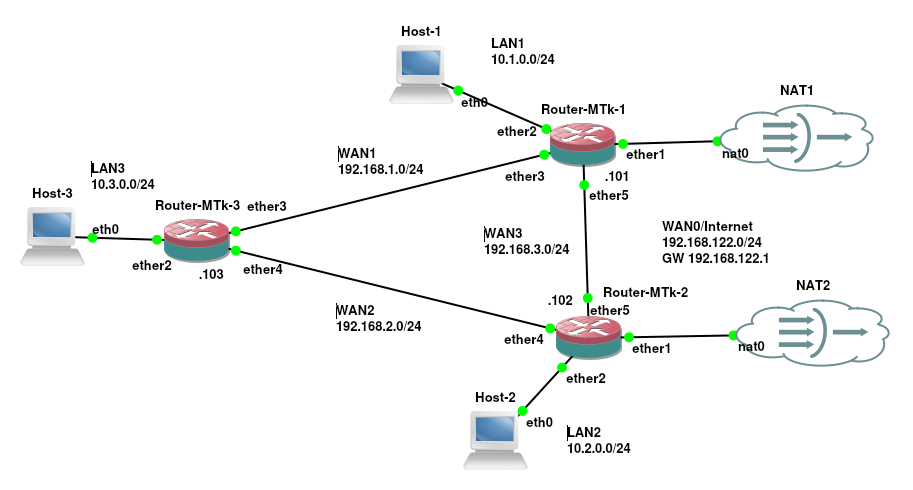

# Configuração de Rotas Estáticas Redundantes com Roteadores MikroTik

O roteamento de pacotes em redes de computadores é a base para a interconexão de sub-redes e o acesso à rede mundial de computadores. Dentre os métodos disponíveis, o **roteamento estático** destaca-se pela simplicidade de implementação e baixo consumo de recursos de processamento do roteador, pois as rotas são inseridas manualmente pelo administrador de rede.

No entanto, **rotas estáticas simples normalmente possuem uma limitação crítica: a ausência de adaptabilidade a falhas**. Caso um enlace (_link_) físico ou uma interface intermediária sofra uma queda, a rota permanece na tabela de roteamento até ser removida manualmente, gerando o descarte de pacotes e a interrupção da comunicação.

**Para contornar essa fragilidade** sem a necessidade de implantar protocolos de roteamento dinâmico complexos (como OSPF ou BGP), **utilizam-se as rotas estáticas redundantes** (mecanismo conhecido como *floating static routes* ou *failover* estático). A grande dificuldade na manutenção e configuração desse cenário reside na necessidade de garantir que o roteador não apenas conheça caminhos alternativos, mas também possua **mecanismos ativos de monitoramento (como a verificação periódica por ICMP Ping) e métricas de prioridade bem definidas (distância administrativa) para alternar o tráfego de forma transparente em caso de indisponibilidade**.

Para melhor compreender o funcionamento e a aplicação prática das rotas estáticas redundantes, utilizaremos um cenário de rede composto por três roteadores MikroTik interconectados. Esse laboratório servirá como modelo para ilustrar, passo a passo, a topologia adotada, os comandos de endereçamento e a configuração adequada das métricas e mecanismos de monitoramento necessários para garantir a redundância e a rápida convergência em caso de falhas.

## Cenário de rede do exemplo

O cenário do exemplo é composto por três roteadores MikroTik (Router-MTK-1, Router-MTK-2 e Router-MTK-3), três redes locais de computadores (LAN1, LAN2 e LAN3) com seus respectivos hosts (Host-1, Host-2 e Host-3), além de enlaces ponto a ponto (WAN1, WAN2 e WAN3) que interconectam os roteadores em uma topologia em anel/triângulo, permitindo caminhos redundantes. Também dois desses roteadores (Router-MTK-1 e Router-MTK-2) possuem conexão com a Internet, formando também conexões redundantes com a rede mundial de computadores. A Figura 1 ilustra tal cenário de rede utilizada para o exemplo deste texto.



A seguir são apresentadas todas os endereços de rede de cada elemento da rede do cenário de rede da Figura 1:

1. **Router-MTK-1 (mtk1):**
   - `ether1`: Conexão WAN0 / Internet (Rede `192.168.122.0/24`, IP via DHCP `192.168.122.190/24`).
   - `ether2`: Conexão com LAN1 (`10.1.0.0/24`, IP `10.1.0.101/24`).
   - `ether3`: Conexão WAN1 com mtk3 (`192.168.1.0/24`, IP `192.168.1.101/24`).
   - `ether5`: Conexão WAN3 com mtk2 (`192.168.3.0/24`, IP `192.168.3.101/24`).

2. **Router-MTK-2 (mtk2):**
   - `ether1`: Conexão WAN0 / Internet (Rede `192.168.122.0/24`, IP via DHCP `192.168.122.192/24`).
   - `ether2`: Conexão com LAN2 (`10.2.0.0/24`, IP `10.2.0.102/24`).
   - `ether4`: Conexão WAN2 com mtk3 (`192.168.2.0/24`, IP `192.168.2.102/24`).
   - `ether5`: Conexão WAN3 com mtk1 (`192.168.3.0/24`, IP `192.168.3.102/24`).

3. **Router-MTK-3 (mtk3):**
   - `ether2`: Conexão com LAN3 (`10.3.0.0/24`, IP `10.3.0.103/24`).
   - `ether3`: Conexão WAN1 com mtk1 (`192.168.1.0/24`, IP `192.168.1.103/24`).
   - `ether4`: Conexão WAN2 com mtk2 (`192.168.2.0/24`, IP `192.168.2.103/24`).

4. **Hosts:**
   - **Host-1:** IP `10.1.0.1/24`, Gateway `10.1.0.101`.
   - **Host-2:** IP `10.2.0.1/24`, Gateway `10.2.0.102`.
   - **Host-3:** IP `10.3.0.1/24`, Gateway `10.3.0.103`.

# Configuração dos equipamentos do cenário de rede
   
Agora que foram apresentados todas os IPs das redes e _hosts_ do cenário de exemplos vamos iniciar a configuração dos mesmos em um ambiente de rede Linux e Mikrotik, ou seja, neste exemplo os _hosts_ clientes são computadores com Linux e desta forma vamos aplicar comandos Linux. Já todos os roteadores são Mikrotik com o RouterOS versão 7.
   
A configuração do ambiente engloba a identificação dos roteadores, atribuição de endereços IP nas interfaces, _masquerading_ (NAT) para saída à Internet e, principalmente, a criação das rotas estáticas com critérios de redundância.
   
# Router-MTK-1 (mtk1)

Vamos iniciar a configuração pelo Router-MTK-1, também chamado de **`mtk1`**. Como há três roteadores MikroTik no cenário de rede, é recomendado começar pela configuração do nome do dispositivo para evitar confusões no console de gerenciamento (evitando, assim, trabalhar em um roteador acreditando ser outro). Isso é feito por meio do comando `/system/identity/set name=mtk1`, que define o nome do roteador como `mtk1`.

Na sequência, verificaremos se o roteador já recebeu algum endereço IP via DHCP (usando o comando `/ip/address/print`), visto que esse costuma ser o comportamento padrão do MikroTik: tentar obter as configurações de rede de forma automática via DHCP. A saída a seguir apresenta a execução dessas duas tarefas:

```bash
[admin@MikroTik] > /system/identity/set name=mtk1
[admin@mtk1] > /ip/address/print 
Flags: D - DYNAMIC
Columns: ADDRESS, NETWORK, INTERFACE, VRF
#   ADDRESS             NETWORK        INTERFACE  VRF 
0 D 192.168.122.190/24  192.168.122.0  ether1     main
```

Como é possível observar na saída anterior, o nome do roteador mudou de `MikroTik` para `mtk1`, o que pode ser confirmado no *prompt* de comando: `[admin@mtk1] >`. Já no retorno do comando `/ip/address/print`, identifica-se que a interface de rede `ether1` obteve o IP `192.168.122.190/24` via DHCP, indicado pela letra `D` na segunda coluna da última linha (`0 D 192.168.122.190/24 192.168.122.0 ether1 main`). Com isso, a rota padrão e os servidores DNS também devem ter sido configurados automaticamente. Assim, resta-nos configurar apenas as demais interfaces de rede (`ether2`, `ether3` e `ether5`), utilizando os seguintes comandos:

```bash
[admin@mtk1] > /ip/address/add address=10.1.0.101/24 interface=ether2
[admin@mtk1] > /ip/address/add address=192.168.1.101/24 interface=ether3       
[admin@mtk1] > /ip/address/add address=192.168.3.101/24 interface=ether5
```
Com todas as interfaces de rede devidamente configuradas, daremos prosseguimento à configuração do roteador para prover acesso a outras redes (como a Internet) para os *hosts* conectados a ele. O próximo passo é configurar o NAT (_Masquerade_), garantindo que todo o tráfego com destino à Internet utilize o IP da interface `ether1` do roteador. Essa tarefa é realizada pelo comando a seguir:

```bash
[admin@mtk1] > /ip/firewall/nat/add action=masquerade chain=srcnat out-interface=ether1
```

A última etapa no `mtk1` será criar as rotas estáticas que dão acesso às redes locais do cenário proposto. Para isso, iniciaremos pela **LAN3** (lembre-se de que é necessário configurar rotas para todas as redes que não estão diretamente conectadas ao roteador em questão).

Começaremos adicionando a rota mais curta, que vai do `mtk1` diretamente ao `mtk3`, pois, para alcançar a LAN3 por esse caminho, o tráfego precisa passar por apenas um roteador intermediário. O comando para essa rota é:

```bash
[admin@mtk1] > /ip/route/add dst-address=10.3.0.0/24 gateway=192.168.1.103 distance=1 check-gateway=ping
```
Agora, abordando a parte da redundância, observe na Figura 1 que existe outra forma de alcançar a LAN3: passando pelo roteador `mtk2`. Contudo, esse caminho exige atravessar dois roteadores (`mtk2` e `mtk3`), ou seja, realizar dois saltos na rede, o que normalmente é considerado mais custoso (nem sempre essa é uma regra absoluta, mas consideraremos dessa forma neste cenário).

A ideia é que este caminho funcione como uma **rota secundária**, a qual só deve ser utilizada se a rota principal estiver indisponível. Por esse motivo, incluiu-se no comando anterior os parâmetros `distance=1` e `check-gateway=ping`, indicando, respectivamente, que a rota primária para a LAN3 possui distância (custo) 1 e que o `mtk1` deve verificar ativamente via *ping* se o *gateway* `192.168.1.103` está acessível.

Para a segunda rota em direção à LAN3, definiremos uma distância de custo 2 (rotas de custo menor tem prioridade em relação a rotas de custo mais altos). Dessa forma, ela permanecerá inativa, sendo acionada apenas se o teste do `check-gateway` apontar que o *gateway* principal (`192.168.1.103`) parou de responder. O comando completo para a rota secundária é:

```bash
[admin@mtk1] > /ip/route/add dst-address=10.3.0.0/24 gateway=192.168.3.102 distance=2 check-gateway=ping   
```

Agora o `mtk1` possui duas rotas conhecidas para a LAN3. Em condições normais, os pacotes destinados a essa rede seguirão pelo enlace WAN1 (via *gateway* `192.168.1.103`), por possuir a menor distância (`distance=1`). Todavia, se esse enlace falhar, o `mtk1` passará a encaminhar o tráfego destinado à LAN3 pelo enlace WAN3 (via *gateway* `192.168.3.102`), garantindo a continuidade da comunicação por meio da rota de *backup*.

Com as rotas para a LAN3 devidamente estabelecidas, faremos o mesmo procedimento para a **LAN2**, adicionando uma rota primária e uma rota secundária (com menor prioridade/distância maior) para casos de falha. Os comandos para a LAN2 são:

```bash
[admin@mtk1] > /ip/route/add dst-address=10.2.0.0/24 gateway=192.168.3.102 distance=1 check-gateway=ping
[admin@mtk1] > /ip/route/add dst-address=10.2.0.0/24 gateway=192.168.1.103 distance=2 check-gateway=ping   
```

Note que os comandos para a LAN2 são muito semelhantes aos executados para a LAN3 no `mtk1`. A diferença reside na alteração dos endereços IP de destino e nos caminhos (*gateways*) correspondentes à rota principal e à rota secundária.

> **Atenção**, mais importante do que memorizar a sintaxe dos comandos é compreender a **lógica de roteamento**: como instruir o roteador a alcançar redes distantes, de que maneira atribuir prioridades às rotas (quando há custos diferentes) e como monitorar se um enlace permanece ativo. Além disso, vale destacar que cada fabricante ou sistema operacional oferece recursos e métodos distintos para realizar a checagem de *links* e a definição de métricas, cada qual com suas vantagens e desvantagens.

# Router-MTK-2 (mtk2)

Seguindo a mesma metodologia aplicada ao primeiro roteador, passamos agora para a configuração do **Router-MTK-2** (identificado como `mtk2`). De forma análoga ao `mtk1`, iniciamos alterando a identificação do sistema para evitar equívocos durante a gerência via console. Na sequência, verificamos com `/ip/address/print` o IP obtido dinamicamente via DHCP na interface `ether1` para a comunicação com a Internet.

```bash
[admin@MikroTik] > /system/identity/set name=mtk2
[admin@mtk2] > /ip/address/print 
Flags: D - DYNAMIC
Columns: ADDRESS, NETWORK, INTERFACE, VRF
#   ADDRESS             NETWORK        INTERFACE  VRF 
0 D 192.168.122.192/24  192.168.122.0  ether1     main
```

O `mtk2` é o *gateway* da **LAN2** (ligado à interface `ether2`) e conecta-se ao `mtk3` pelo enlace **WAN2** através da interface `ether4`. A comunicação com o `mtk1` ocorre pelo enlace **WAN3** na interface `ether5`. Assim, vamos configurar essas conexões com os comandos a seguir:

```bash
[admin@mtk2] > /ip/address/add address=10.2.0.102/24 interface=ether2
[admin@mtk2] > /ip/address/add address=192.168.2.102/24 interface=ether4
[admin@mtk2] > /ip/address/add address=192.168.3.102/24 interface=ether5 
```

Com os endereços IPs devidamente configurados vamos habilitar a regra de NAT (Masquerade) na interface de saída `ether1` para permitir a navegação na Internet dos equipamentos da LAN2:

```bash
[admin@mtk2] > /ip/firewall/nat/add action=masquerade chain=srcnat out-interface=ether1
```

Com o acesso a Internet já configurado vamos passar para a configuração das rotas para as redes internas.

### Configuração de Rotas Estáticas Redundantes no mtk2

Para o `mtk2`, as redes remotas que precisam ser alcançadas via roteamento estático são a **LAN3** (`10.3.0.0/24`) e a **LAN1** (`10.1.0.0/24`). A lógica de prioridade (distância administrativa) e monitoramento de link (`check-gateway=ping`) permanece idêntica à do `mtk1`, variando apenas a topologia física:

1. **Acesso à LAN3 (`10.3.0.0/24`):**

* **Rota Principal (`distance=1`):** O caminho direto é pelo enlace WAN2 via *gateway* `192.168.2.103` (`mtk3`), exigindo apenas 1 salto.
* **Rota Secundária / Backup (`distance=2`):** Caso o enlace WAN2 falhe, o tráfego contorna a rede passando pelo `mtk1` (via *gateway* `192.168.3.101` no enlace WAN3).

Assim os comandos para esse são:

```bash
[admin@mtk2] > /ip/route/add dst-address=10.3.0.0/24 gateway=192.168.2.103 distance=1 check-gateway=ping 
[admin@mtk2] > /ip/route/add dst-address=10.3.0.0/24 gateway=192.168.3.101 distance=2 check-gateway=ping    
```

2. **Acesso à LAN1 (`10.1.0.0/24`):**

* **Rota Principal (`distance=1`):** A rota mais curta até a LAN1 é direta via enlace WAN3, enviando pacotes para o *gateway* `192.168.3.101` (`mtk1`).
* **Rota Secundária / Backup (`distance=2`):** Se o enlace WAN3 ficar indisponível, os pacotes são encaminhados ao `mtk3` (via *gateway* `192.168.2.103`), que por sua vez se encarregará de entregá-los ao `mtk1`.

Sendo os comandos para essa configuração no cenário proposto:

```bash
[admin@mtk2] > /ip/route/add dst-address=10.1.0.0/24 gateway=192.168.3.101 distance=1 check-gateway=ping 
[admin@mtk2] > /ip/route/add dst-address=10.1.0.0/24 gateway=192.168.2.103 distance=2 check-gateway=ping       
```

Com esses passos, o `mtk2` fica completamente provisionado com redundância de dados: o tráfego preferencial busca sempre o caminho de menor número de saltos, mas mantém rotas de contingência ativas caso algum _link_ intermediário seja interrompido.

# Router-MTK-3 (mtk3)

Finalizando a etapa de configuração dos roteadores, passamos para a configuração do **Router-MTK-3** (`mtk3`). Assim como feito nos dispositivos anteriores, a primeira ação é definir a identidade do roteador via console por meio do comando `/system/identity/set name=mtk3`.

Na sequência, realizamos a atribuição manual dos endereços IP e suas respectivas máscaras de rede às interfaces físicas:

```bash
[admin@MikroTik] > /system/identity/set name=mtk3
[admin@mtk3] > /ip/address/add address=192.168.1.103/24 interface=ether3
[admin@mtk3] > /ip/address/add address=192.168.2.103/24 interface=ether4 
[admin@mtk3] > /ip/address/add address=10.3.0.103/24 interface=ether2           
```
Nos comandos anteriores:

* A interface `ether2` atende à rede local **LAN3** (`10.3.0.0/24`).
* A interface `ether3` conecta-se ao `mtk1` pelo enlace **WAN1** (`192.168.1.0/24`).
* A interface `ether4` conecta-se ao `mtk2` pelo enlace **WAN2** (`192.168.2.0/24`).

> **Observação Importante:** Diferente do `mtk1` e do `mtk2`, o **mtk3 não possui um _link_ direto de saída para a Internet (WAN0)** em suas interfaces, estando conectado apenas às redes internas e enlaces de interconexão. Por essa razão, **não é necessário configurar regras de NAT (_Masquerade_)** neste roteador. Todo o tráfego originado na LAN3 que se destinar à Internet será traduzido e mascarado posteriormente pelo `mtk1` ou pelo `mtk2`, dependendo de qual rota de saída for utilizada.

A lógica de roteamento para alcançar as redes locais remotas (**LAN1** e **LAN2**) segue estritamente o mesmo padrão adotado nos roteadores anteriores, alternando a rota principal (`distance=1`) e a secundária (`distance=2`) com o monitoramento por *ping*:

```bash
[admin@mtk3] > /ip/route/add dst-address=10.1.0.0/24 gateway=192.168.1.101 distance=1 check-gateway=ping
[admin@mtk3] > /ip/route/add dst-address=10.1.0.0/24 gateway=192.168.2.102 distance=2 check-gateway=ping         
[admin@mtk3] > /ip/route/add dst-address=10.2.0.0/24 gateway=192.168.2.102 distance=1 check-gateway=ping
[admin@mtk3] > /ip/route/add dst-address=10.2.0.0/24 gateway=192.168.1.101 distance=2 check-gateway=ping   
```

Assim, os comandos anteriores realizam as seguintes tarefas:

* **Para a LAN1 (`10.1.0.0/24`):** O caminho direto é pelo `mtk1` (`192.168.1.101`, via WAN1). Em caso de falha, o tráfego é desviado pelo `mtk2` (`192.168.2.102`, via WAN2).
* **Para a LAN2 (`10.2.0.0/24`):** O caminho direto é pelo `mtk2` (`192.168.2.102`, via WAN2). Em caso de falha, o tráfego contorna a rede pelo `mtk1` (`192.168.1.101`, via WAN1).

## Configuração das Rotas Padrão (*Default Routes*) Redundantes para a Internet

Como o `mtk3` não possui uma conexão física direta com a Internet, ele precisa encaminhar qualquer pacote cujo destino seja uma rede desconhecida (como endereços públicos na Web) para os roteadores vizinhos que possuem acesso externo. Para isso, criam-se as **rotas padrão** (destino `0.0.0.0/0`):

```bash
[admin@mtk3] > /ip/route/add gateway=192.168.1.101
[admin@mtk3] > /ip/route/add gateway=192.168.2.102
```
A inserção dessas duas regras garante que os usuários da LAN3 consigam navegar na Internet, utilizando tanto o `mtk1` quanto o `mtk2` como portas de saída.

Neste exemplo prático em específico, os comandos foram inseridos de forma simplificada sem os parâmetros `distance` e `check-gateway=ping`. Por padrão, quando a distância não é informada, o MikroTik atribui `distance=1` a ambas as rotas. Como ambas têm o mesmo custo e estão ativas, o sistema pode realizar um balanceamento de carga do tipo **ECMP (_Equal-Cost Multi-Path_)**.

No entanto, vale ressaltar que para um ambiente de produção **seria perfeitamente possível aplicar os mesmos critérios de redundância vistos anteriormente**: definindo `distance=1` para a saída preferencial (ex: `mtk1`), `distance=2` para a secundária (`mtk2`) e ativando o `check-gateway=ping` para garantir que, caso o enlace com um dos roteadores caia, o `mtk3` redirecione todo o tráfego de Internet automaticamente para o outro link.

## Análise da Tabela de Roteamento do mtk3 (`/ip/route/print`)

Após finalizar os comandos no roteador `mtk3`, é possível executar a verificação da tabela de roteamento ativa do `mtk3`, que deve ter as seguintes rotas:

```bash
[admin@mtk3] > /ip/route/print 
Flags: D - DYNAMIC; A - ACTIVE; c - CONNECT, s - STATIC; + - ECMP
Columns: DST-ADDRESS, GATEWAY, ROUTING-TABLE, DISTANCE
#      DST-ADDRESS     GATEWAY        ROUTING-TABLE  DISTANCE
0  As+ 0.0.0.0/0       192.168.1.101  main                  1
1  As+ 0.0.0.0/0       192.168.2.102  main                  1
2  As  10.1.0.0/24     192.168.1.101  main                  1
3   s  10.1.0.0/24     192.168.2.102  main                  2
4  As  10.2.0.0/24     192.168.2.102  main                  1
5   s  10.2.0.0/24     192.168.1.101  main                  2
  DAc  10.3.0.0/24     ether2         main                  0
  DAc  192.168.1.0/24  ether3         main                  0
  DAc  192.168.2.0/24  ether4         main                  0
```

Então a saída anterior apresenta a tabela de roteamento depois da configuração dos IPs e rotas no `mtk3`, mas especificamente cada rota tem as seguintes _flags_: 

* **`DAc` (Dynamic, Active, Connect):** Representa as redes diretamente conectadas às interfaces físicas do `mtk3` com distância 0.
* **`As` (Active, Static):** Indica rotas estáticas ativas que estão sendo efetivamente utilizadas no momento para o encaminhamento de pacotes.
* **`s` (Static inativa):** Indica rotas estáticas cadastradas, porém inativas em modo *standby* devido ao custo/distância maior (`distance=2`).
* **`+` (ECMP):** Indica que há múltiplas rotas ativas de igual custo para o mesmo destino.

Dada essa configuração de roteamento no `mtk3`, são exemplos de possíveis roteamentos de pacotes pelo mtk3:

1. **Destino: Host na LAN1 (`10.1.0.1`):**

O `mtk3` consulta sua tabela e localiza a rota `2` (`As 10.1.0.0/24` via `192.168.1.101`, `distance=1`). O pacote é enviado diretamente pela interface `ether3` ao `mtk1`. A rota `3` (`s 10.1.0.0/24` via `192.168.2.102`, `distance=2`) permanece inativa no aguardo de uma eventual falha.

2. **Destino: Servidor na Internet (`8.8.8.8`):**

Como o endereço `8.8.8.8` não pertence a nenhuma das redes locais conhecidas, o `mtk3` recorre às rotas padrão `0.0.0.0/0` (linhas `0` e `1`). Como ambas possuem a flag `As+` e distância 1, o roteador pode alternar ou balancear o envio das conexões de saída entre o `mtk1` (`192.168.1.101`) e o `mtk2` (`192.168.2.102`), garantindo conectividade externa para a LAN3 por qualquer um dos dois caminhos disponíveis.

Com a configuração dos roteadores concluída, passaremos à etapa de provisionamento dos clientes. Essa ação permitirá a realização de testes em todo o ambiente de rede integrado, englobando desde a infraestrutura de roteamento até os *hosts* finais.

# Configuração dos _hosts_ clientes

Considerando que os *hosts* clientes do cenário proposto utilizam o sistema operacional Linux, utilizaremos para a demonstração os comandos utilitários clássicos: o `ifconfig` para a atribuição de IP e máscara de sub-rede, o `route` para a definição do *gateway* padrão (*default gateway*) e a gravação do parâmetro `nameserver` no arquivo `/etc/resolv.conf` para a resolução de nomes (DNS).

A seguir, são apresentados os comandos executados para o provisionamento dos Hosts 1, 2 e 3:

* Host 1:

```bash
root@Host-1:/# ifconfig eth0 10.1.0.1/24 
root@Host-1:/# route add default gw 10.1.0.101
root@Host-1:/# echo "nameserver 1.1.1.1" > /etc/resolv.conf 
```

* Host2:

```bash
root@Host-2:/# ifconfig eth0 10.2.0.1/24
root@Host-2:/# route add default gw 10.2.0.102
root@Host-1:/# echo "nameserver 1.1.1.1" > /etc/resolv.conf 
```

* Host 3:

```bash
root@Host-3:/# ifconfig eth0 10.3.0.1/24
root@Host-3:/# route add default gw 10.3.0.103
root@Host-3:/# echo namesever 8.8.8.8 > /etc/resolv.conf
```

Com a execução desses comandos nos *hosts* clientes, atribuiu-se a cada interface de rede (`eth0`) o seu respetivo endereço IP e máscara (`10.1.0.1/24` no Host-1, `10.2.0.1/24` no Host-2 e `10.3.0.1/24` no Host-3), garantindo o correto endereçamento nas LANs. A adição da rota padrão (*default gateway*) apontando para os IPs dos roteadores localmente conectados (`10.1.0.101`, `10.2.0.102` e `10.3.0.103`) permitiu que as máquinas enviassem pacotes fora de sua sub-rede local, enquanto a definição do DNS no arquivo `/etc/resolv.conf` assegurou a resolução de nomes de domínio para a navegação externa. Com toda a infraestrutura de roteamento e os *hosts* devidamente provisionados, o cenário fica plenamente operacional para a realização de testes de conectividade end-to-end e, principalmente, para a validação prática dos mecanismos de redundância e *failover* configurados nos roteadores MikroTik.

Aqui está a seção completa de testes das rotas redundantes estruturada em Markdown, dividida em blocos lógicos conforme a sequência de comandos executados no **Host-3**.

# Testes de Conectividade e Redundância (*Failover*)

Para validar o funcionamento da arquitetura de roteamento e comprovar a eficiência das rotas redundantes com *check-gateway*, realizou-se uma bateria de testes a partir do **Host-3** (`10.3.0.1`).

A ferramenta de diagnóstico utilizada foi o `traceroute` (com o parâmetro `-n` para ocultar a resolução DNS dos saltos e agilizar o retorno). Esse utilitário permite mapear exatamente por quais roteadores intermediários (*gateways*) os pacotes trafegam até atingir o destino.

## 1. Testes com Todos os Enlaces Ativos (Cenário Normal)

Nesta primeira etapa, com todos os enlaces físicos operando normalmente, espera-se que o tráfego sempre priorize a **rota de menor custo/distância** (`distance=1`).

Ao realizar o rastreamento para a Internet (`8.8.8.8`) e para o **Host-1** (`10.1.0.1`), observa-se que os pacotes saem do `mtk3` (`10.3.0.103`) e utilizam diretamente o enlace **WAN1** via `mtk1` (`192.168.1.101`), veja a saída do comando a seguir:

```bash
root@Host-3:/# traceroute -n 8.8.8.8
traceroute to 8.8.8.8 (8.8.8.8), 30 hops max, 60 byte packets
 1  10.3.0.103  0.750 ms  1.353 ms  1.350 ms
 2  192.168.1.101  2.606 ms  2.613 ms  2.601 ms
 3  192.168.122.1  7.376 ms  7.431 ms  7.430 ms
 4  192.168.18.1  7.425 ms  7.419 ms  7.410 ms
 5  177.125.210.5  11.608 ms  11.611 ms  11.666 ms
 6  177.125.214.213  16.560 ms  16.974 ms  16.358 ms
 7  10.216.16.45  43.580 ms  42.211 ms  42.191 ms
 8  10.216.6.0  27.347 ms  23.667 ms  21.695 ms
 9  10.5.17.222  27.272 ms  27.254 ms  27.231 ms
10  * * *
11  10.5.20.66  19.579 ms  15.453 ms  16.432 ms
12  * * *
13  * * *
14  8.8.8.8  17.614 ms  17.569 ms  17.550 ms

root@Host-3:/# traceroute -n 10.1.0.1
traceroute to 10.1.0.1 (10.1.0.1), 30 hops max, 60 byte packets
 1  10.3.0.103  0.670 ms  0.655 ms  0.619 ms
 2  192.168.1.101  2.026 ms  2.171 ms  3.358 ms
 3  10.1.0.1  7.892 ms  8.013 ms  8.070 ms
```

Então a saída anterior mostra que o caminho até o **Host-1** levou 3 saltos (`mtk3` -> `mtk1` -> `Host-1`), demonstrando o uso da rota direta via `192.168.1.101`. Bem como a saída para o `8.8.8.8` foi via `mtk3` e `mtk1`. Ou seja, apenas utilizando as rotas primárias.


## 2. Teste de Falha no Enlace Principal (Ativação da Rota Redundante)

Para simular um cenário de contingência, o enlace principal entre o `mtk3` e o `mtk1` (enlace WAN1) foi desativado.

Como a rota primária falhou, o mecanismo `check-gateway=ping` no `mtk3` identificou a queda do *gateway* `192.168.1.101`, inativa a rota de menor distância e utiliza a rota backup (`distance=2`).

Agora ao repetir o teste para o **Host-1** (`10.1.0.1`) e para a Internet (`8.8.8.8`), percebe-se a alteração dinâmica do trajeto:

```bash
root@Host-3:/# traceroute -n 10.1.0.1
traceroute to 10.1.0.1 (10.1.0.1), 30 hops max, 60 byte packets
 1  10.3.0.103  1.061 ms  1.043 ms  1.032 ms
 2  192.168.2.102  3.728 ms  3.770 ms  3.773 ms
 3  192.168.3.101  3.771 ms  3.766 ms  3.764 ms
 4  10.1.0.1  5.322 ms  6.979 ms  6.978 ms

root@Host-3:/# traceroute -n 8.8.8.8
traceroute to 8.8.8.8 (8.8.8.8), 30 hops max, 60 byte packets
 1  10.3.0.103  0.947 ms  1.229 ms  1.221 ms
 2  192.168.2.102  5.618 ms  5.800 ms  5.796 ms
 3  192.168.122.1  6.110 ms  7.450 ms  8.596 ms
 4  192.168.18.1  8.736 ms  8.730 ms  8.721 ms
 5  177.125.210.5  10.471 ms  11.479 ms  11.513 ms
 6  * * *
 7  10.216.16.45  61.566 ms  19.999 ms  51.780 ms
 8  10.216.6.0  19.936 ms  19.678 ms  18.239 ms
 9  10.5.17.222  22.936 ms  23.013 ms  23.225 ms
10  * * *
11  10.5.20.66  17.338 ms  14.115 ms  14.106 ms
12  * * *
13  * * *
14  8.8.8.8  15.311 ms  15.196 ms  14.423 ms

```

Observando a saída anterior, ao rastrear o **Host-1**, o trajeto agora possui **4 saltos** (`mtk3` -> `mtk2` via `192.168.2.102` -> `mtk1` via `192.168.3.101` -> `Host-1`). O tráfego realizou o contorno com sucesso pelo enlace WAN2.

Já para o tráfego de Internet (`8.8.8.8`), o `mtk3` passou a utilizar a rota padrão secundária através do `mtk2` (`192.168.2.102`), garantindo a disponibilidade do acesso externo sem interrupção.

## 3. Teste de Restabelecimento do Enlace (*Failback*)

Após a restauração do enlace WAN1 entre o `mtk3` e o `mtk1`, o monitoramento via *ping* detecta o retorno da conectividade com o *gateway* principal `192.168.1.101`. Com isso, a rota de distância 1 é reativada como primária (*failback* automatizado).

Ao executar novamente os testes para a Internet e para a LAN1, o caminho retorna à sua convergência original:

```bash
root@Host-3:/# traceroute -n 8.8.8.8
traceroute to 8.8.8.8 (8.8.8.8), 30 hops max, 60 byte packets
 1  10.3.0.103  1.310 ms  1.326 ms  1.390 ms
 2  192.168.1.101  3.705 ms  3.712 ms  3.815 ms
 3  192.168.122.1  3.800 ms  4.323 ms  4.328 ms
 4  192.168.18.1  4.971 ms  6.302 ms  6.312 ms
 5  177.125.210.5  9.553 ms  9.576 ms  9.542 ms
 6  177.125.214.213  18.795 ms  16.896 ms  16.857 ms
 7  10.216.16.45  16.856 ms  17.292 ms  17.290 ms
 8  10.216.6.0  17.209 ms  17.193 ms  16.691 ms
 9  10.5.17.222  27.774 ms  27.853 ms  27.575 ms
10  * * *
11  10.5.20.66  19.118 ms  18.022 ms  18.206 ms
12  * * *
13  * * *
14  8.8.8.8  18.999 ms  14.579 ms  15.936 ms

root@Host-3:/# traceroute -n 10.1.0.1
traceroute to 10.1.0.1 (10.1.0.1), 30 hops max, 60 byte packets
 1  10.3.0.103  1.182 ms  1.138 ms  1.108 ms
 2  192.168.1.101  2.829 ms  2.816 ms  2.921 ms
 3  10.1.0.1  4.644 ms  4.784 ms  4.785 ms

```

Ou seja, o tráfego voltou a ser direcionado diretamente pelo salto 2 (`192.168.1.101`), reduzindo a latência e a contagem de saltos.

## 4. Testes de Redundância Cruzada para a LAN2

Por fim, realizou-se a verificação do comportamento do fluxo entre a **LAN3** e a **LAN2** (`10.2.0.1`), comparando o trajeto em situação de normalidade versus uma simulação de falha no enlace direto WAN2.

```bash
# Teste normal para a LAN2 (Rota Direta via WAN2 / mtk2)
root@Host-3:/# traceroute -n 10.2.0.1
traceroute to 10.2.0.1 (10.2.0.1), 30 hops max, 60 byte packets
 1  10.3.0.103  2.534 ms  2.525 ms  2.309 ms
 2  192.168.2.102  11.712 ms  11.703 ms  11.687 ms
 3  10.2.0.1  13.631 ms  14.497 ms  14.861 ms

# Teste para a LAN2 com falha no enlace WAN2 (Rota Contornada via WAN1 / mtk1)
root@Host-3:/# traceroute -n 10.2.0.1
traceroute to 10.2.0.1 (10.2.0.1), 30 hops max, 60 byte packets
 1  10.3.0.103  1.616 ms  1.603 ms  1.597 ms
 2  192.168.1.101  7.569 ms  7.574 ms  7.568 ms
 3  192.168.3.102  7.562 ms  7.553 ms  7.545 ms
 4  10.2.0.1  10.702 ms  12.541 ms  12.546 ms

```
Analisando a saída anterior verifica-se no **primeiro comando:** O fluxo segue a rota principal (`distance=1`) apontando para o *gateway* `192.168.2.102` (`mtk2`), completando o trajeto em 3 saltos. 

Já no **segundo comando (sob falha do enlace WAN2):** O `mtk3` redireciona o tráfego para a rota alternativa (`distance=2`), enviando o pacote primeiro ao `mtk1` (`192.168.1.101`), que por sua vez o repassa ao `mtk2` (`192.168.3.102`) até entregar ao **Host-2** (`10.2.0.1`), totalizando 4 saltos.

Os testes validam de que a topologia redundante somada ao uso de distâncias administrativas e monitoramento ativo (`check-gateway=ping`) entrega alta disponibilidade para a infraestrutura de rede.

Todos os passos demonstrados neste tutorial - desde o provisionamento das interfaces nos roteadores e a configuração dos *hosts* clientes até a validação prática dos cenários de *failover* - estão registrados e detalhados no vídeo a seguir.

<div style="position: relative; padding-bottom: 56.25%; height: 0; overflow: hidden; max-width: 100%; margin-bottom: 1rem;">
  <iframe src="https://www.youtube.com/embed/bC4I_bm8EgA" style="position: absolute; top: 0; left: 0; width: 100%; height: 100%; border:0;" allowfullscreen title="Demonstração Prática no YouTube"></iframe>
</div>

### Considerações Finais e Desafio

A implementação de rotas redundantes associadas a mecanismos de monitoramento como o `check-gateway` representa o divisor de águas entre uma infraestrutura frágil - que sofre paradas críticas diante de qualquer falha física de enlace - e uma rede de alta disponibilidade verdadeiramente resiliente, capaz de reencaminhar o tráfego de forma transparente e manter os serviços operacionais.

Como **desafio prático**, observe que na topologia apresentada apenas o roteador `mtk3` recebeu a configuração explicita de rotas padrão redundantes para a Internet. Fica a cargo do leitor **aplicar esse mesmo conceito de redundância aos roteadores `mtk1` e `mtk2`, garantindo que, caso o _link_ de Internet de um deles caia, o tráfego local possa utilizar o _link_ de Internet do outro roteador vizinho**.

Por fim, vale ressaltar que o uso de rotas estáticas com checagem de *gateway* é uma excelente solução técnica para ambientes de pequeno porte ou topologias simples, oferecendo previsibilidade sem gerar *overhead* de processamento. No entanto, à medida que a topologia da rede cresce e ganha complexidade, a manutenção manual de tabelas estáticas torna-se inviável. Nessas cenários, é altamente recomendável a transição para protocolos de **roteamento dinâmico** (como OSPF), que automatizam a descoberta de caminhos e o cálculo de convergência de forma muito mais eficiente e escalável.

## Bibliografia

* SANTOS, Luiz Arthur Feitosa dos. **Configuração de rotas estáticas redundantes utilizando roteadores MikroTik**. 2026. 1 vídeo (10 min). Publicado pelo canal do Prof. Dr. Luiz Arthur Feitosa dos Santos. Disponível em: [https://www.youtube.com/watch?v=bC4I_bm8EgA](https://www.youtube.com/watch?v=bC4I_bm8EgA). Acesso em: 12 set. 2026.

* MIKROTIK. **IP/Route - RouterOS Documentation**. MikroTik Wiki / Documentation. Disponível em: [https://help.mikrotik.com/docs/display/ROS/IP+Routing](https://help.mikrotik.com/docs/display/ROS/IP+Routing). Acesso em: 12 set. 2026.

* KUROSE, James F.; ROSS, Keith W. **Redes de Computadores e a Internet: uma abordagem top-down**. 8. ed. São Paulo: Pearson Education do Brasil, 2021.
