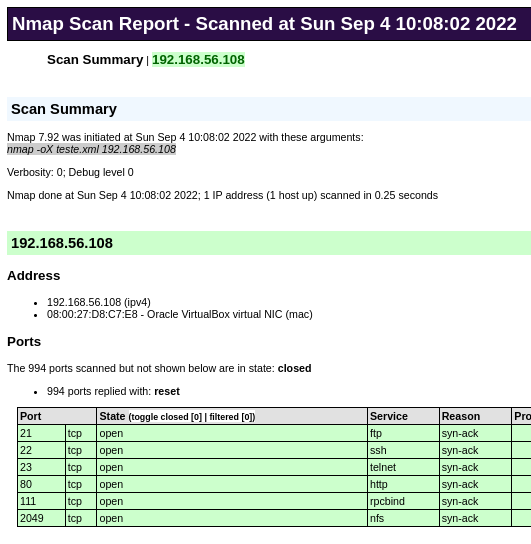

# Escaneamento

Como explicado anteriormente, este passo do PenTeste consiste em escanear em detalhes as redes, *hosts*, serviços e vulnerabilidades.

Há várias formas de fazer tal escaneamento. Da mesma forma, há várias ferramentas para facilitar e automatizar tal tarefa. A seguir será apresenta a que talvez seja a ferramentas mais utilizada por profissionais de cibersegurança para fazer *scan*, que é o Nmap.

> Neste texto utilizaremos tanto o termo *scan* em inglês, quanto  escâner em português, ambos com o mesmo significado/sentido.

## Nmap

O [Nmap](https://nmap.org/) (Network Mapper) é um escâner utilizando em cibersegurança para descobrir *hosts* e serviços de rede. O Nmap foi concebido em 1997 por Gordon Lyon. Com o decorrer do tempo, a ferramenta foi ganhando várias funcionalidades adicionais, tais como:
<!--- #como executar *scripts* para descobrir Sistemas Operacionais, versões de serviços de rede, descobrir logins padrões utilizando força bruta, dentre outros.
-->

* **Descoberta *hosts* em redes** - enviar pacotes ICMP, TCP SYN, dentre outros para identificar se há *hosts* ativos na rede;

* **Detecção de serviços/versões** - descobrir portas de rede, identifica serviços de rede e a versão do software em execução na porta de rede;

* **Detecção de Sistemas Operacional** - o Nmap pode enviar vários pacotes para *hosts*, comparar o padrão de resposta com o intuito de extrair a impressão digital do sistema (*fingerprint*) e assim determinar qual é o Sistema Operacional em execução;

* **Traceroute** - o Nmap pode ser executado tal como o [``traceroute``](https://pt.wikipedia.org/wiki/Traceroute) e descobrir, por exemplo o número de roteadores que há entre o atacante e a vítima. Isso é muito útil para mapear a rede no meio do caminho;

* **Nmap Scripting Engine** - atualmente o Nmap, possui a possibilidade de executar *scripts* que por sua vez dão ao Nmap a capacidade de realizar várias outras tarefas, tais como: descobrir vulnerabilidades de serviços em *hosts*.

A seguir vamos ver exemplos de como utilizar essas funções do Nmap.

### Scan básico com Nmap

Após descobrir alguns IPs de *hosts* no passo Obtendo Informações a Respeito do Alvo, é bem provável que o PenTester (quem realiza o PenTest), queira saber rapidamente quais portas/serviços devem estar disponíveis nestes *hosts*.

Neste contexto o *scan* mais básico com o Nmap poderia ser utilizado. Isso é feito simplesmente executando o comando ``nmap`` seguido do IP do *host* a ser analisado, por exemplo:

```console
# nmap 192.168.56.101

Starting Nmap 7.92 ( https://nmap.org ) at 2022-09-01 13:35 -03
Nmap scan report for 192.168.56.101
Host is up (0.00013s latency).
Not shown: 994 closed tcp ports (reset)
PORT     STATE SERVICE
21/tcp   open  ftp
22/tcp   open  ssh
23/tcp   open  telnet
80/tcp   open  http
111/tcp  open  rpcbind
2049/tcp open  nfs
MAC Address: 08:00:27:D9:E2:27 (Oracle VirtualBox virtual NIC)

Nmap done: 1 IP address (1 host up) scanned in 0.24 seconds
```

Utilizar o comando ``nmap`` sem nenhuma opção, este retornará como resultado as portas abertas do *host* passado como parâmetro. Nesta saída aparecerá:

* PORT - número da porta/protocolo (ex. ``21/tcp``);
* STATE - estado da porta (ex. ``open``);
* SERVICE - nome do serviço comumente associado com aquela porta (ex. ``ftp``).

> Note que neste tipo de *scan* básico, a informação a respeito do serviço em execução em uma dada porta não é extremamente confiável, pois o ``nmap`` está deduzindo qual é o serviço baseado apenas na porta padrão. Assim, para ter certeza do serviço em execução em uma dada porta é necessário uma análise mais detalhada (passando opções para o Nmap).

No Nmap os estados das portas podem ser:

* **Open** - indica que a porta está recebendo pacotes TCP, UDP ou SCTP;
* **Closed** - indica que a porta está acessível, mas não há serviço em execução;
* **Filtered** - o Nmap não pode determinar se a porta está aberta ou fechada, pois há um firewall bloqueando a análise;
* **Unfiltered** - a porta está acessível, mas o Nmap não consegue determinar se ela está aberta ou fechada;
* **Open Filtered** - o Nmap não consegue determinar se a porta está aberta ou filtrada. Isso geralmente ocorre se o alvo não responder, o que pode significar que há um firewall bloqueando totalmente os pacotes (*drop*);
* **Closed Filtered** - não é possível determinar se a porta está fechada ou filtrada.

Desta forma, analisar o estado de uma porta pode dar dicas a respeito de serviços disponíveis ou se há firewalls na rede.

> É preciso ter em mente que os resultados obtidos no Nmap não são 100% confiáveis. Por exemplo, pacotes do Nmap podem se perder, redes podem estar instáveis, o que pode gerar resultados inconsistentes.

### Scan de rede

Após descobrir alguns IPs de *hosts* no passo Obtendo Informações a Respeito do Alvo, uma boa ideia será, verificar se há mais *hosts* dentro da faixa de IPs das redes dos *hosts* já encontrados. Desta forma, o Nmap pode ser utilizado para descobrir quais *hosts* estão ativos em uma rede.

Para isso é possível utilizar o Nmap com a opção ``-sP`` seguida da faixa de IPs que deve ser analisada.

A opção ``-sP`` determina que o Nmap deve verificar apenas se o *host* está online e **não deve** analisar quais portas de cada *host* estão abertas - que é o comportamento padrão.

> Identificar os *hosts* de uma rede e seus serviços pode demorar muito tempo, assim a opção ``-sP`` dá o resultado mais rápido.

Quanto à faixa de IPs que devem ser escaneados é possível passar:

* IP da rede e máscara. Tal como: 192.168.56.0/24;
* Faixa de IPs. Exemplo: 192.168.56.1-150;
* Utilizando o * como coringa. Tal como: 192.168.56.*

>  Também é possível combinar essas expressões, como por exemplo: 192.168.1-2.*.

A seguir é apresentado um exemplo de como escanear os hosts da rede 192.168.56.0/24, mas utilizando o caractere coringa asterisco (*):

```console
$ nmap -sP 192.168.56.*
Starting Nmap 7.92 ( https://nmap.org ) at 2022-09-01 13:29 -03
Nmap scan report for 192.168.56.1
Host is up (0.00040s latency).
Nmap scan report for 192.168.56.101
Host is up (0.00018s latency).
Nmap done: 256 IP addresses (2 hosts up) scanned in 2.56 seconds
```
No exemplo anterior foram identificados na rede 192.168.56.0/24 os *hosts* 192.168.56.1 e 192.168.56.101. Perceba que o Nmap fornece a quantidade de *hosts* ativos (``2 hosts up``) e o tempo que demorou o *scan* (``2.56 seconds``).

### Especificando portas

Por padrão o *scan* do Nmap é realizado buscando-se todas as portas disponíveis no *host*, mas isso pode demorar muito tempo. Então, dependendo o caso, pode ser interessante especificar quais portas devem ser analisadas.

Para realizar o *scan* em portas específicas basta passar a opção -p seguida das portas. As portas podem ser passadas das seguintes formas:

* uma porta só (``-p 80``);
* várias portas separadas por virgulas (``-p 22,80,443``);
* faixas de portas (``-p 21-80``);
* todas as portas (``-p-`` mesmo que ``-p 0-65535``).

> Veja as opções de portas em <https://linuxhint.com/scan-all-ports-nmap/>.

Por exemplo, a saída a seguir apresenta um *scan* das portas um *host*:

```console
# nmap 192.168.56.101 -p-
Starting Nmap 7.92 ( https://nmap.org ) at 2022-09-01 21:49 -03
Nmap scan report for 192.168.56.101
Host is up (0.000079s latency).
Not shown: 65525 closed tcp ports (reset)
PORT      STATE SERVICE
21/tcp    open  ftp
22/tcp    open  ssh
23/tcp    open  telnet
80/tcp    open  http
111/tcp   open  rpcbind
2049/tcp  open  nfs
34401/tcp open  unknown
35023/tcp open  unknown
36495/tcp open  unknown
52729/tcp open  unknown
MAC Address: 08:00:27:D9:E2:27 (Oracle VirtualBox virtual NIC)

Nmap done: 1 IP address (1 host up) scanned in 0.84 seconds
```
> Note que não dá o mesmo resultado de utilizar apenas ``nmap`` seguido do IP do *host* - já que o *host* dos testes é o mesmo.

Outro exemplo, pode ser realizar um *scan* apenas das portas mais baixas de um *host*:

```console
# nmap 192.168.56.101 -p 0-1024
Starting Nmap 7.92 ( https://nmap.org ) at 2022-09-01 21:52 -03
Nmap scan report for 192.168.56.101
Host is up (0.00011s latency).
Not shown: 1020 closed tcp ports (reset)
PORT    STATE SERVICE
21/tcp  open  ftp
22/tcp  open  ssh
23/tcp  open  telnet
80/tcp  open  http
111/tcp open  rpcbind
MAC Address: 08:00:27:D9:E2:27 (Oracle VirtualBox virtual NIC)

Nmap done: 1 IP address (1 host up) scanned in 0.20 seconds
```

### Alterando a velocidade os pacotes dos *scans*

É possível alterar a velocidade que os pacotes do Nmap são enviados para o alvo. Isso pode agilizar o processo de *scan*, mas pode gerar inconsistências, pois quanto mais rápido, maior a chance de haver perda de pacotes, também pode ficar mais fácil de um IDS identificar o *scan*.

Os níveis de velocidade dos pacotes Nmap são:
* 0 - paranoico;
* 1 - sorrateiro;
* 2 - gentil;
* 3 - normal;
* 4 - agressivo;
* 5 - insano.

Segue um exemplo com um *scan* sorrateiro (1):

```console
# nmap -T1 192.168.56.101 -p 21-23
Starting Nmap 7.92 ( https://nmap.org ) at 2022-09-01 22:10 -03
Nmap scan report for 192.168.56.101
Host is up (0.00024s latency).

PORT   STATE SERVICE
21/tcp open  ftp
22/tcp open  ssh
23/tcp open  telnet
MAC Address: 08:00:27:D9:E2:27 (Oracle VirtualBox virtual NIC)

Nmap done: 1 IP address (1 host up) scanned in 60.20 seconds
```

Outro exemplo de *scan* para o mesmo *host* no nível agressivo (4):

```console
# nmap -T4 192.168.56.101 -p 21-23
Starting Nmap 7.92 ( https://nmap.org ) at 2022-09-01 22:13 -03
Nmap scan report for 192.168.56.101
Host is up (0.00025s latency).

PORT   STATE SERVICE
21/tcp open  ftp
22/tcp open  ssh
23/tcp open  telnet
MAC Address: 08:00:27:D9:E2:27 (Oracle VirtualBox virtual NIC)

Nmap done: 1 IP address (1 host up) scanned in 0.21 seconds
```
Note que a diferença foi de quase 60 segundos do nível 1 para o nível 4.

### Tipos de *scan*

Basicamente o Nmap descobre *hosts*, portas e serviços de rede enviando pacotes de rede para o alvo. Há vários tipos/métodos de envio desses pacotes e essas combinações podem trazer resultados diferentes. Assim, é importante saber todos esses tipos para escolher o melhor para cada caso.

Por padrão o Nmap realiza *scans* utilizando TCP, mas há como realizar UDP também. Assim, a seguir, são apresentados os tipos de *scan* TCP disponíveis no Nmap:

* **TCP connect** (``-sT``): neste o Nmap completa todo o *three-way handshake*. Isso é mais lento e pode ser registrado pelo alvo, se comparado com o TCP SYN.
    > Esse é a opção padrão, caso o Nmap não seja executado como administrador/root.

* **TCP SYN** (``-sS``): essa opção é chamada de *half-open* ou SYN *stealth* e consiste em enviar apenas um TCP SYN e esperar por uma resposta do alvo (não é realizado o *three-way handshake* completo). As respostas por parte do alvo podem ser:
    * SYN/ACK significa que a porta está aberta;
    * RST/ACK significa que não há servidor nesta porta - porta fechada;
    * Se não houver resposta ou se for enviado um ICMP de destino inalcançável, significa que a porta está filtrada (há um *firewall*);
    > Esse é o *scan* padrão se o Nmap for executado com privilégios de administrador/*root*.

* **TCP NULL** (``-sN``): envia pacotes sem ativar nenhum bit de controle TCP - tipos os bits de controle TCP estão em zero (0);

* **TCP FIN** (``-sF``): envia pacotes apenas com o bit FIN ativo (bit contém o valor 1);

* **TCP XMAS** (``-sX``): envia pacotes TCP com apenas com os bits FIN, PSH e URG, ativos. Neste caso, se a resposta for um pacote com o bit RST, a porta é considerada fechada. Já se não houver resposta, a porta é considerada aberta ou filtrada.

* **TCP Maimon** (``-sM``): envia pacotes TCP com os bits FIN e ACK ativos. Se isso for enviado para sistemas BSD, esses vão: (i) descartar os pacotes, caso a porta estiver aberta; ou (ii) enviar um RST, caso a porta esteja fechada. Maimon é o sobrenome de quem descobriu esse comportamento.

* **TCP ACK** (``-sA``): tal *scan* pode determinar se há um no caminho *firewalls* baseados em estados e quais portas estão bloqueadas por este. Neste *scan* são enviados pacotes TCP com apenas com o bit ACK ativo, se for retornado um RST significa que o alvo não está filtrado.

* **TCP Window** (``-sW``): este *scan* espera como resposta da vítima pacotes TCP com o bit RST ativo, caso seja retornado este tipo de pacote o Nmap analisa também o campo Window Size. A ideia é que portas TCP abertas, retornam um Window Size positivo e portas fechadas retornam um Window Size com valor zero (0).

* **TCP Idle** (``-sI``): permite fazer *scan* do alvo sem enviar pacotes diretamente para ele. Isso é possível utilizando um *host zombie*. A técnica basicamente em:
    * Enviar pacotes para o *host zombie* e verificar o número de identificação do *datagrama* IP (IPid) do *host zombie*;
    * Enviar um pacote do *host* realizando *scan*, para o alvo mas com endereço de origem como sendo do *host zombie* (*spoofing*);
    * Enviar pacotes para o *host zombie* novamente e ver o IPid. Se ele cresceu a porta está aberta, caso contrário está fechada.
    > Para uma explicação bem detalhada visite: <https://nmap.org/idlescan-pt-br.html> ou <https://nmap.org/book/idlescan.html>.
    > O comando deve ser ``nmap -Pn -p 80 -sI ipAlvo ipZombie``, é necessário utilizar o -Pn para que não seja enviado um ``ping`` do computador do PenTester para o alvo, o que entregaria o computador do PenTester. Também é necessário encontrar um computador que consiga ser *zombie* - nem todos conseguem.

O Nmap também permite que você crie o seu próprio *scan* TCP, isso é possível utilizando a opção ``--scanflags`` seguida dos bits de controle TCP que devem estar ativados. Por exemplo, o comando ``nmap 192.168.56.108 --scanflags URGACKPSH`` irá fazer um scan com os bits URG, ACK e PSH ativas, o restante vai estar em zero (0). Também é possível utilizar os coringas ALL e NONE, para ativar todos ou nenhum bit de controle, respectivamente.

Também é possível utilizar o ``--scanflags`` utilizando números, basta colocar a soma dos bits que devem estar ativos, para isso veja a ordem dos bits de controle (*flags*) do TCP, que é: CWR(128), ECE(64), URG(32), ACK(16), PSH(8), RST(4), SYN(2), FIN(1). Assim, para obter o mesmo resultado do exemplo anterior o comando seria: ``nmap 192.168.56.108 --scanflags 56``, que é 32+16+8=56.

Bem, visto os tipos/possibilidades de *scan*, um bom exercício para entende-los é analisar o tráfego de rede durante o *scan*, isso pode ser feito com ferramentas como [Tcpdump](https://www.tcpdump.org/) ou [Wireshark](https://www.wireshark.org/).

Por exemplo, um *scan* SYN irá reproduzir o seguinte resultado:

* Nmap:

```console
# nmap -sS 192.168.56.108 -p 80
Starting Nmap 7.92 ( https://nmap.org ) at 2022-09-03 10:30 -03
Nmap scan report for 192.168.56.108
Host is up (0.00025s latency).

PORT   STATE SERVICE
80/tcp open  http
MAC Address: 08:00:27:D8:C7:E8 (Oracle VirtualBox virtual NIC)

Nmap done: 1 IP address (1 host up) scanned in 0.21 seconds
```

O Nmap foi feito com opção ``-sS`` para o *host* 192.168.56.108 na porta TCP/80.
> Não seria necessário passar o ``-sS``, pois o usuário já é o *root*.

* Tcpdump:

```console
tcpdump -i vboxnet0 -n tcp and host 192.168.56.108
tcpdump: verbose output suppressed, use -v[v]... for full protocol decode
listening on vboxnet0, link-type EN10MB (Ethernet), snapshot length 262144 bytes
10:44:47.884583 IP 192.168.56.1.46425 > 192.168.56.108.80: Flags [S], seq 3550213288, win 1024, options [mss 1460], length 0
10:44:47.884777 IP 192.168.56.108.80 > 192.168.56.1.46425: Flags [S.], seq 409353283, ack 3550213289, win 64240, options [mss 1460], length 0
10:44:47.884797 IP 192.168.56.1.46425 > 192.168.56.108.80: Flags [R], seq 3550213289, win 0, length 0
```
Neste caso a captura foi na placa de rede ``vboxnet0`` e também foi filtrada para o *host* 192.168.56.108 utilizando TCP.
Note na saída do Tcpdump do exemplo que:

* O primeiro pacote vai do Nmap para o alvo, com um TCP SYN (``Flags [S]``);
* A segunda resposta é o alvo tentando estabelecer a conexão TCP, que não será terminada pelo Nmap (``Flags [S]`` com um ACK);
* O terceiro pacote é um RST (``Flags [R]``) enviado do Nmap para o alvo e isso termina o *scan* desta porta.

Agora veja outro exemplo utilizando um scan TCP connect:

* Nmap:

```console
# nmap -sT 192.168.56.108 -p 80
Starting Nmap 7.92 ( https://nmap.org ) at 2022-09-03 10:47 -03
Nmap scan report for 192.168.56.108
Host is up (0.00029s latency).

PORT   STATE SERVICE
80/tcp open  http
MAC Address: 08:00:27:D8:C7:E8 (Oracle VirtualBox virtual NIC)

Nmap done: 1 IP address (1 host up) scanned in 0.13 seconds

```
A saída basicamente é a mesma do exemplo anterior.

* Tcpdump:


```console
# tcpdump -i vboxnet0 -n tcp and host 192.168.56.108
tcpdump: verbose output suppressed, use -v[v]... for full protocol decode
listening on vboxnet0, link-type EN10MB (Ethernet), snapshot length 262144 bytes
10:47:02.489142 IP 192.168.56.1.57410 > 192.168.56.108.80: Flags [S], seq 2680615161, win 64240, options [mss 1460,sackOK,TS val 777083606 ecr 0,nop,wscale 7], length 0
10:47:02.489367 IP 192.168.56.108.80 > 192.168.56.1.57410: Flags [S.], seq 1990179193, ack 2680615162, win 65160, options [mss 1460,sackOK,TS val 3466756093 ecr 777083606,nop,wscale 7], length 0
10:47:02.489389 IP 192.168.56.1.57410 > 192.168.56.108.80: Flags [.], ack 1, win 502, options [nop,nop,TS val 777083607 ecr 3466756093], length 0
10:47:02.489430 IP 192.168.56.1.57410 > 192.168.56.108.80: Flags [R.], seq 1, ack 1, win 502, options [nop,nop,TS val 777083607 ecr 3466756093], length 0
```

Analisando a saída do Tcpdump, é possível verificar que houve o *three-way handshake* (três primeiras mensagens) e depois o Nmap terminou com um RST (quarta mensagem). Ou seja, comparando com o exemplo anterior esse *scan* gerou uma mensagem a mais (quatro mensagens).

> Faça uma analise tal como dos exemplos anteriores para os outros tipos de scan Nmap.

Desta forma, há vários tipos de *scan* TCP, o PenTester deve avaliar qual se aplica melhor e trará informações mais consistentes dependendo o ambiente a ser analisado.


#### Scan UDP


Como visto anteriormente o Nmap realiza por padrão *scan* utilizando TCP, mas tem como fazer o Nmap realizar *scan* UDP, o que inclusive pode trazer análises muito boas. O Scan UDP é dado pela opção ``-sU``.

**Atenção, existem um grande problema com o *scan* UDP**, pois o Kernel do Linux permite apenas uma mensagem ICMP de destino inalcançável por segundo. Ou seja, para escanear as 65.356 portas UDP demoraria mais ou menos 18 horas. Assim, para evitar esse problema é possível, por exemplo, realizar o *scan* das portas mais conhecidas/utilizadas. Exemplo:

```console
# nmap -sU 192.168.56.108 -p 53,67,161
Starting Nmap 7.92 ( https://nmap.org ) at 2022-09-03 18:07 -03
Nmap scan report for 192.168.56.108
Host is up (0.00024s latency).

PORT    STATE  SERVICE
53/udp  closed domain
67/udp  closed dhcps
161/udp closed snmp
MAC Address: 08:00:27:D8:C7:E8 (Oracle VirtualBox virtual NIC)

Nmap done: 1 IP address (1 host up) scanned in 0.21 seconds
```
No exemplo anterior é feito um *scan* UDP apenas das portas 53, 67 e 161, que respectivamente representam os serviços: DNS, DHCP e SNMP.

## Saídas

Existem várias opções saída que o Nmap pode fornecer, tais como:


* **Interativa**: Essa é a saída padrão.

```console
# nmap 192.168.56.108
Starting Nmap 7.92 ( https://nmap.org ) at 2022-09-04 09:56 -03
Nmap scan report for 192.168.56.108
Host is up (0.00034s latency).
Not shown: 994 closed tcp ports (reset)
PORT     STATE SERVICE
21/tcp   open  ftp
22/tcp   open  ssh
23/tcp   open  telnet
80/tcp   open  http
111/tcp  open  rpcbind
2049/tcp open  nfs
MAC Address: 08:00:27:D8:C7:E8 (Oracle VirtualBox virtual NIC)

Nmap done: 1 IP address (1 host up) scanned in 0.31 seconds
```

* **Normal** (``-oN``): Similar a interativa, mas omite alertas e informações de execução do Nmap.

> Durante testes eu só consegui utilizar essa opção para enviar a saída para um arquivo, mas a saída foi a mesma do modo interativo. Exemplo do comando: ``nmap -oN teste.log 192.168.56.108``, neste caso a saída foi para o arquivo ``teste.log``.

* **Verbose** (``-v2``): alterar a quantidade de informações da saída. Um ``-v`` habilita uma saída mais detalhada que a normal, ``-vv`` ou ``-v2`` apresenta uma saída muito mais detalhada. Depois deste nível a quantidade de informações podem atrapalhar ao invés de ajudar. O *verbose* ajuda mais para saber o progresso do *scan* e não necessariamente para ter mais informações a respeito do alvo.

```console
# nmap 192.168.56.108 -vv
Starting Nmap 7.92 ( https://nmap.org ) at 2022-09-04 10:09 -03
Initiating ARP Ping Scan at 10:09
Scanning 192.168.56.108 [1 port]
Completed ARP Ping Scan at 10:09, 0.03s elapsed (1 total hosts)
Initiating Parallel DNS resolution of 1 host. at 10:09
Completed Parallel DNS resolution of 1 host. at 10:09, 0.01s elapsed
Initiating SYN Stealth Scan at 10:09
Scanning 192.168.56.108 [1000 ports]
Discovered open port 21/tcp on 192.168.56.108
Discovered open port 111/tcp on 192.168.56.108
Discovered open port 22/tcp on 192.168.56.108
Discovered open port 80/tcp on 192.168.56.108
Discovered open port 23/tcp on 192.168.56.108
Discovered open port 2049/tcp on 192.168.56.108
Completed SYN Stealth Scan at 10:09, 0.03s elapsed (1000 total ports)
Nmap scan report for 192.168.56.108
Host is up, received arp-response (0.00014s latency).
Scanned at 2022-09-04 10:09:35 -03 for 0s
Not shown: 994 closed tcp ports (reset)
PORT     STATE SERVICE REASON
21/tcp   open  ftp     syn-ack ttl 64
22/tcp   open  ssh     syn-ack ttl 64
23/tcp   open  telnet  syn-ack ttl 64
80/tcp   open  http    syn-ack ttl 64
111/tcp  open  rpcbind syn-ack ttl 64
2049/tcp open  nfs     syn-ack ttl 64
MAC Address: 08:00:27:D8:C7:E8 (Oracle VirtualBox virtual NIC)

Read data files from: /usr/bin/../share/nmap
Nmap done: 1 IP address (1 host up) scanned in 0.21 seconds
Raw packets sent: 1001 (44.028KB) | Rcvd: 1001 (40.052KB)
```

* **XML** (``-oX``): gera uma saída XML que pode ser convertida para HTML ou enviada para um banco de dados.Exemplo: ``nmap 192.168.56.108 -oX teste.xml``, que gera como saída o arquivo ``teste.xml``. É possível utiliza ferramentas para converter o XML em HTML, que é mais amigável de visualizar as informações. Isso pode ser feito por exemplo com o comando ``xsltproc teste.xml -o teste.html``, que pode ser visto em um navegador Web, tal como na Figura 1.

|  |
|:--:|
| **Figura 1 - Saída Nmap no HTML** |

* **Grepable** (``-oG``): saída inicia e termina o teste com linhas que começam com ``#``. Depois as linhas iniciam com host e o IP deste, e algumas informações a respeito do scan que foi realizado e as informações encontradas (ver saída a seguir). Essa saída pode ser utilizada com os comandos ``grep``  e ``awk``, para realizar filtragens. Exemplo: # nmap 192.168.56.108 -oG teste.og, que irá dar uma saída na tela e gerará o arquivo ``teste.og``, veja a saída a seguir:

```console
# Nmap 7.92 scan initiated Sun Sep  4 10:11:26 2022 as: nmap -oG teste.og 192.168.56.108
Host: 192.168.56.108 () Status: Up
Host: 192.168.56.108 () Ports: 21/open/tcp//ftp///, 22/open/tcp//ssh///, 23/open/tcp//telnet///, 80/open/tcp//http///, 111/open/tcp//rpcbind///, 2049/open/tcp//nfs///  Ignored State: closed (994)
# Nmap done at Sun Sep  4 10:11:26 2022 -- 1 IP address (1 host up) scanned in 0.23 seconds
```

> Segundo documentação a saída Grepable está sendo descontinuada.

## Outras Opções de Scan

Além de realizar o *scan* básico de rede, *host* e portas (vistos anteriormente), o Nmap fornece outras opções de *scan* mais avançadas, que são apresentadas a seguir:

### Detectando serviços e versões

O Nmap é capaz de identificar o serviço/versão do software de rede, enquanto faz *scan* das portas. Com certeza em PenTestes essa opção é uma das mais úteis, pois através dessa informação (software e versão) é possível pesquisar vulnerabilidades específicas, para então tentar a invasão em um segundo momento.

Lembrando que apenas escanear as portas utilizando os métodos apresentados anteriormente, não garante que realmente é o serviço padrão que está em execução na porta conhecida. Assim, é necessário uma análise mais profunda para se ter mais certeza a respeito do software de rede que está em execução em uma dada porta.

Assim, para identificar o software sua versão, que está em execução na porta de rede, é preciso passar a opção ``-sV`` para o Nmap. Exemplo:

```console
# nmap -sV 192.168.56.108 -p 80
Starting Nmap 7.92 ( https://nmap.org ) at 2022-09-04 22:44 -03
Nmap scan report for 192.168.56.108
Host is up (0.00021s latency).

PORT   STATE SERVICE VERSION
80/tcp open  http    Apache httpd 2.4.41 ((Ubuntu))
MAC Address: 08:00:27:D8:C7:E8 (Oracle VirtualBox virtual NIC)

Service detection performed. Please report any incorrect results at https://nmap.org/submit/ .
Nmap done: 1 IP address (1 host up) scanned in 7.22 seconds
```

No exemplo anterior, utilizando a opção ``-sV``, é possível identificar que na porta TCP/80 está em execução o software/servidor Apache httpd na versão 2.4.41 e ainda há uma identificação que o Sistema Operacional é um Ubuntu Linux.

Para identificar serviços e versões, o Nmap envia mais pacotes para a porta a ser analisada e depois compara com as assinaturas de um banco de dados chamado ``nmap-service-probes``. O Nmap tenta identificar nesta análise: protocolos, nome do software, versão, nome do *host*, tipo do dispositivo, SO, dentre outras. Para mais informações a respeito de como funciona essa identificação do Nmap acesse: <https://nmap.org/man/pt_BR/man-version-detection.html>.

### Identificando o Sitemas Operacional

Outra informação muito útil, durante o processo de escaneamento, é identificar o Sistema Operacional, já que assim é possível analisar se o sistema do alvo possui vulnerabilidades conhecidas para utilizá-las no passo que vai tentar ganhar acesso ao sistema.

Para o Nmap apontar o possível Sistema Operacional do alvo, basta utilizar a opção ``-O``. Um exemplo de uso do comando e saída são apresentados a seguir:

```console
# nmap -O 192.168.56.108
Starting Nmap 7.92 ( https://nmap.org ) at 2022-09-04 23:09 -03
Nmap scan report for 192.168.56.108
Host is up (0.00021s latency).
Not shown: 994 closed tcp ports (reset)
PORT     STATE SERVICE
21/tcp   open  ftp
22/tcp   open  ssh
23/tcp   open  telnet
80/tcp   open  http
111/tcp  open  rpcbind
2049/tcp open  nfs
MAC Address: 08:00:27:D8:C7:E8 (Oracle VirtualBox virtual NIC)
Device type: general purpose
Running: Linux 4.X|5.X
OS CPE: cpe:/o:linux:linux_kernel:4 cpe:/o:linux:linux_kernel:5
OS details: Linux 4.15 - 5.6
Network Distance: 1 hop

OS detection performed. Please report any incorrect results at https://nmap.org/submit/ .
Nmap done: 1 IP address (1 host up) scanned in 1.69 seconds
```

A saída do exemplo anterior informa que o host alvo é um Linux com *kernel* versão 4.X ou 5.X, talvez o 4.15 ou 5.6. Bem, executando o comando ``uname -a`` diretamente no *host* alvo, a saída mostra que este é um Linux com *kernel* 5.4.0. Ou seja, o Nmap não acertou com exatidão a versão do *kernel*, mas mesmo assim deu ideia muito boa de qual é o Sistema Operacional do alvo.

> Lembre-se que o Nmap não é 100% preciso/confiável. Para ter informações exatas é melhor acessar diretamente a máquina alvo, é claro que nem sempre isso é possível e por isso que existe o Nmap. ;-)

Para realizar a detecção de Sistema Operacional, o Nmap envia vários pacotes TCP/UDP e analisa as respostas. Assim, há uma base de dados chamada ``nmap-os-fingerprints``, que o Nmap utiliza para comparar os resultados e tentar encontrar o Sistema Operacional do alvo. Para mais informações a respeito do processo de descoberta do Sistema Operacional leia <https://nmap.org/man/pt_BR/man-os-detection.html>.

### *Scan* agressivo

O Nmap tem a opção ``-A``, que traz muitas informações, desde: versão de softwares, usuários conhecido, chaves, dentre outras informações muito interessantes. Mais especificamente, a opção ``-A`` utiliza as seguintes opções:

* ``-sV`` - detecção de serviço;
* ``-O`` - detecção de Sistema Operacional;
* ``-sC`` - escâner utilizando *scripts* (veremos a seguir);
* ``--traceroute`` - traceroute.

No exemplo a seguir o *scan* é feito apenas na porta TCP/21:

```console
nmap -A 192.168.56.108 -p 21
Starting Nmap 7.92 ( https://nmap.org ) at 2022-09-04 23:41 -03
Nmap scan report for 192.168.56.108
Host is up (0.00024s latency).

PORT   STATE SERVICE VERSION
21/tcp open  ftp     vsftpd 3.0.3
| ftp-syst:
|   STAT:
| FTP server status:
|      Connected to ::ffff:192.168.56.1
|      Logged in as ftp
|      TYPE: ASCII
|      No session bandwidth limit
|      Session timeout in seconds is 300
|      Control connection is plain text
|      Data connections will be plain text
|      At session startup, client count was 2
|      vsFTPd 3.0.3 - secure, fast, stable
|_End of status
|_ftp-anon: Anonymous FTP login allowed (FTP code 230)
MAC Address: 08:00:27:D8:C7:E8 (Oracle VirtualBox virtual NIC)
Warning: OSScan results may be unreliable because we could not find at least 1 open and 1 closed port
Device type: general purpose
Running: Linux 4.X|5.X
OS CPE: cpe:/o:linux:linux_kernel:4 cpe:/o:linux:linux_kernel:5
OS details: Linux 4.15 - 5.6
Network Distance: 1 hop
Service Info: OS: Unix

TRACEROUTE
HOP RTT     ADDRESS
1   0.24 ms 192.168.56.108

OS and Service detection performed. Please report any incorrect results at https://nmap.org/submit/ .
Nmap done: 1 IP address (1 host up) scanned in 2.07 seconds

```

Na saída anterior, o Nmap além de várias informações a respeito do serviço em execução (que nenhuma opção havia mostrado até agora), apresenta por exemplo que é possível acessar o serviço de FTP, em execução no alvo, com o usuário anonimo (``Anonymous FTP login allowed``).

> É claro que tal *scan* demora um tempo consideravelmente maior, se comparado a um *scan* básico.

### Desativando a descoberta de *host*

Se um *host* alvo tiver algum *firewall* bloqueando a resposta ao ICMP *echo request* (muito relacionado ao comando ``ping``), o Nmap pode não realizar buscas mais profundas neste *host* (pode ignorar o *host*). Desta forma, para que isso não aconteça, o Nmap permite desabilitar esta função de enviar o ICMP *echo request* para o alvo, isso é feito com a opção ``-Pn``. Utilizando esta opção, o Nmap considerará que o *host* está ativo na rede (não está *offline*) e assim realizará um *scan* mais completo.

> Nós já utilizamos essa opção no *scan* com TCP Idle, para evitar que o *host* executando o PenTest fosse descoberto pelo alvo (enviando um *echo request*) - já que estávamos utilizando um *host zombie* (*spoofing*).

## Nmap com scripts

Atualmente o Nmap possui um recurso muito poderoso que é o NSE (Nmap Scripting Engine), que permite a criação de *scripts* para realização de tarefas automáticas. Isso permite, por exemplo, a detecção de portas, serviços de forma mais eficiente, ou mesmo a exploração de algumas vulnerabilidades.

O Nmap possui *scripts* que já vêm por padrão, mas há *scripts* que podem ser baixados e instalados separadamente, mas principalmente dá a possibilidade das pessoas criarem seus próprios *scripts*. O NSE utiliza a linguagem de programação [Lua](https://www.lua.org/) para criação de *scripts* - essa, tal linguágem está embutina no próprio Nmap.

Os *scripts* do Nmap podem ser categorizados da seguinte forma:

* ``auth``: relacionada a identificação de usuários, pode utilizar força bruta;

* ``default``: executada com as opções ``-sC`` e ``-A``, é a opção padrão e possui os seguintes requisitos: rápido, fornece informações valiosas, gera saídas consisas, confiável, não intrusivo;

* ``discovery``: utilizado em descobertas de redes;
* ``dos``: realiza DoS no alvo;
* ``exploit``: explora vulnerabilidades;
* ``external``: divulga informações de terceiros;
* ``fuzzer``: realiza análise utilizando métodos *fuzzy* no alvo;
* ``intrusive``: pode derrubar o alvo ou usar todos os recursos;
* ``malware``: verifica se há *malware* ou *backdoors* no alvo;
* ``save``: não causam perturbações no alvo (DoS ou *exploit*);
* ``version``: identifica serviços e versões (``-sV``);
* ``vuln``: analisa vulnerabilidades no alvo.

Os *scripts* ficam localizados em um diretório, tal como ``/usr/share/nmap/scripts`` (cada Sistema Operacional ou versão do Nmap pode ter um diretório diferente), cada arquivo neste diretório é um *script*, há centenas de scripts.

> No meu computador havia 606 arquivos/*scripts* aproximadamente.

Como há vários *scripts*, também existem diversos argumentos que podem ser necessários para realizar o *scan*, mas basicamente utilizados pelo NSE são:

* ``-sC`` ou ``--script=default``: executa os *scripts* padrão;

* ``--script <nomeArquivo> | <categoria> | <diretorio> | <expressão>``: executa os *scripts* definidos em nome do arquivo, categoria ou diretório;

* ``--script-args <args>``: permite passar argumentos para os *scripts*. Também dá para passar os argumentos via arquivo com a opção ``--script-args-file <nomeArquivo>``;

* ``--script-help <nomeArquivo> | <categoria> | <diretorio> | <expressão>``: apresenta ajuda a respeito de cada *script*. Note que isso é extremamente útil já que há *scripts* para vários propósitos.

* ``--script-trace``: similar ao ``--packet-tracer``, mas funciona em nível de aplicação;

* ``--script-updatedb``: atualiza a base de dados de *scripts*. Só é necessário forem adicionados ou excluídos *scripts* no diretório padrão.


A seguir são apresentados alguns exemplos de uso de *scripts* do Nmap:

> Não serão apresentados as saídas de todos os comandos, pois estas podem ser gigantescas.

* *Scan* com apenas um *script*:

```console
# nmap --script http-apache-server-status 192.168.56.108 -p 80
```

* *Scan* com múltiplos *scripts* no mesmo *scan*:

```console
# nmap 192.168.56.108 --script http-methods,http-sql-injection,http-apache-server-status,http-php-version,http-enum,http-brute -p 80
```

Para ver os *scripts* realize uma listagem no diretório de *scripts*, exemplo:

```console
ls /usr/share/nmap/scripts/http*
/usr/share/nmap/scripts/http-adobe-coldfusion-apsa1301.nse
/usr/share/nmap/scripts/http-affiliate-id.nse
/usr/share/nmap/scripts/http-apache-negotiation.nse
/usr/share/nmap/scripts/http-apache-server-status.nse
/usr/share/nmap/scripts/http-aspnet-debug.nse
/usr/share/nmap/scripts/http-auth-finder.nse
/usr/share/nmap/scripts/http-auth.nse
/usr/share/nmap/scripts/http-avaya-ipoffice-users.nse
/usr/share/nmap/scripts/http-awstatstotals-exec.nse
/usr/share/nmap/scripts/http-axis2-dir-traversal.nse
/usr/share/nmap/scripts/http-backup-finder.nse
/usr/share/nmap/scripts/http-barracuda-dir-traversal.nse
/usr/share/nmap/scripts/http-bigip-cookie.nse
/usr/share/nmap/scripts/http-brute.nse
```

* *Scan* utilizando categoria:

```console
nmap --script discovery 192.168.56.0-100
```

* *Scan* utilizando mas de uma categoria:

```console
# nmap --script default,safe 192.168.56.108
```

* *Scan* utilizando diretório de *scripts*:

```console
nmap --script /home/PenTester/meusScripts 192.168.56.108
```

* *Scan* com combinações de argumentos e expressões:

```console
nmap --script http-*,auth 192.168.56.108
```

```console
nmap --script "not intrusive" 192.168.56.108
```

```console
nmap --script "default or safe" 192.168.56.108
```

> Esse último é equivalente ao "``default,safe``".

```console
nmap --script "default and safe" 192.168.56.108
```

```console
nmap --script "(default and safe) and not http*" 192.168.56.108
```

Não o objetivo desse material cobrir todas as possibilidades do Nmap, mas há muito mais. Assim, será um bom exercício executar as funções/opções do Nmap apresentadas aqui e além disso estudar o material apresentado na referẽncia bibliográfica, principalmente leia <https://nmap.org/book/nse-usage.html> para mais informações a respeito do NSE.


# Conclusão

O Nmap é uma ferramenta extremamente poderosa e indicada para realização de PenTeste. Através do Nmap é possível obter várias informações a respeito do alvo (Escaneamento) e com a função de *script* é possível até mesmo realizar alguns testes de invasão.

> Existem outras ferramentas para obter informações a respeito do alvo, um bom profissional de PenTeste deve conhece-las para saber qual é melhor em que momento de seus testes. Assim, é altamente recomendável ler as referências a seguir. :-D


# Referências

* HIMANSHU SHARMA. Kali Linux - An Ethical Hacker’s Cookbook : Over 120 Recipes to Perform Advanced Penetration Testing with Kali Linux. Birmingham, UK: Packt Publishing, 2017. ISBN 9781787121829. Disponível em: <https://search.ebscohost.com/login.aspx?direct=true&db=e000xww&AN=1617212&lang=pt-br&site=eds-live&scope=site>. Acesso em: 26 ago. 2022.

* KEVIN CARDWELL. Building Virtual Pentesting Labs for Advanced Penetration Testing - Second Edition. Birmingham: Packt Publishing, 2016. v. Second edition. ISBN 9781785883491. Disponível em: <https://search.ebscohost.com/login.aspx?direct=true&db=e000xww&AN=1344064&lang=pt-br&site=eds-live&scope=site>. Acesso em: 31 ago. 2022.

* LEE ALLEN, *et al* - Kali Linux - Assuring Security by Penetration Testing. Packt Publiching, 2014.

* <https://linuxhint.com/30-nmap-examples/>

* <https://nmap.org/book/man-nse.html>
