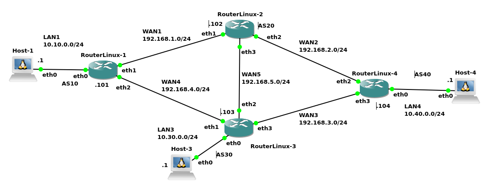

# Exemplo de configuração de eBGP utilizando FRR no Linux
=========================================================


A Internet utiliza o protocolo **Border Gateway Protocol (BGP)** para trocar informações de roteamento entre diferentes **Sistemas Autônomos (AS)**, que são grandes blocos de redes administrados por entidades distintas (grandes empresas de telecomunicação e provedores de Internet). 

Em ambientes Linux, essa funcionalidade é geralmente implementada com a ajuda de softwares de roteamento de código aberto como o [**FRRouting (FRR)**](https://frrouting.org/). O FRR é um conjunto de protocolos de roteamento que permite que servidores Linux se comportem como roteadores de alto desempenho, oferecendo suporte a BGP e outros protocolos, e possibilitando a interconexão de redes complexas de forma eficiente.

Desta forma, este texto apresenta como configurar BGP, no caso **eBGP (Exterior Gateway Protocol)**, utilizando como exemplo a rede ilustrada na Figura 1. Tal rede é composta por quatro roteadores Linux interconectados, cada um operando em um **Sistema Autônomo (AS)** diferente. A topologia simula um ambiente de interconexão de redes, onde o BGP seria usado para a troca de informações de roteamento entre os diferentes AS.

|  |
|:--:|
| Figura 1 - Cenário de rede do Exemplo de configuração dos roteadores Linux utilizando BGP


> **Nota**: Um objetivo indireto desta prática é explorar uma alternativa viável e eficiente para ambientes de ensino de redes que dependem de simuladores como o [GNS3](https://www.gns3.com/). Em vez de utilizar máquinas virtuais pesadas, como as que emulam roteadores Cisco e consomem recursos excessivos de CPU e memória, propõe-se a utilização de roteadores baseados em contêineres [Docker](https://www.docker.com/). Esses contêineres rodam o FRRouting (FRR) em Linux, oferecendo um desempenho significativamente superior. Ao adotar essa abordagem, é possível contornar as limitações de hardware e criar cenários de rede complexos com um número maior de roteadores, viabilizando o aprendizado prático em topologias que, de outra forma, seriam impraticáveis. Adianta-se que isso se mostrou verdadeiro durante a implementação deste exemplo, todavia, não é objetivo deste texto apresentar demonstrativos de desempenho que comprovem isso. Ou seja, esta é apenas uma nota e constatação do autor.


## Componentes da rede de exemplo

A seguir é descrita o cenário de rede presente na Figura 1, que será utilizado para implementar BGP via FRR no Linux.

A rede é composta por 4 Sistemas Autônomos, ou seja, redes independentes gerenciadas por entidades/empresas distintas. Sendo assim, esses AS no exemplo são compostos por:

### **AS10 (Sistema Autônomo 10)**
* **Host-1:** `10.10.0.1/24`
    * Conectado à interface `eth0` do **RouterLinux-1**.
* **RouterLinux-1:**
    * `eth0`: `10.10.0.101/24` (Conectado ao **Host-1**)
    * `eth1`: `192.168.1.101/24` (Conectado ao **RouterLinux-2**)
    * `eth2`: `192.168.4.101/24` (Conectado ao **RouterLinux-3**)

### **AS20 (Sistema Autônomo 20)**
* **RouterLinux-2:**
    * `eth1`: `192.168.1.102/24` (Conectado ao **RouterLinux-1**)
    * `eth2`: `192.168.2.102/24` (Conectado ao **RouterLinux-4**)
    * `eth3`: `192.168.5.102/24` (Conectado ao **RouterLinux-3**)

### **AS30 (Sistema Autônomo 30)**
* **Host-3:** `10.30.0.1/24`
    * Conectado à interface `eth0` do **RouterLinux-3**.
* **RouterLinux-3:**
    * `eth0`: `10.30.0.103/24` (Conectado ao **Host-3**)
    * `eth1`: `192.168.5.103/24` (Conectado ao **RouterLinux-2**)
    * `eth2`: `192.168.4.103/24` (Conectado ao **RouterLinux-1**)
    * `eth3`: `192.168.3.103/24` (Conectado ao **RouterLinux-4**)

### **AS40 (Sistema Autônomo 40)**
* **Host-4:** `10.40.0.1/24`
    * Conectado à interface `eth0` do **RouterLinux-4**.
* **RouterLinux-4:**
    * `eth0`: `10.40.0.104/24` (Conectado ao **Host-4**)
    * `eth2`: `192.168.2.104/24` (Conectado ao **RouterLinux-2**)
    * `eth3`: `192.168.3.104/24` (Conectado ao **RouterLinux-3**)

Em resumo, a rede da Figura 1 é segmentada em várias sub-redes, cada uma com sua máscara de sub-rede `/24`. As LAN (redes locais), que conectam os hosts aos roteadores de borda de seus respectivos AS, são:
* **LAN1:** `10.10.0.0/24` (AS10)
* **LAN3:** `10.30.0.0/24` (AS30)
* **LAN4:** `10.40.0.0/24` (AS40)

As WAN (redes de longa distância) interconectam os roteadores entre os diferentes AS:
* **WAN1:** `192.168.1.0/24` (RouterLinux-1 e RouterLinux-2)
* **WAN2:** `192.168.2.0/24` (RouterLinux-2 e RouterLinux-4)
* **WAN3:** `192.168.3.0/24` (RouterLinux-3 e RouterLinux-4)
* **WAN4:** `192.168.4.0/24` (RouterLinux-1 e RouterLinux-3)
* **WAN5:** `192.168.5.0/24` (RouterLinux-2 e RouterLinux-3)

Essa configuração permite que cada **RouterLinux** atue como um ponto de entrada/saída para seu AS, usando BGP para anunciar suas rotas internas (as redes LAN) para os outros AS e, assim, garantir a conectividade entre todos os hosts na rede.


# Configuração dos Hosts do cenário

No cenário, há três hosts que representam clientes (computadores de usuários ou servidores, mas não roteadores). A configuração desses hosts é um passo fundamental para que eles possam se comunicar com o restante da rede; caso contrário, a rede não funcionará. Para cada host, foram definidos um endereço IP estático e uma rota padrão, configurados com os seguintes comandos:

*   `ifconfig <interface_rede> <endereço_ip>/<máscara>`: Este comando atribui um **endereço IP** e uma **máscara de sub-rede** à interface de rede.
*   `route add default gw <ip_gateway>`: Este comando define o **gateway padrão**. Todo o tráfego destinado a redes que não são locais (como um ``ping`` para um host em outro AS) será enviado para o endereço IP do roteador especificado, que se encarregará de encaminhar o pacote.

A seguir, são apresentados os comandos para cada um dos hosts da topologia de exemplo:

* Host-1:

```console
root@Host-1:/# ifconfig eth0 10.10.0.1/24
root@Host-1:/# route add default gw 10.10.0.101
```
O Host-1, pertencente ao AS10, é configurado com o IP `10.10.0.1/24` e sua rota padrão aponta para o `RouterLinux-1` (`10.10.0.101`), que é o seu gateway para o restante da rede.

* Host-3:

Similarmente, no Host-3, a interface de rede eth0 recebe o endereço IP 10.30.0.1 com uma máscara /24. A rota padrão é adicionada para encaminhar o tráfego para o gateway 10.30.0.103, que é o RouterLinux-3, o roteador do seu AS. Veja:

```console
root@Host-3:/# ifconfig eth0 10.30.0.1/24
root@Host-3:/# route add default gw 10.30.0.103
```

* Host-4:

Por fim, no Host-4, a interface de rede eth0 é configurada com o endereço IP 10.40.0.1 e uma máscara /24. A rota padrão é estabelecida para apontar para o gateway 10.40.0.104, que é o RouterLinux-4, garantindo que o tráfego do host possa alcançar o restante da rede. Os comandos são:

```console
root@Host-4:/# ifconfig eth0 10.40.0.1/24
root@Host-4:/# route add default gw 10.40.0.104
```

## Configuração do Sistema Operacional dos Roteadores

Antes de configurar o BGP, é preciso preparar o sistema operacional de cada roteador. Isso envolve a configuração das interfaces de rede e a ativação do encaminhamento de pacotes.

Então em resumo temos os seguintes comandos para configurar as placas de rede, configurar o FRR e iniciar o FRR:

*   `ifconfig <interface> <ip>/<máscara>`: Atribui um endereço IP e máscara de sub-rede a cada interface do roteador. As interfaces `eth1` e `eth2` são as conexões WAN com os outros roteadores, enquanto a `eth0` é a conexão com a rede local (LAN).
*   `cat /etc/frr/daemons`: Este comando exibe o conteúdo do arquivo de configuração dos daemons do FRR. Para que o BGP funcione, a linha `bgpd=yes` deve estar presente e descomentada. Isso instrui o FRR a iniciar o processo de BGP.
*   `/etc/init.d/frr start`: Inicia o serviço do FRR, que por sua vez ativa todos os daemons configurados, incluindo o `bgpd`.
* Configuração do FRR via linha de comando.

Observações importantes:

* O **FRR não vem instalado por padrão** na maioria das distribuições Linux, então é necessário instalar o FRR, mas isso não será apresentado aqui.

* Para que um sistema Linux funcione como roteador, o **roteamento de IP precisa estar ativado no kernel**. Isso é feito com o comando: **`echo 1 > /proc/sys/net/ipv4/ip_forward`**
Embora não seja mostrado explicitamente nos blocos de comando a seguir, este passo é essencial para o funcionamento do laboratório.

Assim, basicamente todo roteador seguirá essa sequência de passos. Os comandos executados em cada roteador são apresentados nas próximas seções.

## RouterLinux-1

Dados os passos e explicações anteriores vamos começar a configuração pelo RouterLinux-1.


### Configuração de Interfaces de Rede

Iniciemos então pelo mais básico que é a configuração das interfaces de rede:

```console
root@RouterLinux-1:/# ifconfig eth0 10.10.0.101/24
root@RouterLinux-1:/# ifconfig eth1 192.168.1.101
root@RouterLinux-1:/# ifconfig eth2 192.168.4.101
```

O conjunto de comandos ``ifconfig`` é usado para configurar as três interfaces de rede do RouterLinux-1. Sendo que:

* ``eth0`` é configurada com o endereço 10.10.0.101, que é a porta de entrada para a LAN1 do AS10.

* As interfaces ``eth1`` e ``eth2`` são configuradas com os endereços 192.168.1.101 e 192.168.4.101, respectivamente. Essas interfaces representam as conexões WAN para os vizinhos RouterLinux-2 (AS20) e RouterLinux-3 (AS30), permitindo a comunicação entre os Sistemas Autônomos.

> **Atenção**: Lembre-se novamente que em um ambiente real, seria necessário também o comando: **`echo 1 > /proc/sys/net/ipv4/ip_forward`**
 para habilitar o roteamento de pacotes no Linux. Neste caso não foi necessário, pois as máquinas já estavam configuradas para isso previamente.

### Habilitar do Daemon BGP no FRR

Após ter configurados os IPs e máscaras na interface de rede, o próximo passo é configurar o FRR para funcionar com o BGP no host Linux, isso vai permitir a troca de rotas de forma dinâmica com outros roteadores BGP.

Para isso é necessário utilizar um editor de texto e editar o arquivo **`/etc/frr/daemons`**. Neste arquivo procure pela linha `bgpd`, que provavelmente vai ter o valor ``no``, sendo necessário então mudar esse valor para ``yes``. Desta forma, tal linha vai ficar com: **`bgpd=yes`**, o que configura o daemon **BGP**, que é necessário para a comunicação entre os diferentes AS. 

Neste exemplo, todas as outras opções, como OSPF, RIP, e ISIS, estão desabilitadas, mostrando que a rede foi projetada para usar exclusivamente o BGP para o roteamento externo.

> Neste exemplo utilizamos o editor `vi`, mas é possível utilizar outro editor da sua escolha, tal como o `nano`.

A seguir é apresentado como fica o arquivo ``/etc/frr/daemons`` depois da edição (partes do conteúdo do arquivo foram omitidas):

```console
root@RouterLinux-1:/# cat /etc/frr/daemons 
...
bgpd=yes
ospfd=no
ospf6d=no
ripd=no
ripngd=no
isisd=no
pimd=no
ldpd=no
nhrpd=no
eigrpd=no
babeld=no
sharpd=no
pbrd=no
bfdd=no
fabricd=no
vrrpd=no
...
```

### Inicialização do FRRouting no Linux

Só alterar o arquivo de configuração não habilita o roteamento BGP, para tal configuração se tornar efetiva é necessário ligar o FRR, isso pode ser feito de várias formas, tal como o uso do comando ``systemctl``, que é o mais comum hoje em dia. Todavia, neste exemplo será utilizado o *script* de inicialização do `/etc/init.d/frr`, que é uma forma mais tradicional de iniciar tal serviço.

> Este cenário está sendo implementado no GNS3 com o uso de containers Docker e geralmente em container não permite a execução de serviços com o ``systemctl``, por isso optamos pelo `/etc/init.d/frr start`.

Então, o comando **`/etc/init.d/frr start`** inicia o serviço de roteamento do FRR. Após a sua execução a saída deve mostrar que o **`watchfrr`**, um daemon que monitora o estado dos outros daemons do FRR, tenta se conectar e iniciar os processos **`zebra`** (o daemon de kernel de roteamento) e **`bgpd`** (o daemon BGP). 

```console
root@RouterLinux-1:/# /etc/init.d/frr start
watchfrr[29092]: watchfrr 7.5.1 starting: vty@0
watchfrr[29092]: zebra state -> down : initial connection attempt failed
watchfrr[29092]: bgpd state -> down : initial connection attempt failed
watchfrr[29092]: staticd state -> down : initial connection attempt failed
watchfrr[29092]: Forked background command [pid 29093]: /usr/lib/frr/watchfrr.sh restart all
watchfrr[29092]: Terminating on signal
Started watchfrr.
```
A saída anterior mostra que o serviço é iniciado com sucesso, e os daemons necessários para o roteamento são ativados em segundo plano, preparando o roteador para a configuração de BGP.

> O *script* `/etc/init.d/frr`, normalmente tem como opção também o  ``stop`` e ``restart``, que são respectivamente para parar o serviço ou reiniciá-lo.

#### Configuração do Protocolo BGP

Com o BGP já configurado e ativo via **FRR**, é possível acessar a interface de linha de comando (CLI), acessada pelo comando **`vtysh`**, para configurar o BGP, tal como:

```console
root@RouterLinux-1:/# vtysh 

Hello, this is FRRouting (version 7.5.1).
Copyright 1996-2005 Kunihiro Ishiguro, et al.

RouterLinux-1# configure terminal
RouterLinux-1(config)# router bgp 10
RouterLinux-1(config-router)# route-map ALLOW permit 100
RouterLinux-1(config)# router bgp 10
RouterLinux-1(config-router)# network 10.10.0.0 mask 255.255.255.0
RouterLinux-1(config-router)# neighbor 192.168.1.102 remote-as 20
RouterLinux-1(config-router)# neighbor 192.168.4.103 remote-as 30
RouterLinux-1(config-router)# neighbor 192.168.1.102 route-map ALLOW in
RouterLinux-1(config-router)# neighbor 192.168.1.102 route-map ALLOW out
RouterLinux-1(config-router)# neighbor 192.168.4.103 route-map ALLOW in
RouterLinux-1(config-router)# neighbor 192.168.4.103 route-map ALLOW out
```

> Também seria possível acessar o BGP via ``telnet``, tal como: ``telnet 127.0.0.1 bgpd``, ou o ``telnet 127.0.0.1 zebrad``, para acessar a configuração geral do FRR.

No bloco de comandos apresentado anteriormente são executados os seguintes comandos:

1.  **`router bgp 10`**: Este comando entra no modo de configuração do BGP para o **AS10**.
2.  **`route-map ALLOW permit 100`**: É criado um **mapa de rotas** chamado `ALLOW` para permitir o tráfego de roteamento. Embora seja um mapa de rotas básico sem regras de filtragem complexas, ele serve para habilitar explicitamente a passagem de anúncios de rotas entre os vizinhos. Isso é extremamente importante no FRR, já que este bloqueia o anuncio de rotas via BGP por padrão e por motivos de segurança é necessário declarar essa intenção de forma explicita e isso é feito justamente com o mapa de rotas.
3.  **`network 10.10.0.0 mask 255.255.255.0`**: Este comando anuncia a rede interna (`10.10.0.0/24`) do **AS10** aos vizinhos BGP, informando a eles que este AS é responsável por essa rede.
4.  **`neighbor 192.168.1.102 remote-as 20`** e **`neighbor 192.168.4.103 remote-as 30`**: Esses comandos definem os vizinhos BGP e seus respectivos Sistemas Autônomos. Eles estabelecem sessões BGP com o **RouterLinux-2** (`192.168.1.102`) no **AS20** e com o **RouterLinux-3** (`192.168.4.103`) no **AS30**.
5.  **`neighbor ... route-map ALLOW in`** e **`neighbor ... route-map ALLOW out`**: Por fim, os comandos aplicam o mapa de rotas **`ALLOW`** para o tráfego de entrada (`in`) e de saída (`out`) em ambas as sessões BGP. Isso garante que as rotas sejam recebidas e enviadas para os vizinhos de acordo com a política definida, que neste caso é a de permitir todas as rotas.

> **Atenção**: Então no caso do FRR é obrigatório usar o ``route-map`` e informar de forma explicita quem pode receber rotas BGP no ``in`` e no ``out``. Há relatos que só é necessário fazer isso para o ``out``, todavia nos testes realizados aqui foi necessário utilizar em ambas as direções caso contrário o status da comunicação com o vizinho sempre era ``Policy``, o que significa que havia problemas de autorização com o vizinho. 


## RouterLinux-3

Agora vamos para a configuração do RouterLinux-3. Sendo que, a configuração do `RouterLinux-3` segue a mesma lógica do roteador anterior, mas agora para o **AS 30**. Ele se conecta a três outros roteadores em diferentes ASs (10, 20 e 40).

A seguir, vemos a configuração das interfaces, a ativação do daemon `bgpd` e o início do serviço FRR.

```console
root@RouterLinux-3:/# ifconfig eth0 10.30.0.103/24
root@RouterLinux-3:/# ifconfig eth1 192.168.4.103
root@RouterLinux-3:/# ifconfig eth2 192.168.5.103
root@RouterLinux-3:/# ifconfig eth3 192.168.3.103
root@RouterLinux-3:/# grep bgp= /etc/frr/daemons 
bgpd=yes
root@RouterLinux-3:/# /etc/init.d/frr start
```

> Na prática seria necessário utilizar um editor de texto (``vi`` ou ``nano``), para editar o arquivo ``/etc/frr/daemons``, mas aqui só vamos mostrar com o ``grep`` que tal arquivo já está com a variável ``bgpd=yes`` configurada - o mesmo será utilizado no restante do texto.

Com a configuração básica pronta, agora é possível acessar o **`vtysh`** e configurar o roteador parte do **AS30**, seguindo os seguintes passos:

1.  Um **`route-map`** chamado **`ALLOW`** é criado para permitir o tráfego de roteamento, assim como no **RouterLinux-1**.
2.  A rede interna **`10.30.0.0/24`** é anunciada, tornando-a visível para outros Sistemas Autônomos.
3.  Os vizinhos BGP são definidos: **`192.168.4.101`** (AS10), **`192.168.5.102`** (AS20) e **`192.168.3.104`** (AS40).
4.  O `route-map` **`ALLOW`** é aplicado em todas as sessões de entrada e saída, garantindo que as rotas sejam trocadas sem restrições.

Veja os comandos a seguir:

```console
root@RouterLinux-3:/# vtysh 

Hello, this is FRRouting (version 7.5.1).
Copyright 1996-2005 Kunihiro Ishiguro, et al.

RouterLinux-3(config)# route-map ALLOW permit 100
RouterLinux-3(config-route-map)# router bgp 30
RouterLinux-3(config-router)# network 10.30.0.0 mask 255.255.255.0
RouterLinux-3(config-router)# neighbor 192.168.4.101 remote-as 10
RouterLinux-3(config-router)# neighbor 192.168.5.102 remote-as 20
RouterLinux-3(config-router)# neighbor 192.168.3.104 remote-as 40
RouterLinux-3(config-router)# neighbor 192.168.4.101 route-map ALLOW in
RouterLinux-3(config-router)# neighbor 192.168.4.101 route-map ALLOW out
RouterLinux-3(config-router)# neighbor 192.168.5.102 route-map ALLOW in 
RouterLinux-3(config-router)# neighbor 192.168.5.102 route-map ALLOW out
RouterLinux-3(config-router)# neighbor 192.168.3.104 route-map ALLOW in 
RouterLinux-3(config-router)# neighbor 192.168.3.104 route-map ALLOW out
RouterLinux-3(config-router)# end
```

> Para ficar mais prático agora iniciamos criando o ``route-map`` e depois configuramos o BGP, também fazemos a inclusão de cada vizinho e a liberação para a publicação de rotas na entrada e saída.

Com tudo configurado no RouterLinux1 e RouterLinux3 é possível ver a comunicação entre os vizinhos BGP com o comando **``show ip bgp summary``**, tal como:

```console
RouterLinux-3# show ip bgp summary 

IPv4 Unicast Summary:
BGP router identifier 192.168.5.103, local AS number 30 vrf-id 0
BGP table version 2
RIB entries 3, using 576 bytes of memory
Peers 3, using 64 KiB of memory

Neighbor        V         AS   MsgRcvd   MsgSent   TblVer  InQ OutQ  Up/Down State/PfxRcd   PfxSnt
192.168.3.104   4         40         0         0        0    0    0    never       Active        0
192.168.4.101   4         10         9        10        0    0    0 00:04:18            1        2
192.168.5.102   4         20         0         0        0    0    0    never       Active        0

Total number of neighbors 3

```

O comando **`show ip bgp summary`** exibe um resumo do status das sessões BGP. 

* A tabela mostra os três vizinhos configurados, seus respectivos AS e o status da conexão.
* O vizinho **`192.168.4.101`** (AS10) está **`Up/Down`** há `00:04:18`, indicando que a sessão está ativa e trocando rotas. O campo **`PfxRcd`** mostra que **1 prefixo** (a rede **`10.10.0.0/24`**) foi recebido do **RouterLinux-1**.
* Os outros dois vizinhos (**AS20** e **AS40**) estão no estado **`Active`**, o que significa que o roteador está tentando se conectar, mas a sessão ainda não foi estabelecida, provavelmente porque os roteadores vizinhos ainda não foram configurados.

> **Atenção**: É importante saber que qualquer coisa diferente de números nas duas últimas colunas apresentadas significa que a conexão entre os vizinhos BGP não está totalmente completa - ou seja, há problemas.

Também, utilizando o comando **``show ip route``** é possível ver se a tabela de roteamento do roteador já apresenta as rotas, principalmente as rotas BGP, veja:

```console
RouterLinux-3# show ip route
Codes: K - kernel route, C - connected, S - static, R - RIP,
       O - OSPF, I - IS-IS, B - BGP, E - EIGRP, N - NHRP,
       T - Table, v - VNC, V - VNC-Direct, A - Babel, D - SHARP,
       F - PBR, f - OpenFabric,
       > - selected route, * - FIB route, q - queued, r - rejected, b - backup

B>* 10.10.0.0/24 [20/0] via 192.168.4.101, eth1, weight 1, 00:02:47
C>* 10.30.0.0/24 is directly connected, eth0, 00:07:23
C>* 192.168.3.0/24 is directly connected, eth3, 00:07:23
C>* 192.168.4.0/24 is directly connected, eth1, 00:07:23
C>* 192.168.5.0/24 is directly connected, eth2, 00:07:23

```

Assim, a saída do comando **`show ip route`** anterior, mostra a tabela de roteamento completa do **RouterLinux-3** com a configuração feita até o momento:

* A entrada **`B>`** indica uma rota aprendida via **BGP**. O roteador aprendeu a rota para a rede **`10.10.0.0/24`** via o vizinho **`192.168.4.101`** (**RouterLinux-1**). A métrica `[20/0]` é um valor interno do BGP que indica a distância administrativa e a métrica BGP.

* As entradas **`C>`** (`connected`) mostram as redes diretamente conectadas às interfaces do roteador. Isso inclui a LAN interna (`10.30.0.0/24`) e as três WANs (`192.168.3.0/24`, `192.168.4.0/24`, e `192.168.5.0/24`).

Esses comandos de verificação são essenciais para **diagnosticar problemas** de conectividade e **confirmar** que a troca de informações de roteamento está ocorrendo como esperado.

## RouterLinux-4

Com a configuração do RouterLinux-1 e RouterLinux-3 já realizadas, vamos para a configuração do RouterLinux-4, que segue basicamente a mesma lógica dos roteadores anteriores, mas agora para o **AS 40**.

Então iniciamos com a configuração das interfaces **`eth0`**, **`eth2`** e **`eth3`** do **RouterLinux-4** são configuradas para se conectarem às redes locais e WAN correspondentes. O comando **`grep`** verifica que o *daemon* **`bgpd`** está ativado, e o serviço FRR é iniciado. A saída mostra que todos os *daemons*, incluindo **`zebra`** e **`bgpd`**, foram iniciados com sucesso. Veja os comandos e as saídas geradas a seguir:

```console
root@RouterLinux-4:/# ifconfig eth0 10.40.0.104/24
root@RouterLinux-4:/# ifconfig eth2 192.168.2.104
root@RouterLinux-4:/# ifconfig eth3 192.168.3.104
root@RouterLinux-4:/# grep bgpd /etc/frr/daemons 
bgpd=yes
bgpd_options="   -A 127.0.0.1"
root@RouterLinux-4:/# /etc/init.d/frr start
watchfrr[29065]: watchfrr 7.5.1 starting: vty@0
watchfrr[29065]: zebra state -> down : initial connection attempt failed
watchfrr[29065]: bgpd state -> down : initial connection attempt failed
watchfrr[29065]: staticd state -> down : initial connection attempt failed
watchfrr[29065]: Forked background command [pid 29066]: /usr/lib/frr/watchfrr.sh restart all
watchfrr[29065]: zebra state -> up : connect succeeded
watchfrr[29065]: bgpd state -> up : connect succeeded
watchfrr[29065]: staticd state -> up : connect succeeded
watchfrr[29065]: all daemons up, doing startup-complete notify
Started watchfrr.
```

Agora, dentro do **`vtysh`**, o roteador pode ser configurado como parte do **AS40**. Isso é feito com os comandos a seguir:

```console
root@RouterLinux-4:/# vtysh 

Hello, this is FRRouting (version 7.5.1).
Copyright 1996-2005 Kunihiro Ishiguro, et al.

RouterLinux-4# configure terminal
RouterLinux-4(config)# route-map ALLOW permit 100
RouterLinux-4(config-route-map)# router bgp 40
RouterLinux-4(config-router)# network 10.40.0.0 mask 255.255.255.0
RouterLinux-4(config-router)# neighbor 192.168.2.102 remote-as 20
RouterLinux-4(config-router)# neighbor 192.168.2.102 route-map ALLOW in
RouterLinux-4(config-router)# neighbor 192.168.2.102 route-map ALLOW out
RouterLinux-4(config-router)# neighbor 192.168.3.103 remote-as 30
RouterLinux-4(config-router)# neighbor 192.168.3.103 route-map ALLOW in
RouterLinux-4(config-router)# neighbor 192.168.3.103 route-map ALLOW out
RouterLinux-4(config-router)# end

```

Em resumo os comandos anteriores têm a seguinte funcionalidade:

1.  A rede interna **`10.40.0.0/24`** é anunciada.
2.  Os vizinhos BGP, **RouterLinux-2** (AS20) e **RouterLinux-3** (AS30), são definidos.
3.  O `route-map` **`ALLOW`** é aplicado a todas as sessões para permitir a troca de rotas.

Desta forma, com tudo configurado nos roteadores 1, 3, e 4 (roteadores de baixo da Figura 1), é possível ver a comunicação entre os vizinhos BGP com o comando **`show ip bgp summary`** no **RouterLinux-4**:

```console
RouterLinux-4# show ip bgp summary 

IPv4 Unicast Summary:
BGP router identifier 192.168.3.104, local AS number 40 vrf-id 0
BGP table version 3
RIB entries 5, using 960 bytes of memory
Peers 2, using 43 KiB of memory

Neighbor        V         AS   MsgRcvd   MsgSent   TblVer  InQ OutQ  Up/Down State/PfxRcd   PfxSnt
192.168.2.102   4         20         0         0        0    0    0    never       Active        0
192.168.3.103   4         30         8         7        0    0    0 00:00:55            2        3

Total number of neighbors 2

```

A saída do comando `show ip bgp summary` apresentada anteriormente exibe:

* A tabela mostra que o vizinho **`192.168.3.103`** (AS30) está ativo, com 2 prefixos recebidos (`PfxRcd=2`) e 3 prefixos enviados (`PfxSnt=3`). 
* O vizinho **`192.168.2.102`** (AS20) ainda está no estado **`Active`**, indicando que a sessão não foi estabelecida.

Também é importante executar o comando **`show ip route`** para verificar a tabela de roteamento do **RouterLinux-4**:

```console
RouterLinux-4# show ip route
Codes: K - kernel route, C - connected, S - static, R - RIP,
       O - OSPF, I - IS-IS, B - BGP, E - EIGRP, N - NHRP,
       T - Table, v - VNC, V - VNC-Direct, A - Babel, D - SHARP,
       F - PBR, f - OpenFabric,
       > - selected route, * - FIB route, q - queued, r - rejected, b - backup

B>* 10.10.0.0/24 [20/0] via 192.168.3.103, eth3, weight 1, 00:01:11
B>* 10.30.0.0/24 [20/0] via 192.168.3.103, eth3, weight 1, 00:01:11
C>* 10.40.0.0/24 is directly connected, eth0, 00:03:11
C>* 192.168.2.0/24 is directly connected, eth2, 00:03:11
C>* 192.168.3.0/24 is directly connected, eth3, 00:03:11
```

Neste caso, na saída anterior, é possível verificar que:

* As duas rotas **`B>`** (BGP) para **`10.10.0.0/24`** e **`10.30.0.0/24`** foram aprendidas através do vizinho **`192.168.3.103`** (RouterLinux-3).
* As entradas **`C>`** mostram as redes diretamente conectadas às interfaces, incluindo a LAN (`10.40.0.0/24`) e as duas WANs.

Ou seja, o cenário de rede proposto está funcionando conforme o esperado.

Outro comando BGP importante é o **`show ip bgp`**, seguido de um IP de host ou rede, tal comando que fornece detalhes sobre como a rota para a rede, por exemplo:

```console
RouterLinux-4# show ip bgp 10.10.0.0 
BGP routing table entry for 10.10.0.0/24
Paths: (1 available, best #1, table default)
  Advertised to non peer-group peers:
  192.168.3.103
  30 10
    192.168.3.103 from 192.168.3.103 (192.168.5.103)
      Origin IGP, valid, external, best (First path received)
      Last update: Wed Oct  8 13:10:36 2025

```

Assim, o comando ``show ip bgp 10.10.0.0``, no exemplo anterior mostra:

* A rota tem um **`AS Path`** de **`30 10`**. Isso significa que a rota foi originada no **AS10**, passou pelo **AS30** e chegou ao **RouterLinux-4** (AS40). 
* O **`next-hop`** é o IP do vizinho (`192.168.3.103`), e a origem é **`IGP`**, indicando que a rota foi injetada no BGP a partir de um protocolo de *gateway* interno ou diretamente pelo comando `network`.
* O status **`best`** confirma que esta é a melhor rota para a rede de destino, e o fato de ser **`external`** indica que foi aprendida de um AS diferente do local.


## RouterLinux-2

Agora vamos para a configuração do **RouterLinux-2, que é o último roteador que falta configurar no cenário proposto.

Iniciamos novamente com a configuração das interfaces. Os comandos **`ifconfig`** configuram as três interfaces WAN do **RouterLinux-2**. Em seguida, o arquivo `/etc/frr/daemons` é verificado com **`grep`** para confirmar que o daemon BGP está habilitado, e o serviço FRR é iniciado. A saída mostra que os daemons **`zebra`** e **`bgpd`** foram inicializados com sucesso. Tal como pode ser visto nos comandos a seguir:


```console
root@RouterLinux-2:/# ifconfig eth1 192.168.1.102
root@RouterLinux-2:/# ifconfig eth2 192.168.2.102
root@RouterLinux-2:/# ifconfig eth3 192.168.5.102
root@RouterLinux-2:/# vi /etc/frr/daemons 
root@RouterLinux-2:/# grep bgpd=yes /etc/frr/daemons 
bgpd=yes
root@RouterLinux-2:/# /etc/init.d/frr start
watchfrr[29037]: watchfrr 7.5.1 starting: vty@0
watchfrr[29037]: zebra state -> down : initial connection attempt failed
watchfrr[29037]: bgpd state -> down : initial connection attempt failed
watchfrr[29037]: staticd state -> down : initial connection attempt failed
watchfrr[29037]: Forked background command [pid 29038]: /usr/lib/frr/watchfrr.sh restart all
watchfrr[29037]: zebra state -> up : connect succeeded
watchfrr[29037]: bgpd state -> up : connect succeeded
watchfrr[29037]: staticd state -> up : connect succeeded
watchfrr[29037]: all daemons up, doing startup-complete notify
Started watchfrr.
```

Dentro do **`vtysh`**, o **RouterLinux-2** é configurado no **AS20**. O `route-map` **`ALLOW`** é criado para permitir a troca de rotas. O roteador define seus três vizinhos BGP: **RouterLinux-1** (AS10), **RouterLinux-4** (AS40), e **RouterLinux-3** (AS30), aplicando o `route-map` para todas as sessões.

Note nos comandos seguintes que esse roteado **não tem rede para anunciar**!

```console
RouterLinux-2# configure terminal
RouterLinux-2(config)# route-map ALLOW permit 100
RouterLinux-2(config-route-map)# router bgp 20
RouterLinux-2(config-router)# neighbor 192.168.1.101 remote-as 10
RouterLinux-2(config-router)# neighbor 192.168.1.101 route-map ALLOW in
RouterLinux-2(config-router)# neighbor 192.168.1.101 route-map ALLOW out
RouterLinux-2(config-router)# neighbor 192.168.2.104 remote-as 40
RouterLinux-2(config-router)# neighbor 192.168.2.104 route-map ALLOW in
RouterLinux-2(config-router)# neighbor 192.168.2.104 route-map ALLOW out
RouterLinux-2(config-router)# neighbor 192.168.5.103 remote-as 30
RouterLinux-2(config-router)# neighbor 192.168.5.103 route-map ALLOW in
RouterLinux-2(config-router)# neighbor 192.168.5.103 route-map ALLOW out
RouterLinux-2(config-router)# end

```

Com toda a configuração de rede e BGP já realizada, podemos utilizar o comando **`show ip bgp summary`** para exibir um resumo das sessões BGP do **RouterLinux-2** (ver comando e saída a seguir). 


```console
RouterLinux-2# show ip bgp summary 

IPv4 Unicast Summary:
BGP router identifier 192.168.5.102, local AS number 20 vrf-id 0
BGP table version 5
RIB entries 5, using 960 bytes of memory
Peers 3, using 64 KiB of memory

Neighbor        V         AS   MsgRcvd   MsgSent   TblVer  InQ OutQ  Up/Down State/PfxRcd   PfxSnt
192.168.1.101   4         10        10        10        0    0    0 00:01:26            3        3
192.168.2.104   4         40         9         8        0    0    0 00:00:57            3        3
192.168.5.103   4         30         9         7        0    0    0 00:00:36            3        3

Total number of neighbors 3

```

Assim, a saída anterior mostra que **todos os três vizinhos** BGP estão no estado **`Established`**, indicando que as sessões estão ativas e funcionando. Cada vizinho (`192.168.1.101`, `192.168.2.104` e `192.168.5.103`) recebeu três prefixos (`PfxRcd=3`), o que significa que o **RouterLinux-2** aprendeu as rotas para todas as redes internas dos outros Sistemas Autônomos.

Também é possível ver dados a respeito dos vizinhos BGP com o comando **`show ip bgp neighbors`**, que fornece informações detalhadas sobre as sessões BGP com cada vizinho.
* Para cada vizinho, o comando exibe o **endereço IP**, o **AS remoto** e o **estado da conexão**, que é **`Established`**.
* O **`Hostname`** é mostrado, identificando o roteador vizinho.
* A seção **`Neighbor capabilities`** lista as funcionalidades suportadas, como **`4 Byte AS`** e **`Route refresh`**.
* As **`Message statistics`** mostram o número de pacotes BGP trocados (**`Updates`**, **`Keepalives`**, etc.), confirmando a comunicação ativa.
* O comando também exibe o **`Route map`** aplicado (`*ALLOW`) e o número de prefixos aceitos (`3 accepted prefixes`), reforçando que a política de roteamento está em vigor e as rotas estão sendo recebidas. Veja como fica tal comando na saída a seguir:

```console
RouterLinux-2# show ip bgp neighbors 
BGP neighbor is 192.168.1.101, remote AS 10, local AS 20, external link
Hostname: RouterLinux-1
  BGP version 4, remote router ID 192.168.4.101, local router ID 192.168.5.102
  BGP state = Established, up for 00:01:47
  Last read 00:00:47, Last write 00:00:47
  Hold time is 180, keepalive interval is 60 seconds
  Neighbor capabilities:
    4 Byte AS: advertised and received
    AddPath:
      IPv4 Unicast: RX advertised IPv4 Unicast and received
    Route refresh: advertised and received(old & new)
    Address Family IPv4 Unicast: advertised and received
    Hostname Capability: advertised (name: RouterLinux-2,domain name: n/a) received (name: RouterLinux-1,domain name: n/a)
    Graceful Restart Capability: advertised and received
      Remote Restart timer is 120 seconds
      Address families by peer:
        none
  Graceful restart information:
    End-of-RIB send: IPv4 Unicast
    End-of-RIB received: IPv4 Unicast
    Local GR Mode: Helper*
    Remote GR Mode: Helper
    R bit: False
    Timers:
      Configured Restart Time(sec): 120
      Received Restart Time(sec): 120
    IPv4 Unicast:
      F bit: False
      End-of-RIB sent: Yes
      End-of-RIB sent after update: No
      End-of-RIB received: Yes
      Timers:
        Configured Stale Path Time(sec): 360
  Message statistics:
    Inq depth is 0
    Outq depth is 0
                         Sent       Rcvd
    Opens:                  1          1
    Notifications:          0          0
    Updates:                6          7
    Keepalives:             2          2
    Route Refresh:          1          0
    Capability:             0          0
    Total:                 10         10
  Minimum time between advertisement runs is 0 seconds

 For address family: IPv4 Unicast
  Update group 2, subgroup 1
  Packet Queue length 0
  Community attribute sent to this neighbor(all)
  Inbound path policy configured
  Outbound path policy configured
  Route map for incoming advertisements is *ALLOW
  Route map for outgoing advertisements is *ALLOW
  3 accepted prefixes

  Connections established 1; dropped 0
  Last reset 00:01:48,  Waiting for peer OPEN
Local host: 192.168.1.102, Local port: 60206
Foreign host: 192.168.1.101, Foreign port: 179
Nexthop: 192.168.1.102
Nexthop global: fe80::42:14ff:feda:a01
Nexthop local: fe80::42:14ff:feda:a01
BGP connection: shared network
BGP Connect Retry Timer in Seconds: 120
Estimated round trip time: 2 ms
Read thread: on  Write thread: on  FD used: 24

BGP neighbor is 192.168.2.104, remote AS 40, local AS 20, external link
Hostname: RouterLinux-4
  BGP version 4, remote router ID 192.168.3.104, local router ID 192.168.5.102
  BGP state = Established, up for 00:01:18
  Last read 00:00:18, Last write 00:00:18
  Hold time is 180, keepalive interval is 60 seconds
  Neighbor capabilities:
    4 Byte AS: advertised and received
    AddPath:
      IPv4 Unicast: RX advertised IPv4 Unicast and received
    Route refresh: advertised and received(old & new)
    Address Family IPv4 Unicast: advertised and received
    Hostname Capability: advertised (name: RouterLinux-2,domain name: n/a) received (name: RouterLinux-4,domain name: n/a)
    Graceful Restart Capability: advertised and received
      Remote Restart timer is 120 seconds
      Address families by peer:
        none
  Graceful restart information:
    End-of-RIB send: IPv4 Unicast
    End-of-RIB received: IPv4 Unicast
    Local GR Mode: Helper*
    Remote GR Mode: Helper
    R bit: False
    Timers:
      Configured Restart Time(sec): 120
      Received Restart Time(sec): 120
    IPv4 Unicast:
      F bit: False
      End-of-RIB sent: Yes
      End-of-RIB sent after update: No
      End-of-RIB received: Yes
      Timers:
        Configured Stale Path Time(sec): 360
  Message statistics:
    Inq depth is 0
    Outq depth is 0
                         Sent       Rcvd
    Opens:                  1          1
    Notifications:          0          0
    Updates:                5          7
    Keepalives:             2          2
    Route Refresh:          1          0
    Capability:             0          0
    Total:                  9         10
  Minimum time between advertisement runs is 0 seconds

 For address family: IPv4 Unicast
  Update group 2, subgroup 1
  Packet Queue length 0
  Community attribute sent to this neighbor(all)
  Inbound path policy configured
  Outbound path policy configured
  Route map for incoming advertisements is *ALLOW
  Route map for outgoing advertisements is *ALLOW
  3 accepted prefixes

  Connections established 1; dropped 0
  Last reset 00:01:19,  Waiting for peer OPEN
Local host: 192.168.2.102, Local port: 34910
Foreign host: 192.168.2.104, Foreign port: 179
Nexthop: 192.168.2.102
Nexthop global: fe80::42:14ff:feda:a02
Nexthop local: fe80::42:14ff:feda:a02
BGP connection: shared network
BGP Connect Retry Timer in Seconds: 120
Estimated round trip time: 2 ms
Read thread: on  Write thread: on  FD used: 25

BGP neighbor is 192.168.5.103, remote AS 30, local AS 20, external link
Hostname: RouterLinux-3
  BGP version 4, remote router ID 192.168.5.103, local router ID 192.168.5.102
  BGP state = Established, up for 00:00:57
  Last read 00:00:49, Last write 00:00:47
  Hold time is 180, keepalive interval is 60 seconds
  Neighbor capabilities:
    4 Byte AS: advertised and received
    AddPath:
      IPv4 Unicast: RX advertised IPv4 Unicast and received
    Route refresh: advertised and received(old & new)
    Address Family IPv4 Unicast: advertised and received
    Hostname Capability: advertised (name: RouterLinux-2,domain name: n/a) received (name: RouterLinux-3,domain name: n/a)
    Graceful Restart Capability: advertised and received
      Remote Restart timer is 120 seconds
      Address families by peer:
        none
  Graceful restart information:
    End-of-RIB send: IPv4 Unicast
    End-of-RIB received: IPv4 Unicast
    Local GR Mode: Helper*
    Remote GR Mode: Helper
    R bit: False
    Timers:
      Configured Restart Time(sec): 120
      Received Restart Time(sec): 120
    IPv4 Unicast:
      F bit: False
      End-of-RIB sent: Yes
      End-of-RIB sent after update: No
      End-of-RIB received: Yes
      Timers:
        Configured Stale Path Time(sec): 360
  Message statistics:
    Inq depth is 0
    Outq depth is 0
                         Sent       Rcvd
    Opens:                  1          1
    Notifications:          0          0
    Updates:                4          7
    Keepalives:             1          1
    Route Refresh:          1          0
    Capability:             0          0
    Total:                  7          9
  Minimum time between advertisement runs is 0 seconds

 For address family: IPv4 Unicast
  Update group 2, subgroup 1
  Packet Queue length 0
  Community attribute sent to this neighbor(all)
  Inbound path policy configured
  Outbound path policy configured
  Route map for incoming advertisements is *ALLOW
  Route map for outgoing advertisements is *ALLOW
  3 accepted prefixes

  Connections established 1; dropped 0
  Last reset 00:00:58,  Waiting for peer OPEN
Local host: 192.168.5.102, Local port: 40286
Foreign host: 192.168.5.103, Foreign port: 179
Nexthop: 192.168.5.102
Nexthop global: fe80::42:14ff:feda:a03
Nexthop local: fe80::42:14ff:feda:a03
BGP connection: shared network
BGP Connect Retry Timer in Seconds: 120
Read thread: on  Write thread: on  FD used: 26


```

Por fim, executamos o comando **`show ip route`** no **RouterLinux-2**, que deve mostrar todas as redes BGP aunciadas pelos outros roteadores:

```console
RouterLinux-2# show ip route
Codes: K - kernel route, C - connected, S - static, R - RIP,
       O - OSPF, I - IS-IS, B - BGP, E - EIGRP, N - NHRP,
       T - Table, v - VNC, V - VNC-Direct, A - Babel, D - SHARP,
       F - PBR, f - OpenFabric,
       > - selected route, * - FIB route, q - queued, r - rejected, b - backup

B>* 10.10.0.0/24 [20/0] via 192.168.1.101, eth1, weight 1, 00:02:07
B>* 10.30.0.0/24 [20/0] via 192.168.5.103, eth3, weight 1, 00:01:21
B>* 10.40.0.0/24 [20/0] via 192.168.2.104, eth2, weight 1, 00:01:44
C>* 192.168.1.0/24 is directly connected, eth1, 00:03:39
C>* 192.168.2.0/24 is directly connected, eth2, 00:03:39
C>* 192.168.5.0/24 is directly connected, eth3, 00:03:39
```

Assim, na saída anterior As entradas `B>` mostram as rotas aprendidas via BGP: **`10.10.0.0/24`** (AS10), **`10.30.0.0/24`** (AS30), e **`10.40.0.0/24`** (AS40). Também são apresentadas as rotas diretamente conectadas ao roteador (**`C>`**). Desta forma, a presença de todas essas rotas confirma que o BGP está funcionando corretamente, permitindo que o tráfego de qualquer host no AS20 chegue aos outros AS e vice-versa.


## Teste de conectividade

Para finalizar completamente, vamos realizar os testes com os hosts clientes, já que, na verdade, todo o roteamento foi realizado apenas para tornar possível a comunicação entre eles. Para este teste, vamos executar um teste de comunicação com um `ping` entre o Host-1 (AS10) e o Host-3 (AS30). Depois, será realizado um teste com `traceroute` do Host-1 para o Host-4 (AS40), o que deve mostrar todo o caminho traçado pelo roteamento BGP entre esses hosts de ASs diferentes.

#### Teste de Ping do Host-1 para o Host-3

Iniciamos o teste com um simples **`ping`** do **Host-1** para o **Host-3**. Veja o comando e a saída a seguir:

```console
root@Host-1:/# ping 10.30.0.1
PING 10.30.0.1 (10.30.0.1) 56(84) bytes of data.
64 bytes from 10.30.0.1: icmp_seq=1 ttl=62 time=0.354 ms
64 bytes from 10.30.0.1: icmp_seq=2 ttl=62 time=0.300 ms
64 bytes from 10.30.0.1: icmp_seq=3 ttl=62 time=0.496 ms
^C
--- 10.30.0.1 ping statistics ---
3 packets transmitted, 3 received, 0% packet loss, time 2042ms
rtt min/avg/max/mdev = 0.300/0.383/0.496/0.082 ms
```
A saída indica que o ``ping`` foi bem-sucedido, com `3 packets transmitted` e `3 received`, resultando em **`0% packet loss`**. Isso confirma que há uma rota funcional entre o **AS10** (onde está o Host-1) e o **AS30** (onde está o Host-3), e que o BGP está permitindo que as redes se comuniquem corretamente.

#### Teste de Rota (Traceroute) do Host-1 para o Host-4

O segundo teste é um comando **`traceroute`** do **Host-1** para o **Host-4**. O `traceroute` mostra o caminho que os pacotes de dados percorrem para chegar ao destino, revelando os roteadores que são atravessados.

```console
root@Host-1:/# traceroute 10.40.0.1 -n
traceroute to 10.40.0.1 (10.40.0.1), 30 hops max, 60 byte packets
 1  10.10.0.101  0.270 ms  0.306 ms  0.314 ms
 2  192.168.4.103  0.588 ms  0.584 ms  0.565 ms
 3  * * *
 4  * * *
 5  * * *
 6  * * *
 7  * * *
 8  * 10.40.0.1  0.569 ms  1.437 ms
```
Então a saída anterior, do comando ``traceroute`` mostra que:

* O **primeiro salto** é para **`10.10.0.101`**, que é o **RouterLinux-1**, o gateway do **Host-1**.
* O **segundo salto** é para **`192.168.4.103`**, que é o **RouterLinux-3**. Isso mostra que o tráfego do **Host-1** no **AS10** está sendo roteado pelo **RouterLinux-3** no **AS30**.
* O **terceiro salto** e seguintes mostram **`* * *`**, o que significa que as respostas de alguns roteadores intermediários não foram recebidas.
* Finalmente, o destino **`10.40.0.1`** (Host-4) é alcançado com sucesso.

Desta forma, a rota observada confirma que o **RouterLinux-1** usou sua rota BGP para encaminhar o tráfego para o **RouterLinux-3**, que por sua vez enviou o tráfego para o **RouterLinux-4** (que é o *gateway* do Host-4). Esses testes validam que a rede BGP está totalmente funcional, permitindo a comunicação entre todos os Sistemas Autônomos configurados.


---
### Conclusão

A configuração e os testes de conectividade demonstrados na rede BGP proposta ilustra a eficácia do uso do **FRRouting (FRR)** em um ambiente **Linux** para simular uma interconexão de Sistemas Autônomos. Através de comandos simples de `ifconfig` e da CLI do `vtysh`, foi possível definir as interfaces, habilitar o protocolo **BGP** e estabelecer sessões de vizinhança entre os roteadores de borda. Os resultados dos comandos de verificação (`show ip bgp summary` e `show ip route`) e dos testes de `ping` e `traceroute` confirmam que as rotas foram trocadas com sucesso, garantindo a plena conectividade entre todos os hosts em diferentes ASs. Isso demostra que o **FRR** é solução a ser considerada para a implementação de roteamento BGP em plataformas Linux, servindo como uma alternativa poderosa e de baixo custo para roteadores dedicados.

> **Nota**: A implementação deste projeto demonstrou que o objetivo indireto de encontrar uma alternativa viável e eficiente para ambientes de ensino de redes foi não apenas alcançado, mas também validado na prática. O uso de roteadores Linux com FRRouting (FRR) em containers Docker no GNS3 provou ser uma solução robusta para contornar as limitações de hardware impostas por máquinas virtuais tradicionais. Ao consumir uma fração dos recursos de CPU e memória, essa metodologia permite a construção e a exploração de topologias de rede complexas e em larga escala que, de outra forma, seriam talvez impraticáveis em ambientes de ensino. Conclui-se que essa alternativa oferece uma plataforma poderosa e acessível para o aprendizado prático de redes, tornando o processo de simulação mais eficiente e escalável para estudantes e profissionais.

---
### Referências Bibliográficas

REKHTER, Y., et al. **BGP-4.** 2. ed. [S. l.]: Cisco Press, 2006.

HALABI, S. **Internet Routing Architectures.** 2. ed. [S. l.]: Cisco Press, 2000.

IETF. **RFC 4271: A Border Gateway Protocol 4 (BGP-4).** 2006. Disponível em: [https://www.rfc-editor.org/info/rfc4271](https://www.rfc-editor.org/info/rfc4271). Acesso em: 8 out. 2025.

IETF. **RFC 1997: BGP Communities Attribute.** 1996. Disponível em: [https://www.rfc-editor.org/info/rfc1997](https://www.rfc-editor.org/info/rfc1997). Acesso em: 8 out. 2025.

FRROUTING. **FRRouting (FRR) Project Documentation.** [S. l.], 2025. Disponível em: [https://docs.frrouting.org/](https://docs.frrouting.org/). Acesso em: 8 out. 2025.

TLDP. **The Linux Documentation Project.** [S. l.], 2025. Disponível em: [https://www.tldp.org/](https://www.tldp.org/). Acesso em: 8 out. 2025.