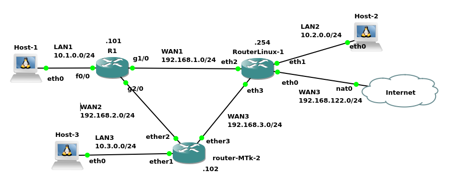

Configuração do RIP no CISCO, MikroTik e Linux com FRR
======================================================

Esse documento apresenta como configurar o protocolo RIP em três tipos de roteadores sendo esses: Cisco, Linux com FRR e MikroTik.

A Figura 1 apresenta a rede heterogênea que simula uma pequena topologia corporativa com múltiplas filiais e acesso à Internet. A rede é composta por: 
* três hosts (computadores);
* três roteadores de diferentes fabricantes (Cisco, Linux com FRR e MikroTik);
* uma conexão de saída para a Internet;


|  |
|:--:|
| Figura 1 - Cenário de rede do Exemplo de configuração dos roteadores utilizando RIP


A comunicação entre as diferentes redes é realizada através do protocolo de roteamento dinâmico **RIP Versão 2**.

### Componentes da Rede

A seguir são apresentadas as configurações e ligações de rede do cenário de exemplo.

#### 1. Redes Locais (LANs) e Hosts

Existem três redes locais, cada uma com um host conectado a um roteador que serve como gateway:

* **LAN1 (`10.1.0.0/24`)**:
    * **Host Conectado**: `Host-1` com o IP `10.1.0.1`.
    * **Gateway**: Roteador `R1` na interface `f0/0`, com o IP `10.1.0.101`.
    * **Configuração**: O `Host-1` é configurado estaticamente para usar o `R1` como sua saída padrão.

* **LAN2 (`10.2.0.0/24`)**:
    * **Host Conectado**: `Host-2` com o IP `10.2.0.2`.
    * **Gateway**: Roteador `RouterLinux-1` na interface `eth1`, com o IP `10.2.0.254`.
    * **Configuração**: O `Host-2` é configurado para usar o `RouterLinux-1` como sua saída padrão.

* **LAN3 (`10.3.0.0/24`)**:
    * **Host Conectado**: `Host-3` com o IP `10.3.0.3`.
    * **Gateway**: Roteador `router-MTk-2` na interface `ether1`, com o IP `10.3.0.102`.
    * **Configuração**: O `Host-3` é configurado para usar o `router-MTk-2` como sua saída padrão.

#### 2. Roteadores e Redes de Interconexão (WANs)

Os três roteadores formam um "triângulo" de conexões para garantir a comunicação entre todas as LANs.

* **R1 (Cisco)**: Conecta a `LAN1` a dois outros roteadores.
    * `f0/0`: IP `10.1.0.101` na rede `LAN1`.*
    * `g1/0`: IP `192.168.1.101` na rede `WAN1`.
    * `g2/0`: IP `192.168.2.101` na rede `WAN2`.

* **RouterLinux-1 (Linux com FRR)**: Conecta a `LAN2`, os outros dois roteadores e a Internet.
    * `eth0`: interface de configuração que obtem IP por DHCP e principalmente é o link de conexão com a Internet.
    * `eth1`: IP `10.2.0.254` na rede `LAN2`.
    * `eth2`: IP `192.168.1.254` na rede `WAN1`.
    * `eth3`: IP `192.168.3.254` na rede `WAN3`.
    
* **router-MTk-2 (MikroTik)**: Conecta a `LAN3` aos outros dois roteadores.
    * `ether1`: IP `10.3.0.102` na rede `LAN3`.
    * `ether2`: IP `192.168.2.102` na rede `WAN2`.
    * `ether3`: IP `192.168.3.102` na rede `WAN3`.

As redes que interligam os roteadores são:
* **WAN1 (`192.168.1.0/24`)**: Liga `R1` e `RouterLinux-1`.
* **WAN2 (`192.168.2.0/24`)**: Liga `R1` e `router-MTk-2`.
* **WAN3 (`192.168.3.0/24`)**: Liga `RouterLinux-1` e `router-MTk-2`.

#### Fluxo de Comunicação e Roteamento (RIPv2)

O protocolo **RIPv2** é o responsável por fazer todos os roteadores aprenderem os caminhos para todas as redes automaticamente.

1.  **Troca de Rotas**: Cada roteador anuncia as redes que conhece diretamente para seus vizinhos. Por exemplo, `R1` anuncia a `LAN1 (10.1.0.0/24)` para `RouterLinux-1` e `router-MTk-2`. Em troca, ele aprende com eles sobre a existência da `LAN2` e `LAN3`.

2.  **Acesso à Internet**: O `RouterLinux-1` está configurado com o comando `default-information originate`. Isso faz com que ele anuncie uma **rota padrão (0.0.0.0/0)** para os outros roteadores via RIP. `R1` e `router-MTk-2` aprendem que, para qualquer destino desconhecido (como um site na internet), o pacote deve ser enviado para o `RouterLinux-1`.

**Exemplo de fluxo de um pacote do `Host-1` para o `Host-2`:**
1.  `Host-1` envia o pacote para seu gateway, `R1` (`10.1.0.101`).
2.  `R1`, através do RIP, sabe que a rede `10.2.0.0/24` (LAN2) é alcançável através do `RouterLinux-1` (IP `192.168.1.254`).
3.  `R1` encaminha o pacote pela sua interface `g1/0` para o `RouterLinux-1`.
4.  `RouterLinux-1` recebe o pacote e o encaminha pela sua interface `eth1` diretamente para o `Host-2`.

# Configuração dos Hosts Linux

Nos hosts Linux (Host-1, Host-2 e Host-3), os comandos configuram a rede de forma básica.

* `ifconfig eth0 <endereço_ip>/24`: Este comando atribui um **endereço IP** e uma **máscara de sub-rede** (`/24` ou `255.255.255.0`) à interface de rede `eth0`.
* `route add default gw <ip_gateway>`: Define o **gateway padrão** (roteador de saída) para o host. Todo tráfego destinado a redes desconhecidas será enviado para este endereço.
* `echo "nameserver 8.8.8.8" > /etc/resolv.conf`: Configura o servidor **DNS** do Google (`8.8.8.8`) para resolver nomes de domínio (como `www.google.com`) em endereços IP. O `>` sobrescreve o conteúdo do arquivo `/etc/resolv.conf` com a nova informação.

A seguir são apresentados os comandos na integra para a configuração de cada host Linux:


* Host-1
```console
root@Host-1:/# ifconfig eth0 10.1.0.1/24
root@Host-1:/# route add default gw 10.1.0.101
root@Host-1:/# echo "nameserver 8.8.8.8" > /etc/resolv.conf 
```

* Host-2
```console
root@Host-3:/# ifconfig eth0 10.3.0.3/24
root@Host-3:/# route add default gw 10.3.0.102
root@Host-3:/# echo "nameserver 8.8.8.8" > /etc/resolv.conf 
```

* Host-3
```console
root@Host-2:/# ifconfig eth0 10.2.0.2/24
root@Host-2:/# route add default gw 10.2.0.254
root@Host-2:/# echo "nameserver 8.8.8.8" > /etc/resolv.conf 
```


# Roteadores

A seguir são apresentadas as configuração de cada um dos roteadores do cenário:

## R1 (CISCO)

Estes são comandos do sistema operacional de roteadores Cisco (IOS) para configurar interfaces e o protocolo de roteamento RIP.

* `enable`: Entra no modo de configuração privilegiado (conhecido como "modo enable").
* `configure terminal`: Entra no modo de configuração global, onde alterações no roteador podem ser feitas.
* `interface <nome_interface>`: Acessa o modo de configuração específico de uma interface (como `f0/0`, `g1/0`).
* `ip address <ip> <máscara>`: Atribui um endereço IP e uma máscara de sub-rede à interface selecionada.
* `no shutdown`: Ativa (liga) a interface. Por padrão, as interfaces de roteadores Cisco vêm desativadas.
* `exit`: Retorna ao modo de configuração anterior.
* `router rip`: Inicia o processo de configuração do protocolo de roteamento **RIP (Routing Information Protocol)**.
* `version 2`: Especifica o uso do RIP Versão 2, que é mais moderno e eficiente que a versão 1.
* `network <endereço_de_rede>`: Informa ao RIP para anunciar (divulgar) as redes diretamente conectadas às suas interfaces.
* `end`: Sai do modo de configuração e retorna ao modo privilegiado.


```console
R1#enable
R1#configure terminal
R1(config)#interface f0/0
R1(config-if)#ip address 10.1.0.101 255.255.255.0
R1(config-if)#no shutdown 
R1(config-if)#interface g1/0
R1(config-if)#ip address 192.168.1.101 255.255.255.0
R1(config-if)#no shutdown 
R1(config-if)#interface g2/0                        
R1(config-if)#ip address 192.168.2.101 255.255.255.0
R1(config-if)#no shutdown                           
R1(config-if)#exit
R1(config)#router rip
R1(config-router)#version 2
R1(config-router)#network 10.1.0.0
R1(config-router)#network 192.168.1.0 
R1(config-router)#network 192.168.2.0
R1(config-router)#end
R1#

```

## RouterLinux01 (Linux com FRR)

Este dispositivo é uma máquina Linux atuando como roteador, utilizando o software FRRouting (FRR) para gerenciar protocolos de roteamento.

### Comandos do Sistema Linux

* `ifconfig <interface> <ip>/<máscara>`: Configura um endereço IP estático e máscara em uma interface de rede.
* `dhcpcd eth0`: Executa um cliente DHCP na interface `eth0` para obter um endereço IP, gateway e DNS automaticamente de um servidor na rede.
* `iptables -t nat -A POSTROUTING -o eth0 -j MASQUERADE`: Cria uma regra de **NAT (Network Address Translation)**. Isso permite que dispositivos de redes internas (como 10.2.0.0/24) acessem a internet "mascarados" com o IP da interface `eth0`.
* `echo 1 > /proc/sys/net/ipv4/ip_forward`: Ativa o encaminhamento de pacotes no kernel do Linux, o que é essencial para que o sistema funcione como um roteador.
* `vi /etc/frr/daemons`: Abre o editor de texto `vi` para editar o arquivo de configuração do FRR, onde se define quais serviços de roteamento (daemons) serão iniciados. No exemplo, `ripd=yes` foi ativado.
* `/etc/init.d/frr start`: Inicia os serviços do FRR configurados no arquivo anterior.


```console
root@RouterLinux-1:/# ifconfig eth1 10.2.0.254/24
root@RouterLinux-1:/# ifconfig eth2 192.168.1.254
root@RouterLinux-1:/# ifconfig eth3 192.168.3.254
root@RouterLinux-1:/# dhcpcd eth0
DUID 00:04:4c:4c:45:44:00:36:32:10:80:34:b3:c0:4f:35:34:32
eth0: IAID fd:2c:2d:00
eth0: rebinding lease of 192.168.122.90
eth0: probing address 192.168.122.90/24
eth0: soliciting an IPv6 router
eth0: leased 192.168.122.90 for 3600 seconds
eth0: adding route to 192.168.122.0/24
eth0: adding default route via 192.168.122.1
forked to background, child pid 29150

```
O `RouterLinux-1` é o **gateway principal da rede para a Internet**. Sua interface `eth0` está na rede `192.168.122.0/24`. O comando `dhcpcd eth0` indica que ele obtém seu IP, gateway e DNS dinamicamente nesta rede, simulando uma conexão com um provedor de Internet. O comando `iptables ... MASQUERADE` ativa o **NAT (Network Address Translation)**. Isso permite que todos os hosts das LANs internas (`10.1.0.0/24`, etc.) naveguem na internet usando o endereço IP da interface `eth0` do `RouterLinux-1`.

```console
root@RouterLinux-1:/# iptables -t nat -A POSTROUTING -o eth0 -j MASQUERADE
root@RouterLinux-1:/# echo 1 > /proc/sys/net/ipv4/ip_forward

```

Editar arquivo de configuração do FRR e habilitar o roteamento por RIP -  isso é feito deixando a o ``ripd`` com o valor ``yes``.


```console
root@RouterLinux-1:/# vi /etc/frr/daemons  
# This file tells the frr package which daemons to start.
...
bgpd=no
ospfd=no
ospf6d=no
ripd=yes
ripngd=no
isisd=no
pimd=no
...
```

Iniciando o serviço do FRR:

```console
root@RouterLinux-1:/# /etc/init.d/frr start
watchfrr[29161]: watchfrr 7.5.1 starting: vty@0
watchfrr[29161]: zebra state -> down : initial connection attempt failed
watchfrr[29161]: ripd state -> down : initial connection attempt failed
watchfrr[29161]: staticd state -> down : initial connection attempt failed
watchfrr[29161]: Forked background command [pid 29162]: /usr/lib/frr/watchfrr.sh restart all
watchfrr[29161]: zebra state -> up : connect succeeded
watchfrr[29161]: ripd state -> up : connect succeeded
watchfrr[29161]: staticd state -> up : connect succeeded
watchfrr[29161]: all daemons up, doing startup-complete notify
Started watchfrr.
```

### Comandos do FRR (vtysh)

O `vtysh` é um shell integrado do FRR que unifica a configuração de vários protocolos e usa uma sintaxe muito similar à da Cisco.

* `vtysh`: Acessa o shell de configuração do FRR.
* `show ip route`: Exibe a **tabela de roteamento** do roteador, mostrando as rotas conhecidas (conectadas, RIP, etc.) e como alcançá-las.
* `default-information originate`: Configura o roteador para anunciar uma **rota padrão** (0.0.0.0/0) para seus vizinhos RIP. Isso é útil para que os outros roteadores saibam como chegar à internet.
* `passive-interface eth1`: Configura a interface `eth1` como "passiva" para o RIP. O roteador ainda anuncia a rede da `eth1`, mas não envia pacotes de atualização RIP através dela.


```console
root@RouterLinux-1:/# vtysh 

Hello, this is FRRouting (version 7.5.1).
Copyright 1996-2005 Kunihiro Ishiguro, et al.

RouterLinux-1# enable
RouterLinux-1# configure terminal
RouterLinux-1(config)# router rip
RouterLinux-1(config-router)# version 2
RouterLinux-1(config-router)# network 10.2.0.0/24
RouterLinux-1(config-router)# network 192.168.1.0/24
RouterLinux-1(config-router)# network 192.168.3.0/24
RouterLinux-1(config-router)# default-information originate 
RouterLinux-1(config-router)# passive-interface eth1
RouterLinux-1(config-router)# end
RouterLinux-1# show ip route
Codes: K - kernel route, C - connected, S - static, R - RIP,
       O - OSPF, I - IS-IS, B - BGP, E - EIGRP, N - NHRP,
       T - Table, v - VNC, V - VNC-Direct, A - Babel, D - SHARP,
       F - PBR, f - OpenFabric,
       > - selected route, * - FIB route, q - queued, r - rejected, b - backup

K>* 0.0.0.0/0 [0/252] via 192.168.122.1, eth0, src 192.168.122.90, 00:01:36
R>* 10.0.0.0/8 [120/2] via 192.168.1.101, eth2, weight 1, 00:00:32
C>* 10.2.0.0/24 is directly connected, eth1, 00:01:36
C>* 192.168.1.0/24 is directly connected, eth2, 00:01:36
R>* 192.168.2.0/24 [120/2] via 192.168.1.101, eth2, weight 1, 00:00:32
C>* 192.168.3.0/24 is directly connected, eth3, 00:01:36
K * 192.168.122.0/24 [0/252] is directly connected, eth0, 00:01:36
C>* 192.168.122.0/24 is directly connected, eth0, 00:01:36
```


## Router-MTK-2 (MikroTik 7.17.1 (stable))

Estes são comandos do sistema RouterOS da MikroTik, também para configurar interfaces e o roteamento RIP.

* `ip address add address=<ip>/<máscara> interface=<interface>`: Atribui um endereço IP a uma interface específica.
* `/routing rip instance add name=RIPv2`: Cria uma "instância" (um processo) do protocolo RIP e a nomeia como "RIPv2".
* `/routing rip interface-template add interfaces=<interface> instance=RIPv2`: Associa uma ou mais interfaces à instância RIP criada, habilitando o protocolo nelas.
* `/routing rip instance set [find name=RIPv2] redistribute=connected`: Configura a instância RIP para redistribuir (anunciar) as rotas das redes que estão diretamente conectadas ao roteador.
* `... print`: O comando `print` é usado em vários contextos (`ip route/ print`, `routing/ rip/ neighbor/ print`, etc.) para **exibir as configurações** atuais ou o status de um serviço, como a tabela de roteamento ou os vizinhos RIP descobertos.

```console

[admin@MikroTik] > ip address add address=10.3.0.102/24 interface=ether1
[admin@MikroTik] > ip address add address=192.168.2.102/24 interface=ether2         
[admin@MikroTik] > ip address add address=192.168.3.102/24 interface=ether3 
```

```console
[admin@MikroTik] > /routing rip instance add name=RIPv2
[admin@MikroTik] > /routing rip interface-template add interfaces=ether1 instance=RIPv2
[admin@MikroTik] > /routing rip interface-template add interfaces=ether2 instance=RIPv2 
[admin@MikroTik] > /routing rip interface-template add interfaces=ether3 instance=RIPv2 
[admin@MikroTik] > /routing rip instance set [find name=RIPv2] redistribute=connected
[admin@MikroTik] > 
```

```console
[admin@MikroTik] > /routing/ rip/ instance/ print
Flags: X - disabled 
 0   name="RIPv2"
```

```console
[admin@MikroTik] > /routing/ rip/ interface-template print
Flags: X - disabled 
 0   instance=RIPv2 interfaces=ether1 

 1   instance=RIPv2 interfaces=ether2 

 2   instance=RIPv2 interfaces=ether3
```

```console
[admin@MikroTik] > routing/ rip/ neighbor/ print 
Flags: D - dynamic 
 0 D instance=RIPv2 address=192.168.2.101%ether2 routes=3 packets-total=9 last-update=7s 

 1 D instance=RIPv2 address=192.168.3.254%ether3 routes=4 packets-total=10 last-update=9s
```

```console
[admin@MikroTik] > ip route/ print 
Flags: D - DYNAMIC; A - ACTIVE; c - CONNECT, r - RIP; + - ECMP
Columns: DST-ADDRESS, GATEWAY, DISTANCE
     DST-ADDRESS     GATEWAY               DISTANCE
DAr  0.0.0.0/0       192.168.3.254%ether3       120
DAr  10.0.0.0/8      192.168.2.101%ether2       120
DAr  10.2.0.0/24     192.168.3.254%ether3       120
DAc  10.3.0.0/24     ether1                       0
DAr+ 192.168.1.0/24  192.168.3.254%ether3       120
DAr+ 192.168.1.0/24  192.168.2.101%ether2       120
DAc  192.168.2.0/24  ether2                       0
D r  192.168.2.0/24  192.168.3.254%ether3       120
DAc  192.168.3.0/24  ether3                       0
D r  192.168.3.0/24  192.168.2.101%ether2       120
```
