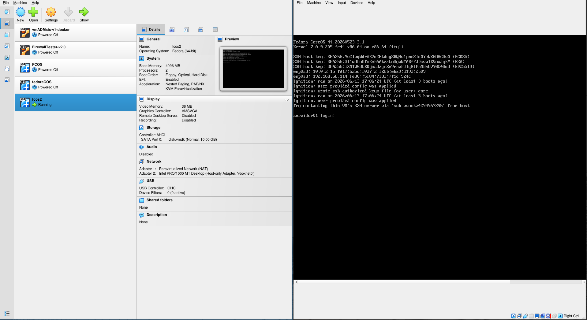

VirtualBox modo texto
=====================

O **VirtualBox** (ou Oracle VM VirtualBox) é um software de **virtualização** de código aberto que permite criar e executar computadores virtuais dentro do seu computador real.

Em termos simples, ele funciona como um "emulador" de PC, permitindo que você instale e utilize múltiplos sistemas operacionais ao mesmo tempo, sem a necessidade de formatar o seu disco rígido ou reiniciar a máquina para alternar entre eles.

O VirtualBox atua como um **Hypervisor do Tipo 2**. Isso significa que ele é um aplicativo instalado diretamente no seu sistema operacional atual (chamado de **Hospedeiro** ou *Host*), como o Windows, Linux ou macOS.

A partir dele, você pode criar uma ou mais **Máquinas Virtuais (VMs)**. Cada VM funciona como um computador isolado e independente (chamado de **Convidado** ou *Guest*), com seu próprio sistema operacional, arquivos e configurações. Para isso, o VirtualBox "pega emprestado" uma parte dos recursos de hardware do seu computador real e os aloca para a máquina virtual. 

## Interface Gráfica

A maioria dos usuários normalmente utilizam a interface gráfica do VirtualBox, pois ela transforma o processo complexo de gerenciar infraestruturas virtuais em uma experiência visual e altamente intuitiva. Tal interface gráfica pode ser vista na figura a seguir.

|  | 
|:--:|
| Figura 1 - Interface gráfica do VirtualBox |

Ao abrir o VirtualBox via interface gráfica, o usuário é recebido por um painel de controle centralizado (lado esquerdo da Figura 1) que organiza todas as máquinas virtuais em uma lista lateral, exibindo o status de cada uma em tempo real ao lado de um resumo detalhado de seu hardware. Ao iniciar uma VM essa aparece normalmente em uma tela, na qual o usuário pode utilizar a VM (lado direito da Figura 1). 

É claro que tal interface gráfica facilita muito a interação com o ambiente de virtualização e suas VMs, todavia administradores de rede, podem as vezes precisar de uma interação texto, ou seja, sem interface gráfica e o texto a seguir apresenta como isso é feito no VirtualBox.

## Interface Texto (comandos)

Embora a interface gráfica seja a escolha mais popular, o VirtualBox possui uma interface de linha de comando extremamente poderosa chamada **VBoxManage**. À primeira vista, interagir com o software por meio de uma tela preta e comandos de texto pode parecer intimidador ou excessivamente complexo para quem está acostumado com cliques e menus visuais. No entanto, uma vez superada a curva de aprendizado inicial, o modo texto revela-se uma ferramenta muito mais eficiente e recomendável para determinados cenários práticos, tal como administração de várias VMs em um sistema mais complexos.

Uma das principais situações em que a interface de texto se sobressai é a **automação**. Imagine a necessidade de criar, configurar e iniciar dez máquinas virtuais idênticas para suprir as necessidades de um sistema maior. No modo gráfico, isso exigiria repetir o mesmo processo manual e repetitivo dez vezes no assistente visual. Com o `VBoxManage`, basta desenvolver um _script_ curto contendo os comandos de criação e executá-lo no terminal. Em poucos segundos, todo o ambiente é estruturado de forma idêntica e sem margem para erros humanos.

Outro cenário onde o modo texto se torna indispensável é na **administração remota e operação de servidores _headless_** (sistemas sem interface gráfica instalada). Quando o VirtualBox é instalado em um servidor dedicado ou em uma máquina hospedada em nuvem, não há um ambiente de _desktop_ para abrir a interface visual. Nesse contexto, a linha de comando permite que o administrador acesse o servidor remotamente (por exemplo, via SSH) de qualquer lugar do mundo e gerencie as máquinas virtuais — alterando memória, anexando discos ou modificando placas de rede — consumindo o mínimo de largura de banda e sem desperdiçar os preciosos recursos de hardware do servidor com processamento gráfico desnecessário.

Assim, a linha de comando do VirtualBox é operada pelo utilitário principal **`VBoxManage`**. Para gerenciar o ambiente sem interface gráfica, o dia a dia de um administrador gira em torno de um conjunto essencial de comandos que cobrem desde o ciclo de vida da máquina virtual até as configurações de hardware e controle de estado. A seguir estão as principais funções, comandos e opções mais utilizados no modo texto.

### 1. Gerenciamento de VM

As tarefas mais comuns no gerenciamento de máquinas virtuais incluem listar as VMs disponíveis, verificar quais estão em execução, iniciar, desligar e controlar seu estado de execução. 

O utilitário `VBoxManage` disponibiliza comandos simples e intuitivos para realizar essas operações diretamente pela linha de comando. Tais comandos são apresentados a seguir:

* `VBoxManage list vms`: **lista todas as máquinas virtuais** registradas no VirtualBox. Este comando é útil para identificar os nomes das VMs disponíveis no ambiente, os quais serão utilizados em outros comandos administrativos. Caso sejam necessários mais detalhes sobre cada máquina virtual, pode-se utilizar a opção `--long`.

* `VBoxManage list runningvms`: **exibe apenas as máquinas virtuais** que se encontram **em execução no momento**. Esse comando é especialmente útil para verificar rapidamente quais VMs estão consumindo recursos do host.

* `VBoxManage startvm "Nome_da_VM" --type headless`: **inicia uma máquina virtual** sem abrir a interface gráfica do VirtualBox. A opção `--type headless` é amplamente utilizada em servidores, nos quais não há necessidade de interação direta com o console da VM, sem essa opção o VirtualBox vai iniciar a VM em uma janela tal como ocorre normalmente na interface gráfica.

* `VBoxManage controlvm "Nome_da_VM" poweroff`: realiza o desligamento imediato da máquina virtual, de forma semelhante ao **desligamento forçado** de um computador físico. Esse comando deve ser utilizado com cautela, pois **pode ocasionar perda de dados** não salvos dentro do sistema operacional convidado.

* `VBoxManage controlvm "Nome_da_VM" acpipowerbutton`: **envia um evento ACPI para a máquina virtual, simulando o acionamento do botão de energia** de um computador físico. Quando o sistema operacional convidado oferece suporte a ACPI, o desligamento ocorre de maneira controlada e segura, **permitindo o encerramento adequado** dos serviços e processos em execução.

* `VBoxManage controlvm "Nome_da_VM" pause`: **suspende** temporariamente a execução da máquina virtual, preservando seu estado atual na memória. Essa funcionalidade pode ser utilizada para interromper momentaneamente uma atividade sem a necessidade de desligar o sistema operacional convidado.

* `VBoxManage controlvm "Nome_da_VM" resume`: **retoma a execução de uma máquina virtual previamente pausada**, permitindo que o sistema continue operando exatamente do ponto em que foi interrompido.

Em conjunto, esses comandos fornecem os recursos essenciais para a administração cotidiana de máquinas virtuais por meio da linha de comando. O uso do `VBoxManage` possibilita automatizar tarefas de gerenciamento, integrar o controle de VMs a _scripts_ e reduzir a dependência da interface gráfica do VirtualBox, tornando-se uma ferramenta especialmente útil em ambientes de laboratório, servidores e infraestruturas de testes.

### 2. Criação e Configuração de Hardware (`createvm` e `modifyvm`)

A criação e configuração de máquinas virtuais pode ser realizada inteiramente pela linha de comando. Os comandos a seguir permitem criar VMs, ajustar recursos computacionais e configurar dispositivos de hardware:

* `VBoxManage createvm --name "Nome_da_VM" --ostype Linux_64 --register`: **cria uma nova máquina virtual** e a registra no VirtualBox. A opção `--ostype` define o tipo de sistema operacional convidado, permitindo que o VirtualBox utilize configurações apropriadas para a VM.

* `VBoxManage modifyvm "Nome_da_VM" --memory 2048 --cpus 2`: **define a quantidade de memória** RAM (em MB) e o número de processadores virtuais disponibilizados para a máquina virtual. Esses são os parâmetros de hardware mais frequentemente ajustados após a criação da VM.

* `VBoxManage modifyvm "Nome_da_VM" --vram 128`: **altera a quantidade de memória de vídeo** disponível para o sistema convidado, sendo especialmente útil para sistemas com interface gráfica.

* `VBoxManage modifyvm "Nome_da_VM" --nic1 nat`: **configura a primeira interface de rede da VM para operar em modo NAT**. Nesse modo, a máquina virtual tem acesso à rede externa por meio do hospedeiro, sem ser diretamente acessível por outros equipamentos da rede local.

* `VBoxManage modifyvm "Nome_da_VM" --nic1 bridged --bridgeadapter1 eth0`: **configura a primeira interface de rede em modo Bridge**. Nesse modo, a VM se comporta como um equipamento independente na rede física, recebendo seu próprio endereço IP.

* `VBoxManage modifyvm "Nome_da_VM" --nic1 hostonly --hostonlyadapter1 vboxnet0`: **conecta a máquina virtual a uma rede Host-Only**, permitindo comunicação apenas entre o hospedeiro e as VMs participantes dessa rede.

* `VBoxManage modifyvm "Nome_da_VM" --boot1 dvd --boot2 disk`: **define a ordem de inicialização dos dispositivos**. No exemplo, a VM tentará iniciar primeiro pela unidade de DVD virtual e, caso não encontre mídia inicializável, utilizará o disco rígido virtual.

* `VBoxManage modifyvm "Nome_da_VM" --clipboard-mode bidirectional`: **habilita o compartilhamento bidirecional** da área de transferência entre hospedeiro e convidado, desde que as Guest Additions estejam instaladas.


### 3. Manipulação de Discos e Mídias (`storagectl`, `storageattach` e `createmedium`)

Após criar uma máquina virtual, normalmente é necessário adicionar controladores de armazenamento, discos rígidos virtuais e mídias de instalação. Para isso temos as seguintes opções:

* `VBoxManage storagectl "Nome_da_VM" --name "SATA Controller" --add sata`: **cria um controlador SATA** na máquina virtual. Antes de anexar discos ou imagens ISO, geralmente é necessário que exista um controlador de armazenamento configurado.

* `VBoxManage createmedium disk --filename /caminho/disco.vdi --size 20480`: **cria um disco rígido virtual** no formato VDI. O parâmetro `--size` especifica o tamanho do disco em megabytes. No exemplo, será criado um disco de aproximadamente 20 GB.

* `VBoxManage storageattach "Nome_da_VM" --storagectl "SATA Controller" --port 0 --device 0 --type hdd --medium /caminho/disco.vdi`: **anexa um disco rígido** virtual ao controlador SATA da máquina virtual.

* `VBoxManage storageattach "Nome_da_VM" --storagectl "SATA Controller" --port 1 --device 0 --type dvddrive --medium /caminho/sistema.iso`: **associa uma imagem ISO à unidade de DVD** virtual da máquina. Esse procedimento é utilizado para instalar sistemas operacionais ou inicializar ambientes de recuperação.

* `VBoxManage storageattach "Nome_da_VM" --storagectl "SATA Controller" --port 1 --device 0 --type dvddrive --medium none`: **remove uma mídia ISO** previamente conectada à unidade de DVD virtual.

### 4. Importação e Remoção de Máquinas Virtuais

Além da criação manual de máquinas virtuais, é comum utilizar modelos previamente preparados e distribuídos em formato OVA. Então tais arquivos OVA, são VMs já configuradas e prontas para utilizar. Para trabalhar via linha de comando os essas imagens podemos utilizar:

* `VBoxManage import appliance.ova`: **importa uma máquina virtual** ou conjunto de máquinas empacotadas em um arquivo OVA (Open Virtual Appliance). Esse formato é amplamente utilizado para distribuição de laboratórios, appliances e ambientes pré-configurados.

* `VBoxManage unregistervm "Nome_da_VM"`: **remove** o registro da máquina virtual do VirtualBox, mas **mantém seus arquivos armazenados no disco**.

* `VBoxManage unregistervm "Nome_da_VM" --delete`: **remove a máquina virtual e exclui todos os seus arquivos** associados, incluindo discos virtuais e _snapshots_.

## 5. Provisionamento e Injeção de Configurações

Em ambientes automatizados, frequentemente é necessário fornecer configurações iniciais para as máquinas virtuais durante o processo de criação ou primeiro _boot_. Assim, neste tipo de cenário o VirtualBox fornece os seguintes comandos:

* `VBoxManage guestproperty set "Nome_da_VM" chave valor`: **cria propriedades associadas à máquina virtual**. Essas propriedades podem ser consultadas posteriormente por _scripts_ de automação ou pelo sistema operacional convidado.

* `VBoxManage guestcontrol "Nome_da_VM" copyto arquivo.txt /destino/arquivo.txt --username usuario`: **copia arquivos do hospedeiro para o sistema convidado**, desde que as Guest Additions estejam instaladas e exista acesso autenticado ao sistema operacional da VM.

* `VBoxManage guestcontrol "Nome_da_VM" run --exe /bin/bash --username usuario`: **permite executar comandos diretamente dentro do sistema operacional convidado**. Esse recurso é útil para automatizar configurações após a instalação do sistema.

* `VBoxManage setextradata "Nome_da_VM" "chave" "valor"`: **armazena metadados personalizados associados à VM**. Em cenários de automação, esses dados podem ser utilizados para informar parâmetros de configuração durante o provisionamento.

Embora o VirtualBox não possua um mecanismo nativo equivalente ao Ignition do Fedora CoreOS, a combinação de propriedades da VM, metadados personalizados, compartilhamento de arquivos e execução remota de comandos permite implementar estratégias semelhantes de provisionamento automatizado.

### 6. Criação de Clones e Snapshots

Os recursos de clonagem e _snapshots_ são extremamente úteis para laboratórios, ambientes de teste e atividades de ensino, permitindo retornar rapidamente a estados conhecidos do sistema. Para essas tarefas as opções são:

* `VBoxManage snapshot "Nome_da_VM" take "Nome_do_Snapshot"`: **cria um _snapshot_ contendo o estado atual da máquina virtual**. Esse recurso é frequentemente utilizado antes de alterações críticas ou experimentos que possam comprometer o sistema.

* `VBoxManage snapshot "Nome_da_VM" restore "Nome_do_Snapshot"`: **restaura** a máquina virtual para o estado armazenado em um _snapshot_ previamente criado.

* `VBoxManage snapshot "Nome_da_VM" list`: **exibe todos os _snapshots_** existentes para a máquina virtual.

* `VBoxManage clonevm "VM_Original" --name "Nova_VM_Clonada" --register`: **cria uma cópia completa e independente da máquina virtual**, incluindo suas configurações e discos virtuais.

* `VBoxManage clonevm "VM_Original" --name "Nova_VM_Clonada" --register --mode machineandchildren`: **cria uma cópia da VM juntamente com todos os _snapshots_ associados**.

Os comandos apresentados nesta seção permitem administrar todo o ciclo de vida de uma máquina virtual diretamente pela linha de comando, desde sua criação até sua remoção. A possibilidade de automatizar a configuração de hardware, armazenamento, rede, provisionamento e recuperação de estado torna o `VBoxManage` uma ferramenta extremamente valiosa para ambientes de laboratório, ensino, testes e integração contínua, reduzindo a necessidade de interação manual com a interface gráfica do VirtualBox e favorecendo a reprodutibilidade dos ambientes virtuais.

Gerenciar o VirtualBox pelo terminal no Linux oferece uma infinidade de opções e subcomandos. Embora a ferramenta seja vasta, a melhor forma de compreendê-la é observando o fluxo de tarefas cotidianas de um administrador de sistemas.


## Exemplos de comandos para tarefas comuns no VirtualBox

A seguir, apresentamos um guia prático com os principais comandos do `VBoxManage`, estruturados na ordem ideal de configuração e execução de um ambiente virtual.


### 1. Criar uma interface de rede Host-Only (`vboxnet0`)

Diferente dos modos NAT ou Bridge, a rede *Host-Only* (Apenas Hospedeiro) serve para criar uma rede privada e isolada entre o seu sistema real (Linux hospedeiro) e as máquinas virtuais. As VMs conseguem conversar entre si e com o seu computador, mas ficam totalmente isoladas da internet externa. Como essa interface normalmente não vem criada por padrão no VirtualBox, precisamos gerá-la antes de associá-la a qualquer máquina.

```bash
VBoxManage hostonlyif create

```

* **`hostonlyif create`**: Instancia uma nova interface de rede virtual do tipo *Host-Only* no sistema hospedeiro. Por padrão, se for a primeira, o Linux a nomeará como `vboxnet0`.

Com isso, uma nova placa de rede virtual e invisível foi adicionada ao seu Linux para interconectar seus laboratórios com total segurança.

### 2. Criar uma VM a partir de um arquivo OVA

Arquivos com a extensão `.ova` são pacotes que contêm uma máquina virtual pré-configurada e pronta para uso (uma *appliance*). Em vez de criar uma VM do zero e instalar o sistema operacional manualmente, nós importamos esse arquivo para o VirtualBox via linha de comando.

```bash
VBoxManage import /caminho/para/sua_maquina.ova --vsys 0 --vmname "MinhaVM_Lab"

```

* **`import`**: Comando principal para extrair e registrar o pacote OVA no VirtualBox.
* **`--vsys 0`**: Aponta para a primeira especificação de máquina virtual contida dentro do arquivo OVA.
* **`--vmname "MinhaVM_Lab"`**: Define explicitamente o nome que a máquina virtual terá no seu sistema após a importação.

Após a execução, o disco rígido virtual será extraído e a VM estará registrada e visível no seu ambiente.


### 3. Alterar a VM para utilizar a interface `vboxnet0`

Por padrão, a VM importada pode vir configurada com um modo de rede genérico (como NAT). Para que ela faça parte da rede isolada que criamos no primeiro passo, precisamos modificar as propriedades da sua primeira placa de rede virtual (`nic1`).

```bash
VBoxManage modifyvm "MinhaVM_Lab" --nic1 hostonly --hostonlyadapter1 vboxnet0

```

* **`modifyvm "MinhaVM_Lab"`**: Entra no modo de edição das propriedades de hardware da VM especificada.
* **`--nic1 hostonly`**: Altera o modo de operação da placa de rede número 1 para *Host-Only*.
* **`--hostonlyadapter1 vboxnet0`**: Vincula especificamente essa placa de rede à interface `vboxnet0` que criamos anteriormente.

Agora, a sua máquina virtual está conectada ao switch virtual privado e seguro do seu hospedeiro.

### 4. Iniciar a VM criada

Com a máquina devidamente importada e com a rede configurada, o próximo passo lógico é dar o _boot_ no sistema operacional virtual.

```bash
VBoxManage startvm "MinhaVM_Lab"

```

* **`startvm`**: Comanda o VirtualBox a ligar a máquina virtual. Por padrão (em ambientes _desktop_), este comando abrirá uma janela separada mostrando a tela da VM.

O sistema virtualizado começará o seu processo de _boot_ imediatamente na tela.

### 5. Listar todas as VMs no sistema

Para certificar-se de quais máquinas virtuais estão registradas no seu ambiente (estejam elas ligadas ou desligadas), utilizamos o comando de listagem geral.

```bash
VBoxManage list vms

```

* **`list vms`**: Varre o registro do VirtualBox e exibe uma lista contendo o nome de todas as VMs e seus respectivos identificadores únicos (UUIDs).

Esse comando é excelente para obter o nome exato das máquinas que você precisa gerenciar.

### 6. Listar informações a respeito de uma VM específica

Se você precisar inspecionar detalhes técnicos profundos de uma máquina — como a quantidade exata de memória RAM, caminhos dos discos rígidos ou detalhes de rede —, você deve solicitar o inventário daquela VM.

```bash
VBoxManage showvminfo "MinhaVM_Lab"

```

* **`showvminfo`**: Exibe na tela um relatório completo e detalhado com todas as configurações de hardware e estado atual da VM informada.

Essa listagem minuciosa é ideal para auditorias de configuração e *troubleshooting*.

### 7. Pausar a VM criada

Se você precisa liberar processamento no seu computador real temporariamente, mas não quer desligar a VM e perder o que estava fazendo, você pode congelar a execução dela.

```bash
VBoxManage controlvm "MinhaVM_Lab" pause

```

* **`controlvm "MinhaVM_Lab"`**: Comando utilizado para mudar o estado de uma VM que já está em execução.
* **`pause`**: Congela temporariamente a CPU da máquina virtual, mantendo o estado atual dela na memória RAM do hospedeiro.

A máquina entrará em estado de hibernação temporária, liberando os núcleos de processamento do seu processador real.

### 8. Voltar a VM do pause (Resumir)

Para retomar o trabalho exatamente de onde parou na máquina congelada, basta reativar o agendamento da CPU virtual.

```bash
VBoxManage controlvm "MinhaVM_Lab" resume

```

* **`resume`**: Descongela a máquina virtual que estava pausada, fazendo-a voltar a responder instantaneamente.

A VM retoma suas atividades normais no exato milissegundo em que foi pausada.

### 9. Enviar um sinal de desligar (ACPI)

Desligar uma máquina virtual puxando-a "da tomada" pode corromper arquivos. O método mais seguro e elegante é enviar um sinal para que o próprio sistema operacional convidado faça seu processo de *shutdown* interno.

```bash
VBoxManage controlvm "MinhaVM_Lab" acpipowerbutton

```

* **`acpipowerbutton`**: Simula o ato físico de pressionar o botão de ligar/desligar do gabinete do computador. O sistema operacional da VM detecta o sinal ACPI e inicia o encerramento seguro dos serviços.

Este comando garante a integridade dos dados e um desligamento limpo dos sistemas operacionais modernos.

### 10. Ligar a VM no modo Headless (Sem abrir janela)

Em servidores ou quando estamos administrando o ambiente puramente via SSH, não queremos (ou não podemos) abrir uma janela gráfica para a VM. O modo *headless* roda a máquina inteiramente em segundo plano.

```bash
VBoxManage startvm "MinhaVM_Lab" --type headless

```

* **`startvm "MinhaVM_Lab"`**: Solicita a inicialização da máquina virtual.
* **`--type headless`**: Modifica o tipo de execução para "sem cabeça", instruindo o VirtualBox a ocultar qualquer interface gráfica e rodar a VM estritamente como um processo de plano de fundo.

A máquina virtual passará a rodar silenciosamente, ideal para servidores de serviços ou _firewalls_ de laboratório.

### 11. Reiniciar a VM

Caso precise aplicar alguma alteração ou reiniciar o sistema operacional virtual diretamente pelo terminal hospedeiro, podemos enviar um comando de reinicialização de hardware.

```bash
VBoxManage controlvm "MinhaVM_Lab" reset

```

* **`reset`**: Equivale a pressionar o botão "_Reset_" físico de um computador. Ele força a reinicialização imediata do hardware virtualizado.

A VM será reiniciada na hora, útil quando o sistema convidado deixa de responder.

### 12. Desligar a VM (Forçado)

Se o sistema operacional da máquina virtual travar completamente e não responder ao sinal amigável do botão ACPI, resta a opção de cortar a energia virtual do sistema.

```bash
VBoxManage controlvm "MinhaVM_Lab" poweroff

```

* **`poweroff`**: Corta instantaneamente a alimentação elétrica da máquina virtual. Equivale a puxar o cabo de energia do computador da tomada.

A máquina virtual será interrompida imediatamente, finalizando o ciclo de gerenciamento do laboratório.

### 13. Injetando um arquivo de configuração para o primeiro boot da VM

Em cenários de automação, pode ser necessário fornecer informações de configuração para uma máquina virtual antes de sua primeira inicialização. O comando a seguir utiliza o mecanismo de *Guest Properties* do VirtualBox para armazenar o conteúdo de um arquivo na propriedade `/Ignition/Config` da VM. Em ambientes Fedora CoreOS, essa técnica pode ser utilizada para disponibilizar um arquivo Ignition contendo configurações iniciais do sistema. Tal como:

```bash
VBoxManage guestproperty set "FCOS-Master" "/Ignition/Config" "$(cat master.ign)"
```

Nesse exemplo, o conteúdo do arquivo `master.ign` é lido pelo comando `cat` e armazenado na propriedade `/Ignition/Config` da máquina virtual `FCOS-Master`.

Embora o VirtualBox não possua um mecanismo nativo equivalente aos serviços de metadados encontrados em provedores de nuvem, o uso de *Guest Properties* permite associar informações de configuração à VM e integrá-las a processos automatizados de provisionamento. Essa abordagem é particularmente útil em laboratórios e ambientes de teste que utilizam Fedora CoreOS e Ignition para configuração automática no primeiro _boot_.

Segue uma versão expandida e mais didática para o capítulo.

## Exemplo de criação, alteração, injeção e acesso a uma VM via linha de comando

Para ilustrar a utilização do VirtualBox por meio da linha de comando, será apresentado um exemplo completo de provisionamento de uma máquina virtual [Fedora CoreOS (FCOS)](https://fedoraproject.org/coreos/download/). Nesse exemplo, inicialmente será realizado o download da imagem OVA disponibilizada pelo projeto Fedora CoreOS. As imagens oficiais podem ser obtidas na página de downloads do Fedora CoreOS, selecionando a plataforma VirtualBox, ou clicando aqui [FCOS download](<https://builds.coreos.fedoraproject.org/prod/streams/stable/builds/44.20260523.3.1/x86_64/fedora-coreos-44.20260523.3.1-vmware.x86_64.ova>).

Após o download, a máquina virtual será importada para o VirtualBox, configurada para utilizar uma interface de rede Host-Only, receberá um arquivo Ignition contendo suas configurações iniciais, será iniciada em modo *headless* (sem interface gráfica) e, por fim, será acessada remotamente via SSH.

> Não é intenção desse texto explicar o arquivo Ignition do Fedora CoreOS, para isso procure por Fedora CoreOS em mecanismos de busca ou IA.

Para simplificar os comandos e evitar erros de digitação, serão utilizadas variáveis de ambiente para armazenar o nome da máquina virtual e o nome do arquivo Ignition.

```bash
VM="FCOS-Master"
OVA="fedora-coreos.ova"
IGNITION="master.ign"

VBoxManage import "$OVA" --vsys 0 --vmname "$VM"

VBoxManage modifyvm "$VM" --nic2 hostonly --hostonlyadapter2 vboxnet0

VBoxManage guestproperty set "$VM" "/Ignition/Config" "$(cat "$IGNITION")"

VBoxManage startvm "$VM" --type headless

VBoxManage showvminfo "$VM"

ssh core@IP_DA_VM
```

Inicialmente são definidas três variáveis de ambiente: o nome da máquina virtual (`VM`), o nome do arquivo OVA (`OVA`) e o arquivo Ignition (`IGNITION`). Em seguida, o comando `import` registra a imagem OVA no VirtualBox, criando a máquina virtual.

Após a importação, são realizadas algumas personalizações. A primeira consiste na adição de uma interface de rede Host-Only, permitindo a comunicação direta entre o hospedeiro e a máquina virtual. 

O próximo passo consiste em armazenar o conteúdo do arquivo Ignition na propriedade `/Ignition/Config` da máquina virtual. Esse arquivo será utilizado durante o primeiro _boot_ para automatizar configurações como criação de usuários, instalação de chaves SSH, configuração de serviços e outras customizações do Fedora CoreOS.

Após a inicialização da VM em modo *headless*, o comando `showvminfo` permite listar todas as propriedades conhecidas pelo VirtualBox. 

> Há uma grande chance do comando `VBoxManage showvminfo "$VM"`, não informar o IP do da VM, neste casos algumas opções são:
> 1. Ligar a VM sem o `--type headless` na primeira vez, ver o IP (se ele aparecer na janela de console) - provavelmente neste exemplo essa á a técnica mais fácil e garantida, pois o FOCS apresenta o IP na tela de _login_;
> 2. Executar um `nmap` na rede do VirtualBox, tal como `nmap -sP 192.168.56.0/24` e ver o IP novo que vai aparecer nesta listagem (para isso você tem que ter feito essa listagem antes de ligar a VM para saber o que tinha lá antes e ver o que apareceu de novo);
> 3. Se não houver outra VM que execute o SSH - em nosso exemplo a VM executa o SSH, ainda com `nmap` é possível verificar qual IP tem essa porta na rede do VirtualBox, tal como `nmap -p 22 192.168.1.0/24`.

Por fim, após identificar o endereço IP da VM (apresentada no comando anterior - o usuário tem que localizar um IP, tal como 192.168.56.101), o acesso remoto pode ser realizado utilizando o protocolo SSH, normalmente por meio do usuário padrão `core`, cuja autenticação deve ter sido previamente configurada no arquivo Ignition.

Esse exemplo demonstra como todo o ciclo de provisionamento de uma máquina virtual Fedora CoreOS pode ser automatizado utilizando apenas comandos de linha de comando. A combinação de importação de imagens OVA, configuração de hardware e rede, injeção de arquivos Ignition e acesso remoto via SSH permite criar ambientes reproduzíveis e facilmente automatizáveis, característica particularmente útil em laboratórios de ensino, ambientes de desenvolvimento, testes de infraestrutura e cenários de computação em nuvem.


## Conclusão

Diante de tudo o que foi exposto, fica evidente que o VirtualBox oferece o melhor de dois mundos ao disponibilizar abordagens tão distintas para o gerenciamento da virtualização. A interface gráfica desempenha um papel fundamental e insubstituível, especialmente no quesito acessibilidade. Ela democratiza a tecnologia, permitindo que estudantes, entusiastas e profissionais visualizem o comportamento do hardware, criem laboratórios rapidamente com poucos cliques e interajam com os sistemas operacionais de forma confortável e integrada ao dia a dia.

Por outro lado, o domínio da interface de linha de comando por meio do `VBoxManage` revela-se um divisor de águas quando o objetivo exige eficiência e escala. Para tarefas que envolvem automação massiva, criação de laboratórios complexos e repetitivos, ou a administração de servidores remotos que operam sem interface visual, o uso de comandos deixa de ser apenas uma alternativa e passa a ser uma competência essencial. A capacidade de condensar o provisionamento de toda uma infraestrutura de rede em um script curto economiza tempo, elimina erros manuais e poupa recursos preciosos de hardware.

Em última análise, as duas interfaces não se excluem, mas se complementam perfeitamente. Enquanto a interface gráfica é ideal para o design inicial, testes rápidos e interações visuais, o modo texto entrega o poder técnico necessário para automatizar e escalar projetos. Compreender quando aplicar cada uma dessas abordagens é o que transforma o VirtualBox em uma ferramenta ainda mais flexível, robusta e indispensável para qualquer profissional de tecnologia.

# Referências

* ORACLE. Oracle VM VirtualBox User Manual. Disponível em: <https://www.virtualbox.org/manual/>. Acesso em: 20 jun. 2026.

* ORACLE. VirtualBox Documentation – VBoxManage. Disponível em: <https://www.virtualbox.org/manual/ch08.html>. Acesso em: 20 jun. 2026.

* STALLINGS, William. *Operating Systems: Internals and Design Principles*. 9. ed. Boston: Pearson, 2018.

* COREOS. Ignition Documentation. Disponível em: <https://coreos.github.io/ignition/>. Acesso em: 20 jun. 2026.

* FEDORA PROJECT. Fedora CoreOS Documentation. Disponível em: <https://docs.fedoraproject.org/en-US/fedora-coreos/>. Acesso em: 20 jun. 2026.

* FEDORA PROJECT. Fedora CoreOS Downloads. Disponível em: <https://fedoraproject.org/coreos/download/>. Acesso em: 20 jun. 2026.
