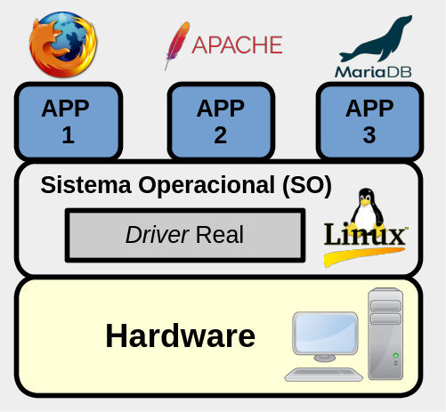
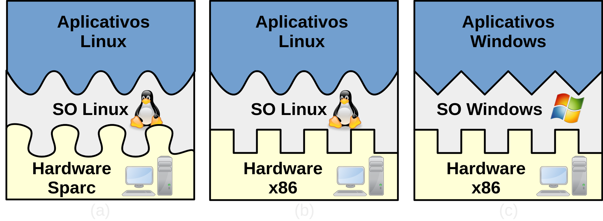
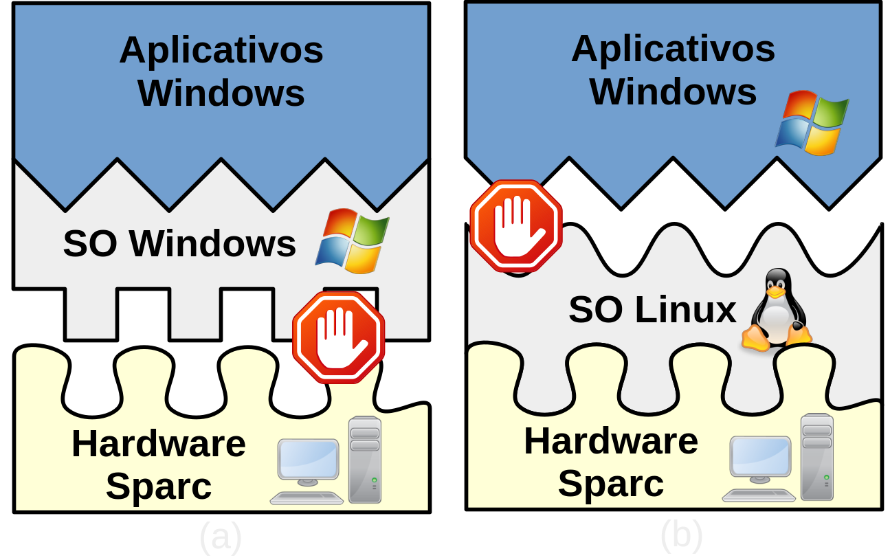
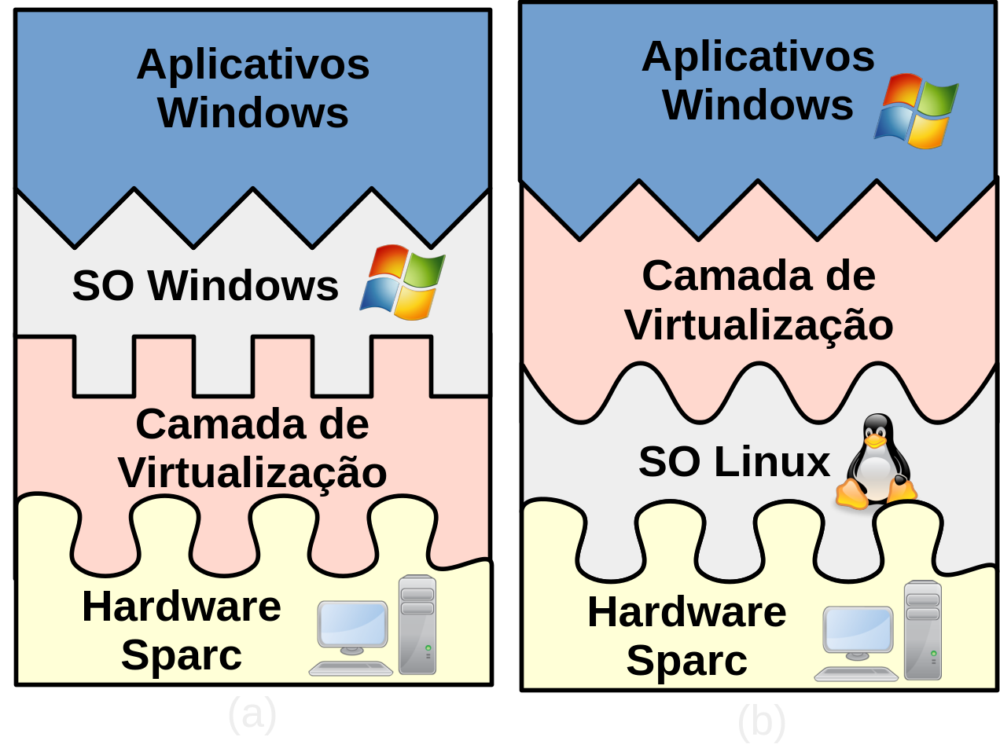
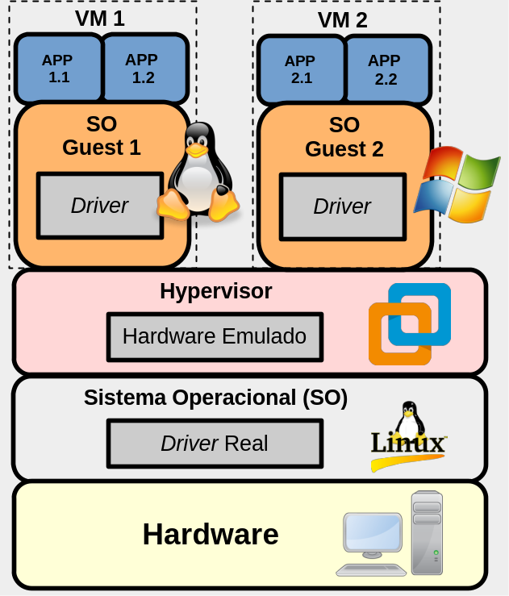
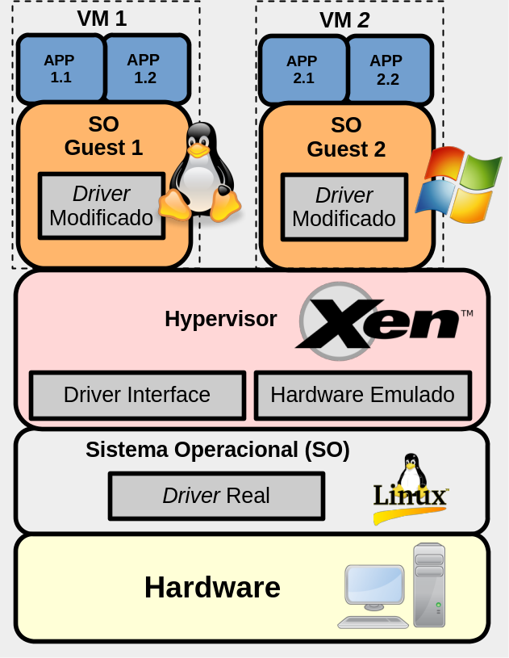
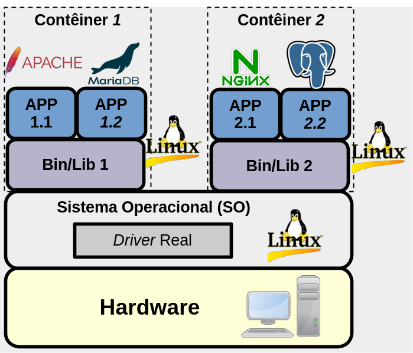

Virtualização
=============

No contexto da informática, a virtualização tem ganhado grande notoriedade ao longo das últimas décadas. Isso se deve ao fato da virtualização trazer muitos benefícios, tais como: 
* A facilidade de executar de forma isolada vários sistemas operacionais, dentro de um único computador físico; 
* Executar sistemas criados para determinado hardware/sistema operacional em outro sistema distinto e até mesmo incompatível; 
* Permitir a fácil migração de sistemas de um hardware de computador para outro, com um simples copiar de arquivo. Isso facilita, por exemplo, o gerenciamento de *datacenters* e ajuda na criação do conceito de nuvem (*cloud computer*).

Ao longo do tempo, a virtualização utilizou e ainda utiliza de várias técnicas, o que pode gerar alguma confusão na hora de definir o que é virtualização. Assim, a seguir, são apresentadas algumas definições para virtualização:  

* Segundo HUMBLE (2016), virtual significa algo que não é real, já na computação, virtual significa um ambiente de hardware que não é real. Assim, neste contexto da computação, a virtualização pode ser por exemplo, a execução de algum software em um hardware que é na verdade é um software fingindo ser um hardware.

* Já CHAGANTI (2007), define virtualização como a técnica de dividir recursos de um único servidor em múltiplos ambientes segregados. Desta forma, cada ambiente virtualizado pode ser executado independente dos outros ambientes. Assim é possível, por exemplo, que cada um desses ambientes execute um sistema operacional diferente.

* Conforme  WILLIANS(2007), virtualização é um *framework* ou metodologia para divisão de recursos do hardware do computador para múltiplos 
ambientes de execução. Isso é feito aplicando-se uma ou mais técnicas de particionamento de hardware e software, compartilhamento de tempo (*time-sharing*), simulação parcial ou completa da máquina, emulação, qualidade de serviço e muitas outras técnicas.

Então, resumidamente, a virtualização permite executar vários sistemas em um mesmo hardware, todavia cada um desses sistemas virtualizados terão a percepção que eles estão em um computador dedicado só para ele, só que isso não é necessariamente verdade.

## História

O conceito de virtualização não é novo, vem da década de 1960 e surgiu basicamente do conceito de compartilhamento de tempo (*time sharing*) e multiprogração. 
> Sim, *time sharing* e multiprogramação podem ser consideradas técnicas de virtualização, já que gerenciam o hardware sendo compartilhado entre vários processos, todavia são técnicas tão comuns, que as pessoas nem relacionam com virtualização, mas veja a definição anterior, de WILLIANS(2007).

Assim, em 1962, o [computador Atlas](https://www.chilton-computing.org.uk/acl/technology/atlas/p019.htm) apresentou melhoras de desempenho devido a separação de algumas operações do Sistema Operacional em um componente chamado **supervisor**. No Atlas, o *supervisor* gerenciava os recursos principais do computador para aprovisionar e gerenciar o ambiente computacional requeridos pelas chamadas de sistema dos programas de usuário. Desta forma, com o **supervisor** do Atlas, surge o **_hypervisor_** ou **_Virtual Machine Monitor_ (VMM)**, que são técnicas/termos utilizados na virtualização até hoje em dia. 

Já na metade da década de 1960, o [projeto M44/44X](https://dl.acm.org/doi/pdf/10.1145/1465482.1465581) da IBM, que utiliza arquitetura similar à do Atlas, foi o primeiro a utilizar o termo **_Virtual Machine_** **(VM)**, neste projeto foi utilizado o computador IBM 7044(M44) para executar VMs chamadas 44X, dai o nome M44/44X.

> Este texto irá constantemente utilizar a sigla **VM (Virtual Machine)** se referindo ao sistema que está sendo virtualizado.

Bem, para entender melhor a virtualização, é necessário saber **como funciona o básico de um sistema computacional sem a virtualização**, isso é apresentado a seguir e posteriormente são explicados alguns tipos de virtualização.

## Computador/sistema sem virtualização

Minimamente, um computador moderno é formado de: 
* Hardware; 
* Sistema Operacional (SO);
* e Softwares - também chamados de programas, aplicações, aplicativos (APP) - esses em execução são chamados de processos.

<!-- 
A Figura 1, ilustra minimamente as camadas de um computador moderno, sem virtualização. Basicamente, qualquer sistema atual, possui um Sistema Operacional que serve para gerenciar hardwares e softwares (na figura são os APPs) - caso contrário tudo seria uma grande bagunça, pois todo programa deveria saber falar com o hardware (saber a linguagem do hardware) e também os programas poderiam acessar um hardware ocupado por outro programa, o que provavelmente geraria inconsistências e problemas de segurança. Assim, para evitar essas situações, os computadores utilizam um sistema operacional.
-->

No exemplo da Figura 1, o computador utiliza o sistema operacional [Linux](https://pt.wikipedia.org/wiki/Linux), e há três softwares/processos em execução (APP1 - [Firefox](https://pt.wikipedia.org/wiki/Mozilla_Firefox), APP2 - [Apache HTTP](https://pt.wikipedia.org/wiki/Servidor_Apache) e APP3 - [MariaDB](https://pt.wikipedia.org/wiki/MariaDB)). 
Neste caso, o Linux gerencia a execução desses APPs, de forma que um não interfira no funcionamento do outro e consigam utilizar da forma mais harmoniosa o hardware ou recursos do computador. 
Ainda neste exemplo, se o Firefox for acessar a rede, ele pede para o Sistema Operacional, o sistema operacional por vez utiliza os *drivers* para acessar a placa de rede, e a placa de rede deve dar acesso a rede propriamente dita.

> O funcionamento de um computador moderno é bem mais complexo do que foi apresentado anteriormente, mas isso já deve servir para o entendimento de virtualização. Todavia, caso você queira saber de mais detalhes, procure um livro de Sistemas Operacionais, tal como o do [TANENBAUM](https://www.amazon.com.br/Sistemas-operacionais-modernos-Andrew-Tanenbaum/dp/8543005671).

|  | 
|:--:|
| Figura 1 - Sistema sem virtualização |

|  | 
|:--:|
| Figura 2 - Virtualização Completa/Full/Emulação |

|  | 
|:--:|
| Figura 2 - Virtualização Completa/Full/Emulação |

|  | 
|:--:|
| Figura 2 - Virtualização Completa/Full/Emulação |

Na explicação anterior, do sistema sem virtualização, há várias questões ocultas, tais como:
* Um processo (APP) pode acessar a área de memória de outro processo, de forma maliciosa/intencional ou não? Como isso afetaria as informações desses processos?
* Os processos de um computador podem acessar arquivos de terceiros e por exemplo apagar/alterar dados que não são deles? Como o sistema operacional trata isso?
* Um programa feito (compilado) para um dado sistema funciona em outro? As chamadas de um sistema operacional são compatíveis com outro?
* Caso o hardware falhe, a migração completa de um sistema para outro computador/hardware é simples/rápida?

Tais questões não serão respondidas na integra neste texto, mas parte das soluções são dadas pelos sistemas operacionais e com certeza a virtualização surge justamente para tentar solucionar ou amenizar os problemas levantados nestas questões.

Então, agora que sabemos mais ou menos como funciona um computador moderno sem virtualização, vamos ver como a virtualização ajuda na resposta das questões anteriores, e é claro que cada tipo de virtualização pode fazer isso de forma diferente apresentando vantagens e desvantagens. A seguir são apresentados alguns tipos de virtualização. 

## Tipos de virtualização:

Há várias possibilidades de virtualização, vamos iniciar com três métodos: Virtualização Completa, Paravirtualização e Contêiner (CHAGANTI,2007) e depois serão apresentadas algumas variações e outras técnicas.

### 1. Virtualização Completa

Na Virtualização Completa/Total, do inglês *Full Virtualization* é caracterizada por ser um tipo de virtualização que emula completamente o hardware. Neste cenário o sistema virtualizado é executado completamente dentro desse hardware virtual, o que gera o conceito de Máquina Virtual/*Virtual Machime* (VM).

Neste tipo de técnica o software que emula o hardware permite que o *guest*/hospede (nome dado ao sistema que está sendo virtualizado) seja executado sem nenhum tipo de alteração (sem que seja necessário alterar por exemplo, as chamadas de sistema, do Sistema Operacional do hospede). Tudo que o hospede precisa fazer, é repassado ao software que está emulando o hardware, que por sua vez repassa ao sistema operacional do computador físico, também chamado de *host*, anfitrião ou ainda hospedeiro. Essa é a técnica utilizada inicialmente no [VMWare Player](https://www.vmware.com/br/products/workstation-player.html) e [VirtualBox](https://www.virtualbox.org/).

<!-- |  | -->

|  | 
|:--:|
| Figura 2 - Virtualização Completa/Full/Emulação |

### 2. Paravirtualização

Nesta técnica, em comparação à anterior, não há emulação de hardware, o que permite uma execução mais rápida, se comparada à técnica de emulação do hardware (já que é removido um intermediário de intercomunicação com o hardware - o software emulador). Todavia, nesta técnica, o sistema hospede precisa obrigatoriamente ser modificado para ser executado neste ambiente virtual, mas isso permite um aumento de desempenho para o hospede. Um exemplo de sistema que utiliza essa técnica é o [Xen](https://xenproject.org/); 

<!-- |  | -->

|  | 
|:--:|
| Figura 3 - Paravirtualização |

### 3. Contêiner 

ou Virtualização em Nível de Sistema Operacional**: Com a técnica de  **_container_**, cada hospede é executado em um ambiente isolado e seguro, todavia todos os hospedes devem ter o mesmo sistema operacional do hospedeiro - ou seja, não é possível executar um sistema operacional diferente do hospedeiro.
Por exemplo, se o hospedeiro utiliza o Sistema Operacional FreeBSD, todos os hospedes vão executar FreeBSD, não sendo possível neste caso, que o hospede execute um Linux, Windows, ou qualquer outro. Esta técnica é provavelmente a que tem menos *overhead* dentre as outras apresentadas.

<!-- |  | -->

|  | 
|:--:|
| Figura 4 - Contêiner |

Para muitas pessoas, há apenas dois métodos de virtualização: **VM** e **Container**. Sendo que VM se refere às técnicas de Emulação de Sistema e Paravirtualização. Já Container, seria a virtualização em Nível de Sistema Operacional, que está muito na moda quando o assunto é isolar microserviços. É claro que para leigos, tudo isso as vezes é chamado de VM ou simplesmente virtualização, mas agora sabemos que chamar de VM, pode estar errado, mas tudo isso com certeza é virtualização. 

# Referências

- HUMBLE DEVASSY CHIRAMMAL; PRASAD MUKHEDKAR; ANIL VETTATHU. Mastering KVM Virtualization. Birmingham: Packt Publishing, 2016. Disponível em: <https://research.ebsco.com/linkprocessor/plink?id=930abf25-3297-3717-805c-cc421b3b40db>. Acesso em: 29 dez. 2023.

- CHAGANTI, P. Xen Virtualization : A Fast and Practical Guide to Supporting Multiple Operating Systems with the Xen Hypervisor. Birmingham: Packt Publishing, 2007. Disponível em: <https://research.ebsco.com/linkprocessor/plink?id=7ededa0a-4250-3f01-b195-0945012c5333>. Acesso em: 29 dez. 2023.

- DAVID E. WILLIAMS. Virtualization with Xen(tm): Including XenEnterprise, XenServer, and XenExpress. Burlington, Mass: Syngress, 2007. Disponível em: <https://research.ebsco.com/linkprocessor/plink?id=9ad67e1a-3683-36ec-af22-648e304387a9>. Acesso em: 29 dez. 2023.
>> utilizar esse texto, tem a história

- CHAGANTI, P. Xen Virtualization : A Fast and Practical Guide to Supporting Multiple Operating Systems with the Xen Hypervisor. Birmingham: Packt Publishing, 2007. Disponível em: <https://research.ebsco.com/linkprocessor/plink?id=7ededa0a-4250-3f01-b195-0945012c5333>. Acesso em: 2 jan. 2024.

- LAUREANO, Marcos Aurelio Pchek. MAZIERO, Carlos Alberto. Virtualização: Conceitos e Aplicações em Segurança. DOI: <https://doi.org/10.5753/sbc.9691.4.4>.

- <https://www.redhat.com/pt-br/topics/containers/containers-vs-vms>

- <https://www.pcmag.com/encyclopedia/term/paravirtualization>

- <https://blog.zwindler.fr/2016/08/25/when-should-we-have-containers/>
